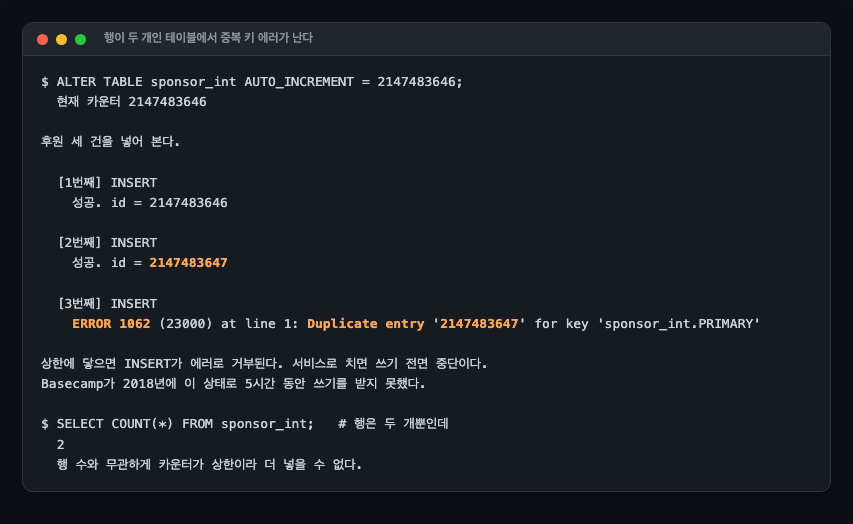
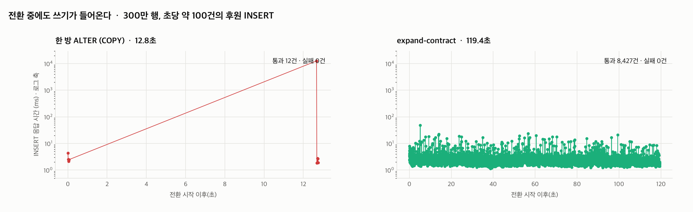
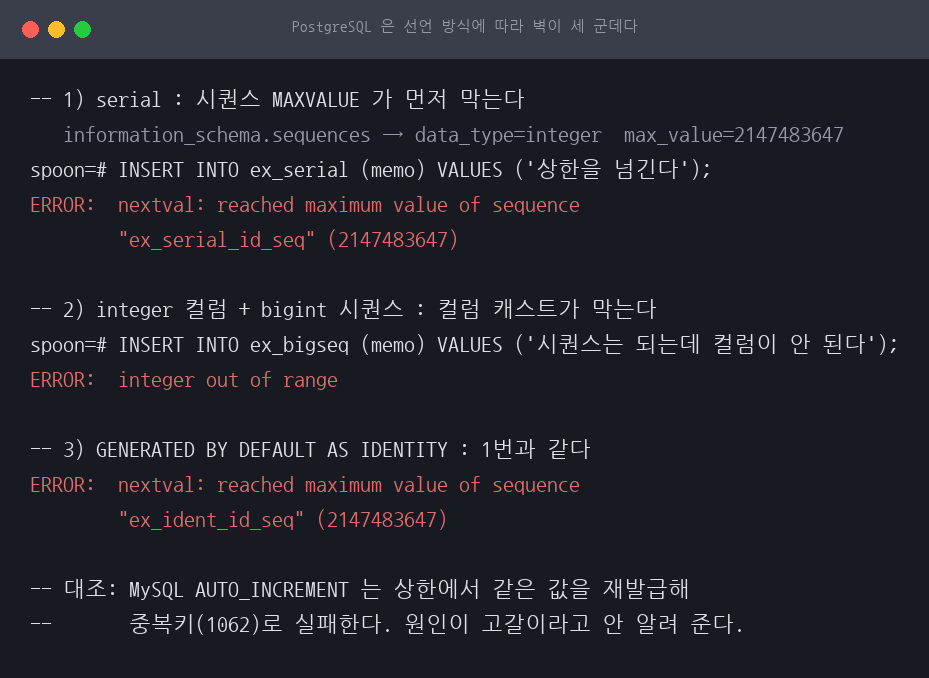
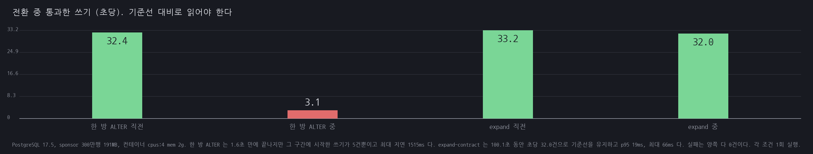

# A01 정수 PK가 21억에 닿는 날, 그리고 무중단으로 옮기기

> 근거 등급: `E1·축소`
> 출처: [Crunchy Data, The Integer at the End of the Universe](https://www.crunchydata.com/blog/the-integer-at-the-end-of-the-universe-integer-overflow-in-postgres) (Basecamp 2018, GitLab 전사 bigint 전환) · [MySQL 8.4, Online DDL Operations](https://dev.mysql.com/doc/refman/8.4/en/innodb-online-ddl-operations.html) · [MySQL 8.4, Server System Variables `lock_wait_timeout`](https://dev.mysql.com/doc/refman/8.4/en/server-system-variables.html#sysvar_lock_wait_timeout)

## 1. 유명한 이유

2018년 11월, Basecamp가 5시간 동안 쓰기를 받지 못했습니다. `INT` 기본키가 21억(2,147,483,647)에 닿았기 때문입니다. GitLab도 같은 이유로 전사 차원의 bigint 전환 프로젝트를 진행했습니다.

이 사고가 고약한 이유는 셋입니다.

첫째, **예고 없이 옵니다.** 디스크가 차면 사용률이 오르고, 메모리가 부족하면 스왑이 늘어납니다. 그런데 AUTO_INCREMENT는 21억에 닿기 직전까지 아무 신호도 내지 않다가 그 순간 쓰기가 전면 중단됩니다.

둘째, **행 수와 무관합니다.** 삭제를 반복해 실제 행은 몇만 개인데 카운터만 21억까지 올라간 테이블도 똑같이 터집니다. `SELECT COUNT(*)`를 보고 안심하면 안 됩니다.

셋째, **고치는 일이 그 자체로 위험합니다.** 컬럼 타입을 바꾸는 것은 테이블 재구축이고, 21억 행짜리 테이블에서는 그동안 서비스가 멈춥니다.

## 2. 재현: 상한에 닿는 순간

### 환경

| 항목 | 값 |
|---|---|
| 호스트 | 기록하지 않았습니다 |
| DB | MySQL 8.4.3 (컨테이너 `cpus: 4`, `mem_limit: 2g`, 버퍼 풀 1GB) |
| 데이터 | 실험 1은 행 2개, 실험 2는 300만 행 × 2벌 (sponsor_a 167MB) |
| 동시 부하 | Python 단일 커넥션, INSERT 사이 10ms 대기. 전환 직전 5초 실측 초당 62~67건 |
| 측정 | 방법별 1회. 반복 측정하지 않았으므로 관측 범위가 없습니다 |

**호스트 사양을 찍어 남기지 않았습니다.** 아래 시간 수치는 전부 절대 시간이라 어느 장비였는지가 중요한데, `uname -srm`도 `nproc`도 실행하지 않았습니다. 확인되는 것은 `compose.yml`의 `cpus: 4`가 4코어 미만 호스트에서 컨테이너 기동을 막는다는 것뿐이라, 이 저장소가 사양을 남긴 2코어 리눅스 서버는 아닙니다. 그 이상은 추정입니다. 이 세션의 절대 시간을 다른 세션의 절대 시간과 이어 붙여 읽으면 안 됩니다.

### 카운터만 상한 직전으로 밀기

행을 21억 개 넣을 수는 없으므로 AUTO_INCREMENT 카운터만 상한 직전으로 밀었습니다. **데이터 양이 아니라 카운터 값이 문제**라는 것이 이 사고의 본질이라, 이 축약이 메커니즘을 훼손하지 않습니다. 근거 등급에 `축소`를 붙인 것이 이 뜻입니다.



```console
$ ALTER TABLE sponsor_int AUTO_INCREMENT = 2147483646;
  현재 카운터 2147483646

후원 세 건을 넣어 본다.

  [1번째] INSERT
    성공. id = 2147483646

  [2번째] INSERT
    성공. id = 2147483647

  [3번째] INSERT
    ERROR 1062 (23000) at line 1: Duplicate entry '2147483647' for key 'sponsor_int.PRIMARY'

상한에 닿으면 INSERT가 에러로 거부된다. 서비스로 치면 쓰기 전면 중단이다.
Basecamp가 2018년에 이 상태로 5시간 동안 쓰기를 받지 못했다.

$ SELECT COUNT(*) FROM sponsor_int;   # 행은 두 개뿐인데
  2
  행 수와 무관하게 카운터가 상한이라 더 넣을 수 없다.
```

### 에러 메시지가 원인을 가립니다

이 세션에서 가장 값진 발견입니다. 상한에 닿았을 때 나오는 에러는 "AUTO_INCREMENT 범위 초과"가 아니라 **중복 키 에러**입니다.

카운터가 상한에 도달하면 더 올라가지 못하고 같은 값(2147483647)을 계속 내줍니다. 그 값은 이미 앞 행이 쓰고 있으므로 유니크 제약에 걸립니다. **행이 두 개뿐인 테이블에서 중복 키 에러가 나는 상태**라, 로그만 보고 원인을 짚기가 어렵습니다. 애플리케이션 로그에는 "Duplicate entry"만 찍히고, 개발자는 동시성 문제나 애플리케이션 버그를 먼저 의심하게 됩니다.

`ERROR 1062`가 갑자기 대량으로 뜨는데 값이 항상 같다면 카운터 상한을 먼저 확인해야 합니다.

## 3. 해소: 쓰기가 들어오는 중에 옮기기

300만 행 테이블 두 벌을 같은 조건으로 만들고, **후원 INSERT가 계속 들어오는 상태에서** 두 방법을 비교했습니다. 판단 기준은 소요 시간이 아니라 그동안 쓰기가 어떻게 됐는가입니다.

부하 스크립트는 INSERT 하나를 던지고 10ms 쉬는 단일 커넥션이라 설정상 상한이 초당 100건인데, 왕복 시간이 붙어 실측은 그보다 낮습니다. 전환 시작 직전 5초를 CSV에서 세면 방법 A 쪽이 초당 66.5건, 방법 B 쪽이 61.7건입니다. 두 실행이 같은 부하를 받았는지는 이 기준선으로 확인했습니다.

### 먼저, 한 방 ALTER는 온라인이 안 됩니다

```console
$ ALTER TABLE sponsor_a MODIFY id BIGINT AUTO_INCREMENT, ALGORITHM=INPLACE, LOCK=NONE;
ERROR 1846 (0A000) at line 1: ALGORITHM=INPLACE is not supported. Reason: Cannot change column type INPLACE. Try ALGORITHM=COPY.
```

엔진이 거부합니다. 컬럼 타입 변경은 테이블을 통째로 다시 만들어야 하므로 `ALGORITHM=COPY`밖에 없고, COPY는 정의상 온라인이 아닙니다. **"온라인 DDL로 하면 되지 않나"라는 선택지가 엔진 차원에서 닫혀 있습니다.**

### 두 방법의 실측



| 방법 | 소요 | 통과한 쓰기 | 초당 | 전환 직전 초당 | 실패 | p95 | 최대 |
|---|---|---|---|---|---|---|---|
| 한 방 ALTER (COPY) | **12.8초** | 11건 | **0.9건** | 66.5건 | 0 | 12,602ms | 12,602ms |
| expand-contract | 119.4초 | 8,427건 | **70.6건** | 61.7건 | 0 | **3.8ms** | 49ms |

숫자를 읽는 순서가 중요합니다.

**통과한 쓰기 11건과 8,427건을 나란히 놓으면 안 됩니다.** 관측 창이 12.8초와 119.4초로 다르기 때문에 같은 축의 값이 아닙니다. 같은 축으로 놓은 것이 `초당` 열이고, 여기에 전환 직전 기준선을 붙여야 판단이 섭니다. 방법 A는 초당 66.5건에서 0.9건으로 떨어졌고, 방법 B는 61.7건에서 70.6건으로 떨어지지 않았습니다.

**실패는 양쪽 다 0건입니다.** 그런데 한 방 ALTER 구간에서는 11건만 통과했고, 그중 하나는 **12,602ms(12.6초) 매달려 있다가** 성공했습니다. 건별 기록을 열면 더 분명합니다. 앞의 아홉 건은 ALTER가 락을 잡기 전 첫 0.13초에 2~14ms로 통과했고, 열째 한 건이 12.6초를 기다렸다가 성공했으며, 마지막 한 건은 락이 풀린 뒤 1.8ms에 지나갔습니다. **12.8초짜리 전환에서 쓰기가 한 건도 완료되지 않은 구간이 12.6초입니다.** 에러 카운터만 보는 모니터링이라면 이 12.8초를 정상으로 기록합니다. 사용자는 12초짜리 로딩 화면을 봤는데 말입니다.

**실패 건수가 0이라고 무중단이 아닙니다.** 무중단인지는 그동안 몇 건이 정상 지연으로 통과했는지로 판단해야 합니다.

표의 방법 A `p95`는 백분위수가 아닙니다. 표본이 11건이라 집계 스크립트가 20건 미만일 때 최댓값으로 대체합니다. 그래서 p95 열과 최대 열이 같은 값입니다. 방법 B의 3.8ms만 백분위수입니다.

expand-contract는 총 119초로 9.3배 오래 걸렸습니다. 대신 그 시간 내내 8,427건이 p95 3.8ms로 지나갔습니다. 최대도 49ms이고, 100ms를 넘긴 건이 한 건도 없습니다. **총 시간을 대가로 지불하고 사용자 경험을 산 것**이고, 이것이 무중단 마이그레이션의 정확한 거래 조건입니다.

### expand-contract 3단계 분해

| 단계 | 작업 | 소요 |
|---|---|---|
| 1. expand | `ADD COLUMN id_new BIGINT NULL` (INPLACE, LOCK=NONE) | 5.3초 |
| 2. backfill | 2만 행씩 151회 청크 UPDATE | 112.6초 |
| 3. 잔여 | 백필 중 들어온 새 행 6건 마저 채움 | 1.1초 |

백필이 전체의 94%를 차지합니다. 그리고 백필이 끝난 시점에 **NULL이 6건 남아 있었습니다.** 백필이 도는 동안 새로 들어온 행들입니다. 이 잔여분을 처리하는 단계가 없으면 전환이 완료되지 않습니다. 실제 운영에서는 이 자리에서 애플리케이션이 두 컬럼을 함께 쓰도록 배포한 뒤 컬럼명을 교체합니다.

## 4. 예상과 달랐던 점

### 실패 0건이 판단 기준이 될 수 없었습니다

측정을 설계할 때 "전환 중 쓰기 실패 건수"를 핵심 지표로 잡았습니다. `exp2-migrate.sh`에 그 문장이 그대로 박혀 있고 `results/exp2.txt` 마지막 줄로 출력됩니다. 재 보니 양쪽 다 0이었습니다. 실행 출력이라 손대지 않고 두었지만, 이 실행이 그 기준을 반증했습니다. 지표를 하나 더 봐야 갈렸습니다. 통과한 건수와 그 지연입니다.

MySQL 클라이언트는 락 대기를 에러로 만들지 않고 기다립니다. 그래서 12.6초를 기다린 INSERT도 "성공"으로 집계됩니다. **가용성을 에러율로만 재면 이런 종류의 장애가 보이지 않습니다.**

기다린 상한이 무엇이었는지는 갈라 둬야 합니다. 처음에는 `innodb_lock_wait_timeout`(기본 50초)이 상한이라고 적었는데 틀렸습니다. 이 INSERT를 세운 것은 행 락이 아니라 `ALTER TABLE ... ALGORITHM=COPY`가 잡는 메타데이터 락이고, 메타데이터 락 대기를 관장하는 변수는 `lock_wait_timeout`입니다. 두 변수는 대상도 기본값도 다릅니다. `innodb_lock_wait_timeout`은 행 락에 걸리고 기본값이 50초, `lock_wait_timeout`은 메타데이터 락에 걸리고 기본값이 31,536,000초, 곧 1년입니다(A02 세션에서 같은 값을 실측했습니다). 이 실험의 12.6초가 50초를 넘지 않은 것은 우연이고, 기본 설정에서 이 INSERT의 대기 상한은 사실상 없습니다. ALTER가 30분 걸리면 30분을 기다렸다가 성공으로 집계됩니다. 타임아웃이 구해 줄 것이라는 기대가 성립하지 않는다는 뜻이라, 처음 적은 것보다 오히려 나쁜 이야기입니다.

### 온라인 DDL이라는 선택지가 아예 없었습니다

`ALGORITHM=INPLACE, LOCK=NONE`을 붙이면 될 것으로 봤는데 엔진이 거부했습니다. 컬럼 추가는 됩니다. 이 세션의 expand 1단계가 같은 옵션으로 통과해 5.3초에 끝났습니다. 추가와 변경은 다릅니다. 전자는 메타데이터만 바꾸면 되고 후자는 모든 행의 물리 표현이 달라집니다.

이 대비를 처음에는 B43(expand-contract) 세션에서 확인했다고 적었는데 잘못된 귀속이었습니다. B43은 PostgreSQL로 재현한 세션이고, MySQL은 문서로만 짚으면서 "MySQL에서 같은 실험을 돌리지는 않았습니다"라고 명시해 두었습니다. MySQL에서 `ADD COLUMN`이 INPLACE로 통과하는 것을 실제로 확인한 것은 이 세션입니다.

### 재현 도구에서 히어독 한 줄을 잘못 놓쳤습니다

측정 스크립트에서 `echo $! > pid` 를 히어독 본문 안에 두는 바람에 그 줄이 파이썬 코드로 해석돼 writer 프로세스가 즉시 죽었습니다. CSV가 비어 있는데도 스크립트는 끝까지 돌았고, 집계는 "0건"을 출력했습니다. 히어독은 명령 줄 다음 줄부터 종료 표시까지가 본문이라 `&`로 백그라운드에 넣어도 마찬가지입니다. **측정값이 0으로 나올 때 "정말 0인가, 측정이 안 된 건가"를 먼저 확인해야 합니다.**

### 차트가 실행 로그를 반박하고 있었습니다

첫 판의 `report.py`는 소요 시간을 상수로 적어 두고 건수는 CSV에서 다시 셌습니다. 그런데 전환 시작 시각을 "writer 첫 기록 + 5초"로 잡는 바람에 방법 A가 로그의 11건이 아니라 12건으로 나왔고, 그 12건이 차트와 본문에 함께 실렸습니다. 지금은 스크립트가 소요·건수·실패·p95·최대를 전부 `results/exp2.txt`에서 읽고, 로그의 건수와 맞는 창을 찾지 못하면 그림을 만들지 않고 멈춥니다. 라벨의 출처는 언제나 실행 로그여야 합니다.

## 5. PostgreSQL 대조

`scripts/exp3-pg.sh`, 원문은 `results/exp3-pg.txt`. PostgreSQL 17.5, 같은 300만 행(191MB),
컨테이너 `cpus: 4` `mem_limit: 2g`. 조건마다 1회 실행입니다.

### 5.1 고갈 지점이 선언 방식에 따라 셋으로 갈린다



| 선언 | 막는 쪽 | 에러 |
|---|---|---|
| `serial` | 시퀀스 MAXVALUE | `nextval: reached maximum value of sequence "..." (2147483647)` |
| `integer` 컬럼 + `bigint` 시퀀스 | 컬럼 캐스트 | `integer out of range` |
| `GENERATED BY DEFAULT AS IDENTITY` | 시퀀스 MAXVALUE | 첫째와 같은 문구 |
| (대조) MySQL `INT AUTO_INCREMENT` | 유니크 인덱스 | `ERROR 1062 (23000): Duplicate entry '2147483647' for key 'sponsor_int.PRIMARY'` |

진단 난이도가 다릅니다. PostgreSQL 은 세 경우 모두 **무엇이 고갈됐는지 문구가 말해 줍니다.**
MySQL 은 중복키 에러라, 상한에서 같은 값을 재발급하다 유니크 인덱스에 걸린 것인데 문구만
보면 애플리케이션이 같은 키를 두 번 넣은 것과 구별되지 않습니다.

`serial` 과 IDENTITY 가 같은 문구인 이유는 IDENTITY 도 뒤에 `integer` 시퀀스를 두기
때문입니다. 두 번째 경우는 시퀀스를 `AS bigint` 로 따로 만들어 붙였을 때만 나옵니다.

### 5.2 한 방 ALTER 를 미리 막아 주는 쪽은 MySQL 이다

MySQL 은 요청을 거부합니다.

```console
ERROR 1846 (0A000): ALGORITHM=INPLACE is not supported.
Reason: Cannot change column type INPLACE. Try ALGORITHM=COPY.
```

PostgreSQL 에는 이 사전 거부가 없습니다. `ALTER TABLE ... ALTER COLUMN id TYPE bigint` 를
그대로 받아들이고 `AccessExclusiveLock` 을 쥔 채 테이블을 다시 씁니다.

```console
$ ALTER TABLE sponsor_a ALTER COLUMN id TYPE bigint;
ALTER TABLE                     -- 1.6초

관측된 락: AccessExclusiveLock, RowExclusiveLock, ShareLock
서버 로그:
  LOG:  process 85685 still waiting for RowExclusiveLock ... after 200.171 ms
  LOG:  process 85685 acquired RowExclusiveLock ... after 1497.206 ms
```

쓰기 부하 쪽에서 본 값입니다.

| | 기준선(직전 5초) | 전환 구간 | 최대 지연 | 실패 |
|---|---|---|---|---|
| 한 방 ALTER (1.6초) | 초당 32.4건 | 초당 3.1건 (5건) | **1,515ms** | 0 |
| expand-contract (100.1초) | 초당 33.2건 | 초당 32.0건 (3,205건) | 66ms (p95 19ms) | 0 |

MySQL 쪽과 결론이 같습니다. 실패 0건이 무중단의 근거가 되지 못하고, 1.6초짜리 전환에서
한 건이 1.5초를 매달려 있었습니다. 서버 로그의 1,497ms 대기가 같은 사건을 서버 쪽에서
찍은 것입니다.



### 5.3 단계별 비교

| 단계 | MySQL 8.4.3 | PostgreSQL 17.5 |
|---|---|---|
| 1. expand (`ADD COLUMN`) | 5.3초 | **0.06초** |
| 2. backfill (2만 행 청크) | 151회 112.6초 | 151회 99.6초 |
| 3. 잔여 | 6건 1.1초 | 3,193건 0.32초 |
| 합계 | 119.4초 | 100.1초 |

`ADD COLUMN` 이 88배 차이 나는 것이 눈에 띕니다. PostgreSQL 11 부터 기본값 없는 컬럼 추가는
카탈로그만 고치므로 테이블 크기와 무관합니다. MySQL 은 `ALGORITHM=INPLACE` 로도 실제 작업이
남습니다.

**3단계 잔여 건수는 두 값을 나란히 놓으면 안 됩니다.** 경계를 다른 데 그었습니다. MySQL
스크립트는 청크가 2만 미만을 고치면 그 자리에서 벌크를 끝내므로, 부하가 넣은 행 대부분이
이미 2단계에 흡수됐고 잔여는 마지막 순간의 6건입니다. PostgreSQL 쪽은 시작 시점의 최대
id 를 워터마크로 잡아 벌크를 그 범위로 묶었으므로, 부하가 넣은 3,193건 전부가 3단계로
떨어집니다. 총 작업량은 같고 회계만 다릅니다.

벌크 청크가 양쪽 151회로 같은 것은 이 비교의 전제입니다. 처음에는 PostgreSQL 루프를
`WHERE id_new IS NULL` 로만 돌렸는데, 그러면 부하가 방금 넣은 20~30행짜리 청크를 계속
쫓아 수렴하지 않았습니다(벌크 151회 뒤 1,400회 넘게 이어졌습니다). 워터마크로 묶어야
MySQL 쪽과 같은 구조가 됩니다.

## 6. INT UNSIGNED 로 미루는 선택지

`scripts/exp4-unsigned.sh`, 원문은 `results/exp4-unsigned.txt`. 300만 행에서 같은 테이블을
두 목표로 각각 전환했습니다.

| 목표 | `ALGORITHM=INPLACE` | COPY 소요 | 상한 | 벌어들이는 여유 |
|---|---|---|---|---|
| `INT UNSIGNED` | 거부 (1846) | 4.5초 | 4,294,967,295 | **2배** |
| `BIGINT` | 거부 (1846) | 4.7초 | 9,223,372,036,854,775,807 | 약 43억 배 |

**전환 비용의 성격이 같습니다.** 둘 다 `ALGORITHM=INPLACE` 를 같은 에러 1846 으로 거부당하고
COPY 로만 됩니다. 소요도 4.5초와 4.7초로 이 규모에서는 구별되지 않습니다. 3절에서 본
"COPY 구간에는 쓰기가 통과하지 못한다"도 양쪽에 똑같이 적용됩니다.

그러니까 `INT UNSIGNED` 를 고르는 것은 같은 값을 치르고 2배만 사는 선택입니다. 21억을 채우는
데 걸린 시간과 같은 시간이 지나면 42억도 채웁니다. 그때 다시 같은 COPY 를 한 번 더 해야 하고,
그 사이에 테이블은 더 커져 있습니다.

전환 후 크기는 양쪽 다 104MB 로 찍혔습니다. `BIGINT` 가 행마다 4바이트를 더 쓰므로 300만
행이면 약 12MB 차이가 나야 하는데 드러나지 않았습니다. 이 값은 `information_schema` 의
추정치이고 MB 단위로 반올림한 것이라 그 차이를 보기에는 해상도가 부족합니다. 크기 차이는
이 측정으로 말할 수 없습니다.

## 7. 온라인 DDL 도구 둘과 같은 전환

`scripts/exp5-pt-osc.sh`, 원문은 `results/exp5-pt-osc.txt`. 300만 행, 같은 쓰기 부하
(INSERT 하나 던지고 10ms 쉬는 단일 커넥션).

| 방식 | 소요 | 그 구간 통과한 쓰기 | 초당 | 직전 기준선 | p95 | 최대 |
|---|---|---|---|---|---|---|
| 한 방 ALTER (COPY) | 4.6초 | 3건 | 0.6건 | 초당 47.0건 | **4,576ms** | 4,576ms |
| `pt-online-schema-change` | 11.8초 | 500건 | 42.3건 | 초당 47.8건 | 16ms | 74ms |
| **`gh-ost`** | **27.5초** | **1,432건** | **52.1건** | 초당 54.0건 | **7ms** | 998ms |

**도구를 쓰면 오래 걸리는 대신 쓰기가 흐릅니다.** 한 방 ALTER 는 4.6초 동안 3건만
통과시키고 그중 하나가 4.6초를 매달려 있었습니다. 두 도구는 기준선의 88.5% 와 96.5% 를
유지합니다.

### 7.1 두 도구가 변경분을 따라가는 방식이 다르다

`pt-online-schema-change` 는 원본에 INSERT/UPDATE/DELETE 트리거를 겁니다. 복사가 도는
동안 들어오는 모든 쓰기가 그 트리거를 한 번씩 더 지납니다.

`gh-ost` 는 트리거를 걸지 않고 **binlog 를 읽습니다.** 로그가 그 구조를 그대로 보여 줍니다.

```console
# Migrating `spoon`.`sponsor_gh`; Ghost table is `spoon`.`_sponsor_gh_gho`
Copy: 3000583/3000583 100.0%; Applied: 1167; Backlog: 0/1000; Time: 21s(total), 21s(copy);
  streamer: binlog.000004:252355761; Lag: 0.01s, HeartbeatLag: 0.09s, State: migrating
# Done
```

`Copy` 는 기존 행 복사이고 `Applied` 는 그동안 들어온 변경분입니다. **둘이 분리돼 있고
백로그가 1,000짜리 큐로 관리됩니다.** 원본 쓰기 경로에는 아무것도 얹히지 않으므로 p95 가
7ms 로 셋 중 가장 낮습니다.

대가는 시간입니다. 27.5초로 pt-osc 의 2.3배입니다. binlog 를 읽어 따라가는 만큼 복사를
느리게 하고, 지연이 늘면 스스로 속도를 줄입니다.

### 7.2 셋 다 어딘가에서 한 번은 멈춘다

`gh-ost` 의 최대 지연 998ms 는 마지막 컷오버 구간입니다. 새 테이블로 이름을 바꾸는 그
순간에는 어떤 방식이든 잠깐 멈춥니다. **차이는 멈추느냐가 아니라 그 멈춤이 4,576ms 냐
998ms 냐입니다.**

### 7.3 밟은 함정 셋

1. **`caching_sha2_password` 가 비암호화 인증을 거부합니다.** pt-osc 쪽에서 걸렸습니다.
   `Authentication requires secure connection.`

2. **흔한 우회인 `mysql_native_password` 가 MySQL 8.4 에는 없습니다.**
   `Plugin 'mysql_native_password' is not loaded`. 8.0 에서 deprecated 였고 **8.4 에서
   제거됐습니다.** 남는 길은 `--mysql_ssl 1` 입니다.

3. **`gh-ost` 는 공개 컨테이너 이미지가 없습니다.** `ghcr.io/github/gh-ost` 는 접근이
   거부되고 Docker Hub 에도 없습니다. 소스에서 빌드했고 `go.mod` 가 Go 1.25.12 이상을
   요구해 1.24 로는 안 됩니다. 빌드 절차는 `tools/gh-ost/README.md` 에 적었습니다.

## 못 한 것

- **호스트 사양을 기록하지 않았습니다.** 컨테이너 할당량만 있고 어느 장비인지 확인되지 않아, 이 글의 절대 시간은 다른 세션의 절대 시간과 비교할 수 없습니다.
- **한 번씩만 쟀습니다.** 두 방법 모두 1회 실행이라 관측 범위가 없습니다. 12.8초와 119.4초가 재실행에서 얼마나 흔들리는지 모릅니다. 두 방법의 구조 차이는 이 정도 격차에서 뒤집히지 않지만, 소수점 자리를 그대로 인용하면 안 됩니다.
- **실제 21억 행에서 재지 않았습니다.** 300만 행에서 COPY가 12.8초였으니 21억 행이면 산술적으로 두 시간대인데, 그 규모의 I/O 특성은 선형이 아닙니다. 절대값이 아니라 두 방법의 구조 차이를 봐야 합니다.
- **컬럼명 교체 단계를 실행하지 않았습니다.** 애플리케이션이 두 컬럼을 함께 쓰는 배포가 전제라, DB 쪽 작업만 쟀습니다.
- **전환 후 테이블 크기 차이를 재지 못했습니다.** 6절의 104MB 는 `information_schema` 추정치를 MB 로 반올림한 값이라 `BIGINT` 의 4바이트 차이가 드러나지 않습니다. `SHOW TABLE STATUS` 나 파일 크기로 다시 재야 합니다.
- **PostgreSQL 쪽도 1회씩만 쟀습니다.** 5절의 값도 반복 측정과 분산이 없습니다.
- **`gh-ost` 의 컷오버 옵션을 비교하지 않았습니다.** 기본 컷오버만 썼고 `--cut-over=two-step` 이나 `--postpone-cut-over-flag-file` 같은 선택지는 재지 않았습니다.
- **7절도 조건마다 1회씩입니다.** 4.6초와 11.8초에 반복 측정이 없습니다.
