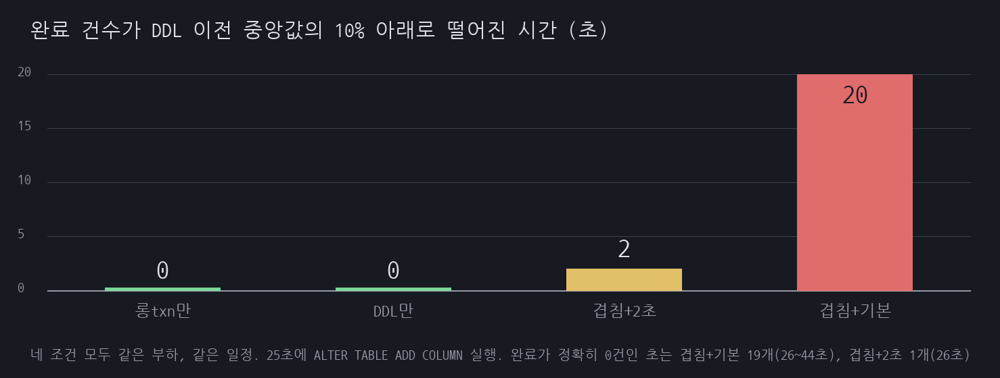
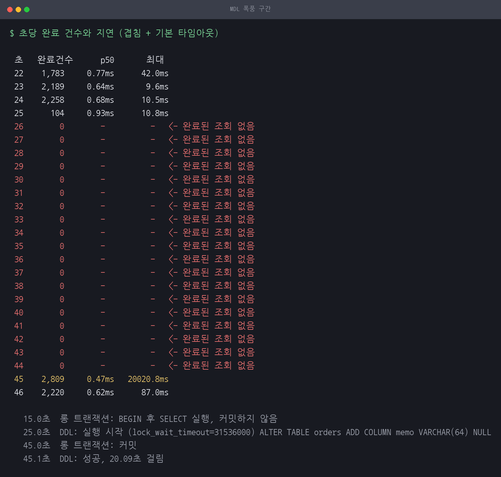
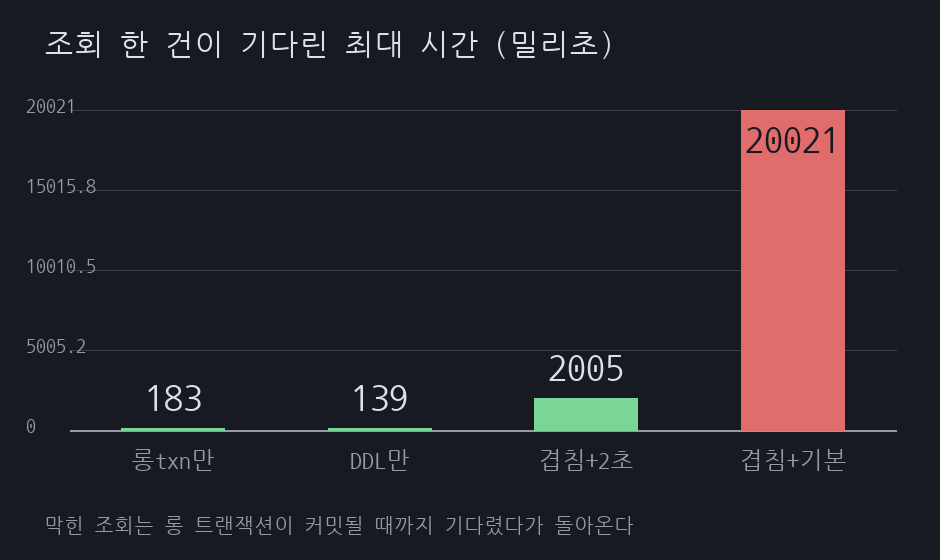
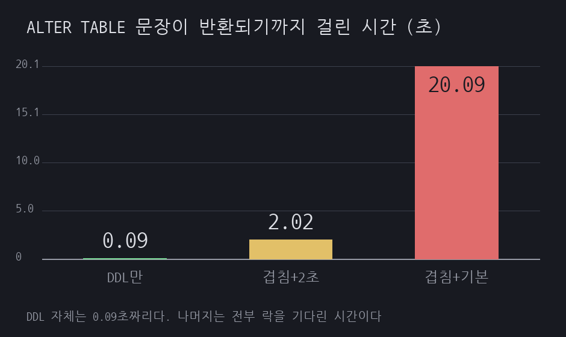

# A02 0.09초짜리 DDL이 20초 동안 조회를 세웠다

> 근거 등급: `E2`
> 출처: [MySQL 8.4 Reference, Metadata Locking](https://dev.mysql.com/doc/refman/8.4/en/metadata-locking.html), [Online DDL Performance, Concurrency, and Space Requirements](https://dev.mysql.com/doc/refman/8.4/en/innodb-online-ddl-performance.html), [Online DDL Operations](https://dev.mysql.com/doc/refman/8.4/en/innodb-online-ddl-operations.html), [Server System Variables, `lock_wait_timeout`](https://dev.mysql.com/doc/refman/8.4/en/server-system-variables.html#sysvar_lock_wait_timeout), [InnoDB Startup Options and System Variables, `innodb_lock_wait_timeout`](https://dev.mysql.com/doc/refman/8.4/en/innodb-parameters.html#sysvar_innodb_lock_wait_timeout)

## 1. 유명한 이유

MySQL에 컬럼 하나를 붙이려다 서비스를 세운 이야기는 흔합니다. 배포 직전에 `ALTER TABLE`을 던졌고, 그 테이블을 읽던 조회가 전부 멈췄고, 정작 DDL은 아무것도 못 하고 대기하고 있었다는 전개입니다.

원인은 메타데이터 락입니다. 매뉴얼은 락의 수명을 이렇게 적습니다.

> The server achieves this by acquiring metadata locks on tables used within a transaction and deferring release of those locks until the transaction ends.

트랜잭션이 끝날 때까지 유지됩니다. 그래서 커밋하지 않은 트랜잭션 하나가 남아 있으면 DDL이 들어가지 못합니다. 여기까지는 "DDL이 기다린다"는 이야기이고 서비스와는 상관이 없어 보입니다. 문제는 그다음 문장입니다.

> Additionally, a pending exclusive metadata lock requested by an online DDL operation blocks subsequent transactions on the table.

대기 중인 DDL이 그 뒤에 오는 트랜잭션을 막습니다. 조회 하나하나는 서로를 막지 않지만, 가운데 낀 DDL이 벽이 됩니다.

MySQL 8.4에는 반전이 하나 더 붙습니다. 매뉴얼은 `INSTANT is the default algorithm in MySQL 8.4`라고 적습니다. 컬럼 추가는 데이터 파일을 건드리지 않고 메타데이터만 고치므로 실행 자체가 순식간에 끝납니다. 그런데도 배타적 메타데이터 락은 필요합니다. 실행 시간이 0에 가까운 DDL이 장애를 만드는 구도가 여기서 나옵니다.

이 세션은 롱 트랜잭션과 DDL과 일반 조회를 한 타임라인에 올려 놓고, 무엇이 무엇을 얼마나 막는지를 초 단위로 잽니다.

## 2. 재현

### 환경

| 항목 | 값 |
|---|---|
| 호스트 | Rocky Linux, 커널 5.14.0-570.33.2.el9_6.aarch64, 2코어, 11GB |
| DB | MySQL 8.4.3 (컨테이너 `cpus: 2`, `mem_limit: 2g`) |
| 버퍼 풀 | 1GB, `performance_schema=ON` |
| 데이터 | `orders` 200만 행, 280MB |
| 부하 | PK 점조회, 프로세스 2개, 60초 |

버퍼 풀 1GB에 테이블이 280MB이므로 조회는 전부 메모리에서 끝납니다. 정지 구간이 디스크 때문일 가능성을 없애려는 조건입니다. `performance_schema`를 켠 것은 `metadata_locks` 테이블을 보기 위해서입니다.

### 일정

네 조건 모두 같은 시각에 같은 일을 합니다.

| 시각 | 하는 일 |
|---|---|
| 0초 | 조회 부하 시작 |
| 15초 | 세션 L이 `BEGIN` 후 `SELECT` 한 번. 커밋하지 않음 |
| 25초 | 세션 D가 `ALTER TABLE orders ADD COLUMN memo VARCHAR(64) NULL` |
| 45초 | 세션 L이 커밋 |
| 60초 | 측정 종료 |

조건은 넷입니다. 롱 트랜잭션만 도는 대조군, DDL만 도는 대조군, 둘이 겹치는 조건, 겹치되 `lock_wait_timeout`을 2초로 줄인 조건입니다. 대조군 둘이 있어야 정지가 롱 트랜잭션 탓인지 DDL 탓인지 겹침 탓인지 가릴 수 있습니다.

### 결과

| 조건 | DDL 이전 초당 | 전면 정지 | 최대 지연 | DDL 결과 |
|---|---|---|---|---|
| 롱 트랜잭션만 (DDL 없음) | 3,464건 | 0초 | 183ms | 실행 안 함 |
| DDL만 (롱 트랜잭션 없음) | 3,658건 | 0초 | 139ms | 성공, 0.09초 |
| 겹침 + `lock_wait_timeout` 2초 | 3,576건 | 2초 | 2,005ms | 실패(1205), 2.02초 |
| 겹침 + 기본 타임아웃 | 2,462건 | 20초 | 20,021ms | 성공, 20.09초 |

"DDL 이전 초당"은 0초부터 24초까지 초당 완료 건수의 중앙값입니다. 네 조건 모두 DDL이 25초에 들어가므로 이 구간에는 아직 아무 개입도 없습니다. 조건 사이의 차이를 설정의 효과로 읽으면 안 되고, 그 이유는 5절에 따로 적었습니다.



"전면 정지"는 그 초의 완료 건수가 위 중앙값의 10% 아래인 초를 셉니다. 겹침 + 기본 타임아웃 조건에서 여기 걸린 초는 25초부터 44초까지 20개입니다. 그중 완료 건수가 정확히 0인 초는 26초부터 44초까지 19개이고, 25초에는 104건이 완료됐습니다. `lock_wait_timeout` 2초 조건의 정지 2초도 마찬가지로 25초(68건)와 26초(0건)입니다. 정지 길이와 완전 무응답 길이가 1초씩 다릅니다.



25초에 DDL이 들어가고 26초부터 44초까지 완료 건수가 0입니다. 45초에 롱 트랜잭션이 커밋되자 밀려 있던 조회가 한꺼번에 돌아왔고, 그중 가장 오래 기다린 것이 20,020.8ms입니다.

여기서 짚을 것이 둘입니다. 첫째, 롱 트랜잭션만 있을 때는 정지가 0초입니다. 트랜잭션이 30초 동안 락을 쥐고 있어도 다른 조회는 아무 영향을 받지 않습니다. 둘째, DDL만 있을 때도 정지가 0초이고 DDL은 0.09초에 끝납니다. 각각은 무해합니다.

### 대기 큐

`performance_schema.metadata_locks`를 1초마다 훑었습니다. 겹침 조건의 25.1초 스냅샷입니다.

```
granted 2 / pending 3
  EXCLUSIVE:PENDING
  SHARED_READ:GRANTED
  SHARED_READ:PENDING
  SHARED_UPGRADABLE:GRANTED
```

`SHARED_READ:GRANTED`는 롱 트랜잭션이 쥔 것입니다. `SHARED_UPGRADABLE:GRANTED`와 `EXCLUSIVE:PENDING`은 DDL이 쥔 것과 원하는 것입니다. 그리고 `SHARED_READ:PENDING`이 일반 조회입니다. 조회가 롱 트랜잭션을 기다리는 것이 아니라 그 앞에 선 DDL을 기다리고 있습니다.

대조군 두 조건에서는 DDL 실행 이후 구간에 대기 중인 락이 잡히지 않았습니다.

## 3. 내부 원리

메타데이터 락은 테이블의 정의를 보호합니다. 어떤 세션이 테이블을 읽는 중에 다른 세션이 그 테이블의 구조를 바꾸면 안 되기 때문에, 조회는 `SHARED_READ`를, DDL은 `EXCLUSIVE`를 잡습니다. 둘은 서로 충돌합니다.

수명은 문장이 아니라 트랜잭션에 묶입니다. 매뉴얼은 오토커밋일 때 "metadata locks acquired for the statement are held only to the end of the statement"라고 적고, 명시적 트랜잭션에서는 트랜잭션이 끝날 때까지 유지된다고 적습니다. 이 실험의 롱 트랜잭션이 `SELECT` 한 번만 하고 30초를 놀아도 락을 계속 쥐고 있는 이유입니다.

DDL이 막히는 것까지는 여기서 설명됩니다. 조회까지 막히는 이유는 대기 큐의 우선순위에 있습니다. 매뉴얼은 이렇게 적습니다.

> If there are multiple waiters for a given lock, the highest-priority lock request is satisfied first ... Write lock requests have higher priority than read lock requests.

DDL의 배타적 락 요청이 뒤에 오는 읽기 락 요청보다 우선합니다. 그래서 조회는 앞선 DDL이 처리될 때까지 큐에서 기다립니다. DDL은 롱 트랜잭션을 기다리고, 조회는 DDL을 기다리는 사슬이 만들어집니다.

`ALGORITHM=INPLACE, LOCK=NONE`으로 지정해도 이 사슬은 끊기지 않습니다. 온라인 DDL 문서가 그 이유를 적습니다.

> In the commit table definition phase, the metadata lock is upgraded to exclusive to evict the old table definition and commit the new one. Once granted, the duration of the exclusive metadata lock is brief.

> Due to the exclusive metadata lock requirements outlined above, an online DDL operation may have to wait for concurrent transactions that hold metadata locks on the table to commit or rollback.

배타적 락을 쥐고 있는 시간은 짧습니다. 문제는 그것을 **얻기까지** 기다리는 시간이고, 그 대기 자체가 뒤의 조회를 막습니다. "온라인 DDL"이라는 이름은 DDL이 도는 동안 DML을 허용한다는 뜻이지, 락을 기다리지 않는다는 뜻이 아닙니다.

8.4에서 `ADD COLUMN`이 `INSTANT`로 처리되는 것도 같은 이야기입니다. 실행 단계가 사라져도 락을 잡는 단계는 남습니다. 이 실험에서 DDL 단독 조건의 소요가 0.09초였고 겹침 조건이 20.09초였는데, 그 차이 20초는 전부 대기입니다.

`INSTANT`가 늘 되는 것은 아닙니다. 매뉴얼은 테이블 하나가 가질 수 있는 행 버전을 64개로 제한합니다(9.1.0부터 255개). 컬럼을 즉시 붙이거나 지울 때마다 행 버전이 하나 늘고, 상한을 넘기면 `ADD COLUMN`과 `DROP COLUMN`이 거부됩니다.

```
ERROR 4092 (HY000): Maximum row versions reached for table test/t1.
No more columns can be added or dropped instantly. Please use COPY/INPLACE.
```

번호만 보고 원인을 단정하면 안 됩니다. 매뉴얼은 행 크기가 상한을 넘길 때도 같은 4092를 보여줍니다. `Column can't be added with ALGORITHM=INSTANT as after this max possible row size crosses max permissible row size` 쪽입니다. 두 경우는 대응이 다르니 메시지 본문까지 읽어야 합니다. 그리고 `ROW_FORMAT=COMPRESSED` 테이블, FULLTEXT 인덱스가 있는 테이블, 데이터 딕셔너리 테이블스페이스에 있는 테이블은 `INSTANT`로 컬럼을 붙이거나 지울 수 없고, 임시 테이블은 `ALGORITHM=COPY`만 됩니다. 이 조건에 걸리면 8.4에서도 `ADD COLUMN`이 0.09초로 끝나지 않으므로 정지 구간의 모양이 달라집니다.

이 세션의 `scripts/mdl.py`가 그 상한에 직접 걸리는 코드입니다. 조건마다 같은 `orders` 테이블에 `memo`를 붙이고, 다음 조건을 시작하기 전에 남아 있으면 지웁니다. 붙이는 것도 지우는 것도 행 버전을 하나씩 올리므로 반복 실행이 쌓이면 4092에 닿습니다. 이번에는 몇 바퀴만 돌려서 실제로 보지는 못했습니다. 반복 측정으로 회차를 늘린다면 조건 사이에 테이블을 다시 만들어 행 버전을 되돌려야 합니다.

## 4. 해소

`lock_wait_timeout`을 짧게 잡고 DDL을 던집니다. 기본값은 31,536,000초, 곧 1년입니다. 사실상 무한정 기다린다는 뜻이고, 기다리는 내내 조회를 막습니다.

```sql
SET SESSION lock_wait_timeout = 2;
ALTER TABLE orders ADD COLUMN memo VARCHAR(64) NULL;
```

2초 안에 락을 못 얻으면 DDL이 `ERROR 1205 (HY000): Lock wait timeout exceeded` 로 죽습니다. DDL이 죽으면 대기 큐가 풀리고 조회가 돌아옵니다. 장애 시간이 DDL의 인내심과 같아지므로, 그 인내심을 짧게 두는 것이 방어입니다.

여기서 번호 하나를 갈라 두어야 합니다. 1205를 내는 타임아웃은 두 개이고, 서로 다른 변수가 관장합니다. 메타데이터 락 쪽은 `lock_wait_timeout` 문서가 적습니다.

> A given statement can require more than one lock, so it is possible for the statement to block for longer than the lock_wait_timeout value before reporting a timeout error. When lock timeout occurs, ER_LOCK_WAIT_TIMEOUT is reported.

`ER_LOCK_WAIT_TIMEOUT`이 1205입니다. 그런데 `innodb_lock_wait_timeout` 문서에도 같은 번호가 있습니다.

> The length of time in seconds an InnoDB transaction waits for a row lock before giving up. The default value is 50 seconds. A transaction that tries to access a row that is locked by another InnoDB transaction waits at most this many seconds for row locks before issuing the following error:
>
> `ERROR 1205 (HY000): Lock wait timeout exceeded; try restarting transaction`

두 변수는 대상도 기본값도 다릅니다. `lock_wait_timeout`은 테이블 정의를 지키는 메타데이터 락에 걸리고 기본값이 31,536,000초입니다. `innodb_lock_wait_timeout`은 행 락에 걸리고 기본값이 50초입니다. 이 세션이 줄인 것은 앞의 것이고, 뒤의 것은 건드리지 않았습니다.

에러 사전은 1205를 InnoDB 관점으로만 설명해서 메타데이터 락 쪽이 잘 보이지 않습니다. 그래서 1205 로그를 보고 `innodb_lock_wait_timeout`부터 줄이는 일이 생기는데, 그렇게 하면 이 세션이 보인 정지는 1초도 줄지 않습니다. 어느 문장이 1205를 냈는지부터 갈라야 합니다. `ALTER`나 `RENAME`이나 `TRUNCATE`가 냈으면 메타데이터 락이고, `UPDATE`나 `SELECT ... FOR UPDATE`가 냈으면 행 락입니다.

DDL은 실패하므로 재시도가 따라와야 합니다. 실무에서는 마이그레이션 도구가 짧은 타임아웃으로 여러 번 시도하고, 매번 실패하면 사람에게 알립니다. 반복해서 실패한다면 그것은 DDL의 문제가 아니라 그 테이블에 롱 트랜잭션이 상주한다는 신호입니다.

근본 쪽도 같이 봅니다. 이 실험에서 락을 쥔 것은 `SELECT` 한 번 하고 커밋하지 않은 트랜잭션이었습니다. 애플리케이션이 트랜잭션을 열어 놓고 외부 호출을 하거나, ORM이 세션을 오래 붙들거나, 관리자가 콘솔에서 `BEGIN`만 치고 자리를 비우면 같은 상태가 됩니다. `information_schema.INNODB_TRX`나 `performance_schema.metadata_locks`로 DDL 전에 확인할 수 있습니다.

## 5. 재계측

같은 부하와 같은 일정에서 `lock_wait_timeout`만 2초로 바꿨습니다.

| 항목 | 기본 타임아웃 | 2초 타임아웃 | 차이 |
|---|---|---|---|
| 전면 정지 | 20초 | 2초 | 18초 단축 |
| 조회 최대 지연 | 20,021ms | 2,005ms | 90% 감소 |
| DDL | 성공, 20.09초 | 실패(1205), 2.02초 | 재시도 필요 |
| DDL 이전 초당 (0~24초) | 2,462건 | 3,576건 | 개입 이전 구간이라 효과가 아님 |




정지가 20초에서 2초로 줄었고, 그 2초는 DDL이 기다리기로 정한 시간과 같습니다. 장애 시간을 설정값 하나로 정할 수 있게 됩니다.

**마지막 행은 이 설정의 성과가 아닙니다.** 처음 쓴 표에는 "평시 초당 처리가 2,462건에서 3,576건으로 대조군 수준으로 회복됐다"고 적혀 있었는데 틀린 귀속이었습니다. `scripts/mdl.py`가 평시 기준선을 잡는 구간은 `sec < args.ddl_at`, 곧 0초부터 24초까지입니다. `ddl_at`은 네 조건 모두 25로 고정이고 `SET SESSION lock_wait_timeout = 2`는 그 25.0초에 실행됩니다. 기준선을 다 잰 다음에 설정이 들어가므로 설정이 그 구간에 영향을 줄 경로가 없습니다.

`results/case-*.json`의 원시값을 보면 더 분명합니다. 겹침 + 기본 타임아웃 조건은 측정이 시작된 0초부터 이미 초당 2,400~2,700건대였고 0~24초 평균이 2,473건입니다. 나머지 세 조건은 같은 구간 평균이 3,549건, 3,692건, 3,715건입니다. DDL 직전 5초만 떼어 보면 2,129건 대 3,537~3,580건으로 40% 차이입니다. 아무 일도 일어나지 않은 구간에서 벌어진 차이이므로 통제하지 못한 실행 간 편차입니다. 2코어 호스트에서 조건마다 60초씩 한 번만 돌렸고, 컨테이너 CPU 할당 말고는 다른 부하를 격리하지 않았습니다.

이 표에서 개입의 효과로 읽어도 되는 것은 정지 길이와 최대 지연과 DDL 결과, 이 셋뿐입니다. 셋 다 25초 이후, 곧 설정이 적용된 뒤 구간에서 나온 값입니다.

대가는 DDL이 실패한다는 것입니다. 이 트레이드오프는 한쪽으로만 기울지 않습니다. 마이그레이션을 반드시 이번 배포에 통과시켜야 한다면 긴 타임아웃이 필요하고, 그 경우 트래픽이 적은 시간대를 골라야 합니다. 다만 기본값 1년은 어느 쪽 선택도 아닙니다.

DDL 단독 조건이 기준선을 줍니다. 롱 트랜잭션이 없을 때 같은 `ALTER`는 0.09초에 끝났고 정지는 0초였습니다. 앞을 비워 두기만 하면 이 DDL은 무해합니다.

## 6. 예상과 달랐던 점

**정지 구간이 집계에서 통째로 사라졌습니다.** 첫 실행에서 스크립트가 "정지된 초 1개"라고 찍었습니다. 20초 정지를 눈으로 보고도 코드가 못 잡은 것인데, 원인은 집계 방식이었습니다. 초당 버킷을 실제로 완료된 조회에서만 만들었기 때문에, 완료가 0건인 초는 버킷 자체가 생기지 않았습니다. 있는 버킷만 훑으며 정지를 세니 26초부터 44초까지가 표에서 빠졌습니다. 가장 심한 구간이 데이터에 아예 없는 상태로 "정상"이라고 보고될 뻔했습니다. 모니터링에서도 같은 일이 일어납니다. 완료된 요청의 지연만 그리는 대시보드는 아무것도 완료되지 않는 구간을 빈 구간으로 그립니다.

**롱 트랜잭션 단독은 무해했습니다.** 롱 트랜잭션이 위험하다는 말을 자주 듣지만, 이 실험에서 30초짜리 트랜잭션이 락을 쥐고 있던 15초부터 44초까지 초당 완료 건수의 중앙값은 3,446건이었고 전면 정지는 0초, 60초 전체의 최대 지연은 183ms였습니다. DDL이 끼어들어야 문제가 됩니다. 위험한 것은 롱 트랜잭션 자체가 아니라 롱 트랜잭션과 DDL이 만나는 시점입니다.

**DDL이 20.09초 걸렸다는 기록만 보면 원인을 잘못 짚습니다.** 로그에 남는 것은 "ALTER가 20초 걸렸다"입니다. 이 숫자를 보면 테이블이 커서 오래 걸렸다고 읽기 쉽고, 실제로는 DDL이 일한 시간이 0.09초입니다. 나머지 20초는 남의 트랜잭션을 기다린 시간입니다. 같은 DDL을 빈 시간에 돌리면 0.09초에 끝납니다.

## 안 한 것

- **gh-ost와 pt-online-schema-change를 돌리지 않았습니다.** 카탈로그의 원래 설계에는 들어 있었는데 이번에는 빼고 `lock_wait_timeout` 쪽만 다뤘습니다. 두 도구도 최종 전환 시점에 배타적 락이 필요하므로 이 세션이 보인 사슬에서 자유롭지 않지만, 그것을 실측하지는 않았습니다.
- **쓰기 부하를 넣지 않았습니다.** 조회만 걸었습니다. `INSERT`나 `UPDATE`도 `SHARED_WRITE` 락을 잡으므로 같은 큐에 서지만, 이 세션의 수치는 읽기 경로만 잰 것입니다.
- **테이블 재작성이 필요한 DDL은 안 다뤘습니다.** `ADD COLUMN`은 8.4에서 `INSTANT`라 실행 자체가 0.09초입니다. `ALGORITHM=COPY`가 필요한 변경은 락을 얻은 뒤에도 오래 걸리므로 정지 구간의 모양이 다릅니다.
- **반복 측정을 하지 않았습니다.** 조건마다 60초 한 번입니다. 그래서 겹침 + 기본 타임아웃 조건의 DDL 이전 처리량이 30%가량 낮게 나온 것을 실행 간 편차 말고 다른 것으로 설명할 방법이 없습니다. 5절에 적은 대로 이 차이는 개입이 들어가기 전 구간에서 났습니다. 조건별로 여러 번 돌려 분포를 봐야 이 자리에서 처리량을 이야기할 수 있습니다.
- **커넥션 풀 고갈로 번지는 경로를 재지 않았습니다.** 부하가 프로세스 2개, 곧 커넥션 2개입니다. 실무에서 MDL 폭풍이 사고가 되는 이유는 그 테이블 조회가 느려져서가 아니라, 막힌 커넥션이 풀을 다 채워 그 테이블과 상관없는 API까지 커넥션을 못 받고 죽기 때문입니다. 이 세션은 막힌 조회의 지연까지만 쟀고 거기서 애플리케이션 전체로 번지는 구간은 재현하지 않았습니다. 재려면 풀 크기가 정해진 애플리케이션을 앞에 두고, 그 테이블을 쓰는 엔드포인트와 안 쓰는 엔드포인트를 함께 때려 봐야 합니다.
- **복제는 다루지 않았습니다.** 단일 인스턴스입니다. DDL이 레플리카에서 재생될 때의 지연은 이 세션 밖입니다.

## 파일

| 경로 | 내용 |
|---|---|
| [compose.yml](compose.yml) | MySQL 8.4.3과 부하 컨테이너 |
| [schema.sql](schema.sql) | `orders` 한 장 |
| [scripts/seed.py](scripts/seed.py) | 200만 행 적재 |
| [scripts/mdl.py](scripts/mdl.py) | 롱 트랜잭션, DDL, 조회 부하를 한 타임라인에 올려 계측 |
| [scripts/report.py](scripts/report.py) | 표 출력과 `results/render.json` 생성 |
| [reproduce.md](reproduce.md) | 실행 명령과 출력 원문 |
