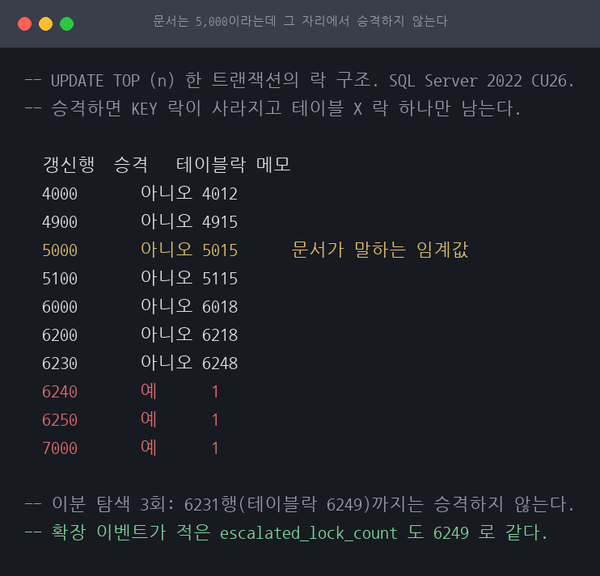
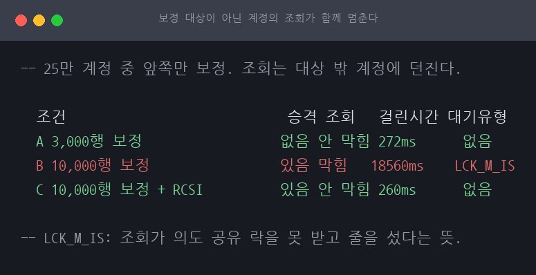
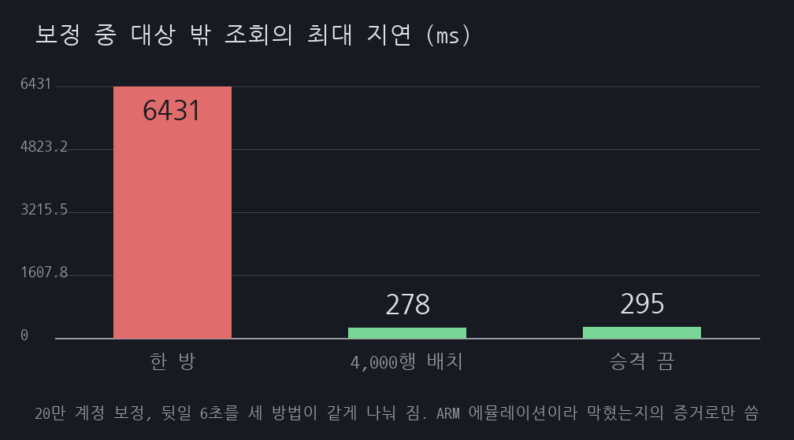
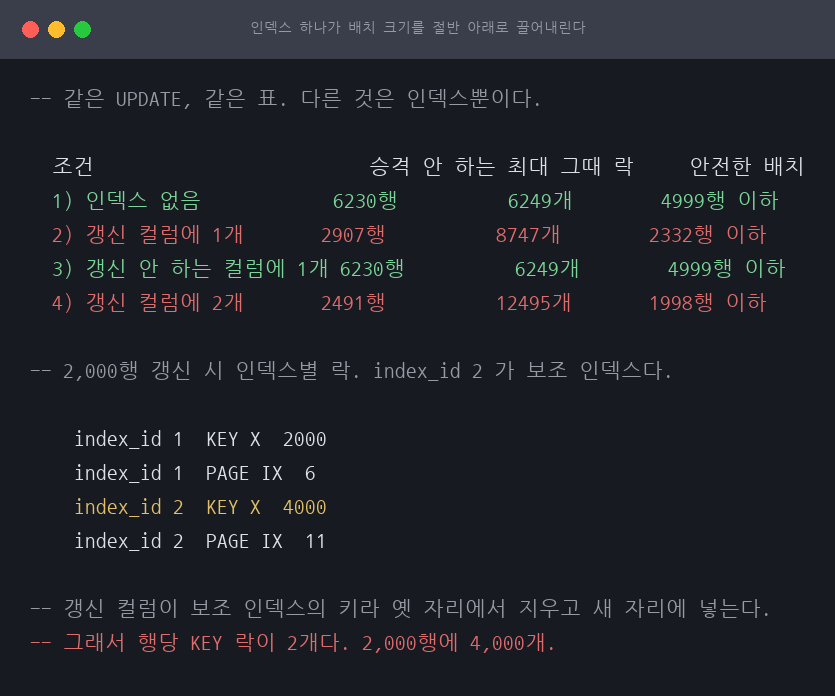

# 5,000이라고 적힌 임계값이 6,250에서 발동했다

SQL Server 락 에스컬레이션 / SQL Server 2022 (RTM-CU26) 16.0.4265 / 근거 등급 **E2**

> 이 글은 왜 그런지를 다룹니다. 무엇을 할 것인가는 [RUNBOOK.md](RUNBOOK.md) 에 절차로
> 정리했습니다. 대량 보정 배치를 돌리기 전 확인, 배치 크기 결정, 작업 중 감시 쿼리,
> 승격이 이미 일어났을 때의 대응 순서입니다.

## 1. 유명한 이유

Microsoft Learn 의 [Transaction locking and row versioning guide](https://learn.microsoft.com/en-us/sql/relational-databases/sql-server-transaction-locking-and-row-versioning-guide?view=sql-server-ver17)
는 이렇게 적습니다. 단일 T-SQL 문이 한 테이블 참조에 최소 5,000개의 락을 획득하면
데이터베이스 엔진이 그 락들을 테이블 락 하나로 승격시킨다고. 승격에 실패하면 락을
1,250개 더 획득할 때마다 다시 시도한다는 것도 같은 문서에 있습니다. 완화책으로는
`ALTER TABLE ... SET (LOCK_ESCALATION = AUTO | TABLE | DISABLE)` 을 안내합니다.

이 숫자가 실무에서 갖는 무게는 대량 갱신을 하는 쪽에 있습니다. 게임 운영으로 옮기면
재화 보정이 그렇습니다. 버그로 잘못 지급된 재화를 수만 계정에서 회수하는 배치는
UPDATE 한 문장으로 끝내고 싶은 일인데, 그 한 문장이 테이블 락을 잡으면 보정 대상이
아닌 이용자의 조회까지 함께 멈춥니다.

그래서 "배치를 5,000행 미만으로 쪼갠다"는 처방이 굳어져 있습니다. 이 세션은 그
5,000 이 실제로 어디서 발동하는지, 그리고 승격이 일어났을 때 정확히 무엇이 막히는지를
재현합니다.

사건 재현이 아니라 벤더 문서가 경고하는 동작의 확인이므로 등급은 E2 입니다.

## 2. 재현

### 환경

| 항목 | 값 |
|---|---|
| 호스트 | Darwin 25.3.0 arm64, 12코어, 32GiB |
| 컨테이너 | `mcr.microsoft.com/mssql/server:2022-latest`, Developer, `cpus: 4`, `mem_limit: 6g` |
| 서버 | Microsoft SQL Server 2022 (RTM-CU26) (KB5093420) 16.0.4265 |
| optimized locking | ABSENT (이 빌드에 해당 기능 없음) |
| 테이블 | `expedition_currency (account_id INT PK, currency_type TINYINT, balance BIGINT)` |
| `LOCK_ESCALATION` | 기본값 `TABLE` (실험 3만 조건별로 `AUTO`·`DISABLE` 로 바꿔 확인) |
| 통계 | 적재 직후 `UPDATE STATISTICS ... WITH FULLSCAN` (실험 5가 이유) |

이 컨테이너는 ARM 에뮬레이션으로 돕니다. **시간 수치는 인용하지 않습니다.** 이 세션이
재는 것은 락 개수, 승격 여부, 막혔는지 아닌지의 판정이고 셋 다 시간이 아닙니다.
실험 2와 3에 밀리초가 나오지만 그것은 성능이 아니라 "막혔다"의 증거로만 씁니다.
막힌 시간의 길이는 우리가 정한 대기 시간이 만든 값입니다.

조사 노트(`research/A-01-11.md`)가 "최신 SQL Server 의 optimized locking 이 켜져
있으면 에스컬레이션이 잘 안 일어나므로 재현 환경에선 꺼야 함"이라고 적어 두었습니다.
2022 에는 그 기능 자체가 없어 `sys.databases` 에 컬럼이 없고, 스크립트가 시작할 때
카탈로그 뷰로 확인해 없거나 꺼져 있을 때만 진행합니다.

### 승격이 일어나면 락의 모양이 바뀝니다

```
$ ./scripts/exp1-threshold.sh
  갱신행  승격   KEY락    PAGE락   테이블락
  3000       아니오 3000      9         3010
  10000      예      0         0         1
```

3,000행을 갱신하면 행마다 KEY 락이 하나씩 잡히고 테이블에는 의도 락(IX)만 걸립니다.
10,000행을 갱신하면 KEY 락이 0개이고 테이블에 X 락 하나만 남습니다. 행 단위 락 수천
개가 테이블 락 하나로 접힌 것이 에스컬레이션입니다. 두 모양은 섞이지 않으므로 이
판정에는 회색지대가 없습니다.

### 문서의 5,000에서는 승격이 일어나지 않았습니다

```
  갱신행  승격   테이블락 메모
  4000       아니오 4012
  4900       아니오 4915
  5000       아니오 5015      문서가 말하는 임계값
  5100       아니오 5115
  6000       아니오 6018
  6200       아니오 6218
  6230       아니오 6248
  6240       예      1
  6250       예      1
  7000       예      1
```

5,000행에서 승격이 없습니다. 6,000행에서도, 6,200행에서도 없습니다.



경계는 손으로 적지 않고 이분 탐색으로 찾았습니다. 라벨을 손으로 쓰면 값이 바뀌었을 때
글이 측정을 반박하게 됩니다.

```
  회차   승격하지 않는 최대   승격하는 최소
  1        6231행 (테이블락 6249)  6232행
  2        6231행 (테이블락 6249)  6232행
  3        6231행 (테이블락 6249)  6232행
```

3회 모두 같은 자리에서 갈렸습니다. **승격하지 않는 최대는 테이블 락 6,249개이고,
하나가 더 붙어 6,250개가 되는 순간 승격합니다.** 기준은 행 수가 아니라 한 테이블에
걸린 락 개수입니다. 6,231행에서 6,249개가 되는 것은 KEY 락 6,231개에 PAGE 락 17개와
OBJECT 락 1개가 더해지기 때문입니다. 앞선 실행에서는 이 경계가 6,248개로 한 칸
움직인 회차가 있었습니다. 계획이 잡는 페이지 락 수가 회차마다 한둘 달라지기
때문인데, 문서의 5,000 과는 1,200 이상 떨어져 있어 이 흔들림은 결론을 바꾸지 않습니다.

### 엔진에게 직접 물어도 같은 값이 나옵니다

확장 이벤트 `sqlserver.lock_escalation` 을 켜고 경계 바로 위에서 갱신했습니다.

```
  승격 시점 락 개수 6249
  사유                 Lock threshold
  획득한 테이블 락 X
```

락 구조로 내린 판정과 엔진이 스스로 적은 숫자가 같습니다. 서로 다른 두 경로가 같은
곳을 가리킵니다.

## 3. 내부 원리

문서의 5,000 은 **검사를 시작하는 값**이지 발동하는 값이 아닙니다.

엔진은 락을 잡을 때마다 승격을 검사하지 않습니다. 그러면 검사 비용이 락 획득 비용에
붙습니다. 대신 1,250개마다 한 번씩 검사합니다. 문서가 "승격에 실패하면 1,250개마다
재시도한다"고 적은 그 간격입니다. 검사 지점은 1,250의 배수이고, 조건은 그 시점에
5,000개를 넘겼는가입니다.

5,000 자체가 1,250의 배수(1,250 × 4)이지만 그 지점에서는 "5,000을 초과"가 아직
성립하지 않습니다. 그래서 다음 검사 지점인 6,250(1,250 × 5)에서 처음으로 조건이
성립합니다. 5,000과 6,250 사이는 문서를 그대로 읽으면 승격할 것 같지만 실제로는
승격하지 않는 구간입니다.

## 4. 해소

### 승격은 무엇을 막는가

먼저 무엇을 고쳐야 하는지 확인했습니다. 보정 대상이 아닌 계정의 조회를 던집니다.

```
$ ./scripts/exp2-blocking.sh
  조건                             승격 조회   걸린시간 대기유형
  A 3,000행 보정                  없음 안 막힘 272ms      없음
  B 10,000행 보정                 있음 막힘   18560ms    LCK_M_IS
  C 10,000행 보정 + RCSI          있음 안 막힘 260ms      없음
```



A는 보정이 3,000행을 잡고 있어도 나머지 197,000행의 조회가 지나갑니다. B는 같은
조회가 보정이 끝날 때까지 막힙니다. **갱신 대상이 아닌 계정인데도 막힙니다.**
테이블 락 하나가 테이블 전체를 덮기 때문입니다. 대기 유형 `LCK_M_IS` 는 조회가
의도 공유 락을 받으려다 걸렸다는 뜻입니다.

C는 같은 승격이 일어나는데도 조회가 지나갑니다. 읽기 커밋 스냅샷(RCSI)을 켜면 읽기가
행 버전을 보므로 X 락을 기다리지 않습니다. 다만 이것은 읽기만 구제합니다. 같은
테이블에 쓰기를 하려는 트랜잭션은 RCSI 와 무관하게 그대로 막힙니다.

### 같은 보정을 세 방법으로

25만 계정이 있는 테이블에서 20만 계정만 보정합니다. 나머지 5만은 보정 대상이 아니고,
조회는 그 바깥의 계정에 던집니다. 보정은 UPDATE 한 문장이 전부가 아니므로 감사 로그와
검산에 해당하는 뒷일을 6초 대기로 모사했습니다. 세 방법의 총 작업량은 같습니다.
1번과 3번은 6초를 한 번에, 2번은 같은 6초를 배치 50개로 나눠서 집니다. **다른 것은
락을 언제 놓느냐뿐입니다.**

```
$ ./scripts/exp3-mitigation.sh
  방법                   승격  막힌 조회 최대 지연 유지 락  결과
  1) 한 방               1회    1/2회       6431ms      5개        대상 200000 정확
  2) 4000행씩 배치     0회    0/27회      278ms       4015개     대상 200000 정확
  3) 승격 끄고 한 방 0회    0/26회      295ms       200548개   대상 200000 정확
```

세 방법 다 20만 계정을 정확히 보정하고 5만 계정은 한 행도 건드리지 않습니다. 결과가
같은 것을 확인하지 않으면 "아무 일도 안 해서 빨랐던" 회차가 표에 들어갑니다.

**1) 한 방**은 승격이 일어나고 보정이 끝날 때까지 조회가 줄을 섭니다. 유지 락이
5개인 것이 이 방법의 성격을 그대로 보여줍니다. 락은 다섯뿐인데 그중 하나가 테이블
전체입니다.

표에 적은 유지 락은 보정이 락을 든 채 뒷일을 하는 동안의 락 수입니다. 처음에는 전체
표본의 최댓값을 적었는데, 1번은 승격 직전의 과도 상태를 표본이 잡느냐 마느냐로 값이
4와 980 사이를 오갔습니다. 정상 상태를 재야 세 방법을 나란히 놓을 수 있습니다.
과도 상태의 최댓값도 버리지 않고 `results/mitigation.csv` 의 `peak_locks_all` 에
함께 남겼습니다.

**2) 배치 분할**은 승격이 한 번도 일어나지 않습니다. 배치마다 커밋해 락을 놓으므로
조회가 배치 사이로 지나갑니다. 대신 보정 전체가 하나의 트랜잭션이 아니라서 중간에
실패하면 앞 배치는 이미 커밋돼 있습니다. 원자성을 내주고 가용성을 삽니다.

**3) 승격 끄기**는 테이블 락을 안 잡는 대신 행 락 20만 개를 끝까지 들고 있습니다.
유지 락 200,548개가 그 값입니다.
대상 밖 조회는 지나갑니다. 다만 락 매니저는 인스턴스 전체가 함께 쓰는 자원이고,
이 테이블의 보정이 다른 데이터베이스의 작업과 같은 메모리를 나눠 씁니다.

운영에서 고를 것은 2번입니다. 원자성이 꼭 필요하면 보정 단위를 계정 묶음으로 잘게
잡고 묶음마다 원자적으로 도는 쪽이 낫습니다. 3번은 배치를 못 쪼개는 상황의 임시
수단이고, 켜 두고 잊으면 다음 사고의 재료가 됩니다.

## 5. 재계측



경계 탐색은 3회 반복해 세 번 다 같은 자리(6,231행 / 테이블 락 6,249개)에서 갈렸습니다.
실험 5의 통계 조건도 5회씩 반복해 회차마다 같았습니다.

해소 3종은 각각 결과 검증을 통과했습니다. 대상 20만 계정이 정확히 1씩 줄고 대상 밖
5만 계정은 한 행도 안 바뀐 것을 방법마다 확인했습니다. 유지 락은 5개, 4,015개,
200,548개로 자릿수가 갈립니다. 세 방법이 락을 어떻게 다루는지가 그대로 드러난 값입니다.

## 6. 예상과 달랐던 점

### 인덱스 하나가 배치 크기를 절반 아래로 끌어내렸습니다

여기까지의 실험은 클러스터드 PK 하나뿐인 표에서 쟀습니다. 그 결과로 "배치는 5,000행
미만"이라는 처방을 냈는데, **그 숫자에는 조건이 빠져 있었습니다.**

```
$ ./scripts/exp6-index-count.sh

  조건                         승격 안 하는 최대 그때 락     안전한 배치
  1) 인덱스 없음            6230행          6249개        4999행 이하
  2) 갱신 컬럼에 1개       2907행          8747개        2332행 이하
  3) 갱신 안 하는 컬럼에 1개 6230행          6249개        4999행 이하
  4) 갱신 컬럼에 2개       2491행          12495개       1998행 이하
```



갱신하는 컬럼에 보조 인덱스를 하나 붙이자 경계가 6,230행에서 2,907행으로 내려갔습니다.
갱신하지 않는 컬럼에 붙인 인덱스는 경계를 전혀 안 움직였습니다.

락을 인덱스별로 갈라 보면 이유가 나옵니다.

```
    index_id 1  KEY X  2000
    index_id 1  PAGE IX  6
    index_id 2  KEY X  4000
    index_id 2  PAGE IX  11
```

2,000행을 갱신했는데 보조 인덱스(index_id 2)에는 KEY 락이 **4,000개** 잡혔습니다.
갱신하는 컬럼이 그 인덱스의 키라서, 값이 바뀌면 인덱스 행이 제자리에서 못 바뀝니다.
옛 키 위치에서 지우고 새 키 위치에 넣어야 하고 두 자리에 각각 락이 붙습니다.
**행당 2개입니다.**

그래서 한 행이 잡는 락은 `1 (클러스터드) + 2 × (갱신 컬럼을 키로 담은 보조 인덱스 수)`
가 됩니다.

다만 **경계에서의 락 개수는 조건마다 달랐습니다.** 6,249 / 8,747 / 12,495 입니다.
실험 1에서 찾은 "테이블 락 6,250개"가 인덱스가 여럿일 때도 그대로 적용되는 것은
아니라는 뜻입니다. 셋 다 1,250의 배수 바로 아래이기는 한데, 왜 6,250이 아니라
8,750이나 12,500에서 걸리는지는 이 실험으로 못 밝혔습니다. 그래서 공식을 세우지
않고 측정값만 씁니다.

실제 게임 재화 표는 클러스터드 PK 하나로 끝나지 않습니다. **이 조건을 안 밝히고
5,000을 말한 것이 이 세션에서 제일 위험했던 자리였습니다.**

### 같은 행 수인데 통계가 없으면 승격했습니다

경계를 다시 재려다 같은 6,231행이 어떤 때는 승격하고 어떤 때는 안 하는 것을 봤습니다.
다른 것은 통계뿐이었습니다. 회차마다 테이블을 새로 적재해 5회씩 돌렸습니다.

```
$ ./scripts/exp5-two-paths.sh

  회차   조건                 KEY락     테이블락 승격 이벤트 승격 시점 락수
  1        통계 없음          0          2            1건         6248
  1        통계 있음          6231       6249         0건         -
  2        통계 없음          0          2            1건         6248
  2        통계 있음          6231       6249         0건         -
  3        통계 없음          0          2            1건         6248
  3        통계 있음          6231       6249         0건         -
  4        통계 없음          0          2            1건         6248
  4        통계 있음          6231       6249         0건         -
  5        통계 없음          0          2            1건         6248
  5        통계 있음          6231       6249         0건         -
```

임계값 자체는 안 움직입니다. 두 조건 다 승격할 때는 락 6,248~6,249개에서 승격합니다.
움직이는 것은 **같은 행 수에 락을 몇 개 잡느냐**입니다. 통계가 있으면 6,231행에
락 6,249개를 잡고 선 안쪽에 머무는데, 통계가 없으면 같은 6,231행에 락을 더 잡아
선을 넘습니다.

배치 크기를 5,000행으로 정해 두어도 그 숫자가 지키던 여유는 통계가 낡으면 사라질 수
있습니다. 대량 보정 전에 통계를 갱신하는 것이 배치 크기를 정하는 것만큼 중요합니다.

이 발견 때문에 `reset_table` 이 적재 후 `UPDATE STATISTICS ... WITH FULLSCAN` 을
돌리도록 고쳤습니다. 그 전까지는 실험 1의 경계가 스크립트 앞부분에서 몇 개의 문장이
먼저 돌았는지에 따라 달라지는 상태였습니다.

**처음에는 이 절을 다르게 적었습니다.** 통계가 없을 때 확장 이벤트가 0건으로 보여서
"승격이 아니라 처음부터 테이블 락을 잡는다"고 썼는데, 5회 반복하니 5회 모두 1건씩
났습니다. 0건은 재현되지 않는 관측이었고 그 결론은 철회했습니다.

### 규모를 키웠더니 승격이 사라졌습니다

실험 3을 100만행으로 먼저 돌렸다가 승격이 한 번도 안 나서 한참 헤맸습니다. 20만행에서
나던 것이 규모를 키우니 사라졌습니다.

```
$ ./scripts/exp4-granularity.sh
  테이블 행수 승격   KEY락       PAGE락      테이블락 승격 이벤트 엔진이 고른 단위
  50000        예      0            0            2            1건         테이블 (승격됨)
  100000       예      0            0            2            1건         테이블 (승격됨)
  200000       예      0            0            2            1건         테이블 (승격됨)
  400000       아니오 0            1087         1089         0건         페이지
  600000       아니오 0            1631         1633         0건         페이지
  1000000      아니오 0            2718         2720         0건         페이지
```

엔진은 갱신할 양을 보고 락 단위를 먼저 고릅니다. 양이 적으면 행 락을 잡고, 그러다
6,250개를 넘기면 테이블 락으로 승격합니다. 양이 많으면 **아예 처음부터 페이지 락을**
잡습니다. 페이지 하나에 수백 행이 들어가니 100만행을 갱신해도 락이 2,718개뿐이고
임계값 근처에도 못 갑니다. 승격을 안 한 것이 아니라 승격할 만큼 락을 안 잡았습니다.

이 랩에서 전환은 20만행과 40만행 사이에 있습니다. 정확한 지점은 문서에 있는 상수가
아니라 계획을 세울 때의 추정에 달린 값이므로 못 박지 않습니다.

페이지 락을 잡은 조건에서는 승격 이벤트가 0건입니다. 이것이 승격과 다른 사건이라는
증거입니다. **테이블에 락이 걸렸다고 전부 승격은 아닙니다.** 옵티마이저가 락 단위를
먼저 고르고, 승격은 그중 행 락을 고른 경우에만 일어나는 뒷일입니다. `dm_tran_locks`
화면만 보고 "에스컬레이션 때문"이라고 단정하면 배치를 쪼개는 처방이 나오는데, 단위
선택이 원인이었다면 배치를 쪼개도 각 배치가 다시 같은 선택을 받을 수 있습니다.
둘을 가르려면 확장 이벤트를 함께 봐야 합니다.

승격이 없다고 안전한 것도 아닙니다. 페이지 락도 그 페이지에 든 행 전부를 막습니다.
보정 대상이 아닌 계정이 같은 페이지에 있으면 똑같이 막힙니다. 달라지는 것은 막히는
범위가 테이블 전체냐 페이지 단위냐입니다.

그래서 실험 1의 6,250은 행 락을 잡는 규모에서만 쓸 수 있는 숫자입니다. 다행히
"배치를 5,000행 미만으로"라는 처방은 규모와 무관하게 맞습니다. 5,000행 배치는 어느
쪽이든 락을 5,000개 이하로 잡고 승격 검사에 안 걸립니다.

### 측정이 격리되지 않은 것을 결과가 먼저 알려 줬습니다

실험 3의 첫 판에서 승격을 끈 3번이 조회를 막았습니다. 승격이 없는데 막혔다면 원인은
승격이 아닙니다. 테이블 전체를 보정하면서 마지막 계정을 조회 대상으로 썼던 것이
문제였습니다. 그 행이 보정 대상이라 자기 락에 자기가 걸린 것이고, 그러면 이 실험은
"승격이 무엇을 막는가"가 아니라 "자기 행이 잠겼는가"를 잰 것이 됩니다.

보정 대상 20만과 대상 밖 5만을 나누고 조회를 대상 밖으로 옮기자 3번의 막힘이 0이
됐습니다. 결과가 이상해서 설계를 다시 본 것이 아니라, **이상한 결과가 설계 결함의
증상이었습니다.**

### 락 메모리로 재려다 그만뒀습니다

3번의 비용을 `sys.dm_os_memory_clerks` 의 `OBJECTSTORE_LOCK_MANAGER` 로 재려고 했는데
조건 셋이 전부 같은 최댓값으로 찍혔습니다. 그 클럭은 한 번 늘면 락을 반납해도 줄지
않습니다. 앞 조건의 값을 다음 조건이 물려받는 자리였고, 그대로 뒀으면 "세 방법의 락
메모리가 같다"는 틀린 결론이 표에 들어갔을 것입니다. 동시 락 **개수**로 바꾸니
5개와 4,015개와 200,548개로 갈렸습니다. 폐기한 측정이라 `results/` 에 남기지
않았으므로 그때의 값은 인용하지 않습니다.

### 스크립트 자체가 조건을 새게 만들었습니다

실험 2를 처음 짤 때 보정 트랜잭션을 `pid=$(hold_update ...)` 로 띄웠습니다. 명령
치환은 서브셸에서 돌므로 그 배경 작업은 서브셸의 자식이 되고, 부모의 `wait` 이 거두지
못합니다. 앞 조건의 보정 트랜잭션이 살아 있는 채로 다음 조건이 시작돼 판정이
뒤엉켰습니다. 같은 스크립트에서 갱신 완료를 `sleep 4` 로 기다린 것도 문제였습니다.
에뮬레이션에서 그 안에 안 끝나는 회차가 있어 승격을 0으로 읽었고, 조회는 12초를
막혔는데 표에는 "승격 없음"이 찍혔습니다. 시간이 아니라 상태를 기다리도록 바꿨습니다.

### 없는 컬럼을 안 읽는 분기도 컴파일에서 죽습니다

`optimized locking` 이 켜져 있는지 확인하려고 `IF ... IS NULL SELECT 'ABSENT' ELSE
SELECT is_optimized_locking_on ...` 을 던졌는데 Msg 207 로 죽었습니다. SQL Server 는
배치 전체를 먼저 컴파일하므로 도달하지 않는 분기의 컬럼 이름도 검사합니다. 존재
확인은 카탈로그 뷰로 하고 읽기는 동적 SQL 로 미뤄야 했습니다. 가드가 fail-closed 로
동작해 실험이 진행되지 않은 것은 다행이었습니다.

## 7. 표준 처방

1. **배치 크기는 갱신 컬럼에 붙은 인덱스를 세고 정한다.**
   갱신 컬럼에 보조 인덱스가 하나라도 있으면 **2,000행 이하**, 없으면 5,000행 미만입니다.
   6,250이라는 여유를 알아도 5,000을 기준으로 잡습니다. 문서가 보장하는 값이 아닙니다.
   갱신하지 않는 컬럼의 인덱스는 세지 않습니다. 락이 안 붙습니다.
2. **배치마다 커밋해 락을 놓는다.** 쪼개기만 하고 한 트랜잭션 안에서 돌면 락이
   누적돼 결국 승격합니다.
3. **보정 전에 통계를 갱신한다.** 배치 크기가 지키던 여유는 통계가 낡으면 사라집니다.
   같은 5,000행이 더 많은 락을 잡아 선을 넘을 수 있습니다.
4. **원자성이 필요하면 보정 단위를 잘게 정의한다.** 20만 계정을 한 번에 되돌리는
   원자성이 아니라, 계정 묶음마다 원자적이고 실패한 묶음을 다시 도는 구조로 만듭니다.
   이때 어디까지 처리했는지를 기록하는 진행 테이블이 있어야 재시작이 가능합니다.
5. **`LOCK_ESCALATION = DISABLE` 은 임시 수단으로만 쓴다.** 켰으면 언제 끌지를
   같이 정합니다. 락 매니저 메모리는 인스턴스 전체가 나눠 씁니다.
6. **읽기를 구제해야 하면 RCSI 를 검토한다.** 다만 쓰기는 여전히 막히고, 버전 저장소
   비용이 tempdb 로 옮겨갑니다.
7. **보정 배치를 돌리기 전에 `sys.dm_tran_locks` 로 락 단위를 확인한다.** 같은 배치가
   테이블 크기에 따라 행 락을 잡을 수도 페이지 락을 잡을 수도 있습니다.

## 8. 못 한 것

- **에스컬레이션 실패와 재시도를 재현하지 못했습니다.** 다른 세션이 호환되지 않는 락을
  들고 있으면 승격이 실패하고 1,250개마다 재시도한다는 문서의 서술이 있는데, 그
  경합 상황을 만들지 않았습니다. 이 세션의 승격은 전부 첫 시도에 성공했습니다.
- **`LOCK_ESCALATION = TABLE` 을 재지 않았습니다.** AUTO 와 DISABLE 만 비교했습니다.
  파티션 테이블에서 AUTO 와 TABLE 이 갈리는데(AUTO 는 파티션 단위 승격), 파티션
  테이블을 만들지 않아 그 차이가 드러나는 조건이 없었습니다.
- **락 메모리 압박에 의한 승격을 못 봤습니다.** 문서는 락 개수 임계값 말고 메모리
  압박으로도 승격한다고 적습니다. 6g 컨테이너에서 그 상황을 만들려면 락을 훨씬 더
  많이 쌓아야 하는데 시도하지 않았습니다. 실험 3의 3번이 20만 락을 들고도 승격하지
  않은 것은 `DISABLE` 때문이지 메모리에 여유가 있어서인지 가르지 않았습니다.
- **시간을 재지 않았습니다.** ARM 에뮬레이션이라 절대값이 이 호스트의 것이 아닙니다.
  배치 분할이 한 방보다 총 얼마나 느린지는 이 랩에서 답할 수 없습니다. 실무에서
  중요한 값인데 비어 있습니다.
- **인덱스가 셋 이상인 경우를 재지 않았습니다.** 실험 6에서 0개·1개·2개는 쟀지만
  그 이상은 안 쟀습니다. 경계가 계속 내려갈 것으로 보이지만 확인은 없습니다.
- **인덱스가 여럿일 때의 발동 규칙을 못 밝혔습니다.** 경계 락이 6,249 / 8,747 / 12,495 로
  갈렸는데, 왜 첫 검사 지점인 6,250 에서 안 걸리고 그다음 지점까지 가는지 모릅니다.
  인덱스별(HoBT) 임계값과 문장 전체 임계값 중 무엇이 기준인지 가르지 못했습니다.
- **경계가 회차마다 락 한 칸 움직이는 이유를 못 밝혔습니다.** 실행에 따라 6,248과
  6,249 사이를 오갔습니다. 계획이 잡는 페이지 락 수가 달라지는 것으로 보이는데,
  무엇이 그 수를 바꾸는지는 확인하지 않았습니다.
- **통계가 없을 때 락을 왜 더 잡는지 못 밝혔습니다.** 같은 6,231행인데 통계가 없으면
  선을 넘습니다. 실행 계획을 나란히 놓고 비교하지 않았습니다. `SET STATISTICS XML`
  로 두 계획을 떠서 접근 경로가 다른지 봤어야 합니다.
- **전환 지점(20만~40만)을 좁히지 않았습니다.** 문서에 있는 상수가 아니라 추정에
  달린 값이라 판단해 구간만 적었습니다.
