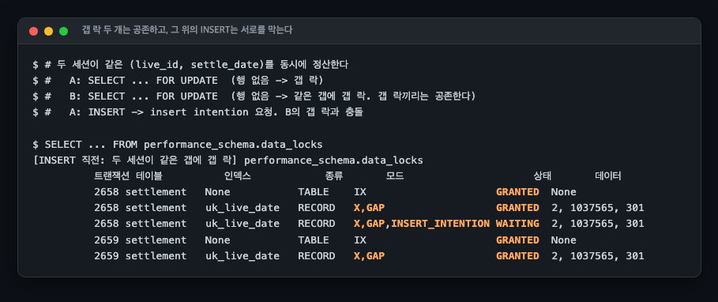
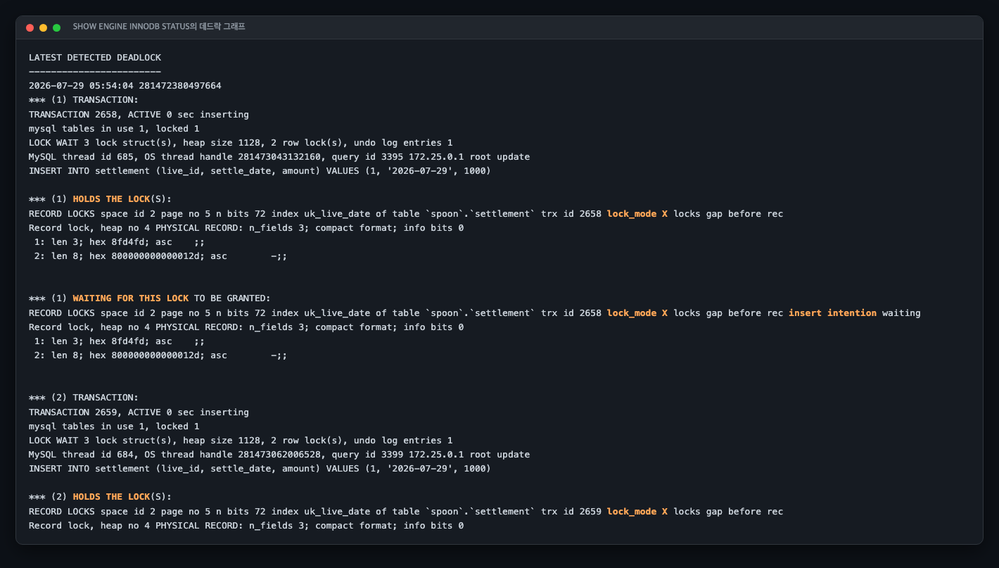
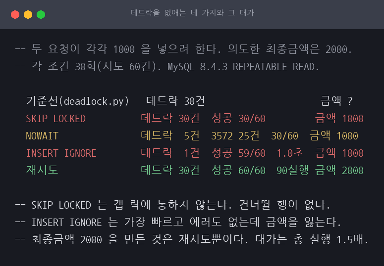

# A06 갭 락 데드락, "없으면 넣는다"가 만드는 교착

> 근거 등급: `E2`
> 출처: [MySQL 8.4, InnoDB Locking (gap locks, insert intention locks)](https://dev.mysql.com/doc/refman/8.4/en/innodb-locking.html) · [Deadlocks in InnoDB](https://dev.mysql.com/doc/refman/8.4/en/innodb-deadlocks.html)

## 1. 유명한 이유

실무에서 가장 자주 만나는 데드락은 두 트랜잭션이 자원을 반대 순서로 잡는 고전적 형태가 아닙니다. **같은 코드가 동시에 두 번 실행됐을 뿐인데** 나는 데드락입니다.

정산이나 집계에서 "그 날짜 행이 있으면 더하고 없으면 만든다"를 짤 때, 자연스러운 코드는 이렇습니다.

```sql
SELECT id FROM settlement WHERE live_id=? AND settle_date=? FOR UPDATE;  -- 확인
INSERT INTO settlement (...) VALUES (...);                                -- 없으면 삽입
```

두 요청이 동시에 오면 이 코드가 데드락을 냅니다. 원인은 REPEATABLE READ의 갭 락과 insert intention 락의 조합입니다. MySQL 공식 문서가 두 락을 각각 정의해 두었지만, 둘이 만났을 때 어떻게 되는지는 직접 재봐야 감이 옵니다.

이 세션은 그 조합을 재현하고, `performance_schema.data_locks`로 **락이 걸린 순간의 상태**를 포착하고, `SHOW ENGINE INNODB STATUS`의 데드락 그래프를 읽습니다. 그다음 해소 두 가지를 각각 30회씩 돌려 데드락이 실제로 사라지는지 셉니다.

## 2. 재현

### 환경

MySQL 8.4.3, REPEATABLE READ(기본값), `innodb_print_all_deadlocks=ON`. 데드락은 부하가 아니라 순서 문제라서 스레드 두 개면 재현됩니다. 자원 상한은 걸지 않았습니다.

재현 스크립트는 Python 스레드 2개를 `threading.Barrier`로 맞춰 두 세션의 진행을 동기화하고, `innodb_lock_wait_timeout=10`을 걸었습니다. 호스트 사양은 기록하지 않았습니다.

`SHOW ENGINE INNODB STATUS`는 `innodb_print_all_deadlocks` 값과 상관없이 **마지막 데드락 한 건만** 보여줍니다. MySQL 문서도 "To view the last deadlock in an InnoDB user transaction, use SHOW ENGINE INNODB STATUS"라고 적습니다. 그래서 이 명령의 `LATEST DETECTED DEADLOCK` 블록은 새 데드락이 날 때까지 같은 내용을 계속 되풀이합니다. 운영에서 데드락을 전부 추적하려면 `innodb_print_all_deadlocks=ON`으로 켜서 에러 로그에 남겨야 하고, 이 세션도 그렇게 켜 두었습니다.

아래 두 증거는 모두 **단일 스냅숏**입니다. `data_locks` 출력은 두 세션이 INSERT 직전인 한 순간을 한 번 찍은 것이고, 데드락 그래프도 그 시점에 남아 있던 마지막 한 건입니다. 30회 반복해 센 것은 3절의 데드락 발생 횟수뿐이고, 락 상태 자체를 여러 번 관측해 같은 모양이 나오는지 확인하지는 않았습니다.

### 락이 걸린 순간



```
트랜잭션 2658  uk_live_date  X,GAP                   GRANTED   2, 1037565, 301
트랜잭션 2658  uk_live_date  X,GAP,INSERT_INTENTION  WAITING   2, 1037565, 301
트랜잭션 2659  uk_live_date  X,GAP                   GRANTED   2, 1037565, 301
```

세 줄이 이 세션의 전부입니다.

1. 두 트랜잭션이 **같은 갭에 X 갭 락을 동시에 GRANTED로 잡고 있습니다.** 갭 락끼리는 서로를 막지 않습니다. 갭 락의 목적은 "이 구간에 새 행이 들어오는 것을 막는 것"이지 "다른 갭 락을 막는 것"이 아니기 때문입니다.
2. 그런데 INSERT는 그 갭에 **insert intention 락**을 요청합니다. 이 락은 갭 락과 충돌합니다.
3. A의 insert intention이 B의 갭 락에 막히고, B의 것이 A의 갭 락에 막힙니다. 서로를 기다립니다.

`SELECT ... FOR UPDATE`가 성공했을 때 "내가 이 자리를 확보했다"고 읽으면 틀립니다. 확보한 것은 **다른 트랜잭션이 넣지 못하게 하는 권리**이지, 내가 넣을 수 있는 권리가 아닙니다.

### 데드락 그래프



`SHOW ENGINE INNODB STATUS`의 출력을 읽는 순서는 이렇습니다.

- `*** (1) TRANSACTION:` 아래 `HOLDS THE LOCK(S)`와 `WAITING FOR THIS LOCK`
- `*** (2) TRANSACTION:` 아래 같은 두 항목
- `*** WE ROLL BACK TRANSACTION (2)` (InnoDB가 희생자로 고른 쪽)

락 대상이 `supremum` 레코드로 찍히는 것도 갭 락의 표시입니다. 마지막 레코드 뒤의 열린 구간을 잠글 때 supremum 의사 레코드에 락을 겁니다.

## 3. 해소

같은 시나리오를 두 방법으로 고쳐 각각 30회(시도 60건)씩 돌렸습니다.

| 방법 | 데드락 | 중복키 에러 | 판단 |
|---|---|---|---|
| 원래 방식 (`SELECT FOR UPDATE` 후 `INSERT`) | **30회** | 0 | 재현 기준 |
| `INSERT ... ON DUPLICATE KEY UPDATE` | **0회** | 0 | 권장 |
| READ COMMITTED로 낮추기 | **0회** | 30회 | 조건부 |

**확인과 삽입을 한 문장으로 합치는 쪽**이 답입니다. 갭 락을 먼저 잡는 단계 자체가 없어지고, 중복 처리는 엔진이 유니크 키로 합니다. 30회 전부 성공했고 중복키 에러도 없었습니다.

**READ COMMITTED**도 이 시나리오의 데드락은 없앱니다. 다만 "갭 락이 아예 없어서"는 아닙니다. MySQL 문서는 갭 락이 꺼지는 범위를 이렇게 한정합니다.

> Gap locking can be disabled explicitly. This occurs if you change the transaction isolation level to READ COMMITTED. In this case, gap locking is disabled for searches and index scans and is used only for foreign-key constraint checking and duplicate-key checking.

꺼지는 것은 **탐색과 인덱스 스캔의 갭 락**이고, **외래키 제약 검사와 중복키 검사에는 READ COMMITTED에서도 갭 락을 씁니다.** 이 시나리오에서 데드락이 사라진 이유는 `SELECT ... FOR UPDATE`가 더 이상 갭을 잠그지 않게 됐기 때문이지, 서버에서 갭 락이 사라졌기 때문이 아닙니다. 외래키가 걸린 테이블에 INSERT하는 경로라면 READ COMMITTED에서도 갭 락을 만나게 됩니다.

결과도 다릅니다. 60시도 중 30건이 중복키 에러(1062)로 실패했습니다. 데드락이 중복키 에러로 바뀐 것이고, 애플리케이션이 그 에러를 잡아 재시도하거나 무시해야 합니다. 실패를 없앤 게 아니라 실패의 종류를 바꾼 것이라, 예외 처리를 함께 넣지 않으면 장애의 모양만 달라집니다.

격리 수준을 내리기 전에 확인할 것이 둘 더 있습니다.

**첫째, 바이너리 로그 형식입니다.** 문서는 "Only row-based binary logging is supported with the READ COMMITTED isolation level"이라고 못박습니다. `binlog_format=MIXED`면 서버가 알아서 행 기반으로 전환하지만, `STATEMENT`로 두면 "InnoDB can no longer perform inserts"라 곧 에러가 납니다. MySQL 8.4는 `binlog_format` 기본값이 `ROW`이고 이 변수 자체가 deprecated라 새로 세우는 환경에서는 걸릴 일이 적습니다. 문제는 8.0 이전부터 `STATEMENT`나 `MIXED`로 돌던 복제 구성입니다. 그런 곳에서는 격리 수준 한 줄을 내리는 것이 복제 형식 변경을 함께 요구합니다.

**둘째, UPDATE와 DELETE의 락 동작이 같이 바뀝니다.** READ COMMITTED에서는 실제로 고친 행의 락만 유지하고, 조건에 맞지 않은 행의 레코드 락은 WHERE 평가가 끝나는 대로 풀립니다. 그리고 이미 잠긴 행을 만나면 semi-consistent read로 최신 커밋 버전을 읽어 조건에 맞는지 먼저 판정하고, 맞을 때만 다시 읽어 잠그거나 락을 기다립니다. 문서는 이 조합을 두고 "This greatly reduces the probability of deadlocks, but they can still happen"이라고 적습니다. 데드락 확률을 크게 낮추지만 없애지는 못한다는 뜻입니다. 4절의 인덱스 없는 UPDATE가 정확히 이 효과가 걸리는 자리인데, 이 세션은 4절을 REPEATABLE READ에서만 돌렸으므로 READ COMMITTED에서 락 건수가 얼마나 줄어드는지는 재지 않았습니다.

## 4. 인덱스가 없으면 락 범위가 넓어진다

두 번째 시나리오로 인덱스 없는 컬럼의 UPDATE를 넣었습니다. `WHERE status='PENDING'`은 `status`에 인덱스가 없어서 InnoDB가 PRIMARY를 통째로 훑고, 훑은 행마다 락을 잡습니다.

두 번째 UPDATE 직전에 찍은 `data_locks` 스냅숏에는 락이 **204건** 있었습니다(`results/deadlock.txt`의 "잡힌 락 204개"). 200행짜리 테이블에서 `status='PENDING'`인 행은 100행이고, 실행한 문장은 거기에 `live_id` 범위 조건까지 붙어 50행에 해당합니다. 204건의 내역은 이렇습니다.

- 한 트랜잭션이 쥔 레코드 락 201건. 200행 전부와 supremum 의사 레코드입니다.
- 다른 트랜잭션이 기다리는 레코드 락 1건. 대상이 `id=1` 행인데, 그 트랜잭션의 조건 범위(`live_id > 100`) 밖입니다. 자기가 고칠 행이 아닌데도 스캔이 그 행을 지나가느라 막힌 것입니다.
- 테이블 IX 락 2건.

REPEATABLE READ에서는 조건에 맞지 않은 행의 락도 트랜잭션이 끝날 때까지 남습니다. 3절에 적은 대로 READ COMMITTED로 내리면 이 락들은 WHERE 평가 직후에 풀리고 semi-consistent read가 함께 걸리지만, 이 시나리오를 READ COMMITTED에서 다시 재지는 않았습니다.

이 시나리오는 **한 번만 실행했습니다.** 30회 반복은 3절의 해소 검증에만 적용했고 이쪽은 반복 측정하지 않았습니다. 그리고 그 한 번의 실행에서는 **데드락이 나지 않았습니다.** 결과 파일의 이 구간 결과가 `세션A = None, 세션B = None`인 것이 그것이고, 한 세션이 먼저 전 행을 잠그고 다른 세션이 그 앞에서 대기하는 것으로 끝났습니다. 바로 아래에 데드락 그래프가 다시 찍혀 있지만 그것은 2절에 적은 성질 때문입니다. `SHOW ENGINE INNODB STATUS`가 새 데드락이 날 때까지 마지막 한 건을 계속 보여주므로 시나리오 1의 트랜잭션(2658과 2659)이 그대로 다시 출력된 것입니다. 트랜잭션 번호와 타임스탬프가 위 블록과 같은 것이 그 증거입니다.

그래서 이 절이 실제로 보인 것은 넓어진 락 범위와 그로 인한 대기까지입니다. 인덱스를 거는 것이 조회 성능만의 문제가 아니라 **락 범위를 좁혀 충돌 면적을 줄이는 일**이기도 하다는 것은 204건이라는 숫자가 그대로 보여줍니다. 다만 인덱스 유무에 따라 데드락 발생률이 실제로 얼마나 달라지는지는 재지 않았습니다. 이 관점은 A22(인덱스가 있는데 못 쓰는 경우)와 짝이 됩니다.

## 5. 다른 선택지 넷과 그 대가

`scripts/alternatives.py`, 원문은 `results/alternatives.txt`. 각 조건 30회(시도 60건).
두 요청이 각각 1000 을 넣으려 하므로 **의도한 최종금액은 2000** 입니다.



| 방법 | 데드락 | 다른 에러 | 성공 | 총 실행 | 소요 | **최종금액** |
|---|---|---|---|---|---|---|
| 원래 방식 (기준선) | 30회 | 0 | | 60 | | |
| `SKIP LOCKED` | **30회** | 0 | 30/60 | 60 | 7.3초 | 1000 |
| `NOWAIT` | 5회 | 3572 25건 | 30/60 | 60 | 7.3초 | 1000 |
| `INSERT IGNORE` | 1회 | 0 | 59/60 | **1.0초** | 60 | 1000 |
| 원래 방식 + 재시도 | 30회 | 0 | **60/60** | 90 | 16.5초 | **2000** |

- **`SKIP LOCKED` 는 갭 락에 통하지 않습니다.** 건너뛰는 대상이 잠긴 **행** 이고 이
  시나리오에는 대상 행이 없어 건너뛸 것이 없습니다. 데드락 30회로 기준선과 같습니다.
- **`NOWAIT` 은 에러의 종류를 바꿉니다.** 데드락이 5회로 줄고 3572 가 25건 나옵니다.
  실패가 사라진 것이 아니라 빨라진 것입니다.
- **`INSERT IGNORE` 가 가장 위험합니다.** 가장 빠르고 에러도 없는데 최종금액이 1000 입니다.
  중복키를 만나면 경고만 남기고 성공으로 끝나므로 두 번째 1000 원이 신호 없이 사라집니다.
- **재시도만 최종금액을 맞춥니다.** 데드락은 30회 그대로 나지만 최종 성공 60/60, 금액 2000
  입니다. 대가는 총 실행 90회(1.5배)와 소요 16.5초입니다.

### 반복 측정 4회

`results/alternatives-run0.txt` ~ `run3.txt`. 조건마다 30회(시도 60건)를 4회 반복했습니다.

| 방법 | 성공(4회) | 총 실행(4회) | 소요(4회) | 최종금액(4회) |
|---|---|---|---|---|
| `nowait` | 30, 30, 30, 30 | 60, 60, 60, 60 | 7.3, 7.3, 7.3, 7.3초 | 1000, 1000, 1000, 1000 |
| `skiplocked` | 30, 30, 30, 30 | 60, 60, 60, 60 | 7.3, 7.3, 7.4, 7.4초 | 1000, 1000, 1000, 1000 |
| `retry` | 60, 60, 60, 60 | 90, 90, 90, 90 | 16.5, 16.6, 16.6, 16.6초 | 2000, 2000, 2000, 2000 |
| `insert_ignore` | 59, 60, 60, 59 | 60, 60, 60, 60 | 1.0, 1.1, 1.1, 1.2초 | 1000, 1000, 1000, 1000 |

**최종금액이 네 회차 모두 같습니다.** 재시도만 2000 이고 나머지 셋은 1000 입니다. 이 세션의
결론은 회차 편차로 뒤집히지 않습니다.

흔들린 것은 `insert_ignore` 의 성공 건수뿐입니다(60, 60, 60, 59). 데드락이 한 회차에서
1건 났고 그 요청이 실패로 끝났습니다. 그런데 **실패하든 성공하든 최종금액은 1000 입니다.**
성공률로 이 방법을 고르면 안 되는 이유가 그것입니다.

### 밟은 함정 둘

1. **배리어를 `SELECT` 뒤에 두었습니다.** 두 세션의 `SELECT` 가 동시에 돌지 않아 `NOWAIT` 이
   경합을 만들지 못했고, 먼저 실패한 쪽이 배리어에 오지 않아 상대가 15초를 기다렸습니다.
   그 라운드가 13회 있어 조건 하나가 199.6초로 찍혔습니다. 배리어를 첫 문장 앞으로 옮기고
   `BrokenBarrierError` 를 삼키도록 고쳤습니다.

2. **재시도가 멱등하지 않았습니다.** `SELECT` 결과를 보지 않고 `INSERT` 만 다시 던지게
   두었더니, 재시도가 데드락을 중복키로 바꾸기만 하고 최종 성공은 30/60 에 머물렀습니다.
   "있으면 더한다" 분기를 넣어야 수렴합니다. **재시도는 멱등한 로직 위에서만 안전망입니다.**

## 6. 예상과 달랐던 점

### 격리 수준 변경이 조용히 안 먹었습니다

READ COMMITTED 해소를 검증하는데 데드락이 30회 그대로 나왔습니다. 원인은 `BEGIN` **뒤에** `SET SESSION TRANSACTION ISOLATION LEVEL READ COMMITTED`를 둔 것이었습니다.

```
BEGIN;
SET SESSION TRANSACTION ISOLATION LEVEL READ COMMITTED;
SELECT @@transaction_isolation;   →  READ-COMMITTED
```

**변수는 바뀐 값을 보여주는데 실행 중인 트랜잭션은 그대로 REPEATABLE READ로 돕니다.** 세션 설정은 다음 트랜잭션부터 적용되기 때문입니다. 변수를 찍어 확인했는데도 안 먹는 상황이라, 이걸 모르면 "READ COMMITTED로 바꿨는데 갭 락이 그대로다"라는 결론에 도달합니다. `BEGIN` 앞으로 옮기자 데드락이 0회가 됐습니다.

### 행이 있으면 다른 데드락이 됩니다

시나리오를 두 번째 실행할 때 락 모드가 `X,GAP`이 아니라 `X,REC_NOT_GAP`으로 나왔습니다. 첫 실행에서 만든 행이 남아 있어 `SELECT FOR UPDATE`가 갭이 아닌 레코드를 잠근 것입니다. 여전히 데드락은 나지만 **메커니즘이 다릅니다.** 갭 락 데드락을 재현하려면 대상 행이 없는 상태에서 시작해야 하고, 그래서 매 실행 전 초기화를 넣었습니다.

같은 증상(1213 Deadlock found)이라도 원인이 갭 락인지 레코드 락인지에 따라 해법이 달라지므로, `data_locks`의 `LOCK_MODE`를 보지 않고 증상만으로 진단하면 안 됩니다.

## 못 한 것

- **세 번째 시나리오(획득 순서 엇갈림)를 문서에 넣지 않았습니다.** 고전적 형태라 새로 배울 게 적어 갭 락 쪽에 집중했습니다. `scripts/deadlock.py`의 docstring에 셋째 시나리오가 적혀 있지만 구현하지 않았습니다.
- **4절의 인덱스 없는 UPDATE는 1회 실행이 전부입니다.** 락 204건은 그 한 번의 스냅숏이고, 인덱스를 붙였을 때나 READ COMMITTED로 내렸을 때 이 수가 얼마나 줄어드는지는 재지 않았습니다.
- **재시도 횟수와 백오프를 조합해 재지 않았습니다.** 5절에서 최대 4회, 선형 백오프 하나만 썼습니다.
- **`SKIP LOCKED` 가 유효한 큐 소비 패턴은 만들지 않았습니다.** 5절에서 이 시나리오에 통하지 않는다는 것만 확인했습니다.
- **분산 환경은 다루지 않았습니다.** 단일 인스턴스 두 세션입니다.
