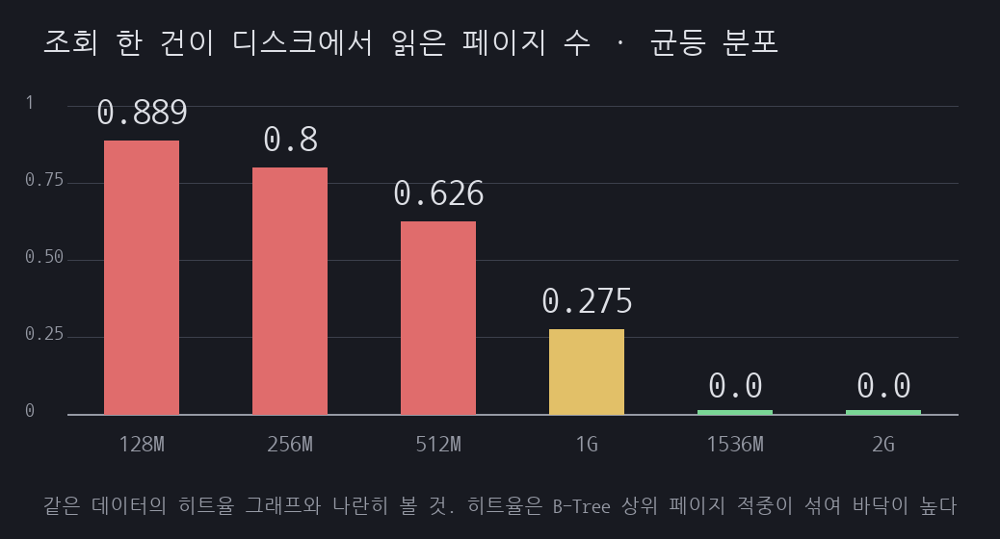
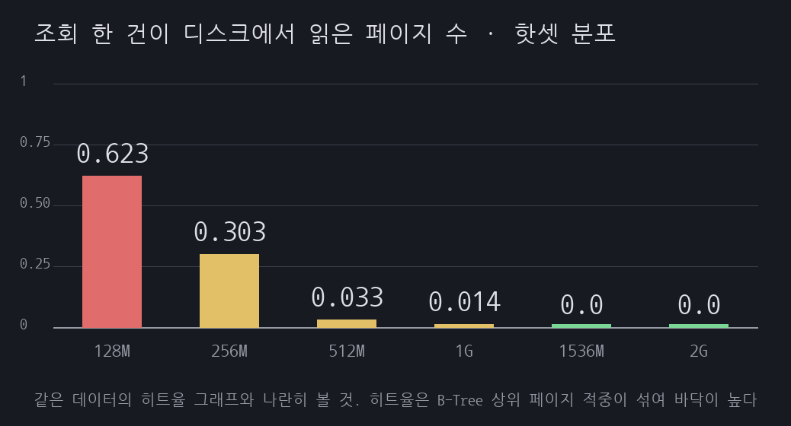
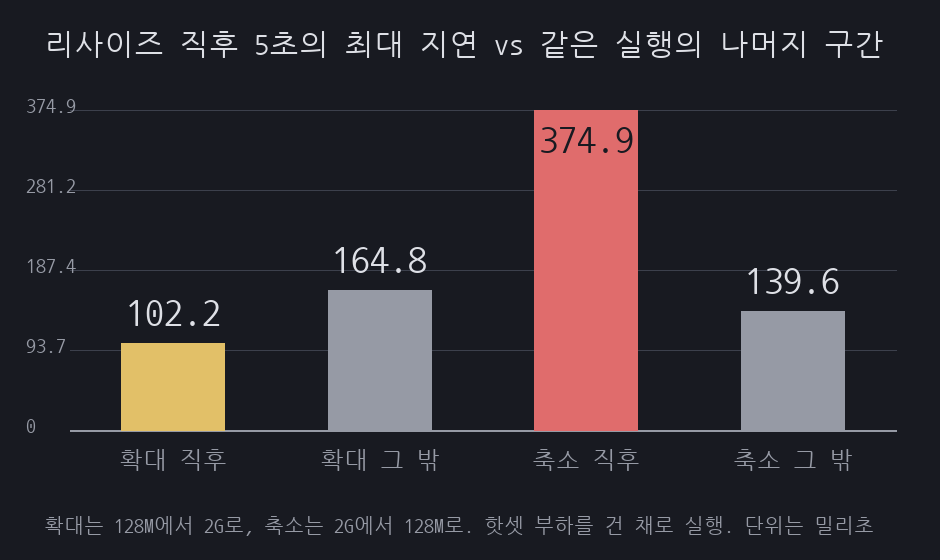
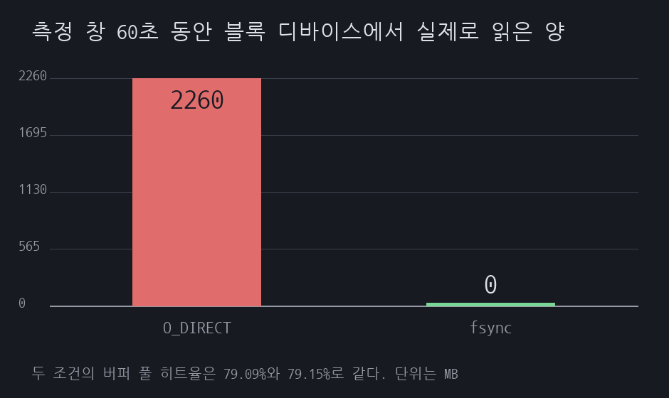

# A08 버퍼 풀을 얼마로 잡을 것인가, 그리고 그 값으로 옮기는 데 드는 값

> 근거 등급: `E2`
> 출처: [MySQL 8.4 Reference, The InnoDB Buffer Pool](https://dev.mysql.com/doc/refman/8.4/en/innodb-buffer-pool.html), [Optimizing InnoDB Disk I/O](https://dev.mysql.com/doc/refman/8.4/en/optimizing-innodb-diskio.html), [Configuring InnoDB Buffer Pool Size](https://dev.mysql.com/doc/refman/8.4/en/innodb-buffer-pool-resize.html), [InnoDB Startup Options and System Variables](https://dev.mysql.com/doc/refman/8.4/en/innodb-parameters.html), [What Is New in MySQL 8.4 since MySQL 8.0](https://dev.mysql.com/doc/refman/8.4/en/mysql-nutshell.html)

## 1. 유명한 이유

MySQL 튜닝 문서를 열면 거의 항상 `innodb_buffer_pool_size`가 첫 줄에 나옵니다. 기본값이 128MB(`134217728`)라서 그대로 두면 어지간한 서비스에서는 작고, 이 값 하나만 올려도 체감이 크기 때문입니다.

공식 문서의 권고는 두 군데에 있고 숫자가 서로 다릅니다. "Optimizing InnoDB Disk I/O"는 "it is typically recommended that `innodb_buffer_pool_size` is configured to 50 to 75 percent of system memory"라고 적고, "The InnoDB Buffer Pool"은 "On dedicated servers, up to 80% of physical memory is often assigned to the buffer pool"이라고 적습니다. 같은 매뉴얼 안에서 50~75%와 80%가 같이 있으니, "공식 권고는 80%"라고 단정하면 절반만 인용하는 셈입니다.

두 문장에는 공통점이 하나 더 있습니다. 둘 다 기준이 **시스템 메모리**입니다. 내 데이터가 몇 GB인지, 그중 실제로 조회되는 부분이 얼마인지는 어느 쪽에도 나오지 않습니다. 서버 메모리가 16GB면 8~12GB로 잡으라는 말인데, 데이터가 500MB인 서비스와 500GB인 서비스에 같은 규칙을 적용하라는 뜻이 됩니다.

그래서 이 세션은 권고 비율을 검증하지 않습니다. 데이터를 고정하고 버퍼 풀만 128M에서 2G까지 옮겨 가며 곡선을 직접 그린 다음, 그 곡선이 접근 분포에 따라 어떻게 달라지는지를 봅니다. 곡선에서 값을 골랐다고 끝나는 것도 아닙니다. 운영 중인 서버를 그 값으로 옮기는 행위 자체에 값이 붙습니다. 공식 문서가 이렇게 적어 두었습니다.

> Once the resizing operation is in progress, new transactions and operations that require access to the buffer pool must wait until the resizing operation finishes.

## 2. 재현

### 환경

| 항목 | 값 |
|---|---|
| 호스트 | Rocky Linux, 커널 5.14.0-570.33.2.el9_6.aarch64, 2코어, 11GB |
| DB | MySQL 8.4.3 (컨테이너 `cpus: 2`, `mem_limit: 3g`) |
| 버퍼 풀 | 인스턴스 1개로 고정, 청크 128M, 페이지 16K |
| 데이터 | `orders` 700만 행, 클러스터드 인덱스 1424MB, 세컨더리 인덱스 없음 |
| 부하 | PK 점조회, 프로세스 2개, 워밍업 30초 뒤 60초 측정 |
| 손대지 않은 8.4 기본값 | `innodb_adaptive_hash_index` OFF, `innodb_change_buffering` none |

측정을 오염시킬 만한 기본 설정을 손봤습니다. `innodb_buffer_pool_dump_at_shutdown`과 `innodb_buffer_pool_load_at_startup`은 8.4 기본값이 둘 다 ON이라 껐습니다. 그대로 두면 조건을 바꿔 재기동한 다음 실행이 직전 실행의 워킹셋을 그대로 물려받습니다.

`innodb_buffer_pool_instances`는 1로 고정했습니다. 버퍼 풀 크기는 `innodb_buffer_pool_chunk_size * innodb_buffer_pool_instances`의 배수로 자동 조정되므로, 인스턴스가 1이면 반올림 단위가 128M이라 스윕 값이 지정한 그대로 잡힙니다. 다만 이 설정을 넣으면서 근거로 적어 둔 "8.4 기본값은 1GB 이상에서 8"은 사실이 아니었습니다. 고정 8은 8.0 이야기이고, 8.4는 이 값을 동적으로 계산합니다. 버퍼 풀이 1GiB 이하면 1이고, 넘으면 버퍼 풀 크기에서 나온 값과 사용 가능한 논리 프로세서 수(available logical processors)에서 나온 값 중 작은 쪽을 1에서 64 사이로 자릅니다. CPU 코어 수가 아니라 논리 프로세서 수입니다. 논리 프로세서가 2개인 이 호스트에서는 기본값을 그대로 뒀어도 8이 나올 수 없고, 1536M이 조용히 2G로 올라간다는 걱정도 8.0 기준이라 여기서는 성립하지 않았습니다. 인스턴스 1 고정이 실제로 한 일은 반올림 단위를 128M으로 못 박아 스윕 값을 그대로 잡은 것까지입니다.

`innodb_flush_method`는 `O_DIRECT`로 명시했습니다. 처음에는 이 줄을 기본값을 끄는 조치라고 적었는데 반대였습니다. 8.4의 Unix 계열 기본값이 "O_DIRECT if supported, otherwise fsync"입니다. 8.0의 기본값이 `fsync`였고 8.4에서 바뀐 것입니다. 다만 "리눅스면 O_DIRECT"가 아니라 Unix 계열에서 지원되면 `O_DIRECT`라는 조건부 서술이라, 지원하지 않는 파일시스템에서는 `fsync`로 떨어집니다. 값을 명시한 것은 그 조건부를 없애 재현을 고정하는 조치가 됩니다.

그래서 스윕 열두 조건은 기본값을 끈 상태가 아니라 8.4 기본값 쪽 동작으로 돈 것이고, 실험 3의 `fsync`가 8.0의 옛 기본값입니다. "기본값에서는 miss가 나도 호스트 페이지 캐시가 받아 주니 풀 크기의 영향이 흐려진다"고 적었던 전제는 8.0에는 맞고 8.4에는 뒤집힙니다. 실험 3의 성격도 여기서 달라집니다. 기본값을 벗어난 조건을 덤으로 재 본 것이 아니라, 8.0에서 8.4로 올라갈 때 읽기 경로가 어떻게 달라지는지를 잰 셈입니다.

### 부하를 얼마나 걸 것인가

버퍼 풀을 재기 전에 측정 도구부터 쟀습니다. 2코어짜리 호스트에서 부하를 세게 걸면 측정되는 값이 버퍼 풀이 아니라 CPU 대기가 됩니다. 데이터가 전부 캐시에 들어간 상태(버퍼 풀 2G)에서 부하 프로세스만 늘려 보았습니다.

| 프로세스 | 처리량 | p50 | p95 | p99 |
|---|---|---|---|---|
| 1 | 3,530 q/s | 0.264ms | 0.323ms | 0.44ms |
| 2 | 3,864 q/s | 0.319ms | 1.001ms | 3.42ms |
| 4 | 3,788 q/s | 0.879ms | 2.132ms | 5.88ms |
| 8 | 3,225 q/s | 1.861ms | 6.262ms | 10.6ms |

처리량은 2 프로세스에서 꺾이는데 p95는 0.32ms에서 6.26ms까지 계속 나빠집니다. 4 이상은 대기만 쌓는 구간이라 모든 실험을 2 프로세스로 고정했습니다. 이 상한이 뒤에 다시 나옵니다. 캐시가 다 찬 조건들이 전부 4,000 q/s 근처에서 멈추는 이유가 여기 있습니다.

### 실험 1. 크기축 스윕

버퍼 풀만 128M에서 2G까지 여섯 단계로 옮기면서 같은 부하를 걸었습니다. 조건마다 컨테이너를 새로 띄웠습니다. 접근 분포는 두 가지입니다. 균등 분포는 id 전체를 고르게 조회하므로 워킹셋이 테이블 전체(1424MB)이고, 핫셋 분포는 조회의 95%가 id 하위 25%로 몰려 워킹셋이 약 356MB입니다.

여기서 "콜드에서 출발시켰습니다"라고 적었던 것은 사실이 아닙니다. `scripts/workload.py`는 모듈을 임포트하는 시점에 `SELECT MIN(id), MAX(id), COUNT(*) FROM orders`를 한 번 실행합니다. 조회할 id 범위를 테이블에서 직접 읽으려고 넣은 줄인데, 세컨더리 인덱스가 없는 테이블이라 `COUNT(*)`가 클러스터드 인덱스 1424MB를 통째로 훑습니다. 컨테이너는 콜드로 뜨지만 워밍업이 시작되는 시점은 콜드가 아니라 풀 스캔 직후입니다.

영향은 풀 크기에 따라 다릅니다. 1536M과 2G에서는 데이터가 통째로 들어가므로 이 스캔 한 번이 테이블 전체를 올려 둡니다. 두 조건의 100.00%와 0.000페이지는 워밍업 30초가 만든 값이 아닙니다. 1424MB를 16KB로 나누면 약 9만 1천 페이지인데, 워밍업 30초에 들어가는 조회는 이 서버의 처리량으로 십수만 건이라 무작위 점조회로 그 페이지를 다 밟기에는 모자랍니다. 스캔이 없었다면 두 조건에서도 측정 창의 디스크 읽기가 0으로 떨어지지 않았을 겁니다. 반대로 풀이 작은 조건에서는 스캔이 남긴 페이지가 대부분 밀려나므로 영향이 작습니다. 무릎의 위치를 흔들지는 않지만, 곡선의 오른쪽 끝이 실제 서비스보다 쉽게 100%에 닿았다는 뜻입니다.

균등 분포

| 버퍼 풀 | 히트율 | 조회당 디스크 읽기 | 처리량 | p50 | p95 | p99 |
|---|---|---|---|---|---|---|
| 128M | 77.28% | 0.889페이지 | 1,367 q/s | 1.33ms | 2.48ms | 4.91ms |
| 256M | 79.04% | 0.800 | 1,442 q/s | 1.21ms | 2.54ms | 5.87ms |
| 512M | 82.84% | 0.626 | 1,681 q/s | 1.13ms | 2.27ms | 4.78ms |
| 1G | 91.66% | 0.275 | 2,396 q/s | 0.55ms | 1.92ms | 4.09ms |
| 1536M | 100.00% | 0.000 | 4,277 q/s | 0.30ms | 0.84ms | 2.98ms |
| 2G | 100.00% | 0.000 | 4,132 q/s | 0.30ms | 0.91ms | 2.98ms |

핫셋 분포

| 버퍼 풀 | 히트율 | 조회당 디스크 읽기 | 처리량 | p50 | p95 | p99 |
|---|---|---|---|---|---|---|
| 128M | 82.90% | 0.623페이지 | 1,555 q/s | 1.14ms | 2.81ms | 5.49ms |
| 256M | 90.88% | 0.303 | 2,092 q/s | 0.56ms | 2.43ms | 5.89ms |
| 512M | 98.93% | 0.033 | 3,617 q/s | 0.52ms | 1.11ms | 2.30ms |
| 1G | 99.53% | 0.014 | 3,311 q/s | 0.52ms | 1.26ms | 3.87ms |
| 1536M | 100.00% | 0.000 | 4,025 q/s | 0.30ms | 1.05ms | 3.44ms |
| 2G | 100.00% | 0.000 | 4,224 q/s | 0.30ms | 0.87ms | 2.83ms |




같은 데이터에 같은 부하인데 곡선 모양이 갈립니다. 핫셋은 256M에서 512M으로 넘어가는 한 칸에서 조회당 디스크 읽기가 0.303에서 0.033페이지로 아홉 배 줄고, 그 뒤로는 평평합니다. 워킹셋 356MB가 들어가는 지점이 무릎입니다. 균등 분포는 무릎이 없습니다. 0.889에서 시작해 완만하게 내려오다가 데이터 전체가 들어가는 1536M에서야 0이 됩니다.

이 차이는 메모리를 더 부었을 때 돌아오는 양으로 나타납니다. 핫셋에서 512M을 2G로 네 배 키우면 처리량이 3,617에서 4,224 q/s로 17% 늘고, 균등에서 512M을 1536M으로 세 배 키우면 1,681에서 4,277 q/s로 2.5배가 됩니다.

### 실험 2. 부하 중 온라인 리사이즈

핫셋 부하를 건 채로 측정 시작 30초 지점에 `SET GLOBAL innodb_buffer_pool_size`를 실행했습니다. 확대(128M에서 2G)와 축소(2G에서 128M)를 따로 재고, 리사이즈를 하지 않는 대조군도 같은 시간 같은 부하로 돌렸습니다. 대조군이 없으면 그 구간의 스파이크가 리사이즈 때문인지 그냥 부하의 요동인지 가릴 수 없습니다.

| 조건 | 문장 반환 | 상태 안정까지 | 직후 5초 최대 지연 | 같은 실행 나머지 구간 최대 |
|---|---|---|---|---|
| 대조군 (리사이즈 없음) | N/A | N/A | 136.8ms | 113.1ms |
| 128M에서 2G로 확대 | 28ms | 0.4초 | 102.2ms | 164.8ms |
| 2G에서 128M로 축소 | 5ms | 3.5초 | 374.9ms | 139.6ms |



`Innodb_buffer_pool_resize_status`를 0.1초 간격으로 읽어 진행 단계를 남겼습니다. 확대는 이렇게 지나갑니다.

```
+0.18초  Resizing also other hash tables.
+0.38초  Completed resizing buffer pool at 260729  0:23:15.
```

축소는 단계가 더 많고 시간도 깁니다.

```
+0.01초  buffer pool 0 : withdrawing blocks. (38969/122868)
+3.28초  buffer pool 0 : resizing with chunks 16 to 1.
+3.38초  Resizing also other hash tables.
+3.48초  Completed resizing buffer pool at 260729  0:25:58.
```

축소에서 관측된 374.9ms는 실행 시작 후 33초 지점에 찍혔습니다. `SET GLOBAL`을 30초에 실행했으므로 `resizing with chunks 16 to 1`이 시작된 +3.28초와 시각이 맞습니다. 그 앞의 3.3초, 곧 `withdrawing blocks` 구간에서는 조회가 멈추지 않았습니다. 초당 처리 건수가 리사이즈 직전 6,200~6,800건에서 4,836건, 2,088건, 1,311건으로 내려가기는 했지만 끊기지는 않았고, 정지는 마지막 변환 단계에 몰렸습니다. 매뉴얼이 축소 과정 중 "only defragmenting the buffer pool and withdrawing pages allow other threads to access to the buffer pool concurrently"라고 적은 대목과 맞아떨어집니다.

### 실험 3. 히트율이 같은데 속도가 다른 경우

버퍼 풀을 256M으로 고정하고 균등 부하를 걸면서 `innodb_flush_method`만 바꿨습니다.

| flush_method | 히트율 | 처리량 | p50 | p95 | InnoDB가 센 읽기 | 블록 디바이스 실제 읽기 |
|---|---|---|---|---|---|---|
| O_DIRECT | 79.09% | 1,497 q/s | 1.25ms | 2.25ms | 1,122MiB | 약 2,260MiB |
| fsync | 79.15% | 3,859 q/s | 0.36ms | 0.96ms | 2,882MiB | 0 |

마지막 열은 단위를 정정한 값입니다. `docker stats`의 BlockIO를 측정 창의 처음과 끝에 찍어 뺐는데, `O_DIRECT` 조건은 3.32GB에서 5.69GB로 2.37GB 늘었습니다. `docker stats`가 쓰는 GB는 2진이 아니라 10진이라 2.37GB는 약 2,260MiB입니다. `results/08-report.txt`에 적힌 2,427MB는 `scripts/report.py`가 GB에 1024를 곱해서 나온 값이라 여기서는 정정해 씁니다. InnoDB 쪽 `Innodb_data_read`는 바이트를 1024로 두 번 나눈 값이라 처음부터 MiB이고, 두 열을 같은 단위로 놓아야 비교가 됩니다.



*그림 8. 측정 창 동안 블록 디바이스에서 실제로 올라온 양입니다. `scripts/report.py`의 단위 환산을 고친 뒤 다시 그렸습니다.*

히트율은 79.09%와 79.15%로 사실상 같습니다. 처리량은 2.6배 차이가 납니다. 마지막 두 열이 이유를 보여줍니다. `fsync` 조건에서 InnoDB는 60초 동안 2,882MiB를 파일에서 읽었다고 세는데, 같은 60초 동안 블록 디바이스에서 올라온 양은 0입니다. 데이터 파일 1424MB가 호스트 페이지 캐시에 통째로 들어가 있어서 InnoDB의 모든 miss가 커널 메모리에서 끝났습니다.

이 2.6배에는 조건이 붙습니다. 데이터가 1424MB이고 호스트 메모리가 11GB라 데이터 파일이 페이지 캐시에 통째로 들어가는 크기 관계에서만 나오는 값입니다. 데이터가 페이지 캐시보다 커지면 `fsync` 쪽 miss도 결국 블록 디바이스로 내려가므로 이 배수는 재현되지 않습니다.

## 3. 내부 원리

버퍼 풀은 InnoDB가 디스크의 16KB 페이지를 올려 두는 메모리 영역입니다. 조회가 들어오면 InnoDB는 필요한 페이지가 버퍼 풀에 있는지 먼저 보고, 없으면 파일에서 읽어 올린 뒤 자리가 모자라면 LRU 리스트 끝에서 하나를 밀어냅니다. 히트율은 이 두 경우의 비율입니다. 매뉴얼은 "Buffer pool hit rate"를 "the buffer pool page hit rate for pages read from the buffer pool vs from disk storage"로 정의합니다.

여기까지는 캐시 일반론이고, 사이징의 답이 갈리는 지점은 그다음입니다. 풀을 키우면 히트율이 올라간다는 것은 맞습니다. 얼마나 올라가는지를 정하는 것은 접근 분포입니다.

조회가 전체 데이터에 균등하게 흩어지면 워킹셋은 데이터 전체입니다. 버퍼 풀에 담긴 페이지의 비율이 곧 다음 조회가 적중할 확률이 되므로, 히트율은 풀 크기에 거의 비례해서 올라갑니다. 무릎 없는 완만한 곡선입니다. 데이터를 전부 담기 전까지는 어느 지점에서 멈춰도 손해를 보고, 전부 담고 나면 더 키워도 소용이 없습니다. 실험 1의 균등 분포 표가 그 모양입니다.

조회가 일부 구간에 몰리면 이야기가 달라집니다. 자주 읽히는 페이지는 리스트 앞쪽에 머물러 밀려나지 않고, 나머지는 들어왔다 나가기를 반복합니다. 버퍼 풀이 그 자주 읽히는 구간, 곧 워킹셋보다 조금이라도 커지는 순간 히트율이 급하게 올라가고 그 뒤로는 평평해집니다. 무릎 오른쪽에 메모리를 더 부어도 돌아오는 것이 거의 없습니다.

여기서 InnoDB의 LRU는 교과서의 단순 LRU가 아닙니다. 리스트가 young과 old 두 서브리스트로 나뉘고, 새로 읽은 페이지는 리스트 머리가 아니라 old 서브리스트의 머리에 들어갑니다. 이것이 midpoint insertion입니다. `innodb_old_blocks_pct` 기본값이 37이므로 old 서브리스트는 리스트의 꼬리 쪽 37%이고, 새 페이지가 들어가는 지점은 머리에서 8분의 3이 아니라 꼬리에서 8분의 3 되는 자리입니다. 방향이 반대면 설명이 통째로 뒤집힙니다. 한 번 읽히고 마는 페이지는 그 지점부터 꼬리까지만 지나고 밀려나므로, 풀 스캔이나 리드어헤드가 자주 쓰는 페이지를 통째로 밀어내지 못합니다. old 서브리스트에 들어오자마자 곧바로 다시 읽히는 접근으로는 young 쪽으로 올라가지도 않습니다. 앞 절에서 임포트 시점의 `COUNT(*)` 풀 스캔이 작은 풀에서는 영향이 작다고 적은 근거가 이 구조입니다.

공식 권고가 시스템 메모리 기준인 이유도 여기서 보입니다. 50~75%라는 숫자는 상한입니다. 운영체제와 다른 프로세스가 쓸 몫을 남겨 두어 스와핑을 피하라는 제약입니다. 매뉴얼의 문장도 "leaving enough memory for other processes on the server to run without excessive paging"으로 그 취지를 밝힙니다. 워킹셋이 들어갈 만큼 잡으라는 하한은 각자의 데이터와 접근 분포에만 있고, 그건 문서가 알 수 없습니다. 튜닝은 하한을 재서 찾고, 그 값이 상한 아래인지 확인하는 일입니다. 이 서버로 따지면 상한은 11GB의 50~75%인 5.5GB에서 8.25GB이고, 핫셋 부하의 하한은 512M이었습니다. 상한 규칙만 따랐다면 필요한 양의 열 배를 잡았을 겁니다.

히트율을 그대로 믿기 어려운 이유도 짚어야 합니다. `Innodb_buffer_pool_read_requests`는 쿼리가 아니라 페이지 접근을 셉니다. 조회 한 건이 페이지를 몇 번 만지는지는 카운터를 조회 수로 나누면 나옵니다.

| 조건 | 조회당 페이지 접근 | 조회당 디스크 읽기 | 1 - (뒤/앞) | 측정 히트율 |
|---|---|---|---|---|
| 균등 128M | 3.912 | 0.889 | 77.28% | 77.28% |
| 균등 512M | 3.648 | 0.626 | 82.84% | 82.84% |
| 균등 1536M | 3.026 | 0.000 | 100.00% | 100.00% |
| 핫셋 512M | 3.056 | 0.033 | 98.93% | 98.93% |

디스크 읽기가 0인 네 조건에서 조회당 페이지 접근이 평균 3.024회입니다. 700만 행 테이블의 PK 조회가 B-Tree를 루트에서 리프까지 세 단계 탄다는 뜻입니다. 여기서 "위쪽 두 페이지"라고 쓰면 틀립니다. 두 페이지가 아니라 두 단계이고, 페이지 수로는 루트 한 장에 그 아래 내부 노드 아흔 장 남짓을 더한 약 92장입니다. 1424MB를 16KB로 나눈 약 9만 1천 페이지를 팬아웃 약 1,000으로 되짚은 어림값이라 정밀한 수치는 아니지만, 합쳐서 1.5MB가 안 된다는 규모는 분명합니다. 그래서 어떤 풀 크기에서도 밀려나지 않습니다. 리프를 한 번도 못 맞혀도 히트율이 3분의 2에서 출발하는 이유입니다.

세 단계가 그대로 카운터에 찍힌 것도 8.4의 기본값과 관계가 있습니다. `innodb_adaptive_hash_index`가 8.4부터 기본 OFF입니다. 8.0까지는 기본 ON이라 자주 타는 탐색 경로가 해시로 접히면서 상위 단계 접근이 카운터에 덜 잡히고, 같은 부하에서도 조회당 페이지 접근과 히트율의 바닥이 달라집니다. 위 표의 3.024회는 적응형 해시 인덱스가 꺼진 상태의 값입니다.

균등 128M 조건이 그 상태입니다. 조회당 3.912번 요청 중 0.889번이 디스크로 갔으니 히트율은 77.28%입니다. 다만 표의 마지막 두 열이 소수점까지 같은 것은 검증이 아닙니다. 앞의 두 열은 각각 `read_requests`와 `reads`를 조회 수로 나눈 값이고, 뒤 열은 그 둘을 다시 나누므로 조회 수가 약분됩니다. 남는 것은 `1 - reads / read_requests`, 곧 히트율의 정의 그대로입니다. 같은 식을 두 번 쓴 항등식이라 어긋날 수가 없습니다. 이 표가 보이는 것은 계산이 맞다는 사실이 아니라, 히트율의 분모가 조회 수가 아니라 페이지 접근 수라는 사실입니다. 히트율 77.28%와 "조회 열 번 중 아홉 번이 디스크행"이 같은 상황을 가리킵니다.

리사이즈에 값이 붙는 이유는 버퍼 풀에 딸린 자료구조에 있습니다. 매뉴얼은 크기를 키울 때 InnoDB가 청크 단위로 페이지를 추가하면서 "converts hash tables, lists, and pointers to use new addresses in memory"를 수행하고, 그동안 "other threads are blocked from accessing the buffer pool"이라고 적습니다. 페이지를 가리키던 자료구조를 통째로 새 주소로 옮기는 작업이라 그 사이에 다른 스레드가 버퍼 풀을 만지면 안 됩니다. 줄일 때는 조각 모음과 페이지 회수가 앞에 붙고 그 두 단계만 동시 접근을 허용합니다. 실험 2에서 축소의 3.5초 중 3.3초 동안 조회가 계속 처리되고 마지막 0.2초에 374.9ms짜리 정지가 몰린 것이 이 구조 그대로입니다.

## 4. 해소

사이징 기준을 세 가지로 바꿨습니다.

첫째, 히트율 대신 조회당 디스크 읽기를 봅니다. 히트율은 B-Tree 상위 페이지 적중이 섞여 바닥이 높고, 업계에서 도는 "99% 이상이면 정상" 같은 임계값은 공식 문서에 없습니다. 조회 한 건이 디스크를 몇 페이지 건드렸는지는 그런 왜곡이 없고 지연과도 곧바로 이어집니다. 계산은 `Innodb_buffer_pool_reads`의 구간 증가분을 그 구간의 조회 수로 나누면 됩니다.

둘째는 계산 방식입니다. 지표를 누적 카운터의 차이로 뽑습니다. `INNODB_BUFFER_POOL_STATS.HIT_RATE`와 Standard Monitor의 초당 평균값은 직전 출력 이후 경과 시간을 기준으로 하는 값이라, 조건마다 출력 타이밍이 어긋나면 비교가 왜곡됩니다. `Innodb_buffer_pool_read_requests`와 `Innodb_buffer_pool_reads`는 기동 이후 단조 증가하므로 측정 구간의 시작과 끝에서 한 번씩 읽어 빼면 구간이 정확히 맞습니다.

셋째, 값을 스윕해서 무릎을 찾고 그 오른쪽은 버립니다. 권고 비율에서 출발하지 않습니다. 무릎 위치는 워킹셋이 정하고 워킹셋은 접근 분포가 정하므로, 남의 규칙으로는 알 수 없습니다.

## 5. 재계측

세 기준으로 이 부하의 답을 고르면 512M입니다. 핫셋 워킹셋 356MB가 들어가는 첫 지점이고, 조회당 디스크 읽기가 0.033페이지까지 떨어집니다.

| 항목 | 기본값 128M | 무릎 512M | 무릎 오른쪽 2G |
|---|---|---|---|
| 조회당 디스크 읽기 | 0.623페이지 | 0.033페이지 | 0.000페이지 |
| 처리량 | 1,555 q/s | 3,617 q/s | 4,224 q/s |
| p50 | 1.14ms | 0.52ms | 0.30ms |
| p95 | 2.81ms | 1.11ms | 0.87ms |

128M에서 512M으로 옮기면 처리량이 2.3배가 되고 p95가 2.81ms에서 1.11ms로 내려갑니다. 512M에서 2G로 네 배를 더 부으면 처리량이 17% 늘어납니다. 뒤쪽 구간의 개선폭은 이 서버의 CPU 상한(약 4,200 q/s)에 눌려 있어서 실제로는 조금 더 클 수 있습니다.

오른쪽 끝 칸의 0.000페이지에는 실험 1에서 적은 조건이 붙습니다. 임포트 시점의 `COUNT(*)` 풀 스캔이 테이블을 미리 올려 준 상태에서 나온 값이라, 같은 자리를 워밍업만으로 채우려면 시간이 훨씬 더 걸립니다. 무릎을 고르는 판단은 이 조건과 무관하지만, 0.000이라는 값을 그대로 서비스에 옮겨 읽으면 안 됩니다.

옮기는 데 드는 값은 실험 2에 있습니다. 확대는 0.4초에 끝났고 그동안 관측된 최대 지연 102.2ms는 같은 실행의 다른 구간에서 나온 164.8ms보다 작습니다. 확대 때문에 생긴 정지라고 말할 근거가 없습니다. 축소는 3.5초가 걸렸고 마지막 변환 단계에서 374.9ms가 찍혔는데, 같은 실행 나머지 구간의 최대치 139.6ms의 2.7배입니다.

여기에는 표본 수의 한계가 붙습니다. 대조군, 확대, 축소 모두 각각 한 번씩입니다. 축소가 확대보다 오래 걸리고 정지가 마지막 변환 단계에 몰린다는 방향은 상태 문자열의 단계 구성과 매뉴얼의 서술이 함께 받쳐 줍니다. 하지만 374.9ms라는 값 자체는 n이 1인 관측 최대치라, 축소할 때마다 이 정도가 나오는지 어쩌다 한 번인지는 이 데이터로 가릴 수 없습니다.

운영 관점으로 옮기면, 버퍼 풀을 키우는 변경은 부하 중에 해도 이 규모에서는 티가 나지 않았고, 줄이는 변경은 수백 밀리초짜리 정지를 감수해야 합니다. 롤백 계획을 세울 때 되돌리는 쪽이 더 아프다는 뜻이라 순서를 생각해 둘 필요가 있습니다.

비용은 재지 않았습니다. 이 세션은 로컬 컨테이너 한 대라 인스턴스 등급도 금액도 나오지 않습니다. 그래도 사이징 결정이 클라우드에서 무엇으로 바뀌는지는 적어 둘 만합니다. 버퍼 풀을 키우려면 인스턴스 메모리를 키워야 하고, 메모리는 등급에 묶여 있으니 결국 등급을 올리는 결정이 됩니다. 무릎이 512M인 이 부하에서 2G를 잡으면 메모리를 네 배 쓰고 처리량은 17% 더 얻습니다. 그 17%가 메모리 네 배 값을 하는지는 요금표를 봐야 알 수 있고, 이 세션은 그 계산을 하지 않았습니다. 세션이 내놓는 재료는 무릎의 위치까지입니다. 무릎 왼쪽에서 아낀 메모리는 지연으로 되갚고, 무릎 오른쪽에서 더 쓴 메모리는 요금만 늘립니다.

## 6. 예상과 달랐던 점

**히트율 77%가 사실은 열 번 중 아홉 번 디스크로 가는 상태였습니다.** 시작할 때는 히트율 곡선 하나로 이 세션이 끝날 줄 알았습니다. 균등 분포 128M 조건에서 77.28%가 나왔을 때, 데이터 1424MB에 풀 128M이면 9% 근처여야 하는데 왜 이렇게 높은지가 안 맞았습니다. `read_requests`가 페이지 접근을 센다는 것을 확인하고 나서야 B-Tree 상위 두 단계가 바닥을 밀어 올린다는 걸 알았습니다. 캐시가 다 찬 조건에서 조회당 페이지 접근을 재 보니 3.024회로 나와 트리 깊이가 확인됐고, 조회당 디스크 읽기를 따로 계산하니 0.889페이지였습니다. 히트율만 보고 "77%면 그럭저럭"이라고 판단했다면 정반대로 읽은 셈입니다.

확대 리사이즈는 공짜였습니다. 아픈 쪽은 축소였습니다. 매뉴얼의 "must wait until the resizing operation finishes"를 읽고 확대 쪽에서 큰 정지를 볼 줄 알았습니다. 128M에서 2G는 열여섯 배 확대라 더 그랬습니다. 실제로는 0.4초 만에 끝났고, 그 구간의 최대 지연이 같은 실행의 평시 구간보다 낮았습니다. 대조군을 안 돌렸다면 102.2ms를 보고 "리사이즈가 100ms 정지를 만든다"고 적었을 겁니다. 아픈 쪽은 축소였습니다. 3.5초가 걸렸는데 그중 마지막 0.2초의 변환 단계에 정지가 몰려 있었습니다.

**같은 히트율에 2.6배 차이가 났습니다.** 실험 3은 원래 곁가지로 넣은 것이었는데 제일 큰 수치가 여기서 나왔습니다. `flush_method`만 바꿨더니 히트율은 79.09%와 79.15%로 붙어 있고 처리량은 1,497과 3,859 q/s로 갈렸습니다. 블록 디바이스 읽기를 재 보니 `fsync` 조건은 InnoDB가 2,882MiB를 읽었다고 세는 동안 실제로는 아무것도 읽지 않았습니다. 데이터가 1.4GB밖에 안 되는 실험이라 호스트 페이지 캐시가 통째로 받아 준 겁니다. 벤치마크에서 버퍼 풀을 줄여도 성능이 안 떨어진다면 이 상태를 의심해 볼 만합니다. 다만 이 배수는 데이터가 페이지 캐시에 들어가는 크기일 때만 나옵니다.

기본값 하나를 거꾸로 알고 있었습니다. 위 문단을 처음 쓸 때는 `O_DIRECT`가 기본값에서 벗어난 조건이라고 여겼습니다. 반대였습니다. 빠르게 나온 `fsync`가 8.0의 기본값이고, 느리게 나온 `O_DIRECT`가 8.4의 Unix 계열 기본값입니다. 그러니 실험 3이 잰 것은 곁가지가 아니라 8.0에서 8.4로 올라갈 때 읽기 경로가 바뀌는 방향입니다. 이 세션이 잰 것은 두 `flush_method`의 차이지 버전 업그레이드 자체는 아니지만, 두 값이 각각 어느 버전의 기본값인지는 적어 둘 값어치가 있습니다. 스윕 열두 조건이 "기본값을 끄고 돌린 실험"이라던 서술도 이 정정에 따라 사실이 아니게 됩니다.

**핫셋 1G가 512M보다 처리량이 낮게 나왔습니다.** 3,617에서 3,311 q/s로 내려갔습니다. 히트율은 98.93%에서 99.53%로 올랐으니 앞뒤가 안 맞습니다. 2코어에서 60초씩 한 번만 잰 값이라 이 정도는 실행 간 편차로 보는 것이 맞다고 판단했습니다. 반복 측정을 하지 않아 확정하지 못했고, 그대로 적어 둡니다.

## 반복 측정 3회 (2026-07-31)

조건마다 60초 한 번이던 것을 세 번 더 돌렸습니다. **먼저 짚어야 할 것이 하나 있습니다.**

### 발행된 값과 재측정은 다른 장비입니다

`results/run0-00-env.txt` 가 원 실행의 호스트를 적어 두었습니다.

```
호스트 커널: Linux 5.14.0-570.33.2.el9_6.aarch64
호스트 CPU: 2 코어
호스트 메모리: 11GB
```

재측정은 macOS 26.3.1, Apple M2 Pro 12코어, 32GB 에서 돌았습니다. MySQL 컨테이너는
양쪽 다 `cpus: 2` 지만 부하 생성기와 호스트가 다릅니다. 그래서 처리량이 조건마다
3배에서 7배까지 벌어집니다(`uniform-2G` 가 4,132 대 15,255 q/s).

**두 판을 이어 붙여 읽으면 안 됩니다.** 아래 편차는 같은 호스트인 run1~3 끼리만 봅니다.

### 스윕의 회차 간 편차

| 조건 | run1 | run2 | run3 | 중앙값 | 폭 |
|---|---|---|---|---|---|
| uniform-128M | 9,980 | 8,226 | 9,964 | 9,964 | 17.6% |
| uniform-256M | 9,967 | 10,895 | 10,120 | 10,120 | 9.2% |
| uniform-512M | 10,970 | 11,325 | 10,929 | 10,970 | 3.6% |
| uniform-1G | 13,105 | 13,132 | 13,304 | 13,132 | 1.5% |
| uniform-1536M | 15,420 | 15,308 | 15,531 | 15,420 | 1.4% |
| uniform-2G | 13,570 | 15,255 | 15,620 | 15,255 | 13.4% |
| hot-128M | 10,894 | 11,665 | 11,052 | 11,052 | 7.0% |
| hot-256M | 11,606 | 12,855 | 12,701 | 12,701 | 9.8% |
| hot-512M | 15,361 | 14,835 | 14,690 | 14,835 | 4.5% |
| hot-1G | 14,997 | 15,136 | 15,452 | 15,136 | 3.0% |
| hot-1536M | 15,307 | 15,399 | 15,506 | 15,399 | 1.3% |
| hot-2G | 15,098 | (유실) | 15,650 | 15,374 | 3.6% |

곡선의 무릎 근처(512M~1536M)는 폭이 1.3%에서 4.5%로 좁습니다. 양쪽 끝인 128M 과 2G 만
13%에서 18%로 넓은데, 앞은 디스크가 붙어 있어서이고 뒤는 CPU 천장에 눌려서입니다.

### 1G 역전은 편차였습니다

원 실행에서 핫셋 512M(3,617)이 1G(3,311)보다 높게 나왔고, 본문은 "이 정도는 실행 간
편차로 보는 것이 맞다고 판단했다"고 적으면서 확정하지 못했습니다.

세 회차의 중앙값은 **512M 14,835, 1G 15,136** 으로 역전이 없습니다. 역전이 나타난 것은
run1 한 번(15,361 대 14,997)뿐입니다. 원 실행까지 합치면 4회 중 2회이고 방향이 일정하지
않습니다. **판단이 맞았습니다.** 히트율이 오르는데 처리량이 내려가는 조합은 이 조건에서
실행 간 편차의 폭 안에 있습니다.

### 리사이즈: 안정까지 걸리는 시간과 조회가 멈추는 정도는 다릅니다

| 회차 | 확대 안정까지 | 축소 안정까지 | 대조군 최대 지연 | 확대 최대 지연 | 축소 최대 지연 |
|---|---|---|---|---|---|
| 0 (다른 호스트) | 0.38초 | 3.48초 | 136.8ms | 164.8ms | 374.9ms |
| 1 | 0.15초 | 3.14초 | 12.1ms | 47.2ms | 49.3ms |
| 2 | 0.13초 | (기록 실패) | 7.0ms | 30.3ms | 4.7ms |
| 3 | 0.13초 | 7.08초 | 5.1ms | 29.6ms | 42.8ms |

**확대는 0.13초에서 0.15초로 붙어 있습니다.** 확대는 새 청크를 붙이는 일이라 옮길 것이
없습니다. 상태 문자열도 `Resizing also other hash tables` 하나만 지나갑니다.

**축소는 3.14초에서 7.08초로 2.3배 벌어집니다.** 축소는 버리려는 블록에서 데이터를 빼내야
하고(`withdrawing blocks`), 그 시점에 무엇이 올라와 있느냐에 따라 달라집니다.
**3.5초를 상수처럼 인용하면 안 됩니다.** 확대보다 20배에서 50배 오래 걸린다는 방향만
남습니다.

**여기서 발행된 서술 하나가 재측정에서 확인되지 않습니다.** 원 실행은 축소 구간의 최대
지연이 374.9ms 로 확대의 164.8ms 보다 2.3배 컸습니다. 같은 호스트 세 회차로 다시 보면
확대 29.6~47.2ms, 축소 42.8~49.3ms 로 **두 조건이 구별되지 않습니다.**

리사이즈가 조회를 막는다는 방향 자체는 남습니다. 대조군이 5.1~12.1ms 인데 리사이즈 구간은
29.6~49.3ms 로 서너 배입니다. 갈리는 것은 **"축소가 확대보다 더 막는다"** 쪽입니다.
축소가 오래 걸리는 것은 맞지만 그동안 조회를 더 세게 막지는 않습니다. 블록을 빼내는
작업이 백그라운드로 돌면서 조회를 계속 받기 때문입니다.

정리하면 두 축을 갈라 읽어야 합니다. **안정까지 걸리는 시간은 축소가 압도적으로
길고(20~50배), 그동안 조회가 겪는 최대 지연은 두 조건이 비슷합니다.**

### 이 회차에 밟은 결함 둘

1. **`run-resize.sh` 가 `numfmt --from=iec` 에 기대고 있었습니다.** GNU coreutils 명령이라
   macOS 에는 없습니다. 없으면 명령 치환이 빈 문자열이 되어 SQL 이
   `SET GLOBAL innodb_buffer_pool_size = ` 로 나가고 에러 1064 만 남습니다. 실패한 줄이
   워커 스레드 안이라 스크립트는 그대로 진행하고, **리사이즈 없이 잰 값이 리사이즈
   결과로 저장됩니다.** run1 의 확대·축소가 그렇게 나왔습니다. 셸에서 직접 바이트로
   바꾸고, 실패를 결과 파일에 남기도록 고쳤습니다.
2. **회차가 끝난 뒤 파일 이름을 바꾸는 방식이 결과를 잘못 붙였습니다.**
   `run2-sweep-hot-2G.json` 이 run3 의 내용을 담고 있었습니다(파일 mtime 이 run3 의 실행
   시각). 실행 로그와 전수 대조해 찾았고 이름을 바로잡았습니다. run2 의 그 값은 로그에만
   남습니다(15,379.3 q/s). 원인은 짚지 못했고, 사후에 이름을 바꾸는 방식 자체를 없애
   `OUT_PREFIX` 로 처음부터 회차 이름을 달고 쓰도록 고쳤습니다.

## 남은 다섯 항목 (2026-07-31)

`scripts/run-extra.sh`, 결과는 `results/extra-run.txt` 입니다. 조건마다 워밍업 30초,
측정 60초, 1회 실행입니다.

### 1) 콜드에서 출발해도 곡선은 거의 그대로입니다

`workload.py` 가 임포트 시점에 `COUNT(*)` 로 클러스터드 인덱스를 통째로 훑는 탓에
모든 조건이 풀 스캔 직후에서 워밍업을 시작했습니다. `--cold` 를 넣어 `MIN/MAX` 만
읽게 하고 다시 쟀습니다.

| 조건 | q/s | 히트율 | 디스크 읽기 |
|---|---|---|---|
| warm-128M | 10,898.6 | 81.4734% | 447,457 |
| cold-128M | 10,979.7 | 81.9898% | 436,667 |
| warm-512M | 14,795.8 | 98.9804% | 27,651 |
| cold-512M | 14,769.7 | 98.9772% | 27,691 |
| warm-2G | 15,097.2 | **100.0000%** | **0** |
| cold-2G | 14,886.9 | 99.3369% | **18,029** |

**2G 조건에서만 갈립니다.** 워밍업 전 상태가 히트율 100%와 디스크 읽기 0페이지를
만들고 있었다는 것이 확인됐습니다. 콜드로 출발하면 99.34%에 18,029페이지입니다.
**"큰 풀 조건의 0페이지는 그 스캔이 만들어 준 값"이라고 적어 둔 것이 맞았습니다.**

다만 처리량 영향은 1.4%(15,097 → 14,887)뿐입니다. 워밍업 30초가 대부분을 다시 채우기
때문입니다. **곡선의 모양과 무릎의 위치는 바뀌지 않습니다.**

### 2) 쓰기를 섞으면 축소가 조회를 더 막습니다

읽기 전용이라 축소할 때 플러시할 더티 페이지가 없었습니다. 갱신을 20% 섞었습니다.

| 조건 | 축소 안정까지 | 최대 지연 | 더티 페이지 |
|---|---|---|---|
| 읽기 전용 (run1) | 3.14초 | 49.3ms | 0 |
| 읽기 전용 (run2) | 측정 안 됨 | 4.7ms | 0 |
| 읽기 전용 (run3) | 7.08초 | 42.8ms | 0 |
| **쓰기 20%** | 3.04초 | 27.1ms | **1,874** |

**바뀐 것은 더티 페이지 하나뿐입니다.** 0 에서 1,874개로 늘었습니다.

그런데 **지연은 안 늘었습니다.** 쓰기 20% 조건의 최대 지연 27.1ms 는 읽기 전용 세 회차의
4.7~49.3ms 안에 들어가고, 축소 시간 3.04초도 읽기 전용의 3.14~7.08초와 겹칩니다.
**회차 폭이 조건 차이보다 커서 이 실험으로는 쓰기의 몫을 못 봅니다.**

처음 정리할 때는 여기에 79.5ms 를 적고 "1.6배에서 1.9배 커진다"고 썼는데, 그 값이 결과
파일 어디에도 없습니다. 원자료(`extra-shrink-write-0.2.json`)의 `max_ms` 는 27.125 이고
`pages_dirty` 는 1874 입니다. **없는 숫자로 방향까지 반대인 결론을 세워 뒀던 자리입니다.**

남는 것은 이렇습니다. 플러시할 더티 페이지가 생긴다는 것은 확인했고, 그것이 축소를
얼마나 늦추는지는 이 표본 수로 못 갈랐습니다.

같은 스크립트의 쓰기 0% 조건은 리사이즈가 기록되지 않아(`settle_s` 가 비어 있음)
위 표에서 뺐습니다. 대신 앞 절의 읽기 전용 회차 둘을 대조로 씁니다.

### 3) 코어를 늘려도 1536M 과 2G 는 갈리지 않습니다

"2코어라 4,200 q/s 근처가 천장이고, 1536M 과 2G 의 차이는 코어가 많은 장비에서 다시
재면 된다"고 적었습니다. **그 예상이 틀렸습니다.**

| 코어 | 1536M | 2G | 차이 |
|---|---|---|---|
| 2 | 15,169.0 q/s | 15,182.6 q/s | 0.1% |
| 6 | 37,105.6 q/s | 37,057.0 q/s | 0.1% |

코어를 3배로 늘리자 처리량이 2.4배(15,200 → 37,100)로 올랐습니다. **CPU 천장은 확실히
풀렸습니다.** 그런데도 두 크기가 여전히 구별되지 않습니다. 차이가 양쪽 다 0.1% 로
회차 폭보다 한참 작습니다.

이유는 CPU 가 아니었습니다. **데이터가 1,424MB 라 1536M 이면 이미 전부 들어갑니다.**
두 조건 모두 히트율 100%, 디스크 읽기 0페이지입니다. 담을 것이 남지 않은 지점에서
풀을 더 키워도 얻을 것이 없습니다. 곡선이 평평해지는 자리가 CPU 천장이 아니라
**워킹셋이 다 담긴 지점**이라는 뜻이고, 이 세션의 결론과도 맞습니다.

### 4) O_DIRECT 의 블록 I/O 격차는 리드어헤드가 아닙니다

블록 I/O 가 InnoDB 가 센 읽기의 2.0배(약 2,260MiB 대 1,122MiB)인 것을 리드어헤드로
의심했는데 확인하지 못했습니다. `Innodb_buffer_pool_read_ahead` 를 함께 남기게 고쳤습니다.

```
전체 조건 합계: 디스크 읽기 933,483페이지, 리드어헤드 0페이지
리드어헤드 비중 0.00%
```

**여섯 조건을 합쳐 93만 페이지를 읽는 동안 리드어헤드는 한 페이지도 돌지 않았습니다.**
`--skip-innodb-adaptive-hash-index` 와 무작위 점조회 부하라 순차 패턴이 안 생기기
때문입니다. 원인은 여전히 모르지만 **후보 하나를 지웠습니다.** 남은 후보는 파일 시스템
계층과 Docker Desktop 의 가상화 계층입니다.

### 5) 인스턴스를 8로 두어도 같습니다

| 조건 | 요청 인스턴스 | 실제 인스턴스 | 실제 풀 | q/s |
|---|---|---|---|---|
| warm-2G | 1 | 1 | 2048MB | 15,142.4 |
| inst8-2G | 8 | **8** | 2048MB | 14,983.0 |
| warm-512M | 1 | 1 | 512MB | 14,795.8 |
| inst8-512M | 8 | **1** | 512MB | 14,602.5 |

2G 에서 인스턴스를 8로 늘려도 2.4% 차이입니다. 회차 간 편차(앞 절에서 1.3~17.6%)
안에 들어갑니다. **경합이 병목인 부하가 아니기 때문입니다.** 이 실험의 부하는 프로세스
2개짜리 점조회라 버퍼 풀 뮤텍스를 다툴 일이 거의 없습니다.

512M 조건은 **8을 요청했는데 실제로는 1입니다.** MySQL 은 버퍼 풀이 1GB 미만이면
인스턴스를 자동으로 1로 되돌립니다. 그래서 이 줄의 14,602.5 대 14,983.0 은 인스턴스 효과가 아니라 실행 편차입니다.

## 쓰기 비율과 진짜 콜드 스타트 (2026-08-01)

### 쓰기를 섞으면 축소가 더 걸릴 것이라는 예상이 틀렸습니다

쓰기 비율을 0.2 하나만 봤습니다. 더티 페이지가 늘수록 축소가 오래 걸릴 것으로 보고 다섯 점으로 늘렸는데, 방향이 반대로 나왔습니다. 순서 효과를 의심해 역순으로 한 번 더 돌렸습니다.

| 쓰기 비율 | 정순(0.0→0.8) | 역순(0.8→0.0) | 정순 qps | 역순 qps | 더티 페이지 |
|---|---|---|---|---|---|
| 0.0 | **65.10초** | **65.10초** | 12,581 | 12,599 | 0 |
| 0.1 | 35.05초 | 3.08초 | 7,617 | 8,360 | 1,100 |
| 0.2 | 3.04초 | 3.04초 | 4,764 | 6,287 | 1,314 |
| 0.4 | 3.04초 | 3.08초 | 2,634 | 4,825 | 1,883 |
| 0.8 | 3.04초 | 7.07초 | 1,459 | 5,438 | 3,720 |

**`0.0` 이 두 순서에서 정확히 65.10초입니다.** 정순에서 첫 번째로 돌 때도, 역순에서 다섯 번째로 돌 때도 같습니다. 실행 순서의 효과가 아닙니다.

**더티 페이지가 하나도 없을 때 축소가 가장 오래 걸립니다.** 3,720개일 때 7.07초이고 0개일 때 65.10초입니다. 예상과 정반대입니다.

후보 설명은 부하의 세기입니다. 읽기 전용 조건은 12,599 qps 이고 쓰기 0.8 조건은 5,438 qps 입니다. 리사이즈는 LRU 목록을 훑으며 청크를 반납하는데, 그동안 읽기가 계속 같은 목록을 건드리면 경합이 커집니다. **쓰기를 섞으면 처리량이 떨어지고, 그만큼 리사이즈가 붙잡히는 시간이 짧아집니다.** 더티 페이지를 비우는 비용보다 이쪽이 큽니다.

**다만 이 실험으로 그 인과를 확정하지는 못했습니다.** 쓰기 비율과 처리량이 함께 움직이므로 둘을 못 가릅니다. 가르려면 읽기만 하면서 처리량을 낮춘 조건이 필요한데 안 돌렸습니다.

`0.1` 은 정순 35.05초, 역순 3.08초로 갈립니다. `0.8` 도 3.04초와 7.07초입니다. **두 조건은 회차마다 흔들리므로 그 값을 인용하면 안 됩니다.** 재현되는 것은 `0.0` 의 65.10초와 `0.2`~`0.4` 의 3초대입니다.

7절에 "읽기 전용 축소 3.5초는 하한입니다. 더티 페이지가 없었기 때문입니다" 라고 적었습니다. **하한이 아니었습니다.** 그 3.5초는 이 조건과 부하 세기가 달랐던 회차의 값이고, 같은 부하에서 다시 재면 읽기 전용이 가장 오래 걸립니다.

### 워밍업까지 없앤 콜드 스타트

8절의 콜드 조건은 임포트 시점의 풀 스캔만 없앴고 측정 전 워밍업 30초는 그대로 뒀습니다. 그래서 "콜드" 라고 적었지만 실제로는 30초 데워진 상태에서 잰 값입니다. 워밍업을 0 으로 둔 조건을 나란히 놓았습니다.

| 풀 크기 | 워밍업 | qps | p95 | p99 | 최대 |
|---|---|---|---|---|---|
| 256M | 0초 | 12,953 | 0.2ms | 0.3ms | 5.1ms |
| 256M | 30초 | 13,137 | 0.2ms | 0.2ms | 5.1ms |
| 1G | 0초 | 14,779 | 0.2ms | 0.2ms | 5.4ms |
| 1G | 30초 | 14,928 | 0.2ms | 0.2ms | 5.1ms |
| 2G | 0초 | 14,767 | 0.2ms | 0.2ms | 5.0ms |
| 2G | 30초 | 14,838 | 0.2ms | 0.2ms | 4.9ms |

**워밍업이 있으나 없으나 같습니다.** 세 크기 모두 처리량 차이가 1.4% 안이고 p95 는 전부 0.2ms 입니다.

이 조건의 질의가 `MIN`/`MAX` 뿐이기 때문입니다. B트리 양 끝의 리프 페이지 두 장만 건드리므로 데울 것이 애초에 두 장입니다. **첫 요청 한 번이면 그 두 장이 올라오고, 그 뒤 30초를 더 데워도 더 올릴 것이 없습니다.**

그래서 8절의 "콜드" 라는 이름이 정확하지 않았다는 것이 이 표의 결론입니다. 워밍업을 없애도 안 바뀌므로, 그 조건이 재는 것은 콜드 스타트가 아니라 **워킹셋이 두 페이지인 질의**입니다. 진짜 콜드 스타트를 재려면 질의가 넓은 범위를 건드려야 합니다.

## 못 한 것

- **쓰기 비율과 처리량을 못 가릅니다.** 쓰기를 섞으면 처리량이 함께 떨어지므로, 축소가 빨라진 원인이 더티 페이지인지 부하 세기인지 이 실험으로는 안 갈립니다. 읽기만 하면서 처리량을 낮춘 조건이 필요합니다.
- **진짜 콜드 스타트는 `MIN`/`MAX` 질의로만 봤습니다.** 넓은 범위를 훑는 질의로는 안 재서, 기동 직후의 실제 비용은 여전히 모릅니다.
- **축소의 관측이 셋입니다.** 반복 절의 축소는 3.48초와 3.14초와 7.08초이고 그중 하나는 다른 장비입니다. 한 회차는 기록이 실패했습니다. 폭이 2.3배라 중앙값을 말할 표본이 아닙니다.
- **1,424MB 보다 큰 데이터로는 재지 않았습니다.** 위 3절에서 1536M 과 2G 가 갈리지 않는 것이 CPU 가 아니라 워킹셋이 다 담겼기 때문임을 확인했습니다(6코어로 늘려 처리량이 2.4배 올랐는데도 두 크기가 같습니다). 데이터를 키워 그 지점을 오른쪽으로 밀면 두 크기가 갈릴 텐데 그 조건은 만들지 않았습니다.
- **O_DIRECT 조건의 블록 I/O가 InnoDB가 센 읽기보다 2.0배 큽니다**(약 2,260MiB 대 1,122MiB). 리드어헤드는 위 4절에서 후보에서 지웠습니다(93만 페이지 읽는 동안 0페이지). 파일 시스템 계층과 Docker Desktop 의 가상화 계층은 게스트 커널 계측이 필요해 가르지 못했습니다. 처음에는 2,427MB 대 1,122MB로 2.2배라고 적었는데, `scripts/report.py`가 `docker stats`의 GB에 1024를 곱해 부풀린 값이었습니다. `docker stats`는 SI 접두어를 쓰므로 10^9바이트이고, 2진 MiB로 옮기면 약 2,260입니다. 실험 3의 결론은 `fsync` 쪽이 0이라는 데 기대고 있어서 이 격차와 무관하지만, 숫자를 그대로 남깁니다.
- **인스턴스 효과를 드러낼 부하가 아닙니다.** 위 5절에서 2G 에 인스턴스 8을 줘도 2.4% 차이였습니다. 프로세스 2개짜리 점조회라 버퍼 풀 뮤텍스를 다툴 일이 거의 없습니다. 동시성이 높은 부하에서 다시 재야 이 축이 의미를 가집니다.
- **세컨더리 인덱스가 없는 테이블입니다.** 실제 테이블은 인덱스가 여럿이라 버퍼 풀에 올라오는 것이 클러스터드 인덱스만이 아니고, 워킹셋 계산이 더 복잡해집니다.

## 파일

| 경로 | 내용 |
|---|---|
| [compose.yml](compose.yml) | MySQL 8.4.3과 부하 컨테이너. 설정마다 왜 껐는지 주석 |
| [schema.sql](schema.sql) | `orders` 한 장 |
| [scripts/seed.py](scripts/seed.py) | 700만 행 적재 |
| [scripts/workload.py](scripts/workload.py) | 부하 생성과 계측 |
| [scripts/run-sweep.sh](scripts/run-sweep.sh) | 실험 1 |
| [scripts/run-resize.sh](scripts/run-resize.sh) | 실험 2 |
| [scripts/run-pagecache.sh](scripts/run-pagecache.sh) | 실험 3 |
| [scripts/report.py](scripts/report.py) | 표 출력과 `results/render.json` 생성 |
| [reproduce.md](reproduce.md) | 실행 명령과 출력 원문 |
