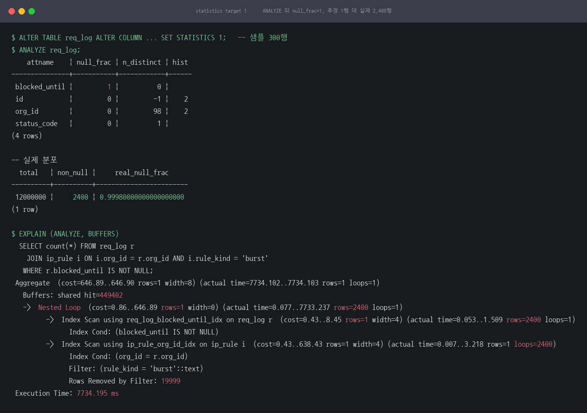
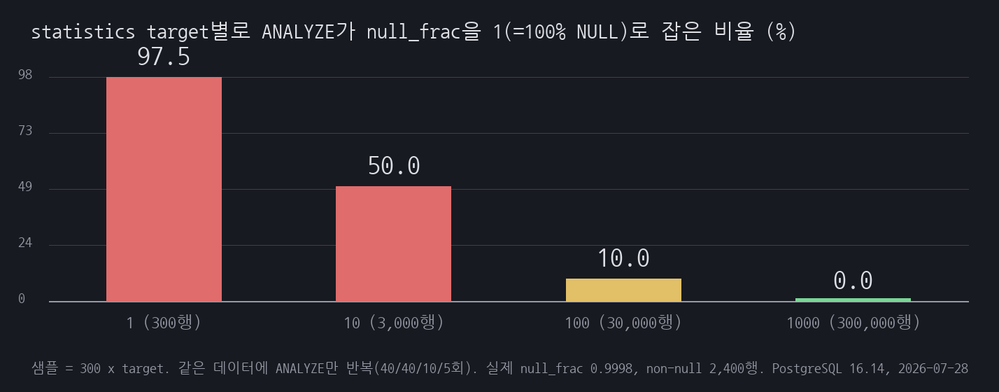
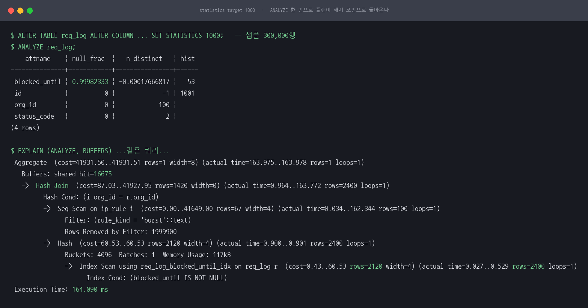
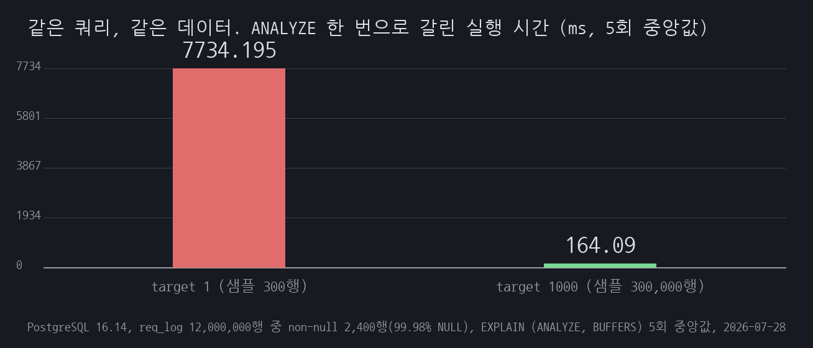

# A09 300행짜리 표본이 1,200만 행을 100% NULL이라고 단정했다

## 1. 유명한 이유

Clerk이 공개한 2026년 2월 19일 장애입니다. 포스트모템은 시작 시각을 "On February 19, 2026 at 8:11 AM PST"로 적고, 복구까지를 "Service was restored approximately 90 minutes later"로 적습니다. 복구 수단은 ANALYZE를 손으로 다시 돌려 이전 플랜으로 되돌린 것이었습니다. 방아쇠는 배포가 아니라 자동 analyze였습니다. 원인 문장이 이 세션의 전부입니다.

> the planner's sample size was too low and it only found NULL values, which led it to erroneously conclude that 100% of the values were NULL.

문제의 컬럼은 NULL 비율이 "very high (99.9996%)"였고, 플래너는 non-null이 0건이라고 보고 플랜을 짰는데 실제로는 "in fact it returned over 17,000"이었습니다. 결과는 "over 95% of traffic returning 429 without being handled."였습니다. Clerk은 같은 달 2월 10일에 별건 DNS 장애 포스트모템도 냈으니, 이 세션이 다루는 것은 2월 19일 건입니다.

같은 메커니즘의 1차 기록이 하나 더 있습니다. GoCardless의 Lawrence Jones가 쓴 "Debugging the Postgres query planner"입니다. 약 5억 행 payment_transitions에서 payout_id의 n_distinct가 25,650으로 잡혔는데 실제는 약 350만이었습니다. 그래서 플래너는 매칭 행을 2,688건으로 추정했고 실제는 보통 20건대였습니다. 원인은 PostgreSQL이 페이지를 먼저 고르고 그 안에서 행을 뽑는 2단계 표본추출을 하는데, 같은 payout의 행들이 디스크에서 붙어 있어 표본이 편향된 것이었습니다. 조치는 `ALTER TABLE payment_transitions ALTER COLUMN payout_id SET STATISTICS 1666`이었고, 그것으로 모자라 5000까지 올렸습니다.

근거 등급은 E1입니다.

- [Clerk, "Postmortem: Clerk System Outage (February 19, 2026)"](https://clerk.com/blog/2026-02-19-system-outage-postmortem)
- [GoCardless, Lawrence Jones, "Debugging the Postgres query planner"](https://gocardless.com/blog/debugging-the-postgres-query-planner/)

카탈로그에 적힌 "통계 오염"이라는 이름은 오해를 부릅니다. 누가 통계를 더럽힌 것이 아니고 통계가 낡은 것도 아닙니다. 두 사건 모두 ANALYZE는 정상 동작했고, 방금 갱신된 통계가 문제였습니다. 표본이 실제 분포를 못 잡았을 뿐입니다. 극단적으로 치우친 분포에서는 표본 추출이 무력해지고, 그럴수록 "방금 돌린 ANALYZE"가 오히려 방아쇠가 됩니다. 이 세션은 그 지점을 재현합니다.

수십억 행 규모와 실제 트래픽은 재현할 수 없어, 같은 메커니즘을 1,200만 행으로 축소해 재현했습니다. 사건의 90분이나 429 비율을 이 세션의 수치와 직접 비교할 수는 없습니다.

## 2. 재현

PostgreSQL 16.14(postgres:16-alpine) 하나로 만듭니다. 세션 디렉터리에서 `bash scripts/run.sh` 한 번이면 데이터 적재부터 계측까지 순서대로 돌고, 명령과 출력 원문은 [reproduce.md](reproduce.md)에 그대로 남겼습니다.

데이터는 Clerk의 조건을 축소한 것입니다. `req_log`는 1,200만 행(507MB, 64,868페이지)이고 `blocked_until` 컬럼은 요청이 레이트리밋에 걸렸을 때만 값이 찹니다. non-null은 2,400행으로 NULL 비율이 99.98%입니다. non-null 행을 마지막에 넣어 디스크상 테이블 끝쪽 몇 페이지에 몰리게 했습니다. `ip_rule`은 조직별 IP 차단 규칙 200만 행이고 org_id에만 인덱스가 있습니다. 조직 100개에 조직마다 20,000행이 붙어 있고 그중 `rule_kind='burst'`는 조직마다 1행뿐입니다. 2코어 공유 서버라 병렬 플랜과 JIT가 시간 비교를 흔들어서 `max_parallel_workers_per_gather=0`, `jit=off`로 고정했고, 통계 갱신 시점을 스크립트가 쥐도록 `autovacuum=off`로 두었습니다.

먼저 statistics target을 1로 낮추고 ANALYZE를 돌립니다. 표본은 300행입니다.

```
    attname    | null_frac | n_distinct | hist
---------------+-----------+------------+------
 blocked_until |         1 |          0 |
```

`null_frac`이 1입니다. 300행 표본이 NULL만 봤으므로 플래너는 이 컬럼에 값이 든 행이 하나도 없다고 결론지었습니다. `n_distinct`는 0이고 히스토그램은 아예 만들어지지 않았습니다. 실제 null_frac은 0.9998이고 non-null은 2,400행입니다. Clerk 원문의 "erroneously conclude that 100% of the values were NULL"이 `pg_stats` 한 줄로 나타난 상태입니다.

이 상태에서 차단된 요청과 조직별 burst 규칙을 잇는 조인을 재면 이렇게 됩니다.

```
 Aggregate  (cost=646.89..646.90 rows=1 width=8) (actual time=7734.102..7734.103 rows=1 loops=1)
   Buffers: shared hit=449402
   ->  Nested Loop  (cost=0.86..646.89 rows=1 width=0) (actual time=0.077..7733.237 rows=2400 loops=1)
         ->  Index Scan using req_log_blocked_until_idx on req_log r  (cost=0.43..8.45 rows=1 width=4) (actual time=0.053..1.509 rows=2400 loops=1)
         ->  Index Scan using ip_rule_org_id_idx on ip_rule i  (cost=0.43..638.43 rows=1 width=4) (actual time=0.007..3.218 rows=1 loops=2400)
               Rows Removed by Filter: 19999
 Execution Time: 7734.195 ms
```

추정 1행, 실제 2,400행입니다. 플래너는 바깥이 1행이라고 믿었기 때문에 중첩 루프를 골랐고, 안쪽 인덱스 스캔이 2,400번 돌면서 회당 20,000행을 읽고 19,999행을 버렸습니다. 합치면 약 4,800만 행이고 버퍼는 449,402개가 닿았습니다. 실행 시간 중앙값은 5회에서 7,734.195 ms였습니다(7,434.809부터 8,253.634까지).



*그림 1. statistics target 1에서 ANALYZE를 돌린 직후입니다. null_frac이 1로 잡히고, 같은 컬럼의 실제 non-null은 2,400행이며, 추정 1행을 믿은 플랜이 7.7초를 씁니다.*

## 3. 내부 원리

PostgreSQL의 ANALYZE는 테이블 전체를 읽지 않고 표본을 뜹니다. 표본 크기는 `300 x statistics target`이고, 중요한 것은 이 값이 컬럼별이 아니라 ANALYZE 한 번에 대해 하나로 정해진다는 점입니다. 분석 대상 컬럼들의 target 중 최댓값이 표본 크기를 결정합니다. 그래서 문제 컬럼 하나만 낮추면 표본은 줄지 않습니다. 실측으로 확인했습니다. `blocked_until`만 target 1로 두고 나머지를 기본값 100으로 남기면 표본은 여전히 30,000행이고, null_frac은 0.9998, 추정 행수는 2,400으로 정확하게 나옵니다([results/09-one-column.txt](results/09-one-column.txt)).

표본 추출 자체는 2단계입니다. 먼저 페이지를 무작위로 고르고, 고른 페이지 안에서 행을 뽑습니다. GoCardless가 지목한 편향이 여기서 나옵니다.

극단적으로 치우친 컬럼에서 이 구조가 왜 무너지는지는 곱셈 한 번이면 보입니다. 표본에 들어올 non-null의 기대 건수는 `표본 크기 x non-null 비율`입니다. 이 실험은 300 x 0.0002 = 0.06건입니다. 기대값이 1보다 한참 작으면 표본은 대개 NULL만 보게 되고, 그때 플래너는 100% NULL이라고 적습니다. Clerk이 어떤 target을 썼는지는 포스트모템에 나오지 않지만, 기본값 100이었다면 표본은 30,000행이고 30,000 x 0.000004 = 0.12건입니다. 테이블 크기가 아니라 이 곱이 같으면 같은 일이 벌어집니다. 이 세션이 표본을 줄여 큰 테이블을 대신한 근거가 이것입니다.

기대값이 1 근처라는 말은 결과가 회차마다 달라진다는 뜻이기도 합니다. target을 바꿔 가며 ANALYZE만 반복해 셌습니다.

| statistics target | 표본 | null_frac이 1 | 추정 행수 최소 | 최대 | 평균 |
|---|---|---|---|---|---|
| 1 | 300행 | 40회 중 39회 | 1 | 39,982 | 1,001 |
| 10 | 3,000행 | 40회 중 20회 | 1 | 23,998 | 3,800 |
| 100 (기본값) | 30,000행 | 10회 중 1회 | 1 | 6,400 | 2,800 |
| 1000 | 300,000행 | 5회 중 0회 | 1,880 | 2,640 | 2,232 |

실제 행수는 2,400입니다. 데이터도 쿼리도 그대로인데 ANALYZE를 다시 돌린다는 이유만으로 추정치가 1행과 39,982행 사이를 오갑니다.



*그림 2. 같은 데이터에 ANALYZE만 반복해 null_frac이 1로 잡히는 비율을 셌습니다. 기본값인 target 100에서도 10회 중 1회가 나왔습니다.*

null_frac이 1이면 `IS NOT NULL`의 선택도는 `1 - null_frac`이라 0이 되고, PostgreSQL은 추정 행수를 0으로 두지 않고 1로 올려 잡습니다. EXPLAIN의 `rows=1`이 그 값입니다. 바깥이 1행이면 중첩 루프의 비용은 안쪽 스캔 한 번 값이라 어떤 조인보다 싸 보입니다. 그래서 플랜이 중첩 루프로 넘어가고, 실제로는 2,400번 돌면서 매번 20,000행을 훑습니다. 통계가 맞으면 같은 자리에 해시 조인이 들어와 `ip_rule`을 한 번만 순차 스캔합니다. 버퍼 449,402개와 16,675개의 차이가 그 차이입니다.

한 가지 더 있습니다. PostgreSQL 14부터는 중첩 루프 안쪽에 Memoize 노드를 끼워 같은 키의 결과를 재사용할 수 있습니다. 이 쿼리의 바깥은 org_id가 100종뿐이라 Memoize가 붙으면 안쪽이 100번만 돌면 됩니다. 그런데 플래너가 바깥을 1행으로 보면 캐시할 이유가 없다고 판단해 Memoize를 붙이지 않습니다. 오추정이 나쁜 조인 방식을 고르게 만든 데 더해, 그 조인을 구제할 장치까지 걷어낸 셈입니다.

GoCardless 쪽 메커니즘도 같은 자리에서 나옵니다. 행 내용이 완전히 같고 디스크상 순서만 다른 두 표를 만들어 비교했습니다. payout_id 하나에 20행씩, 실제 distinct는 150,000입니다.

| statistics target | 표본 | clustered n_distinct | shuffled n_distinct | clustered 추정 행수 | shuffled 추정 행수 |
|---|---|---|---|---|---|
| 1 | 300행 | 3,308 | 44,192 | 907 | 68 |
| 10 | 3,000행 | 28,394 | 182,437 | 106 | 16 |
| 100 | 30,000행 | 149,375 | 148,339 | 20 | 20 |

실제 매칭 행수는 두 표 모두 20입니다. 같은 데이터인데 물리적 순서만 바꾸면 target 10에서 n_distinct가 28,394와 182,437로 6.4배 갈립니다. 같은 payout의 행들이 한 페이지에 몰려 있으면 표본이 그 페이지를 잡을 때마다 같은 값을 여러 번 보게 되고, 표본 안의 중복이 많아질수록 추정기는 distinct가 적다고 판단합니다. distinct가 적다고 보면 값 하나에 붙는 행이 많다고 보게 되므로, 추정 행수가 20에서 907로 부풀었습니다. GoCardless가 실제로 겪은 2,688건 대 20건과 같은 방향입니다.

## 4. 해소

두 사건이 실제로 쓴 수단은 하나입니다. 컬럼 단위 statistics target을 올리고 ANALYZE를 다시 돌리는 것입니다. Clerk은 ANALYZE 수동 재실행으로 90분 만에 복구했고 재발 방지에 target 상향을 넣었습니다. GoCardless는 1666으로 올렸다가 모자라 5000까지 올렸습니다.

이 세션에서는 1000으로 올렸습니다. 표본이 300행에서 300,000행으로 늘고 기대 non-null 건수가 0.06건에서 60건이 됩니다.

```sql
ALTER TABLE req_log
  ALTER COLUMN id            SET STATISTICS 1000,
  ALTER COLUMN org_id        SET STATISTICS 1000,
  ALTER COLUMN status_code   SET STATISTICS 1000,
  ALTER COLUMN blocked_until SET STATISTICS 1000;
ANALYZE req_log;
```

네 컬럼을 함께 올린 이유는 3절에 적은 대로입니다. 표본 크기는 테이블 단위로 정해지므로 문제 컬럼 하나만 올려도 되지만, 반대로 다른 컬럼이 낮게 남아 있으면 그 값이 의미를 갖지 못합니다. 실무에서는 문제 컬럼만 올리는 것으로 충분하고, 이 실험은 낮은 상태를 만들기 위해 전부 낮췄다가 전부 올린 것입니다.

값은 공짜가 아닙니다. 같은 테이블에서 target별 ANALYZE 소요 시간을 3회씩 쟀습니다([results/60-analyze-cost.txt](results/60-analyze-cost.txt)).

| statistics target | 표본 | ANALYZE 소요(2, 3회차) | blocked_until 히스토그램 |
|---|---|---|---|
| 1 | 300행 | 4.235 / 4.252 ms | 없음 |
| 100 | 30,000행 | 272 / 295 ms | 4 |
| 1000 | 300,000행 | 1.213 / 1.170 초 | 55 |
| 10000 | 3,000,000행 | 6.369 / 6.270 초 | 605 |

표본을 300행에서 300만 행으로 1만 배 늘리면 ANALYZE는 4.2 ms에서 6.3초로 1,500배 느려집니다. 표본이 커질수록 테이블 전체를 읽는 쪽에 가까워지므로 증가가 선형보다 완만하지만, 자동 analyze가 자주 도는 대형 테이블이라면 이 시간이 그대로 부하가 됩니다. 문제가 확인된 컬럼에만 올리는 편이 안전한 이유입니다. 저장 공간은 문제가 아니었습니다. `pg_statistic`은 target 10000에서도 664kB였습니다(공유 카탈로그라 한 번 커지면 줄지 않아서, 표의 각 행을 이 값의 증분으로 읽으면 안 됩니다). 히스토그램이 길어지면 플래닝 시간도 늘어나는데, 이 쿼리에서는 1.474 ms와 1.460 ms로 차이가 보이지 않았습니다.

다른 방법도 있습니다. 이 사례처럼 "값이 있는 행만 찾는" 패턴이 고정되어 있다면 부분 인덱스(`CREATE INDEX ... WHERE blocked_until IS NOT NULL`)를 생각해 볼 수 있습니다. 1,200만 개 항목 대신 2,400개만 담으므로 인덱스가 훨씬 작아집니다. 다만 이것이 null_frac 오판까지 고쳐 주는지는 이 세션에서 재보지 않았고, 통계 자체를 고치는 것이 아니라 같은 컬럼을 쓰는 다른 쿼리에는 효과가 없습니다. Clerk이 재발 방지에 넣은 plan flip 알럿은 방향이 다릅니다. 오판을 막지는 못하지만, 배포가 없는 시각에 플랜이 바뀌었다는 사실을 사람이 알아채게 해 줍니다.

확장 통계(`CREATE STATISTICS`)는 이 자리에 맞지 않습니다. 확장 통계는 여러 컬럼 사이의 상관을 다루는 도구이고, 이 문제는 컬럼 하나의 null_frac을 표본이 못 잡은 것이라 다중 컬럼 통계로는 해결되지 않습니다. 두 사건 어디에도 확장 통계는 등장하지 않습니다. 일반적인 대안으로 알아 둘 만하다는 정도입니다.

## 5. 재계측

target을 1000으로 올리고 ANALYZE를 한 번 돌린 뒤 같은 쿼리를 같은 방식으로 다시 쟀습니다.

```
    attname    | null_frac  |   n_distinct   | hist
---------------+------------+----------------+------
 blocked_until | 0.99982333 | -0.00017666817 |   53
```

```
 Aggregate  (cost=41931.50..41931.51 rows=1 width=8) (actual time=163.975..163.978 rows=1 loops=1)
   Buffers: shared hit=16675
   ->  Hash Join  (cost=87.03..41927.95 rows=1420 width=0) (actual time=0.964..163.772 rows=2400 loops=1)
         ->  Seq Scan on ip_rule i  (cost=0.00..41649.00 rows=67 width=4) (actual time=0.034..162.344 rows=100 loops=1)
         ->  Hash  (cost=60.53..60.53 rows=2120 width=4) (actual time=0.900..0.901 rows=2400 loops=1)
               ->  Index Scan using req_log_blocked_until_idx on req_log r  (cost=0.43..60.53 rows=2120 width=4) (actual time=0.027..0.529 rows=2400 loops=1)
 Execution Time: 164.090 ms
```



*그림 3. statistics target을 1000으로 올리고 ANALYZE를 한 번 돌린 결과입니다. null_frac이 실제값에 붙고 추정 행수가 2,120으로 잡히면서 플랜이 해시 조인으로 돌아왔습니다.*

| 통계 상태 | null_frac | 추정 행수 | 실제 행수 | 조인 방식 | shared hit | 중앙값 |
|---|---|---|---|---|---|---|
| target 1, 표본이 전부 NULL | 1 | 1 | 2,400 | Nested Loop | 449,402 | 7,734.195 ms |
| target 1, 표본이 non-null 1행 | 0.99666667 | 39,982 | 2,400 | Nested Loop + Memoize | 18,750 | 356.168 ms |
| target 1000 | 0.99982333 | 2,120 | 2,400 | Hash Join | 16,675 | 164.090 ms |

추정 행수는 1에서 2,120이 되어 실제 2,400의 88%에 들어왔고, 실행 시간은 7,734.195 ms에서 164.090 ms로 47배 줄었습니다. 닿은 버퍼는 449,402개에서 16,675개로 27배 줄었습니다. 데이터도 쿼리도 인덱스도 바꾸지 않았고, 바꾼 것은 ANALYZE가 몇 행을 보느냐뿐입니다.



*그림 4. 같은 쿼리, 같은 데이터에서 표본 크기만 바꾼 전후입니다. 5회 중앙값으로 7,734.195 ms와 164.090 ms입니다.*

대조군도 같이 쟀습니다. 같은 오추정 상태에서 `org_plan`(org_id 하나에 1행, 인덱스 있음)과 조인하면 중앙값이 1.506 ms이고, 통계를 고친 뒤에도 1.498 ms로 같았습니다. 추정이 2,400배 틀렸는데도 피해가 없습니다.

## 6. 예상과 달랐던 점

다섯 가지가 처음 생각과 달랐습니다.

첫째, 문제 컬럼 하나만 `SET STATISTICS 1`로 낮추면 아무 일도 일어나지 않았습니다. 처음에 `blocked_until`만 낮추고 ANALYZE를 돌렸는데 null_frac이 0.9998로 정확하게 나왔습니다. 표본 크기가 컬럼별이 아니라 ANALYZE 한 번 단위로, 분석 대상 컬럼 target의 최댓값으로 정해지기 때문입니다. 나머지 컬럼이 기본값 100이면 표본은 30,000행 그대로입니다. 뒤집어 말하면 고칠 때는 문제 컬럼 하나만 올려도 표본이 늘어난다는 뜻입니다. GoCardless가 컬럼 하나에만 1666을 건 것이 그래서 통합니다.

둘째, 같은 ANALYZE 명령이 회차마다 다른 결론을 냈습니다. target 1에서 40회 중 39회는 null_frac을 1로, 나머지 1회는 0.99666667로 적었습니다. 그리고 그 한 번의 차이가 추정 행수를 1에서 39,982로, 16배 과대추정 쪽으로 던져 놓습니다. 표본이 non-null을 딱 한 행 잡았다는 이유만으로 그렇습니다. 배포도 데이터 변경도 없이 한밤중에 플랜이 뒤집힌다는 말이 무슨 뜻인지 여기서 이해했습니다. 자동 analyze는 계속 돌고, 매번 주사위를 던지고 있습니다.

셋째, 기본값에서도 났습니다. 이 실험을 시작할 때는 "target을 1까지 낮췄으니 인위적이다"라고 적을 생각이었는데, target 100(기본값, 표본 30,000행)에서도 10회 중 1회가 null_frac 1이었고 추정 행수는 1에서 6,400 사이로 흔들렸습니다. 표본을 줄이는 것과 테이블을 키우는 것은 같은 레버라, 사건의 수십억 행 규모에서는 기본값이 곧 이 실험의 target 1에 해당합니다.

넷째, 오추정 자체는 무해할 수 있었습니다. 같은 null_frac=1 상태에서 안쪽이 싼 표를 만나면 1.5 ms로 끝났고, 통계를 고쳐도 1.5 ms였습니다. 2,400배 틀린 추정이 장애가 되려면 그 추정을 곱하는 자리(여기서는 안쪽에서 20,000행을 훑는 중첩 루프)가 있어야 합니다. "추정이 틀렸다"만으로는 알럿을 만들 수 없고, 틀린 추정이 어디에 곱해지는지를 봐야 합니다.

다섯째, Memoize가 두 번째로 나쁜 플랜을 구했습니다. 추정이 39,982행이던 회차에서는 같은 중첩 루프인데도 356 ms에 끝났는데, 플랜에 Memoize가 붙어 안쪽이 2,400번이 아니라 100번만 돌았기 때문입니다(`Hits: 2300 Misses: 100`). 추정이 1행이던 회차에는 Memoize가 붙지 않았습니다. 캐시할 이유가 없다고 본 것입니다. 최악의 플랜은 "추정이 많이 틀린 쪽"이 아니라 "추정이 1행인 쪽"이었습니다.

## 한계

사건 규모는 재현하지 않았습니다. Clerk의 NULL 비율 99.9996%와 non-null 17,000행 이상을 그대로 맞추려면 40억 행대 테이블이 필요합니다. 이 세션은 1,200만 행에 non-null 2,400행(99.98%)을 두고 표본을 300행으로 줄여 `표본 크기 x non-null 비율`을 0.06으로 맞췄습니다. 사건의 조건이 기본 표본 30,000행 기준 0.12였을 것이라는 계산과 같은 영역이지만, 이것은 우리 추론이고 포스트모템에 표본 크기가 적혀 있는 것은 아닙니다. 90분이라는 복구 시간, 트래픽 95% 이상이 429가 된 비율, 레이트리밋 애플리케이션 계층은 이 세션에서 다루지 않았습니다.

자동 analyze가 방아쇠였다는 사건의 인과 자체는 재현하지 않았습니다. 측정 중 통계가 저절로 바뀌면 계측이 흔들려서 `autovacuum=off`로 두고 ANALYZE를 손으로 돌렸습니다. `autovacuum_analyze_scale_factor` 같은 임계를 건드려 자동 analyze를 유도하는 실험은 하지 않았습니다.

GoCardless 쪽은 통계 왜곡까지만 재현했고 플랜이 뒤집히는 데까지 가지 않았습니다. 순서만 다른 두 표에서 n_distinct가 3,308 대 44,192로 갈리고, 실제 20건인 매칭 행수를 907건으로 추정하는 것까지는 확인했습니다. 그 뒤로는 나가지 않았습니다. 두 표에 payout_id 인덱스를 만들지 않아서 플래너에게 고를 것이 없었고, 어느 target에서도 순차 스캔만 나왔습니다. GoCardless가 겪은 인덱스 대신 비효율 플랜을 고르는 장면은 여기 없습니다. n_distinct 오차가 실제 플랜을 뒤집는 조건을 만드는 것은 다음 과제로 남깁니다.

ANALYZE의 표본 추출은 시드를 고정할 수 없어서, 이 세션의 "몇 회 중 몇 회"는 실행할 때마다 달라집니다. 스크립트는 원하는 상태가 나올 때까지 ANALYZE를 다시 돌리고 몇 회째였는지를 기록하는 방식으로 재현성을 확보했습니다. 이 실행에서 null_frac이 1이 아닌 회차는 62회째에 나왔습니다.

`shared_buffers` 512MB에 `ip_rule`이 130MB라 실험 내내 데이터가 메모리에 있었습니다. 디스크에서 읽어야 하는 환경이라면 중첩 루프 쪽 손해가 더 커집니다. 이 세션의 47배는 전부 캐시에 올라간 상태에서 나온 하한입니다.
