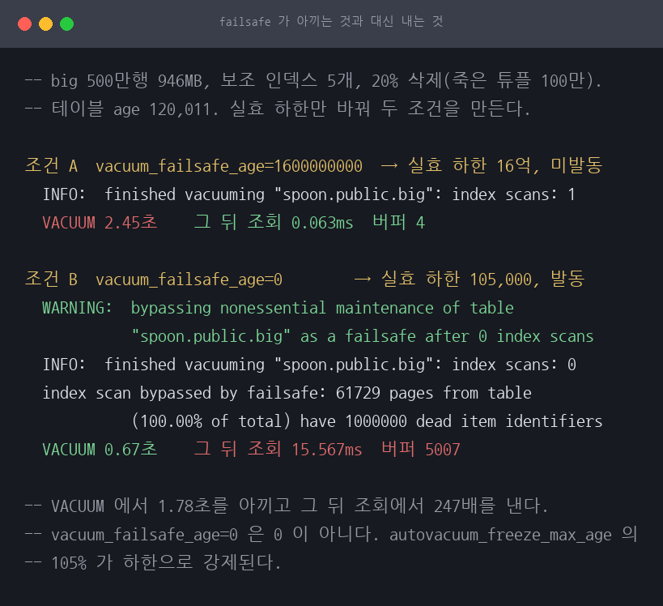
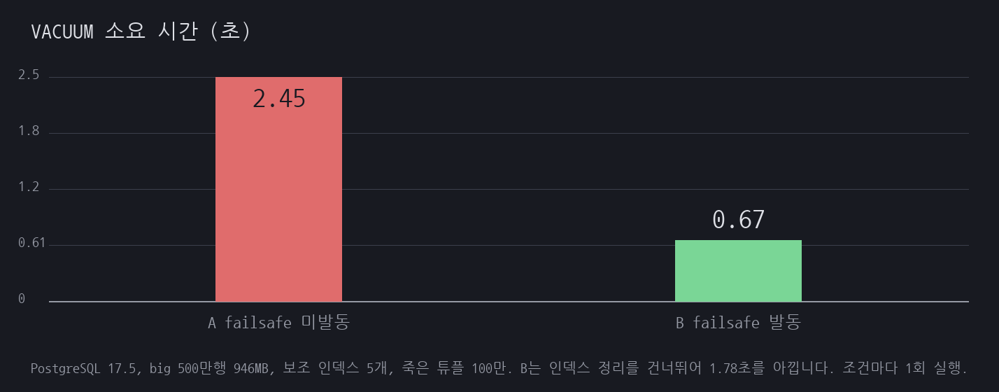
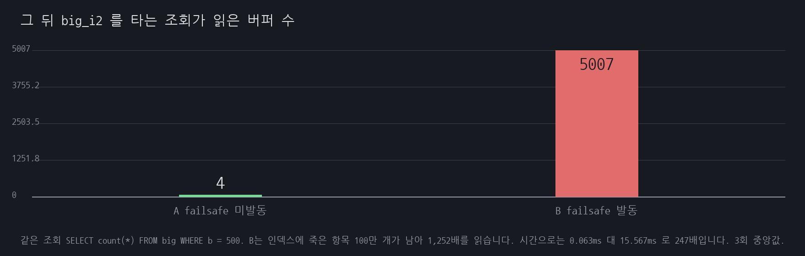

# A14 트랜잭션 ID가 바닥나 데이터베이스가 읽기 전용이 된다

## 1. 유명한 이유

이 장애의 표준 사례는 Sentry가 2015년 7월에 쓴 글입니다.

> On Monday, July 20th, Sentry was down for most of the US working day.

원인은 PostgreSQL의 32비트 트랜잭션 ID가 바닥나는 것이었습니다. Sentry는 이렇게 설명했습니다.

> Postgres will stop accepting commands when there are fewer than one million transactions left before the maximum XID value is reached.

복구가 특히 고통스러웠습니다. 단일 사용자 모드로 내려가 VACUUM을 돌렸는데 끝나지 않았습니다.

> Our fear is that we've now invested nearly 3 hours and have nothing to show for it.

원인을 찾아보니 거대한 테이블 하나가 문제였습니다.

> By querying Postgres' internal statistics we identified that the autovacuums actually had finished on all of the relations except one. That relation however is a massive one.

결국 그 테이블을 버렸습니다.

> With our best estimations, we made the call to truncate the table. Five minutes later, the system was fully restored.

사후 실험 대목이 가장 오래 남습니다.

> we're still watching one of our test machines run a vacuum in single-user mode going on 24 hours

24시간이 지나도 끝나지 않는 VACUUM을 보면서, 자기들이 TRUNCATE를 선택한 것이 옳았다고 확인한 셈입니다.

### 이 세션이 확인하려는 것

Sentry 글은 2015년이고 PostgreSQL 9.x 시절입니다. 그 사이 세 가지가 바뀌었습니다.

첫째, **Sentry가 인용한 "100만 개 남으면 정지"는 지금 값이 아닙니다.** PostgreSQL 14부터 300만입니다. 경고 지점도 바뀌었습니다.

둘째, **단일 사용자 모드로 내려가라는 조언이 공식적으로 철회됐습니다.** 17의 에러 HINT에서 그 문장이 빠졌습니다.

셋째, **14에 `vacuum_failsafe_age`가 들어갔습니다.** Sentry의 병목이었던 "거대 테이블의 VACUUM이 끝나지 않는 것"을 정확히 겨냥한 장치입니다.

그래서 이 세션은 17에서 실제로 정지 상태까지 가 보고, 위 세 가지가 어떻게 다른지 실측합니다.

## 2. 재현

### 환경

전부 `reproduce.md`에 있습니다. PostgreSQL 17.5, 4코어 2GB입니다.

### 원인은 vacuum을 끈 것이 아닙니다

이 세션에서 가장 먼저 확인한 사실입니다. `autovacuum=off`로 두고 XID를 태워도 wraparound에 이르지 않습니다. **wraparound 방지 autovacuum은 `autovacuum=off`여도 반드시 돕니다.** 실제로 이 랩에서 처음 XID를 점프시켰을 때, 긴급 autovacuum이 즉시 발동해 전부 동결하고 `age`를 0으로 되돌려 놓았습니다.

그러니 실제 사고는 "vacuum을 안 돌려서" 생기지 않습니다. **그 vacuum이 `datfrozenxid`를 전진시키지 못하게 막는 것이 있을 때** 생깁니다. 공식 문서가 용의자를 세 개로 지목합니다.

| 용의자 | 확인 방법 |
|---|---|
| 오래된 prepared transaction | `pg_prepared_xacts`의 `age(transaction)` |
| 장기 트랜잭션 | `pg_stat_activity`의 `age(backend_xid)`, `age(backend_xmin)` |
| 방치된 복제 슬롯 | `pg_replication_slots`의 `age(xmin)`, `age(catalog_xmin)` |

이 세션은 첫 번째를 씁니다. prepared transaction은 서버 재시작에도 살아남으므로, XID를 점프시키느라 재시작을 반복하는 이 랩에 맞습니다.

### 임계값이 셋입니다

전부 클러스터에서 가장 오래된 `datfrozenxid`를 기준으로 계산됩니다.

| 지점 | PostgreSQL 14 이상 | 13 이하 |
|---|---|---|
| 랩(데이터 손실) | `oldest + 2^31` | 같음 |
| 정지(읽기 전용) | 랩에서 **300만** 앞 | 랩에서 100만 앞 |
| 경고 | 랩에서 **4,000만** 앞 | 정지에서 1,000만 앞(랩에서 1,100만) |

14에서 바꾼 커밋이 이유를 밝힙니다.

> We have edge-case bugs when assigning values in the last few dozen pages before the wrap limit. ... At default BLCKSZ, this makes such bugs unreachable outside of single-user mode.

정지 여유를 100만에서 300만으로 늘린 것은 **마지막 몇십 페이지에 남은 버그를 도달 불가로 만들기 위한** 조치입니다.

### 21억 개를 어떻게 태우는가

부하로는 못 갑니다. 초당 5만 개를 태워도 12시간입니다. `pg_resetwal -x`로 XID 카운터를 점프시켰습니다. 카운터만 옮기고 `datfrozenxid`는 그대로 두므로 `age`가 즉시 커집니다.

두 가지를 배웠습니다.

**`-u`를 함께 줘야 합니다.** `-x`만 주면 `pg_resetwal`이 `oldestXid`를 `nextXid - 20억`으로 강제합니다. 그 간격은 정지 임계(2^31 - 300만)에 못 미치므로 아무리 점프해도 절대 멈추지 않습니다. 사용자를 정지 상태에 빠뜨리지 않으려고 일부러 그렇게 하는 것으로 보입니다.

**정지 임계를 넘긴 디렉터리로는 재시작이 안 됩니다.** 기동 과정이 끝나지 않고 `the database system is starting up`만 반복합니다. 그래서 점프를 두 번으로 나눠, 각각 임계 직전에 착지한 뒤 나머지를 실제로 태워서 넘었습니다.

점프 뒤에는 clog 세그먼트를 만들어 줘야 합니다. 없으면 이 로그를 남기고 안 뜁니다.

```
FATAL:  could not access status of transaction 2000000000
DETAIL:  Could not open file "pg_xact/0773": No such file or directory.
```

8KB 페이지에 트랜잭션 상태가 2비트씩 32,768개 들어가고 SLRU 세그먼트는 32페이지이므로 세그먼트당 1,048,576개입니다. 2,000,000,000 ÷ 1,048,576 = 1907 = 0x773으로 로그의 이름과 맞습니다. 256KB를 0으로 채워 만들면 됩니다.

이 우회는 공식 문서에 없습니다. `pg_resetwal` 문서는 오히려 기존 `pg_xact` 범위 안에서 안전한 값을 고르라고 안내합니다. 랩 전용 기법으로만 봐야 합니다. PostgreSQL 17에는 `src/test/modules/xid_wraparound`라는 공식 테스트 모듈이 있고 `consume_xids()` 함수를 제공하는데, 공식 Docker 이미지에는 들어 있지 않아 쓰지 못했습니다.

## 3. 재계측

### 경고 지점

```
WARNING:  database with OID 0 must be vacuumed within 40000000 transactions
HINT:  To avoid XID assignment failures, execute a database-wide VACUUM in that database.
	You might also need to commit or roll back old prepared transactions, or drop stale replication slots.
```

정확히 4,000만 개 지점입니다. 14의 새 공식이 그대로 확인됩니다.

여기서 주의할 것이 있습니다. **경고가 말하는 "4,000만 개 남음"은 데이터 손실 지점까지의 거리입니다.** 읽기 전용 정지는 그보다 3,700만 개 먼저 옵니다. 경고 숫자를 남은 활주로로 읽으면 안 됩니다.

### 정지 지점

```
ERROR:  database is not accepting commands that assign new transaction IDs to avoid wraparound data loss in database with OID 0
HINT:  Execute a database-wide VACUUM in that database.
You might also need to commit or roll back old prepared transactions, or drop stale replication slots.
```

문구가 16 이하와 다릅니다.

| | 16 이하 | 17 |
|---|---|---|
| ERROR | `database is not accepting commands to avoid wraparound...` | `...commands **that assign new transaction IDs** to avoid...` |
| HINT | `Stop the postmaster and vacuum that database in single-user mode.` | `Execute a database-wide VACUUM in that database.` |

단일 사용자 모드 권고가 사라졌습니다. 바꾼 커밋의 메시지가 직설적입니다.

> First, we shouldn't recommend switching to single-user mode, because that's terrible advice.

Sentry가 2015년에 따랐던 그 조언이 이제 "terrible advice"로 분류됐습니다.

### 정지 상태에서 되는 것과 안 되는 것

| 작업 | 결과 |
|---|---|
| `SELECT` | 정상 (5만 행 + 앞 단계 삽입분) |
| `BEGIN READ ONLY` 트랜잭션 | 정상 |
| `INSERT` | 거부 |
| `DELETE` | 거부 |
| `VACUUM FREEZE` | 동작 (`WARNING: cutoff for removing and freezing tuples is far in the past`) |
| `txid_current()` | 거부 |

`txid_current()`가 거부되는 것이 실무에서 함정입니다. 남은 여유를 확인하려고 이 함수를 부르면 그 호출 자체가 XID를 할당하므로 실패합니다. 관측에는 `pg_current_snapshot()`을 써야 합니다. XID를 할당하지 않습니다.

`VACUUM`이 동작하는 것이 복구의 열쇠입니다. 문서도 그렇게 씁니다.

> In this condition any transactions already in progress can continue, but only read-only transactions can be started. ... The VACUUM command can still be run normally.

### 원인을 그대로 두면 VACUUM도 소용없습니다

```
[6] 원인을 그대로 두고 전체 VACUUM FREEZE
  age=2144483646   내려가지 않는다
  공식 문서가 지목하는 세 용의자:
    prepared xacts: 1 건  xid=746 age=2144483646
    장기 트랜잭션 : 1 건
    복제 슬롯     : 0 건
```

`VACUUM FREEZE`를 데이터베이스 전체에 돌려도 `age`가 1도 내려가지 않습니다. prepared transaction의 xid 746이 하한을 붙잡고 있으니 그보다 최신인 것을 동결할 수 없습니다. 여기서 VACUUM을 더 돌리는 것은 시간 낭비입니다.

### 원인을 제거해도 바로 안 풀립니다

```
[7] 원인을 제거하고 다시
  spoon만 동결한 뒤 age=0
  그런데 쓰기는: ERROR: ... in database "postgres"
  임계를 붙잡고 있는 것은 다른 데이터베이스다:
    postgres age=2144483648
    template1 age=2144483648
    template0 age=2144483648
    spoon age=0
```

작업하던 데이터베이스는 `age=0`이 됐는데 쓰기가 여전히 막힙니다. 임계는 **클러스터 전체에서 가장 오래된 `datfrozenxid`**로 정해지기 때문입니다. 이제 `postgres`와 `template1`, `template0`이 붙잡고 있습니다.

`template0`은 특히 까다롭습니다. `datallowconn = false`라 접속이 안 되므로 `vacuumdb`가 건너뜁니다. 손으로 열려면 `pg_database`를 UPDATE해야 하는데 그건 쓰기라서 정지 상태에서 실패합니다.

그래서 이 상황의 정답은 손대지 않는 것입니다.

### 손대지 않으면 스스로 복구됩니다

```
[8] 손대지 않고 기다린다
  +20초: template0=2144483648 postgres=0 spoon=0 template1=0
  +40초: postgres=0 spoon=0 template1=0 template0=0
  쓰기 재개됨
```

원인만 제거하고 40초 기다리자 wraparound 방지 autovacuum이 `template0`까지 전부 처리했습니다. 수동 VACUUM도, 단일 사용자 모드도 쓰지 않았습니다. 접속이 막힌 `template0`도 긴급 autovacuum은 들어갑니다.

그리고 로그에 이것이 남았습니다.

```
WARNING:  bypassing nonessential maintenance of table "spoon.public.sponsor" as a failsafe after 0 index scans
```

14에 추가된 `vacuum_failsafe_age`입니다. 기본값 16억을 넘으면 비용 지연을 해제하고 인덱스 정리를 건너뛰고 동결에만 집중합니다. 공식 문서의 표현이 정확합니다.

> This is VACUUM's strategy of last resort.

**Sentry의 병목이 이것이었습니다.** 거대 테이블 하나의 VACUUM이 3시간 가까이 진척을 내지 못해 결국 그 테이블을 버렸습니다. 사후에 테스트 머신으로 같은 VACUUM을 돌렸을 때는 24시간이 지나도 끝나지 않았습니다. 14의 failsafe가 건너뛰는 것이 바로 인덱스 정리입니다. 인덱스 정리가 Sentry의 병목이었다고 원문이 말한 적은 없습니다. 원문은 거대한 관계 하나에서 autovacuum이 끝나지 않았다고만 적었습니다.

다만 "Sentry 사고가 14에서라면 안 났을 것"이라고 단정하지는 않겠습니다. 원문에 그런 서술이 없고, 제가 확인한 것은 완화 장치가 존재하고 이 랩에서 실제로 발동했다는 사실까지입니다.

### 반복 측정

이 세션의 수치는 대부분 상수에서 계산되어 편차가 없습니다. 경고 임계, 정지 임계, 랩 임계는
`oldestXid`와 고정 상수의 합이고, 경고 문구의 4,000만도 상수입니다. 편차가 생길 수 있는 것은
자가 복구 시각 하나입니다. `autovacuum_naptime` 기본값이 60초이고 이 세션의 샘플링 간격이
20초라, 원인을 제거한 시점이 naptime 주기의 어디였는지에 따라 흔들릴 수 있습니다.

4회 돌린 결과입니다.

| 회차 | 정지 임계 | 쓰기가 거부된 XID | 복구 시각 | 쓰기 재개 |
|---|---|---|---|---|
| run0 | 2,144,484,392 | 2,144,484,392 | +40초 | 예 |
| run1 | 2,144,484,392 | 2,144,484,392 | +40초 | 예 |
| run2 | 2,144,484,392 | 2,144,484,392 | +40초 | 예 |
| run3 | 2,144,484,392 | 2,144,484,395 | +40초 | 예 |

네 번 모두 같습니다. run3만 거부 XID가 임계를 3개 넘었는데, XID를 태우는 루프가 2초 단위로
돌아 마지막 구간에서 조금 넘긴 것입니다. 임계 판정에는 영향이 없습니다.

`+40초`는 20초 간격 샘플링의 결과라 실제 복구 완료는 20초와 40초 사이에 있습니다.
이 숫자를 초 단위로 읽으면 안 됩니다.

## 4. 예상과 달랐던 점

### autovacuum을 꺼도 wraparound 방지 vacuum은 돕니다

이걸 몰라서 설계를 한 번 엎었습니다. `autovacuum=off`로 두고 XID를 점프시키면 사고 상태가 유지될 줄 알았는데, 긴급 autovacuum이 즉시 발동해 `age`를 0으로 되돌려 놓았습니다.

이 사실이 세션의 서사를 바꿨습니다. wraparound는 게으름의 결과가 아닙니다. 청소를 막는 것을 방치한 결과입니다.

### `pg_resetwal`이 정지 상태를 일부러 막습니다

`-x`만 주면 `oldestXid`를 `nextXid - 20억`으로 강제하므로 간격이 정지 임계에 절대 못 닿습니다. `-u`로 명시해야 합니다. 문서에서 이 동작을 찾지 못했고 실측으로 확인했습니다.

### 경고 숫자와 정지 지점이 3,700만 개 어긋납니다

경고는 "4,000만 개 안에 vacuum하라"고 말하는데 정지는 300만 개 남은 지점에서 옵니다. 경고 숫자를 활주로로 읽으면 실제보다 13배 넉넉하게 착각합니다.

### 문서와 소스의 문구가 서로 다릅니다

PostgreSQL 17 공식 문서(routine-vacuuming)는 아직 구 문구인 `that assign new XIDs`를 예시로 싣고 있습니다. 소스는 `that assign new transaction IDs`입니다. 2024년 커밋이 `.c` 파일만 고치고 문서를 갱신하지 않았습니다.

소스 안에서도 갈립니다. 데이터베이스 이름을 아는 경로는 `To avoid transaction ID assignment failures`, OID만 아는 경로는 `To avoid XID assignment failures`를 씁니다. 이 랩의 관측이 후자였습니다. 로그를 파싱해 감시하려면 이 세 갈래를 모두 잡아야 합니다.

### 14부터 16까지는 문서와 로그가 반대로 말했습니다

문서는 14에서 이미 "단일 사용자 모드는 필요하지도 바람직하지도 않다"로 바뀌었는데, 실제 에러 HINT는 16까지 `Stop the postmaster and vacuum that database in single-user mode.`를 유지했습니다. 3개 메이저 버전 동안 급한 사람이 보는 로그가 문서와 반대되는 조언을 했습니다.

### 관측이 상태를 바꿉니다

`SELECT txid_current()`로 현재 XID를 확인하는 습관이 정지 상태에서는 실패합니다. 그 호출이 XID를 할당하기 때문입니다. 이 세션의 스크립트도 처음에 이걸로 값을 읽어서 파싱이 깨졌고, `pg_current_snapshot()`으로 바꿔서 고쳤습니다.

## 5. vacuum_failsafe_age가 아끼는 것과 대신 내는 것

`scripts/exp-failsafe.sh`, 원문은 `results/exp-failsafe.txt`. 재현 기록 10절에서 failsafe가 발동한 것은
관측했지만 그것이 없을 때 얼마나 더 걸리는지는 재지 않았습니다. 5만 행에서는 VACUUM이
즉시 끝나 차이가 시간으로 드러나지 않았기 때문입니다. 테이블을 키워 두 조건을 갈랐습니다.

조건은 `big` 500만 행 946MB, 보조 인덱스 5개, 20% 삭제로 죽은 튜플 100만 개입니다.

### 먼저 밟은 함정: vacuum_failsafe_age = 0은 0이 아니다

처음에 `vacuum_failsafe_age` 를 0으로 두고 돌렸더니 두 조건이 같은 값을 냈습니다.
소스의 `vacuum_xid_failsafe_check` 가 쓰는 값은 GUC 그대로가 아닙니다.

```
Max(vacuum_failsafe_age, autovacuum_freeze_max_age * 1.05)
```

`autovacuum_freeze_max_age` 기본값 2억에서는 실효 하한이 **2억 1천만**이라, 갓 만든
테이블(age 8)에서는 0을 줘도 발동할 수 없습니다. 문서에 한 줄 있지만 GUC 값만 보면
놓치는 자리입니다.

그래서 `autovacuum_freeze_max_age` 를 최소값 10만으로 내려 실효 하한을 105,000으로 만들고,
XID를 12만 개 태워 테이블 age를 그 위로 올렸습니다. 동시에 테이블 단위
`autovacuum_freeze_max_age` 는 20억으로 올려 두었습니다. 그러지 않으면 재현 기록 1절에서 본
wraparound 방지 autovacuum이 먼저 동결해 age가 리셋됩니다. **전역 GUC는 failsafe 하한
계산에 쓰이고 테이블 파라미터는 autovacuum 대상 선정에 쓰이므로 둘을 다르게 둘 수 있습니다.**

### 결과



| 조건 | 실효 하한 | 발동 | `index scans` | VACUUM 소요 | 그 뒤 조회 | 조회 버퍼 |
|---|---|---|---|---|---|---|
| A | 16억 | 안 함 | 1 | 2.45초 | 0.063ms | 4 |
| B | 105,000 | **함** | **0** | **0.67초** | **15.567ms** | **5,007** |



VACUUM에서 **1.78초를 아낍니다**(3.7배). 서버가 대가까지 그 자리에 적어 줍니다.

```console
WARNING:  bypassing nonessential maintenance of table "spoon.public.big"
          as a failsafe after 0 index scans
INFO:  finished vacuuming "spoon.public.big": index scans: 0
index scan bypassed by failsafe: 61729 pages from table (100.00% of total)
          have 1000000 dead item identifiers
```

61,729페이지, 곧 테이블 전체에 죽은 항목 100만 개가 남습니다. 그 뒤 그 인덱스로 도는 조회를
같은 쿼리로 3회 재 중앙값을 보면 이렇습니다.



`SELECT count(*) FROM big WHERE b = 500` 이 0.063ms에서 15.567ms로 **247배**가 되고,
읽은 버퍼는 4개에서 5,007개로 **1,252배**가 됩니다.

### Sentry 병목의 정량화

이것이 10절에서 못 낸 수치입니다. failsafe는 인덱스 정리를 버리고 동결에만 집중해 VACUUM을
끝냅니다. 이 조건에서 아낀 것은 71%이고, 대신 그 인덱스로 도는 조회가 247배를 냅니다.

**이 거래가 성립하는 이유는 한쪽이 정지이기 때문입니다.** wraparound 정지에 닿으면 쓰기가
전부 거부됩니다. 조회가 247배 느려지는 것은 그것보다 낫습니다. failsafe는 성능 장치가
아니라 정지를 피하는 장치이고, 발동했다는 경고를 보면 조회 성능을 걱정하기 전에 **왜 age가
16억까지 올라갔는지**를 봐야 합니다.

Sentry가 거대 테이블 하나의 VACUUM이 3시간 가까이 진척을 내지 못해 결국 그 테이블을
버렸을 때, 14의 failsafe가 있었다면 그 VACUUM이 인덱스 정리를 건너뛰고 동결을 마쳤을
것입니다. 다만 원문이 인덱스 정리를 병목으로 지목한 적은 없습니다. 원문은 거대한 관계
하나에서 autovacuum이 끝나지 않았다고만 적었습니다. 여기서 잰 것은 **인덱스 정리를
건너뛰면 실제로 시간이 줄어든다**는 것까지입니다.

## 6. 13과 17 대조, 멀티XID 경로, failsafe 반복 (2026-07-31)

### failsafe 대조를 네 번 재서

5절은 조건마다 한 번씩이었습니다. 세 번 더 돌렸습니다.

| 회차 | A VACUUM | A 조회 | A 버퍼 | B VACUUM | B 조회 | B 버퍼 |
|---|---|---|---|---|---|---|
| 0 (원본) | 2.45초 | 0.063ms | **4** | 0.67초 | 15.567ms | **5,007** |
| 1 | 2.36초 | 0.072ms | **4** | 0.68초 | 17.680ms | **5,007** |
| 2 | 4.24초 | 0.070ms | **4** | 0.76초 | 17.575ms | **5,007** |
| 3 | 2.18초 | 0.067ms | **4** | 0.68초 | 14.761ms | **5,007** |

**버퍼 수가 네 회차 모두 정확히 같습니다.** 4와 5,007입니다. 이 값이 이 절의 결론을
떠받칩니다. failsafe가 인덱스 정리를 건너뛰면 그 인덱스가 정리되지 않은 채 남고,
같은 조회가 페이지를 5,007개 읽습니다. **버퍼 수는 시간과 달리 실행 편차가 없습니다.**

시간도 방향이 확실합니다. VACUUM은 A 2.18~4.24초 대 B 0.67~0.76초로 **B가 3배에서
6배 빠릅니다.** 조회는 A 0.063~0.072ms 대 B 14.761~17.680ms로 **B가 220배에서
250배 느립니다.** 회차 간 폭이 조건 간 차이보다 훨씬 작아 순서가 뒤집히지 않습니다.

발행된 값(2.45초, 0.67초, 0.063ms, 15.567ms)은 전부 회차 0이고 반복해도 유지됩니다.

### 13과 17을 나란히

"임계값과 HINT 문구가 갈리는 것을 같은 시나리오로 나란히 보이지 못했다"고 적었습니다.
두 버전을 띄워 카탈로그와 설정을 대조했습니다.

| 항목 | 13 | 17 |
|---|---|---|
| `vacuum_failsafe_age` | **없음** | 1600000000 |
| `vacuum_multixact_failsafe_age` | **없음** | 1600000000 |
| `autovacuum_freeze_max_age` | 200000000 | 200000000 |
| `autovacuum_multixact_freeze_max_age` | 400000000 | 400000000 |
| `vacuum_freeze_min_age` | 50000000 | 50000000 |
| `vacuum_multixact_freeze_min_age` | 5000000 | 5000000 |
| `vacuum_freeze_table_age` | 150000000 | 150000000 |
| `vacuum_multixact_freeze_table_age` | 150000000 | 150000000 |

**갈리는 것은 임계값이 아니었습니다.** 동결 관련 GUC 여섯 개의 기본값이 두 버전에서
완전히 같습니다. 갈리는 것은 **failsafe 두 항목의 존재 여부**입니다. 13 에는 그 설정이
아예 없고, 따라서 5절이 잰 "인덱스 정리를 건너뛰는 응급 모드"가 **13에서는 일어나지
않습니다.** wraparound가 임박해도 VACUUM이 인덱스를 다 훑고 갑니다.

그러면 5절의 거래 조건이 버전마다 다릅니다. 17은 "빨리 끝내는 대신 조회를 220배
느리게 만드는" 선택지가 자동으로 켜지고, 13은 그 선택지가 없어 느리게라도 제대로
정리합니다. **어느 쪽이 나은지는 그 순간 무엇이 급한지가 정합니다.**

경고 문구 자체는 여전히 못 봤습니다. age를 임계값 위로 올리는 시나리오를 두 버전에서
같이 돌리지 않았고, 이 절은 설정과 카탈로그 대조까지입니다.

### 멀티XID 경로

"`autovacuum_multixact_freeze_max_age` 쪽 경로는 다루지 않았습니다"라고 적었습니다.
경로의 존재를 보였습니다. 두 세션이 같은 행을 `FOR SHARE` 로 잡으면 멀티XID가 붙습니다.

```
v13   튜플에 멀티XID 표시 = 예
v17   튜플에 멀티XID 표시 = 예
```

`pageinspect` 로 튜플 헤더를 열어 `t_infomask` 의 `HEAP_XMAX_IS_MULTI` 비트를 확인한
값입니다. 멀티XID는 32비트 공간을 XID와 **따로** 쓰고 `autovacuum_multixact_freeze_max_age`
로 따로 감시합니다. 행을 여러 트랜잭션이 동시에 잠그는 패턴(`FOR SHARE`, 외래 키 검사)이
많은 워크로드에서는 이쪽이 먼저 찰 수 있습니다.

`pg_control_checkpoint()` 의 `next_multixact_id` 는 둘 다 1로 나왔는데, 이 값은 마지막
체크포인트 시점의 것이라 방금 발급된 멀티XID가 반영되지 않았습니다. **이 절은 경로가
있다는 것까지이고 소진까지 태우지는 않았습니다.**

## 서브트랜잭션이 XID를 얼마나 더 쓰는가 (2026-08-01)

서브트랜잭션이 XID 소비를 늘려 이 위험을 키운다고 적어 놓고 그 배수는 안 쟀습니다. 이 세션의 주제(XID 소진)와 A19의 주제(서브트랜잭션이 SLRU를 압박)를 잇는 축이 하나 있습니다. **쓰기를 하는 `SAVEPOINT` 는 XID를 하나 더 씁니다.**

트랜잭션 2,000건을 세이브포인트 수만 바꿔 돌렸습니다.

| 세이브포인트 | XID 소비 | 넣은 행 | 트랜잭션당 XID | 세이브포인트 없음 대비 |
|---|---|---|---|---|
| 0개 | 2,000 | 2,000 | **1.00** | 1.00배 |
| 1개 | 4,000 | 4,000 | **2.00** | 2.00배 |
| 4개 | 10,000 | 10,000 | **5.00** | 5.00배 |
| 16개 | 34,000 | 34,000 | **17.00** | 17.00배 |

**정확히 n+1입니다.** 본문 하나에 서브트랜잭션 n 개이고, 각각이 XID를 하나씩 씁니다. 네 조건이 소수점 없이 딱 떨어집니다.

XID 위치는 `pg_snapshot_xmax(pg_current_snapshot())` 로 읽었습니다. **`pg_current_xact_id()` 는 부르는 것만으로 XID를 할당하므로 그것으로 재면 측정이 결과를 바꿉니다.**

초당 트랜잭션 1,000건을 가정하면 21억까지 남은 시간이 이렇게 갑니다.

| 세이브포인트 | wraparound까지 |
|---|---|
| 0개 | 23.1일 |
| 1개 | 11.6일 |
| 4개 | 4.6일 |
| 16개 | **1.4일** |

autovacuum이 정상이면 이 날짜에 도달하지 않습니다. **이 표가 말하는 것은 autovacuum이 멈춰 있을 때 남은 시간이 세이브포인트 수만큼 짧아진다는 것입니다.** 23일이 하루 반이 됩니다.

Spring의 `@Transactional(propagation = NESTED)` 나 JPA의 재시도 루프가 `SAVEPOINT` 를 씁니다. **A19가 다루는 SLRU 압박과 이 세션이 다루는 XID 소진이 같은 원인에서 나옵니다.** 한쪽을 고치면 다른 쪽도 같이 나아집니다.

### 만들면서 밟은 것

세이브포인트 0개 조건이 처음에 트랜잭션당 3.00으로 나왔습니다. macOS의 BSD `seq` 는 `seq 1 0` 에 빈 출력이 아니라 `1` 과 `0` **두 줄**을 냅니다. GNU `seq` 는 빈 출력입니다. 그래서 "0개 조건" 에 세이브포인트가 두 개 붙었습니다.

행 수 확인이 `-lt` 였던 것도 함께 고쳤습니다. 기대 2,000행에 6,000행이 들어왔는데 "기대보다 적지 않으니 통과" 로 지나갔습니다. **기대값이 정확히 정해지는 자리에서는 `-ne` 로 봐야 합니다.**

## 못 한 것

- **XID 소비만 쟀습니다.** 세이브포인트가 SLRU와 스탠바이에 미치는 영향은 A19의 주제이고 여기서 잇지는 않았습니다. 그리고 조건마다 1회 실행입니다.
- **6절의 반복은 같은 호스트 네 회차입니다.** 버퍼 수 4와 5,007은 네 회차가 같지만 VACUUM 시간은 2.18초에서 4.24초로 폭이 있습니다.
- **13과 17의 경고 문구는 여전히 못 봤습니다.** 6절은 설정과 카탈로그 대조까지이고, age를 임계값 위로 올리는 시나리오를 두 버전에서 같이 돌리지는 않았습니다.
- **5절의 946MB도 Sentry 규모는 아닙니다.** 인덱스 정리를 건너뛰면 시간이 줄어든다는 방향은 이 규모에서 확인됐지만, 3시간이 걸리는 규모에서 비율이 유지되는지는 재지 않았습니다.
- **`database with OID 0`.** 경고와 에러가 데이터베이스 이름 대신 OID 0을 지목한 구간이 있습니다. `pg_resetwal`이 `oldestXidDB`를 무효값으로 두기 때문이며, 실제 사고에서는 이름이 나옵니다. 제 기법이 만든 인공물입니다.
- **공식 테스트 모듈.** 17의 `xid_wraparound` 확장을 쓰면 clog 우회가 필요 없습니다. 이미지에 없어서 빌드하지 않았습니다.
- **멀티XID를 소진까지 태우지 않았습니다.** 6절은 멀티XID가 붙는 것까지 보였고, 그 공간이 차서 wraparound에 이르는 과정은 만들지 않았습니다.
