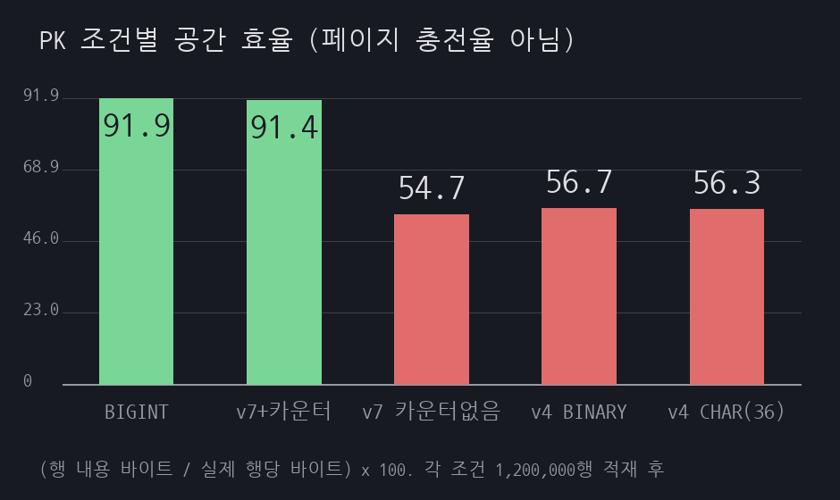
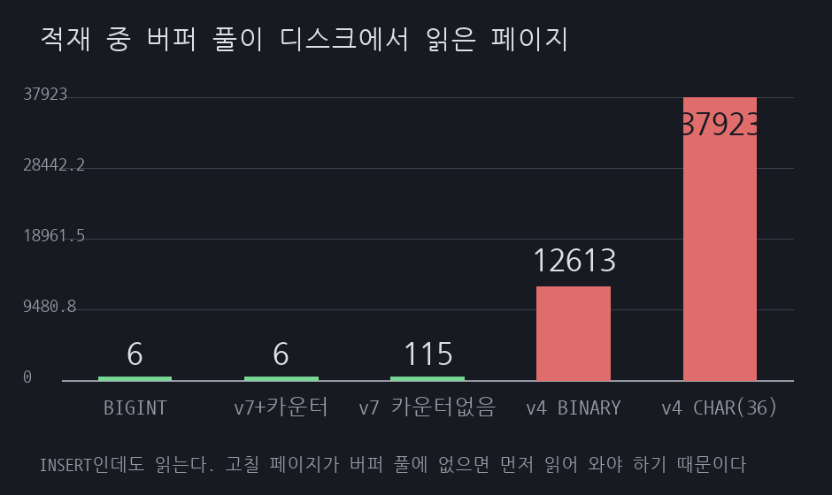
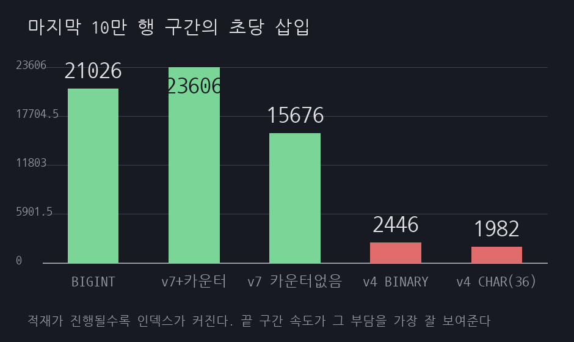

# A17 UUIDv7로 바꿨는데 테이블이 안 줄었다

> 근거 등급: `E2`
> 출처: [PlanetScale, The Problem with Using a UUID Primary Key in MySQL](https://planetscale.com/blog/the-problem-with-using-a-uuid-primary-key-in-mysql), [RFC 9562 UUID](https://www.rfc-editor.org/rfc/rfc9562.html), [Percona, UUIDs are Popular, but Bad for Performance](https://www.percona.com/blog/uuids-are-popular-but-bad-for-performance-lets-discuss/)

## 1. 유명한 이유

랜덤 UUID를 PK로 쓰면 안 된다는 경고는 오래됐습니다. PlanetScale은 순차 PK가 페이지를 약 94%까지 채우는 반면 랜덤 PK는 50%까지 떨어진다고 적고, Percona도 같은 메커니즘을 지적합니다. 처방도 함께 붙어 있습니다. 시간 순서가 앞에 오는 UUIDv6이나 UUIDv7을 쓰라는 것입니다.

RFC 9562도 그 이유를 밝힙니다.

> Time-ordered monotonic UUIDs benefit from greater database-index locality because the new values are near each other in the index. The real-world differences in this approach of index locality versus random data inserts can be one order of magnitude or more.

여기까지 읽고 UUIDv7으로 바꾸면 문제가 끝난다고 생각했습니다. 실제로 재 보니 절반만 맞았습니다. 랜덤 PK가 물리는 대가는 두 가지인데 UUIDv7이 그중 하나만 해결합니다. 나머지 하나를 해결하려면 같은 RFC의 다른 절을 읽어야 합니다.

이 세션은 PK 다섯 가지로 같은 행 120만 개를 넣고, 테이블 크기와 적재 속도와 적재 중 디스크 읽기를 함께 잽니다.

## 2. 재현

### 환경

| 항목 | 값 |
|---|---|
| 호스트 | Rocky Linux, 커널 5.14.0-570.33.2.el9_6.aarch64, 2코어, 11GB |
| DB | MySQL 8.4.3 (컨테이너 `cpus: 2`, `mem_limit: 2g`) |
| 버퍼 풀 | 256MB, 인스턴스 1개, `O_DIRECT` |
| 적재 | 조건마다 120만 행, 배치 1,000행, 페이로드 120바이트 고정 |

버퍼 풀을 256MB로 작게 잡은 것이 조건입니다. 랜덤 PK의 대가 중 하나는 "고칠 페이지가 메모리에 없어서 디스크에서 읽어 와야 한다"는 것이라, 인덱스가 버퍼 풀보다 커지는 지점을 지나야 드러납니다. 이 실험에서 랜덤 조건들의 테이블은 327MB에서 370MB로 버퍼 풀을 넘어섭니다.

조건마다 볼륨까지 지우고 컨테이너를 새로 띄웠습니다. 같은 인스턴스에 앞 조건의 테이블이 남으면 버퍼 풀을 나눠 쓰게 되고 데이터 파일 확장 비용도 달라집니다.

### 다섯 조건

페이로드 컬럼은 전부 같고 PK만 다릅니다.

| 조건 | PK 타입 | 값의 성질 |
|---|---|---|
| BIGINT 순차 | `BIGINT AUTO_INCREMENT` | 완전 단조 증가 |
| UUIDv7 (밀리초 카운터) | `BINARY(16)` | 단조 증가. 같은 밀리초 안에서는 카운터가 순서를 매김 |
| UUIDv7 (카운터 없음) | `BINARY(16)` | 밀리초 단위로만 증가. 같은 밀리초 안의 값끼리는 무순서 |
| UUIDv4 BINARY(16) | `BINARY(16)` | 완전 랜덤 |
| UUIDv4 CHAR(36) | `CHAR(36)` | 완전 랜덤 + 문자열 저장 |

가운데 두 조건이 이 세션의 핵심 대조입니다. 컬럼 타입과 길이가 같고 값을 만드는 방식만 다르므로, 둘 사이의 차이는 전부 "같은 밀리초 안에서 순서가 있느냐"에서 나옵니다.

### 결과

| 조건 | 테이블 | 행당 바이트 | 공간 효율 | 총 시간 | 평균 | 마지막 10만 행 |
|---|---|---|---|---|---|---|
| BIGINT 순차 | 191.7MB | 167.5 | 91.9% | 56.7초 | 21,176행/s | 21,026행/s |
| UUIDv7 (밀리초 카운터) | 202.8MB | 177.2 | 91.4% | 62.5초 | 19,189행/s | 23,606행/s |
| UUIDv7 (카운터 없음) | 339.0MB | 296.2 | 54.7% | 75.4초 | 15,908행/s | 15,676행/s |
| UUIDv4 BINARY(16) | 327.0MB | 285.7 | 56.7% | 178.9초 | 6,708행/s | 2,446행/s |
| UUIDv4 CHAR(36) | 370.0MB | 323.3 | 56.3% | 275.5초 | 4,356행/s | 1,982행/s |



**공간 효율이 무엇인지 먼저 밝혀 둡니다.** InnoDB가 알려주는 값이 아니라 `scripts/report.py`가 계산한 값입니다. 정의는 이렇습니다.

```
공간 효율 = 행 내용 바이트 / (DATA_LENGTH / 행 수) x 100
행 내용 바이트 = PK 폭 + user_id(4) + amount(4) + pad(120) + 레코드 부가 18
```

분자는 행 하나가 최소한 써야 하는 바이트입니다. BIGINT 조건이 154바이트, `BINARY(16)` 조건들이 162바이트, `CHAR(36)`이 182바이트입니다. 문제는 분모입니다. `DATA_LENGTH`는 클러스터드 인덱스가 차지한 전체 공간이라 리프 페이지의 빈자리만 들어 있는 것이 아닙니다. 페이지 헤더와 트레일러, 비리프 페이지, 익스텐트에 할당만 되고 아직 쓰지 않은 페이지가 전부 섞여 있습니다.

그래서 이 값은 페이지 충전율이 아닙니다. PlanetScale이 말하는 94%는 페이지 안에서 실제로 채워진 비율이라 같은 축이 아니고, 이 표의 91.9%를 그 94%와 나란히 놓고 읽으면 안 됩니다. 이 세션이 주장할 수 있는 것은 같은 방식으로 계산한 다섯 조건 사이의 상대 비교까지입니다.

순차 PK가 100%가 아닌 이유도 여기서 나눠 봐야 합니다. InnoDB는 클러스터드 인덱스 페이지의 1/16을 나중의 행 증가분을 위해 비워 두므로, 순차 삽입이라도 페이지 충전율 자체의 상한이 약 93.75%입니다. 여기에 위의 분모 오염이 얹혀 91.9%가 됩니다. 91.9%는 "8%를 낭비했다"는 뜻이 아닙니다.

여기서 눈에 걸리는 줄이 세 번째입니다. UUIDv7인데 공간 효율이 54.7%로 UUIDv4의 56.7%보다 오히려 낮습니다. 테이블도 339.0MB와 327.0MB로 카운터 없는 UUIDv7 쪽이 더 큽니다. 시간 정렬 PK로 바꾸면 해결된다는 처방이 이 열에서는 듣지 않았고, 방향까지 반대로 나왔습니다.

그런데 같은 줄의 적재 속도는 다릅니다.

| 조건 | 적재 중 디스크 읽기 | 읽어들인 양 | 쓴 페이지 |
|---|---|---|---|
| BIGINT 순차 | 6쪽 | 0.1MB | 14,042 |
| UUIDv7 (밀리초 카운터) | 6쪽 | 0.1MB | 14,877 |
| UUIDv7 (카운터 없음) | 115쪽 | 1.8MB | 21,105 |
| UUIDv4 BINARY(16) | 12,613쪽 | 197.1MB | 237,223 |
| UUIDv4 CHAR(36) | 37,923쪽 | 592.5MB | 362,634 |




카운터 없는 UUIDv7은 디스크 읽기가 115쪽이고 UUIDv4는 12,613쪽입니다. 110배 차이입니다. 적재 속도도 마지막 구간에서 15,676행/s와 2,446행/s로 갈립니다. 테이블 크기는 339MB와 327MB로 거의 같은데 말입니다.

INSERT만 하는 작업에서 디스크 읽기가 나온다는 것 자체가 이 표의 핵심입니다. 새 행을 넣으려면 그 행이 들어갈 페이지를 먼저 손에 쥐어야 하고, 그 페이지가 버퍼 풀에 없으면 디스크에서 읽어 옵니다. 쓴 페이지 수도 같은 이유로 갈립니다. 같은 120만 행인데 순차는 14,042쪽을 썼고 UUIDv4 CHAR(36)은 362,634쪽을 썼습니다.

## 3. 내부 원리

InnoDB의 테이블은 PK로 정렬된 B+트리이고, 행은 리프 페이지에 PK 순서대로 놓입니다. 새 행이 들어갈 자리는 PK 값이 정합니다.

새 행을 담을 자리가 페이지에 없으면 페이지를 나눕니다. 이때 InnoDB는 두 가지로 나눕니다. 삽입 지점이 페이지의 맨 오른쪽이고 값이 계속 증가하는 중이면 기존 페이지를 그대로 두고 새 페이지에 새 행만 넣습니다. 왼쪽 페이지는 거의 꽉 찬 채로 남습니다. 완전히 꽉 차지는 않는데, 앞에서 적었듯 InnoDB가 페이지의 1/16을 나중을 위해 남겨 두기 때문입니다. 삽입 지점이 페이지 가운데면 절반씩 갈라 두 페이지를 만듭니다. 양쪽 다 절반만 찬 상태가 됩니다.

공간 효율 91.9%와 54.7%의 차이가 여기서 나옵니다. 순차 PK는 항상 오른쪽 끝에 붙으므로 전자만 일어나고, 값이 흩어지면 후자가 반복됩니다.

카운터 없는 UUIDv7이 UUIDv4보다도 낮게 나온 것도 이 그림 안에서 설명됩니다. 시간 정렬 PK는 삽입 지점이 인덱스의 오른쪽 끝을 따라 앞으로만 갑니다. 밀리초 안에서 절반 분할이 일어나 반만 찬 페이지가 뒤에 남아도, 그 뒤로 들어올 값은 전부 더 큰 타임스탬프를 달고 있어 그 페이지로 돌아오지 않습니다. 한 번 반만 차면 그대로 굳습니다. 랜덤 PK는 반대로 값을 인덱스 전체에 흩뿌리므로 나중에 나온 값이 앞서 반만 찬 페이지에 다시 들어가 조금씩 메웁니다. 공간만 놓고 보면 되돌아갈 수 있다는 것이 이득입니다. 다만 이 실험에서 둘의 차이는 2.0포인트, 테이블 크기로 12MB이고 조건마다 한 번씩만 쟀으므로, 차이의 크기가 아니라 방향만 읽는 것이 맞습니다.

UUIDv7이 이 문제를 반만 푸는 이유도 여기 있습니다. UUIDv7은 앞 48비트가 밀리초 타임스탬프입니다. 밀리초가 다르면 값의 순서가 시간 순서와 같습니다. 밀리초가 같으면 순서가 없습니다. RFC 9562는 나머지 74비트를 난수로 채우는 것을 기본으로 두고, 카운터를 쓰는 방식을 선택지로 제시합니다.

> Alternatively, implementations MAY fill the 74 bits, jointly, with a combination of the following subfields ... to guarantee additional monotonicity within a millisecond

이 실험의 적재 속도는 초당 약 2만 행이었습니다. 밀리초당 20행입니다. 카운터가 없으면 그 20개가 서로 무순서로 들어가고, 페이지 하나에 약 100행이 들어가므로 20개 중 상당수가 페이지 가운데에 꽂힙니다. 오른쪽 끝 삽입이 깨지고 절반 분할이 시작됩니다.

다만 "몇 개가 섞이느냐"가 정도를 정하는 것 같지는 않습니다. 파일럿에서 밀리초당 2,000행으로 돌렸을 때 행당 289.2바이트가 나왔고, 100분의 1인 20행으로 줄여 다시 재니 297.3바이트로 오히려 미세하게 나빠졌습니다(`reproduce.md` 2절). 흩어짐을 100배 줄였는데 결과가 개선되지 않은 것입니다. 밀리초 안에서 순서가 깨지기만 하면 곧바로 50%대로 주저앉고, 얼마나 깨지느냐는 이 두 점에서 거의 영향이 없었습니다. 91.4%는 순서를 완전히 세운 카운터 조건에서만 나왔습니다.

카운터를 넣으면 그 20개도 순서가 생깁니다. RFC의 표현은 이렇습니다.

> If present, a fixed bit-length counter MUST be positioned immediately after the embedded timestamp.

타임스탬프 바로 뒤에 카운터를 두라는 것은 정렬 우선순위 때문입니다. UUID를 BINARY(16)로 저장하면 바이트 순서가 곧 정렬 순서이므로, 앞쪽에 있는 필드가 순서를 먼저 결정합니다. 카운터가 타임스탬프 바로 뒤에 있으면 같은 밀리초 안에서 카운터가 순서를 정합니다.

대가가 둘로 나뉘는 이유도 정리됩니다.

- **공간**은 삽입 지점이 페이지 안 어디냐가 정합니다. 밀리초 안 20개가 흩어지면 그 안에서 절반 분할이 일어나므로 공간 효율이 무너집니다.
- **시간**은 삽입 지점이 인덱스 전체에서 어디냐가 정합니다. 밀리초 단위로 증가하기만 해도 삽입은 항상 인덱스의 오른쪽 끝 근처에 머무릅니다. 그 근처 페이지들은 버퍼 풀에 남아 있으므로 디스크를 읽을 일이 없습니다.

카운터 없는 UUIDv7이 공간은 잃고 시간은 지킨 이유가 이것입니다. 흩어짐이 밀리초 안에서만 일어나고, 그 범위는 인덱스 전체가 아니라 페이지 몇 장입니다.

## 4. 해소

PK를 `BINARY(16)`에 담은 UUIDv7로 두되, 같은 밀리초 안에서 증가하는 카운터를 넣습니다. RFC 9562 6.2절의 Method 1입니다. 이 실험에서는 rand_a 자리 12비트를 카운터로 썼고, 12비트라 한 밀리초에 4,096개까지 담습니다.

이 카운터는 RFC가 권하는 방식보다 단순합니다. Method 1에 RFC가 MUST로 건 것은 카운터의 위치 하나뿐이고, 카운터 길이는 SHOULD로 12비트에서 42비트 사이를 권합니다. 초기값을 난수로 잡는 대목은 MUST도 SHOULD도 아닌 평서형 서술이며, 같은 문단이 카운터를 올릴 때마다 난수를 다시 뽑아도 된다고 MAY로 완화합니다. 이 세션의 생성기(`scripts/bench.py`)는 밀리초가 바뀔 때마다 카운터를 0에서 다시 시작하므로 다음 값이 예측 가능합니다. 카운터가 4,096을 넘길 때의 처리도 넣지 않았습니다. 밀리초당 20행 조건이라 이 실험에서는 넘길 일이 없었지만, RFC는 롤오버 처리를 Method 1과 Method 2 양쪽 모두에서 애플리케이션 몫으로 둡니다. 규범을 어긴 것이 아니라 권하는 방식과 다르게 단순화한 것이고, 예측 가능성과 롤오버 미처리는 그 단순화가 남긴 한계입니다. PK를 외부에 노출하는 서비스라면 그대로 가져다 쓰면 안 됩니다.

문자열로 저장하지 않는 것도 함께 지킵니다. 다만 그 대가를 어디에 귀속할지는 조심해야 합니다. UUIDv4 CHAR(36)이 BINARY(16)보다 행당 37.6바이트를 더 쓴 것은 맞지만, 이 값은 공간 효율 56%로 나눈 뒤의 수치입니다. 컬럼 폭만 놓고 보면 36바이트와 16바이트로 20바이트 차이입니다. 나머지는 공간 효율이 조금 낮게 나온 몫이 부풀려 실린 것입니다.

적재가 1.5배 느린 것도 폭 20바이트만으로 설명하기는 어렵습니다. 이 세션의 DDL은 `CHAR(36)`에 문자셋을 지정하지 않았고, MySQL 8.4의 기본값은 utf8mb4입니다. 그러면 인덱스 키 길이가 문자당 최대 4바이트 기준으로 잡혀 최대 144바이트가 되고, 키 비교도 바이트 단위가 아니라 콜레이션을 거칩니다. 1.5배의 상당 부분이 여기서 왔을 수 있습니다. 문자셋을 ascii나 latin1으로 고정한 조건을 따로 재지 않았으므로 폭의 몫과 문자셋의 몫을 가르지 못했습니다.

바꾸기 어려운 경우도 있습니다. 이미 UUIDv4로 쌓인 테이블은 PK를 갈아 끼우는 작업이라 무중단으로 하려면 별도의 이전 절차가 필요합니다. 이 세션은 새로 만드는 테이블의 선택만 다룹니다.

## 5. 재계측

핵심 대조 두 줄만 놓고 보면 이렇습니다. 컬럼 타입은 `BINARY(16)`로 같고 값 생성 방식만 다릅니다.

| 항목 | UUIDv7 (카운터 없음) | UUIDv7 (밀리초 카운터) | 차이 |
|---|---|---|---|
| 테이블 크기 | 339.0MB | 202.8MB | 40% 감소 |
| 행당 바이트 | 296.2 | 177.2 | 40% 감소 |
| 공간 효율 | 54.7% | 91.4% | 36.7포인트 상승 |
| 총 적재 시간 | 75.4초 | 62.5초 | 17% 단축 |
| 쓴 페이지 | 21,105 | 14,877 | 30% 감소 |

카운터를 넣은 UUIDv7은 공간 효율 91.4%로 순차 BIGINT의 91.9%와 거의 같습니다. PK 폭이 두 배인데도 그렇습니다. 테이블 크기가 202.8MB와 191.7MB로 5.8% 차이인데, 이 차이는 PK가 8바이트냐 16바이트냐에서 오는 몫입니다.

UUIDv4에서 옮겨 온다면 폭이 더 큽니다. 테이블은 327.0MB에서 202.8MB로 38% 줄고, 적재 시간은 178.9초에서 62.5초로 2.9배 빨라지며, 적재 중 디스크 읽기는 12,613쪽에서 6쪽이 됩니다.

## 6. 예상과 달랐던 점

**UUIDv7으로 바꿔도 테이블이 안 줄었습니다.** 이 세션을 시작할 때 그린 그림은 단순했습니다. 순차는 좋고 랜덤은 나쁘고 UUIDv7이 그 사이를 메운다는 것이었습니다. 그런데 카운터 없는 UUIDv7의 공간 효율이 54.7%로 UUIDv4의 56.7%보다 오히려 낮게 나왔습니다. 테이블 크기도 339.0MB와 327.0MB로 뒤집혔습니다. 밀리초 단위 시간 정렬만으로는 공간이 회복되지 않을 뿐 아니라, 삽입 지점이 앞으로만 가기 때문에 반만 찬 페이지를 되돌아가 메울 기회조차 없습니다. RFC가 카운터를 선택지로 적어 둔 대목이 왜 있는지 여기서 이해했습니다.

**대가가 둘로 갈라졌습니다.** 카운터 없는 UUIDv7은 테이블이 339MB로 UUIDv4의 327MB와 비슷한데, 적재 중 디스크 읽기는 115쪽과 12,613쪽으로 110배 차이가 났습니다. 처음에는 측정이 잘못된 줄 알았습니다. 공간 낭비는 페이지 안에서 삽입 지점이 어디냐가 정하고, 속도 절벽은 인덱스 전체에서 삽입 지점이 어디냐가 정한다는 것을 구분하고 나서야 두 수치가 같이 설명됐습니다. "랜덤 PK는 느리고 크다"를 한 덩어리로 알고 있었는데 두 개였습니다.

**하마터면 반대로 적을 뻔했습니다.** 첫 파일럿에서 UUIDv7 생성기가 타임스탬프를 2,000행마다 한 번만 올리도록 짜여 있었습니다. 같은 밀리초를 2,000개가 공유하는 조건인데, 실제 적재 속도가 초당 2만 행이니 밀리초당 20행이 맞습니다. 100배 흩어진 조건을 재 놓고 "UUIDv7도 소용없다"고 적을 뻔했습니다. 밀리초당 20행으로 고쳐 다시 재니 행당 바이트가 289.2에서 297.3으로 오히려 조금 늘었고 공간 효율은 56.0%에서 54.5%로 내려갔습니다. 흩어짐을 100분의 1로 줄였는데 결과가 나아지지 않은 것입니다. 그제서야 이것이 설계 실수가 아니라 실제 성질이라고 판단했습니다. 카운터 조건을 추가해 91.4%가 나오는 것을 보고 확정했습니다.

## 안 한 것

- **적재만 쟀고 조회는 재지 않았습니다.** 이 세션의 수치는 전부 INSERT 경로입니다. 랜덤 PK가 조회와 범위 스캔에 미치는 영향은 다루지 않았습니다.
- **세컨더리 인덱스가 없습니다.** InnoDB의 세컨더리 인덱스는 값으로 PK를 담으므로 PK가 넓으면 세컨더리 인덱스도 같이 커집니다. UUID의 대가는 실제로는 이 세션이 잰 것보다 큽니다.
- **페이지 충전율을 직접 재지 않았습니다.** 이 세션의 공간 효율은 `DATA_LENGTH`를 행 수로 나눈 값에서 역산한 것이라 리프 페이지 안의 실제 채움 비율이 아닙니다. 페이지를 한 장씩 열어 보는 도구를 쓰지 않았으므로, 무너진 공간 중 얼마가 리프 페이지의 빈자리이고 얼마가 비리프 페이지와 미사용 할당분인지는 가르지 못했습니다.
- **반복 측정을 하지 않았습니다.** 조건마다 한 번씩입니다. UUIDv7 카운터 조건의 마지막 구간이 23,606행/s로 순차보다 높게 나온 것 같은 값은 실행 간 편차로 봅니다. 카운터 없는 UUIDv7과 UUIDv4의 2.0포인트 차이도 같은 이유로 방향까지만 읽습니다.
- **밀리초당 행 수를 바꿔 가며 곡선을 그리지 않았습니다.** 본 실험은 밀리초당 20행 한 점에서만 쟀습니다. 파일럿에서 2,000행과 20행 두 점을 재 봤는데 100배를 줄여도 결과가 나아지지 않았으므로, 밀리초당 행 수가 늘수록 나빠진다는 식의 용량 반응 관계는 이 데이터로 주장할 수 없습니다. 순서가 깨지는 순간 곧바로 50%대로 내려앉고 그 뒤로는 정도가 거의 무관해 보입니다. 어디까지 낮춰야 다시 올라가는지, 밀리초당 1행 같은 극단에서는 어떤지 재지 않았습니다.
- **생성기가 한 프로세스였습니다.** `bench.py`의 밀리초 안 카운터(`ms_counter`)는 프로세스 안의 변수 하나이고, `run-bench.sh`는 조건마다 컨테이너를 하나만 띄웁니다. 카운터가 순서를 세울 수 있었던 것은 그 밀리초의 값을 전부 이 한 프로세스가 만들었기 때문입니다. 앱 서버가 여러 대면 같은 밀리초 안에서 노드별 카운터가 서로 섞여 순서가 다시 깨지므로 이 효과가 줄어듭니다. 이 조건이 이 세션 결론의 전제인데 여러 노드로는 재지 않았습니다.
- **`CHAR(36)`의 문자셋을 고정해 보지 않았습니다.** DDL에 문자셋을 적지 않아 MySQL 8.4 기본값인 utf8mb4가 걸린 채로 쟀습니다. 문자열 저장의 대가 중 폭의 몫과 문자셋의 몫을 가르지 못했습니다.
- **`innodb_fill_factor` 같은 파라미터는 건드리지 않았습니다.** 기본값에서의 동작만 봤습니다.
- **PK 이전 절차는 다루지 않았습니다.** 이미 UUIDv4로 쌓인 테이블을 옮기는 방법은 이 세션 범위 밖입니다.

## 파일

| 경로 | 내용 |
|---|---|
| [compose.yml](compose.yml) | MySQL 8.4.3과 적재 컨테이너 |
| [scripts/bench.py](scripts/bench.py) | 조건별 적재와 계측. UUIDv7 생성기 포함 |
| [scripts/run-bench.sh](scripts/run-bench.sh) | 조건마다 볼륨을 지우고 새로 띄워 적재 |
| [scripts/report.py](scripts/report.py) | 표 출력과 `results/render.json` 생성 |
| [reproduce.md](reproduce.md) | 실행 명령과 출력 원문 |
