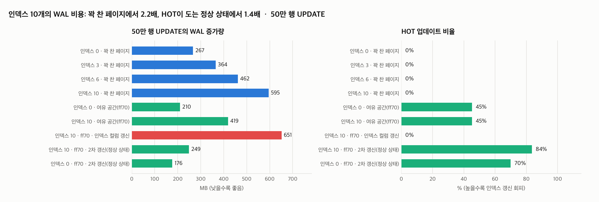

# A18 Uber의 PostgreSQL 쓰기 증폭 주장, 경계선을 실측으로 긋기

> 근거 등급: `E1` (원문과 반론 전부 공개 문서로 실재)
> 출처: [Uber, Why Uber Engineering Switched from Postgres to MySQL (2016)](https://www.uber.com/blog/postgres-to-mysql-migration/) · 반론: [Markus Winand](https://use-the-index-luke.com/blog/2016-07-29/on-ubers-choice-of-databases), [Simon Riggs](https://www.enterprisedb.com/blog/thoughts-on-ubers-list-of-postgres-limitations), [Robert Haas](http://rhaas.blogspot.com/2016/08/ubers-move-away-from-postgresql.html), [Christophe Pettus](https://thebuild.com/presentations/uber-perconalive-2017.pdf) · [PostgreSQL, Heap-Only Tuples](https://www.postgresql.org/docs/current/storage-hot.html)

## 1. 유명한 이유

2016년 Uber가 PostgreSQL에서 MySQL로 옮긴 이유를 공개했고, DB 커뮤니티에서 손꼽히는 논쟁이 됐습니다. 핵심 주장은 이렇습니다. PostgreSQL의 세컨더리 인덱스는 행의 물리 위치(ctid)를 직접 가리키므로, **컬럼 하나만 바꿔도 새 행 버전이 생기고 모든 세컨더리 인덱스에 새 엔트리가 필요하다.** 인덱스가 많은 테이블에서는 이것이 막대한 비효율이고, 물리 WAL 복제를 타고 대역폭 문제로 번진다는 것입니다.

반론이 곧바로 나왔습니다. Winand, Riggs, Pettus가 공통으로 지적한 것은 Uber 글이 **HOT(Heap-Only Tuples, 2007년 8.3부터)를 한 번도 언급하지 않았다**는 점입니다. 인덱스가 참조하는 컬럼을 건드리지 않고 페이지에 여유 공간이 있으면, 새 버전은 같은 페이지 안에 만들어지고 인덱스는 갱신되지 않습니다. Pettus는 이 주장에 "절반만 참" 판정을 내렸고, Haas는 커뮤니티 내부에서도 non-HOT 쓰기 증폭이 실제 약점임을 인정했습니다.

그래서 이 세션은 누가 옳았는지 편들지 않습니다. **어떤 조건에서 증폭이 실제로 발생하는지 경계선을 계측으로 긋습니다.** 재현 대상이 스토리지 엔진 동작이라 드라이버는 순수 SQL입니다.

## 2. 재현

PostgreSQL 17.5, 같은 스키마(컬럼 13개, 행 약 130바이트)의 테이블 6개를 만들었습니다. 다른 것은 세컨더리 인덱스 수(0·3·6·10)와 fillfactor(100 = 페이지 꽉 채움, 70 = 여유 30%)뿐입니다. 각 50만 행.

측정 단위는 "50만 행 전체를 UPDATE 한 문장으로 갱신"이고, 전후의 `pg_current_wal_lsn()` 차이로 WAL 증가량을, `pg_stat_user_tables`의 `n_tup_hot_upd`로 HOT 비율을 잽니다. 측정마다 CHECKPOINT로 full-page image 부담을 같은 조건으로 맞췄고, WAL 압축은 꺼서 크기 비교를 왜곡하지 않게 했습니다.

## 3. 재계측

| 조건 | WAL | HOT 비율 | 소요 |
|---|---|---|---|
| 인덱스 0, 꽉 찬 페이지 | 267MB | 0% | 1.6초 |
| 인덱스 10, 꽉 찬 페이지 | **595MB (2.2배)** | 0% | 8.5초 |
| 인덱스 0, ff70 첫 갱신 | 210MB | 45.2% | 1.2초 |
| 인덱스 10, ff70 첫 갱신 | 419MB (2.0배) | 45.2% | 5.8초 |
| 인덱스 0, ff70 **2차 갱신(정상 상태)** | 176MB | 69.9% | 1.0초 |
| 인덱스 10, ff70 **2차 갱신(정상 상태)** | **249MB (1.4배)** | 83.5% | 2.0초 |
| 인덱스 10, ff70, **인덱스 걸린 컬럼** 갱신 | **651MB** | 0% | 10.3초 |

쿼리 단위로도 같습니다. `EXPLAIN (ANALYZE, WAL)`로 1만 행을 갱신하면 인덱스 10개 테이블은 WAL 레코드 132,851개(17.6MB), 인덱스 0개는 30,017개(5.2MB)입니다.

### 경계선

1. **Uber가 옳은 조건.** HOT이 성립하지 않으면(꽉 찬 페이지, 또는 인덱스 컬럼 갱신) 비인덱스 컬럼 하나를 바꿔도 인덱스 수에 비례해 WAL이 늘어납니다. 0개 대비 10개가 2.2배, 인덱스 컬럼을 직접 갱신하면 651MB로 최악입니다.
2. **반론이 옳은 조건.** 여유 공간이 있고 갱신이 반복되는 정상 상태에서는 HOT이 83.5%까지 돌고, 인덱스 10개의 비용이 1.4배로 줄어듭니다. 인덱스는 갱신되지 않았고 그만큼 WAL도 없습니다.
3. **둘 다 놓친 것.** HOT 비율은 공짜가 아니라 페이지 여유 공간의 함수입니다. 아래 "예상과 달랐던 점"에 있습니다.

## 4. 해소

Uber처럼 DB를 갈아타는 것은 해소 축에 두지 않았습니다. PostgreSQL 안에서의 처방은 다음과 같고, 전부 위 표의 실측이 근거입니다.

| 처방 | 근거 실측 |
|---|---|
| 갱신이 잦은 테이블은 fillfactor를 낮춰 HOT 여지를 만든다 | ff70 정상 상태에서 WAL 595 → 249MB |
| 갱신되는 컬럼에는 인덱스를 걸지 않는다 (인덱스 설계 시 갱신 패턴 확인) | 인덱스 컬럼 갱신이 651MB로 최악 |
| "혹시 몰라서" 만드는 인덱스를 경계한다 | HOT이 실패하는 순간 인덱스 수가 그대로 곱해진다 |
| HOT 비율을 관측한다 (`n_tup_hot_upd / n_tup_upd`) | 이 비율이 떨어지면 위 처방이 무너지고 있다는 신호다 |

## 6. 예상과 달랐던 점

### fillfactor 70의 첫 갱신에서 HOT이 45%에 멈췄습니다

여유 공간을 만들었으니 HOT이 거의 다 성립할 것으로 예상했는데, 50만 행 전체를 한 문장으로 갱신하는 첫 회차에서는 정확히 45.2%였습니다. 페이지의 30% 여유가 수용할 수 있는 새 버전 수가 딱 그만큼(30/70)이기 때문입니다. HOT은 "여유 공간이 있으면 성립"이 아니라 "**그 시점에 남은** 여유 공간만큼 성립"입니다. 대량 일괄 갱신은 여유 공간을 한 번에 소진하므로 HOT의 수혜가 절반에 그칩니다.

### 2차 갱신에서 비율이 뛰었습니다

같은 갱신을 한 번 더 돌리자 HOT이 83.5%로 올랐고 WAL은 419MB에서 249MB로 줄었습니다. 1차가 남긴 죽은 버전을 페이지 프루닝이 치우면서 공간이 재활용됐기 때문입니다. VACUUM을 기다릴 필요도 없었습니다. 반론들이 말한 "일반적인 경우"는 이 정상 상태를 가리키는 것이고, Uber의 수치는 콜드 스타트나 일괄 갱신 쪽에 가깝습니다. 같은 시스템의 같은 워크로드라도 어느 시점을 재느냐로 2배가 갈립니다.

### 정상 상태에서도 1.4배는 남았습니다

HOT이 83.5% 돌아도 나머지 16.5%의 non-HOT 갱신이 인덱스 10개를 끌고 갑니다. "HOT이 있으니 인덱스 수는 무관하다"는 반론의 강한 버전도 실측과는 다릅니다. 증폭은 사라지는 게 아니라 HOT 비율만큼 희석됩니다.

## 못 한 것

- **복제 증폭은 재지 않았습니다.** Uber 주장의 후반부(WAL이 물리 복제를 타고 대역폭 문제로 전이)는 스탠바이 구성이 필요해 범위에서 뺐습니다. WAL 크기 차이가 그대로 전송량 차이가 된다는 추론까지만 가능합니다.
- **MySQL 대조는 하지 않았습니다.** InnoDB와 나란히 재려면 binlog(논리)와 WAL(물리)이라는 서로 다른 것을 비교하게 됩니다. Pettus가 지적한 그 비대칭을 피하려면 별도 설계가 필요합니다.
- **행 크기와 인덱스 키 크기를 한 가지로 고정했습니다.** TOAST가 개입하는 큰 행이나 넓은 복합 인덱스에서는 비율이 달라질 수 있습니다.