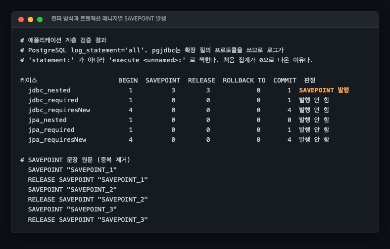
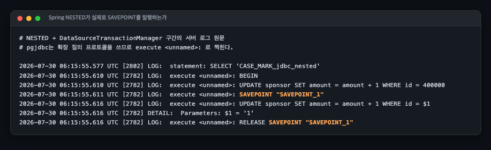

# A19 SAVEPOINT 하나가 만드는 성능 절벽, 그리고 PostgreSQL 17에서 달라진 것

## 1. 유명한 이유

GitLab이 2021년 9월에 쓴 글이 널리 읽힙니다. 2020년 6월부터 GitLab.com의 데이터베이스가 몇 분씩 멈추는 일이 반복됐습니다.

> Since last June, we noticed the database on GitLab.com would mysteriously stall for minutes, which would lead to users seeing 500 errors during this time.

일주일 멀쩡하다가 15분 터지고 며칠 사라지는 패턴이라 재현이 안 됐고, GitLab은 이 현상에 네스호 괴물을 따 **Nessie**라는 이름을 붙였습니다. 가장 크게 맞은 엔드포인트는 CI 러너가 작업을 받아 가는 `POST /api/v4/jobs/request`였습니다.

원인은 `SAVEPOINT`였습니다. 관측된 패턴이 두 가지였습니다.

> Only the replicas were affected; the primary remained unaffected.
> There was a long-running transaction, usually relating to PostgreSQL's autovacuuming, during the time.

수치는 이렇습니다. 복제본의 처리량이 초당 36만에서 5만으로 떨어졌습니다. 7.2배입니다. 그리고 이 글에서 가장 많이 인용되는 계산이 나옵니다.

> 8192/4 = 2048 transaction IDs can be stored in each page
> There are 32 (`NUM_SUBTRANS_BUFFERS`) pages, which means up to 65K transaction IDs
> it took about 18 seconds to fill up all 65K entries

8KB 페이지에 4바이트 XID가 2,048개, 32페이지면 65,536개. 이 65,536이 절벽의 위치입니다.

가장 무서운 문장은 따로 있습니다.

> To our surprise, our experiments also demonstrated that a single `SAVEPOINT` during a long-transaction could initiate this problem if many writes also occurred simultaneously. That is, it wasn't enough just to reduce the frequency of `SAVEPOINT`; we had to eliminate them completely.

GitLab의 애플리케이션은 중첩이 10을 넘은 적이 없었습니다. 64개를 넘겨야 생기는 문제가 아니라는 뜻입니다. 결국 GitLab은 `SAVEPOINT`를 빈도만 줄이는 대신 전부 없앴습니다.

### 애플리케이션에 SAVEPOINT라는 단어가 없어도 생깁니다

이게 이 사례가 무서운 두 번째 이유입니다. 다음은 모두 `SAVEPOINT`를 발행합니다.

| 경로 | SAVEPOINT 발행 | 확인 방법 |
|---|---|---|
| PL/pgSQL의 `EXCEPTION` 블록 | 예 | 이 랩에서 실행 |
| Spring `@Transactional(propagation = NESTED)` + `DataSourceTransactionManager` | 예 | **이 랩에서 실행** |
| Spring `NESTED` + `JpaTransactionManager` | 아니요(예외로 막힘) | **이 랩에서 실행** |
| Spring `REQUIRED` 중첩 호출 | 아니요 | **이 랩에서 실행** |
| Spring `REQUIRES_NEW` | 아니요(물리 트랜잭션이 따로) | **이 랩에서 실행** |
| Rails `transaction(requires_new: true)`, `create_or_find_by` | 예 | 소스 확인 |
| Django 중첩 `atomic()` | 예 | 공식 문서 |
| SQLAlchemy `begin_nested()` | 예 | 공식 문서 |

PL/pgSQL 쪽은 공식 문서가 유난히 불친절합니다. 제어 구조 문서에는 "`EXCEPTION` 절이 있는 블록은 없는 블록보다 진입과 탈출이 훨씬 비싸다"고만 적혀 있고 서브트랜잭션이라는 말이 없습니다. 서브트랜잭션을 명시한 곳은 별도 페이지입니다.

> Also, a block containing an EXCEPTION clause effectively forms a subtransaction that can be rolled back without affecting the outer transaction.

### Spring 경로를 실제로 돌려 확인했습니다

위 표의 Spring 항목은 처음에 공식 문서와 javadoc만으로 적었습니다. 문서를 읽은 것과 돌려
본 것은 다르므로 최소 앱을 만들어 확인했습니다(`app/`). PostgreSQL의 `log_statement='all'`을
켜고 서버가 실제로 받은 문장을 세는 방식입니다.



| 케이스 | BEGIN | SAVEPOINT | RELEASE | COMMIT | 판정 |
|---|---|---|---|---|---|
| `NESTED` + `DataSourceTransactionManager` | 1 | **3** | 3 | 1 | 발행 |
| `REQUIRED` + JDBC | 1 | 0 | 0 | 1 | 안 함 |
| `REQUIRES_NEW` + JDBC | **4** | 0 | 0 | 4 | 안 함 |
| `NESTED` + `JpaTransactionManager` | 1 | 0 | 0 | 0 | 예외로 막힘 |
| `REQUIRED` + JPA | 1 | 0 | 0 | 1 | 안 함 |
| `REQUIRES_NEW` + JPA | 4 | 0 | 0 | 4 | 안 함 |

`NESTED`를 세 번 부르면 `SAVEPOINT`가 정확히 세 번 나갑니다. 문장 원문이 그대로 찍힙니다.



```
execute <unnamed>: BEGIN
execute <unnamed>: UPDATE sponsor SET amount = amount + 1 WHERE id = 400000
execute <unnamed>: SAVEPOINT "SAVEPOINT_1"
execute <unnamed>: UPDATE sponsor SET amount = amount + 1 WHERE id = $1
```

`JpaTransactionManager`는 예외로 막습니다. 메시지가 이유를 그대로 말해 줍니다.

```
org.springframework.transaction.NestedTransactionNotSupportedException:
  JpaDialect does not support savepoints - check your JPA provider's capabilities
```

`REQUIRES_NEW`는 `BEGIN`이 네 번(바깥 1회와 안쪽 3회) 나가고 `SAVEPOINT`는 0입니다.
별도 물리 트랜잭션이므로 서브트랜잭션이 아니고, 곧 이 세션의 절벽과 무관합니다.

그러니 Spring을 쓰면서 이 함정에 빠지는 조합은 `NESTED`와 `DataSourceTransactionManager`
하나입니다. JPA를 쓰면 예외로 막히고 `REQUIRED`와 `REQUIRES_NEW`는 서브트랜잭션을
만들지 않습니다. 다만 PL/pgSQL의 `EXCEPTION` 블록은 애플리케이션 설정과 무관하게
서브트랜잭션을 만듭니다. 트리거나 함수 안에 그 블록이 있으면 Spring 쪽을 어떻게 잡아도
소용이 없습니다.

계측하면서 두 가지를 밟았습니다. pgjdbc는 확장 질의 프로토콜을 쓰므로 서버 로그가
`statement:`가 아니라 `execute <unnamed>:`로 찍힙니다. 처음 집계가 전부 0으로 나온
이유입니다. 그리고 `REQUIRES_NEW`가 바깥 트랜잭션이 잠근 행을 다시 갱신하게 만들어
자기 자신의 락을 기다리며 멈췄습니다. 겹치지 않는 행을 쓰도록 고쳤습니다.

## 2. 재현

### 환경

전부 `reproduce.md`에 있습니다. PostgreSQL 17.5 프라이머리 + 핫 스탠바이, 각 4코어 4GB, `shared_buffers=1GB`, `autovacuum=off`입니다.

### 왜 17로 재는가

이 세션은 두 가지를 동시에 봅니다.

16 이하에서 subtrans SLRU 크기는 `src/include/access/subtrans.h`의 컴파일 타임 상수였습니다.

```c
/* Number of SLRU buffers to use for subtrans */
#define NUM_SUBTRANS_BUFFERS	32
```

바꾸려면 재컴파일해야 했습니다. GitLab이 검토했다가 포기한 것이 이 값을 키우는 Andrey Borodin의 패치였습니다. 그 패치가 17에서 `subtransaction_buffers` GUC로 정식 반영됐습니다. 즉 GitLab이 2021년에 원했던 조치를 17에서는 설정 한 줄로 할 수 있습니다.

그래서 17을 쓰되 16 시절의 크기(32블록 = 256kB)로 고정한 조건과 키운 조건을 나란히 재면, 같은 이미지 안에서 해소책의 효과가 분리됩니다.

17에서 이름도 두 개 바뀌었습니다. `pg_stat_slru`의 name이 `Subtrans`에서 `subtransaction`으로, 그리고 대기 이벤트는 이미 13에서 `SubtransControlLock`이 `SubtransSLRU`로 바뀌어 있었습니다. 버전별로 계측 쿼리를 분기해야 합니다.

### 두 개의 경계

절벽이 한 군데가 아닙니다.

**64**는 `src/include/storage/proc.h`의 값입니다.

```c
#define PGPROC_MAX_CACHED_SUBXIDS 64	/* XXX guessed-at value */
```

백엔드는 자기 트랜잭션의 서브트랜잭션 XID를 이 배열에 광고합니다. 주석이 넘칠 때 무슨 일이 생기는지 직접 말해 줍니다.

> If none of the caches have overflowed, we can assume that an XID that's not listed anywhere in the PGPROC array is not a running transaction. **Else we have to look at pg_subtrans.**

**65,536**은 위의 32페이지 × 2,048입니다. 여기를 넘으면 `pg_subtrans` 조회마저 SLRU 캐시에서 빗나갑니다.

그래서 조건을 이 두 경계 아래위로 뒀습니다. 갱신 대상(50만 행)과 리더 부하(동시 64, 20초)를 전부 고정하고, 그 50만 건을 몇 개의 서브트랜잭션으로 나눌지만 바꿉니다.

### RELEASE SAVEPOINT 로는 캐시를 비울 수 없다

`scripts/exp-release-savepoint.sh`, 원문은 `results/exp-release-savepoint.txt`.

postgres.ai 는 활성 서브트랜잭션을 64 미만으로 유지하면 총 100개를 만들어도 열화가 없다고
적었습니다. 그러면 만들고 곧바로 `RELEASE` 해서 활성 수를 낮게 두면 되지 않느냐는 생각이
따라옵니다. PG17 의 `pg_stat_get_backend_subxact` 로 직접 재봤습니다. 세 방식 모두 70개.

| 방식 | 캐시에 남은 서브트랜잭션 | 넘침 |
|---|---|---|
| `SAVEPOINT` → `UPDATE` → `RELEASE` | 64 | **t** |
| `SAVEPOINT` → `UPDATE` → `ROLLBACK TO` | **0** | f |
| `SAVEPOINT` 를 겹쳐 쌓고 풀지 않음 | 64 | **t** |

`RELEASE` 는 배열을 비우지 않습니다. 커밋된 서브트랜잭션의 XID 는 최상위 트랜잭션이 끝날
때까지 다른 세션의 가시성 판정에 필요하므로 뺄 수 없고, 롤백된 것은 그 변경이 전부 무효라
뺄 수 있습니다. 그래서 롤백 쪽만 0 입니다.

`EXCEPTION` 블록을 정상으로 빠져나가는 것이 `RELEASE` 와 같으므로, 예외가 한 번도 안 나도
배열은 채워집니다. 개수가 70 이 아니라 64 인 것은 배열이 64 에서 멈추고 넘침 표시를 켜기
때문입니다.

## 3. 재계측

### 프라이머리

4회 반복의 중앙값이고 괄호는 최소에서 최대입니다. 기준선 대비는 회차마다 따로 계산했습니다.
회차별 원문은 `results/run0-*`부터 `results/run3-*`에 있습니다.

| 조건 | 서브트랜잭션 | SLRU 버퍼 | TPS | 기준선 대비 | 조회 | 빗나감 | SubtransSLRU 대기 |
|---|---|---|---|---|---|---|---|
| `none` | 0 | 256kB | 94,741 (94,017~101,383) | 100% | 0 | 0 | 0% |
| `sub64` | 64 | 256kB | 91,936 (90,774~98,383) | 97% | 0 | 0 | 0% |
| `sub10k` | 10,000 | 256kB | 88,242 (87,779~95,112) | 93~94% | 705만~762만 | 6 (네 번 다) | 0% |
| `sub500k` | 500,000 | 256kB | **66,026 (63,431~70,049)** | **67~71%** | 508만~561만 | **113만~126만** | **44~57%** |
| `none-buf` | 0 | 4MB | 94,507 (92,661~101,315) | 99~100% | 0 | 0 | 0% |
| `sub500k-buf` | 500,000 | 4MB | **89,470 (89,036~97,146)** | **94~96%** | 712만~778만 | **0 (네 번 다)** | 0% |

절대 처리량은 회차 간 1.08배 안쪽으로 흔들립니다. run0이 가장 조용한 상태에서 측정돼
모든 조건에서 7% 정도 높습니다. 그래서 기준선 대비는 회차마다 따로 계산해야 하고,
그렇게 계산하면 조건별 비율이 위 표처럼 좁게 모입니다.

세 구간이 성격이 다릅니다.

**0에서 64까지는 아무 일도 없습니다.** `pg_subtrans` 조회가 네 회차 모두 정확히 0건입니다. 64개는 PGPROC 배열에 그대로 들어가므로 리더가 디스크 구조를 볼 이유가 없습니다. 소스 주석의 "넘치지 않았으면 pg_subtrans를 볼 필요가 없다"가 그대로 측정됩니다.

**64를 넘으면 조회가 시작되지만 그것만으로는 안 느려집니다.** `sub10k`에서 조회가 700만 건 넘게 발생했는데 빗나간 것은 6건이고, 네 회차에서 이 6이 어긋나지 않았습니다. XID 1만 개는 약 5페이지라 32페이지 캐시에 여유롭게 들어갑니다. TPS는 기준선의 93~94%입니다. 캐시 초과 자체의 비용은 작습니다.

**65,536을 넘으면 무너집니다.** `sub500k`에서 XID 50만 개는 약 244페이지입니다. 32페이지 캐시로는 못 덮으니 조회 500만 건 중 110만 건 넘게 빗나갔습니다. 미스율은 네 회차에서 22.2~22.4%로 거의 고정입니다. TPS가 기준선의 67~71%가 되고, 대기 샘플의 44~57%가 `LWLock/SubtransSLRU`입니다. 원인 지표와 결과 지표가 같은 조건에서 함께 움직입니다.

**해소는 SLRU를 키우는 것입니다.** `subtransaction_buffers`를 4MB(512블록)로 올리자 같은 50만 서브트랜잭션에서 조회 700만 건이 **전부 적중**하고 빗나감이 네 회차 모두 0이 됐습니다. TPS는 기준선의 94~96%까지 돌아옵니다. `SubtransSLRU` 대기도 사라집니다. GitLab이 100MB 캐시면 2,620만 개를 담는다고 계산했던 그 조치입니다.

### 17의 기본값은 이미 완화되어 있습니다

17에서 `subtransaction_buffers`의 기본값은 0이고, 이는 자동 산정을 뜻합니다.

> The default value is `0`, which requests `shared_buffers`/512 up to 1024 blocks, but not fewer than 16 blocks.

`shared_buffers=1GB`면 131,072블록 ÷ 512 = 256블록입니다. 16 이하의 고정 32블록보다 8배 큽니다. 위 표의 절벽은 그 기본값을 일부러 32로 되돌려서 만든 것입니다. 17을 기본값으로 쓰면 같은 부하에서 이 절벽은 훨씬 얕습니다.

## 4. 스탠바이 절벽은 재현하지 못했습니다

GitLab이 겪은 것은 위와 다릅니다. 원문이 "복제본만 영향을 받았고 프라이머리는 멀쩡했다"고 명시합니다. postgres.ai의 후속 분석도 프라이머리 단일 노드에서는 이 문제가 없어 보인다고 적었습니다.

그래서 프라이머리 + 핫 스탠바이를 붙이고 postgres.ai의 검증된 레시피를 규모만 줄여 시도했습니다. 결과는 실패입니다.

| 조건 | 프라이머리 쓰기 | 롱TX | 스탠바이 TPS | 스탠바이 pg_subtrans | WAL의 ASSIGNMENT 레코드 |
|---|---|---|---|---|---|
| `sb-sp3` | SAVEPOINT 3개 + 쓰기 3건 | 있음 | 60,769 | 0 | 0 |
| `sb-plain3` | SAVEPOINT 없이 쓰기 3건 | 있음 | 51,931 | 0 | 0 |
| `sb-sp70` | 쓰기 서브트랜잭션 70개 | 있음 | 72,983 | 0 | 0 |
| `sb-sp70-nolong` | 같음 | 없음 | 76,225 | 0 | 0 |

스탠바이의 `pg_stat_slru`에서 `subtransaction` 행이 모든 조건에서 정확히 0입니다. 같은 시점 `transaction` 행은 2만~46만 건씩 잡히므로 통계 수집이 죽은 것은 아닙니다. 복제 지연도 0~1초였고, 스탠바이 스냅샷의 xmin은 긴 트랜잭션에 제대로 붙잡혀 있었습니다.

### 왜 안 됐는지 알아낸 것까지

스탠바이가 서브트랜잭션 오버플로를 알게 되는 경로는 WAL의 `XLOG_XACT_ASSIGNMENT` 레코드뿐입니다. 이 레코드가 언제 나오는지 `pg_waldump`로 직접 셌습니다.

한 트랜잭션에 쓰기 서브트랜잭션 10만 개를 만들자 이 레코드가 **1,562개** 나왔습니다. 100,000 ÷ 64 = 1,562.5입니다. 트랜잭션 하나 안에서 서브트랜잭션 64개마다 한 번씩 기록된다는 뜻입니다.

그리고 `SAVEPOINT` 3개짜리 트랜잭션에서는 이 레코드가 한 건도 나오지 않았습니다. 64에 닿을 일이 없으니 당연합니다. 스탠바이는 오버플로가 있었다는 사실 자체를 통보받지 못하고, 통보받지 못하면 스냅샷을 `suboverflowed`로 표시하지 않고, 표시하지 않으면 `pg_subtrans`를 볼 이유가 없습니다.

이것만 보면 GitLab의 "SAVEPOINT 하나로도 생긴다"와 어긋납니다. 하지만 제 실험이 그것을 반박한다고 말할 수는 없습니다. 이유는 아래에 적었습니다.

### 이 실패를 반박으로 읽으면 안 되는 이유

세 가지가 걸립니다.

첫째, `sb-sp70` 조건은 쓰기 처리량이 **초당 0.68건**이었습니다. 4개 클라이언트가 한 트랜잭션에서 70개 행 락을 잡으니 서로 막고 데드락까지 났습니다(WAL에 ABORT 레코드 확인). GitLab이 요구한 "동시에 많은 쓰기"와는 거리가 멉니다. 즉 이 조건은 ASSIGNMENT 레코드가 나올 수 있는 유일한 조건이었는데, 정작 쓰기량이 없어서 조건을 못 만들었습니다.

둘째, GitLab이 관측한 버전은 12대입니다. 블로그 본문에 버전 명시는 없지만, 본문이 링크한 이슈 제목이 "Benchmark 10-30 concurrent transactions with 3 nested savepoints on PostgreSQL 12.7/12.8"입니다. 관측한 대기 이벤트 이름이 `SubtransControlLock`(13 이전 명칭)인 것과도 맞습니다. postgres.ai가 검증한 버전은 12, 13, 14입니다. 17에서 같은 경로가 그대로 남아 있는지는 확인하지 않았습니다.

셋째, 제 스탠바이는 프라이머리와 같은 호스트의 컨테이너입니다. postgres.ai는 별도 인스턴스 2대(c5a.4xlarge)를 썼습니다. 자원 경쟁 구조가 다릅니다.

정직한 결론은 이것입니다. **프라이머리 쪽 절벽은 두 경계와 해소책까지 재현했고, GitLab이 겪은 스탠바이 쪽 절벽은 재현하지 못했습니다.** 못 한 이유의 일부(ASSIGNMENT 레코드가 64마다만 나온다)는 밝혔지만, 그것이 GitLab의 서술과 어긋나는 이유는 밝히지 못했습니다.

## 5. 예상과 달랐던 점

### 긴 트랜잭션과 캐시 초과만으로는 아무 일도 안 일어납니다

조건을 다 갖췄다고 믿고 여러 번 쟀는데 `pg_subtrans` 조회가 계속 0이었습니다. 원인은 스냅샷의 xmax였습니다.

긴 트랜잭션이 유일한 쓰기 주체이면 `pg_current_snapshot()`이 `2218:2218:`처럼 나옵니다. xmin과 xmax가 같습니다. 서브트랜잭션 XID는 2219부터인데 전부 xmax 이상입니다. `XidInMVCCSnapshot`은 xid가 xmax 이상이면 "진행 중"이라고 즉시 판정하고 끝냅니다. `pg_subtrans`를 볼 이유가 없습니다.

그래서 조건이 셋입니다. 긴 트랜잭션, 서브트랜잭션 캐시 초과, 그리고 **XID 카운터를 서브트랜잭션 범위 너머로 밀어 올리는 다른 쓰기 트래픽**. 세 번째를 넣고서야 재현됐습니다.

GitLab 원문의 "if many writes also occurred simultaneously"가 이 조건입니다. 처음에는 부하를 키우라는 뜻으로 읽었는데, 부하의 양이 아니라 XID 카운터를 미는 역할이 핵심이었습니다. `scripts/run-primary.sh`에 이 단계를 별도로 둔 이유입니다.

### 캐시 초과의 비용이 거의 없었습니다

64를 넘기면 느려질 것으로 예상했는데 `sub10k`에서 조회 700만 건이 전부 캐시에 적중하며 TPS가 기준선의 93~94%에 머물렀습니다. 절벽은 "캐시를 넘겼는가"가 아니라 "XID 범위가 SLRU 페이지 수를 넘겼는가"에서 생깁니다.

이 구분이 실무에서 중요합니다. 서브트랜잭션을 64개 아래로 유지하는 것만으로는 안심할 수 없고, 반대로 64를 넘겼다고 무조건 위험한 것도 아닙니다. 위험한 조건은 XID 소비 속도와 긴 트랜잭션의 길이가 함께 만듭니다.

### 스탠바이가 프라이머리보다 max_connections를 크게 가져야 합니다

스탠바이가 이 로그를 남기고 안 떴습니다.

```
FATAL:  recovery aborted because of insufficient parameter settings
DETAIL:  max_connections = 100 is a lower setting than on the primary server, where its value was 300.
```

이 값이 스탠바이의 `KnownAssignedXids` 배열 크기를 정하기 때문입니다. 이 세션의 주제와 직접 닿아 있는 제약입니다. 스탠바이는 프라이머리에서 진행 중인 XID를 이 배열로 추적하고, 바로 이 배열이 넘칠 때 `pg_subtrans`로 내려갑니다.

### 널리 인용되는 문장에 대한 정정

`SubtransControlLock`이 `SubtransSLRU`로 바뀐 것은 13입니다. 13 릴리스 노트에는 개별 이름이 없고 "Rename various wait events to improve consistency"라는 총괄 문구만 있습니다. 이름 매핑은 소스의 `lwlocknames.txt`에서 확인해야 합니다.

그리고 `https://www.postgresql.org/docs/17/wait-events.html`은 존재하지 않는 URL입니다. 대기 이벤트 표는 `monitoring-stats.html` 안에 있습니다.

## 16 과 17 을 나란히 (2026-07-31)

PostgreSQL 16 과 17.5 를 같은 부하로 나란히 돌렸습니다. 두 버전 다
`subtransaction_buffers` 가 32 입니다. 16 에는 그 GUC 자체가 없고 값이 32 로 고정입니다.
17 에서 32 로 되돌려 맞췄습니다. 버퍼 수가 같으므로 남는 차이는 SLRU 락 구조입니다.

| 조건 | 활성 서브트랜잭션 | 16 tps | 17.5 tps | 17.5/16 |
|---|---|---|---|---|
| none | 0 | 100,012 | 99,514 | 1.00배 |
| sub63 | 63 | 95,891 | 97,102 | 1.01배 |
| sub64 | 64 | 93,336 | 93,486 | 1.00배 |
| sub10k | 10,000 | 93,271 | 91,829 | 0.98배 |
| sub500k | 500,000 | 59,878 | **69,621** | **1.16배** |

**네 조건에서 두 버전이 같습니다.** 17 의 뱅크 단위 SLRU 락은 500,000 조건에서만
1.16배로 벌어집니다. 그 아래에서는 0.98~1.01배로 측정 잡음 안입니다.

이유는 SLRU 읽기 수에 있습니다.

| 조건 | 16 hit/read | 17.5 hit/read |
|---|---|---|
| none | 0 / 0 | 0 / 0 |
| sub63 | 63 / 0 | 64 / 0 |
| sub64 | 127 / 0 | 64 / 0 |
| sub10k | 7,466,407 / 6 | 7,354,030 / 6 |
| sub500k | 11,686,995 / **1,081,578** | 4,820,372 / **1,245,420** |

**읽기가 백만 건대로 올라가는 조건은 sub500k 하나뿐입니다.** 락을 잡을 일이 있어야
락 구조 개선이 값을 합니다. 10,000 조건에서도 읽기는 6건입니다. 캐시에 다 들어갑니다.

같은 버전 안에서 none 대비 배수는 이렇습니다.

| 조건 | 16 | 17.5 |
|---|---|---|
| sub63 | 0.96배 | 0.98배 |
| sub64 | 0.93배 | 0.94배 |
| sub10k | 0.93배 | 0.92배 |
| sub500k | **0.60배** | **0.70배** |

**63 과 64 사이에 계단이 있습니다.** 63 은 none 의 96~98% 를 지키고 64 는 93~94% 로
떨어집니다. 두 조건 다 SLRU 읽기가 0 이므로 이 계단은 디스크 접근이 아니라 PGPROC
캐시 64칸을 넘긴 비용 자체입니다. **"활성 수를 64 미만으로 유지하면 회복된다"가
처리량 축에서도 확인됩니다.** 2절에서 `ROLLBACK TO` 가 캐시를 비운다는 것만 봤는데,
비운 상태의 처리량이 실제로 none 에 가깝습니다.

절벽은 63과 64 사이가 아니라 10,000과 500,000 사이입니다. 0.93배와 0.60배 사이가
훨씬 큽니다. 64 를 넘기는 것 자체는 7% 손해이고, SLRU 가 캐시에 안 들어갈 만큼
불어나는 것이 40% 손해입니다.

17 로 올려도 sub500k 는 여전히 none 의 0.70배입니다. **락 구조 개선은 손해를
40% 에서 30% 로 줄이지 그 조건을 없애지 않습니다.**

## 못 한 것

- **위 표는 조건마다 1회 실행입니다.** 두 버전을 같은 호스트에서 이어 돌렸습니다.
- **스탠바이 절벽.** 위 4절에 적었습니다. 이 세션의 가장 큰 공백입니다.
- **대기 샘플 파일이 회차마다 누적됐습니다.** `run-primary.sh`가 초기화하지 않아
  run1~3의 waits 파일이 앞 회차를 포함합니다. 위 표의 44~57%는 차분해서 얻은 값이고
  스크립트는 고쳤지만, 이미 저장된 파일은 누적 상태로 남아 있습니다.
- **Multixact 경로.** 서브트랜잭션과 `SELECT ... FOR UPDATE`가 겹치면 multixact가 끼어들어 별도의 열화가 생깁니다. 이 세션에서 다루지 않았습니다.
- **XID 소비 증가 자체의 위험.** 서브트랜잭션은 XID를 더 빨리 소비하므로 wraparound 위험을 키웁니다. 그쪽은 A14에서 다룹니다.
- **Rails, Django, SQLAlchemy 검증.** Spring 경로는 실행해 확인했지만(1절) 나머지 셋은 문서와 소스로만 확인했습니다.
