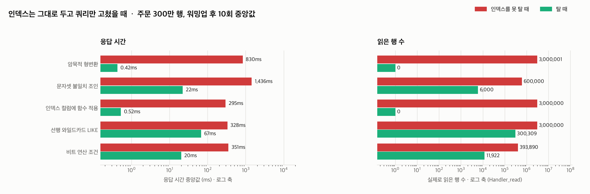
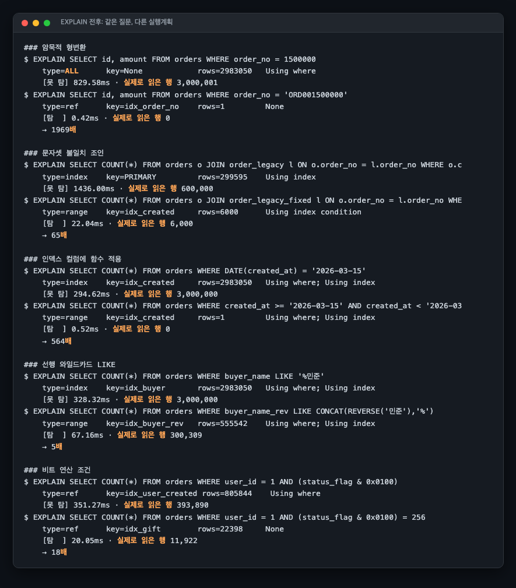
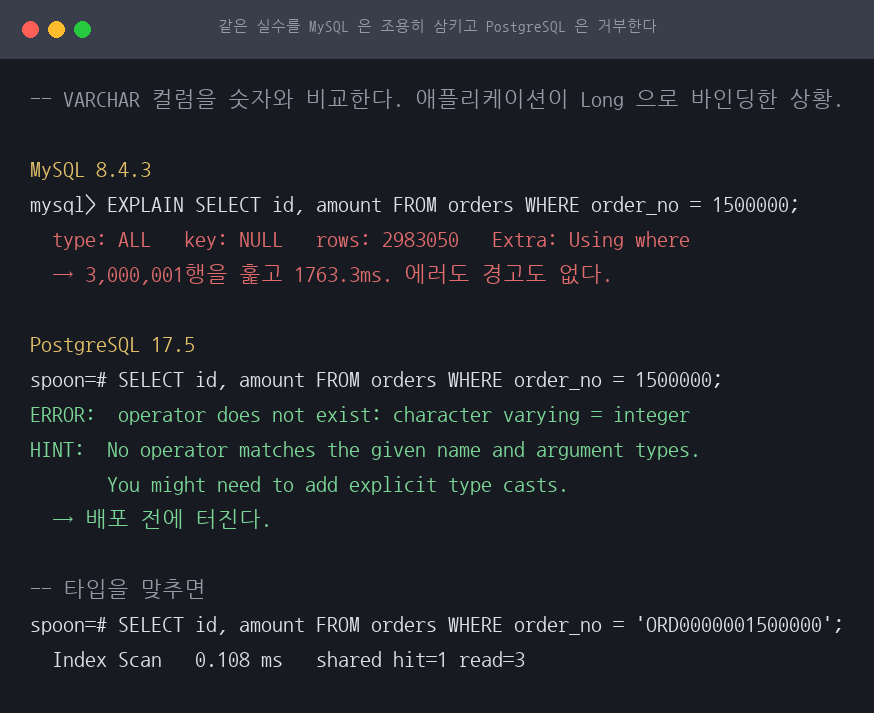
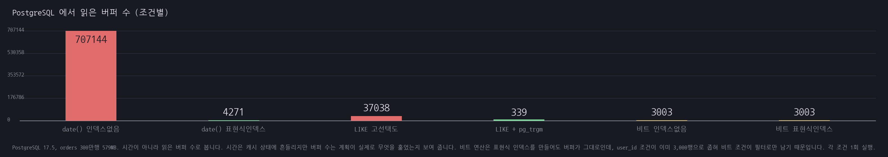

# A22 인덱스는 있는데 쿼리가 못 쓴다, 다섯 가지 조건

> 근거 등급: `E2`
> 출처: [MySQL 8.4, Type Conversion](https://dev.mysql.com/doc/refman/8.4/en/type-conversion.html) · [How MySQL Uses Indexes](https://dev.mysql.com/doc/refman/8.4/en/mysql-indexes.html) · [B-Tree Index Characteristics](https://dev.mysql.com/doc/refman/8.4/en/index-btree-hash.html) · [CREATE INDEX (functional key parts)](https://dev.mysql.com/doc/refman/8.4/en/create-index.html) · 실무 사례: [LINE, 함수형 인덱스로 비트 연산 쿼리 최적화](https://techblog.lycorp.co.jp/ko/solving-slow-queries-optimizing-bitwise-operation-queries-with-functional-indexes)

## 1. 유명한 이유

슬로우 쿼리를 받아 들고 처음 하는 일은 인덱스 확인입니다. 그런데 `SHOW INDEX`를 찍어 보면 인덱스가 이미 있습니다. 이때부터가 진짜 문제입니다. **인덱스가 없어서 느린 게 아니라, 있는 인덱스를 쿼리가 쓰지 못하게 작성돼 있어서 느린 경우**가 실무 슬로우 쿼리의 큰 몫을 차지합니다.

MySQL 공식 문서가 조건을 직접 적어 둡니다. 문자열 컬럼을 숫자와 비교하면 "인덱스를 써서 값을 빨리 찾을 수 없다"고 하고, utf8mb4 컬럼과 latin1 컬럼 비교는 "인덱스 사용을 배제한다"고 하며, LIKE는 "와일드카드로 시작하지 않는 상수 문자열일 때" 인덱스를 쓴다고 명시합니다.

실무 사례도 있습니다. LINE은 LINE VOOM 헤비 유저의 프로필 조회가 30초 타임아웃에 걸리는 문제를 공개했습니다. `WHERE user_id=? AND category_flag & 0x0100` 형태의 비트 연산 조건이 인덱스를 타지 못해 그 유저의 게시물 전체를 훑고 있었고, MySQL 8.0.13의 함수형 인덱스와 등가 비교 재작성으로 스캔을 805행에서 31행으로 줄였습니다.

이 세션은 그 조건들을 한자리에 모아 **쿼리 재작성으로 되는 것과 스키마 변경이 필요한 것을 가릅니다.** 처음에는 "인덱스는 그대로 두고 쿼리만 바꾼다"를 전제로 잡았는데, 재현을 끝내고 보니 다섯 중 둘만 거기 해당했습니다. 나머지 셋은 조인 상대 테이블을 바꾸거나, 생성 컬럼을 만들거나, 함수형 인덱스를 새로 걸어야 했습니다.

## 2. 재현

### 환경

| 항목 | 값 |
|---|---|
| 호스트 | Linux 5.14.0-570.33.2.el9_6.aarch64 (Rocky Linux 9.6), 2코어 ARM Neoverse-N1, 메모리 11GB |
| DB | MySQL 8.4.3 (컨테이너 `cpus: 2`, `mem_limit: 4g`, 버퍼 풀 2GB) |
| 데이터 | 주문 300만 행 (적재 직후 579MB), 레거시 조인 테이블 30만 행 |
| 측정 | 워밍업 3회 후 10회, 중앙값·p95. 실제로 읽은 행은 `Handler_read_*` 세션 카운터로 실측 |

버퍼 풀을 데이터보다 크게 잡았습니다. 캐시 미스가 섞이면 "인덱스를 못 탄 비용"과 "디스크 비용"이 뒤엉켜서, 무엇 때문에 느린지 구분되지 않습니다.

**첫 실행과 재측정의 호스트가 다릅니다.** 첫 실행은 호스트 사양을 남기지 않았는데, 같은 `compose.yml`을 이 2코어 서버에 올리자 `cpus: 4` 때문에 컨테이너가 뜨지 않았습니다(`range of CPUs is from 0.01 to 2.00`). 그러니 첫 실행은 이 서버가 아니고, 저장소에 사양이 남아 있는 다른 한 종류인 12코어 맥이었을 것입니다. 재측정은 위 2코어 리눅스에서 `cpus: 2`로 돌렸고, 절대 시간이 이전 판보다 전 조건에서 약 2.1~2.3배 큽니다. 절대 시간을 세션 간에 비교하면 안 됩니다.

**읽은 행 수를 `EXPLAIN`의 `rows`로 세지 않았습니다.** 그 값은 옵티마이저의 추정이고, 실제로 몇 행을 만졌는지는 `Handler_read_next`와 `Handler_read_rnd_next`의 증가분이 답입니다.

### 데이터 분포

균등 분포로 만들면 어떤 쿼리를 써도 비슷하게 나옵니다. 실제 주문 데이터를 닮게 만들었습니다.

- `order_no`: `ORD` + 12자리. 유니크에 가까움 (형변환 함정의 무대)
- `user_id`: Zipf(s=1.1) 쏠림. 1위 유저가 393,890건(13.1%)으로 LINE 사례의 "헤비 유저"에 해당
- `status_flag`: 비트 플래그. 선물 주문(0x0100) 90,543건(3.0%), 공개(0x0001) 60.0%
- `buyer_name`: 성 10종 × 이름 10종. `민준`으로 끝나는 이름 300,309건

## 3. 재현 결과



| 조건 | 못 탈 때 실행계획 | 못 탈 때 | 탈 때 | 배수 | 읽은 행 (전 → 후) | 결과 건수 (전 / 후) |
|---|---|---|---|---|---|---|
| 암묵적 형변환 | `type: ALL` 풀 테이블 스캔 | 1,763.3ms | 0.45ms | 3,924배 | 3,000,001 → 1 | 0건 / 1건 |
| 문자셋 불일치 조인 | `type: index` 레거시 PK 스캔 | 3,120.6ms | 41.38ms | 75배 | 600,000 → 6,000 | 600건 / 600건 |
| 인덱스 컬럼에 함수 적용 | `type: index` 커버링 인덱스 스캔 | 647.9ms | 274.96ms | 2.4배 | 3,000,000 → 864,000 | 864,000건 / 864,000건 |
| 선행 와일드카드 LIKE | `type: index` 커버링 인덱스 스캔 | 763.2ms | 140.38ms | 5.4배 | 3,000,000 → 300,309 | 300,309건 / 300,309건 |
| 비트 연산 조건 | `type: ref` 인덱스 앞부분만 타고 필터 | 910.5ms | 40.65ms | 22배 | 393,890 → 11,922 | 11,922건 / 11,922건 |



맨 오른쪽 칸은 그 쿼리가 실제로 돌려준 건수이고, 재측정에서 새로 남긴 것입니다. 이 칸이 없어서 첫 실행의 빈 결과 비교를 못 알아봤습니다.

**"못 탈 때"가 전부 풀 테이블 스캔은 아닙니다.** `type: ALL`은 형변환 하나뿐입니다. 함수 적용과 선행 와일드카드는 `Extra: Using index`가 붙은 커버링 인덱스 스캔이라, 테이블의 데이터 페이지가 아니라 인덱스 리프를 처음부터 끝까지 훑습니다. 이 두 줄의 300만 행을 "테이블을 300만 번 읽었다"로 읽으면 안 됩니다. 문자셋 조인도 마찬가지로 인덱스 읽기입니다. 실행계획 첫 줄이 레거시 테이블 PK 인덱스를 통째로 읽는 `type: index`이고, 레거시가 30만 행이니 60만 중 나머지 30만은 그 뒤에 이어진 접근으로 보이는데 카운터를 테이블별로 나눠 재지 않아 확정하지는 못했습니다.

비트 연산 조건은 더 극단입니다. 이번 실행에서 못 타는 쪽과 타는 쪽의 `key`가 둘 다 `idx_gift`이고 `type`도 둘 다 `ref`입니다. 다른 것은 `Extra`의 `Using where` 한 줄과, 실제로 읽은 행 393,890 대 11,922뿐입니다. `EXPLAIN` 첫 줄만으로는 구별되지 않습니다.

### 첫 측정의 1,969배와 564배를 왜 버렸나

첫 실행의 두 값은 **빈 결과 집합끼리의 비교**였습니다.

- **주문번호.** `seed.py`는 `f"ORD{j+1:012d}"`로 `ORD` 뒤에 12자리를 채웁니다. 150만 번째는 `ORD000001500000`인데 `bench.py`는 `'ORD001500000'`(ORD + 9자리)을 조회했습니다. 없는 값입니다.
- **날짜.** `created_at`은 2026-01-01부터 초당 10건이라 마지막 행이 2026-01-04 11:19:59인데, 두 쿼리 모두 2026-03-15를 조회했습니다. 구간 밖입니다.

재측정에서는 값을 고치고 전 조건을 처음부터 다시 돌렸습니다. 주문번호는 실재하는 `ORD000001500000`으로, 날짜는 적재 구간 안에 온전히 들어가는 2026-01-02(864,000건)로 바꿨습니다.

- **함수 적용은 564배에서 2.4배가 됐습니다.** 하루치가 전체의 29%라 인덱스를 타도 읽는 양이 3.5배밖에 안 줄기 때문입니다.
- **형변환은 1,969배에서 3,924배가 됐습니다.** 다만 이 배수는 성질이 다릅니다. 두 쿼리는 같은 한 행을 찾지만 같은 답을 주지 않습니다. 타는 쪽은 1행을 읽어 1건, 못 타는 쪽은 300만 행을 훑고 0건입니다. "같은 답을 얻는 두 방법의 속도 차"가 아니라 "풀 스캔과 인덱스 단건 탐색의 접근 비용 차"입니다.

나머지 셋은 첫 실행에서도 빈 조회가 아니었고 75배·5.4배·22배로 비슷하게 나왔습니다(이전 65배·5배·18배).

### 형변환은 느려지는 문제가 아니라 조용히 틀리는 문제입니다

`order_no`는 `VARCHAR(32)`입니다. `WHERE order_no = 1500000`을 쓰면 MySQL은 양쪽을 부동소수점으로 바꿔 비교합니다. `'ORD000001500000'`은 앞이 문자라 0으로 변환되므로 비교는 `0 = 1500000`이 되고 300만 행 전부 거짓입니다. **결과는 0건입니다.** 그 주문은 테이블에 멀쩡히 있는데도 없다고 답합니다.

```sql
-- 애플리케이션이 Long으로 바인딩했을 때
SELECT id, amount FROM orders WHERE order_no = 1500000;
-- type: ALL, 실제로 읽은 행 3,000,001, 1,763.3ms, 결과 0건

-- 타입을 맞췄을 때
SELECT id, amount FROM orders WHERE order_no = 'ORD000001500000';
-- type: ref (idx_order_no), 실제로 읽은 행 1, 0.45ms, 결과 1건
```

반대 방향도 깨집니다. 컬럼에 숫자만 문자열로 들어 있었다면 `= 1500000`은 `'1500000'`뿐 아니라 `' 1500000'`과 `'1500000A'`도 같이 잡습니다. 한 조건에서 누락과 오검출이 동시에 납니다.

성능 문제와 다른 점은 아무도 안 알려준다는 것입니다. 쿼리는 성공하고 결과만 비어서 돌아옵니다. 슬로우 쿼리 로그에는 1.7초짜리 한 줄이 남는데, 열어 보면 "느리긴 한데 데이터가 없는 조회네" 하고 닫게 됩니다. 성능 대시보드로 잡을 수 없고 타입 층에서 잡아야 합니다.

이 세션이 그 산증인입니다. 벤치마크 쿼리 두 개가 없는 값을 조회하고 0건을 돌려줬는데 스크립트도 결과 파일도 리포트도 아무 이상을 알리지 않았고, 오히려 1,969배라는 제일 그럴듯한 숫자가 거기서 나왔습니다. 재측정에서 `bench.py`가 결과 건수를 함께 기록하도록 고친 이유입니다.

### 각 조건이 성립하는 이유

**암묵적 형변환.** `'1'`, `' 1'`, `'1a'`가 전부 1로 변환되므로 인덱스에 정렬된 문자열 순서로는 시작점을 정할 수 없습니다. 애플리케이션이 주문번호를 `Long`으로 바인딩하면 이 상황이 됩니다.

**문자셋 불일치 조인.** `orders.order_no`는 utf8mb4, `order_legacy.order_no`는 latin1입니다. MySQL은 좁은 쪽을 넓은 쪽에 맞춰 올리므로 함수에 감싸이는 쪽은 latin1 컬럼이고, **인덱스를 못 쓰게 되는 것도 latin1 컬럼의 인덱스입니다.** 실행계획 첫 줄이 레거시 테이블 PK 인덱스 30만 행을 통째로 훑는 것과 방향이 맞습니다. 고칠 쪽도 latin1입니다. utf8mb4를 latin1로 내리면 한글이 저장되지 않으니 방향은 하나뿐이고, 이 세션의 해소가 `order_legacy_fixed`라는 utf8mb4 테이블을 새로 만든 것도 같은 이유입니다. 다만 `bench.py`가 `EXPLAIN` 첫 줄만 저장해서 두 번째 테이블의 접근은 원본에 남아 있지 않습니다.

**함수 적용.** `WHERE DATE(created_at) = '2026-01-02'`는 인덱스에 저장된 값과 비교 대상이 달라 `idx_created`를 처음부터 끝까지 읽습니다. 범위 조건으로 펴면 같은 864,000건을 좁은 구간으로 찍습니다.

**선행 와일드카드.** `LIKE '%민준'`은 앞이 열려 있어 시작점을 못 정합니다. `LIKE '김%'`로 바꾸는 건 **다른 질문**이라 비교가 성립하지 않습니다. 생성 컬럼 `buyer_name_rev = REVERSE(buyer_name)`에 인덱스를 걸고 `WHERE buyer_name_rev LIKE CONCAT(REVERSE('민준'),'%')`로 조회하면 앞이 고정됩니다. 양쪽 결과가 300,309건으로 같은 것을 확인했습니다.

**비트 연산 (LINE 사례).** 함수형 인덱스 `(user_id, ((status_flag & 0x0100)))`를 만들고 **등가 비교** `(status_flag & 0x0100) = 256`으로 바꿔야 탑니다. 표현식이 인덱스 정의와 정확히 일치해야 합니다.

## 4. 해소

| 조건 | 무엇을 바꿔야 하나 | 해소 | 실무에서의 형태 |
|---|---|---|---|
| 형변환 | 쿼리 | 바인딩 타입을 컬럼 타입에 맞춤 | ORM 파라미터 타입 점검, 가능하면 컬럼을 숫자 타입으로 |
| 문자셋 | 스키마 | latin1 컬럼을 utf8mb4로 올려 양쪽 통일 | 마이그레이션을 끝까지. `COLLATE` 명시로 대신 될지는 재지 않았음 |
| 함수 | 쿼리 | 컬럼을 감싸지 말고 상수 쪽을 가공 | 날짜는 범위 조건, 문자열은 상수를 변환 |
| 선행 와일드카드 | 스키마 + 쿼리 | 역순 생성 컬럼 + 인덱스, 또는 전문 검색 | 끝말 검색이 정말 필요한지부터 확인 |
| 비트 연산 | 스키마 + 쿼리 | 함수형 인덱스 + 표현식 일치 등가 비교 | MySQL 8.0.13 이상. 표현식을 코드 상수로 관리 |

**이 표의 둘째 칸이 이 세션의 실제 결론입니다.** 쿼리 한 줄로 끝나는 것은 형변환과 함수 적용, 둘뿐입니다. 나머지 셋은 스키마를 건드렸습니다. 그러니 이 셋은 "인덱스는 그대로 두고 쿼리만 바꿨다"에 해당하지 않습니다.

저장 공간도 값을 치릅니다. `orders`는 적재 직후 579MB였는데, 역순 생성 컬럼과 `idx_buyer_rev`, `idx_gift`를 걸고 나니 791MB가 됐습니다. 212MB, 약 37% 증가입니다.

`COLLATE`로 임시 해결이 되는지는 벤치마크 케이스에 넣지 않아 **재지 않았습니다.**

## 5. 예상과 달랐던 점

### 결과 집합이 크면 인덱스를 타도 별로 안 빨라집니다

| 조건 | 탈 때 결과 건수 | 배수 |
|---|---|---|
| 암묵적 형변환 | 1건 | 3,924배 |
| 문자셋 불일치 조인 | 600건 | 75배 |
| 비트 연산 조건 | 11,922건 | 22배 |
| 선행 와일드카드 LIKE | 300,309건 | 5.4배 |
| 인덱스 컬럼에 함수 적용 | 864,000건 | 2.4배 |

**인덱스는 읽을 행을 찾는 비용을 줄이지, 읽어야 할 행 자체를 줄이지 않습니다.** 배수를 가르는 것은 조건의 종류가 아니라 결과 집합의 크기입니다.

### 배수를 고치니 순위가 뒤집혔습니다

첫 판에서 함수 적용은 564배로 둘째였는데, 실재하는 날짜로 바꾸자 2.4배로 꼴찌가 됐습니다. 빈 결과 집합은 아무 일도 하지 않으므로 항상 빠르고, **잘못된 벤치마크는 조용히 유리한 쪽으로 틀립니다.** 기대보다 좋은 숫자였기 때문에 의심하지 않고 실었습니다.

형변환이 1,969배에서 3,924배로 오른 것도 조심해서 읽어야 합니다. 타는 쪽은 두 판 모두 0.5ms 아래(0.42ms, 0.45ms)이고, 배수 변화는 거의 전부 못 타는 쪽이 829.6ms에서 1,763.3ms로 느려진 데서 나왔습니다. 호스트가 2코어로 바뀐 결과이지 해소가 좋아진 것이 아닙니다.

### 함수형 인덱스 문법에서 한 번 막혔습니다

`ADD KEY idx_gift ((user_id), ((status_flag & 0x0100)))`으로 만들려다 `ERROR 3762 Functional index on a column is not supported`를 받았습니다. 일반 컬럼을 괄호로 감싸면 함수형 키 파트로 해석되는데, 컬럼 그 자체는 표현식이 아니라서 거부됩니다.

### 실험 도구가 또 한글에 걸렸습니다

역순 컬럼을 검증하려고 `docker exec`로 `LIKE '%민준'`을 날렸더니 0건이 나왔습니다. `--default-character-set=utf8mb4`를 주자 300,309건이 나왔습니다. 벤치마크는 PyMySQL(utf8mb4)로 돌아서 정상이었고 확인용 CLI만 깨져 있었습니다.

여기서 0건을 한 번 의심해 놓고, 정작 같은 세션의 벤치마크 쿼리 두 개가 0건을 돌려주고 있던 것은 못 봤습니다. 사람이 직접 친 명령의 결과는 의심하고 자동화된 파이프라인의 결과는 의심하지 않은 셈입니다.

### 그림 만드는 스크립트도 조용히 실패하고 있었습니다

`fig-explain.png`를 다시 만들려는데 그림이 안 나왔습니다. R13 세션의 `termshot.py`가 크롬 헤드리스로 HTML을 찍는 방식인데 크롬 경로가 `/Applications/Google Chrome.app/...`으로 박혀 있었고, 실행부가 `subprocess.run(..., check=False)`이라 크롬이 없어도 예외가 안 납니다. 리눅스에서는 오류 한 줄 없이 파일이 안 생깁니다. 이 글의 주제가 그대로 재연된 셈이라, 저장소가 이미 가진 Pillow 렌더러(`tools/render`)로 바꿨습니다.

### `REVERSE()`는 바이트가 아니라 문자 단위였습니다

멀티바이트에서 뒤집으면 글자가 깨질 것으로 걱정했는데, `최도윤`이 `윤도최`로 정확히 뒤집혔습니다. 한글에서도 역순 인덱스 기법을 쓸 수 있다는 뜻입니다.

## 6. PostgreSQL 대조

`scripts/exp-pg.sh`, 원문은 `results/exp-pg.txt`. PostgreSQL 17.5, orders 300만 행(579MB),
컨테이너 `cpus: 2` `mem_limit: 4g`. 조건마다 1회 실행입니다.

다섯 조건이 PostgreSQL 에서 같은 모양으로 나타나지 않습니다. **같은 문제로 재현된 것은
하나뿐입니다.**

| 조건 | MySQL 8.4.3 | PostgreSQL 17.5 |
|---|---|---|
| 1. 암묵적 형변환 | 조용히 풀스캔. 3,000,001행, 1763.3ms (배수 3924) | **에러.** `operator does not exist: character varying = integer` |
| 2. 콜레이션 불일치 조인 | 인덱스 배제. 3120.6ms (배수 75) | 문제 없음. 양쪽 다 Bitmap Heap Scan, 버퍼 7,237 대 7,244 |
| 3. 인덱스 컬럼에 함수 적용 | 인덱스 못 씀 (배수 2) | **같은 문제.** 239.1ms / 707,144버퍼 → 표현식 인덱스로 25.1ms / 4,271버퍼 |
| 4. 선행 와일드카드 LIKE | 인덱스 못 씀 (배수 5) | 선택도 문제. 40% 고르는 조건에서는 GIN 도 무용 |
| 5. 비트 연산 조건 | 인덱스 못 씀 (배수 22) | 문제 없음. `user_id` 조건이 이미 좁혀 비트 조건은 필터로만 남음 |



### 1. 암묵적 형변환은 에러가 된다

```console
spoon=# SELECT id, amount FROM orders WHERE order_no = 1500000;
ERROR:  operator does not exist: character varying = integer
HINT:  No operator matches the given name and argument types.
       You might need to add explicit type casts.
```

MySQL 이 3,000,001행을 조용히 훑는 자리에서 PostgreSQL 은 배포 전에 터집니다. 이 세션의
가장 큰 배수(3924배)를 만든 조건이 PostgreSQL 에서는 성립하지 않습니다.

### 2와 5는 문제로 재현되지 않았다

콜레이션을 `"C"` 로 다르게 준 테이블과 조인해도 양쪽 다 Bitmap Heap Scan 이고 버퍼가
7,237 대 7,244 로 사실상 같습니다. 비트 연산도 `user_id = 1` 이 이미 3,000행으로 좁히므로
비트 조건은 필터로만 남고, 표현식 인덱스를 만들어도 버퍼가 3,003 그대로입니다.

### 3은 같은 문제이고, 해법은 양쪽 엔진에 다 있다



`date(created_at) = '2026-01-02'` 는 PostgreSQL 에서도 인덱스 구간을 타지 못합니다.
표현식 인덱스를 만들면 707,144버퍼에서 4,271버퍼로 **166배** 줄어듭니다. 다만 MySQL 도
8.0.13 부터 함수 인덱스가 있으므로 **이 항목은 엔진 차이가 아니라 이 세션이 질의 재작성
쪽을 고른 선택의 차이입니다.**

`created_at` 을 `timestamptz` 가 아니라 `timestamp` 로 둔 것이 전제입니다. `timestamptz`
에서는 `date()` 가 `TimeZone` 에 좌우되는 STABLE 함수라 표현식 인덱스를 만들 수 없습니다.

### 4는 인덱스 문제가 아니라 선택도 문제였다

`buyer_name` 이 5종뿐이라 `LIKE '%민준'` 은 1,200,000행, 즉 **40%를 고릅니다.** 40%를
고르는 조건은 어떤 인덱스로도 빨라지지 않고, `pg_trgm` GIN 을 만들어도 플래너가 쓰지
않습니다(122.7ms → 112.4ms, 버퍼 2,597 동일).

선택도를 낮춰 다시 보면 다릅니다. 300만 개가 전부 다른 `order_no` 에 같은 패턴을 걸면
Parallel Seq Scan 105.5ms / 37,038버퍼가 GIN 으로 **2.6ms / 339버퍼**가 됩니다. 버퍼
109배입니다. MySQL 쪽 해소가 역순 컬럼을 따로 두는 것이었던 자리에서 PostgreSQL 은
인덱스 하나로 끝냅니다.

**MySQL 쪽 배수 5 도 같은 이유로 작았던 것으로 보입니다.** 같은 데이터를 썼으므로
선택도가 같고, 인덱스를 못 타서 느린 것이 아니라 40%를 고르는 조건 자체가 느립니다.
이 조건은 재설계가 필요한 케이스입니다.

## 7. COLLATE 임시 처방과 배수 곡선

`scripts/exp-collate-curve.py`, 원문은 `results/exp-collate-curve.json`.

### 7.1 COLLATE 로는 문자셋 불일치를 넘길 수 없다

스키마를 바꾸지 않고 조인 조건에 `COLLATE` 를 붙이는 임시 처방이 실무에서 자주 나옵니다.
이 조건에서는 **문법 자체가 성립하지 않습니다.**

| 방법 | 결과 |
|---|---|
| 불일치 그대로 | 2,788.4ms, `type=ref key=idx_order_no` |
| 스키마를 맞춤(`order_legacy_fixed`) | **45.7ms**, `type=eq_ref key=PRIMARY` |
| `ON o.order_no = l.order_no COLLATE utf8mb4_0900_ai_ci` | **에러 1253** |
| `ON o.order_no COLLATE latin1_swedish_ci = l.order_no` | **에러 1253** |
| `ON CONVERT(l.order_no USING utf8mb4) = o.order_no` | 2,796.5ms. **이득 없음** |

```
ERROR 1253: COLLATION 'utf8mb4_0900_ai_ci' is not valid for CHARACTER SET 'latin1'
```

`COLLATE` 절은 **같은 문자셋 안에서 콜레이션만** 바꿉니다. 문자셋이 다르면 못 씁니다.
다음으로 손이 가는 `CONVERT` 는 문법은 통과하지만 함수 적용이라 인덱스 구간을 못 타고,
불일치 그대로와 같은 2,796.5ms 입니다.

**스키마를 맞추는 것 말고 방법이 없습니다.** 61배 차이가 그 값입니다.

### 7.2 배수는 결과 집합 크기가 정한다

이 세션이 적은 배수(3924, 75, 2, 5, 22)가 조건마다 크게 다른 이유를 곡선으로 확인했습니다.
함수 적용과 범위 재작성을 같은 `LIMIT` 에서 나란히 재고 `LIMIT` 만 바꿉니다.

| LIMIT | 함수 적용 | 범위 재작성 | 배수 | 스캔 타입 |
|---|---|---|---|---|
| 1 | 206.9ms | 0.2ms | **1,034.5배** | index / range |
| 10 | 207.2ms | 0.3ms | 690.7배 | index / range |
| 100 | 207.2ms | 0.4ms | 518.0배 | index / range |
| 1,000 | 209.1ms | 2.4ms | 87.1배 | index / range |
| 10,000 | 225.5ms | 19.2ms | 11.7배 | index / range |
| 100,000 | 392.9ms | 187.0ms | 2.1배 | index / range |
| 500,000 | 1,135.5ms | 922.7ms | **1.2배** | index / range |

**스캔 타입은 처음부터 끝까지 `index` 와 `range` 로 같습니다.** 인덱스를 타느냐 마느냐는
변하지 않는데 배수만 1,034배에서 1.2배로 움직입니다.

이유는 두 비용의 구성이 다르기 때문입니다. 함수 적용 쪽은 조건에 맞는 행을 찾기까지
인덱스를 처음부터 훑어야 하므로 **결과 집합이 작아도 그 고정 비용을 냅니다**(206.9ms).
범위 재작성 쪽은 시작점을 바로 찾으므로 결과 집합에 비례합니다(0.2ms). 결과 집합이 커지면
양쪽 다 행을 꺼내는 비용이 지배해 배수가 1에 수렴합니다.

**그래서 이 세션의 배수를 인용할 때는 결과 집합 크기를 함께 적어야 합니다.** 3절 표의
`function-wrap` 이 2배로 작았던 것도 그 조건의 결과 집합이 커서였습니다. 인덱스를 못 타는
것이 문제가 아니라고 읽으면 안 됩니다. 같은 조건에서 결과 집합을 좁히면 1,000배가 됩니다.

## CONVERT 방향과 곡선과 와일드카드 재설계 (2026-07-31)

### CONVERT 를 조인 어느 쪽에 붙이는가

7절은 `order_legacy` 쪽에만 붙였습니다. 반대쪽에 붙이면 어느 인덱스가 죽는지 보려고 네 조건을 나란히 놓았습니다.

| 조건 | 중앙값 | EXPLAIN rows 곱 | 계획 |
|---|---|---|---|
| 붙이지 않음(원래 조건) | 1,478.2ms | 299,595 | legacy: index(PRIMARY) / orders: ref(idx_order_no) |
| 작은 쪽(`order_legacy`)에 붙임 | 1,514.4ms | 292,939 | 같음 |
| **큰 쪽(`orders`)에 붙임** | **13.5ms** | **6,000** | orders: range(idx_created) / legacy: eq_ref(PRIMARY) |
| 스키마를 고침(대조군) | 22.8ms | 6,000 | 같음 |

**큰 쪽에 붙이면 109배 빨라집니다.** 예상과 반대입니다. 큰 테이블의 인덱스를 죽이면 그 테이블을 통째로 훑을 것 같은데, 실제로는 1,478.2ms 가 13.5ms 가 됩니다. 스키마를 제대로 고친 대조군(22.8ms)보다도 빠릅니다.

계획을 보면 이유가 나옵니다. `orders` 의 `idx_order_no` 를 못 쓰게 되자 옵티마이저가 **조인 순서를 뒤집었습니다.** 원래는 `order_legacy` 를 PK 순으로 훑으며 `orders` 를 `order_no` 로 찾았습니다. 바꾸고 나서는 `orders` 를 `idx_created` 범위로 좁힌 뒤 `order_legacy` 를 PK 로 한 건씩 찾습니다. 훑는 행이 299,595에서 6,000으로 50배 줄었습니다.

**`CONVERT` 를 어디에 붙이느냐가 정하는 것은 어느 인덱스가 죽느냐가 아니라 어느 조인 순서가 열리느냐입니다.** 작은 쪽에 붙이면 계획이 안 바뀌어 1,514.4ms 로 그대로입니다.

이 결과를 해법으로 읽으면 안 됩니다. 여기서 빨라진 것은 `created_at` 범위 조건이 있어서입니다. 그 조건이 없으면 열릴 계획도 없습니다. 스키마를 고치는 것이 조건에 안 기대는 유일한 답입니다.

### 배수 곡선이 조건마다 다릅니다

7절의 곡선은 함수 적용 조건 하나였습니다. 세 조건에서 결과 집합 크기를 바꿔 가며 그렸습니다.

| 조건 | LIMIT 1 | LIMIT 100 | LIMIT 10,000 | LIMIT 500,000 |
|---|---|---|---|---|
| 함수 적용 | 189.1배 | 103.7배 | 6.9배 | 1.1배 |
| 암묵적 형변환 | **1,181.3배** | 674.7배 | 34.8배 | **0.7배** |
| 콜레이션 | 1.5배 | 1.1배 | 1.0배 | 1.1배 |

**모양이 세 조건에서 다릅니다.**

함수 적용과 형변환은 결과가 커질수록 배수가 죽습니다. 인덱스를 타는 쪽도 결국 50만 건을 다 읽어야 하므로 이득이 사라집니다. 형변환은 LIMIT 500,000에서 **0.7배**, 즉 인덱스를 못 타는 쪽이 더 빠릅니다. 50만 건을 인덱스로 한 건씩 찾는 것보다 통째로 훑는 것이 낫습니다.

**콜레이션은 곡선이 없습니다.** 네 지점 전부 1.0~1.5배입니다. 이 데이터에서 콜레이션 불일치는 인덱스를 못 쓰게 하지 않았습니다. 다른 두 조건과 같은 함정으로 묶어 놓으면 틀립니다.

### 선행 와일드카드를 다시 짭니다

원 케이스의 `buyer_name` 은 서로 다른 값이 100개뿐이라 선택도가 낮았습니다. 어떤 인덱스로도 도울 수 없는 조건이라 배수가 인덱스 이야기가 아니었습니다. 값마다 다른 컬럼으로 다시 짰습니다.

| 방식 | 중앙값 | 계획 | 훑은 행 | 결과 |
|---|---|---|---|---|
| 선행 와일드카드 `LIKE '%…'` | 936.3ms | index / `idx_email` | 2,891,644 | 186,519건 |
| 뒤집은 컬럼 `LIKE '…%'` | **54.3ms** | range / `idx_email_rev` | 380,418 | 186,519건 |

**17.2배입니다.** 두 쿼리가 같은 186,519건을 돌려줍니다. 선택도는 6.2% 입니다.

선행 와일드카드는 인덱스를 **쓰기는 합니다.** 계획이 `index` 이므로 인덱스를 처음부터 끝까지 훑습니다. 289만 행을 다 봅니다. 뒤집은 컬럼은 `range` 로 38만 행만 봅니다. 둘 다 인덱스를 타는데 훑는 양이 7.6배 다릅니다.

**"인덱스를 안 탄다" 와 "인덱스를 훑는다" 는 다릅니다.** `EXPLAIN` 의 `key` 칸에 인덱스 이름이 있다고 안심하면 안 되고 `type` 칸을 봐야 합니다.

## OR 조건과 index merge (2026-07-31)

`OR` 은 옵티마이저 버전에 따라 동작이 갈려 별도 세션이 낫다고 미뤄 뒀습니다. 그런데 이 세션의 주제가 "인덱스가 있는데 안 탄다" 이고 `OR` 이 그 대표적인 자리입니다. `created_at` 과 `buyer_name` 에 각각 인덱스가 있는 조건으로 세 방식을 나란히 놓았습니다.

한쪽씩 걸면 둘 다 인덱스를 탑니다. 묶었을 때가 문제입니다.

| 방식 | 중앙값 | 계획 | EXPLAIN rows | 결과 |
|---|---|---|---|---|
| `OR` (index merge 켬) | 95.4ms | `index_merge` / `idx_created,idx_buyer` | 133,090 | 65,577 |
| `OR` (index merge 끔) | **602.4ms** | `ALL` / 인덱스 없음 | 2,985,200 | 65,577 |
| `UNION` 으로 손으로 가름 | **24.9ms** | `range` + `ref` | 표 아래 참고 | 65,577 |

세 방식이 모두 65,577건을 돌려줍니다. 같은 질문입니다.

**index merge 를 끄면 통째로 훑습니다.** 602.4ms 이고 훑는 행이 298만입니다. `OR` 로 묶는 순간 옵티마이저가 인덱스 하나로는 답을 못 내므로, index merge 가 없으면 전체 스캔 말고 선택지가 없습니다.

**index merge 는 6.3배 빠릅니다.** 두 인덱스를 각각 훑고 결과를 합집합으로 합칩니다. 훑는 행이 298만에서 13만으로 줄어듭니다.

**`UNION` 으로 손으로 가르면 거기서 3.8배 더 빠릅니다.** 24.9ms 입니다. 옵티마이저가 두 질의를 따로 계획하므로 각각 자기 인덱스를 제대로 씁니다. `created_at` 쪽은 `range`, `buyer_name` 쪽은 `ref` 입니다.

**전체 스캔 대비 24.2배입니다.** `OR` 을 `UNION` 으로 바꾸는 것만으로 얻는 값입니다.

`UNION` 조건의 `EXPLAIN rows` 곱은 584조로 찍힙니다. 파생 테이블이 끼면서 곱이 의미를 잃은 값이라 인용하면 안 됩니다. **이 세션의 다른 표에서는 rows 곱을 훑는 양의 근사로 썼는데, 파생 테이블이 있는 계획에서는 그 근사가 깨집니다.**

## 못 한 것

- **위 세 절은 조건마다 1회 실행이고 시간은 5회 중앙값(곡선은 3회)입니다.**
- **`CONVERT` 를 조인 반대쪽에 붙인 조건은 재지 않았습니다.** 7절은 `order_legacy` 쪽에만 붙였습니다. `orders` 쪽에 붙이면 `orders` 의 인덱스를 잃으므로 더 나쁠 것으로 보이는데 확인하지 않았습니다.
- **두 호스트의 값을 나란히 비교하지 못합니다.** 첫 실행은 사양을 기록하지 않은 장비(정황상 12코어 맥)이고 재측정은 2코어 리눅스입니다. 배수는 같은 실행 안의 비교라 쓸 수 있지만 절대 시간은 이어 붙여 읽으면 안 됩니다.
- **7.2 의 곡선은 함수 적용 조건 하나에서만 그렸습니다.** 형변환이나 콜레이션 조건에서도 같은 모양인지는 재지 않았습니다.
- **결과 집합이 큰 쿼리의 해법을 제시하지 않았습니다.** 함수 적용과 LIKE 케이스에서 드러난 한계입니다.
- **PostgreSQL 쪽도 조건마다 1회씩입니다.** 대조 절의 값에 반복 측정과 분산이 없습니다.
- **LINE 사례의 원 수치(805행 → 31행)와 직접 비교할 수 없습니다.** 데이터도 스키마도 다른 축소 재현이고, 메커니즘만 같습니다.

---

실행 명령과 원문 출력은 [`reproduce.md`](reproduce.md)에 있습니다.
