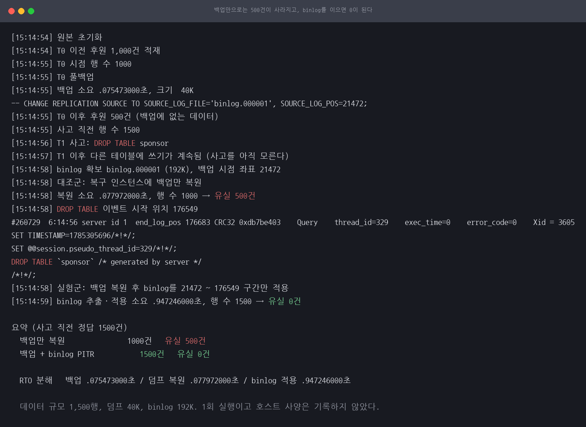
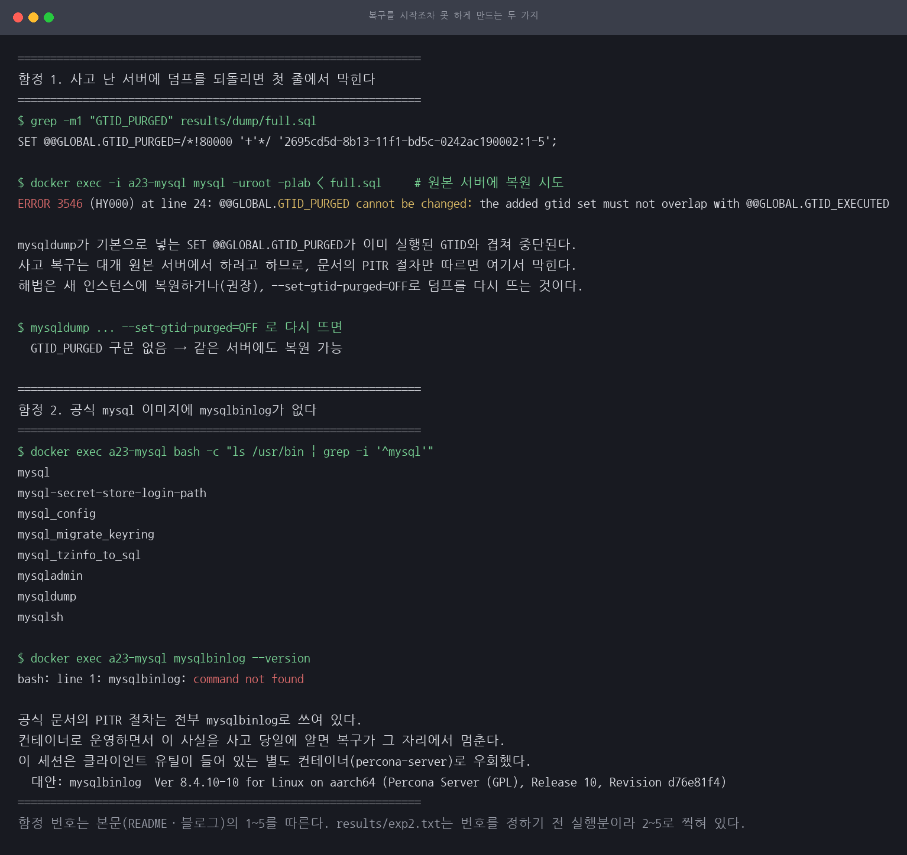
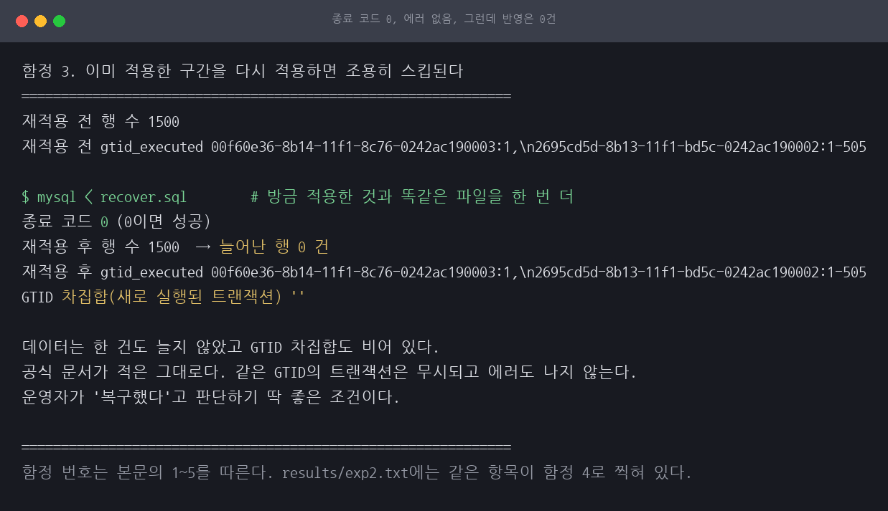

# A23 백업은 있는데 복구가 안 된다, PITR을 가로막는 다섯 가지

> 근거 등급: `E1·축소`
> 출처: [GitLab.com Database Incident (2017-01-31)](https://about.gitlab.com/blog/2017/02/01/gitlab-dot-com-database-incident/) · [Postmortem](https://about.gitlab.com/blog/2017/02/10/postmortem-of-database-outage-of-january-31/) · [MySQL 8.4, PITR Using Event Positions](https://dev.mysql.com/doc/refman/8.4/en/point-in-time-recovery-positions.html) · [GTID Concepts](https://dev.mysql.com/doc/refman/8.4/en/replication-gtids-concepts.html) · [Google SRE Book, Data Integrity](https://sre.google/sre-book/data-integrity/)

## 1. 유명한 이유

2017년 1월 31일, GitLab 엔지니어가 복제가 밀린 상황을 수습하다 secondary인 줄 알고 primary의 PostgreSQL 데이터 디렉터리를 지웠습니다. 약 300GB가 사라졌습니다. 진짜 사건은 그다음입니다. 당시 라이브 문서에 이렇게 적혀 있습니다.

> "out of five backup/replication techniques deployed none are working reliably or set up in the first place."

다섯 가지가 각각 이렇게 실패했습니다.

| 수단 | 실패 이유 |
|---|---|
| pg_dump → S3 | 워커에 9.2 바이너리가 잡혀 9.6 서버를 덤프 시도. 에러로 중단돼 S3 버킷이 비어 있었음 |
| cron 실패 알림 | DMARC 미설정으로 수신 측에서 거부. 실패가 몇 달간 아무에게도 도달하지 않음 |
| Azure 디스크 스냅샷 | NFS 서버에만 설정, DB 서버에는 미설정 |
| LVM 스냅샷 | 24시간 주기이고 재해 복구용이 아님 |
| PostgreSQL 복제 | primary가 WAL 세그먼트를 secondary가 받기 전에 지워 중단 |

결과는 약 6시간 유실(프로젝트 5,000개, 댓글 5,000개, 계정 700개)과 18시간 다운타임입니다.

핵심은 "복구에 실패했다"가 아니라 **"백업이 있다고 믿고 있었다"**입니다. Google SRE Book이 같은 말을 다르게 적습니다.

> "No one really wants to make backups; what people really want are restores."

AWS Well-Architected의 REL09-BP04 안티패턴 목록은 GitLab 사고를 그대로 문장화한 수준입니다. "백업이 존재한다고 가정하는 것", "복원해 보되 데이터를 조회하거나 꺼내 보지 않는 것", "복원 시간이 RTO 안에 들어간다고 가정하는 것".

사건 자체는 PostgreSQL 300GB 규모라 그대로 재현할 수 없습니다. 이 세션은 엔진도 규모도 다른 MySQL에서 1,500행짜리 테이블로 같은 메커니즘만 축소 재현했습니다. 시점 복구(PITR)를 실제로 수행하고, 복구를 가로막는 함정 다섯 가지를 다룹니다. 넷은 스크립트로 재현했고 하나(`docker exec`의 `-i` 누락)는 실험을 만들다 밟은 것입니다. **그중 셋은 이 세션을 만들면서 제가 직접 밟았습니다.**

## 2. 재현

### 환경

| 항목 | 값 |
|---|---|
| 원본 | MySQL 8.4.3, `log-bin`, `gtid-mode=ON`, `sync_binlog=1`, `innodb_flush_log_at_trx_commit=1` |
| 복구 대상 | MySQL 8.4.3 별도 인스턴스 (사고 서버에 되돌리지 않는다) |
| 도구 | percona-server:8.4 컨테이너 (`mysqlbinlog` 확보용, 함정 2 참고) |
| 데이터 규모 | 사고 직전 1,500행(T0 백업 시점 1,000행 + 그 뒤 500행). 덤프 40K, 이어 붙인 binlog 192K |
| 컨테이너 자원 한도 | 걸지 않았습니다. `compose.yml`에 `cpus`도 `mem_limit`도 없습니다 |
| 호스트 사양 | **기록하지 않았습니다.** `uname -srm`, `nproc`, `free -g`를 남기지 않아 어느 장비였는지 확인되지 않습니다. 로그에 남은 단서는 덤프 헤더와 도구 컨테이너 버전 문자열의 `aarch64`뿐입니다 |
| 측정 횟수 | 1회. 반복 측정을 하지 않아 분산은 모릅니다 |

이 저장소는 세션마다 장비가 달라서, 아래 소요 시간을 다른 세션의 절대값과 비교하면 안 됩니다. 이 문서 안에서 세 구간의 비율을 보는 데까지만 쓸 수 있는 수치입니다.

### 타임라인

```
T0     풀백업 (mysqldump --single-transaction --source-data=2)
T0~T1  후원 500건이 더 들어온다 (백업에 없는 데이터)
T1     운영자가 실수로 DROP TABLE sponsor
T1~    사고를 모른 채 다른 테이블에 쓰기가 계속된다
```

## 3. 결과: PITR은 실제로 듣는다



| 복구 방법 | 복구된 행 | 유실 |
|---|---|---|
| 백업만 복원 | 1,000건 | **500건** |
| 백업 + binlog를 사고 직전까지 | **1,500건** | **0건** |

사고 직전의 정답은 1,500건입니다. T0 백업 시점에 1,000행이었고 그 뒤 500건이 더 들어왔습니다. 백업만 되돌리면 그 500건이 통째로 사라집니다. **백업 주기가 곧 RPO 상한**이라는 말이 이 500건입니다. Keepthescore가 2020년에 겪은 것이 정확히 이 구조로, 일 1회 백업 덕에 30분 만에 복구했지만 7시간치는 영원히 사라졌습니다.

binlog에서 사고 직전 위치를 찾아 그 구간만 적용하면 유실이 0이 됩니다. 위치는 공식 문서가 안내하는 방식 그대로 찾습니다.

```console
$ mysqlbinlog --base64-output=DECODE-ROWS -v /dump/incident.binlog > binlog-decoded.txt
$ grep -B3 -m1 -A1 "DROP TABLE" binlog-decoded.txt
#260729  6:14:56 server id 1  end_log_pos 176683 CRC32 0xdb7be403 	Query	thread_id=329	exec_time=0	error_code=0	Xid = 3605
SET TIMESTAMP=1785305696/*!*/;
SET @@session.pseudo_thread_id=329/*!*/;
DROP TABLE `sponsor` /* generated by server */
/*!*/;
```

이 이벤트 바로 앞줄이 `# at 176549`이고(`results/binlog-decoded.txt`), 스크립트는 그 값을 뽑아 `DROP TABLE 이벤트 시작 위치 176549`로 기록했습니다. `--stop-position=176549`로 그 직전까지만 적용합니다.

**RTO 분해**: 이 실행에서 백업 0.075초, 덤프 복원 0.078초, binlog 추출·적용 0.947초입니다. 로그 원문(`results/exp1.txt`)은 각각 `.075473000` / `.077972000` / `.947246000`초입니다. 대상은 1,500행짜리 테이블 하나이고 덤프가 40K, 이어 붙인 binlog가 192K입니다. 이 규모에서는 복구 시간의 대부분이 binlog 구간을 뽑아 재적용하는 데 들어갔습니다. 백업 주기를 늘리면 그만큼 이어 붙일 binlog가 늘어나므로 RPO와 RTO는 백업 주기 하나로 맞물립니다. 다만 이 비율이 규모를 키워도 유지되는지는 재지 않았습니다. 세 구간 모두 1회 실행값이라 분산도 모릅니다.

## 4. 복구를 가로막는 다섯 가지



### 함정 1. 사고 난 서버에 덤프를 되돌리면 첫 줄에서 막힌다

```console
$ grep -m1 "GTID_PURGED" results/dump/full.sql
SET @@GLOBAL.GTID_PURGED=/*!80000 '+'*/ '2695cd5d-8b13-11f1-bd5c-0242ac190002:1-5';

$ docker exec -i a23-mysql mysql -uroot -plab < full.sql     # 원본 서버에 복원 시도
ERROR 3546 (HY000) at line 24: @@GLOBAL.GTID_PURGED cannot be changed: the added gtid set must not overlap with @@GLOBAL.GTID_EXECUTED
```

`mysqldump`가 GTID 환경에서 기본으로 넣는 `SET @@GLOBAL.GTID_PURGED`가 이미 실행된 GTID와 겹쳐 복원 전체가 중단됩니다. 사고 복구는 대개 원본 서버에서 하려고 하므로, PITR 문서만 읽고 따라가면 여기서 막힙니다. 해법은 새 인스턴스에 복원하거나(권장) `--set-gtid-purged=OFF`로 다시 뜨는 것입니다.

### 함정 2. 공식 이미지에 `mysqlbinlog`가 없다

```console
$ docker exec a23-mysql bash -c "ls /usr/bin | grep -i '^mysql'"
mysql
mysql-secret-store-login-path
mysql_config
mysql_migrate_keyring
mysql_tzinfo_to_sql
mysqladmin
mysqldump
mysqlsh

$ docker exec a23-mysql mysqlbinlog --version
bash: line 1: mysqlbinlog: command not found
```

여덟 줄이 나오는데 그중 `mysqlbinlog`는 없습니다. `mysql:8.4` 공식 이미지에 `mysqldump`는 있는데 `mysqlbinlog`가 없습니다. 공식 문서의 PITR 절차는 전부 `mysqlbinlog`로 쓰여 있으므로, 컨테이너로 운영하면서 이 사실을 사고 당일에 알면 복구가 그 자리에서 멈춥니다. 이 세션은 클라이언트 유틸이 들어 있는 percona-server 컨테이너로 우회했습니다.

### 함정 3. 재적용이 조용히 스킵된다



방금 적용한 binlog를 한 번 더 적용해 봤습니다.

```console
재적용 전 행 수 1500
재적용 전 gtid_executed 00f60e36-8b14-11f1-8c76-0242ac190003:1,\n2695cd5d-8b13-11f1-bd5c-0242ac190002:1-505

$ mysql < recover.sql        # 방금 적용한 것과 똑같은 파일을 한 번 더
종료 코드 0 (0이면 성공)
재적용 후 행 수 1500  → 늘어난 행 0 건
재적용 후 gtid_executed 00f60e36-8b14-11f1-8c76-0242ac190003:1,\n2695cd5d-8b13-11f1-bd5c-0242ac190002:1-505
GTID 차집합(새로 실행된 트랜잭션) ''
```

`stderr`에 남은 것은 비밀번호를 명령줄에 썼다는 경고 한 줄뿐이고(`results/reapply.err`), 그 줄을 걸러 내면 아무것도 없습니다. **명령은 성공하고 에러도 없는데 데이터는 한 건도 들어가지 않습니다.** 공식 문서가 그대로 적어 둔 동작입니다.

> "any attempt to execute a subsequent transaction with the same GTID is ignored by that server. **No error is raised, and no statement in the transaction is executed.**"

운영자가 "복구했다"고 판단하기 딱 좋은 조건입니다. 복구 후에는 반드시 행 수나 체크섬으로 결과를 확인해야 하고, GTID 차집합이 비었는지 보는 것이 가장 빠른 확인입니다.

### 함정 4. binlog가 만료되면 PITR 창이 닫힌다

```console
$ SELECT @@binlog_expire_logs_seconds        # 기본값
  2592000
  (2592000초 = 30일)

$ SET GLOBAL binlog_expire_logs_seconds = 1; FLUSH BINARY LOGS;
  binlog 파일 수 4개 → 2개
  가장 오래된 파일 binlog.000001 → binlog.000004
$ SHOW BINARY LOGS
  binlog.000004	242	No
  binlog.000005	198	No
```

만료는 시각이 되면 자동으로 일어나지 않습니다. **서버 기동 시점과 binlog flush 시점에만** 정리됩니다. 남은 파일의 첫 이벤트 시각이 곧 PITR 가능 하한이고, 최신 풀백업이 그 하한보다 오래됐다면 백업은 있는데 이어붙일 binlog가 없어 그 구간은 영구 유실입니다. **백업 보존 주기와 binlog 만료 기간은 함께 정해야 합니다.**

### 함정 5. 파이프가 컨테이너에 닿지 않는다

`docker exec`에 `-i`를 빠뜨리면 표준입력이 전달되지 않습니다. 그런데 **에러가 나지 않습니다.** 500건을 넣는 스크립트가 조용히 0건을 넣었고, 그 뒤 측정이 전부 어긋났습니다. 복구 스크립트를 자동화할 때 "실행됐다"와 "적용됐다"를 구분해 검증해야 하는 이유입니다.

## 5. 해소: 백업을 믿지 않는 절차

실험에서 나온 것을 운영 체크리스트로 정리하면 이렇습니다.

| 항목 | 확인 방법 |
|---|---|
| 백업이 비어 있지 않은가 | 파일 크기 임계치 + 종료 코드 확인. `set -o pipefail` 없이 파이프 쓰면 실패를 놓친다 |
| 복원이 되는가 | 별도 인스턴스에 정기 복원. GitLab의 pg_dump 버전 불일치는 이 단계에서 즉시 잡혔을 문제다 |
| 복원된 데이터가 맞는가 | 행 수·체크섬 대조. 복원 성공과 데이터 정합은 다르다(함정 3) |
| binlog가 백업 대상인가 | 풀백업만 있으면 RPO는 백업 주기다. binlog가 있어야 그 사이를 메운다 |
| binlog 만료가 백업 주기보다 긴가 | `binlog_expire_logs_seconds` vs 백업 보존 기간 |
| 복구 도구가 그 환경에 있는가 | 사고 당일에 확인하면 늦다 |
| 복구 시간이 RTO 안인가 | 리허설에서 실측. 추정하지 않는다 |

## 6. 예상과 달랐던 점

### 함정 셋을 제가 직접 밟았습니다

이 세션의 실험 설계는 조사에서 나왔지만, **함정 1·2·5는 스크립트를 짜다가 실제로 막혀서 발견한 것들**입니다. GTID 겹침으로 복원이 중단됐고, `mysqlbinlog`가 없어 도구 컨테이너를 추가했고, `-i` 누락으로 데이터가 조용히 안 들어갔습니다. 재현 랩을 만드는 사람도 같은 자리에서 막힌다는 뜻이고, 실전에서 처음 해보면 더할 것입니다. **복구 리허설을 해봐야 하는 이유가 이것 자체입니다.**

### GTID 경고가 PITR 문서에 없습니다

MySQL의 PITR 문서(9.5절)에는 GTID 관련 경고가 한 줄도 없습니다. 조용한 스킵은 복제 챕터에, `--set-gtid-purged` 문제는 mysqldump 옵션 설명에 흩어져 있습니다. PITR 문서만 읽고 따라 하면 두 함정을 그대로 만나는 구조입니다.

### 실패 모드가 전부 조용합니다

다섯 중 셋(재적용 스킵, binlog 만료, `-i` 누락)이 에러 없이 실패합니다. 나머지 둘(GTID 겹침, 도구 부재)은 시끄럽게 실패하는데, 역설적으로 그쪽이 낫습니다. **복구에서 가장 위험한 것은 실패가 아니라 성공처럼 보이는 실패입니다.** GitLab 사고에서 cron 실패 알림이 DMARC로 막혀 몇 달간 아무도 몰랐던 것과 같은 종류입니다.

## 못 한 것

- **PostgreSQL PITR을 다루지 않았습니다.** 조사에서 `recovery_target_action` 기본값이 `pause`라 목표 시점에 도달해도 서버가 열리지 않는 것, `recovery_target_inclusive` 기본값이 `on`이라 사고 트랜잭션이 다시 적용될 수 있는 것을 확인했지만 실험은 MySQL로 한정했습니다.
- **논리·물리 백업의 복원 시간을 비교하지 않았습니다.** 벤더 문서가 백업 속도만 명시하고 복원 속도 비교는 없어서, 직접 재면 독자적 기여가 되는 자리입니다.
- **데이터 규모가 작습니다.** 1,500행이라 RTO 절대값은 의미가 없고 구조만 유효합니다.
- **백업 검증 파이프라인을 구현하지 않았습니다.** 체크리스트로 적었을 뿐, 자동 복원 리허설을 실제로 돌리는 것은 다음 과제입니다.
