# 셀 수 없으면 롤백 말고는 선택지가 없다

게임 재화 이상 탐지와 회수 규모 산정 / SQL Server 2022 (RTM-CU26) 16.0.4265 / 근거 등급 **E1·축소**

> 이 글은 왜 그런지를 다룹니다. 무엇을 할 것인가는 [RUNBOOK.md](RUNBOOK.md) 에 절차로
> 정리했습니다. 재화 이상 신고를 받은 뒤 회수 대상을 확정하기까지의 순서입니다.
>
> 다음 단계는 [A25 재화 회수 프로시저](../A25-currency-reclaim-procedure/)입니다.
> **발행** — [통계로는 못 찾고 찾아도 뺄 잔액이 없다](https://dj258255.github.io/IT-Oasis/blog/incident/currency-reclaim) (시리즈 1편)의 **1부**. A25 와 한 편으로 묶여 있습니다.

## 결론부터

| 지금 알면 되는 것 | 근거 |
|---|---|
| **결정론으로 판정되는 것만 회수 근거가 된다.** 짝 맞추기·한도 검사는 오탐 0 인데, 통계 이탈은 같은 60개를 다 잡으면서 정상 헤비 이용자 40명을 함께 지목한다 | 원장 2,000만 행 ([근거](#3-세-가지-조사-방법)) |
| **쏠린 분포에서는 5시그마까지 올려도 지목의 53.8%가 무고하다** | ([근거](#7-분포가-만드는-오탐)) |
| **그런데 그 방법을 버릴 수도 없다.** 참조가 안 남는 두 번째 사고에서는 결정론이 0/40 이고 통계 이탈만 40/40 이다 | ([근거](#6-참조가-안-남는-사고)) |
| **조건 컬럼이 빠진 640MB 인덱스는 논리 읽기를 거의 못 줄인다.** 크기가 아니라 조회 모양이 정한다 | 229,614 → 228,399, 컬럼을 넣으면 **496** ([근거](#4-조사-쿼리는-얼마나-읽는가)) |
| **사고 중 인덱스 생성이 막는 것은 조회가 아니라 쓰기다** | 오프라인 빌드는 INSERT 13.7초 대기, `ONLINE = ON` 은 0회 ([근거](#5-사고-중에-인덱스를-만들-수-있는가)) |
| **파티셔닝은 조사를 빠르게 하지 않았다.** 창을 좁힌 것은 클러스터드 키를 시간 순으로 잡은 쪽이었다 | 638 대 657 ([근거](#8-파티션은-조사를-빠르게-하지-않았다)) |

## 1. 유명한 이유

게임에서 재화가 복사되면 회사는 둘 중 하나를 고릅니다. 서버를 사고 전 시점으로 되돌리거나,
부당 취득분만 골라 회수하거나.

- **2014년 리니지 오크 서버**는 앞쪽을 골랐습니다. 혈맹창고 버그로 아데나가 복사되자
  엔씨소프트는 서버 전체를 **6일 전 시점으로 롤백**했습니다.
  ([플레이포럼](https://www.playforum.net/news/articleView.html?idxno=1207))
- **2022-12-28 로스트아크**는 뒤쪽을 골랐습니다. 상자 사용 횟수가 차감되지 않는 버그가
  나자 17분 만에 상자 사용을 제한하고, 4시간 만에 수정한 뒤 **확인된 재화의 유통 과정을
  조사해 선별 회수**했습니다. ([게임톡](https://www.gametoc.co.kr/news/articleView.html?idxno=70572))
- **2023-06 로스트아크**는 그 조사의 결과를 숫자로 공지했습니다.
  얼음 석상 채널 재생성 어뷰징에 대해 **63개 계정, 3,806회분**을 적발하고 전량 회수하되,
  이미 쓴 재화는 사용 내역 취소 또는 음수 재화로 처리한다고 적었습니다.
  ([공식 공지 2432](https://lostark.game.onstove.com/News/Notice/Views/2432))

전면 롤백은 사고와 무관한 이용자의 6일치를 함께 지웁니다. 그것을 피하려면 **누가 얼마나
부당 취득했는지 정확히 셀 수 있어야** 합니다. 못 세면 롤백 말고 선택지가 없습니다.
그래서 조사 쿼리의 정확도가 곧 대응 방식을 정합니다.

이 세션은 그 조사를 재현합니다. 버그를 재현하지 않고 **버그가 원장에 남긴 흔적**만 만든 뒤,
그 흔적에서 회수 대상을 뽑아냅니다. 사건은 실재하지만 각 사의 내부 스키마와 조사 방법은
공개되지 않았으므로 등급은 E1·축소입니다.

## 2. 재현

### 환경

| 항목 | 값 |
|---|---|
| 호스트 | Darwin 25.3.0 arm64, 12코어, 32GiB |
| 컨테이너 | `mcr.microsoft.com/mssql/server:2022-latest`, Developer, `cpus: 4`, `mem_limit: 6g` |
| 재화 원장 | 2,000만 행, 879MB |
| 개봉 로그 | 1,000만 행 |
| 계정 | 50만 개 |
| 사고 창 | 2026-07-28 10:00 ~ 14:00 (4시간) |

**시간 수치는 인용하지 않습니다.** ARM 에뮬레이션이라 절대 시간이 이 호스트의 값이
아닙니다. 대신 **논리 읽기(페이지 수)**를 봅니다. 같은 계획이면 어떤 하드웨어에서 돌든
같은 값입니다. 정확도(적발·오탐)도 하드웨어와 무관합니다.

### 데이터 모델

```
box_open_log    (open_id, account_id, box_id, opened_at)
currency_ledger (ledger_id, account_id, delta, reason, ref_id, created_at)
```

정상은 개봉 1건에 지급 1건입니다. `currency_ledger` 의 `ref_id` 가 `open_id` 를 가리킵니다.
사고의 흔적은 **같은 `ref_id` 에 지급이 여러 건 붙는 것**입니다.

사고 창 안에 이상 계정 60개를 심었습니다. 각 5회 개봉하고 개봉마다 지급이 3건씩 더
붙습니다. 로스트아크 2023년 공지의 63계정 규모에 맞췄습니다.

정답지는 `truth_accounts` 에 따로 두고, 조사 쿼리는 그 표를 보지 않습니다.

## 3. 세 가지 조사 방법

```
$ ./scripts/exp2-detect.sh

  방법         지목     적발       놓침       오탐
  A 참조 대사 60개      60/60        0개         0개
  B 통계 이탈 100개     60/60        0개         40개
  C 개봉 대사 60개      60/60        0개         0개
```

- **A 참조 대사** 는 원장 안에서 같은 `ref_id` 에 지급이 두 건 이상 붙은 것을 찾습니다.
- **B 통계 이탈** 은 창 안 획득량이 평균에서 3시그마를 넘는 계정을 찾습니다.
- **C 개봉 대사** 는 개봉 로그와 원장을 조인해 "개봉 1건에 지급 1건"을 확인합니다.

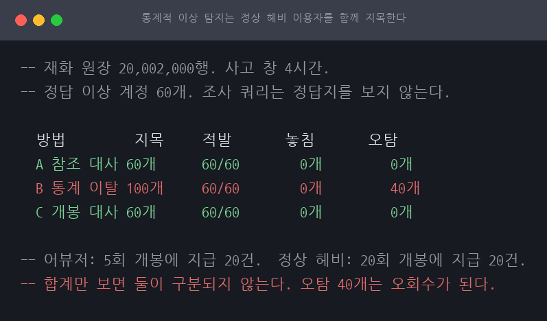

셋 다 이상 계정 60개를 놓치지 않았습니다. 갈리는 것은 오탐입니다.

**B 는 정상 계정 40개를 함께 지목했습니다.** 창 안에서 상자를 20회 연 정상 이용자들입니다.
어뷰저는 5회 개봉에 지급 20건(1+3씩), 이들은 20회 개봉에 지급 20건이라 합계만 보면
구분되지 않습니다. 이 40개를 회수 대상에 넣으면 **정상 이용자 40명의 재화를 빼앗습니다.**

거짓 음성은 회수 누락이고 거짓 양성은 오회수입니다. 둘 다 사고이지만 오회수가 더
무겁습니다. 놓친 어뷰저는 나중에 잡을 수 있지만, 잘못 뺏은 재화는 이미 신뢰를 깎은 뒤입니다.
그래서 **통계 이탈은 조사 대상을 좁히는 데 쓰고 회수 근거로는 쓰지 않습니다.**

> **다만 이 세 방법은 전부 "짝이 깨진 것" 을 찾습니다.** 짝은 맞는데 횟수만 한도를 넘긴
> 사고 — 아르곤 섬 사건의 공개된 설명이 그 모양입니다 — 에서는 대사 계열이 한 계정도
> 못 잡습니다. 18절에서 넷째 검사를 넣어 다시 겨뤘습니다.

### 회수 대상 산정

계정만 알아서는 보정을 못 합니다. 얼마를 되돌릴지가 나와야 합니다. 첫 지급은 정상이므로
같은 `ref_id` 안에서 두 번째부터가 회수 대상입니다.

```
  산정한 계정         60개
  정답과 건수·금액 일치 60개
  산정 회수액         360000
  정답 회수액         360000
```

계정 단위로 건수와 금액이 정답과 일치합니다. 이 표가 보정 절차(계획 03)의 입력이 됩니다.

## 4. 조사 쿼리는 얼마나 읽는가

재화 원장은 평소에 쓰기만 하는 append-only 표라 조사용 인덱스가 없는 경우가 많습니다.
사고가 나서야 처음 진지하게 조회합니다.

```
$ ./scripts/exp3-index.sh

  인덱스                          논리 읽기    인덱스 크기
  없음 (클러스터드 PK 만)    229614           0MB
  IX(ref_id)                         229614           426MB
  IX(created_at)                     227909           407MB
  IX(created_at, ref_id) 포함 account 228399           640MB
  IX(reason, created_at, ref_id) 포함 account 496              659MB
  필터드 (created_at, ref_id) WHERE reason=1 482              320MB
    위와 같되 조회에 SET 옵션 없음 229614           320MB
```

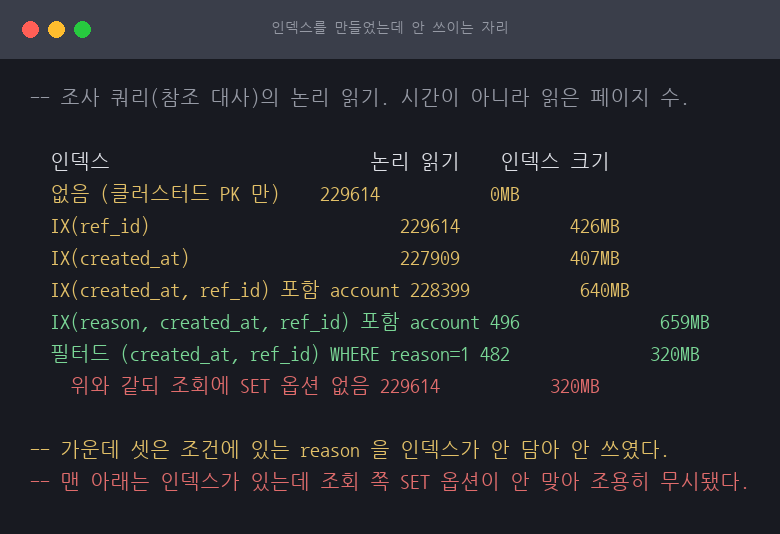

인덱스가 없으면 4시간 창을 보려고 30일치를 읽습니다. 창에 든 행은 전체의 0.6퍼센트인데
읽는 양은 전체의 두 배입니다. 조사 쿼리가 원장을 두 번 훑기 때문입니다.

**가운데 세 조건은 인덱스를 만들었는데도 읽는 양이 안 줄었습니다.** 셋 다 조건에 있는
`reason` 을 인덱스가 담지 않았습니다. 인덱스만으로 조회를 끝낼 수 없으니 옵티마이저가
표를 그냥 훑습니다. 쓰이지도 않으면서 쓰기마다 갱신 비용은 그대로 냅니다.

`reason` 을 키에 넣자 229,614 에서 496 으로 떨어집니다. 필터드 인덱스는 `reason = 1` 만
담아 크기가 절반인데 482 로 더 적게 읽습니다.

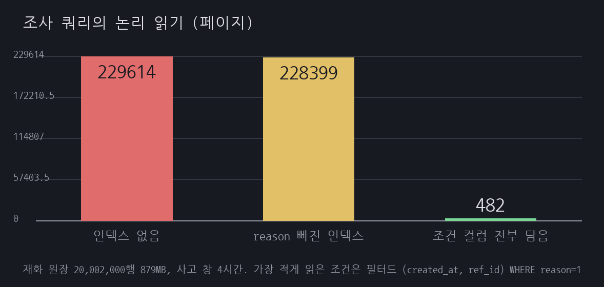

## 5. 사고 중에 인덱스를 만들 수 있는가

앞 절은 조사용 인덱스가 있으면 논리 읽기가 229,614에서 482로 떨어진다는 것을 보였습니다.
그런데 재화 원장은 평소에 쓰기만 하는 표라 그 인덱스가 없는 경우가 많습니다. 사고가
나서야 만들게 되는데, **2,000만 행 표에 인덱스를 만드는 것 자체가 위험한 작업입니다.**

```
$ ./scripts/exp4-index-build.sh

  ONLINE         막힌 쓰기  최대 지연 빌드가 잡은 테이블 락 결과
  OFF            1/2회         13757ms      S Sch-S                  빌드 성공
  ON             0/97회        408ms        IS Sch-S                 빌드 성공
```

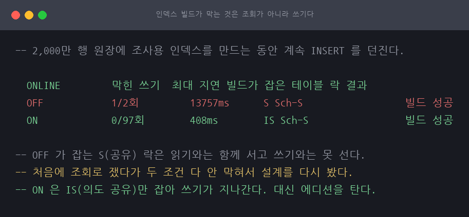

기본값(`ONLINE = OFF`)으로 만들면 빌드가 끝날 때까지 그 표에 **쓰기가 막힙니다.**
잡히는 락이 공유 락(`S`)이라 읽기와는 함께 설 수 있고 쓰기와는 못 섭니다.

`ONLINE = ON` 은 의도 공유 락(`IS`)만 잡아 쓰기가 지나갑니다. 대가는 둘입니다.
에디션이 Enterprise 나 Developer 여야 하고, 빌드 중 변경분을 따로 모으느라 tempdb 와
트랜잭션 로그를 더 씁니다. 그 양은 재지 않았습니다.

사고 중 판단은 이렇게 갈립니다.

| 상황 | 판단 |
|---|---|
| ONLINE 이 되는 에디션 | 만든다. 쓰기가 안 막힌다 |
| Standard 이하 | 만들지 않는다. 전체를 읽으며 조사한다 |
| 조사가 한 번으로 끝난다 | 만들지 않는다. 빌드 비용이 더 크다 |
| 같은 조사를 여러 번 돌려야 한다 | 만든다 |

## 5-2. 온라인 빌드의 대가는 얼마인가

5절은 `ONLINE = ON` 이면 쓰기가 안 막힌다는 것까지 보이고 "대신 tempdb 와 트랜잭션
로그를 더 씁니다. 이 랩에서는 그 양을 재지 않았습니다"라고 적었습니다.
**견주라고 해 놓고 견줄 근거를 또 안 준 것**이라 여기서 잽니다.

로그는 `sys.dm_io_virtual_file_stats` 의 `num_of_bytes_written` 차분으로 잽니다.
`sys.dm_db_log_space_usage` 는 "지금 얼마나 차 있나"라서 체크포인트가 지나가면 회수돼
"얼마나 썼나"를 못 잽니다.

**옆에서 쓰지 않고 잽니다.** 오프라인은 쓰기를 막고 온라인은 안 막으므로, 쓰게 두면
두 조건이 받아들인 변경량 자체가 달라져 로그 비교가 성립하지 않습니다.

```
$ ./scripts/exp8-online-cost.sh

  복구모델 ONLINE   인덱스   로그(파일) 로그(트랜잭션) 결과
  SIMPLE    OFF      657MB       11MB          2MB             성공
  SIMPLE    ON       700MB       99MB          못 잡음      성공
  FULL      OFF      657MB       712MB         655MB           성공
  FULL      ON       700MB       2621MB        못 잡음      성공
```

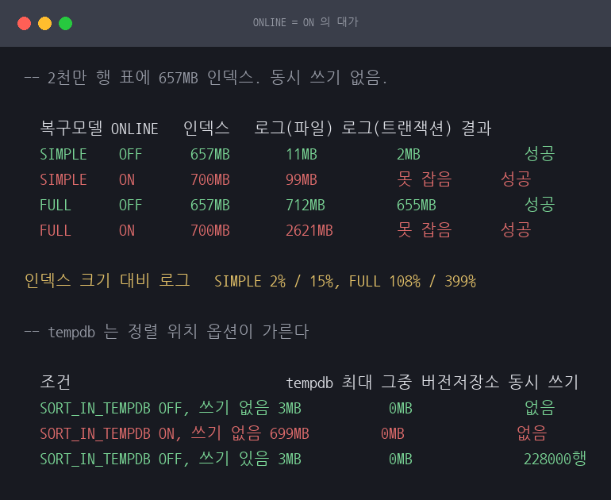

```
  인덱스 크기 대비 로그   SIMPLE 2% / 15%, FULL 108% / 399%
```

**"온라인이 로그를 더 쓴다"는 맞지만 복구 모델을 안 밝히면 반쪽입니다.** 절대량이
자릿수로 다릅니다. 인덱스 크기 대비로 보면 SIMPLE 은 온라인조차 15% 에 그치고 FULL 은
오프라인조차 108% 로 인덱스만큼 씁니다. **최소 로깅이 SIMPLE 에서는 온라인 빌드에도
걸린다**는 뜻입니다. 저는 이 실험을 짜면서 "온라인이면 어느 모델에서도 전체 로깅"이라고
주석에 적어 두었는데, 표가 그것을 반박했습니다.

교차 확인이 이 결론을 받쳐 줍니다. 파일 I/O 카운터와 트랜잭션 카운터는 경로가 다른데
FULL 오프라인에서 712MB 와 655MB 로 만납니다. 한쪽만 봤으면 계측이 샌 것인지 실제로
그런 것인지 가를 수 없었습니다. **다만 교차 확인은 오프라인에서만 됐습니다.** 온라인
빌드는 내부 트랜잭션을 짧게 여닫아 표본이 그 순간을 못 잡습니다. 표에 `못 잡음` 으로
적은 자리가 그것이고, **0 으로 적으면 "안 썼다"로 읽히므로 구분해 둡니다.**

### tempdb 는 옵션을 켤 때만 씁니다

1부에서 tempdb 가 어느 조건에서도 안 움직였습니다. 온라인이 tempdb 를 안 쓴다는 뜻이
아니라 **정렬 위치가 기본으로 tempdb 가 아니기** 때문입니다.

```
  조건                           tempdb 최대 그중 버전저장소 동시 쓰기
  SORT_IN_TEMPDB OFF, 쓰기 없음 3MB           0MB              없음
  SORT_IN_TEMPDB ON, 쓰기 없음 699MB         0MB              없음
  SORT_IN_TEMPDB OFF, 쓰기 있음 3MB           0MB              228000행
```

`SORT_IN_TEMPDB` 는 기본이 OFF 이고, 그러면 정렬은 인덱스가 들어갈 파일 그룹에서
일어납니다. **tempdb 가 커지는 것은 그 옵션을 켰을 때이고, 그때 인덱스 크기만큼
잡습니다.** 그러니 기본값으로 만든다면 봐야 할 여유는 tempdb 가 아니라 대상 파일
그룹입니다.

버전 저장소는 예상과 달랐습니다. 빌드 중에 22만 8천 행을 넣었는데도 0 입니다.
"빌드 중 변경분을 버전으로 들고 있다"는 설명대로면 늘어야 하는데 안 늘었습니다.
온라인 빌드가 동시 변경을 tempdb 버전 저장소가 아닌 다른 방법으로 다룬다는 뜻으로
보이지만, **이 실험이 확인한 것은 "안 잡혔다"까지입니다.**

## 6. 참조가 안 남는 사고

3절에서 통계 이탈은 회수 근거로 쓰지 말라고 했습니다. 오탐 40개가 오회수가 되니까요.
그러면 짝이 되는 질문이 남습니다. **그런데 왜 버리지는 않나.** 참조 대사와 개봉 대사가
오탐 0으로 다 잡았으니 없어도 될 것 같습니다.

두 번째 사고를 다른 모양으로 심었습니다. 지급 경로를 우회해 재화만 꽂힌 경우입니다.
원장에 `ref_id` 가 안 남고 개봉 로그에도 대응하는 행이 없습니다.

```
$ ./scripts/exp5-no-reference.sh

  방법         지목     적발       놓침     오탐
  A 참조 대사 0개       0/40         40개      0개
  C 개봉 대사 0개       0/40         40개      0개
  B 통계 이탈 40개      40/40        0개       0개
  D 참조 결측 40개      40/40        0개       0개
```

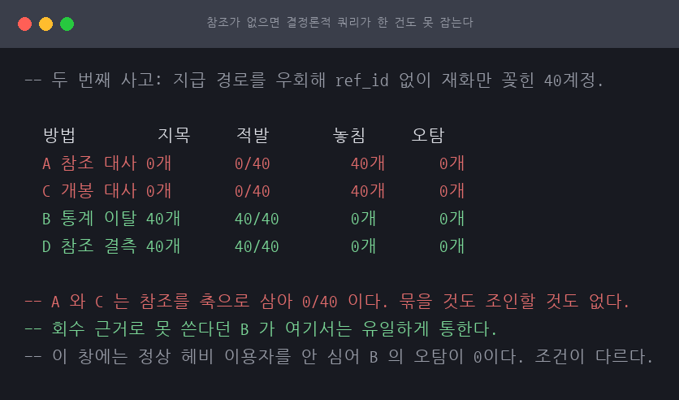

**A 와 C 가 한 건도 못 잡습니다.** 둘 다 참조를 축으로 삼기 때문입니다. A 는 같은
`ref_id` 에 지급이 여러 건인 것을 찾는데 `ref_id` 가 NULL 이면 묶을 것이 없습니다.
C 는 개봉 로그와 조인하는데 개봉 자체가 없으니 조인에 안 걸립니다.

**B 는 잡습니다.** 참조를 안 보고 획득량만 보기 때문입니다. 3절에서 오탐을 만들어
회수 근거로 못 쓴다고 했던 바로 그 성질이, 여기서는 유일하게 통하는 성질이 됩니다.

D 는 이 사고를 알고 나서 쓴 맞춤 쿼리입니다. `ref_id` 가 NULL 인 지급을 그냥 세면
정확히 잡힙니다. 다만 **사고의 모양을 이미 안 뒤에야** 쓸 수 있습니다. B 가 먼저 이상한
계정을 짚어 주지 않으면 `ref_id` 를 볼 생각도 못 합니다.

> 여기서 B 의 오탐이 0인 것은 조건이 달라서입니다. 이 두 번째 창에는 정상 고활동 계정을
> 안 심었습니다. B 의 오탐 성질이 사라진 것이 아니라 이 창에 그 원천이 없을 뿐이고,
> 두 실험의 오탐 수를 나란히 비교하면 안 됩니다.

그래서 3절의 결론에 짝이 붙습니다.

- 통계 이탈은 **회수 근거로 쓰지 않는다.** 오탐이 오회수가 된다
- 그러나 **버리지도 않는다.** 참조가 없는 사고에서는 그것뿐이다

통계 이탈이 짚어 준 계정을 사람이 열어 보고 사고의 모양을 알아낸 다음, 그 모양에 맞는
결정론적 쿼리를 만들어 회수 근거로 삼는 순서입니다.

## 7. 분포가 만드는 오탐

3절의 오탐 40개는 제가 심은 계정 수였습니다. 실제 게임에서 오탐이 몇 퍼센트인지는
그 실험이 답하지 못합니다. 활동량을 소수에 쏠리게 만든 창을 하나 더 두고, 심지 않은
오탐을 셌습니다.

```
$ ./scripts/exp6-skew.sh

  기준     지목    적발      놓침    오탐    정상 대비 지목 중 무고
  2시그마 173개    30/30       0개      143개    0.71%       82.7%
  3시그마 129개    30/30       0개      99개     0.49%       76.7%
  4시그마 86개     30/30       0개      56개     0.28%       65.1%
  5시그마 65개     30/30       0개      35개     0.17%       53.8%
```

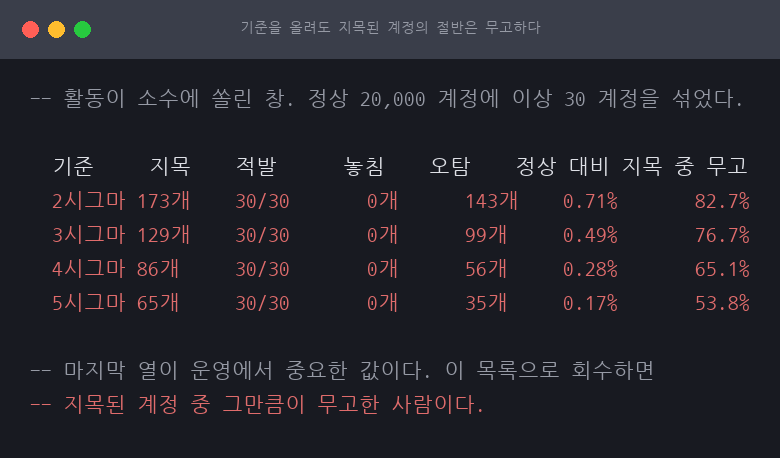

기준을 올리면 오탐은 줄지만 **어느 기준에서도 0이 되지 않습니다.** 활동이 쏠린
분포에서 상위 정상 이용자와 어뷰저는 같은 꼬리에 있습니다.

마지막 열이 운영에서 제일 중요한 값입니다. 이 목록을 그대로 회수하면 지목된 계정 중
그만큼이 무고한 사람입니다. **5시그마까지 올려도 절반이 넘습니다.** 어뷰저 한 명을
잡으려고 정상 이용자 한 명 이상의 재화를 뺏는 셈입니다.

3절에서 심은 오탐으로 내린 결론이 실제 분포에서도 그대로 서고, 오히려 더 강해집니다.

## 8. 파티션은 조사를 빠르게 하지 않았다

인덱스는 사고 뒤에 만들면 쓰기를 막습니다(5절). 그러면 평소에 파티션을 나눠 두는 쪽은
어떤가. 시간으로 나눠 두면 조사 창이 든 조각만 읽을 것 같습니다.

```
$ ./scripts/exp7-partition.sh

  조건                                   읽은 파티션       논리 읽기
  A created_at 범위 조건               확인 못 함         657
  B created_at 을 CONVERT 로 감쌈      확인 못 함         7499
  C 파티션 키 없이 account_id 로만 확인 못 함         112868
```

파티션 키를 그대로 조건에 넣으면 657, 함수로 감싸면 7,499, 조건에 없으면 112,866입니다.
`CONVERT(date, created_at) = ...` 는 읽기에 자연스럽고 결과도 맞는데 자르지 못한다는
것만 안 보입니다. [A22](../A22-index-not-used/)와 같은 모양입니다.

그런데 파티션 표는 클러스터드 키도 `created_at` 으로 바뀌었습니다. 원래 표와 바로
견주면 **두 변수가 섞입니다.** 파티션 없이 클러스터드 키만 바꾼 표를 중간에 세웠습니다.

```
  1) 파티션 없음 + ledger_id 클러스터드 (원래 표) 114353
  2) 파티션 없음 + created_at 클러스터드 638
  3) 파티션 있음 + created_at 클러스터드 657
```

**파티셔닝은 이 조사 쿼리를 빠르게 하지 않았습니다.** 2와 3이 거의 같고 오히려 파티션
표가 조금 더 읽습니다. 창을 좁힌 힘은 사실상 전부 클러스터드 키를 시간 순으로 잡은
데서 왔습니다. 처음에는 원래 표와 파티션 표를 바로 견줘 174배라고 적을 뻔했습니다.

그러면 파티션은 왜 두는가. 조사 속도가 아니라 보존 정리를 `DELETE` 가 아니라 파티션
스위치로 하기 위해서고([R17](../R17-timeseries-partition/)이 그 비교를 했습니다),
파티션 단위로 인덱스를 다시 만들거나 오래된 조각을 읽기 전용으로 옮기기 위해서입니다.

**조사만 놓고 보면 클러스터드 키를 시간 순으로 잡는 것이 답입니다.** 인덱스와 달리
평소에 정하는 것이라 사고가 난 뒤에 쓰기를 막을 일도 없습니다.

## 9. 건수는 맞는데 금액만 조작되면

지금까지 만든 사고는 둘 다 **지급 건수가 늘어난** 모양이었습니다. 못 한 것에
"값만 조작된 사고는 셋 다 못 잡을 텐데 만들지 않았습니다"라고 적어 둔 것을 만듭니다.

이 상자는 지급액이 고정이 아니라 보상 테이블(100~700, 7가지)에서 뽑힙니다.
그러면 조작도 두 갈래가 됩니다.

- **T1** 테이블 밖의 값(900)을 준다
- **T2** 테이블 안에서 최고값(700)만 준다. 한 건씩 보면 전부 정상이다

```
$ ./scripts/exp9-amount-tamper.sh

  방법                         지목    T1 적발   T2 적발   오탐
  A 참조 대사(중복 지급) 0개      0/50        0/50        0개
  C 개봉 대사(건수 대조) 0개      0/50        0/50        0개
  D 참조 결측                0개      0/50        0/50        0개
  B 통계 이탈(합계 3시그마) 31개     22/50       9/50        0개
```

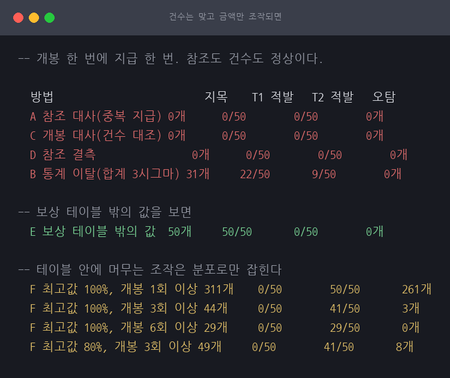

**건수를 보는 셋(A·C·D)은 한 건도 못 잡습니다.** 개봉 한 번에 지급 한 번이라
개봉 로그와 원장이 완벽히 대응합니다. 셋이 못 잡는 이유가 같습니다. 참조 중복도
건수, 개봉 대조도 건수, 참조 결측도 결국 건수입니다. **결정론적 방법을 셋이나
갖췄다고 안심했는데 셋이 같은 축을 보고 있었습니다.**

축을 하나 더 놓습니다. 게임이 줄 수 있는 값은 정해져 있으므로 그 목록에 없는 값이
나왔다면 그 자체가 근거입니다. 목록은 손으로 적지 않고 사고 이전 데이터에서 읽습니다.

```
  E 보상 테이블 밖의 값  50개     50/50       0/50        0개
```

**T1 은 오탐 0 으로 잡히고 T2 는 한 건도 안 잡힙니다.** T2 가 받은 값은 전부 테이블
안에 있어 한 건씩 떼어 보면 어느 것도 불법이 아닙니다.

### 규칙 안에 머무는 조작에는 통계밖에 없습니다

T2 를 잡으려면 값 하나가 아니라 그 계정의 분포를 봐야 합니다.

```
  F 최고값 100%, 개봉 1회 이상 311개    0/50        50/50       261개
  F 최고값 100%, 개봉 3회 이상 44개     0/50        41/50       3개
  F 최고값 100%, 개봉 6회 이상 29개     0/50        29/50       0개
  F 최고값 80%, 개봉 3회 이상 49개     0/50        41/50       8개
```

기준을 낮추면 다 잡지만 지목 중 84%가 무고하고, 올리면 오탐이 0 이 되는 대신
절반 가까이 놓칩니다. 개봉을 적게 한 조작 계정은 우연과 구분할 근거가 아예 없습니다.

회수액도 갈립니다.

```
  T1 지급 건수                   333
  테이블 최고값으로 내리면 66600
  그 기대값                      66600
  전액을 회수하면             299700
```

**얼마를 회수할지는 DB 가 정하지 못합니다.** 지급액이 무작위라 "정상이었다면 얼마였을까"를
알 수 없기 때문입니다. DB 가 줄 수 있는 것은 두 숫자이고 어느 쪽인지는 정책이 정합니다.
**DBA 가 할 일은 두 숫자를 정확히 대는 것**입니다. T2 는 받은 값이 전부 합법이라
초과분이라는 개념 자체가 없어 회수액을 못 냅니다.

**결정론적 방법이 닿는 범위는 규칙이 정한 경계까지**이고 그 안쪽은 통계의 몫입니다.
6절이 "참조가 안 남으면 통계밖에 없다"였다면 이것은 "규칙 안에 머물면 통계밖에 없다"입니다.

## 10. 낮은 에디션에서 실제로 막히는 것

5절의 처방은 "ONLINE 이 되는 에디션이면 만든다, Standard 이하면 만들지 않는다"였는데
그 "안 된다"를 문서로만 알고 있었습니다. Express 컨테이너를 띄워 같은 DDL 을 던집니다.

```
$ ./scripts/exp10-edition.sh

  기능                             Developer      Express        Express 가 뱉은 것
  CREATE INDEX (기본)              됨            됨
  CREATE INDEX WITH ONLINE = ON      됨            거부         Msg 1712  Online index operations can only be performed in Enterprise edition of
  CREATE INDEX WITH SORT_IN_TEMPDB = ON 됨            됨
  필터드 인덱스                됨            됨
  파티션 함수·스킴           됨            됨
  데이터 압축(PAGE)             됨            됨
  확장 이벤트 세션            됨            됨
```

```
  CREATE INDEX WITH ONLINE = ON      됨            거부         Msg 1712  Online index operations can only be performed in Enterprise edition of
```

**`Msg 1712` 입니다.** 사고 중에 이 번호를 모르면 그 순간 검색부터 하게 됩니다.

파티션·필터드 인덱스·압축·확장 이벤트는 Express 에서도 됩니다. 2016 SP1 이후로
열린 것들이라 **에디션 때문에 미리 접을 자리가 생각보다 좁습니다.** 실제로 걸리는
것은 온라인 빌드 쪽이고, 그렇다면 낮은 에디션의 답은 인덱스가 아니라
**클러스터드 키를 평소에 시간 순으로 잡는 것**입니다(8절에서 114,353 → 638).

## 11. 보존 정리, DELETE 와 파티션 스위치

8절은 "파티션의 값은 조사가 아니라 보존 정리에 있다"고 적고 스위치를 해 보지
않았습니다. 가장 오래된 파티션을 두 방법으로 버립니다.

```
$ ./scripts/exp11-partition-switch.sh

  방법                   지운 행   로그 쓰기 최대 락 수 락 모양
  A DELETE, 4000행씩     4666666행   1031.4MB      6261          IX Sch-S X
  B SWITCH                 4666666행   0.0MB         5             Sch-M
```

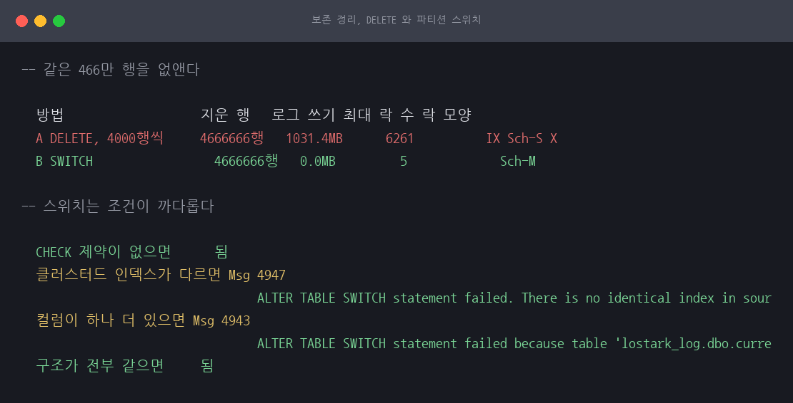

**같은 행을 없애는데 로그가 자릿수로 다릅니다.** DELETE 는 행마다 되돌릴 수 있게
로그를 남기고 락을 승격시키기까지 합니다(`X`). SWITCH 는 행을 하나도 안 건드리고
카탈로그만 바꿉니다.

조건은 까다롭고 **나갈 때와 들어올 때가 다릅니다.**

```
  CHECK 제약이 없으면      됨
  클러스터드 인덱스가 다르면 Msg 4947
                                 ALTER TABLE SWITCH statement failed. There is no identical index in sour
  컬럼이 하나 더 있으면 Msg 4943
                                 ALTER TABLE SWITCH statement failed because table 'lostark_log.dbo.curre
  구조가 전부 같으면     됨
```

나갈 때는 `CHECK` 제약이 필요 없습니다. 들어올 때는 그 표의 모든 행이 파티션 범위
안에 있음을 제약으로 증명해야 하고, 위쪽 경계만 걸었다가 `Msg 4972` 로 거부됐습니다.
**이 비대칭이 운영에서 걸립니다.** 보존 정리는 나가는 쪽이라 쉽게 되는데 잘못 뗀 것을
되돌리려는 순간 조건이 하나 더 붙습니다.

## 12. 0 이 나왔을 때 계기를 의심하는 법

5-2 절은 두 값이 0 으로 나왔는데 그 0 을 못 믿어 못 한 것으로 남겼습니다.
0 에는 "안 썼다"와 "못 잡았다"가 섞여 있고, 가르는 방법은 하나입니다.
**그 계기로 0 이 아닌 값을 한 번 만들어 보는 것.**

```
$ ./scripts/exp12-version-store.sh

  조건                                   RCSI       tempdb 버전    이 DB 가 만든 버전
  A RCSI 끄고 30만 행 갱신           OFF        0MB              0MB
  B RCSI 켜고 30만 행 갱신           ON         83MB             83MB
```

**계기가 살아 있습니다.** RCSI 를 켜자 같은 쿼리가 83MB 를 잡았습니다. 그러므로
온라인 인덱스 빌드 중의 0 은 **실제로 버전 저장소를 안 쓴 것**입니다. 양성 대조가
없으면 그 0 은 아무 말도 못 합니다.

로그는 계기를 하나 더 세웁니다. `sys.dm_db_log_stats` 는 마지막 로그 백업 이후 쌓인
로그를 알려 주고, 트랜잭션 경계와 무관합니다.

```
  조건                                   파일 카운터 dm_db_log_stats
  오프라인 인덱스 빌드            68.1MB           68.1MB
  온라인 인덱스 빌드               101.4MB          101.3MB
```

**온라인 빌드에서도 두 계기가 만납니다.** 5-2 절에서 파일 카운터 하나로만 서 있던
자리를 채웠습니다. 계기 하나가 안 잡히면 같은 계열을 더 뒤지지 말고
**경로가 다른 계기**를 찾아야 합니다.

## 13. 결론이 분포 모양 하나에 기대는가

7절은 쏠린 분포에서 오탐이 안 사라진다고 했는데 그 쏠림을 제곱근 꼴 하나로만
만들었습니다. 실제 게임이 그 모양인지는 데이터가 없어 답할 수 없지만,
**결론이 그 모양에만 기대는지**는 답할 수 있습니다.

```
$ ./scripts/exp13-distribution.sh

## U 균등
  정상 계정 개봉 수: 최대 12 / 평균 12 / 상위 1% 경계 12
  분포         기준   지목    적발      오탐    지목 중 무고
  U 균등       3시그마 30개     30/30       0개      0%
  U 균등       4시그마 30개     30/30       0개      0%
## S 제곱근
  정상 계정 개봉 수: 최대 60 / 평균 1 / 상위 1% 경계 60
  분포         기준   지목    적발      오탐    지목 중 무고
  S 제곱근    3시그마 54개     30/30       24개     44%
  S 제곱근    4시그마 45개     30/30       15개     33%
## P 멱함수
  정상 계정 개봉 수: 최대 200 / 평균 1 / 상위 1% 경계 200
  분포         기준   지목    적발      오탐    지목 중 무고
  P 멱함수    3시그마 44개     30/30       14개     32%
  P 멱함수    4시그마 40개     30/30       10개     25%
## L 로그정규
  정상 계정 개봉 수: 최대 30 / 평균 10 / 상위 1% 경계 30
  분포         기준   지목    적발      오탐    지목 중 무고
  L 로그정규 3시그마 30개     30/30       0개      0%
  L 로그정규 4시그마 30개     30/30       0개      0%
```

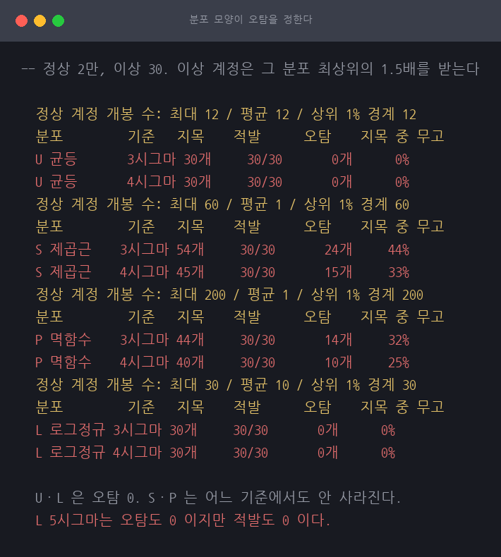

```
  오탐이 0 이 되는 분포      U 균등;L 로그정규
  어느 기준에서도 0 이 안 되는 분포 S 제곱근;P 멱함수
  가장 나쁜 조건               S 제곱근 3시그마 오탐 24개(44%)
  적발을 놓친 조건            L 로그정규 5시그마 30개 놓침
```

**절반은 기대고 있었습니다.** 균등과 로그정규에서는 오탐이 0 이 되고, 쏠린 두
분포에서는 어느 기준에서도 안 사라집니다. 상위 정상 이용자와 어뷰저가 같은 꼬리에
있는 것은 제곱근 꼴의 특징이 아니라 **쏠림 자체의 성질**입니다.

**그리고 7절이 놓친 것이 나왔습니다.** 7절은 "기준을 올려 오탐을 줄이는 쪽이 회수
근거로는 안전하다"고 적었는데, 로그정규에서 기준을 올리자 **적발이 0 이 됐습니다.**
꼬리가 두꺼워 표준편차가 커지고 그 선이 어뷰저보다 위로 올라간 것입니다.
기준을 올리는 것은 **맞바꿈이지 일방통행이 아니고** 그 기울기가 분포마다 다릅니다.

## 14. 주기적으로 도는 탐지 배치

이 세션의 쿼리는 전부 사고를 안 다음에 창을 정해 한 번 도는 것입니다. 주기 배치로
옮기면 새 문제가 셋 생깁니다. 어디까지 봤는지 기억해야 하고, 같은 사고를 두 번
알리면 안 되고, **늦게 도착한 행을 놓치면 안 됩니다.**

셋째가 제일 조용히 틀립니다. `created_at` 은 그 일이 일어난 시각이지 DB 에 도착한
시각이 아닙니다.

```
$ ./scripts/exp14-scheduled-detect.sh

### B 워터마크만, 늦은 도착 있음
  회차   창 시작               읽은 행 새 경보 누적 경보
  1        2026-08-05 10:00:00.000  505        0          0
  2        2026-08-05 11:00:00.000  506        0          0
    (여기서 늦게 도착한 지급 40건이 들어옵니다)
  3        2026-08-05 12:00:00.000  538        0          0
  4        2026-08-05 13:00:00.000  497        0          0
  5        2026-08-05 14:00:00.000  497        0          0
  6        2026-08-05 15:00:00.000  497        0          0
  최종 경보 0건 (기대 40건)

### C 워터마크를 10분 물려 둠, 늦은 도착 있음
  회차   창 시작               읽은 행 새 경보 누적 경보
  1        2026-08-05 10:00:00.000  505        0          0
  2        2026-08-05 10:50:00.000  506        0          0
    (여기서 늦게 도착한 지급 40건이 들어옵니다)
  3        2026-08-05 11:40:00.000  500        0          0
  4        2026-08-05 12:30:00.000  577        40         40
  5        2026-08-05 13:20:00.000  498        0          40
  6        2026-08-05 14:10:00.000  497        0          40
  최종 경보 40건 (기대 40건)
```

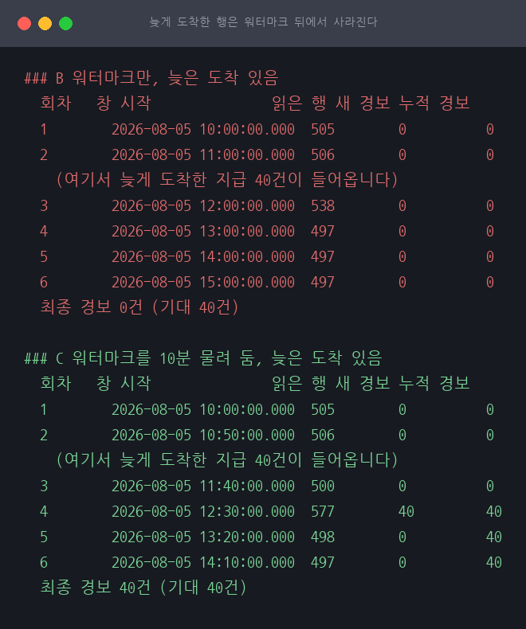

**B 는 오류도 경보도 없이 사라집니다.** 배치가 그 창을 지나간 뒤에 같은 시각의 행이
도착했고 워터마크는 이미 그 앞에 있습니다. C 는 워터마크를 창 끝이 아니라 10분 뒤로
물려 두어 겹쳐 읽고, 유일 제약이 중복 경보를 막아 주므로 겹쳐 읽는 것이 안전합니다.

다만 **지연 폭이 도착 지연보다 넓어야 합니다.** 처음에 사고를 창 한가운데 두었을
때는 10분 지연으로 못 물러나 C 도 놓쳤습니다. 얼마나 늦게 도착하는지는
**DB 가 아니라 지급 경로가 답할 문제**입니다.

경보는 조사 대상이지 회수 근거가 아닙니다. 주기 배치가 하는 일은 **사람을 부르는
것**까지이고, 근거는 그 뒤에 사람이 창을 정해 돌리는 대사 쿼리가 만듭니다.

## 15. 예상과 달랐던 점

### 인덱스 빌드가 막는 것은 조회가 아니라 쓰기였습니다

빌드 중 막히는 것을 재려고 조회를 던졌는데 두 조건 다 한 번도 안 막혔습니다.
오프라인 인덱스 빌드가 잡는 것이 스키마 수정 락(`Sch-M`)이 아니라 공유 락(`S`)이기
때문입니다. 읽기는 공유 락끼리 함께 설 수 있습니다.

탐침을 삽입으로 바꾸자 13.7초가 막혔습니다. 재화 원장은 append-only 라 사고 중에도
계속 쌓이므로, **막히는 쪽을 재려면 탐침이 쓰기여야 했습니다.** 조회로 재고 "안 막힌다"고
적었으면 인덱스를 사고 중에 만들어도 안전하다는 반대 결론이 나올 뻔했습니다.

### 통계적 탐지가 처음에는 오탐 0으로 나왔습니다

첫 판에서 B 가 60개를 지목해 오탐이 하나도 없었습니다. 그대로 뒀으면 "통계적 탐지도
정확하다"는 결론이 표에 들어갔을 것입니다.

원인은 데이터였습니다. 계정 분포가 균등이라 어뷰저가 워낙 튀어서 3시그마로도 깨끗이
갈렸습니다. 실제 게임에는 정상인데 활동이 아주 많은 이용자가 있고, 그들이 오탐의
원천입니다. 그 계정군을 넣자 오탐 40개가 나왔습니다.

**데이터가 실제와 다르면 방법의 약점이 안 보입니다.** 이 실험이 원래 재려던 것은 세 방법의
정확도였는데, 처음 데이터셋은 세 방법을 구분할 능력이 없었습니다.

### 인덱스를 만들었는데 안 쓰였습니다

`IX(created_at, ref_id) INCLUDE (account_id)` 는 조사 쿼리가 쓰는 컬럼을 다 담은 것처럼
보였는데 읽는 양이 안 줄었습니다. 조건에 `reason = 1` 이 있는데 그것이 인덱스에 없었습니다.
640MB 를 쓰고도 한 번도 안 쓰인 인덱스입니다.

같은 저장소의 [A22](../A22-index-not-used/) 가 MySQL 에서 다룬 주제와 같은 자리입니다.
인덱스가 있다는 것과 쓰인다는 것은 다릅니다.

### 필터드 인덱스는 SET 옵션이 안 맞으면 조용히 안 쓰입니다

마지막 줄이 이 실험에서 제일 조심할 자리입니다. 인덱스는 그대로 있는데 조회 쪽
`QUOTED_IDENTIFIER`, `ANSI_NULLS` 가 안 맞으면 필터드 인덱스는 쓰이지 않습니다.
**에러가 나지 않고 그냥 안 쓰입니다.** 482 에서 229,614 로 돌아갑니다.

접속 도구마다 기본 SET 옵션이 달라서 "내 SSMS 에서는 빠른데 애플리케이션에서는 느리다"가
여기서 나옵니다. 만든 쪽과 쓰는 쪽이 다르면 확인해야 합니다.

### SQL 이 조용히 실패하고 스크립트는 계속 돌았습니다

적재 스크립트가 `QD "..." >/dev/null` 로 질의를 던졌는데, 따옴표가 깨져 SQL 이 죽었습니다.
`>/dev/null` 이 `Msg` 를 통째로 버려서 스크립트는 다음 단계로 넘어갔고, 데이터셋이 빈 채로
끝까지 돌았습니다. 마지막 행 수 확인에서 잡히긴 했지만 그때까지 무엇이 잘못됐는지 몰랐습니다.

`Msg` 가 보이면 멈추는 `QDX` 를 만들어 쓰기 질의를 전부 그리로 돌렸습니다. 바로 다음
실행에서 `Msg 241` 이 화면에 떴고 원인이 한 번에 나왔습니다.

## 16. 표준 처방

1. **회수 근거는 참조 대사나 개봉 대사로 만든다.** 통계 이탈은 조사 대상을 좁히는 데만 쓴다.
   다만 **참조가 없는 사고에서는 통계 이탈뿐이다.** 그것으로 계정을 좁히고, 사람이 열어
   사고의 모양을 알아낸 뒤, 그 모양에 맞는 결정론적 쿼리를 새로 만들어 회수 근거로 삼는다.
2. **조사 쿼리는 계정과 금액을 함께 낸다.** 계정 목록만으로는 보정 절차가 시작되지 않는다.
3. **조사용 인덱스를 평소에 하나 둔다.** 사고 중에 2,000만 행 표에 인덱스를 만드는 것은
   그 자체가 위험한 작업이다. 평소 비용과 사고 때 전체를 읽는 비용을 견준다.
4. **인덱스에 조건 컬럼을 빠뜨리지 않는다.** 조사 쿼리의 `WHERE` 에 있는 것은 전부 키나
   포함 열에 있어야 한다. 하나 빠지면 인덱스 전체가 안 쓰인다.
5. **필터드 인덱스를 쓰면 조회 쪽 SET 옵션을 함께 못 박는다.** 안 맞으면 에러 없이 무시된다.
6. **회수 대상 표를 정답과 대조할 수 있게 만든다.** 이 랩에는 정답지가 있지만 운영에는 없다.
   대신 표본을 뽑아 손으로 확인하는 절차를 둔다.

## 17. 못 한 것

- **실제 게임 활동의 분포를 모릅니다.** 13절은 모양을 바꿔도 결론의 방향이 어떻게
  달라지는지 보였을 뿐, 어느 모양이 맞는지는 데이터가 없어 답할 수 없습니다.
- **Express 의 DB 크기 상한(10GB)을 안 쟀습니다.** 채우려면 10GB 를 써야 하는데
  그만한 값이 없다고 봤습니다. 이 세션의 원장이 879MB 라 상한 안에 들지만
  실제 게임 원장은 그렇지 않습니다.

## 18. 짝은 맞는데 한도만 넘긴 사고

3절이 겨룬 세 방법은 전부 **짝이 깨진 것**을 찾습니다. 같은 `ref_id` 에 지급이 여러 건
붙었거나, 개봉 수와 지급 수가 안 맞거나. 그런데 2023년 아르곤 섬 사건의 공개된 설명은
그 모양이 아닙니다.

> 다수의 계정을 이용하여 비정상적인 방법으로 **채널을 반복 재생성하여 보상을 획득**

채널을 새로 만들면 석상이 새로 생기고, 그 석상을 완성해 상자를 얻고 정상적으로 엽니다.
원장에는 개봉도 지급도 각각 늘어나고 **짝은 전부 맞습니다.** 이상한 것은 횟수뿐입니다.
정상 규칙은 "석상은 매일 1회" 였고, 6월 7일 업데이트로 "원정대당 1회" 가 됐습니다.

그러면 대사 계열은 이 사고를 못 잡습니다. 넷째 모양을 심고 검사 넷을 겨뤘습니다.

### 심은 것

`box_id = 9` 를 하루 1회 상자로 두고 30일 치를 만들었습니다. 지급은 개봉마다 1건씩
전부 정상입니다. 실험 1 의 2,000만 행 원장은 안 건드리고 표를 따로 썼습니다.

| 집단 | 계정 | 개봉 방식 | 30일 총 획득 |
|---|---|---|---|
| 정상 | 5,000개 | 며칠에 한 번, 하루 1회 | 900 ~ 1,900 |
| 성실 | 40개 | **30일 내내 매일 1회** (한도 준수) | 11,500 ~ 12,500 |
| 어뷰저 | 50개 | **3일 동안 하루 12회** | 14,100 ~ 14,700 |

성실 계정과 어뷰저의 총 획득량이 겹치도록 잡았습니다. 합계만 보는 방법으로는 못 가르게
하려는 것입니다.

### 결과

```
$ ./scripts/exp15-quota-breach.sh

  개봉 19668행 · 지급 19668행 · 개봉 수 = 지급 수 YES
  정답지  어뷰저 50개 계정 · 한도 초과 1650회

  방법         지목   적발     놓침   오탐
  A 참조 대사  0개    0/50     50개    0개
  C 개봉 대사  0개    0/50     50개    0개
  B 통계 이탈  90개   50/50    0개    40개
  D 한도 초과  50개   50/50    0개     0개
```

**대사 계열 둘은 한 계정도 못 잡았습니다.** 짝이 맞으니 찾을 것이 없습니다. 3절에서
오탐 0으로 가장 정확했던 방법이 여기서는 적발이 0입니다.

**통계 이탈은 50개를 다 잡았지만 성실 계정 40개를 함께 지목했습니다.** 3시그마 경계가
6,385.6 인데 성실 계정의 최저가 11,500 이라 전부 경계 위입니다. 3절과 같은 실패입니다.

**한도 초과만 50개를 정확히 냈습니다.** 오탐이 0인 이유는 통계처럼 "평소보다 많다" 가
아니라 **"하루 1회라고 정해 놓은 것을 넘었다"** 를 보기 때문입니다. 한도가 명시돼 있으면
그것을 넘은 것은 정의상 위반이고, 정상 이용자는 넘을 수 없습니다.

### 회수 단위가 "회" 인 이유

한도 초과 검사는 계정만 내지 않습니다. **한도를 넘긴 개봉이 몇 회인지**가 같이 나옵니다.

```
  산정한 계정           50개
  산정한 한도 초과 개봉 1650회
  정답과 일치           YES
```

공지가 "3,806**회** 분량" 이라고 회 단위로 적을 수 있었던 것이 이 구조입니다. 한도가
있으면 초과분을 세면 되고 그것이 곧 회수 대상입니다. 통계로는 "평소보다 많다" 까지만
나오지 몇 회가 부당한지는 안 나옵니다.

### 그래서 3절의 결론을 넓힙니다

3절은 **"확정은 대사로"** 였습니다. 이 실험을 넣으면 그 문장은 좁습니다. 대사는 근거가
되는 여러 방법 중 하나이고, 공통점은 대사라는 기법이 아니라 **결정론적으로 판정된다는
것**입니다.

- **짝이 안 맞는다** — 개봉 1건에 지급 2건은 규칙 위반이다
- **한도를 넘었다** — 하루 1회인 것을 12회 열었다

둘 다 "얼마나 많은가" 가 아니라 **"약속을 어겼는가"** 를 봅니다. 통계 이탈은 앞의 질문만
할 수 있어서 회수 근거가 못 됩니다.

### 못 한 것

- **실제 아르곤 사건이 어느 모양이었는지는 모릅니다.** 서버가 채널마다 새 보상 이벤트를
  발급했다면 이 실험의 D 이고, 같은 보상 슬롯에 지급을 여러 번 붙였다면 3절의 A 입니다.
  공지로는 갈리지 않습니다. 그래서 둘 다 만들어 두었습니다.
- **한도 검사는 한도를 아는 사람이 있어야 성립합니다.** 규칙이 문서에 없고 코드에만
  있으면 조사하는 쪽이 그 값을 못 씁니다.
- **정확도만 쟀습니다.** 조사 쿼리가 얼마나 읽는지는 4절이 2,000만 행 원장에서 따로 잽니다.
  처음에는 이 실험도 그 원장에 얹었는데, `account_id` 에 인덱스가 없어 지우고 심는 것만으로
  전체 스캔이 돌았고 `Msg 802`(버퍼 풀 메모리 부족)로 중단됐습니다.

**같은 문제를 총량으로 푼 사례가 있다.** Star Wars Galaxies 는 설계자들이 "생성된 통화량 대
소멸된 통화량"을 비교하다가, 나가는 돈이 들어오는 돈보다 많은데도 통화 부족이 없다는 점에서
대규모 복사를 발견했다. EverQuest II 는 **24시간 만에 경제 내 총 통화량이 20% 증가**한 것을
이상 징후로 잡았다. 이 세션은 계정 단위 탐지 세 가지를 겨뤘는데, **경제 총량 대사는 넷째 축**이고
여기서 다루지 않았다. 계정을 못 특정해도 "무언가 새고 있다"는 것은 총량이 먼저 알려 준다.
