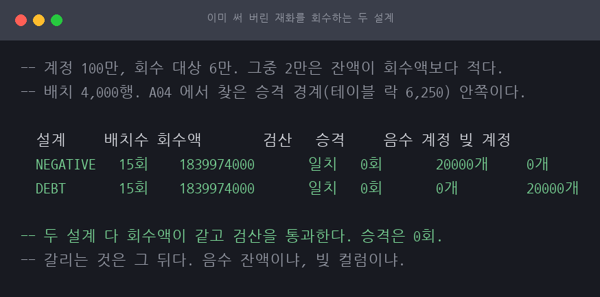
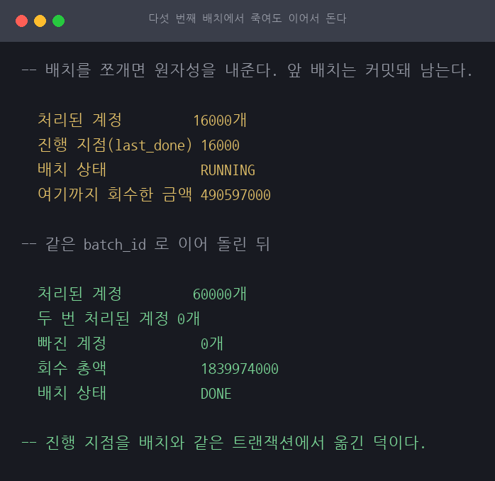
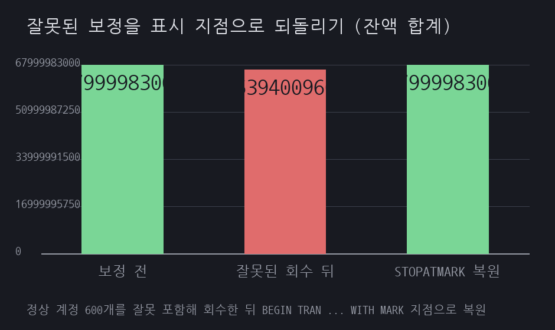
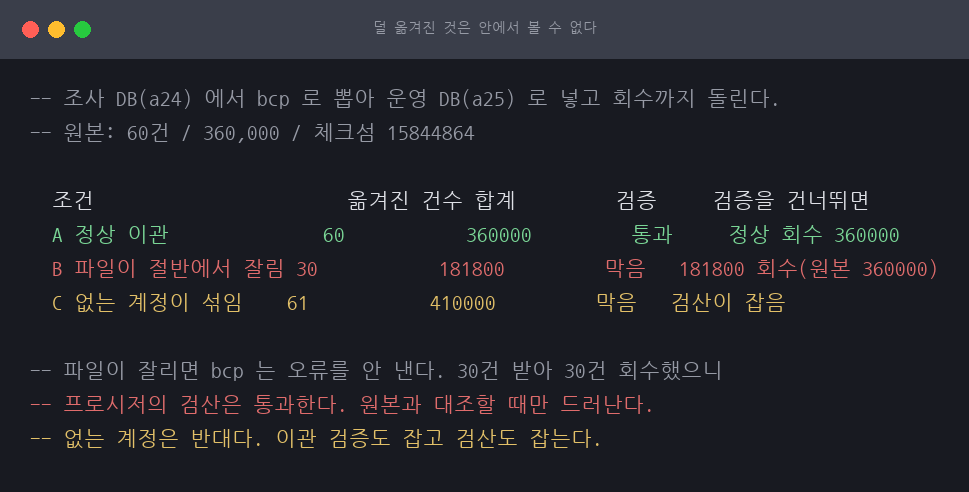
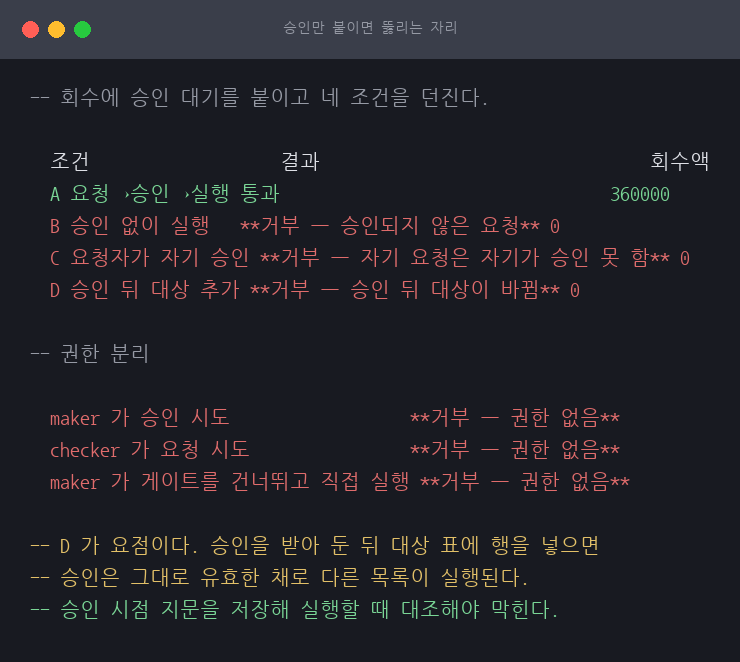
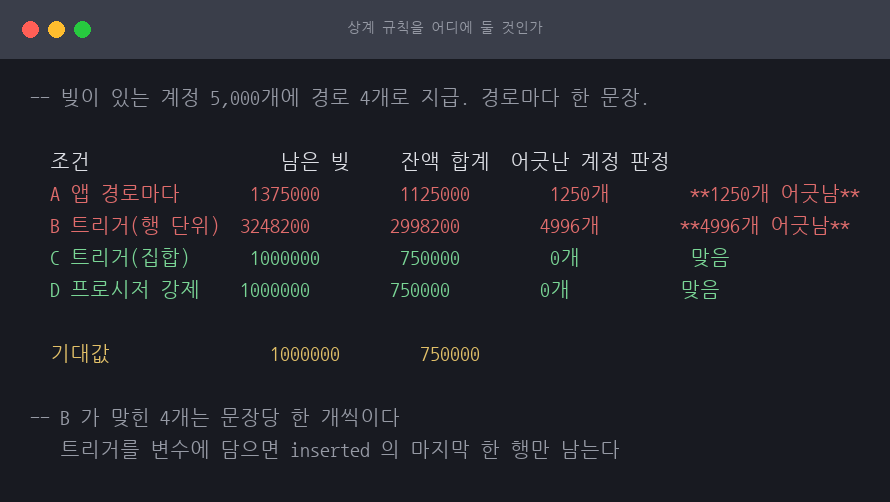
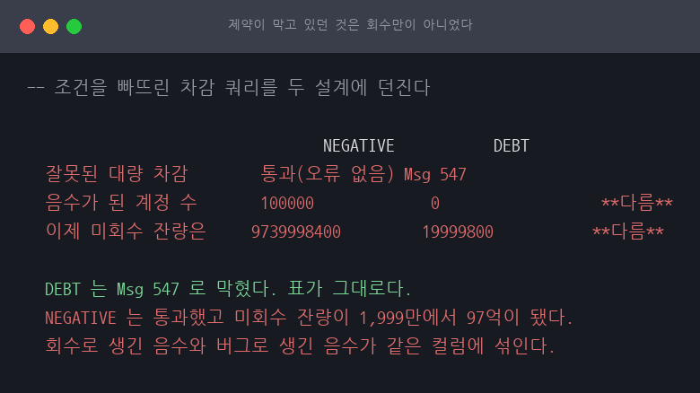
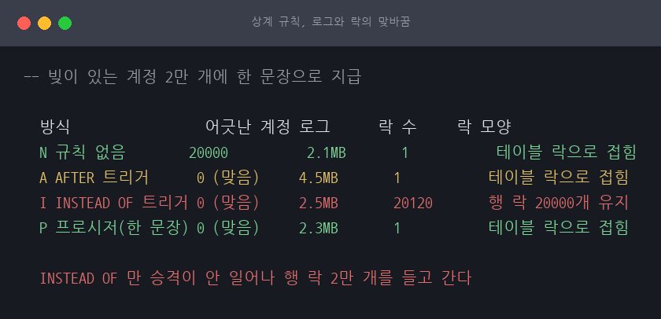
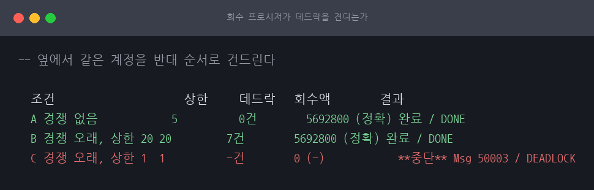
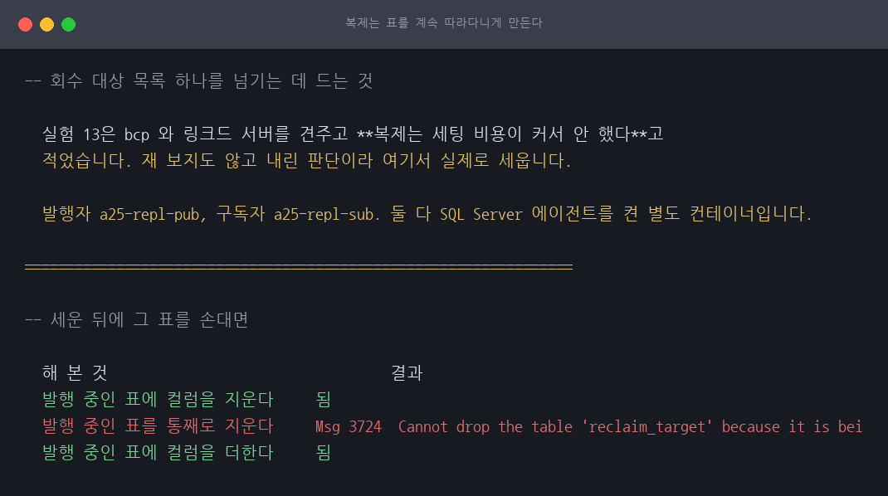

# 이미 써 버린 재화를 어떻게 회수하는가

게임 재화 회수 프로시저 / SQL Server 2022 (RTM-CU26) 16.0.4265 / 근거 등급 **E1·축소**

> 이 글은 왜 그런지를 다룹니다. 무엇을 할 것인가는 [RUNBOOK.md](RUNBOOK.md) 에 절차로
> 정리했습니다. 회수 대상을 받은 뒤 실제로 되돌리기까지의 순서입니다.
>
> 앞 단계는 [A24 재화 이상 탐지](../A24-currency-anomaly-detection/)이고,
> 배치 크기의 근거는 [A04 락 에스컬레이션](../A04-mssql-lock-escalation/)입니다.

## 1. 유명한 이유

로스트아크가 2023-06 얼음 석상 어뷰징을 처리하며 공지에 이렇게 적었습니다.
63개 계정 3,806회분을 전량 회수하되, **이미 사용한 재화는 사용 내역을 취소하거나
음수 재화를 적용**한다고. ([공식 공지 2432](https://lostark.game.onstove.com/News/Notice/Views/2432))

이 한 줄이 이 세션의 주제입니다. 회수 대상을 다 골라 놓아도 **이미 써 버린 재화는
뺄 잔액이 없습니다.** 게임 재화 표에는 보통 `CHECK (balance >= 0)` 이 붙어 있고,
그 제약이 회수를 막습니다.

국내 게임사가 회수 절차의 내부 구현을 공개한 적은 없습니다. 공지에 적힌 두 기법의
이름만 공개돼 있으므로 등급은 E1·축소입니다.

## 2. 재현

### 환경

| 항목 | 값 |
|---|---|
| 호스트 | Darwin 25.3.0 arm64, 12코어, 32GiB |
| 컨테이너 | `mcr.microsoft.com/mssql/server:2022-latest`, Developer, `cpus: 4`, `mem_limit: 6g` |
| 복구 모델 | FULL (실험 4가 로그 백업 체인을 요구) |
| 계정 | 100만 개 |
| 회수 대상 | 6만 개, 그중 2만 개는 잔액이 회수액보다 적음 |
| 회수 총액 | 1,839,974,000 |
| 배치 크기 | 4,000 (A04 의 결론) |

**시간 수치는 인용하지 않습니다.** ARM 에뮬레이션이라 절대 시간이 이 호스트의 값이
아닙니다. 회수 정확도, 승격 횟수, 감사 로그 정합성, 복원 결과를 봅니다.

### 제약이 회수를 막습니다

```
$ ./scripts/exp1-schema.sh

  계정                   1000000개
  회수 대상            60000개
  잔액이 모자란 대상 20000개
  회수 총액            1839974000

  계정 3 을 그대로 차감하면 막힙니다.
    Msg 547, Level 16, State 1, ...
```

`Msg 547` 은 CHECK 제약 위반입니다. 이미 쓴 재화를 되돌리려면 잔액이 음수가 돼야
하는데 제약이 그것을 막습니다. **제약을 없애면 정상 흐름의 방어도 함께 사라집니다.**

## 3. 두 설계

| 설계 | 방법 | 대가 |
|---|---|---|
| NEGATIVE | 제약을 빼고 잔액을 음수로 내린다 | 음수 잔액을 읽는 모든 코드가 위험해진다 |
| DEBT | 잔액은 0 에서 멈추고 못 받은 만큼을 `debt` 에 적는다 | 상계 로직을 따로 만들어야 한다 |

```
$ ./scripts/exp2-reclaim.sh

  설계     배치수 회수액        검산   승격     음수 계정 빚 계정
  NEGATIVE   15회    1839974000       일치   0회       20000개     0개
  DEBT       15회    1839974000       일치   0회       0개         20000개
```



두 설계 모두 회수 총액이 정확히 같고 검산을 통과했습니다. 배치를 4,000행으로 끊어
**승격은 한 번도 일어나지 않았습니다.** A04 에서 찾은 경계(테이블 락 6,250개)
안쪽에 머물렀다는 뜻이고, 보정이 도는 동안 다른 이용자의 조회가 안 막혔다는 뜻입니다.

감사 로그도 전부 맞습니다.

```
  감사 로그 행              60000건
  기록한 사후 잔액 = 실제 잔액 60000건
  적용액 + 빚 = 대상액    60000건
```

### 빚은 어떻게 갚히는가

```
  계정 3  획득 5000 전: 잔액/빚 0/12000  →  후: 0/7000
```

DEBT 설계는 빚을 먼저 갚는 로직을 **따로 만들어야** 합니다. 획득 경로가 여럿이면
그 전부에 같은 규칙이 들어가야 하고, 하나라도 빠지면 빚이 남습니다.

NEGATIVE 설계는 잔액이 음수라 더하기만 해도 자연히 상계됩니다. 대신 잔액이 음수인
동안 그 값을 읽는 코드를 전부 확인해야 합니다. 상점이 "잔액 부족"을 어떻게 판정하는지,
랭킹이 음수를 어떻게 정렬하는지, 통계가 합계를 어떻게 내는지.

**운영에서 고를 것은 DEBT 입니다.** 제약을 빼는 것은 되돌리기 어렵고, 그 사이에 들어온
다른 버그가 음수 잔액을 만들어도 아무도 모릅니다. 빚 컬럼은 늘어나는 일이지만
무엇이 남았는지 셀 수 있습니다.

## 4. 중간에 죽으면

배치를 쪼개면 승격을 피하는 대신 원자성을 내줍니다. 보정 전체가 한 트랜잭션이 아니라서
중간에 죽으면 앞 배치는 이미 커밋돼 있습니다.

```
$ ./scripts/exp3-restart.sh

  주입한 실패가 던져졌습니다: Msg 50001, ...
  처리된 계정         16000개
  진행 지점(last_done) 16000
  배치 상태            RUNNING
  여기까지 회수한 금액 490597000
```

같은 배치를 이어서 돌립니다.

```
  처리된 계정         60000개
  두 번 처리된 계정 0개
  빠진 계정            0개
  회수 총액            1839974000
  배치 상태            DONE
```



**두 번 뺀 계정도, 빠진 계정도 없습니다.** 진행 지점을 배치와 같은 트랜잭션에서
옮긴 것이 여기서 값을 합니다. 밖에서 옮겼다면 커밋과 기록 사이에 죽었을 때 같은
배치를 두 번 돌아 이중 회수가 됩니다.

### 보정 중에 이용자가 재화를 쓰면

```
  대상 계정                  60000
  회수해야 할 금액        85000
  보정 전 잔액              73000
  감사 로그의 전/후 잔액 68000 → 0
  감사 로그의 적용액/빚 68000/17000
  최종 잔액/빚              0/17000

  회수액이 대상과 다른 계정 0개
```

동시 사용이 있어도 회수 금액은 대상과 정확히 같았습니다. 갱신을 `balance = balance - amount`
한 문장에 둔 덕입니다. 값을 먼저 읽어 애플리케이션에서 빼고 써 넣었다면 그 사이의
사용이 덮여 사라집니다.

감사 로그의 사후 잔액(0)과 최종 잔액(0)이 같아 보이지만, 로그는 보정 시점의 값이고
최종 잔액은 그 뒤 사용까지 반영된 값입니다. 이 계정은 우연히 같았습니다. 다른
계정에서는 다를 수 있고, 그것이 회수가 샌 것과 다르다는 점을 구분해야 합니다.

## 5. 보정 자체가 잘못됐다면

A24 의 통계 이탈이 정상 헤비 이용자 40개를 함께 지목했습니다. 그것을 그대로 회수했다면
되돌려야 합니다.

```
$ ./scripts/exp4-undo.sh

  보정 전 잔액 합계   67999983000
  BEGIN TRAN before_reclaim WITH MARK '보정 직전'
  잘못 포함된 정상 계정 200개
  잘못된 보정 뒤 잔액 합계 66398009200

  복원 상태              ONLINE
  복원본의 잔액 합계 67999983000
```



`RESTORE LOG ... WITH STOPATMARK = 'before_reclaim'` 으로 표시 지점까지만 복원하니
잔액 합계가 보정 전과 정확히 같아졌습니다.

## 6. 조사 DB 에서 운영 DB 로 넘기기

여기까지의 회수 대상은 이 세션이 직접 만든 것이었습니다. 실제로는 [A24](../A24-currency-anomaly-detection/)
가 조사 DB 에서 뽑아 줍니다. 그런데 **조사 DB 와 운영 DB 는 다른 서버입니다.** 로그는
쓰기만 하는 대용량이라 따로 두고, 운영 표에는 조사 쿼리를 못 던집니다.

그래서 목록을 옮겨야 하고, 옮기다 새면 그대로 사고가 됩니다. 덜 옮기면 미회수,
잘못 옮기면 오회수입니다.

```
$ ./scripts/exp5-handoff.sh

  조사 DB 원본       60건 / 360000 / 체크섬 15844864

  조건                       옮겨진 건수 합계         검증     검증을 건너뛰면
  A 정상 이관              60           360000         통과     정상 회수 360000
  B 파일이 절반에서 잘림 30           181800         **막음** **181800 회수(원본 360000)**
  C 없는 계정이 섞임    61           410000         **막음** 검산이 잡음
```



**A 는 실제로 이어졌습니다.** A24 의 조사 DB 에서 `bcp` 로 뽑아 운영 DB 에 넣고, 그
목록으로 회수까지 돌려 360,000 이 정확히 회수됐습니다. 형식만 맞춘 것이 아닙니다.

**B 와 C 가 잡히는 자리가 다른 것이 이 실험의 요점입니다.**

B 는 파일이 절반에서 잘렸습니다. `bcp` 는 오류를 내지 않고 넘어간 만큼 정상으로
넣습니다. 그리고 **회수 프로시저의 검산도 이것을 못 잡습니다.** 검산은 옮겨진 목록을
기준으로 대상 합계와 회수 합계를 견주는데 그 둘은 서로 맞기 때문입니다. 30건을 받아
30건을 회수했으니 프로시저 입장에서는 성공입니다. 절반이 사라진 것은 **원본과 대조할
때만** 드러납니다.

C 는 운영 DB 에 없는 계정이 섞인 경우입니다. 조인에서 못 찾아 조용히 건너뛰는데,
이것은 검산이 잡습니다. 대상 합계와 회수 합계가 달라 배치가 `MISMATCH` 로 끝납니다.

그래서 방어선이 둘 필요합니다. **덜 옮겨진 것은 안에서 볼 수 없고, 잘못 옮겨진 것은
밖에서 볼 수 없습니다.**

| 방어선 | 무엇을 잡나 |
|---|---|
| 이관 직후 원본과 사본의 건수·합계·체크섬 대조 | 덜 옮겨진 것 (B). 유일한 자리 |
| 회수 프로시저의 대상 합계 대 회수 합계 검산 | 잘못 옮겨진 것 (C) |

## 7. 회수에 승인을 붙인다

여기까지의 프로시저는 실행하면 바로 돕니다. 회수는 이용자 자산을 줄이는 작업인데
한 사람이 마음먹으면 그대로 나갑니다. [F02](../F02-samsung-ghost-shares/)에서 착오
입고가 제약 없이 커밋된 것과 같은 자리입니다.

승인 대기를 붙이고 넷을 확인했습니다.

```
$ ./scripts/exp6-approval.sh

  조건                   결과                                 회수액
  A 요청→승인→실행 통과                                 360000
  B 승인 없이 실행   **거부 — 승인되지 않은 요청** 0
  C 요청자가 자기 승인 **거부 — 자기 요청은 자기가 승인 못 함** 0
  D 승인 뒤 대상 추가 **거부 — 승인 뒤 대상이 바뀜** 0
```

```
  maker 가 승인 시도                  **거부 — 권한 없음**
  checker 가 요청 시도                **거부 — 권한 없음**
  maker 가 게이트를 건너뛰고 직접 실행 **거부 — 권한 없음**
```



**막는 층이 둘로 나뉩니다.** `maker` 가 승인을 시도하는 것은 권한이 막고(`Msg 229`),
둘 다 할 수 있는 계정이 자기 요청을 승인하는 것은 로직이 막습니다(`Msg 50022`).
역할 분리가 된 조직이면 권한만으로 충분해 보이지만, 한 사람이 둘 다 맡는 조직에서는
로직만 남습니다. 그리고 원래 프로시저에 `DENY EXECUTE` 를 안 걸면 게이트는 우회하면
그만입니다.

**D 가 이 실험의 요점입니다.** 승인만 붙이면 거기가 뚫립니다. 승인을 받아 둔 뒤 회수
대상 표에 행을 하나 더 넣으면 승인은 그대로 유효한 채로 다른 목록이 실행됩니다.
승인은 "이 목록을 회수해도 된다"는 뜻이지 "언제든 회수해도 된다"는 뜻이 아닙니다.

그래서 승인 시점의 대상 지문(건수·합계·체크섬)을 저장해 두고 실행할 때 다시 대조합니다.
**6절에서 이관 검증에 쓴 것과 같은 지문입니다.** 한 번은 서버를 건너올 때, 한 번은
시간을 건너올 때 씁니다.

## 8. 운영 DB 를 안 되돌리고 회수만 취소한다

5절에서 잘못된 보정을 표시 지점으로 복원해 되돌렸습니다. 그 복원은 새 데이터베이스에
했고, "못 한 것"에 **"실제로는 운영 데이터베이스를 되돌려야 한다"**고 적었습니다.
그 서술이 틀렸습니다.

**운영 DB 를 통째로 되돌리는 것은 하지 못한 것이 아니라 하면 안 되는 것입니다.**
보정 이후의 정상 활동이 전부 사라집니다.

```
$ ./scripts/exp7-restore-undo.sh

  잘못 포함된 정상 계정 600개
  잘못된 회수 뒤 잔액 합계 67994290200
  그 뒤 정상 활동으로 늘어난 몫 300000000

  되돌린 뒤 잔액 합계    68299623000
  정상 회수분 (그대로 둔다) 360000
  기대값 (보정 전 - 정상 회수 + 정상 활동) 68299623000
```

실제 절차는 복원본을 옆에 세우고 거기서 원래 값을 읽어 **되돌리는 보정을 한 번 더
도는 것**입니다. 잘못 회수한 계정만 골라 되돌리고, 정상 회수분과 그 뒤의 정상 활동은
그대로 둡니다. 되돌리기도 보정이므로 같은 규칙을 지킵니다. 배치를 쪼개고, 감사 로그를
남기고, 끝나면 검산합니다.

표시(`WITH MARK`)의 값은 여기서도 같습니다. 복원본을 어느 지점까지 되돌릴지 정확히
가리키기 위해서입니다. 운영 DB 는 그대로 두고 복원본만 그 지점으로 갑니다.

> 검산식을 한 번 틀렸습니다. 기대값을 (보정 전 + 정상 활동)으로 잡았다가 360,000이
> 어긋났는데, 그것은 **제대로 회수한 몫**이라 되돌리면 안 되는 것이었습니다. 절차가
> 아니라 검산식이 틀렸습니다. 되돌리기에서는 "무엇을 되돌리고 무엇을 두는가"를 먼저
> 정해야 검산도 세울 수 있습니다.

## 9. 상계 규칙을 어디에 둘 것인가

3절은 DEBT 설계에서 "획득하면 빚을 먼저 갚아야 한다"는 규칙을 한 계정에 손으로 흉내
내고, **"획득 경로가 여럿이면 그 전부에 같은 규칙이 들어가야 한다"**고 적었습니다.
그러고는 경로를 여럿 만들어 보지 않았습니다. 그것이 DEBT 의 진짜 비용이라고 적어
놓고 그 비용을 안 잰 것입니다.

그리고 그 문장에는 숨은 전제가 있습니다. **규칙이 애플리케이션에 있다**는 전제입니다.
규칙을 DB 에 두면 경로가 몇 개든 한 곳입니다. 네 가지를 견줍니다.

빚이 있는 계정 5,000개에 각각 600 을 지급합니다. 지급 경로는 넷이고 경로마다 계정을
나눠 **한 문장으로 여러 행을 갱신**합니다. 실제 지급이 그런 모양입니다.

```
$ ./scripts/exp8-offset-rule.sh

  조건                   남은 빚     잔액 합계  어긋난 계정 판정
  A 앱 경로마다       1375000        1125000        1250개        **1250개 어긋남**
  B 트리거(행 단위)  3248200        2998200        4996개        **4996개 어긋남**
  C 트리거(집합)      1000000        750000         0개           맞음
  D 프로시저 강제    1000000        750000         0개           맞음

  기대값                1000000        750000
```



**A 는 경로 하나가 규칙을 빠뜨렸고 그 몫 1,250 계정이 그대로 남았습니다.** 오류가
안 납니다. 잔액은 늘었고 빚도 그대로라 이용자는 아무 이상을 못 느낍니다.

### 규칙을 DB 로 옮겨도 틀릴 수 있습니다

**B 가 이 실험에서 제일 위험합니다.** 규칙을 DB 한 곳으로 옮겼는데 5,000개 중
4,996개가 틀렸습니다. 맞은 4개는 경로마다 한 개씩입니다.

```sql
-- 이렇게 짜면 안 됩니다
DECLARE @acc INT, @gain BIGINT;
SELECT @acc = i.account_id, @gain = i.balance - d.balance
  FROM inserted i JOIN deleted d ON d.account_id = i.account_id;
UPDATE offset_test SET ... WHERE account_id = @acc;
```

트리거는 **문장마다 한 번** 돌고 `inserted` 에는 그 문장이 건드린 행이 전부 들어옵니다.
그것을 변수에 담으면 마지막 한 행만 남습니다. **오류도 경고도 없습니다.**
한 행씩 지급하는 동안에는 멀쩡하다가 지급을 묶는 순간부터 틀리기 시작합니다.

```sql
-- 변수에 담지 않고 조인합니다. 행이 몇 개든 같습니다
UPDATE t
   SET debt    = t.debt    - CASE WHEN t.debt >= g.gain THEN g.gain ELSE t.debt END,
       balance = t.balance - CASE WHEN t.debt >= g.gain THEN g.gain ELSE t.debt END
  FROM offset_test t
  JOIN (SELECT i.account_id, i.balance - d.balance AS gain
          FROM inserted i JOIN deleted d ON d.account_id = i.account_id
         WHERE i.balance > d.balance) g ON g.account_id = t.account_id
 WHERE t.debt > 0;
```

C 와 D 는 맞습니다. 차이는 **빠뜨릴 수 있는가**입니다. C 는 규칙이 한 곳이지만 표를
직접 고치는 경로가 여전히 열려 있고, D 는 직접 갱신을 막아 우회할 자리 자체가 없습니다.

```
  D 에서 앱 계정이 표를 직접 고치려고 하면 이렇게 막힙니다.
    Msg 229  The UPDATE permission was denied on the object 'offset_test', database 'lostark_ops', schema 'dbo'.
```

그래서 3절의 "DEBT 의 진짜 비용은 경로마다 규칙을 넣는 것"이라는 문장은 **절반만
맞습니다.** 규칙을 DB 에 두면 경로 수와 무관해집니다. 진짜 비용은 경로 수가 아니라
**그 규칙을 집합으로 짜야 한다는 것**이고, 그것을 놓치면 앱에 흩어 놓은 것보다 더
조용히 틀립니다.

## 10. 음수 잔액이 깨뜨리는 것

3절은 NEGATIVE 설계를 "제약을 빼야 한다. 상계는 공짜지만 음수 잔액을 읽는 모든 코드가
위험"이라고 적고 넘어갔습니다. **위험하다고만 적고 무엇이 어떻게 깨지는지는 안 봤고**,
못 한 것에는 "애플리케이션 계층이라 다루지 않았다"고 썼습니다.

그 서술이 좁았습니다. **깨지는 것의 상당수가 DB 안에 있습니다.** 같은 회수를 두
설계에 똑같이 적용하고 넷을 봅니다.

```
$ ./scripts/exp9-negative-risk.sh

  실제로 뺀 금액           80000000           60000200           **다름**
  미회수 잔량               19999800           19999800           같음
  재화 보유 계정 수       66667              66667              같음
  평균 보유량(전체)       2600               2800               **다름**
  유통 중인 재화 총량    260001600          280001400          **다름**
```



깨지지 않는 것부터 적습니다. 회수 대상액은 두 설계가 같고(8,000만), 보유 계정 수처럼
0 보다 큰지만 보는 지표도 같습니다. 미회수 잔량도 평시에는 양쪽 다 셉니다.

**유통 중인 재화 총량이 다릅니다.** 음수가 양수를 깎아 NEGATIVE 는 2억 6,000만,
DEBT 는 2억 8,000만으로 나옵니다. 실제로 세상에 나가 있는 재화는 DEBT 쪽 숫자입니다.
이 숫자를 보고 이벤트 지급량을 정하는 운영이라면 여기서 판단이 어긋납니다.

### 제약이 막고 있던 것은 회수만이 아니었습니다

회수와 무관한 버그를 하나 던집니다. 차감 쿼리에서 `WHERE` 를 빠뜨려 모든 계정에서
재화를 빼는, 흔한 사고입니다.

```
  잘못된 대량 차감        통과(오류 없음) Msg 547

  음수가 된 계정 수       100000             0                  **다름**
  이제 미회수 잔량은     9739998400         19999800           **다름**
```

DEBT 는 `Msg 547` 로 막혔고 표가 그대로입니다. **제약이 버그를 잡았습니다.**
NEGATIVE 는 통과했고, 미회수 잔량이 1,999만에서 **97억으로** 뛰었습니다.
회수로 생긴 음수와 버그로 생긴 음수가 같은 컬럼에 섞여 구분이 안 됩니다.
얼마를 더 받아야 하는지 아무도 모릅니다.

**제약은 비용이 아니라 마지막 방어선입니다.** 회수 한 번을 편하게 하려고 그것을 빼면
그 뒤로 들어오는 모든 실수가 같은 구멍으로 지나갑니다. 그리고 그 구멍은 **다시 닫기
어렵습니다.** 이미 음수가 들어간 표에는 `CHECK` 제약을 도로 붙일 수 없습니다.

3절의 "운영에서 고를 것은 DEBT"라는 결론이 여기서 근거를 얻습니다. 그때는 판단이었고
지금은 측정입니다.

## 11. 트리거의 값과 대가

9절은 상계 규칙을 DB 에 두는 것이 맞다는 결론을 냈지만 **얼마나 드는지**를 안 봤습니다.
같은 부하로 넷을 견줍니다.

```
$ ./scripts/exp10-trigger-cost.sh

  방식                 어긋난 계정 로그      락 수     락 모양
  N 규칙 없음        20000          2.1MB       1           테이블 락으로 접힘
  A AFTER 트리거      0 (맞음)     4.5MB       1           테이블 락으로 접힘
  I INSTEAD OF 트리거 0 (맞음)     2.5MB       20120       행 락 20000개 유지
  P 프로시저(한 문장) 0 (맞음)     2.3MB       1           테이블 락으로 접힘
```



**AFTER 는 같은 행을 두 번 써 로그가 2.1배입니다.** 잔액을 늘리는 갱신과 트리거가
되돌리는 갱신이 각각 로그를 남깁니다.

**그런데 락에서 뒤집힙니다.** 로그가 제일 적은 `INSTEAD OF` 가 행 락 2만 개를 그대로
들고 가고 나머지 셋은 승격이 일어나 테이블 락으로 접혔습니다. 같은 2만 행을 갱신하는데
경로에 따라 접히고 안 접힙니다. 운영에서 더 무서운 쪽은 이쪽입니다. 로그는 디스크를
더 쓸 뿐이고 락 2만 개는 그 행들을 끝까지 붙잡습니다.

### 중간 상태는 있고, 보이는 것은 NOLOCK 뿐입니다

`AFTER` 는 잔액을 먼저 늘린 뒤 되돌립니다. 그 값이 **존재하는가**와 다른 세션에
**보이는가**는 다른 질문입니다. 존재는 경합으로 재면 안 되므로 트리거가 자기 안에서
그 순간의 표를 찍게 했습니다.

```
  계정       중간(잔액/빚)     최종(잔액/빚)
  1 | 600 / 300   ->   300 / 0
  2 | 600 / 1000   ->   0 / 400
  3 | 600 / 300   ->   300 / 0
```

```
  NOLOCK 으로 읽으면        중간 상태 100건
  READ COMMITTED 로 읽으면   대기 유형 LCK_M_S
```

`READ COMMITTED` 는 그 행의 배타 락에 막혀 최종값만 읽습니다.
**중간 상태의 위험은 트리거가 아니라 NOLOCK 이 만듭니다.**

## 12. 승인을 우회할 수 있는가

7절은 승인을 **받게** 만들었습니다. 여기서는 그 승인을 **우회할 수 있는지** 봅니다.
둘은 다른 일입니다.

```
$ ./scripts/exp11-approval-hardening.sh

  승인 기록을 지운다             maker        막힘       Msg 229  The DELETE permission was denied on the object 'approval_log', d
  승인자를 바꿔치기한다        maker        막힘       Msg 229  The UPDATE permission was denied on the object 'approval_log', d
  요청 금액을 승인 뒤에 키운다 maker        막힘       Msg 229  The UPDATE permission was denied on the object 'approval_req', d
  승인 상태를 직접 APPROVED 로   maker        막힘       Msg 229  The UPDATE permission was denied on the object 'approval_req', d
  이력을 읽는 것은 된다         maker        통과         1
```

표에 직접 쓰는 길은 전부 막힙니다. 아무에게도 `UPDATE`·`DELETE` 를 안 줬고 프로시저가
`EXECUTE AS OWNER` 로 자기 권한으로 씁니다. 읽기는 열어 둡니다. 이력을 못 읽으면
감사가 안 됩니다.

```
  한 명만 승인하고 실행         checker1     통과
    그 상태로 실행하면           maker        막힘       Msg 50064  not enough approvals
  같은 사람이 또 승인            checker1     막힘       Msg 2627  Violation of UNIQUE KEY constraint 'UQ_approval'. Cannot insert
  두 번째 승인자가 승인         checker2     통과
    이제 실행하면                  maker        통과         EXECUTED
```

**한 사람이 두 번 눌러 정족수를 채우는 길을 유일 제약 하나가 막습니다.**
로직이 아니라 제약으로 막는 편이 낫습니다. 로직은 다른 경로가 생기면 빠뜨릴 수
있지만 제약은 표에 붙어 있습니다.

```
  만료된 요청을 승인             checker1     막힘       Msg 50062  approval expired
  승인은 받았고 그 뒤 만료됨  maker        막힘       Msg 50065  approval expired at execution
```

**승인 시점과 실행 시점 둘 다 유효 기간을 봅니다.** 승인할 때만 보면 그 승인이
영원히 유효해집니다. 사고 대응은 급해서 승인을 미리 받아 두는 일이 흔한데,
그 승인이 사흘 뒤에도 통하면 그것은 승인이 아니라 백지 수표입니다.

되돌리기도 같은 표에 같은 모양으로 올려 승인·정족수·유효 기간이 그대로 걸립니다.
**되돌리기 전용 경로를 따로 파면 그 경로에 같은 방어를 다시 만들어야 하고,
9절에서 본 대로 같은 규칙을 두 곳에 두면 한 곳을 빠뜨립니다.**

## 13. 회수 프로시저가 데드락을 견디는가

[A04 실험 11](../A04-mssql-lock-escalation/)에서 재시도 루프와 `DEADLOCK_PRIORITY LOW`
를 검증해 놓고 **이 프로시저에 옮기지 않은 채** 두고 있었습니다. 다른 데서 검증한 것을
옮기지 않으면 검증 안 한 것과 같습니다. `reclaim.sql` 에 넣고 확인합니다.

```
$ ./scripts/exp12-reclaim-retry.sh

  조건                     상한     데드락   회수액        결과
  A 경쟁 없음            5          0건        5692800 (정확) 완료 / DONE
  B 경쟁 오래, 상한 20 20         7건        5692800 (정확) 완료 / DONE
  C 경쟁 오래, 상한 1  1          -건        0 (-)            **중단** Msg 50003 / DEADLOCK
```



**데드락 7건을 겪고도 끝까지 돌고 회수액이 정확합니다.** 죽은 배치는 통째로 되돌아가고
진행 지점도 함께 되돌아가므로 재시도가 그 배치부터 다시 하면 중복도 누락도 안 납니다.

상한을 1 로 낮추면 상한에 닿고 배치를 `DEADLOCK` 으로 남깁니다. A04 에서는 상한 5회에
최대 2회로 끝나 이 길을 못 밟았습니다. **조용히 넘어가지 않는 것이 요점입니다.**
재시도가 실패한 배치를 그냥 건너뛰면 검산에서만 어긋나고, 그때는 어느 배치가 빠졌는지
모릅니다.

> 회수액을 잔액 차이로 재면 안 됩니다. 경쟁 세션이 같은 계정의 잔액을 건드리기
> 때문입니다. 감사 로그의 적용액과 빚을 더해야 회수한 몫만 나옵니다(4절과 같은 자리).

## 14. 이관의 두 구멍

6절은 bcp 하나만 봤습니다. 링크드 서버를 견주고, **옮기는 동안 원본이 바뀌는 경우**를
봅니다.

```
$ ./scripts/exp13-handoff.sh

  링크드 서버(당겨오기) 5000       30000000       일치     파일이 안 남는다
  bcp(파일 경유)           5000       30000000       일치     파일이 남는다
```

둘 다 지문이 일치합니다. 이관 방법 자체는 둘 다 됩니다. **갈리는 것은 남는 것입니다.**
링크드 서버는 파일이 안 남는 대신 두 서버 사이에 경로가 남고, bcp 는 경로가 안 남는
대신 파일이 남습니다. 회수 대상 목록은 이용자 식별자와 금액이 담긴 파일이므로
어느 쪽을 쓰든 **이관이 끝난 뒤 치우는 절차**가 있어야 합니다.

```
  A 그냥 옮긴다           5300       31800000       **어긋남** 원본이 자라는 중
  B 스냅샷을 뜨고 옮긴다 5000       30000000       일치     스냅샷 기준
```


**A 는 어긋납니다.** 옮기는 동안 원본이 자랐고 사본은 시작 시점의 것도 끝 시점의 것도
아닙니다. 더 나쁜 것은 **행 수와 합계만 보면 그럴듯해 보인다**는 것입니다. 둘 다
원본보다 작을 뿐 이상한 값이 아니고, 지문을 대조해야 드러납니다.

**스냅샷을 뜨고 그것을 옮기면 맞습니다.** 6절의 지문 대조가 여기서 의미를 갖습니다.
**대조할 기준이 움직이지 않아야 대조가 성립합니다.**

## 15. 음수 잔액을 앱이 못 보게 막을 수 있는가

10절은 음수 잔액이 DB 안에서 무엇을 깨뜨리는지 재고 앱 계층은 랩 밖이라고 적었습니다.
**질문이 틀렸습니다.** 실무의 답은 앱 코드를 다 고치는 것이 아니라 **앱이 음수를 볼 수
없게 하는 것**이고, 그것은 DB 쪽 일입니다.

앱이 기저 표가 아니라 뷰를 읽게 하고, 뷰가 음수를 0 으로 접어 `debt` 로 나눠 내놓습니다.

```
$ ./scripts/exp14-negative-shield.sh

  기저 표를 직접 읽는다 기저 표       Msg 229            막혀야 한다
  뷰로 읽는다               보호 뷰       100000             되어야 한다
```

기저 표는 막히고 뷰만 열립니다. 11절의 프로시저 강제와 같은 방법입니다.

```
  가장 낮은 잔액           기저 표       -600               음수다
  가장 낮은 잔액           보호 뷰       0                  0 이어야 한다
  유통 중인 재화 총량    기저 표       260001600          음수가 깎는다
  유통 중인 재화 총량    보호 뷰       280001400          실제 유통량
  미회수 잔량               보호 뷰       19999800           따로 셀 수 있다
```

**뷰를 통과하면 10절에서 갈리던 지표가 DEBT 설계와 같아집니다.** 앱은 음수를 못 보고,
유통량은 실제 값이 나오고, 미회수 잔량은 따로 셉니다.

### 그런데 뷰가 못 막는 것이 남습니다

```
  조건 빠뜨린 대량 차감 기저 표       통과(오류 없음) 제약이 없다
  그 뒤 미회수 잔량       보호 뷰       9739998400         버그분이 섞였다
```

**뷰는 표시를 고치지 무결성을 지키지 않습니다.** 잘못된 차감을 막지 못하고, 그 결과로
생긴 음수도 회수로 생긴 음수와 똑같이 `debt` 로 보여 줍니다. 같은 차감을 DEBT 설계에
던지면 제약이 잡습니다.

```
  같은 대량 차감           기저 표       Msg 547            제약이 막는다
  그 뒤 미회수 잔량       보호 뷰       19999800           회수분만 남는다
```

그리고 뷰로 `balance` 와 `debt` 를 나눠 내주는 순간 **DEBT 설계와 하는 일이 같아집니다.**
같은 결과를 제약 없이 얻는 셈이라 애초에 컬럼을 나누는 쪽이 낫습니다.
**10절의 결론이 뒤집히지 않고 오히려 좁혀집니다.**

## 16. 복제로 넘기면 얼마나 드는가

14절은 bcp 와 링크드 서버를 견주고 **복제는 세팅 비용이 커서 안 했다**고 적었습니다.
재 보지도 않고 내린 판단이라 실제로 세웠습니다.

```
$ ./scripts/exp15-replication.sh

  #   한 일                                      결과
  1   발행 DB 와 대상 표를 만든다        됨
  2   구독 DB 를 만든다                      됨
  3   회수 대상 표를 채운다               됨
  4   배포자를 세운다 (sp_adddistributor)   됨
  5   배포 DB 를 만든다 (sp_adddistributiondb) 됨
  6   발행자를 배포자에 등록 (sp_adddistpublisher) 됨
  7   발행 DB 에 복제를 켠다 (sp_replicationdboption) 됨
  8   발행 항목을 만든다 (sp_addpublication) 됨
  9   스냅샷 에이전트를 붙인다 (sp_addpublication_snapshot) 됨
  10  표를 발행 목록에 넣는다 (sp_addarticle) 됨
  11  구독을 만든다 (sp_addsubscription)     됨
  12  배포 에이전트를 붙인다 (sp_addpushsubscription_agent) 됨
  13  배포 에이전트에 -EncryptionLevel 0 을 붙인다 됨
```



**13단계입니다.** 그 앞에 이미 든 비용도 있습니다. 복제는 SQL Server 에이전트가 있어야
도는데 이 이미지는 기본으로 꺼져 있어 **컨테이너를 다시 만들어야** 하고, 본체를 다시
만들면 데이터가 날아갑니다. 그래서 인스턴스를 둘 더 띄웠고, Docker VM 메모리가 모자라
**다른 컨테이너를 전부 내려야** 했습니다. 발행자는 2g 로는 `internal` 리소스 풀이
모자라 죽어 4g 를 줬습니다.

**그리고 전달까지는 못 갔습니다.** 스냅샷은 100% 생성됐는데 배포 에이전트가
`The process could not connect to Subscriber` 로 실패합니다. 원인은 자체 서명
인증서입니다. `sqlcmd` 는 `-C` 로 넘기지만 에이전트에는 그 옵션이 없고,
`-EncryptionLevel 0` 으로도 안 넘어갔습니다.

**그 실패 자체가 이 실험의 답입니다.** 어디서 막혔는지 알아내는 데도
`distribution.dbo.MSdistribution_history` 를 따로 봐야 했습니다. 단계가 많으면
막힌 곳을 찾는 것도 일이고, 사고 중에 그러고 있을 수는 없습니다.

### 세운 뒤에 무엇이 묶이는가

```
  해 본 것                                  결과
  발행 중인 표에 컬럼을 지운다     됨
  발행 중인 표를 통째로 지운다     Msg 3724  Cannot drop the table 'reclaim_target' because it is bei
  발행 중인 표에 컬럼을 더한다     됨
```

**`Msg 3724` 가 결정적입니다.** 회수 대상 목록은 사고 때 한 번 쓰고 버리는 표인데,
복제를 걸면 **영구히 발행 대상**이 되어 치우려면 발행부터 내려야 합니다. 실제로 다음
회차에서 그 표가 안 지워져 `Msg 213` 으로 실험이 죽었습니다.

```
  실험 13은 bcp 와 링크드 서버를 견주고 **복제는 세팅 비용이 커서 안 했다**고
  적었습니다. 재 보지도 않고 내린 판단이라 여기서 실제로 세웁니다.

  발행자 a25-repl-pub, 구독자 a25-repl-sub. 둘 다 SQL Server 에이전트를 켠 별도 컨테이너입니다.

==================================================================
```

**복제가 일회성 이관에 안 맞는 이유는 "세팅이 번거로워서"가 아니라 도구의 목적이 다르기
때문입니다.** 복제는 표를 계속 따라다니게 만드는 것이고, 이관은 한 번 옮기고 끝내는
것입니다. 복제를 쓸 자리는 조사 DB 자체를 운영에서 계속 떠먹이는 구성이고, 그때는
회수 대상이 조사 DB 안에서 만들어지므로 **이관이라는 단계 자체가 없어집니다.**

## 17. 예상과 달랐던 점

### 규칙을 한 곳에 모으면 안전해질 줄 알았습니다

상계 규칙이 앱 경로마다 흩어지는 것이 문제라고 적었으므로, DB 트리거로 옮기면 그
문제가 사라질 것이라고 예상했습니다. 실제로는 **앱에 흩어 놨을 때보다 더 많이
틀렸습니다.** A 는 1,250개, B 는 4,996개입니다.

흩어진 규칙은 하나가 빠져도 나머지는 맞습니다. 한 곳에 모은 규칙이 틀리면 전부
틀립니다. **한 곳에 모으는 것 자체가 안전을 주지는 않습니다.** 그 한 곳이 맞아야
합니다.

### 표시의 이점은 시각이 안 통해서가 아니었습니다

A23 에서 네 엔진 모두 벽시계로 지점을 가리키면 경계에서 샌다는 것을 확인했기 때문에,
이번에도 시각 복원이 실패할 것이라고 예상했습니다. 실제로 첫 실행에서 시각 복원이
`RESTORING` 에 남았습니다.

**그런데 그것은 제 버그였습니다.** `msdb.dbo.logmarkhistory` 에서 읽은 시각을 셸
헬퍼가 처리하면서 날짜와 시간 사이의 공백까지 지웠습니다. `2026-08-07 05:21:04.980`
이 `2026-08-0705:21:04.980` 이 되어 `Msg 3217 Invalid value specified for STOPAT`
로 죽은 것입니다. 공백을 살리자 시각으로도 정확히 같은 결과가 나왔습니다.

그대로 뒀으면 "SQL Server 는 시각으로 못 되돌린다"는 틀린 결론을 엔진에 뒤집어씌울
뻔했습니다. 실제 이점은 다른 데 있습니다. **표시는 그 지점의 시각을 정확히 알려
줍니다.** 표시가 없으면 사고 뒤에 "보정을 몇 시 몇 분에 시작했더라"를 로그에서
어림해야 하고, 초 단위 반올림 때문에 같은 초의 다른 커밋이 함께 딸려 옵니다.

### 원자성을 내주는 것이 생각보다 안전했습니다

배치를 쪼개면 중간에 죽었을 때 앞 배치가 남는다는 것이 처음에는 큰 약점으로 보였습니다.
그런데 진행 지점을 배치와 같은 트랜잭션에 두자 이어서 도는 것이 정확해졌습니다.
전체 원자성이 없어도 **"어디까지 했는지 정확히 안다"** 면 재시작으로 복구됩니다.

전체를 한 트랜잭션으로 묶는 쪽이 오히려 위험합니다. 그 트랜잭션이 도는 내내 락이
누적돼 승격하고, 실패하면 몇십 분치 작업이 통째로 롤백됩니다.

### 감사 로그의 사후 잔액과 현재 잔액은 다를 수 있습니다

동시성 실험에서 로그의 사후 잔액과 실제 잔액이 다른 계정이 나올 수 있습니다. 처음에는
회수가 샌 줄 알았는데, 보정 뒤에 이용자가 더 쓴 것이 최종 잔액에만 반영된 것이었습니다.
**감사 로그는 그 시점의 사진이지 현재 상태가 아닙니다.** 둘을 같다고 검사하는 확인
절차를 두면 정상인 경우에도 경보가 울립니다.

## 18. 표준 처방

1. **회수는 프로시저로 만든다.** 임시 쿼리로 돌리면 어디까지 했는지, 무엇을 뺐는지가
   안 남는다.
2. **배치는 5,000행 미만, 배치마다 커밋.** 근거는 [A04](../A04-mssql-lock-escalation/).
   프로시저가 `@chunk >= 5000` 을 아예 거부하게 두었다. 다만 **갱신 컬럼에 보조 인덱스가
   붙어 있으면 2,000 이하로 내려야 한다.** A04 실험 6에서 경계가 6,230행에서 2,907행으로
   내려갔다. 이 세션의 `account_currency` 는 보조 인덱스가 없어 4,000 이 안전했다.
3. **진행 지점을 배치와 같은 트랜잭션에서 옮긴다.** 밖에서 옮기면 이중 회수가 생긴다.
4. **계정마다 전후 값을 남긴다.** 이의 제기가 오면 그 기록이 근거가 된다.
   적용액과 빚을 나눠 적어야 `적용액 + 빚 = 대상액` 을 검산할 수 있다.
5. **잔액이 모자란 계정은 빚 컬럼으로 처리한다.** 제약을 빼는 것은 마지막 수단이다.
6. **보정 직전에 `BEGIN TRAN ... WITH MARK` 로 표시를 남긴다.** 복구 모델 FULL 과
   로그 백업 체인이 전제다.
7. **회수는 승인을 받고 돈다.** 요청자와 승인자를 권한으로 나누고, 자기 승인은 로직으로
   막고, 원래 프로시저에는 `DENY EXECUTE` 를 건다. **승인 시점의 대상 지문을 저장해
   실행할 때 대조한다.** 승인 뒤 목록이 바뀌면 그 승인은 다른 것에 대한 승인이다.
8. **상계 규칙은 DB 에 두고 집합으로 짠다.** 트리거라면 `inserted`·`deleted` 를 변수에
   담지 말고 조인한다. 변수에 담으면 여러 행을 한 번에 갱신할 때 마지막 한 행만
   처리하고 **오류 없이** 나머지를 놓친다. 가능하면 표를 직접 못 고치게 하고 프로시저만
   연다.
9. **상계 규칙은 프로시저에 두는 것이 제일 싸다.** 지급 경로를 통제할 수 있으면
   그렇게 한다. 통제 못 하면 `AFTER` 트리거를 쓰고 로그 2배를 감수한다.
   `INSTEAD OF` 는 로그가 싸 보이지만 행 락이 안 접히고 그 표의 모든 갱신을 떠안는다.
10. **회수 프로시저 안에서 `SET DEADLOCK_PRIORITY LOW`.** 재시도는 배치 트랜잭션
   밖에 두고 1205 만 재시도한다. 상한에 닿으면 배치 상태에 남기고 던진다.
11. **이관은 스냅샷을 뜨고 그것을 옮긴다.** 지문도 스냅샷 기준으로 만든다.
   끝나면 파일이든 링크드 서버 경로든 치운다.
12. **`CHECK (balance >= 0)` 를 빼지 않는다.** 그 제약은 회수만 막고 있는 것이 아니라
   조건을 빠뜨린 차감 쿼리도 막고 있다. 한 번 음수가 들어간 표에는 다시 붙일 수 없다.
13. **끝나면 검산한다.** 회수 합계가 대상 합계와 다르면 배치를 실패로 남기고 던진다.

## 19. 못 한 것

- **복제 전달까지 못 갔습니다.** 13단계를 다 통과하고 스냅샷도 생성됐는데 배포
  에이전트가 구독자에 못 붙습니다. 자체 서명 인증서를 에이전트가 신뢰하게 만드는
  설정을 못 찾았습니다. 결론(일회성 이관에 안 맞는다)은 `Msg 3724` 로 서지만
  **전달 자체는 확인 못 했습니다.**
- **음수 잔액을 읽는 클라이언트 코드는 여전히 안 봤습니다.** 15절은 DB 가 앱을
  지키는 방법을 만들었고, 그 방어를 안 걸었을 때 클라이언트가 어떻게 깨지는지는
  이 랩 밖입니다.
- **`INSTEAD OF` 트리거의 다른 갱신 경로를 안 만들었습니다.** 12절에서 "그 표에 오는
  모든 갱신을 떠안는다"고 적었는데, 지급 말고 다른 갱신을 추가해 그것이 사라지는
  것을 실제로 보이지는 않았습니다.
