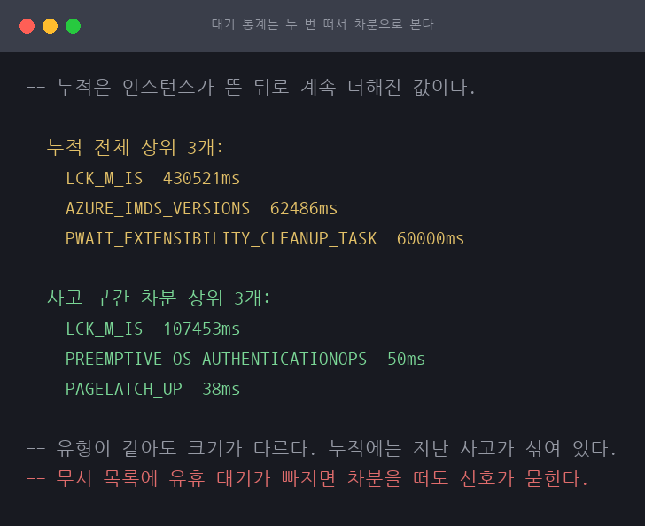
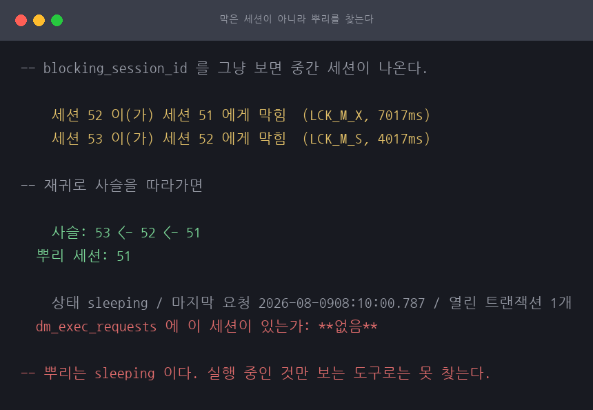
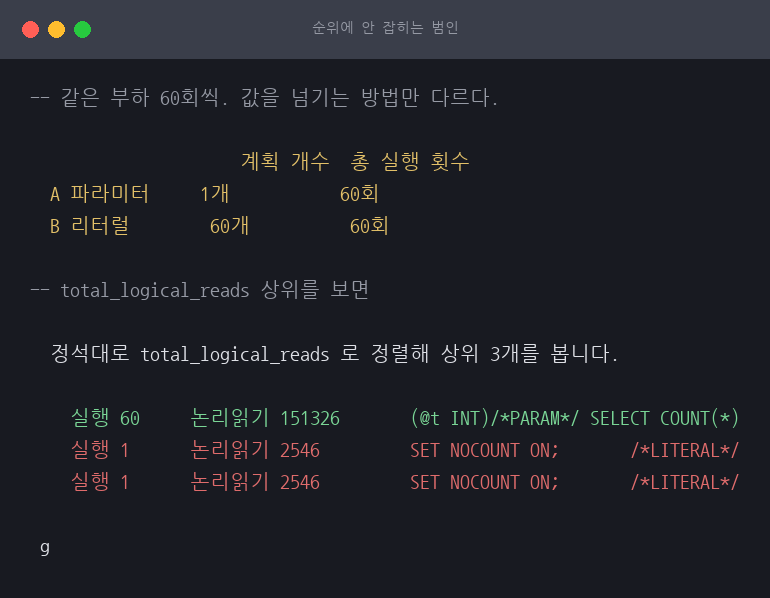
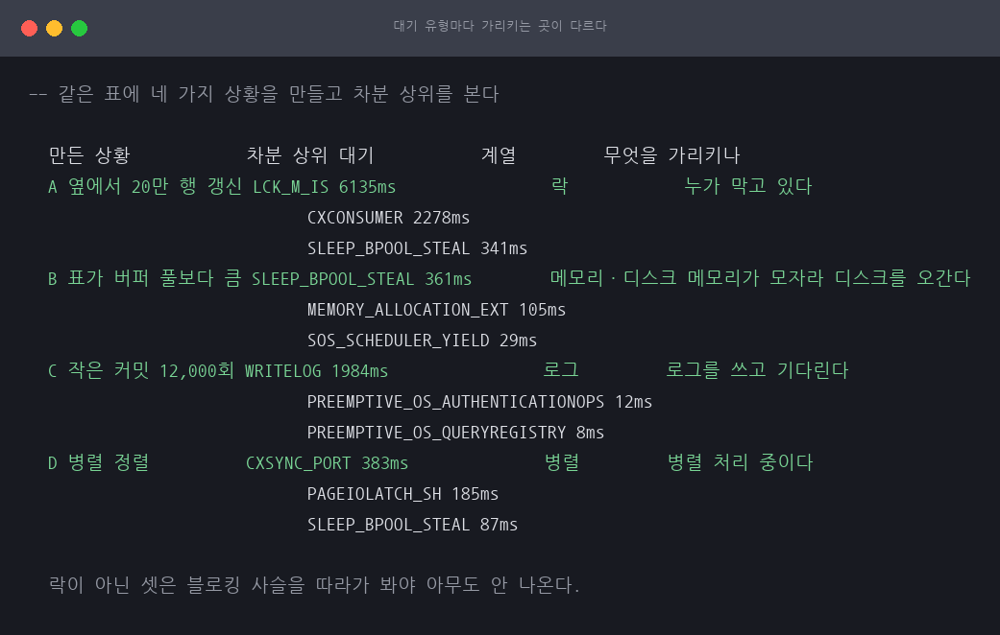
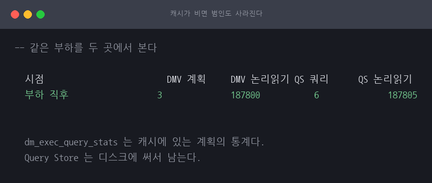
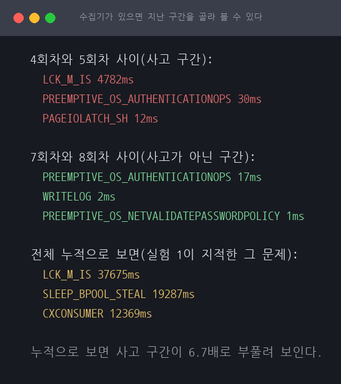

# 느려졌다는 신고를 받고 원인을 좁히는 순서

SQL Server 장애 진단 / SQL Server 2022 (RTM-CU26) 16.0.4265 / 근거 등급 **E2**

> 이 글은 왜 그런지를 다룹니다. 무엇을 할 것인가는 [RUNBOOK.md](RUNBOOK.md) 에 있습니다.
>
> [A04](../A04-mssql-lock-escalation/)·[A24](../A24-currency-anomaly-detection/)·[A25](../A25-currency-reclaim-procedure/)
> 에서 임시로 짜 쓴 진단 쿼리들을 재사용 가능한 순서로 정리한 세션입니다.

## 1. 왜 이 세션인가

앞의 세 세션은 전부 "무엇이 문제인지 아는 상태"에서 출발했습니다. 락 승격을 재려고
승격을 일부러 냈고, 조사 쿼리를 재려고 사고를 심었습니다.

운영은 반대입니다. **"느려졌다"는 신고 하나로 시작합니다.** 무엇이 원인인지 모르는
상태에서 좁혀 가야 하고, 그 순서가 정해져 있지 않으면 눈에 띄는 것부터 손대게 됩니다.

이 세션은 그 순서를 만듭니다. 벤더가 제공하는 DMV 의 동작 확인이므로 등급은 E2 입니다.

## 2. 재현

| 항목 | 값 |
|---|---|
| 호스트 | Darwin 25.3.0 arm64, 12코어, 32GiB |
| 컨테이너 | `mcr.microsoft.com/mssql/server:2022-latest`, Developer, `cpus: 4`, `mem_limit: 6g` |
| 테이블 | `account_currency (account_id INT PK, balance BIGINT)` 30만 행 |

**시간 수치는 인용하지 않습니다.** ARM 에뮬레이션입니다. 이 세션이 재는 것은 대기
유형, 사슬의 모양, 세션이 DMV 에 보이는지 여부입니다.

## 3. 대기 통계는 누적이라 지금을 못 본다

느려졌다는 신고를 받으면 정석은 대기 통계입니다. 세션들이 무엇을 기다렸는지 인스턴스
단위로 쌓여 있습니다. 그런데 `sys.dm_os_wait_stats` 는 **인스턴스가 뜬 뒤로 계속 더해진
값**입니다.

```
$ ./scripts/exp1-wait-stats.sh

  누적 전체 상위 3개:
    LCK_M_IS  430521ms
    AZURE_IMDS_VERSIONS  62486ms
    PWAIT_EXTENSIBILITY_CLEANUP_TASK  60000ms

  사고 구간 차분 상위 3개:
    LCK_M_IS  107453ms
    PREEMPTIVE_OS_AUTHENTICATIONOPS  50ms
    PAGELATCH_UP  38ms
```



이 회차에서는 유형이 같게 나왔지만 **크기가 다릅니다.** 누적에는 앞선 실행들이 남긴
것이 섞여 있습니다. 운영이라면 어제 사고와 지난주 배치가 거기 들어 있습니다. 누적만
보면 이번 사고의 크기를 실제보다 크게 봅니다.

그래서 대기 통계는 **두 번 떠서 차분**으로 봅니다. 사고가 의심되면 먼저 스냅샷을 뜨고,
몇 분 뒤 다시 떠서 그 사이에 늘어난 것만 봅니다.

`DBCC SQLPERF('sys.dm_os_wait_stats', CLEAR)` 로 초기화하는 방법도 있지만 운영에서는
쓰지 않습니다. 다른 사람이 보고 있던 기준이 사라집니다.

### 무시 목록이 부실하면 차분도 소용없다

이 실험을 처음 돌렸을 때 `SOS_WORK_DISPATCHER` 와 `DISPATCHER_QUEUE_SEMAPHORE` 가
상위를 전부 차지해 사고가 만든 `LCK_M_IS` 가 3위 밖으로 밀려 있었습니다. 둘 다 시스템이
놀 때 쌓는 대기라 사고와 무관합니다. **제가 만든 무시 목록에 그 둘이 빠져 있었습니다.**

목록에 넣고서야 신호가 보였습니다. 유휴 대기를 안 빼면 매번 같은 것이 1위로 나와
대기 통계 자체가 쓸모없어집니다.

## 4. 막은 세션이 아니라 뿌리를 찾는다

대기가 `LCK_M_*` 를 가리키면 다음 질문은 "누가 막고 있는가" 입니다. 그런데
`blocking_session_id` 를 그냥 보면 **중간 세션**이 나옵니다.

```
$ ./scripts/exp2-blocking-chain.sh

    세션 52 이(가) 세션 51 에게 막힘  (LCK_M_X, 7017ms)
    세션 53 이(가) 세션 52 에게 막힘  (LCK_M_S, 4017ms)
```

여기 나오는 세션을 죽이면 될 것 같지만 그중 하나는 자기도 막혀 있습니다. 그것을
죽여도 뿌리가 그대로라 다시 같은 일이 납니다.

재귀로 사슬을 따라가면 뿌리가 나옵니다.

```
    사슬: 53 <- 52 <- 51

  뿌리 세션: 51
```



**그리고 뿌리는 아무것도 안 하고 있습니다.**

```
    상태 sleeping / 마지막 요청 2026-08-09 08:52:11.653 / 열린 트랜잭션 1개

  dm_exec_requests 에 이 세션이 있는가: **없음**
```

상태가 `sleeping` 이고 실행 중인 요청이 없어 `dm_exec_requests` 에 안 나옵니다.
**실행 중인 것만 보는 도구로는 못 찾습니다.** 뿌리를 찾을 때는 `dm_exec_sessions` 와
`dm_tran_session_transactions` 를 함께 봐야 합니다. "요청은 없는데 트랜잭션은 열려
있는 세션"이 그것입니다.

게임 운영으로 옮기면 흔한 모양이 하나 있습니다. 운영툴에서 조회를 던지고 트랜잭션을
안 닫은 채 자리를 뜬 세션입니다. 그 하나가 보정 배치를 막고, 보정 배치가 서비스
조회를 막습니다. **신고는 서비스에서 들어오는데 원인은 두 단계 위에 있습니다.**

## 5. 순위에 안 잡히는 범인

대기가 락이 아니라 IO 나 CPU 를 가리키면 막는 세션이 아니라 **많이 읽는 쿼리**를
찾아야 합니다. 정석은 `sys.dm_exec_query_stats` 를 총 논리 읽기로 정렬하는 것입니다.

같은 부하를 두 방법으로 걸었습니다. 읽는 양과 횟수는 같고 값을 넘기는 방법만 다릅니다.

```
$ ./scripts/exp3-plan-cache.sh

                     계획 개수  총 실행 횟수
  A 파라미터     1개           60회
  B 리터럴        60개          60회
```

같은 60회를 돌렸는데 파라미터는 계획 하나에 모이고 리터럴은 60개로 흩어집니다.
그래서 총 논리 읽기 상위를 보면 이렇게 됩니다.

```
  정석대로 total_logical_reads 로 정렬해 상위 3개를 봅니다.

    실행 60     논리읽기 151326       (@t INT)/*PARAM*/ SELECT COUNT(*)
    실행 1      논리읽기 2546         SET NOCOUNT ON;       /*LITERAL*/
    실행 1      논리읽기 2546         SET NOCOUNT ON;       /*LITERAL*/
```



**부하는 절반을 리터럴이 주는데 순위에는 파라미터만 보입니다.** 각 계획이 실행 1회에
소량이라 상위 N 에 못 옵니다.

`query_hash` 로 묶으면 드러납니다. 같은 모양이면 값이 달라도 해시가 같습니다.

```
  묶기 전 상위 1위         151326
  query_hash 로 묶은 뒤      304086
```

**묶기 전에는 실제 부하의 절반만 보였습니다.**

계획이 흩어지는 것 자체도 문제입니다. 캐시가 부풀고 매번 컴파일하느라 CPU 를 씁니다.
근본 해소는 진단이 아니라 애플리케이션이 값을 파라미터로 넘기게 고치는 것입니다.

## 6. 대기가 락이 아니면 처방이 통째로 안 맞는다

3절까지는 락 대기 하나로 갔고 4절의 처방(사슬 -> 뿌리)도 락 전용입니다.
**대기가 락이 아니면 그 처방이 안 맞는데** 그 경우를 안 만들었습니다. 넷을 만듭니다.

```
$ ./scripts/exp5-wait-types.sh

  만든 상황            차분 상위 대기           계열         무엇을 가리키나
  A 옆에서 20만 행 갱신 LCK_M_IS 6135ms                락            누가 막고 있다
                             CXCONSUMER 2278ms
                             SLEEP_BPOOL_STEAL 341ms
  B 표가 버퍼 풀보다 큼 SLEEP_BPOOL_STEAL 361ms        메모리·디스크 메모리가 모자라 디스크를 오간다
                             MEMORY_ALLOCATION_EXT 105ms
                             SOS_SCHEDULER_YIELD 29ms
  C 작은 커밋 12,000회 WRITELOG 1984ms                로그         로그를 쓰고 기다린다
                             PREEMPTIVE_OS_AUTHENTICATIONOPS 12ms
                             PREEMPTIVE_OS_QUERYREGISTRY 8ms
  D 병렬 정렬          CXSYNC_PORT 383ms              병렬         병렬 처리 중이다
                             PAGEIOLATCH_SH 185ms
                             SLEEP_BPOOL_STEAL 87ms
```



정확한 유형은 회차마다 바뀝니다. 버퍼 풀 압박은 `SLEEP_BPOOL_STEAL` 로도
`MEMORY_ALLOCATION_EXT` 로도 `PAGEIOLATCH_SH` 로도 나옵니다. 그래서 **계열로
판정합니다.** 신호를 못 만든 회차는 답으로 안 씁니다.

```
  대기가 가리키는 것 블로킹 사슬을 따라가면 대신 볼 것
  락                    뿌리 세션이 나온다 그 세션이 무엇을 하던 중인지
  메모리·디스크   **막는 세션이 없다** 읽는 페이지 수. 인덱스와 메모리
  로그 쓰기          **막는 세션이 없다** 커밋 횟수. 배치로 묶을 수 있는지
  병렬 처리          **막는 세션이 없다** 이 대기는 정상일 수 있다
```

**락이 아닌 셋은 블로킹 사슬을 따라가 봐야 아무도 안 나옵니다.** 4절의 재귀 쿼리를
돌리면 빈 결과가 나오고, 그것을 "막는 세션이 없으니 DB 문제가 아니다"로 읽으면
그때부터 헤맵니다.

넷째가 특히 함정입니다. 병렬 대기는 **일을 나눠 하는 중**이라는 뜻이지 문제가 아닐
수 있습니다. 상위에 올랐다고 손대면 멀쩡한 것을 건드립니다.

> B 에서 1위가 `PAGEIOLATCH` 가 아니라 `SLEEP_BPOOL_STEAL` 로 나온 것이 **더 정확한
> 진단입니다.** 디스크가 느린 것이 아니라 메모리가 모자라 같은 페이지를 반복해
> 올리고 있다는 뜻이라, 디스크를 바꿔도 안 낫습니다.
>
> 이 조건을 만들려고 버퍼 풀을 표보다 작게 뒀습니다. 처음에 256MB 까지 조였다가
> **컨테이너가 죽었습니다.** SQL Server 가 그 아래에서는 못 버팁니다.

## 7. 캐시가 비면 범인도 사라진다

5절의 방법에는 전제가 있습니다. **계획이 캐시에 남아 있어야 합니다.** 사고가 지나간
뒤에 들여다보면 이미 밀려났을 수 있습니다.

```
$ ./scripts/exp4-query-store.sh

  시점                         DMV 계획     DMV 논리읽기 QS 쿼리      QS 논리읽기
  부하 직후                  3              187800           6              187805

```



**DMV 쪽은 통째로 사라졌습니다.** `dm_exec_query_stats` 는 이름 그대로 **캐시에 있는
계획의** 통계이고, 계획이 없어지면 통계도 함께 없어집니다.
**Query Store 는 그대로 있습니다.** 디스크에 쓰기 때문입니다.

그러면 DMV 를 버리고 Query Store 만 보면 되는가. 아닙니다.

```
  물어보는 것                   DMV              Query Store
  지금 무엇이 돌고 있나     dm_exec_requests 못 한다
  지금 누가 누구를 막고 있나 dm_tran_locks    못 한다
  지난 사고의 범인 쿼리     캐시에 남아야 **남아 있다**
  그때의 실행 계획            밀려나면 없음 **버전별로 보관**
  계획이 바뀌어 느려진 것  못 본다       **계획 회귀로 본다**
```

**Query Store 는 지난 일을 보는 도구이고 DMV 는 지금을 보는 도구입니다.**
4절의 블로킹 사슬은 Query Store 로 못 찾습니다. 지금 누가 누구를 막고 있는지는
저장되는 값이 아니기 때문입니다.

> 켤 때 주의할 것이 하나 있습니다. **캡처 모드 기본값 `AUTO` 는 가벼운 쿼리를 안
> 담습니다.** 5절에서 본 리터럴로 흩어진 범인은 하나하나가 가벼워서 그 그물에서
> 빠질 수 있습니다. 그런 조사를 할 생각이면 `ALL` 로 둡니다.

## 8. 사고가 지나간 뒤에도 재려면

3절의 "두 번 떠서 차분"에는 **사고가 진행 중이어야 한다**는 전제가 있었습니다.
신고가 늦으면 기준으로 삼을 앞 스냅샷이 없습니다. 수집기를 만듭니다.

누적값을 회차마다 그대로 적고 **차분은 읽을 때 냅니다.** 수집할 때 차분을 내면
구간을 다시 못 고르고 회차 사이의 재시작도 못 가릅니다.

```
$ ./scripts/exp6-collector.sh

  4회차와 5회차 사이(사고 구간):
    LCK_M_IS 4782ms
    PREEMPTIVE_OS_AUTHENTICATIONOPS 30ms
    PAGEIOLATCH_SH 12ms

  7회차와 8회차 사이(사고가 아닌 구간):
    PREEMPTIVE_OS_AUTHENTICATIONOPS 17ms
    WRITELOG 2ms
    PREEMPTIVE_OS_NETVALIDATEPASSWORDPOLICY 1ms

  전체 누적으로 보면(실험 1이 지적한 그 문제):
    LCK_M_IS 37675ms
    SLEEP_BPOOL_STEAL 19287ms
    CXCONSUMER 12369ms
```



**누적으로 보면 사고 구간이 안 보입니다.** 사고 구간의 `LCK_M_IS` 는 4,886ms 인데
누적은 32,890ms 로 6.7배입니다. 수집기가 있으면 그 구간만 떼어 볼 수 있고,
**사고가 끝난 뒤에도 됩니다.**

수집기 자체의 비용입니다.

```
  회차당 수집 행           81
  8회차 누적                 648행 / 72KB
  한 번 수집의 논리 읽기 153
  30일만 보존하면          약 380MB
```

읽는 것이 DMV 한 개뿐이라 1분 주기로 켜 둬도 부담이 안 됩니다. 대신 **보존 기간을
안 정하면 쌓입니다.** 수집기를 만들 때 지우는 작업을 같이 만듭니다.

Query Store(7절)가 쿼리 쪽을 맡는다면 이것은 **대기 쪽을 맡습니다.** 둘 다
"지난 일을 보는" 자리입니다.

## 9. 예상과 달랐던 점

### 같은 실수를 두 번 했습니다

3절에 "무시 목록이 부실하면 차분도 소용없다"고 적어 놓고, 8절의 수집기에서
**짧은 목록을 따로 만들어** 같은 일을 겪었습니다. `HADR_FILESTREAM_IOMGR_IOCOMPLETION`
과 `SQLTRACE_INCREMENTAL_FLUSH_SLEEP` 이 상위를 덮어 사고가 만든 `LCK_M_IS` 가 3위로
밀렸습니다.

**적어 두는 것과 한 곳에 두는 것은 다릅니다.** 목록을 `lib.sh` 로 올리고 전부
거기서 가져다 쓰게 고쳤습니다. 규칙을 문서에만 적어 두면 다음 사람이(그것이
자기 자신이어도) 또 만듭니다.

### 엔진이 알아서 파라미터화해 주는 구간이 있다

리터럴 쿼리가 흩어지는 것을 보이려고 `SELECT COUNT(*) ... WHERE tag = <값>` 을 60회
돌렸는데, 리터럴 쪽도 **계획 하나에 실행 60회**로 모였습니다. 캐시 텍스트를 열어 보니
`(@1 tinyint)SELECT COUNT(*) FROM [account_currency] WHERE [tag]=@1` 이었습니다.

엔진이 단순 매개 변수화를 걸어 준 것입니다. 그 구간에서는 리터럴을 써도 안 흩어집니다.
다만 아주 단순한 쿼리에만 걸리고 **조인 하나만 넣어도 안 해 줍니다.** 실무의 조사
쿼리는 대부분 그쪽이라, 조인을 넣고 다시 재자 60개로 흩어졌습니다.

가설이 반박된 것이 아니라 **조건이 좁았습니다.** 그 조건을 밝히지 않고 "리터럴은
흩어진다"고만 적었으면 반쯤 틀린 글이 됐을 것입니다.

### 뿌리를 WAITFOR 로 만들면 뿌리가 아니다

처음에는 뿌리 세션을 `WAITFOR DELAY` 로 버티게 짰습니다. 그랬더니 `dm_exec_requests` 에
그대로 나와서 "실행 중인 것만 보는 도구로는 못 찾는다"는 결론을 못 낼 뻔했습니다.

`WAITFOR` 는 **서버가** 기다리는 것이고 실행 중인 요청입니다. 실제 사고의 뿌리는
**연결이** 노는 것입니다. 배치를 보낸 뒤 표준입력을 열어 둬 세션만 살려 두자
`sleeping` 이 됐고 `dm_exec_requests` 에서 사라졌습니다.

### 헬퍼 하나가 시각을 붙여 놨다

뿌리 세션의 마지막 요청 시각이 `2026-08-0908:10:00.787` 로 나왔습니다. 공백이
사라진 것입니다. 값에서 개행과 캐리지 리턴을 떼려고 만든 `num()` 이 `tr -d ' \r'`
로 **내부 공백까지** 지우고 있었습니다.

같은 함수를 A25 에서도 썼는데 거기서는 화면이 아니라 `RESTORE ... STOPAT` 의 인자로
들어가서 `Msg 3217` 로 죽었습니다. 그때 하마터면 "시각으로는 복원이 안 된다"고
결론 낼 뻔했습니다. 여기서는 화면에만 나오지만 **같은 자국입니다.**
공백을 살리는 `numsp()` 를 따로 두고 시각을 뽑는 자리에서 그것을 씁니다.

### 재귀 CTE 는 재귀부에 외부 조인을 못 쓴다

사슬을 따라가는 재귀 CTE 에서 `LEFT JOIN` 을 썼다가 막혔습니다. SQL Server 는 재귀부에
외부 조인을 금지합니다. 스칼라 서브쿼리로 바꿨습니다. 그다음에는 앵커와 재귀부의
`path` 타입이 안 맞아 `Msg 240` 이 났습니다. 재귀부에 명시적 `CAST` 를 넣어야 합니다.

둘 다 **결과가 조용히 비는 것이 아니라 에러로 나왔습니다.** 진단 쿼리를 미리 짜 두고
검증해 두는 이유가 여기 있습니다. 사고 중에 이런 것을 만나면 원인을 찾는 시간이
쿼리를 고치는 시간에 먹힙니다.

## 10. 표준 처방

느려졌다는 신고를 받으면 이 순서로 좁힙니다.

1. **대기 통계 스냅샷을 먼저 뜬다.** 나중에 차분을 볼 기준이 된다
2. 몇 분 뒤 다시 떠 **차분 상위**를 본다. 유휴 대기는 무시 목록으로 빼 둔다
3. 상위 대기의 **계열**로 갈라진다
   - `LCK_M_*` → **블로킹 사슬을 재귀로 따라가 뿌리를 찾는다**
   - `PAGEIOLATCH_*` / `SLEEP_BPOOL_STEAL` → 많이 읽는 쿼리와 버퍼 풀 여유를 본다
   - `WRITELOG` → 커밋 횟수를 본다. 한 건씩 커밋하는 루프를 배치로 묶는다
   - `CX*` → 먼저 정상인지 의심한다. 병렬도가 문제면 `MAXDOP` 을 본다
4. 뿌리가 `sleeping` 이면 `dm_exec_sessions` + `dm_tran_session_transactions` 로 확인한다
5. 뿌리를 죽이기 전에 **무엇을 하던 세션인지** 기록한다. 같은 일이 반복된다
6. 락이 아니면 `dm_exec_query_stats` 를 본다. **`query_hash` 로 묶어서** 본다.
   계획 단위로만 보면 리터럴로 흩어진 범인이 순위에 안 잡힌다

## 11. 못 한 것

- **`RESOURCE_SEMAPHORE` 를 못 만들었습니다.** 큰 정렬을 여럿 동시에 돌려 메모리
  부여를 고갈시켜야 하는데, 이 컨테이너 규모에서는 부여가 다 났습니다.
- **수집기를 에이전트 작업으로 안 걸었습니다.** 프로시저와 표는 만들었고 회차를
  손으로 돌렸습니다. 이 이미지는 SQL Server 에이전트가 기본으로 꺼져 있어 켜려면
  컨테이너를 다시 만들어야 합니다.
- **Query Store 의 계획 회귀(강제 계획)를 안 써 봤습니다.** 같은 쿼리가 계획이
  바뀌어 느려지는 상황을 만들고 `sp_query_store_force_plan` 으로 되돌리는 것까지는
  안 갔습니다.
