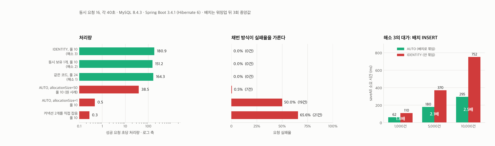
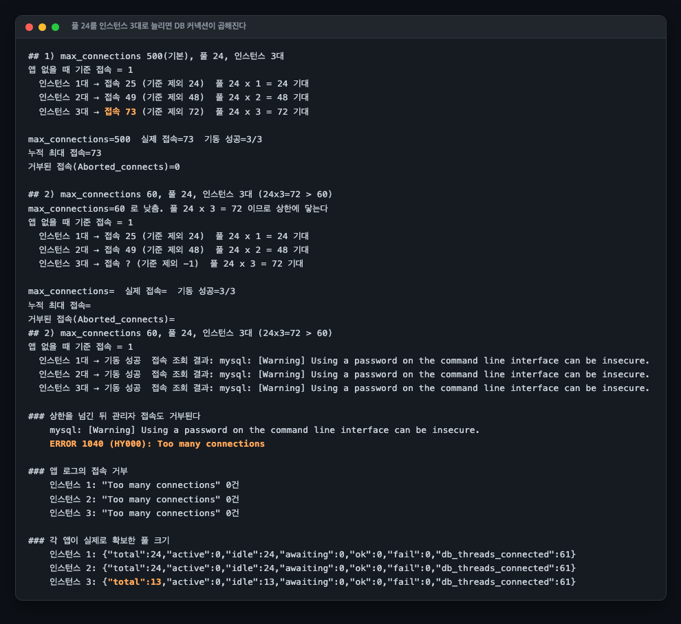
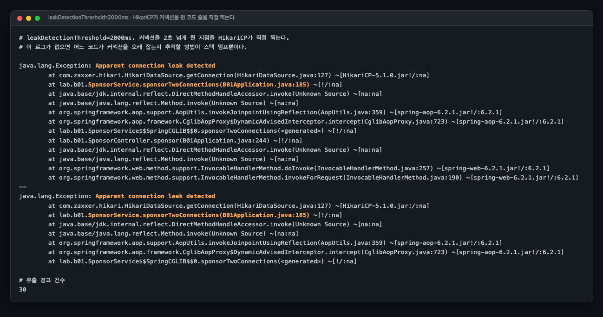

# B01 커넥션 풀 데드락, DB는 한가한데 애플리케이션만 멈춘다

> 근거 등급: `E1`

## 결론부터

| 지금 알면 되는 것 | 근거 |
|---|---|
| **`save()` 한 줄이 커넥션 두 개를 요구한다.** `@GeneratedValue(AUTO)` 가 MySQL 에서 시퀀스 테이블을 별도 커넥션으로 잠그기 때문이다 | ([근거](#3-내부-원리)) |
| **Hibernate 6 에서는 완전한 정지가 아니라 처리량 저하로 나타난다.** `allocationSize` 50 이 채번을 50건에 한 번으로 줄이기 때문 | TPS 35.8 대 138.2 ([근거](#5-재계측)) |
| **`allocationSize=1` 로 두면 원 사례의 강도가 재현된다** | ([근거](#5-재계측)) |
| **p95 로는 이 장애가 안 보인다.** 실패율 0.5%인데 1초 초과 16건이 워커 시간의 89.1%를 먹는다 | p95 61ms ([근거](#6-예상과-달랐던-점)) |
| **해소는 셋인데 성격이 다르다.** 풀을 늘리는 것, 동시 보유를 1로 줄이는 것, 채번 방식을 바꾸는 것 | `IDENTITY` 가 처리량으로는 최선 ([근거](#4-해소)) |

## 1. 유명한 이유

우아한형제들 기술블로그의 사례가 널리 읽힙니다(이재훈, 2020-02-06,
[이론편](https://techblog.woowahan.com/2664/)과 [실전편](https://techblog.woowahan.com/2663/)).
배치성 소비자 애플리케이션에서 이런 로그가 쏟아졌습니다.

```
Connection is not available, request timed out after 30000ms.
Timeout failure stats (total=10, active=10, idle=0, waiting=16)
```

읽는 순간 "DB가 죽었나" 싶지만 아닙니다. `total=10, active=10, idle=0`은 풀이 가진 커넥션 10개를 전부 누군가 쥐고 있다는 뜻이고, `waiting=16`은 소비자 스레드 16개가 전원 대기 중이라는 뜻입니다. DB 쪽은 커넥션 10개만 받은 채 한가합니다. 죽은 것은 DB가 아니라 애플리케이션입니다.

이 사례가 특히 인용되는 이유는 원인이 반직관적이기 때문입니다. 개발자가 커넥션을 두 개 잡는 코드를 쓴 적이 없습니다. 엔티티에 `@GeneratedValue(strategy = GenerationType.AUTO)`를 붙였을 뿐입니다. 실전편의 서술은 이렇습니다.

> MySQL은 Sequence를 지원하지 않기 때문에 hibernate_sequence라는 테이블에 단일 Row를 사용하여 ID값을 생성합니다

그 채번을 별도 트랜잭션으로 처리하므로 `save()` 한 줄이 커넥션 두 개를 동시에 요구합니다. 전역 테이블의 단일 행을 쓴다는 점이 중요합니다. 이 랩의 Hibernate 6은 엔티티별 테이블을 만들어 동작이 달랐습니다(3절).

원 사례의 조건은 CPU 4코어, 소비자 스레드 16개, `maximumPoolSize` 10(기본값), `connectionTimeout` 30000ms(기본값)였고, 풀을 24로 올려 해소했습니다.

### 널리 잘못 인용되는 공식

HikariCP 위키에 이런 공식이 있습니다.

```
pool size = Tn × (Cm - 1) + 1
```

`Tn`은 스레드 수, `Cm`은 한 스레드가 동시에 필요한 커넥션의 최대 개수입니다. 위키는 이 값을 **데드락을 피하는 최소값**이라고 설명합니다. 성능 권장값이 아니라 하한선입니다.

우아한형제들이 실제로 쓴 계산은 `16 × (2 - 1) + (16 / 2) = 24`입니다. 뒤의 `+ (Tn / 2)`는 위키 공식에 없습니다. 하한선인 17에 여유분을 더한 **자체 확장**입니다. 위키 공식으로 24가 나온다고 인용하면 틀립니다. 이 랩에서는 두 값을 구분해 씁니다.

## 2. 재현

### 환경

전부 `reproduce.md`에 있습니다. 요약하면 MySQL 8.4.3, Spring Boot 3.4.1, Hibernate 6, JDK 25, 동시 요청 16, 각 조건 40초입니다. 원 사례의 스레드 16개와 맞췄습니다.

### 네 조건

| 라벨 | 경로 | 풀 | 의도 |
|---|---|---|---|
| `jpa-10` | `save()` 한 줄, `@GeneratedValue(AUTO)` | 10 | 원 사례를 그대로 |
| `jpa-24` | 같음 | 24 | 원 사례의 해소책 |
| `two-10` | 첫 커넥션을 쥔 채 두 번째를 빌림 | 10 | 커넥션 2개 요구를 노골적으로 |
| `one-10` | 첫 커넥션을 반납한 뒤 두 번째를 빌림 | 10 | 동시 보유 최대를 1로 |

`two-10`을 따로 둔 이유가 있습니다. `jpa-10`은 원 사례를 재현하려는 조건이고, `two-10`은 그 원리를 순수한 형태로 분리한 대조군입니다. 둘을 나란히 놓아야 "커넥션 2개 요구"라는 원리와 "JPA 채번이 그 원리를 유발하는 정도"를 따로 볼 수 있습니다.

### 증상

`jpa-10`에서 원 사례와 같은 형태의 로그가 그대로 찍혔습니다.

```
HikariPool-1 - Connection is not available, request timed out after 30000ms (total=10, active=10, idle=0, waiting=12)
```

`total=10, active=10, idle=0`이 일치합니다. `waiting`은 그 순간 대기 중인 스레드 수라 12에서 9까지 흔들립니다. 같은 시각 `/pool`이 보고한 `db_threads_connected`는 10이었습니다. DB는 커넥션 10개만 물고 한가했습니다.

## 3. 내부 원리

### 왜 커넥션이 두 개 필요한가

채번은 본 트랜잭션이 롤백돼도 되돌아가면 안 됩니다. ID를 다시 나눠 주면 충돌하기 때문입니다. 그래서 Hibernate는 채번을 본 트랜잭션 밖에서, 별도 커넥션으로 처리합니다. 결과적으로 `save()` 실행 중 한순간 커넥션 두 개를 동시에 잡습니다.

여기서 데드락의 조건이 갖춰집니다. 스레드 16개가 모두 첫 커넥션을 잡은 뒤 두 번째를 요청하면, 풀이 10일 때 아무도 두 번째를 못 받습니다. 그런데 첫 번째를 내놓아야 남이 진행할 수 있는데, 자기도 두 번째를 기다리느라 내놓지 않습니다. 서로가 서로를 기다립니다.

### Hibernate 6에서 달라진 것

이 랩에서 확인한 사실입니다. 순차 INSERT를 하며 시퀀스 테이블을 관측했습니다.

```
기동 직후  next_val=1
INSERT #1 → next_val=51   max(id)=1
INSERT #2 → next_val=101  max(id)=2
INSERT #3 → next_val=101  max(id)=3
INSERT #4 → next_val=101  max(id)=4
```

`next_val`이 1에서 51, 101로 뛴 뒤 멈춰 있습니다. Hibernate 6은 pooled 옵티마이저가 기본이고 `allocationSize`가 50입니다. 한 번 채번하면 ID 50개를 확보해 메모리에서 나눠 씁니다. 테이블 이름도 전역 `hibernate_sequence`가 아니라 엔티티별 `sponsor_jpa_seq`입니다.

그래서 두 번째 커넥션은 50건에 한 번만 필요합니다. 데드락 조건이 상시가 아니라 간헐적으로만 성립합니다. 이것이 아래 재계측에서 `jpa-10`이 전멸하지 않은 이유입니다.

## 4. 해소

세 가지 길이 있고 성격이 다릅니다.

**풀을 늘린다.** 원 사례의 선택입니다. 코드를 안 고쳐도 되지만 DB 쪽 커넥션 수가 늘어납니다. 애플리케이션 인스턴스가 여러 대면 그만큼 곱해집니다. 하한선은 `Tn × (Cm - 1) + 1`이고, 실제로는 여유를 더 둡니다.

**동시 보유 개수를 1로 줄인다.** 첫 커넥션을 반납한 뒤 두 번째를 빌립니다. `Cm`이 1이 되면 공식상 필요한 풀은 스레드 수와 무관하게 1입니다. 데드락 자체가 성립하지 않습니다. 대신 두 작업이 한 트랜잭션으로 묶이지 않으므로, 원자성이 필요한 곳에는 못 씁니다.

**채번 방식을 바꾼다.** `AUTO` 대신 `IDENTITY`를 쓰면 MySQL의 `AUTO_INCREMENT`를 그대로 쓰므로 별도 커넥션이 사라집니다. 잃는 것은 JDBC 배치 INSERT입니다. Hibernate는 INSERT를 보내기 전에는 생성된 키를 모르므로 배치로 묶지 못합니다.

세 가지 모두 측정했습니다. 5절에 있습니다.

## 5. 재계측

40초, 동시 요청 16.

4회 반복의 중앙값이고 괄호는 최소에서 최대입니다. 회차별 원문은 `results/run0-*`부터
`results/run3-*`에 있습니다. run0이 처음 측정이고 나머지는 `tools/repeat-runs.sh`로 돌렸습니다.

| 조건 | 실패 | 실패율 | TPS | p50 | p95 |
|---|---|---|---|---|---|
| `jpa-10` | 7건 (네 번 다) | 0.5% | 37.2 (34.2~40.1) | 39ms | 55ms |
| `jpa-24` | 0건 | 0% | 141.1 (136.6~164.3) | 40ms | 55ms |
| `two-10` | 19~21건 | 64.1% | 0.3 (0.3~0.5) | 30,096ms | 30,129ms |
| `one-10` | 0건 | 0% | 151.2 (126.5~152.8) | 78ms | 85ms |

회차 간 편차는 처리량에서 1.2배 안쪽입니다. 다만 `one-10`의 run0(126.5)은 나머지
세 회차(151~153)보다 낮아 범위 밖에 가깝습니다. 회차 2와 3은 앞 회차의 부하가
남은 상태에서 시작했습니다(측정 직전 load average 3.71, 11.26, 10.82).
`results/host-run*.txt`에 그 값이 있습니다.

`two-10`이 데드락의 순수한 모습입니다. 40초 동안 요청이 32건밖에 처리되지 않았고 그중 21건이 30초를 꽉 채우고 죽었습니다. p50이 30초라는 것은 절반 이상이 타임아웃까지 갔다는 뜻입니다. `one-10`은 같은 풀 10에서 5,058건을 실패 없이 처리했습니다. 풀 크기를 건드리지 않고 동시 보유 개수만 1로 줄여서 얻은 결과입니다.

### 실패율 0.5%가 처리량을 4분의 1로 떨어뜨렸습니다

`jpa-10`과 `jpa-24`를 비교하면 실패율 차이는 0.5%포인트인데 TPS는 37.2와 141.1로 벌어집니다. 회차마다 계산하면 3.6배에서 4.3배입니다. 왜 그런지 요청별 소요 시간을 나눠 봤습니다.

| 조건 | 1초 초과 | 1초 초과가 차지한 워커 시간 |
|---|---|---|
| `jpa-10` | 16건 (네 번 다) | 88.4~89.1% |
| `jpa-24` | 0건 | 0% |
| `two-10` | 32건 (네 번 다) | 99.9~100% |
| `one-10` | 0건 | 0% |

`jpa-10`에서 1초를 넘긴 요청은 네 회차 모두 정확히 16건이고 전체의 1.1% 안팎입니다. 그 16건이 워커 시간의 88.4%에서 89.1%를 먹었습니다. 워커 16개가 40초 동안 쓸 수 있는 시간이 640초입니다.

대시보드에서 실패율만 보면 0.5%라 정상으로 보입니다. p95도 55ms로 멀쩡합니다. 이 조건에서 이상을 알아채려면 최대값이나 요청별 소요 시간의 분포를 봐야 합니다. p95까지만 보는 대시보드는 이 장애를 놓칩니다.

### 채번 방식이 결론을 가릅니다

`allocationSize`를 1로 낮춘 조건과 `IDENTITY` 조건을 새로 쟀습니다. 앞의 것은 원 사례에
더 가까운 강도를 만들려는 조건이고, 뒤의 것은 해소책 세 번째입니다.



| 조건 | 채번 | 풀 | 성공 | 실패 | 실패율 | TPS | p50 |
|---|---|---|---|---|---|---|---|
| `two-10` | 없음(커넥션 2개 직접) | 10 | 11 | 21 | 65.6% | 0.3 | 30,098ms |
| `seq1-10` | AUTO, `allocationSize=1` | 10 | 19 | 19 | **50.0%** | **0.5** | **30,062ms** |
| `jpa-10` | AUTO, `allocationSize=50` | 10 | 1,539 | 7 | 0.5% | 38.5 | 39ms |
| `jpa-24` | 같음 | 24 | 6,572 | 0 | 0% | 164.3 | 37ms |
| `one-10` | 같음, 동시 보유 1개 | 10 | 6,047 | 0 | 0% | 151.2 | 78ms |
| `idn-10` | **IDENTITY** | 10 | 7,237 | 0 | **0%** | **180.9** | 44ms |

**`allocationSize=1`이 원 사례의 강도를 재현합니다.** 실패율 50%에 p50 30초로, 커넥션을
직접 두 개 잡는 `two-10`(65.6%, 30.1초)과 사실상 같습니다. 시퀀스 테이블의 `next_val`이
19행에 20으로 1씩 오른 것이 확인됩니다. 채번이 매 건 일어나므로 `save()` 한 번마다
커넥션 두 개를 상시로 요구합니다.

이것이 "원 사례는 왜 더 심했는가"에 대한 답의 후보입니다. 원문이 전역 `hibernate_sequence`
단일 행을 쓴다고 적었으니 pooled 옵티마이저가 없었을 가능성이 있고, 그러면 `seq1-10`이
그 상태입니다. 다만 원문에 버전과 `allocationSize`가 없으므로 단정하지 않겠습니다.

**`IDENTITY`가 처리량으로는 가장 좋습니다.** 풀 10 그대로 실패 0건에 초당 180.9건으로
모든 조건 중 1위입니다. 풀을 24로 올린 `jpa-24`(164.3)보다도 높습니다. 별도 커넥션이
아예 없으므로 데드락 조건이 성립하지 않습니다.

### 그 대가는 배치 INSERT입니다

`saveAll`로 같은 건수를 넣고 시간만 비교했습니다. 워밍업 뒤 3회씩 잰 중앙값입니다.

| 건수 | AUTO (배치로 묶임) | IDENTITY (안 묶임) | 배수 |
|---|---|---|---|
| 1,000 | 62ms | 110ms | 1.8배 |
| 5,000 | 180ms | 370ms | 2.1배 |
| 10,000 | 295ms | 752ms | 2.5배 |

건수가 늘수록 배수가 벌어집니다. `hibernate.jdbc.batch_size=100`과
`rewriteBatchedStatements=true`를 켠 상태이고, `AUTO`는 ID를 미리 확보해 두었으므로
INSERT를 묶어 보낼 수 있습니다. `IDENTITY`는 INSERT를 보내야 키를 알기 때문에 한 건씩
갑니다. 대량 적재가 목적이면 이 대가가 큽니다. 원 사례가 배치성 소비자
애플리케이션이었다는 점이 여기서 걸립니다.

### 풀을 늘리는 해소책의 대가

해소책 첫 번째는 인스턴스 하나를 기준으로 계산된 값입니다. 인스턴스를 늘리면 DB 커넥션이
곱해집니다. 앱 컨테이너를 3대까지 띄워 봤습니다.



```console
앱 없을 때 기준 접속 = 1
  인스턴스 1대 → 접속 25 (기준 제외 24)  풀 24 x 1 = 24 기대
  인스턴스 2대 → 접속 49 (기준 제외 48)  풀 24 x 2 = 48 기대
  인스턴스 3대 → 접속 73 (기준 제외 72)  풀 24 x 3 = 72 기대
```

정확히 곱해집니다. `max_connections`를 60으로 낮춰 상한에 닿게 하면 이렇게 됩니다.

```console
### 상한을 넘긴 뒤 관리자 접속도 거부된다
    ERROR 1040 (HY000): Too many connections

### 각 앱이 실제로 확보한 풀 크기
    인스턴스 1: {"total":24,...,"db_threads_connected":61}
    인스턴스 2: {"total":24,...,"db_threads_connected":61}
    인스턴스 3: {"total":13,...,"db_threads_connected":61}
```

여기가 위험한 자리입니다. **인스턴스 3은 정상 기동해 `/pool`이 200을 돌려주는데 풀이
24가 아니라 13입니다.** 상한에 걸려 절반만 확보했는데 앱 로그에 `Too many connections`가
한 건도 없습니다. HikariCP가 조용히 재시도하다 확보한 만큼만 들고 도는 것입니다.
막힌 것은 관리자 접속뿐이라, 장애가 나기 전에는 아무도 모릅니다.

그러니 풀 24는 인스턴스 하나의 계산입니다. 인스턴스 수를 곱한 값이 `max_connections`
안에 들어가는지 따로 확인해야 하고, 그 확인을 앱의 헬스체크로는 할 수 없습니다.

### 커넥션을 쥔 코드를 찾는 방법

`leakDetectionThreshold`를 2초로 두고 `two-10` 경로에 부하를 줬습니다.



```
java.lang.Exception: Apparent connection leak detected
	at com.zaxxer.hikari.HikariDataSource.getConnection(HikariDataSource.java:127)
	at lab.b01.SponsorService.sponsorTwoConnections(B01Application.java:185)
```

185번 줄이 첫 커넥션을 쥔 채 두 번째를 요청하는 그 자리입니다. 30건 잡혔습니다. 이 설정이
없으면 어느 코드가 커넥션을 오래 잡는지 추적할 방법이 스레드 덤프뿐입니다. 기본값은 0,
곧 꺼져 있습니다.

## 6. 예상과 달랐던 점

### 원 사례를 그대로 재현했더니 전멸하지 않았습니다

`jpa-10`이 `two-10`처럼 멈출 줄 알았는데 1,433건이 성공했습니다. 원인은 위에 적은 `allocationSize=50`입니다. 두 번째 커넥션이 50건에 한 번만 필요하니 데드락 조건이 상시로 성립하지 않습니다.

원 사례의 Hibernate 버전과 설정을 확인하지 못했으므로, 원 사례가 왜 더 심했는지는 단정하지 않겠습니다. 확인한 것은 여기까지입니다. Hibernate 6 기본값에서는 `@GeneratedValue(AUTO)` 하나만으로 완전한 데드락에 이르지 않고, 대신 처리량이 4분의 1로 떨어지는 형태로 나타납니다.

이 차이가 오히려 실무에 가깝다고 봅니다. 완전히 멈추면 바로 알아채지만, 처리량만 4분의 1로 떨어지면 한참 모릅니다.

### 실패 예외가 두 종류였습니다

`jpa-10`의 실패 7건은 `CannotCreateTransactionException` 6건과 `DataAccessResourceFailureException` 1건이었습니다. 앞의 것은 트랜잭션을 여는 첫 커넥션조차 못 받은 경우고, 뒤의 것은 트랜잭션은 열렸는데 그 안에서 커넥션을 잃은 경우입니다.

`two-10`은 전부 `SQLTransientConnectionException`이었습니다. `@Transactional` 없이 `DataSource.getConnection()`을 직접 부르니 HikariCP의 예외가 그대로 올라옵니다.

같은 원인인데 스택 위쪽 어디서 잡히느냐에 따라 예외 이름이 달라집니다. 예외 이름으로 검색하면 서로 다른 문서로 흩어집니다.

### 만들면서 또 밟은 Spring 함정

`SponsorService`에 `@Transactional`을 붙이자 빈이 프록시로 감싸였고, 컨트롤러가 `svc.ok` 필드를 직접 읽던 코드가 NPE를 냈습니다. 프록시의 필드는 초기화되지 않은 채 남고 값은 프록시가 감싼 실제 객체에 있습니다.

R13에서 똑같이 겪고 README에 적어 둔 함정입니다. 알고 있었는데 새 세션에서 같은 코드를 쓰면서 다시 밟았습니다. 접근자 메서드(`okCount()`, `failCount()`)를 두어 고쳤습니다.

## 못 한 것

2026-07-30에 네 항목을 실제로 측정해 지웠습니다(`IDENTITY` 전환, `allocationSize=1`,
인스턴스 여러 대, `leakDetectionThreshold`). 결과는 5절에 있습니다.

- **원 사례의 Hibernate 버전 확인.** 원문에 명시되지 않아 추정을 적지 않았습니다.
- **회차 2와 3의 시작 부하.** 앞 회차의 잔여 부하가 남은 상태에서 시작했습니다. 회차 간
  1.2배 편차 중 얼마가 이 탓인지 갈라내지 못했습니다. 회차 사이에 대기를 두고 다시 재야 합니다.

**같은 구조가 훨씬 큰 규모에서 터진 공개 사례.** Riot Games 는 2021년 1월 유럽 서버가 5시간
넘게 내려갔는데, 시작은 **비핵심(non-critical) 데이터베이스 한 대의 하드웨어 장애**였다.
그 DB 에 자동 페일오버가 없었고, **모든 커넥션 풀이 같은 스레드 풀을 공유**하고 있어서
"완료될 수 없는 작업들이 그 스레드 풀을 고갈"시켰다. 죽은 DB 를 향한 작업이 전혀 무관한
시스템이 써야 할 스레드를 다 먹은 것이다. Riot 의 결론은 모놀리스 자체가 아니라
**"말해지지 않은 의존성"** 이 단일 실패 지점을 만들었다는 것이었다.
