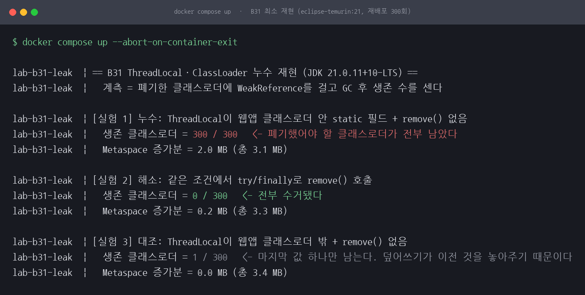
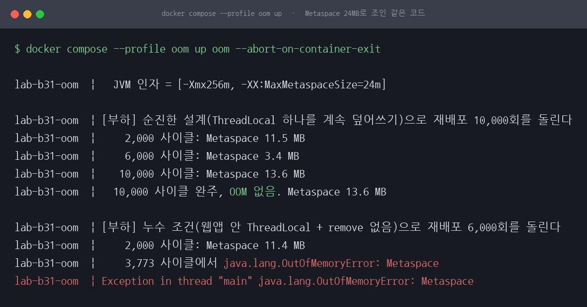
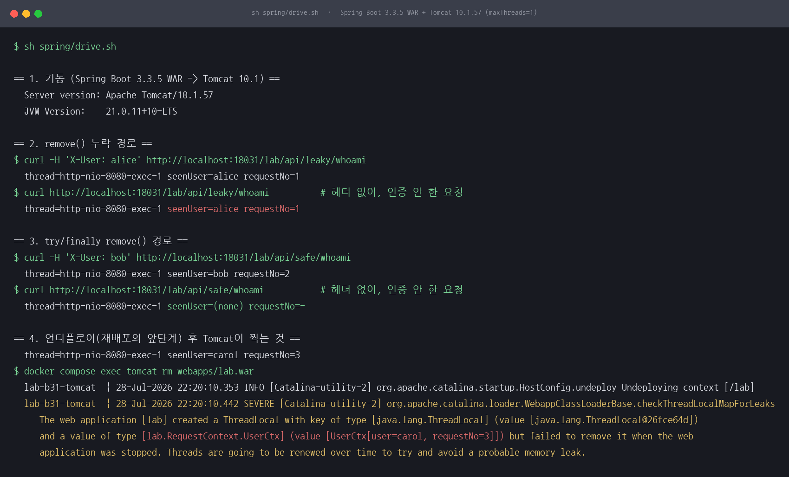
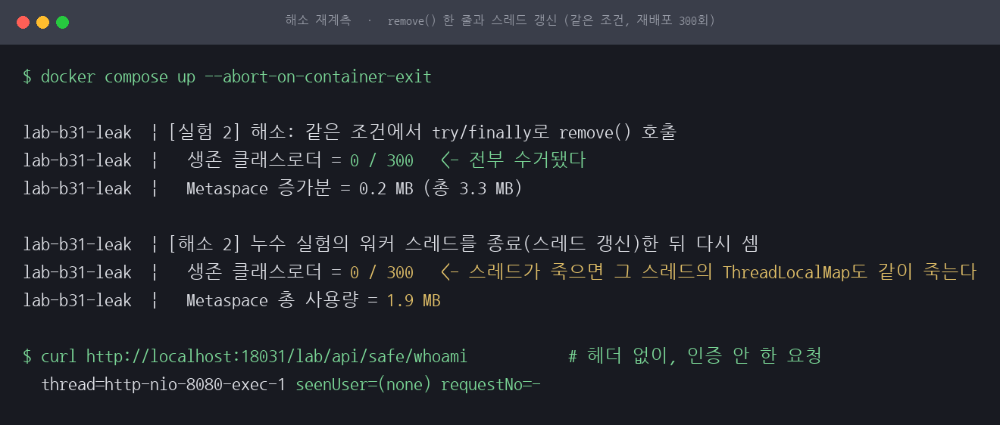
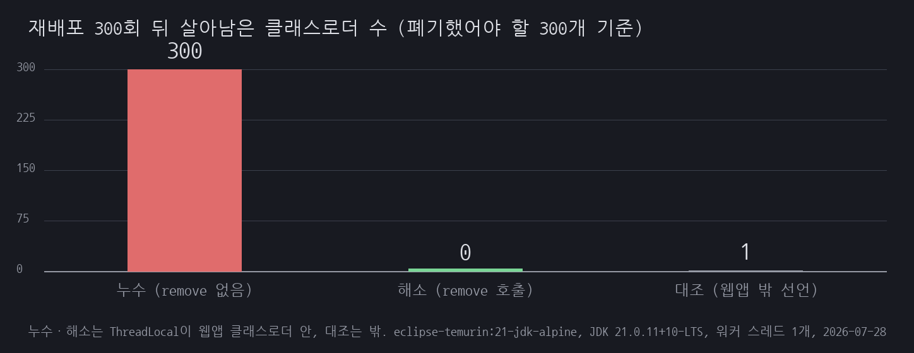

# B31 지우지 않은 ThreadLocal 하나가 클래스로더를 통째로 붙잡는다

## 1. 유명한 이유

Apache Tomcat은 웹앱을 정지할 때 워커 스레드에 남아 있는 `ThreadLocal`을 뒤져 전용 경고를 찍습니다. 메시지 원문이 Tomcat 소스의 `java/org/apache/catalina/loader/LocalStrings.properties`에 있습니다.

```
webappClassLoader.checkThreadLocalsForLeaks=The web application [{0}] created a ThreadLocal
with key of type [{1}] (value [{2}]) and a value of type [{3}] (value [{4}]) but failed to
remove it when the web application was stopped. Threads are going to be renewed over time
to try and avoid a probable memory leak.
```

원문은 한 줄이고 여기서는 폭에 맞춰 접었습니다. 벤더가 이 함정 하나를 위해 탐지 코드와 전용 메시지, 그리고 그 동작을 끄고 켜는 설정(`clearReferencesThreadLocals`)까지 넣어 두었다는 사실이 근거입니다. 근거 등급은 E2입니다. 특정 회사의 공개 포스트모템은 찾지 못했으므로 "어느 회사에서 터진 장애"라고 쓰지 않습니다.

- Apache Tomcat 소스 `java/org/apache/catalina/loader/LocalStrings.properties` (위 메시지 원문)
- [Apache Tomcat 9 Configuration Reference, Context](https://tomcat.apache.org/tomcat-9.0-doc/config/context.html): `clearReferencesThreadLocals` "If `true`, Tomcat attempts to clear `java.lang.ThreadLocal` variables that have been populated with classes loaded by the web application. If not specified, the default value of `true` will be used."
- [Apache Tomcat Wiki, MemoryLeakProtection](https://cwiki.apache.org/confluence/display/TOMCAT/MemoryLeakProtection): "Classloader leaks because of uncleaned ThreadLocal variables are quite common."
- [Apache Tomcat Wiki, OutOfMemory](https://cwiki.apache.org/confluence/display/TOMCAT/OutOfMemory): "Hard references to classes can prevent the garbage collector from reclaiming the memory allocated for them when a ClassLoader is discarded."

인용에서 조심한 것이 하나 있습니다. Tomcat 위키는 이 누수가 채우는 영역을 "PermGen space"라고만 부릅니다. Java 7 시절에 쓰인 문서라 그렇습니다. Java 8부터 PermGen이 없어지고 클래스 메타데이터가 Metaspace로 옮겨졌으므로, JDK 21에서 돌린 이 세션에서 터지는 것은 `OutOfMemoryError: Metaspace`입니다. 원문에 없는 "Metaspace OOM"을 Tomcat 인용처럼 쓰지 않았습니다. 탐지가 Tomcat 몇 버전부터 들어갔는지는 위키 서술 외에 확인하지 못해 버전 수치는 적지 않습니다.

## 2. 재현

### 누수가 나려면 조건 세 개가 동시에 맞아야 합니다

1. 워커 스레드가 재배포 후에도 살아 있을 것 (스레드풀)
2. 재배포마다 클래스로더가 새로 생길 것
3. `ThreadLocal` **객체 자체**가 웹앱 클래스로더 안의 static 필드에 있을 것

3번이 핵심입니다. 이것을 빼고 짜면 재현되지 않습니다. 처음에 그렇게 짰다가 실패한 기록은 6절에 적었습니다.

### 최소 재현: Tomcat도 WAR도 없이

자바 파일 두 개입니다. 웹앱 역할 클래스([app/webapp/RequestContextHolder.java](app/webapp/RequestContextHolder.java))는 `public static final ThreadLocal<Object> CTX`를 들고 있는 흔한 요청 컨텍스트 유틸이고, 실행기([app/LeakLab.java](app/LeakLab.java))는 재배포 한 번을 `URLClassLoader` 하나로 흉내 냅니다. 웹앱 클래스는 실행기 클래스패스 밖에 따로 컴파일하므로 오직 그 `URLClassLoader`만 적재합니다.

계측은 OOM을 기다리지 않습니다. 폐기한 클래스로더마다 `WeakReference`를 걸어 두고 GC 뒤 생존 수를 셉니다. Metaspace 사용량은 `MemoryPoolMXBean`으로 함께 찍습니다. 300 사이클 실행이 30초 안에 끝나고 결과가 딱 떨어집니다. 대조군 셋을 한 실행에서 나란히 측정했습니다. 환경은 eclipse-temurin:21-jdk-alpine, JDK 21.0.11+10-LTS, 워커 스레드 1개, 재배포 300회입니다.

| 조건 | 생존 클래스로더 | Metaspace 증가분 |
|---|---|---|
| ThreadLocal이 웹앱 안 + `remove()` 없음 | **300 / 300** | 2.0 MB |
| 같은 조건 + `try/finally`로 `remove()` | 0 / 300 | 0.2 MB |
| ThreadLocal이 웹앱 **밖** + `remove()` 없음 | 1 / 300 | 0.0 MB |



*그림 1. 세 조건을 한 실행에서 나란히 잰 화면입니다. 조건이 다 맞으면 폐기했어야 할 클래스로더 300개가 전부 남습니다.*

### Metaspace를 좁게 잡으면 실제로 터집니다

`-Xmx256m -XX:MaxMetaspaceSize=24m`으로 고정하고 같은 코드를 돌렸습니다. 힙을 넉넉히 준 것은 힙 OOM이 먼저 터져 원인이 흐려지는 것을 막기 위해서입니다. 누수 조건은 **3,773 사이클에서 `java.lang.OutOfMemoryError: Metaspace`**로 죽었고, 3회 실행에서 지점이 모두 같았습니다. 같은 설정에서 순진한 설계(ThreadLocal이 웹앱 밖)는 10,000 사이클을 완주했습니다.



*그림 2. 같은 JVM 설정에서 위는 10,000회를 완주하고 아래는 3,773회에서 죽습니다. 차이는 ThreadLocal 객체가 어디에 선언돼 있느냐 하나입니다.*

### 실제 스택: Spring Boot WAR를 Tomcat 10.1에 올리고 내리기

최소 재현이 메커니즘을 보여 준다면, 이 버그가 실제로 사는 곳은 WAS입니다. 그래서 Spring Boot 3.3.5 애플리케이션을 WAR로 말아 Apache Tomcat 10.1.57에 배포했습니다([spring/](spring/)). 서블릿 필터가 `X-User` 헤더로 요청 컨텍스트를 심고, 한쪽은 `remove()`를 부르지 않고 한쪽은 `try/finally`로 부릅니다. 워커 스레드는 `maxThreads="1"`로 고정해 두 요청이 반드시 같은 스레드에서 처리되게 했습니다.

메모리가 새기 전에 먼저 데이터가 샙니다. `X-User: alice`로 한 번 호출한 뒤 **헤더 없이** 호출하자 응답이 `seenUser=alice`였습니다. 인증하지 않은 요청이 직전 사용자의 컨텍스트를 그대로 받은 것입니다. `try/finally` 경로에서는 같은 순서로 호출해도 `seenUser=(none)`이었습니다.

그다음 WAR 파일을 지워 언디플로이하자 Tomcat이 1절에 인용한 그 메시지를 SEVERE로 찍었습니다.

```
The web application [lab] created a ThreadLocal with key of type [java.lang.ThreadLocal]
(value [java.lang.ThreadLocal@26fce64d]) and a value of type [lab.RequestContext.UserCtx]
(value [UserCtx[user=carol, requestNo=3]]) but failed to remove it when the web application
was stopped. Threads are going to be renewed over time to try and avoid a probable memory leak.
```

이것도 로그에서는 한 줄이고 폭에 맞춰 접었습니다. 경고가 값의 `toString()`까지 찍기 때문에 마지막 요청의 사용자 이름이 WAS 로그에 그대로 남았습니다. 누수를 알려 주는 메시지가 동시에 사용자 데이터를 로그로 흘리는 셈입니다.



*그림 3. 실제 스택 재현입니다. 헤더 없는 요청이 alice를 보고, 언디플로이에서 Tomcat이 누수를 지목합니다.*

명령과 출력 원문은 [reproduce.md](reproduce.md)에 그대로 남겼습니다.

## 3. 내부 원리

`ThreadLocal`의 값은 `ThreadLocal` 객체가 아니라 **스레드**가 들고 있습니다. 각 `Thread`에 `ThreadLocalMap`이 하나 붙고, 그 엔트리의 키가 `ThreadLocal` 인스턴스입니다. 이 키는 약한참조입니다. 그래서 `ThreadLocal` 객체가 아무 데서도 참조되지 않으면 키가 끊기고, 그 엔트리는 stale이 되어 다음 `set`이나 `get`이 훑고 지나갈 때 정리됩니다. 자바가 이 정도는 알아서 치워 준다는 이야기가 여기서 나옵니다.

문제는 참조가 한 바퀴 돌아올 때입니다. 조건 3번이 맞으면 이렇게 됩니다.

```
워커 스레드 -> ThreadLocalMap -> 엔트리의 값(Ctx 인스턴스)
            -> Ctx.class -> 웹앱 클래스로더 -> RequestContextHolder.class
            -> static 필드 CTX -> 엔트리의 키(ThreadLocal 인스턴스)
```

키가 살아 있는 스레드에서 강하게 도달됩니다. 약한참조는 강한 참조 경로가 하나라도 있으면 끊기지 않으므로 엔트리는 영원히 stale이 되지 않고, 값도 정리되지 않습니다. 값을 붙잡고 있으니 웹앱 클래스로더도, 그 로더가 적재한 클래스 전부도 회수되지 않습니다. 재현 코드의 [구조 확인] 절에서 값 타입과 키를 담은 클래스의 로더가 같은 객체임을 실제로 읽어 출력한 것이 이 고리의 확인입니다.

반대로 `ThreadLocal` 객체가 웹앱 **밖**(컨테이너나 공용 클래스로더)에 있으면 재배포를 몇 번 하든 키가 하나뿐입니다. 매번 같은 엔트리를 덮어쓰므로 직전 값은 참조를 잃고 정상 수거됩니다. 실측에서 300회 중 1개만 살아남은 것이 마지막으로 덮어쓴 값 하나입니다. 이 경우도 값 하나만큼은 새지만, 재배포 횟수에 비례해 쌓이지 않으므로 장애가 되지 않습니다.

폐기되지 않은 클래스로더가 붙잡는 것은 힙이 아니라 클래스 메타데이터입니다. Java 8부터 이 영역이 Metaspace이고, 한 클래스로더가 적재한 메타데이터는 그 로더가 통째로 도달 불가가 될 때만 해제됩니다. 실측에서 클래스 두 개짜리 웹앱이 재배포 1회당 약 7KB(300회에 2.0MB)를 남겼습니다. 클래스가 수천 개인 실제 WAR라면 재배포 몇 번으로 자릿수가 달라집니다.

## 4. 해소

첫째, 심은 자리에서 지웁니다. 서블릿 필터나 인터셉터가 실무에서 하는 일이 이것입니다.

```java
try {
    RequestContext.set(user, requestNo);
    chain.doFilter(req, res);
} finally {
    RequestContext.clear();   // ThreadLocal.remove()
}
```

`finally`가 중요합니다. 컨트롤러가 예외를 던지는 경로에서 정리가 빠지면 그 요청이 처리된 스레드에만 값이 남아, 재현하기 어려운 형태로 문제가 나타납니다. 요청 처리 흐름의 가장 바깥 필터에 두어야 안쪽에서 무슨 일이 생겨도 정리가 실행됩니다. 최소 재현에서 이 한 줄만 넣은 대조군이 300/300에서 0/300이 됐습니다.

둘째, 지금까지 이 문제가 잘 안 보였던 이유를 짚어 둘 필요가 있습니다. **막아 주고 있던 것은 JVM이 아니라 WAS입니다.** Tomcat은 `clearReferencesThreadLocals`의 기본값이 `true`이고(위 Tomcat 9 문서), 경고 문구 자체가 "Threads are going to be renewed over time"이라고 말합니다. 스레드를 갱신하면 실제로 회수되는지를 최소 재현에서 직접 확인했습니다(Tomcat의 구현을 검증한 것이 아니라, 스레드 갱신이라는 수단이 통하는지를 잰 것입니다). 누수 실험의 워커 스레드를 종료하자 생존 클래스로더가 300에서 0이 되고 Metaspace 총 사용량이 3.4MB에서 1.9MB로 떨어졌습니다. 스레드가 죽으면 그 스레드의 `ThreadLocalMap`도 같이 죽기 때문입니다. 애플리케이션 코드가 `remove()`를 빼먹어도 컨테이너가 스레드를 갈아 끼우며 뒤를 닦아 주고 있었던 것입니다.

셋째, 그 보호장치가 조용히 꺼질 수 있습니다. JDK 9 이상에서는 `--add-opens=java.base/java.lang=ALL-UNNAMED`가 없으면 Tomcat이 `ThreadLocalMap`을 들여다볼 수 없어 누수 탐지 자체가 동작하지 않습니다. 그 줄을 지우고 같은 시나리오를 다시 돌리자 누수 경고 대신 이 메시지만 나왔습니다.

```
You need to add "--add-opens=java.base/java.lang=ALL-UNNAMED" to the JVM command line
arguments to enable ThreadLocal memory leak detection. Alternatively, you can suppress
this warning by disabling ThreadLocal memory leak detection.
```

Tomcat 10.1의 `bin/catalina.sh`는 이 옵션을 기본으로 붙이지만, 기동 스크립트를 직접 쓰거나 JVM 옵션을 손보는 환경이라면 빠질 수 있습니다. 로그에 누수 경고가 없다는 것이 누수가 없다는 뜻은 아닙니다.

넷째, 애초에 스레드에 상태를 남기지 않는 선택지도 있습니다. 요청 범위 객체를 파라미터로 넘기거나 프레임워크의 요청 스코프 빈을 쓰면 정리 책임이 컨테이너로 넘어갑니다. 다만 기존 코드에서 `ThreadLocal`을 걷어내는 비용이 크므로, 이 세션에서는 `try/finally` 쪽만 실측했습니다.

## 5. 재계측

같은 조건, 같은 재배포 300회에서 해소 방식을 다시 쟀습니다.

```
[실험 2] 해소: 같은 조건에서 try/finally로 remove() 호출
  생존 클래스로더 = 0 / 300   <- 전부 수거됐다
  Metaspace 증가분 = 0.2 MB (총 3.3 MB)

[해소 2] 누수 실험의 워커 스레드를 종료(스레드 갱신)한 뒤 다시 셈
  생존 클래스로더 = 0 / 300   <- 스레드가 죽으면 그 스레드의 ThreadLocalMap도 같이 죽는다
  Metaspace 총 사용량 = 1.9 MB
```



*그림 4. 해소 재계측입니다. `remove()` 한 줄로 0/300이 되고, 스레드를 갱신하면 이미 새어 있던 300개도 회수됩니다. 노랑은 안전장치가 대신 막아 준 지점입니다.*

`remove()`를 부른 경로는 생존 0개, Metaspace 증가분 0.2MB입니다. 누수 경로의 2.0MB와 비교하면 남는 것은 실행 자체의 잡음 수준입니다. 이미 새어 있던 300개도 워커 스레드를 종료하자 전부 회수되어, Metaspace 총 사용량이 3.4MB에서 1.9MB로 내려갔습니다.

실제 스택에서도 같은 결과입니다. `try/finally` 경로는 `X-User: bob`으로 호출한 뒤 헤더 없이 호출했을 때 `seenUser=(none)`을 돌려주었고, 같은 스레드(`http-nio-8080-exec-1`)에서 처리됐습니다. 유출이 사라진 것이 스레드가 바뀌어서가 아니라 정리가 됐기 때문임을 스레드 이름으로 확인할 수 있습니다.



*그림 5. 재배포 300회 뒤 살아남은 클래스로더 수입니다. 조건 하나를 바꿀 때마다 결과가 300, 0, 1로 갈립니다.*

## 6. 예상과 달랐던 점

**순진하게 짠 첫 버전은 재현에 실패했습니다.** 처음에는 워커 스레드 하나에 매 사이클 새 클래스로더를 만들고 `remove()`를 빼면 샐 것이라고 봤습니다. 3,000 사이클을 돌려도 OOM이 나지 않았습니다. 나중에 Metaspace를 24MB로 조여 10,000 사이클까지 돌려도 완주했습니다. 이유는 그 설계에서 `ThreadLocal` 객체가 실행기 쪽(웹앱 밖)에 있었기 때문입니다. 키가 하나뿐이니 매번 같은 엔트리를 덮어썼고, 직전 값만 남고 이전 것들은 정상 수거됐습니다. 이 실패가 곧 대조군 3(생존 1/300)이 됐습니다. `ThreadLocal` 선언을 웹앱 클래스 안으로 옮기고 나서야 300/300이 됐고, 같은 24MB 설정에서 3,773 사이클에 `OutOfMemoryError: Metaspace`가 났습니다. 조건 목록의 3번은 처음부터 알고 쓴 것이 아니라 실패해서 알게 된 것입니다.

**Metaspace 사용량은 누수 판정 근거로 약했습니다.** 순진한 설계로 10,000 사이클을 돌리는 동안 Metaspace가 11.5MB, 9.7MB, 3.4MB, 13.1MB로 오르내렸습니다. 메타데이터가 실제로 회수되고 있다는 뜻입니다. 누수 조건에서는 한 방향으로만 올랐습니다. 그래프가 톱니 모양이면 정상이고 단조 증가면 의심이라는 판정은 결국 여러 사이클을 봐야 나오는데, 약한참조 생존 수는 300 사이클 한 번으로 300 대 0 대 1을 바로 보여 주었습니다. 계측 방법을 바꾼 것이 이 세션에서 가장 이득이었습니다.

**Spring Boot 자신도 하나 남겼습니다.** 언디플로이 로그에 누수 경고가 두 건 나왔는데, 하나는 우리 필터가 남긴 `lab.RequestContext.UserCtx`였고 다른 하나는 `org.springframework.boot.SpringBootExceptionHandler`였습니다. 프레임워크가 스스로 한 건을 남기고 Tomcat이 그것도 지목한 것입니다. 이 함정이 "실수한 사람만 밟는 것"이 아니라는 증거로 봤습니다. 다만 이것이 Spring Boot의 결함인지 의도된 설계인지는 확인하지 못했으므로, 관측 사실까지만 적습니다.

**경고가 없다는 것이 안전하다는 뜻은 아니었습니다.** `--add-opens=java.base/java.lang=ALL-UNNAMED`를 뺀 채로 같은 시나리오를 돌리자 누수 경고가 통째로 사라지고 "옵션을 추가하라"는 안내만 남았습니다. 새는 코드는 그대로인데 로그만 조용해집니다. 탐지가 리플렉션에 의존하고 있어서 생기는 일이라, JDK를 올리면서 JVM 옵션을 정리한 팀이 자기도 모르게 탐지를 끄게 될 수 있습니다.

**막아 주던 주체가 JVM이 아니었습니다.** 이 문제가 흔한데도 대형 장애로 잘 안 번지는 이유를 처음에는 GC가 어떻게든 처리해 주기 때문이라고 생각했습니다. 실측은 반대였습니다. GC는 참조 고리가 살아 있는 한 아무것도 하지 않았고, 워커 스레드를 죽이자 그 즉시 300개가 전부 회수됐습니다. Tomcat 경고문의 "Threads are going to be renewed over time"이 바로 그 회수 경로입니다. 애플리케이션이 아니라 WAS가 뒤를 닦아 주고 있었고, 그래서 WAS 밖에서 직접 만든 스레드풀이나 `clearReferencesThreadLocals`를 끈 환경에서는 같은 코드가 그대로 장애가 됩니다.

## 한계

Tomcat에서 재배포를 반복해 실제 Metaspace OOM까지 몰고 가지는 않았습니다. 실제 스택 쪽은 언디플로이 1회와 경고 관측까지이고, OOM은 최소 재현에서만 봤습니다. `clearReferencesThreadLocals="false"`로 두었을 때 재배포 몇 번에 Tomcat이 무너지는지도 재지 않았습니다.

참조 경로를 힙 덤프의 GC root path로 확인하지 않았습니다. 약한참조 생존 수와 Metaspace 사용량, 그리고 코드에서 읽어 낸 클래스로더 동일성까지가 이 세션의 증거입니다.

인용한 `clearReferencesThreadLocals` 기본값은 Tomcat 9 문서에서 확인한 것이고, 실제 실행은 Tomcat 10.1.57입니다. 10.1 문서를 따로 열어 대조하지는 않았습니다. 실행 로그에서 확인한 것은 그 버전이 같은 경고를 찍는다는 사실까지입니다.

MDC(SLF4J)나 Spring의 요청 스코프처럼 실무에서 자주 쓰는 다른 `ThreadLocal` 사용처는 확인하지 않았습니다. 비동기 처리나 `CompletableFuture`로 스레드를 넘나드는 경로에서 컨텍스트가 어떻게 되는지도 이 세션의 범위 밖입니다.

실제 스택 재현은 워커 스레드를 1개로 고정한 조건입니다. 스레드가 여럿인 실제 환경에서는 요청이 흩어지므로 컨텍스트 유출이 확률적으로 나타나고, 그래서 오히려 재현과 원인 규명이 어려워집니다. 이 세션의 `seenUser=alice`는 조건을 고정해 결정적으로 만든 결과입니다.
