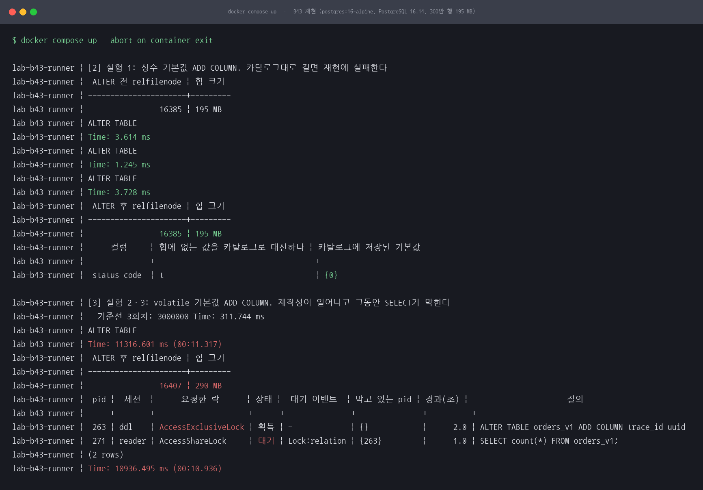
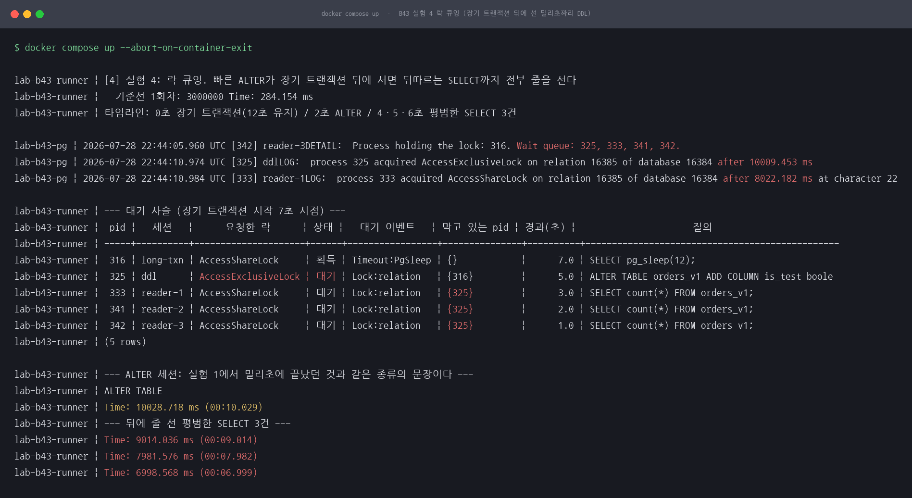
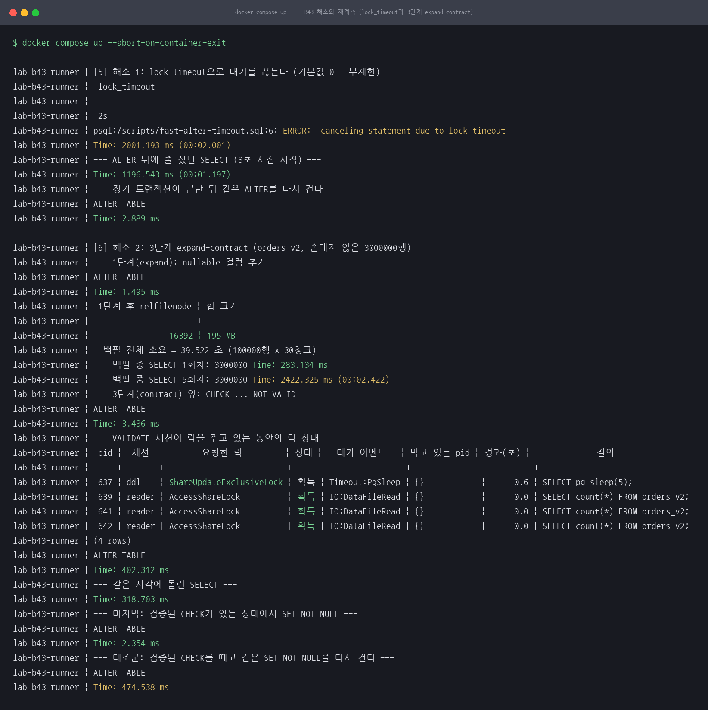
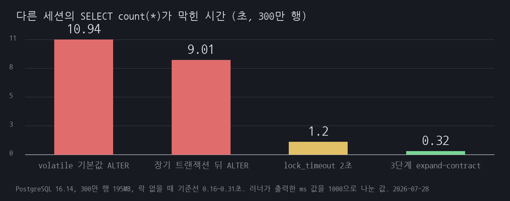
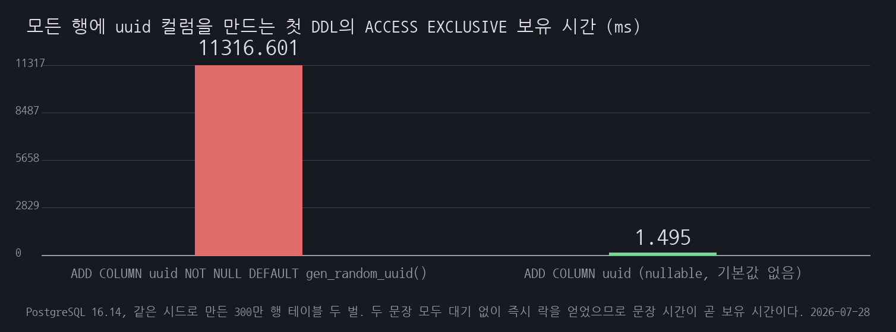

# B43 빠른 DDL과 안전한 DDL은 다르다

## 1. 유명한 이유

PostgreSQL 공식 문서 [ALTER TABLE](https://www.postgresql.org/docs/current/sql-altertable.html)은 첫머리에서 이렇게 못 박습니다. "Note that the lock level required may differ for each subform. An **ACCESS EXCLUSIVE** lock is acquired unless explicitly noted." 예외로 명시된 것은 `ADD FOREIGN KEY`, `SET STATISTICS`, `VALIDATE CONSTRAINT` 같은 몇 가지뿐이고 `ADD COLUMN`은 그 목록에 없습니다.

[Explicit Locking](https://www.postgresql.org/docs/current/explicit-locking.html) 문서는 ACCESS EXCLUSIVE가 "Conflicts with locks of all modes"이며 "The SELECT command acquires a lock of this mode on referenced tables"(ACCESS SHARE)라고 적습니다. 두 문장을 이으면 결론은 하나입니다. 컬럼을 하나 붙이는 동안 그 테이블은 읽기조차 되지 않습니다.

여기까지가 실무에서 흔히 인용되는 이야기이고, 그래서 "수백만 행 테이블에 컬럼 추가는 위험하다"는 조언이 돌아다닙니다. 그런데 같은 문서의 Notes 절은 정반대 방향의 문장을 담고 있습니다. "When a column is added with `ADD COLUMN` and a non-volatile `DEFAULT` is specified, the default value is evaluated at the time of the statement and the result stored in the table's metadata... **making the ALTER TABLE very fast even on large tables.** ... In neither case is a rewrite of the table required."

이 동작은 [PostgreSQL 11 릴리스 노트](https://www.postgresql.org/docs/release/11.0/)(2018-10-18)에 들어왔습니다. "Allow ALTER TABLE to add a column with a non-null default without doing a table rewrite... This is enabled when the default value is a constant."

마지막 조각은 [Client Connection Defaults](https://www.postgresql.org/docs/current/runtime-config-client.html)에 있습니다. "`lock_timeout` ... **A value of zero (the default) disables the timeout.**" 락을 기다리는 시간에 상한이 없는 것이 기본값입니다.

근거 등급은 **E2**입니다. 특정 회사의 공개 장애가 아니라 벤더 공식 문서가 조건을 명시해 경고하는 함정입니다. 이 세션은 문서가 말하는 조건을 하나씩 실행해 어디까지가 참이고 어디부터 옛날 지식인지를 가릅니다.

카탈로그의 나머지 절반, 그러니까 "컬럼 추가와 삭제 순서가 뒤집히면 배포 중에 없는 컬럼을 참조한다"는 주장은 이번 조사에서 아무 출처도 확보하지 못했습니다. 그래서 이 세션에서는 다루지 않았습니다.

## 2. 재현

무대는 PostgreSQL의 락 관리자이므로 애플리케이션 계층을 얹지 않고 postgres:16-alpine 하나로 재현했습니다. 러너가 같은 이미지의 psql로 여러 세션을 sleep 간격에 맞춰 띄워 대기 사슬을 만듭니다. `docker compose up --abort-on-container-exit` 한 번이면 전 실험이 순서대로 돕니다.

환경은 PostgreSQL 16.14, 2 vCPU / 11.3 GB RAM 공유 서버입니다. `generate_series(1, 3000000)`에서 파생한 결정적 시드로 주문 테이블 두 벌을 만들었습니다. 힙 195 MB, 인덱스 포함 260 MB이고, `orders_v1`은 문제 방식용, `orders_v2`는 해소 방식용입니다. 두 벌이 같아야 전후 비교가 성립합니다.

**실험 1은 카탈로그가 시킨 대로 그냥 걸어 봤습니다.** `ADD COLUMN status_code integer NOT NULL DEFAULT 0`을 300만 행 테이블에 겁니다. 같은 형태로 세 번 연달아 재서 3.614 / 1.245 / 3.728 ms가 나왔습니다. 재현에 실패한 것입니다. `relfilenode`는 16385 그대로이고 힙도 195 MB 그대로입니다. 300만 행 중 한 행도 다시 쓰지 않았다는 뜻입니다. 그러면서 `SELECT count(*) FROM orders_v1 WHERE status_code = 0`은 3,000,000을 돌려줍니다.

기본값을 아예 주지 않고 NOT NULL만 붙이면 `ERROR: column "must_fail" of relation "orders_v1" contains null values`로 즉시 거절당합니다(1.792 ms). 이 동작은 공식 문서 원문을 찾지 못해 직접 실행해 확인했습니다.

**실험 2에서 기본값만 volatile 함수로 바꿨습니다.** `ADD COLUMN trace_id uuid NOT NULL DEFAULT gen_random_uuid()`는 11,316.601 ms가 걸렸습니다. `relfilenode`가 16385에서 16407로 바뀌었고 힙은 195 MB에서 290 MB로 늘었습니다. 파일이 새로 만들어졌으니 테이블 재작성입니다. 상수 기본값의 3 ms와 3,000배 차이인데, 문장에서 달라진 것은 `DEFAULT` 뒤의 값 하나뿐입니다.

**실험 3은 그동안 다른 세션이 어떻게 되는지 봤습니다.** ALTER가 도는 중에 평범한 `SELECT count(*)`를 걸면 10,936.495 ms가 나옵니다. 락이 없을 때 같은 질의는 245.235 ms에서 311.744 ms 사이이므로 35배입니다. 서버 로그도 같은 이야기를 합니다. `process 271 acquired AccessShareLock ... after 10222.584 ms`. `pg_locks`를 찍어 보면 ddl 세션이 `AccessExclusiveLock`을 획득한 상태이고 reader 세션은 `AccessShareLock`을 대기 중이며, `pg_blocking_pids()`가 ddl의 pid를 가리킵니다.

*그림 1. 위쪽이 상수 기본값입니다. 300만 행인데 밀리초에 끝나고 relfilenode도 힙 크기도 그대로입니다. 아래쪽이 volatile 기본값입니다. relfilenode가 바뀌고 힙이 95 MB 늘고, 그동안 평범한 SELECT가 10.9초를 기다립니다.*

**실험 4가 이 세션의 하이라이트입니다.** 실험 1에서 3 ms에 끝난 것과 같은 종류의 ALTER를 걸되, 앞에 12초짜리 트랜잭션이 ACCESS SHARE를 쥐고 있게 했습니다. 그 뒤에 평범한 `SELECT count(*)` 세 건을 1초 간격으로 넣었습니다.

결과는 ALTER 10,028.718 ms, 뒤따른 SELECT 세 건이 9,014.036 / 7,981.576 / 6,998.568 ms입니다. 기준선은 276.798에서 284.154 ms입니다. 32배가 밀렸습니다.

중요한 것은 누가 누구를 막았느냐입니다. 장기 트랜잭션이 쥔 것은 ACCESS SHARE라서 뒤따르는 SELECT의 ACCESS SHARE와 충돌하지 않습니다. 원래대로면 SELECT들은 그냥 통과해야 합니다. 그런데 `pg_blocking_pids()`는 세 SELECT 모두 ALTER의 pid(325)에 막혀 있다고 답합니다. 서버가 남긴 대기 큐도 같습니다. `Wait queue: 325, 333, 341, 342`. ALTER가 큐 맨 앞에 서자 그 뒤로 들어온 요청이 전부 줄을 섰습니다.

*그림 2. 장기 트랜잭션(316)은 ACCESS SHARE만 쥐고 있는데도 전체가 멈췄습니다. 막고 있는 pid 칸을 보면 SELECT 세 건을 막는 것은 316이 아니라 그 앞에 끼어든 ALTER(325)입니다.*

명령과 출력 원문은 [reproduce.md](reproduce.md)에 그대로 남겼습니다.

## 3. 내부 원리

상수 기본값이 빠른 이유는 값을 힙에 쓰지 않기 때문입니다. `pg_attribute`를 찍어 보면 `atthasmissing = t`이고 `attmissingval = {0}`입니다. 기존 행에는 이 컬럼의 자리가 아예 없고, 읽을 때 그 자리가 비어 있으면 카탈로그에 저장된 값 한 벌을 대신 돌려줍니다. 그래서 300만 행이든 3억 행이든 카탈로그 한 줄을 고치는 시간만 듭니다. 문서가 "very fast even on large tables"라고 쓴 것이 이 뜻입니다.

`gen_random_uuid()`는 이 수법을 쓸 수 없습니다. 행마다 다른 값이 나와야 하므로 카탈로그에 한 벌만 저장할 수가 없습니다. 그래서 새 파일을 만들고 300만 행을 옮겨 적습니다. 실측에서 `atthasmissing = f`이고 `attmissingval`이 비어 있는 것, `relfilenode`가 바뀐 것이 그 증거입니다. 힙이 195 MB에서 290 MB로 는 것은 uuid 16바이트에 정렬 여유가 붙은 결과입니다.

재작성은 그 자체로 오래 걸리는 것이 문제가 아니라 그동안 ACCESS EXCLUSIVE를 놓지 않는 것이 문제입니다. 문서가 적은 대로 이 모드는 모든 모드와 충돌하고, SELECT의 ACCESS SHARE도 예외가 아닙니다. 실험 3의 10.9초가 그 결과입니다.

실험 4의 락 큐잉은 조금 다른 이야기입니다. PostgreSQL은 락 요청을 큐로 관리하고, 앞에 충돌하는 요청이 대기 중이면 뒤에 온 요청이 서로 호환되더라도 그냥 통과시키지 않습니다. 만약 통과시키면 ACCESS SHARE가 끊임없이 들어오는 동안 ACCESS EXCLUSIVE는 영원히 못 들어가기 때문입니다. 굶주림을 막는 대신 머리 하나가 막히면 줄 전체가 멈춥니다. 실측한 `pg_blocking_pids()` 결과와 서버가 찍은 `Wait queue: 325, 333, 341, 342`가 이 순서를 그대로 보여 줍니다.

이 큐 동작을 명시한 공식 문서 문장은 이번에 확보하지 못했습니다. 그래서 위 설명은 실측한 대기 사슬과 서버 로그로만 뒷받침합니다.

여기에 `lock_timeout` 기본값 0이 겹칩니다. 대기에 상한이 없으므로 ALTER는 장기 트랜잭션이 커밋할 때까지 무한정 기다리고, 그 뒤에 줄 선 요청도 같이 기다립니다. 장기 트랜잭션이 30분짜리였다면 서비스는 30분 동안 그 테이블을 읽지 못합니다.

## 4. 해소

두 축으로 갈립니다. 대기를 끊는 쪽과 락 자체를 짧게 만드는 쪽입니다. 둘은 대체재가 아니라 같이 쓰는 것입니다.

**첫째, `lock_timeout`으로 대기를 끊습니다.** 세션 단위로 겁니다. 공식 문서가 "Setting `lock_timeout` in `postgresql.conf` is not recommended because it would affect all sessions"라고 적은 대로, 마이그레이션 세션에서만 `SET lock_timeout = '2s'`를 겁니다.

같은 타임라인에서 ALTER 세션에만 이 한 줄을 넣었더니 ALTER는 2,001.193 ms 만에 `ERROR: canceling statement due to lock timeout`으로 물러났고, 그 뒤에 줄 섰던 SELECT는 1,196.543 ms에 끝났습니다. 걸지 않았을 때의 9,014.036 ms와 비교하면 7.5분의 1입니다. 곧이어 들어온 SELECT는 470.685 ms로 정상입니다.

대신 ALTER는 실패합니다. 그래서 이것은 절반짜리 해소이고 재시도가 세트로 따라와야 합니다. 장기 트랜잭션이 끝난 뒤 같은 문장을 다시 걸었더니 2.889 ms에 끝났습니다. 실무에서는 백오프를 두고 여러 번 시도하는 형태가 됩니다.

**둘째, 마이그레이션을 3단계로 쪼갭니다.** 목표는 실험 2와 같습니다. 모든 행에 uuid 값이 든 NOT NULL 컬럼을 만드는 것입니다. 손대지 않은 `orders_v2`에서 이렇게 했습니다.

1. `ALTER TABLE orders_v2 ADD COLUMN trace_id uuid`. 기본값이 없으니 카탈로그에 저장할 값조차 없고, 힙은 한 바이트도 건드리지 않습니다. 1.495 ms. `relfilenode`는 16392 그대로입니다.
2. 10만 행씩 30청크로 `UPDATE`. 청크마다 커밋합니다. 전체 39.522초가 걸렸지만 테이블 락이 아니라 행 락만 잡고, 청크가 끝날 때마다 놓습니다. 백필이 도는 동안 `SELECT count(*)`를 여덟 번 재서 283.134 ms에서 2,422.325 ms 사이가 나왔습니다. 락 때문이 아니라 같은 디스크를 두고 경쟁한 결과이고, 이 서버는 2 vCPU라 IO가 몰리면 이만큼 흔들립니다.
3. `ADD CONSTRAINT ... CHECK (trace_id IS NOT NULL) NOT VALID` 뒤에 `VALIDATE CONSTRAINT`. `NOT VALID`는 기존 행을 검사하지 않으므로 테이블을 읽지 않고 3.436 ms에 끝납니다. 락은 `pg_locks`에 직접 물어본 대로 `AccessExclusiveLock`이지만 쥐고 있는 시간이 밀리초입니다. 검사는 `VALIDATE CONSTRAINT`가 따로 하고, 이쪽 락은 `ShareUpdateExclusiveLock`이라 SELECT와 충돌하지 않습니다.

락 수준을 추측하지 않으려고 `VALIDATE CONSTRAINT`를 명시 트랜잭션 안에서 실행하고 커밋 전에 5초를 붙들었습니다. 그 사이 다른 세션이 읽기를 세 번 돌렸습니다. `pg_locks` 스냅샷에서 ddl 세션은 `ShareUpdateExclusiveLock` 획득, 읽기 세 건은 `AccessShareLock` 획득이고 `막고 있는 pid`가 전부 비어 있습니다. VALIDATE 자체는 402.312 ms, 같은 시각의 SELECT는 318.703 ms로 기준선(158.454에서 172.575 ms)의 두 배 이내입니다. 막힌 것이 아니라 같이 디스크를 읽은 것입니다.

마지막으로 컬럼에 `SET NOT NULL`을 걸었습니다. 2.354 ms입니다. 이 값만 보고 "검증된 CHECK가 있으면 전체 스캔을 건너뛴다"고 쓰면 추측이 되므로 대조군을 만들었습니다. 같은 테이블, 같은 컬럼, 같은 데이터에서 NOT NULL을 풀고 CHECK 제약만 지운 뒤 다시 걸었더니 474.538 ms가 나왔습니다. 202배입니다. 검증된 CHECK가 있을 때 이 문장이 테이블을 다시 훑지 않는다는 것을 이 서버에서 확인했습니다.

정리하면 이렇습니다. 한 방 ALTER는 11.3초 동안 ACCESS EXCLUSIVE를 쥡니다. 3단계는 가장 오래 락을 쥐는 문장이 3.436 ms입니다.

## 5. 재계측

같은 300만 행에서 잰 값입니다. 비교하는 축은 전체 소요 시간이 아니라 최대 락 보유 시간과 그동안 SELECT가 막힌 시간입니다.

| 축 | 한 방 volatile ALTER | 3단계 expand-contract |
|---|---|---|
| 최대 ACCESS EXCLUSIVE 보유 | 11,316.601 ms | 3.436 ms |
| 그동안 SELECT가 막힌 시간 | 10,936.495 ms | 0 ms (서버 로그에 orders_v2 락 대기 0건) |
| 그 사이 SELECT 실측 | 10,936.495 ms | 283.134 ~ 2,422.325 ms |
| 락 없을 때 SELECT 기준선 | 245.235 ~ 311.744 ms | 158.454 ~ 172.575 ms |
| 전체 소요 | 11.3 초 | 39.9 초 |
| 끝난 뒤 힙 크기 | 290 MB | 437 MB |

락 큐잉 쪽 전후는 이렇습니다.

| 축 | lock_timeout 없음 (기본값 0) | lock_timeout = 2s |
|---|---|---|
| ALTER | 10,028.718 ms 뒤 성공 | 2,001.193 ms 뒤 취소 |
| 뒤에 줄 선 SELECT | 9,014.036 / 7,981.576 / 6,998.568 ms | 1,196.543 ms |
| 물러난 뒤 들어온 SELECT | 해당 없음 | 470.685 ms |
| 재시도 | 해당 없음 | 2.889 ms |

*그림 3. 노란 부분이 안전장치가 발동한 지점입니다. lock_timeout이 ALTER를 2초에 끊고, 대조군의 SET NOT NULL이 474.538 ms로 전체 스캔의 값을 보여 줍니다. 초록은 막아낸 지점입니다. VALIDATE가 SHARE UPDATE EXCLUSIVE를 쥔 채로 읽기 세 건이 나란히 락을 획득했고 막고 있는 pid가 전부 비어 있습니다.*

*그림 4. 같은 300만 행에서 다른 세션의 SELECT count(*)가 막힌 시간입니다. 락 없을 때 기준선은 0.16초에서 0.31초 사이입니다.*

*그림 5. 같은 목표를 이루는 첫 DDL 한 문장이 ACCESS EXCLUSIVE를 쥔 시간입니다. 두 문장 모두 대기 없이 즉시 락을 얻었으므로 문장 시간이 곧 보유 시간입니다.*

전체 소요는 3단계가 3.5배 깁니다(11.3초 대 39.9초). 이 결과를 감추지 않는 이유는 그것이 이 방식의 값이기 때문입니다. 파는 것은 총 시간이고 사는 것은 무중단입니다. 한 방 ALTER는 11.3초 동안 서비스가 그 테이블을 읽지 못하고, 3단계는 40초 동안 서비스가 계속 돕니다.

## 6. 예상과 달랐던 점

**PG 11 이후로 "대형 테이블 ADD COLUMN 조심"의 상당 부분이 옛날 지식이 됐습니다.** 카탈로그가 적은 대로 300만 행에 상수 기본값 NOT NULL 컬럼을 걸었더니 3 ms에 끝났습니다. 재현하려던 장애가 재현되지 않았습니다. 위험 구간은 volatile 기본값, 타입 변경, 기존 컬럼에 대한 NOT NULL이나 CHECK 추가로 좁아졌습니다. 세션을 짜기 전에 이 조건을 확인하지 않았다면 "300만 행에 컬럼 추가했더니 3 ms"라는 김빠진 결과만 남았을 것입니다.

**그런데 빠른 DDL이 안전한 DDL은 아니었습니다.** 이게 가장 크게 어긋난 지점입니다. 실험 1에서 3 ms에 끝난 것과 완전히 같은 문장이, 앞에 12초짜리 트랜잭션 하나가 있다는 이유로 뒤따르는 평범한 SELECT 세 건을 각각 7초에서 9초씩 세웠습니다. 심지어 그 장기 트랜잭션이 쥔 락은 SELECT와 충돌하지도 않는 ACCESS SHARE입니다. 막은 것은 중간에 끼어든 DDL입니다. 락 보유 시간이 짧은 것과 안전한 것은 다른 이야기이고, 배포 창을 잡을 때 봐야 하는 것은 DDL의 실행 시간이 아니라 그 순간 열려 있는 가장 오래된 트랜잭션입니다.

**`lock_timeout` 기본값이 0이라는 것도 다시 보게 됐습니다.** 타임아웃이라는 이름이 붙었으니 어떤 기본값이 있을 것 같은데 무제한입니다. 문장 하나가 락을 못 얻으면 영원히 기다리고, 그 뒤에 들어온 모든 요청이 같이 기다립니다. `statement_timeout`을 걸어 뒀더라도 그것은 다른 문제이고, 락 대기는 `lock_timeout`이 따로 있어야 끊깁니다.

**expand-contract는 공짜가 아니라 테이블을 더 크게 만듭니다.** 이건 예상하지 못했습니다. 같은 300만 행을 같은 목표로 처리했는데 한 방 ALTER는 290 MB로 끝났고 3단계는 437 MB가 됐습니다. 청크 백필이 모든 행을 새 버전으로 다시 쓰기 때문입니다. 백필 직후 죽은 튜플이 2,999,730개였고 autovacuum은 아직 돌기 전이었습니다. 락 시간을 3,000분의 1로 줄이는 대가로 디스크를 1.5배 쓰고, 그 뒤로 autovacuum이 정리할 때까지 부풀어 있습니다. 큰 테이블에서는 백필 자체를 나눠 돌리고 `VACUUM` 계획까지 같이 세워야 합니다.

**측정 도중에 배운 것도 있습니다.** 처음 몇 회차에서 상수 기본값 ALTER가 45 ms, 496 ms로 튀었습니다. 코드 문제가 아니라 시드가 만든 체크포인트가 아직 flush 중이었기 때문입니다. 밀리초짜리 DDL도 커밋할 때 WAL fsync를 기다리므로 디스크가 바쁘면 문장 시간이 수백 ms로 부풀어 오릅니다. 같은 회차에서 롤백으로 끝난 ALTER(기본값 없는 NOT NULL)는 1.386 ms였습니다. 커밋 fsync가 없었기 때문입니다. 시드 끝에 `CHECKPOINT`를 한 번 넣고 나서야 3 ms대로 안정됐습니다. 회차별 수치는 [reproduce.md](reproduce.md) 끝에 표로 남겼습니다.

**autovacuum도 DDL 앞을 막습니다.** 한 회차에서 밀리초여야 할 `ADD CONSTRAINT ... NOT VALID`가 1,010 ms 걸렸는데, 그중 1,003 ms가 락 대기였습니다. 백필이 남긴 죽은 튜플을 autovacuum이 청소하던 중이었고 서버가 `canceling autovacuum task`로 그것을 취소한 뒤에야 락을 줬습니다. 서버가 알아서 양보시켜 주기는 하지만 그 판단이 `deadlock_timeout`(기본 1초) 뒤에 일어나므로 1초는 그냥 나갑니다. 백필 직후에 DDL을 붙이는 순서라면 이 1초를 계산에 넣어야 합니다. 이 장면은 매 실행 재현되지 않아 해당 회차 로그를 [results/other-runs-excerpt.txt](results/other-runs-excerpt.txt)에 따로 남겼습니다.

## 한계

락 큐잉(head-of-line blocking)의 동작을 명시한 공식 문서 문장은 찾지 못했습니다. Explicit Locking 문서는 "충돌한다"까지만 말합니다. 이 세션의 설명은 실측한 `pg_locks` 대기 사슬, `pg_blocking_pids()` 결과, 서버가 찍은 `Wait queue` 로그로만 뒷받침합니다. 문서 근거가 있는 것처럼 읽히지 않게 3절에 따로 적었습니다.

카탈로그 주장의 앞부분인 "컬럼 추가와 삭제 순서가 뒤집히면 배포 중 없는 컬럼을 참조한다"는 재현하지 않았습니다. 애플리케이션 배포와 스키마 변경의 순서 문제라 이 세션의 무대인 락 관리자와는 다른 층이고, 조사에서 출처도 확보하지 못했습니다.

MySQL과 비교하지 않았습니다. MySQL 8.0의 `ALGORITHM=INSTANT`가 비슷한 문제를 어떻게 다루는지, 메타데이터 락의 큐 동작이 PostgreSQL과 같은지는 확인하지 않았습니다.

이 세션의 트래픽은 sleep으로 짠 세션 몇 개입니다. 초당 수천 건이 들어오는 상황에서 락 큐가 얼마나 빨리 자라는지, 커넥션 풀이 먼저 마르는지는 재현하지 않았습니다. 실무에서 이 문제가 장애로 보이는 경로는 대개 "SELECT가 느려졌다"가 아니라 "커넥션 풀이 다 찼다"인데, 그 연결 고리까지는 다루지 못했습니다.

수치는 2 vCPU 공유 서버의 값입니다. 디스크를 쓰는 항목(volatile ALTER, 백필, VALIDATE)은 실행마다 흔들렸고 다섯 회차의 값을 [reproduce.md](reproduce.md)에 전부 적었습니다. 다만 전문 로그로 남긴 것은 마지막 회차와 2회차 발췌뿐이고, 앞선 회차의 값은 실행 화면에서 옮겨 적은 것입니다. 락 대기에서 나오는 항목은 sleep 타임라인이 결정하므로 다섯 회차가 거의 같았습니다. 비교해야 할 것은 절대 시간이 아니라 같은 실행 안에서의 배율입니다.

복제나 논리 복제 슬롯이 있는 환경은 다루지 않았습니다. 대기 중인 ACCESS EXCLUSIVE가 스탠바이의 쿼리와 어떻게 상호작용하는지, `max_standby_streaming_delay`가 어떻게 얽히는지는 이 세션 밖입니다.
