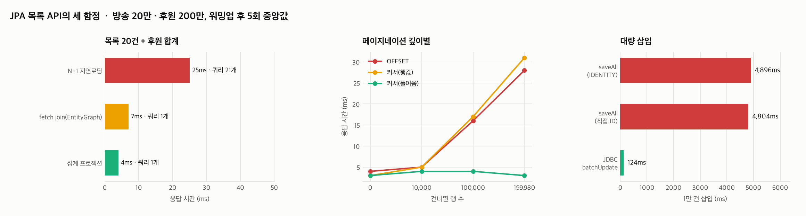
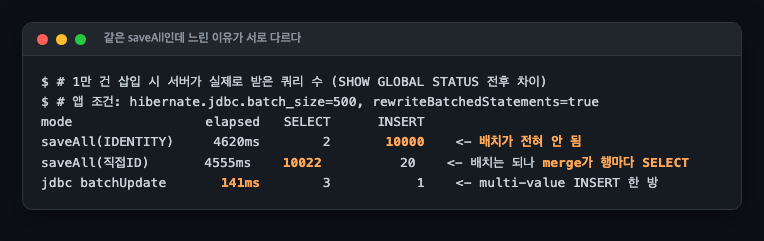
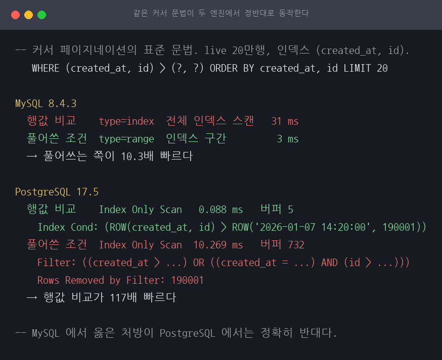

# B52 JPA로 목록 API를 만들 때 밟는 세 함정

> 근거 등급: `E2`
> 출처: [Hibernate, N+1 selects problem](https://docs.hibernate.org/orm/3.6/reference/en-US/html/performance.html) · [Vlad Mihalcea, The N+1 query problem](https://vladmihalcea.com/n-plus-1-query-problem/) · 실무 사례: [우아한형제들, Spring Batch와 Querydsl(NoOffset)](https://techblog.woowahan.com/2662/) · [컬리, BULK 처리 Write 개선](https://helloworld.kurly.com/blog/bulk-performance-tuning/) · [Shopify, Pagination with Relative Cursors](https://shopify.engineering/pagination-relative-cursors)

## 1. 유명한 이유

목록 API는 백엔드에서 가장 많이 만드는 화면이고, JPA로 만들면 같은 자리에서 같은 문제를 만납니다.

**N+1.** 방송 20건을 가져와 각 방송의 후원을 보여주면 쿼리가 21개 나갑니다. Hibernate 공식 문서가 기본 페치 전략을 두고 "N+1 selects 문제에 극도로 취약하다"고 적습니다. 개별 쿼리는 1ms도 안 걸려서 슬로우 쿼리 로그에 안 잡히고, 그래서 트래픽이 늘 때까지 아무도 모릅니다.

**대량 삽입.** `saveAll()`은 이름이 벌크처럼 생겼지만 행마다 INSERT를 보냅니다. 컬리는 회원 1만 + 게시글 3만 건 적재에서 JPA 78초를 JDBC 1.7초로 줄인 사례를 공개했습니다.

**깊은 페이지네이션.** OFFSET은 건너뛸 행을 전부 읽고 버립니다. Shopify는 offset 10만 지점에서 2,221.60ms가 커서 방식으로 5.24ms가 됐다고 공개했고(99.76% 개선), 우아한형제들은 배치의 마지막 페이지가 5초에서 0.08초가 됐다고 적었습니다.

**세 회사의 수치를 이 세션의 수치와 직접 비교할 수 없습니다.** 각 회사가 자기 데이터와 자기 장비에서 잰 값이고, 이 세션은 방송 20만 건과 후원 200만 건을 컨테이너 한 대에 올려 축소 재현했습니다. 자릿수부터 다릅니다. 컬리의 78초 대 1.7초에 대응하는 이 세션의 값은 4,620ms 대 141ms이고, Shopify의 2,221.60ms 대 5.24ms에 대응하는 값은 28ms 대 3ms입니다. 아래 수치는 저 사례의 재현이 아니라 방향이 같은지를 확인한 것으로 읽어야 합니다.

셋 다 잘 알려진 문제이고 해법도 잘 알려져 있습니다. 이 세션이 확인하려는 것은 **그 해법이 실제로 듣는가**입니다. 결과부터 말하면 셋 중 둘은 교과서대로 들었고, 하나는 교과서대로 했는데 듣지 않았습니다.

## 2. 재현

### 환경

| 항목 | 값 |
|---|---|
| 호스트 | 기록하지 않았습니다 |
| 앱 | Spring Boot 3.4.1, Java 21, Spring Data JPA |
| DB | MySQL 8.4.3 (컨테이너 `--cpus=4`, `mem_limit 2g`, 버퍼 풀 1GB) |
| 데이터 | 방송 20만 건, 후원 200만 건 (Zipf 쏠림) |
| 측정 (N+1, 페이지네이션) | 워밍업 3회 후 5회, 중앙값 |
| 측정 (대량 삽입) | 워밍업도 반복도 없이 POST 1회 |
| 공통 | **응답 시간과 함께 서버가 받은 쿼리 수를 센다** |

호스트 사양을 찍어 남기지 않았습니다. 컨테이너 할당량만 알 수 있고 어느 장비였는지는 확인되지 않아, 이 세션의 절대 시간을 다른 세션의 절대 시간과 비교하면 안 됩니다.

측정 방식이 구간마다 다릅니다. `scripts/bench.sh`의 `bench()`는 워밍업 3회 뒤 5회를 재고 중앙값을 쓰지만, 삽입을 재는 `insert()`는 POST를 한 번만 던집니다. 그래서 3절의 함정 1과 2는 중앙값이고, 함정 3은 단일 측정값이라 관측 범위가 없습니다.

쿼리 수는 `SHOW GLOBAL STATUS LIKE 'Com_select'`의 요청 전후 차이로 셉니다. N+1은 응답 시간만 보면 안 보이고 쿼리 수로만 드러나기 때문에, 이 지표가 없으면 재현이 성립하지 않습니다.

방송당 평균 후원 건수는 정의에 따라 갈립니다. 200만을 20만으로 나누면 10.0건입니다. `scripts/seed.py`가 찍는 10.4건은 `GROUP BY live_id`로 잰 값이라 후원이 한 건 이상 붙은 방송만의 평균입니다. Zipf 쏠림을 넣었기 때문에 후원이 0건인 방송이 있고, 그 차이가 두 숫자를 가릅니다.

비교하는 방송 20건은 목록 앞이 아니라 중간 구간(id 100000~100019)에서 뽑았습니다. 앞 20건은 후원 쏠림이 심해(200만 건 중 17만 건) 변형 간 차이가 데이터 편중에 묻힙니다. 대신 중간 구간은 Zipf 꼬리라 후원이 적습니다. `seed.py`의 가중치로 계산하면 이 구간은 방송당 4건이 채 안 되고 20건을 합쳐도 80건에 못 미치는 것이 기댓값입니다. 이 구간의 실제 후원 건수는 결과 파일에 남기지 않았습니다.

## 3. 재계측



### 함정 1: N+1

| 방식 | 응답 시간 | 서버가 받은 SELECT |
|---|---|---|
| 지연 로딩 그대로 | 25ms | **21개** |
| `@EntityGraph` (fetch join) | 7ms | 1개 |
| 집계 프로젝션 (JdbcTemplate) | **4ms** | 1개 |

교과서대로 들었습니다. 다만 목록 화면이 필요한 게 후원 **합계**뿐이라면 엔티티를 가져올 이유가 없습니다. 집계로 한 방에 가져오는 쪽이 fetch join보다 빠릅니다. 페치 전략을 고치기 전에 "이 화면이 정말 엔티티를 필요로 하는가"를 먼저 묻는 편이 낫습니다.

### 함정 2: 깊은 페이지네이션

| 건너뛴 행 | OFFSET | 커서 (행값 비교) | 커서 (풀어쓴 조건) |
|---|---|---|---|
| 0 | 4ms | 3ms | 3ms |
| 10,000 | 5ms | 5ms | 4ms |
| 100,000 | 16ms | 17ms | **4ms** |
| 199,980 | 28ms | 31ms | **3ms** |

여기가 이 세션의 핵심입니다. 커서 페이지네이션의 표준 문법으로 널리 소개되는 **행값 비교 `(created_at, id) > (?, ?)`가 전혀 빨라지지 않았습니다.** 오히려 OFFSET보다 느립니다(31ms 대 28ms).

먼저 밝힐 것이 있습니다. **세 열이 완전히 같은 행을 돌려주지는 않습니다.** 커서의 시작점을 잡는 `/anchor?offset=N`이 `LIMIT 1 OFFSET N`으로 N+1번째 행을 앵커로 주고, 커서 쿼리는 그 앵커 **다음** 행부터 읽습니다. 그래서 커서 쪽이 OFFSET 쪽보다 한 행 뒤에서 출발합니다. 가장 깊은 199,980 지점에서는 남은 행이 모자라 OFFSET이 20행, 커서가 19행을 돌려줍니다. 아래 배수를 뒤집을 크기의 차이는 아니지만, 같은 결과 집합을 비교한 것은 아닙니다.

실행계획을 보면 이유가 나옵니다.

```
WHERE (created_at, id) > ('2026-01-07 22:39:00.000', 199981)
  → type: index    (전체 인덱스 스캔)

WHERE created_at > '2026-01-07 22:39:00.000'
   OR (created_at = '2026-01-07 22:39:00.000' AND id > 199981)
  → type: range    (인덱스 구간 탐색)
```

MySQL 8.4.3은 행값 비교에 범위 최적화를 적용하지 않습니다. 파라미터를 리터럴로 바꿔도 같습니다. 같은 조건을 `OR`로 풀어써야 `type=range`가 됩니다.

배수는 무엇을 기준으로 잡느냐에 따라 갈리므로 갈라서 적습니다. 199,980 지점에서

- **재작성 자체의 효과**는 행값 비교 31ms 대 풀어쓴 조건 3ms로 **10.3배**입니다. 커서 문법을 바꾼 것만으로 얻은 몫이 이쪽입니다.
- **OFFSET 대비**는 28ms 대 3ms로 **9.3배**입니다. 페이지네이션 방식을 통째로 바꾼 몫입니다.

그리고 풀어쓴 쪽은 깊이가 깊어져도 시간이 늘지 않습니다. 건너뛰는 게 아니라 인덱스에서 시작점을 바로 찾기 때문입니다.

### 함정 3: 대량 삽입

같은 1만 건 삽입인데 세 방식이 서로 다른 이유로 느립니다.



| 방식 | 소요 | SELECT | INSERT |
|---|---|---|---|
| `saveAll` + `IDENTITY` | 4,620ms | 2 | **10,000** |
| `saveAll` + 직접 부여 ID | 4,555ms | **10,022** | 20 |
| JDBC `batchUpdate` | **141ms** | 3 | **1** |

표와 위 그림과 3절 첫머리 차트의 세 번째 패널은 모두 `results/insert-counters.txt`의 같은 실행분입니다. `hibernate.jdbc.batch_size=500`, `rewriteBatchedStatements=true` 조건에서 한 번씩 잰 값입니다.

**소요 시간 세 개를 나란히 읽으면 안 됩니다.** 셋이 같은 테이블에 넣지 않기 때문입니다. `saveAll` + `IDENTITY`와 JDBC `batchUpdate`는 후원 200만 행이 이미 든 `sponsor`에 넣고, `saveAll` + 직접 부여 ID만 빈 `sponsor_assigned`에 넣습니다. 인덱스 크기와 페이지 분할 상황이 달라 출발점이 같지 않습니다. 반면 SELECT와 INSERT 수는 대상 테이블의 크기에 영향받지 않으므로 10,000 대 20 대 1은 그대로 비교됩니다. 이 세션이 세려고 만든 지표도 그쪽이고, 아래 세 줄이 말하는 것도 시간이 아니라 왕복 수입니다.

- **IDENTITY**: `hibernate.jdbc.batch_size=500`을 켜도 INSERT가 1만 번 나갑니다. IDENTITY는 INSERT마다 생성된 키를 돌려받아야 해서 하이버네이트가 배치를 포기합니다. 설정을 켰는데 아무 일도 안 일어나는 이유입니다.
- **직접 ID**: 이번엔 INSERT가 20번으로 묶입니다(1만 ÷ 배치 500). 그런데 SELECT가 10,022번 나갑니다. Spring Data의 `save()`는 ID가 있으면 기존 행으로 보고 `merge()`를 호출하고, `merge`는 행마다 존재 확인 SELECT를 던집니다. 배치는 성공했는데 다른 곳에서 1만 번을 씁니다.
- **JDBC batchUpdate**: `rewriteBatchedStatements=true` 조건에서 INSERT가 **한 번**으로 합쳐집니다. 다만 이 옵션을 끈 JDBC `batchUpdate`는 재지 않았습니다.

드라이버 옵션의 몫은 다른 자리에서 나왔습니다. `scripts/bench.sh`는 `rewriteBatchedStatements=false`로 앱을 띄운 뒤 `saveAll` 직접 ID **하나만** 돌립니다. 그 실행(`results/bench.csv`)에서 같은 방식이 옵션을 켰을 때 4,804ms, 껐을 때 8,544ms였습니다. 배치 설정만으로는 부족하고 드라이버 옵션이 함께 있어야 왕복이 줄어든다는 것은 이 쌍이 보여줍니다. 옵션을 끈 조건에서 JDBC `batchUpdate`가 얼마가 되는지는 이 세션에 없는 수치입니다. 그리고 이 쌍도 완전히 같은 출발점은 아닙니다. 켠 쪽은 빈 `sponsor_assigned`에, 끈 쪽은 앞 조건이 넣은 1만 행이 남아 있는 상태에서 돌았습니다.

## 4. 해소

| 함정 | 해소 | 주의 |
|---|---|---|
| N+1 | `@EntityGraph` 또는 fetch join. 합계만 필요하면 집계 프로젝션 | 컬렉션 fetch join + 페이지네이션은 메모리 페이징 경고를 부른다 |
| 깊은 페이지네이션 | 커서 방식, 단 **조건을 풀어써야** 한다 | 행값 비교 문법은 MySQL에서 range 최적화를 못 받는다 |
| 대량 삽입 | JDBC `batchUpdate` + `rewriteBatchedStatements=true` | JPA를 고집하려면 `Persistable.isNew()` 구현으로 merge를 피해야 한다 |

측정 자체를 위한 처방도 하나 있습니다. **쿼리 수를 세는 테스트를 붙이는 것**입니다. Vlad Mihalcea가 만든 `SQLStatementCountValidator`가 그 목적이고, 목록 API 테스트에 기대 쿼리 수를 못 박아 두면 N+1이 들어오는 순간 CI가 잡습니다. 응답 시간 회귀 테스트로는 20ms 차이를 잡지 못합니다.

## 5. 예상과 달랐던 점

### 커서로 바꿨는데 안 빨라졌습니다

가장 널리 인용되는 커서 문법이 MySQL에서 듣지 않는다는 것이 이 세션에서 가장 값진 발견입니다. 커서 페이지네이션을 도입하고 "왜 그대로지"라고 하는 상황의 정확한 원인입니다. `EXPLAIN`의 `type` 컬럼이 `range`인지 `index`인지만 확인하면 즉시 드러납니다.

### 배치 설정을 켰는데 아무 일도 일어나지 않았습니다

`hibernate.jdbc.batch_size`를 0에서 500으로 올렸는데 4,607ms가 4,896ms가 됐을 때 설정이 안 먹은 줄 알았습니다(`results/bench.csv`, 같은 실행분의 두 조건). 실제로는 설정은 적용됐고 IDENTITY 전략이 배치를 원천 봉쇄한 것이었습니다. 이걸 확인하려고 ID를 직접 부여하는 대조군을 만들었더니 INSERT가 20번으로 줄어 배치가 살아났고, 대신 merge SELECT가 1만 번 나타났습니다. **쿼리 수를 세지 않았으면 "JPA는 그냥 느리다"로 끝났을 문제입니다.**

### 집계 프로젝션이 fetch join보다 빨랐습니다

fetch join(7ms)보다 집계(4ms)가 빠릅니다. fetch join은 방송 20건과 거기 달린 후원을 전부 엔티티로 만들어 영속성 컨텍스트에 올리는데, 화면이 필요한 건 합계 숫자 하나입니다. 페치 전략을 튜닝하기 전에 필요한 데이터의 모양을 다시 보는 편이 낫다는 뜻입니다. 그 구간의 후원이 몇 건이었는지는 세지 않았습니다. 2절에서 적었듯 `seed.py`의 가중치로는 20건 합쳐 80건에 못 미치는 것이 기댓값입니다.

## 6. PostgreSQL 대조: 처방이 반대다

`scripts/exp-pg-cursor.sh`, 원문은 `results/exp-pg-cursor.txt`. PostgreSQL 17.5, live 20만 행,
같은 인덱스 `(created_at, id)`. 조건마다 1회 실행입니다.

이 세션의 핵심 결론은 행값 비교가 MySQL 8.4.3 에서 범위 최적화를 받지 못한다는 것이었습니다.
PostgreSQL 은 정반대입니다.

| 방식 | MySQL 8.4.3 | PostgreSQL 17.5 |
|---|---|---|
| OFFSET 190000 | 28ms | 21.707ms (버퍼 732) |
| 커서: 행값 비교 | 31ms (`type=index`) | **0.088ms (버퍼 5)** |
| 커서: 풀어쓴 조건 | **3ms (`type=range`)** | 10.269ms (버퍼 732, 190,001행 버림) |



판정 기준은 조건이 `Index Cond` 로 밀려 들어갔는지입니다.

```
커서: 행값 비교      Index Only Scan   0.088 ms   버퍼 5
  Index Cond: (ROW(created_at, id) > ROW('2026-01-07 14:20:00', 190001))

커서: 풀어쓴 조건    Index Only Scan  10.269 ms   버퍼 732
  Filter: ((created_at > ...) OR ((created_at = ...) AND (id > ...)))
  Rows Removed by Filter: 190001
```

MySQL 에서 옳은 처방을 PostgreSQL 에 그대로 옮기면 117배 손해입니다.

### 타이브레이커 가지

"못 한 것"의 항목 하나를 여기서 처리했습니다. MySQL 쪽 시드는 `created_at` 이 전부 달라
`created_at = ? AND id > ?` 가지가 한 번도 참이 되지 않았습니다. 시각을 1,000개로 줄여
한 시각에 200행씩 몰리는 `live_tie` 를 따로 만들어 같은 커서로 쟀습니다.

| 방식 | 결과 |
|---|---|
| 행값 비교 | Index Only Scan 0.066ms, 버퍼 5, `Index Cond` 유지 |
| 풀어쓴 조건 | Index Only Scan 10.640ms, 버퍼 732, 190,001행 버림 |

같은 시각이 몰려도 `Index Cond` 가 유지됩니다. 두 문법이 돌려주는 20건이 같은지도 검산해
일치를 확인했습니다.

## 못 한 것

- **호스트 사양을 찍어 남기지 않았습니다.** 컨테이너 할당량만 있고 어느 장비에서 돌렸는지 확인되지 않아, 이 세션의 절대 시간은 다른 세션의 절대 시간과 비교할 수 없습니다.
- **대량 삽입을 한 번씩만 쟀습니다.** N+1과 페이지네이션은 워밍업 3회 뒤 5회의 중앙값인데, 삽입을 재는 `scripts/bench.sh`의 `insert()`는 POST를 한 번만 던집니다. 함정 3의 소요 시간에는 관측 범위가 없습니다.
- **삽입 세 방식을 같은 테이블에서 재지 않았습니다.** 두 방식은 200만 행이 든 `sponsor`에, 나머지 하나는 빈 `sponsor_assigned`에 넣습니다. 쿼리 수는 그대로 비교되지만 소요 시간은 다시 설계해야 비교됩니다.
- **`rewriteBatchedStatements`를 끈 조건에서 JDBC `batchUpdate`를 재지 않았습니다.** 옵션을 끄고 잰 것은 `saveAll` 직접 ID 하나뿐입니다.
- **타이브레이커 분기는 PostgreSQL 에서만 밟았습니다.** 6절에서 확인했지만 MySQL 쪽 `seed.py` 는 여전히 `created_at` 이 전부 다른 데이터를 만듭니다.
- **`Persistable.isNew()` 구현으로 merge를 피하는 변형을 만들지 않았습니다.** 원인은 특정했지만 그 해법까지는 재지 않았습니다.
- **`@BatchSize` 지연 로딩 최적화를 다루지 않았습니다.** fetch join과 집계 두 갈래만 비교했습니다.
- **동시 요청 부하가 없습니다.** 단일 요청의 응답 시간과 쿼리 수만 쟀습니다. N+1의 진짜 위험은 동시 사용자가 늘 때 커넥션 풀을 소진하는 것인데, 그 구간은 F03 세션이 다룹니다.
- **PostgreSQL 쪽은 페이지네이션만 대조했습니다.** 6절은 커서 문법 하나이고, N+1 과 대량 삽입은 PostgreSQL 에서 재지 않았습니다. `reWriteBatchedInserts` 도 재지 않았습니다.
