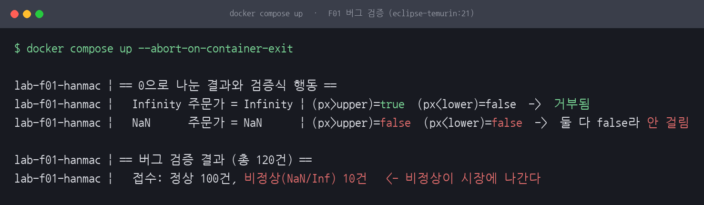
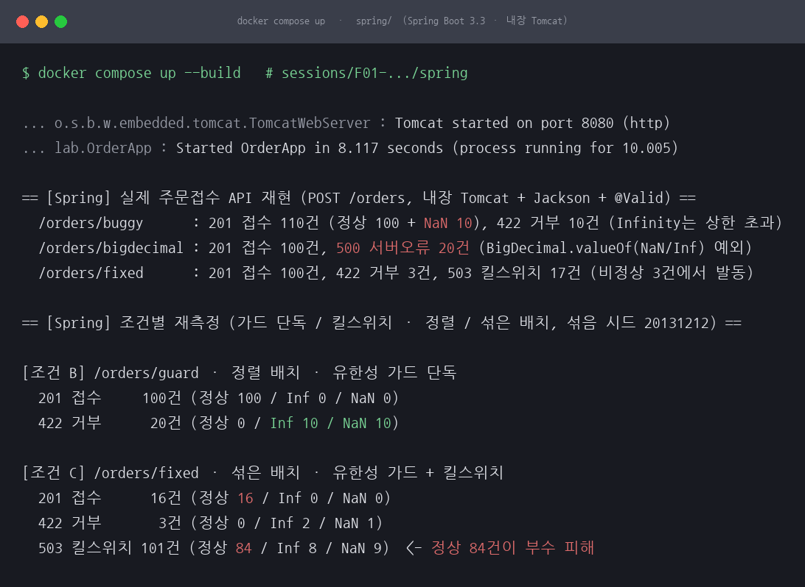
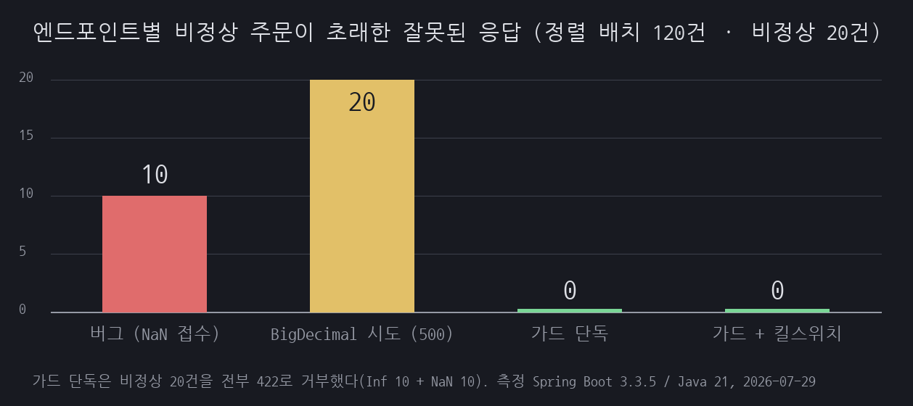
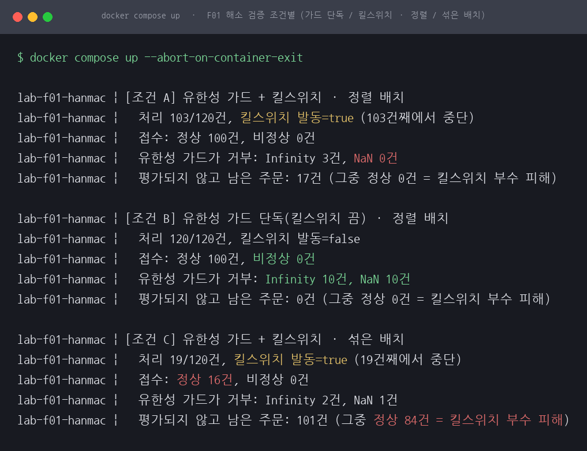
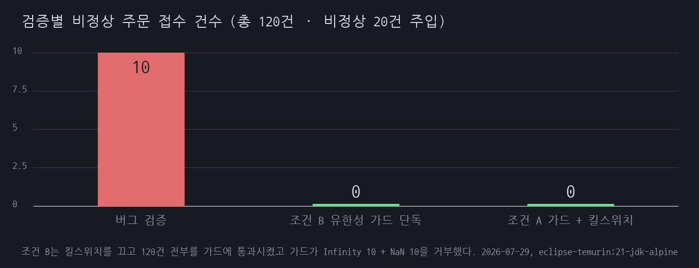
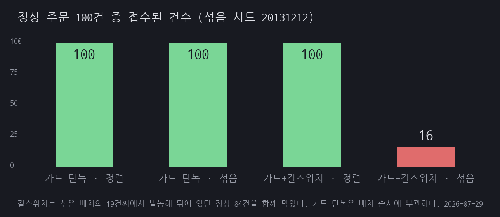

# F01 한맥 0으로 나눈 값이 주문 검증을 뚫다

## 1. 유명한 이유

2013년 12월 12일 한맥투자증권은 코스피200 옵션 주문에서 143초 만에 37,900여 건을 체결했고, 그 손실을 감당하지 못해 2015년 2월 파산선고를 받았습니다. 손실 규모는 460억 원대로 통용됩니다. 다만 이 시리즈는 감독당국 문서나 판결문 같은 1차 자료를 확인하지 못했습니다. 체결 건수와 소요 시간, 손실액은 그 조건에서 읽어야 하는 값입니다. 체결 취소를 둘러싼 법원 판단도 사건 번호를 확인하지 못해 여기서는 적지 않습니다. 근거 등급은 E1·축소입니다. 사건은 실재하지만 그대로 재현할 수 없어 같은 메커니즘을 축소해 만들었습니다.

원인은 옵션 이론가를 계산할 때 잔존 만기를 분모로 쓰다가 만기 당일 그 값이 0이 되면서 계산 결과가 비정상이 된 것으로 알려져 있습니다. 그 값이 호가의 상한과 하한 검증을 통과해 시장에 나갔다는 것이 사건의 서술입니다.

그런데 그 서술과 이 세션의 재현 경로는 정확히 겹치지 않습니다. 카탈로그에는 이자율을 `잔여일/365`가 아니라 `잔여일/0`으로 입력한 것이 발단이라고 적어 두었는데, 분자가 0이 아니면 그 나눗셈의 결과는 Infinity이고 아래에서 보듯 Infinity는 상한 비교에 걸려 거부됩니다. 사건에서 어떤 값이 어떤 검증을 어떻게 빠져나갔는지는 공개된 기록만으로 확정할 수 없습니다. 이 세션이 재현한 것은 한맥의 코드가 아니라, 분모가 0이 되어 만들어진 값이 상하한 검증을 빠져나가는 일반 메커니즘입니다. 실제 거래소와 옵션 이론가 모델은 재현하지 않았습니다.

## 2. 재현

주문 120건을 코드로 만들었습니다. 정상 100건, 잔존일수를 0으로 두어 Infinity를 유발하는 10건, 잔존일수와 분자를 모두 0으로 두어 NaN을 유발하는 10건입니다. 주문가는 `base * (1 + numerator/days)`이고, 접수 로직은 "상한을 넘거나 하한에 못 미치면 거부, 아니면 접수"입니다. 환경은 Docker 위 eclipse-temurin:21-jdk-alpine, JDK 21입니다. 호스트는 Rocky Linux 9 aarch64(`Linux 5.14.0-570.33.2.el9_6.aarch64`), 2코어, 메모리 11GiB이고 컨테이너 자원 한도는 지정하지 않았습니다. 이 세션은 결정적 산술이라 아래 수치는 호스트 성능에 좌우되지 않습니다.

`docker compose up` 한 번으로 다음이 관측됐습니다. 상·하한은 [90, 130]입니다.

```
Infinity 주문가 = Infinity | (px>upper)=true (px<lower)=false -> 거부됨
NaN      주문가 = NaN | (px>upper)=false (px<lower)=false -> 둘 다 false라 안 걸림

버그 검증 결과 (총 120건)
  접수: 정상 100건, 비정상(NaN/Inf) 10건
```



*그림 1. 버그 검증 실행 화면입니다. Infinity 10건은 상한 검증에 걸려 거부되고, NaN 10건이 그대로 접수됩니다.*

Infinity를 유발한 10건은 거부됐고, NaN을 유발한 10건이 접수됐습니다. 명령과 출력 원문은 [reproduce.md](reproduce.md)에 그대로 남겼습니다.

### 실제 스택에서도 뚫리는가 (Spring Boot)

같은 검증 로직을 Spring Boot 3.3 주문접수 REST API로 옮겨, 증권 백엔드가 쓰는 환경에서도 통과하는지 확인했습니다. 내장 Tomcat이 뜬 뒤 주문 120건을 실제 HTTP로 쐈습니다. 클라이언트가 보내는 값(base, numerator, days)은 전부 유한한 정상 숫자이고, 비정상 값은 서버가 `base * (1 + numerator/days)`를 계산하는 순간 잔존일수 0에서 만들어집니다. 한맥에서도 나쁜 값은 외부 입력이 아니라 내부 계산에서 나왔습니다.



*그림 4. 같은 버그를 Spring Boot 주문접수 API로 재현한 화면입니다. 내장 Tomcat이 뜨고, 버그 엔드포인트에서 NaN 10건이 201 Created로 접수됩니다. BigDecimal 강화 시도는 500 서버오류 20건을 냅니다. 아래 두 블록은 5절의 조건별 재측정으로, 가드 단독(`/orders/guard`)이 NaN 10건을 422로 거부하고 섞은 배치의 `/orders/fixed`가 정상 84건에 503을 돌려주는 자리입니다.*

버그 엔드포인트 `/orders/buggy`는 정상 100건과 NaN 10건을 201 Created로 접수했습니다. NaN 10건이 실제 REST 검증을 그대로 통과한 것입니다. Infinity 10건만 상한 초과로 422를 받았습니다.

입력 `@Valid` 검증은 120건 모두 통과했습니다. 이건 발견이 아닙니다. `OrderRequest`에 붙은 제약은 `@NotNull` 세 개가 전부라, 값이 비어 있지만 않으면 통과하도록 만들어 둔 구성입니다. 아래 코드 주석에도 검증이 도는 것을 보이려고 넣었다고 적어 두었습니다. 여기서 확인되는 것은 `@Valid`가 무력하다는 사실이 아니라, 입력 검증이 보는 자리와 위험한 값이 만들어지는 자리가 다르다는 배치입니다. `@Valid`가 보는 것은 클라이언트가 보낸 입력이고, 문제의 값은 서버가 그 뒤에 계산한 파생값입니다. 코드는 [spring/](spring/)에 있고, 버그 경로의 수치는 최소 재현과 맞물립니다.



*그림 5. 정렬 배치 120건에서 엔드포인트별로 비정상 주문이 만든 잘못된 응답 수입니다. 버그는 NaN 10건을 조용히 접수하고, BigDecimal 시도는 500 오류 20건을 냅니다. 가드 단독과 가드+킬스위치는 둘 다 0건인데, 가드 단독은 비정상 20건을 전부 422로 거부해서 나온 0이고 가드+킬스위치는 3건째에서 접수를 멈춰 나온 0입니다.*

## 3. 내부 원리

자바를 포함한 IEEE 754 부동소수점에서 0으로 나누는 연산은 예외를 던지지 않습니다. 분자가 0이 아니면 `5.0 / 0.0`은 Infinity가 되고, 분자도 0이면 `0.0 / 0.0`은 NaN이 됩니다. 정수 나눗셈이라면 `ArithmeticException`이 났겠지만, 가격 계산은 실수라 조용히 특수값이 만들어집니다.

여기서 갈립니다. Infinity는 순서가 있는 값이라 `Infinity > 130`이 true가 되어 상한 검증에 걸립니다. NaN은 다릅니다. IEEE 754에서 NaN은 자기 자신과도 같지 않고, 크기 비교의 결과가 항상 false입니다. 그래서 `NaN > 130`도 false, `NaN < 90`도 false입니다. 접수 로직이 "상한을 넘거나 하한에 못 미치면 거부"라면 NaN은 두 조건 어디에도 걸리지 않아 거부를 빠져나가 접수됩니다. 0으로 나눈 것 자체보다 NaN의 비교 규칙이 검증을 무력화한 지점이 원인입니다.

다만 "NaN은 모든 비교가 false"라고만 적으면 규칙을 절반만 적은 것입니다. `<`, `>`, `<=`, `>=`, `==`는 한쪽이 NaN이면 전부 false가 맞지만 `!=`는 예외라, `NaN != NaN`은 true입니다. 같음을 부정으로 확인하는 코드는 NaN 앞에서 반대로 돕니다.

비교 방법을 바꿨다면 결과도 달랐습니다. `Double.compare`는 NaN을 다른 어떤 값보다 큰 것으로 두는 전순서를 정의합니다. 같은 검증식을 `Double.compare(px, upper) > 0`으로 썼다면 NaN도 상한 초과로 걸려 거부됐습니다. 그러니 이 버그의 조건은 0으로 나눈 값이 만들어졌다는 것 하나가 아닙니다. 그 값을 `px > upper`처럼 원시 비교 연산자로 잰 것이 함께 있어야 성립합니다.

## 4. 해소

거부 조건에 `|| Double.isNaN(px)`를 덧붙이는 방법이 먼저 떠오릅니다. 그런데 이 방식은 막아야 할 값을 하나씩 나열하는 구조라, 다음에 나올 값을 빠뜨릴 여지가 남습니다. 그래서 접수 조건을 뒤집어 화이트리스트로 두었습니다. 값이 유한하고 범위 안일 때만 접수하고, 나머지는 전부 거부합니다.

```java
static boolean acceptFixed(double px, double lower, double upper) {
    if (!Double.isFinite(px)) return false; // NaN과 Infinity를 한 번에 거부
    if (px > upper || px < lower) return false;
    return true;
}
```

`Double.isFinite`는 NaN과 양음의 Infinity를 모두 걸러냅니다. 저장소 코드에는 이 함수 안에 계측 카운터가 하나 더 있습니다. 유한성 검사가 몇 번 참이 됐는지를 Infinity와 NaN으로 나눠 세는 것으로, 방어 로직이 아니라 5절의 측정을 위한 것입니다.

여기에 두 번째 방어선으로 킬스위치를 붙였습니다. 비정상 주문이 짧은 시간에 반복되면 개별 거부만으로는 부족하다는 것이 한맥 사고의 교훈이라, 비정상 값이 일정 건수를 넘으면 접수 자체를 멈추게 했습니다. 이 세션에서는 임계값을 3건으로 두었습니다. 다만 5절에서 보듯 이 실험 조건에서 킬스위치는 비정상 접수를 더 줄여 주지 못하고 정상 주문을 함께 막기만 했습니다. 근본 방어는 애초에 잔존일수가 0이 될 수 없도록 입력 도메인을 검증하는 것이고, 유한성 가드와 킬스위치는 그 검증이 뚫렸을 때를 위한 뒷단입니다.

해소 로직도 같은 Spring API로 검증했습니다. `/orders/fixed`에 정렬 배치를 쏘면 정상 100건은 201로 접수되고, 422로 거부된 3건은 전부 Infinity이며, 킬스위치가 발동한 뒤 나머지 17건은 503을 받습니다. 그 17건은 Infinity 7건과 NaN 10건입니다. "비정상 3건"이라고만 적으면 NaN이 422를 받은 것처럼 읽히는데 그렇지 않습니다. 배치가 정상 100건, Infinity 10건, NaN 10건 순서라 Infinity 세 건에서 임계값에 닿았고, 그 뒤로 컨트롤러는 가격을 계산하기도 전에 503을 돌려줍니다. 이 조건에서 유한성 가드가 실제로 판정한 값은 Infinity 세 건이 전부이고, 버그 버전을 뚫었던 NaN은 가드 앞까지 오지 않았습니다. 킬스위치 발동 지점(3건째)은 최소 재현과 맞물립니다.

그래서 재측정에서 `/orders/guard`를 추가했습니다. `/orders/fixed`와 킬스위치 유무 한 변수만 다른 엔드포인트라, 같은 배치를 양쪽에 쏘면 무엇을 가드가 막고 무엇을 킬스위치가 막았는지 갈립니다. 조건별 결과는 5절에 있습니다.

## 5. 재계측

첫 실행(2026-07-22)의 해소 검증은 "비정상 접수 0건"을 찍었지만 그 0건이 무엇의 성과인지 가르지 못했습니다. 드라이버 루프가 이랬기 때문입니다.

```java
for (Order o : book) {
    processed++;
    double px = price(o);
    if (!Double.isFinite(px)) {              // 루프가 먼저 거른다
        rejectedNonFinite++;
        if (rejectedNonFinite >= 3 && !killed) { killed = true; break; }  // 3건째에 중단
        continue;
    }
    if (acceptFixed(px, lower, upper)) fixNormal++;  // 유한한 값만 여기까지 온다
}
```

`acceptFixed`는 유한한 값일 때만 호출됩니다. 바로 위의 `!Double.isFinite(px)` 한 줄이 이미 걸러 냈기 때문에 화이트리스트의 첫 줄은 그 실행에서 한 번도 참이 되지 않았습니다. 루프가 걸러 낸 3건은 전부 Infinity이고, 3건째에서 `break`가 걸려 뒤에 있던 NaN 10건은 평가조차 되지 않았습니다. 게다가 "비정상 0건" 자리에 출력되던 `fixBad` 변수는 증가 경로가 코드에 없어 무엇을 넣고 돌리든 0으로 찍히는 값이었습니다.

2026-07-29 재측정에서 셋을 고쳤습니다. 루프의 사전 필터를 걷어내 화이트리스트가 120건 전부를 판정하게 했고, 접수된 값을 종류로 갈라 세는 경로를 넣어 `fixBad`가 실제로 증가할 수 있게 했으며, `acceptFixed` 안에 계측 카운터를 두어 유한성 검사가 몇 번 참이 됐는지를 Infinity와 NaN으로 나눠 셉니다. 그 위에 킬스위치 켬/끔과 정렬/섞은 배치를 조합한 네 조건을 돌렸습니다. 섞을 때 쓴 시드는 20131212로 코드에 박아 두어 몇 번 돌려도 같은 순서가 나옵니다.

| 조건 | 킬스위치 | 배치 | 처리 | 정상 접수 | 비정상 접수 | 가드가 거부(Inf/NaN) | 정상 부수 차단 |
|---|---|---|---|---|---|---|---|
| 버그 검증 | 없음 | 정렬 | 120/120 | 100 | 10 (전부 NaN) | 해당 없음 | 0 |
| 조건 A | 켬(임계 3) | 정렬 | 103/120 | 100 | 0 | 3 / 0 | 0 |
| 조건 B | 끔 | 정렬 | 120/120 | 100 | 0 | 10 / 10 | 0 |
| 조건 C | 켬(임계 3) | 섞음 | 19/120 | 16 | 0 | 2 / 1 | 84 |
| 조건 D | 끔 | 섞음 | 120/120 | 100 | 0 | 10 / 10 | 0 |



*그림 2. 해소 검증 조건별 실행 화면입니다. 조건 A에서 가드가 판정한 값은 Infinity 3건뿐이고 NaN은 0건입니다. 조건 B에서 킬스위치를 끄자 가드가 Infinity 10건과 NaN 10건을 모두 거부합니다. 조건 C에서는 섞은 배치의 19건째에 킬스위치가 발동해 정상 84건이 함께 막힙니다.*

조건 B가 이 재측정의 목적입니다. 킬스위치를 끄면 120건 전부가 화이트리스트를 지나고, 가드가 Infinity 10건과 NaN 10건을 모두 거부합니다. 비정상 접수는 0건입니다. 이 0은 카운터가 없어서 나온 0이 아닙니다. 증가 경로가 있는데도 증가하지 않은 0이고, 같은 카운터가 버그 검증에서는 10을 찍습니다. 즉 유한성 화이트리스트는 킬스위치 없이도 비정상 접수를 0건으로 만들고, 버그 버전을 뚫었던 NaN을 실제로 거부합니다. 조건 A의 0건을 킬스위치의 성과로 읽을 근거는 조건 B가 지웠습니다.

조건 A는 첫 실행과 같은 조건입니다. 킬스위치 발동 지점(103/120)과 거부 3건이 그대로 재현됐고, 가드가 판정한 값이 Infinity 3건뿐이었다는 사실이 이번에는 출력에 남습니다.



*그림 3. 검증별 비정상 주문 접수 건수입니다. 버그 검증 10건이 조건 B와 조건 A에서 0건이 됩니다. 조건 B는 킬스위치를 끄고 120건 전부를 가드에 통과시킨 결과이므로, 이 0건은 유한성 화이트리스트 단독의 성과입니다.*

조건 C가 킬스위치의 부수 피해입니다. 첫 실행에서 정상 100건이 그대로 접수된 것은 정상 주문을 배치 앞에 몰아넣은 순서 덕이었습니다. 배치를 섞으면 비정상 주문이 앞쪽에도 들어와 19건째에서 임계값 3건에 닿습니다. 그 시점까지 접수된 정상 주문은 16건이고, 뒤에 남은 정상 84건은 평가되지 않았습니다. 정상 100건 중 84건이 킬스위치에 함께 막힌 것입니다.



*그림 6. 정상 주문 100건 중 접수된 건수입니다. 가드 단독은 배치 순서를 바꿔도 100건 전부를 접수합니다. 킬스위치는 정렬 배치에서는 부수 피해가 없지만, 섞은 배치에서는 19건째에 발동해 84건을 함께 막습니다.*

조건 D는 대조군입니다. 가드 단독은 배치 순서를 바꿔도 정상 100건 접수, 비정상 0건 접수로 조건 B와 같습니다. 화이트리스트는 주문 하나만 보고 판정하므로 순서에 무관하고, 순서에 좌우되는 것은 상태를 누적하는 킬스위치 쪽입니다. 조건 C와 D를 나란히 두면 84건이 가드가 아니라 킬스위치의 결과임이 갈립니다.

Spring 재현에서도 같은 분해가 나왔습니다(2절 그림 4). `/orders/guard`는 정렬 배치와 섞은 배치 모두에서 201 접수 100건, 422 거부 20건(Infinity 10 + NaN 10)입니다. `/orders/fixed`는 정렬 배치에서 422 3건(전부 Infinity)과 503 17건(Infinity 7 + NaN 10)이지만, 섞은 배치에서는 201 접수가 16건으로 떨어지고 503 101건 중 84건이 정상 주문입니다. 4절이 적은 "422 3건이 Infinity, 503 17건이 Infinity 7 + NaN 10"이라는 분해는 정렬 배치에 킬스위치를 켠 조건에서만 성립하는 값입니다. 최소 재현의 조건 C와 Spring 조건 C는 19건째 발동, 정상 16건 접수, 정상 84건 차단으로 건수가 그대로 맞물립니다.

정리하면 이렇습니다. 유한성 화이트리스트는 킬스위치 없이도 비정상 접수를 0건으로 만들고 NaN을 실제로 거부합니다. 킬스위치는 비정상 접수를 더 줄여 주지 못하면서, 배치가 섞이면 정상 주문 84건을 함께 막습니다. 이 실험 조건에서 킬스위치가 값을 더한 지점은 없고 비용만 있습니다. 다만 이건 유한성 가드가 이미 완전한 화이트리스트라는 전제 위에서의 결과입니다. 한맥 사고에서 킬스위치가 논의되는 이유는 가드가 잡지 못하는 값이 나올 때를 위해서이므로, "가드가 새는 조건"을 만들지 않은 이 실험은 킬스위치의 값어치를 잴 설계가 아닙니다.

## 6. 예상과 달랐던 점

네 가지가 처음 생각과 달랐습니다.

첫째, "0으로 나누면 위험하다"고 뭉뚱그렸는데 실제로 검증을 뚫은 값은 Infinity가 아니라 NaN뿐이었습니다. Infinity는 `> 상한`에 걸려 거부됐습니다. 방어 코드를 "비정상 값을 거른다"고 막연히 적으면 Infinity만 막고 NaN을 놓칠 수 있다는 뜻입니다. 특수값을 나열해 막는 대신 유한성 화이트리스트로 뒤집은 이유가 여기 있습니다.

둘째, 처음에는 상한을 110으로 두고 정상가가 `100 * (1 + 3/30) = 100 * 1.1 = 110`이라 상한 경계에 걸치도록 설계했는데, 정상 주문이 한 건도 접수되지 않았습니다. IEEE 754 double에서 `100 * 1.1`은 정확히 110이 아니라 110.00000000000001이라 `> 110`이 참이 되어 전량 거부됐기 때문입니다. F01의 주제와 별개로 F17 부동소수점 함정을 먼저 만난 셈이고, 가격 비교를 double 경계값으로 하면 안 된다는 예고였습니다. 그래서 상한을 130으로 넓혀 정상 케이스를 경계에서 떼어 놓고 측정했습니다.

셋째, 실제 스택 재현에서 정밀도를 높이려 검증을 BigDecimal로 바꿔 보니, 그 시도 자체가 500 서버오류 20건을 냈습니다. `BigDecimal`은 NaN과 Infinity를 표현하지 못하고, `BigDecimal.valueOf(double)`은 내부에서 `Double.toString`의 결과를 파싱하므로 "Infinity"의 첫 글자 `I`에서 `NumberFormatException`이 납니다. 조용한 접수를 막으려던 강화가 오히려 500 응답으로 드러난 것입니다. 유한성 가드를 BigDecimal 변환보다 앞에 두어야 하는 이유이고, 검증 순서 자체가 방어의 일부라는 뜻입니다.

넷째, 두 번째 방어선으로 붙인 킬스위치가 이 실험에서는 값을 더하지 못하고 비용만 냈습니다. 유한성 가드 단독으로 이미 비정상 접수가 0건이고, 킬스위치를 켜도 0건에서 더 내려갈 자리가 없습니다. 대신 배치를 섞자 정상 주문 84건이 함께 막혔습니다. 안전장치를 겹쳐 쌓으면 안전이 더해질 것 같지만, 상태를 누적해 전체를 멈추는 장치는 앞단 검증이 이미 촘촘할 때 순수한 비용이 됩니다. 킬스위치가 값을 하는 조건은 가드가 새는 값이 존재할 때인데, 이 실험은 그 조건을 만들지 않았습니다.

## 한계

실제 거래소, 옵션 이론가 모델, 초당 수백 건 규모의 체결 엔진은 재현하지 않았습니다. 분모가 0이 되어 특수값이 만들어지고 그것이 상하한 검증을 통과하는 메커니즘만 축소했습니다. 킬스위치 임계값 3건은 시연을 위한 값이라, 실제 운영에서는 초당 주문 수와 거부율을 함께 봐야 합니다.

Spring 재현도 단일 인스턴스에서 인프로세스 드라이버로 순차 호출한 것이라, 동시성이나 초당 처리량은 측정하지 않았습니다. 장 시작 트래픽 급증에서의 커넥션풀과 스레드 고갈은 F03에서 부하 테스트로 다룹니다.

해소 쪽에 남아 있던 과제 둘은 2026-07-29 재측정으로 처리했습니다. 유한성 가드의 단독 검증은 조건 B와 D로, 킬스위치의 부수 피해는 조건 C로 쟀습니다. 남은 것은 킬스위치 자체의 값어치입니다. 이 실험은 가드가 완전한 화이트리스트인 조건만 다뤄서, 가드가 놓치는 값이 있을 때 킬스위치가 무엇을 건지는지는 재지 않았습니다. 임계값도 3건 하나만 썼습니다. 실제 운영에서 임계값을 정하려면 초당 주문 수와 거부율의 분포가 필요한데 이 세션에는 시간축이 없습니다.

섞은 배치의 부수 피해 84건은 시드 하나(20131212)에서 나온 값입니다. 킬스위치가 몇 건째에 발동하는지는 비정상 주문이 앞쪽에 얼마나 몰렸는지에 달렸으므로, 시드를 바꾸면 달라집니다. 여러 시드로 분포를 내지는 않았습니다.

사건 쪽 수치도 1차 문서로 확인하지 못했습니다. 체결 건수와 소요 시간, 손실액은 통용되는 값을 옮겨 적은 것이고, 감독당국 문서나 판결문 원문은 아직 확인하지 못했습니다.
