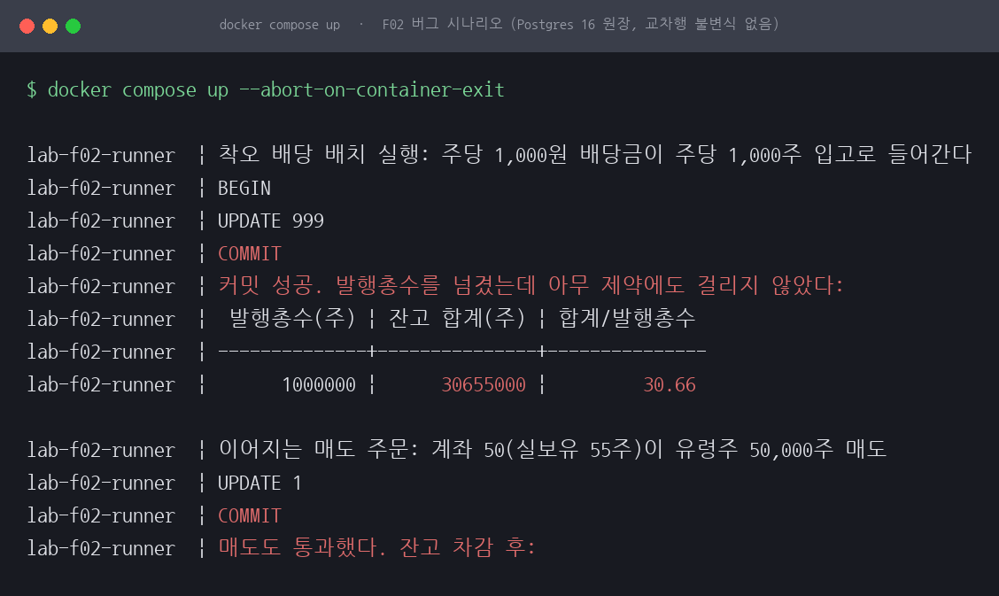
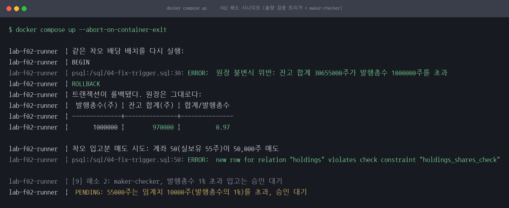
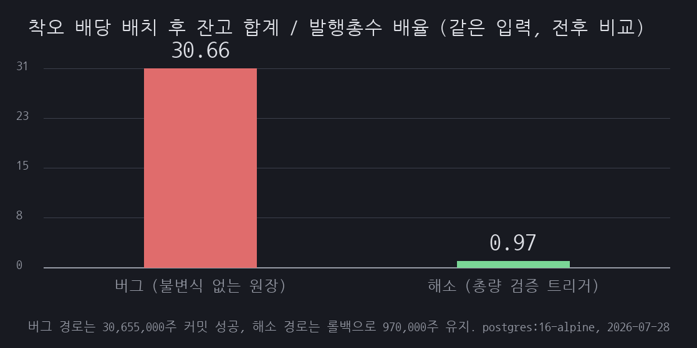

# F02 삼성증권 유령주식 축소 재현: 행 단위 CHECK는 잔고 합계를 막지 못한다

## 1. 유명한 이유

2018년 4월 6일 삼성증권은 우리사주 배당을 지급하면서 주당 1,000원 대신 주당 1,000주를 입고했고, 그렇게 총 28.1억 주가 직원 계좌에 찍혔습니다. 발행주식총수를 수십 배 넘는 수량인데 원장이 받아들였습니다. 직원 22명이 31분 동안 그 유령주식의 매도 주문을 냈고 그 가운데 일부가 체결돼 주가가 장중 -11.7%까지 밀렸으며, 금융위원회는 검사 후 업무 일부정지 6개월 등을 부과했습니다. 주문을 낸 22명과 실제로 체결된 물량은 다른 수치인데, 체결 쪽 수치는 이 글에서 따로 확인하지 않았습니다. 근거 등급은 E1·축소입니다. 사건의 실재는 금융위원회의 검사 결과와 제재 의결이 공개 기록으로 뒷받침하지만, 이 세션이 재현한 것은 사건이 아니라 그 사고가 통과한 원장 계층의 조건 하나입니다.

이 세션은 삼성증권의 내부 시스템을 재현하지 않습니다. 사건 자체는 그대로 재현할 수 없어, 이 사고가 통과한 여러 층 가운데 원장 계층의 메커니즘 하나를 축소 재현했습니다. 그러니까 재현 대상은 삼성증권의 원장이 아니라 조건입니다. "잔고 합계는 발행총수를 넘을 수 없다"는 교차행 불변식이 스키마에 없고 제약이 행 단위 CHECK뿐인 원장이라면, 애플리케이션의 원/주 단위 착오가 검증 없이 그대로 커밋된다는 것입니다. 삼성증권의 원장에 그 불변식이 있었는지 없었는지는 공개 문서로 확인되지 않아 이 글이 답할 수 있는 범위가 아닙니다.

## 2. 재현

원장을 작게 만들었습니다. 발행총수 1,000,000주짜리 가상 종목에 계좌 1,000개를 두고, 우리사주 조합원 999계좌가 각각 5~55주(결정적 분포), 기관 수탁 1계좌가 나머지를 보유해 예탁 잔고 합계가 970,000주가 되게 했습니다. holdings 테이블에는 수량 컬럼 shares(주)와 현금 컬럼 cash_krw(원)가 나란히 있고, 제약은 `shares >= 0` 같은 행 단위 CHECK뿐입니다. 환경은 Docker 위 postgres:16-alpine 하나이고, `docker compose up --abort-on-container-exit` 한 번으로 버그와 해소 시나리오가 순서대로 실행됩니다.

버그는 사건과 같은 구조의 단위 착오입니다. 주당 1,000원 현금 배당이 의도라서 `cash_krw = cash_krw + shares * 1000`이어야 하는데, 같은 수가 수량 컬럼으로 들어가 `shares = shares + shares * 1000`이 됩니다.



*그림 1. 버그 시나리오 실행 화면입니다. 착오 배당 배치가 커밋에 성공해 잔고 합계가 발행총수의 30.66배가 되고, 유령주 50,000주 매도까지 통과합니다.*

999계좌를 갱신한 UPDATE가 아무 제약에도 걸리지 않고 커밋됐습니다. 잔고 합계는 970,000주에서 30,655,000주가 되어 발행총수의 30.66배입니다.

이 30.66이라는 배수는 사건의 규모를 재현한 값이 아니라 시드 구성이 정한 값입니다. UPDATE가 닿는 조합원 999계좌의 합은 29,685주로 발행총수의 3%뿐이고, 나머지 940,315주는 배치가 손대지 않는 기관 수탁 1계좌에 있습니다. 1,001배로 부푸는 것은 그 3%짜리 앞부분뿐이라 29,685주에 1,001을 곱한 29,714,685주에 그대로 남은 940,315주를 더해 30,655,000주가 나옵니다. 조합원 지분 비율을 다르게 잡았다면 배수도 달라집니다. 사건 쪽에서 회자되는 배수와 자릿수가 비슷해 보이더라도 그렇게 맞춘 값이 아닙니다.

12주를 보유한 계좌에는 12,012주가 찍혔습니다. 이어서 실보유 55주인 계좌가 유령주 50,000주 매도(잔고 차감)를 넣었는데 이것도 통과했습니다. 잔고가 55,055주로 부풀려져 있어 차감 후에도 5,055주가 남으니 음수 잔고 CHECK에 걸릴 일이 없습니다. 명령과 출력 원문은 [reproduce.md](reproduce.md)에 있습니다.

## 3. 내부 원리

이 원장이 지켜야 할 규칙은 두 층입니다. "잔고는 음수가 될 수 없다"는 행 하나만 보면 판정할 수 있어 CHECK로 표현됩니다. "잔고 합계는 발행총수를 넘을 수 없다"는 holdings의 모든 행과 company의 행을 함께 봐야 하는 교차행 불변식이라 CHECK의 범위 밖입니다. 실제로 시도하면 Postgres가 문법 수준에서 거부합니다.

```
ALTER TABLE holdings ADD CONSTRAINT ... CHECK (sum(shares) <= 1000000);
ERROR:  aggregate functions are not allowed in check constraints

ALTER TABLE holdings ADD CONSTRAINT ... CHECK (shares <= (SELECT issued_shares FROM company ...));
ERROR:  cannot use subquery in check constraint
```

두 번째 시도는 문법에 걸리기 전에 이미 다른 규칙을 쓰고 있습니다. `shares <= (SELECT issued_shares ...)`는 행 하나의 잔고 상한이지 합계의 상한이 아닙니다. Postgres가 이 서브쿼리를 받아 줬다고 가정해도 계좌 1,000개가 각자 발행총수 이하이기만 하면 통과하므로, 착오 배당으로 합계가 30배가 되는 상황은 그대로 지나갑니다. 실제로 착오 배치가 끝난 뒤에도 가장 큰 계좌 잔고는 기관 수탁 계좌의 940,315주이고 부풀려진 조합원 계좌 쪽 최대는 55,055주라, 어느 행도 1,000,000주 상한에 닿지 않습니다. 통과했더라도 막지 못했을 제약입니다.

합계 상한을 굳이 행 단위 CHECK로 표현하려면 합계를 한 행으로 물질화해야 합니다. company에 잔고 합계 컬럼을 두고 그 행에 `total_shares <= issued_shares`를 걸면 CHECK의 범위 안에 들어옵니다. 대신 모든 입출고 경로에서 그 컬럼을 정확히 갱신할 책임이 새로 생기고, 갱신을 빠뜨린 경로가 하나라도 있으면 제약이 지키는 것은 원장이 아니라 틀린 숫자입니다. 이 세션에서는 이 대안을 구현하지 않았고, 아래의 트리거 쪽으로 갔습니다.

불변식을 스키마에 넣을 수 없으면 그 규칙은 애플리케이션 코드 어딘가의 관례로만 존재합니다. 배당 배치가 단위를 헷갈리는 순간, 원장 입장에서 그 갱신은 행 단위 제약을 모두 만족하는 정상 커밋입니다. 커밋된 뒤에는 부풀려진 잔고가 참값 행세를 하므로 매도 같은 후속 거래의 잔고 검증도 전부 통과합니다. 이 축소 원장에서 유령주식이 팔려 나갈 수 있었던 구조가 이 지점에 있습니다.

## 4. 해소

### 총량 검증 트리거

shares를 갱신하는 문장이 끝날 때마다 합계를 검사하는 문장 단위 AFTER 트리거를 달았습니다.

```sql
CREATE TRIGGER trg_total_cap
AFTER INSERT OR UPDATE OF shares ON holdings
FOR EACH STATEMENT EXECUTE FUNCTION assert_total_within_issued();
```

검증 함수는 `SUM(shares)`가 발행총수를 넘으면 예외를 던집니다. 같은 착오 배치를 다시 돌리면 UPDATE 문 끝에서 예외가 나고 트랜잭션 전체가 롤백됩니다. 원 단위 현금 배당은 shares를 건드리지 않아 트리거 자체가 동작하지 않고 통과합니다.

여기서 짚어 둘 것이 하나 있습니다. 이 트리거는 증감을 구분하지 않습니다. `AFTER INSERT OR UPDATE OF shares`는 shares가 SET 목록에 들어간 모든 문장에 걸리므로 매도 차감도 검증 함수를 지나갑니다. 합계가 줄어드는 문장에서 SUM 검사가 통과하는 것 자체는 문제가 아니지만, 뒤에 붙일 잠금까지 매도가 전부 지나간다는 점은 문제가 됩니다. 증가분만 걸러내려면 조건이 필요한데, 문장 단위 트리거의 WHEN에는 NEW와 OLD를 쓸 수 없습니다. Postgres가 문장 단위 트리거의 WHEN이 컬럼 값을 참조하는 것을 허용하지 않기 때문입니다. 행 단위 트리거로 내려 `WHEN (NEW.shares > OLD.shares)`를 걸거나, 문장 단위를 유지하려면 `REFERENCING OLD TABLE ... NEW TABLE ...` 전이 테이블로 증가 여부를 판정해야 합니다. 이 세션은 둘 다 구현하지 않았습니다.

그런데 트리거 하나로 끝나지 않았습니다. 동시 입고 2세션 실험에서 구멍이 실측됐습니다. 여유분 30,000주 상태에서 서로 다른 계좌로 20,000주 입고 2건을 동시에 넣으면, READ COMMITTED에서 각 세션의 SUM은 상대 세션의 미커밋 변경을 볼 수 없어 둘 다 합계를 990,000주로 계산하고 통과합니다. 둘 다 커밋된 뒤 합계는 1,010,000주로, 트리거가 달려 있는데도 불변식이 깨졌습니다.

잠금으로 검증을 직렬화해 막았습니다. 검증 함수 첫 줄에서 `pg_advisory_xact_lock(20180406)`을 잡으면 총량 검증부터 커밋까지가 한 세션씩 지나갑니다. 두 번째 세션은 첫 세션의 커밋을 기다린 뒤 검증에서 합계 1,010,000주를 보고 거부됩니다. company 행을 `SELECT ... FOR UPDATE`로 잠가 직렬화하는 변형도 가능하지만 이 세션에서는 advisory lock만 실측했습니다.

이 해소가 성립하는 조건은 격리 수준이 아니라 검증 함수의 volatility입니다. 잠금이 풀린 뒤의 SUM이 앞 세션이 커밋한 결과를 봐야 이 방식이 성립하는데, 함수 안의 질의가 새 스냅숏을 잡느냐 마느냐를 정하는 것이 volatility이기 때문입니다. VOLATILE 함수는 자기가 실행하는 질의마다 새 스냅숏을 잡고, STABLE과 IMMUTABLE 함수는 자기를 호출한 질의의 스냅숏을 그대로 씁니다. 이 세션의 `assert_total_within_issued()`는 volatility를 적지 않아 기본값 VOLATILE로 만들어졌고, 그래서 잠금 대기가 끝난 뒤의 SUM이 갱신된 합계를 봤습니다. 같은 함수를 STABLE로 선언하면 두 번째 세션은 잠금을 제대로 잡고도 대기 이전 스냅숏의 합계를 읽어 990,000주로 판정하고 통과시킵니다. 해소가 오류 하나 없이 조용히 무너지는 쪽입니다. 격리 수준만으로는 이 부분이 설명되지 않습니다. READ COMMITTED는 새로 잡은 스냅숏이 최신 커밋을 담게 하는 조건이지, 함수 안에서 새 스냅숏을 잡게 하는 조건이 아닙니다. 기본값에 기대고 있던 부분이라 세션의 SQL에 `VOLATILE`을 명시해 뒀습니다.

잠금 없이 격리 수준으로 막는 대안도 실측했습니다. 두 세션을 SERIALIZABLE로 돌리면 UPDATE는 둘 다 통과하고, 늦게 커밋하는 쪽이 커밋 시점에 직렬화 오류로 중단됩니다. 불변식은 지켜지지만 오류 메시지가 "재시도하면 성공할 수 있다"는 일반 직렬화 실패라 업무 사유가 드러나지 않고, 클라이언트에 재시도 로직이 필요합니다. 그래서 이 세션에서는 advisory lock 쪽을 택했습니다. 거부 사유가 업무 언어로 남기 때문입니다.

비용을 근거로 들지는 못합니다. 처음에는 원장 입고가 빈도 낮은 작업이라 직렬화 비용이 부담되지 않는다고 적었는데, 앞에서 본 대로 이 트리거는 매도 차감에도 걸립니다. 매도는 입고와 빈도가 다르고, 지금 구조에서는 모든 매도가 잠금 하나에 줄을 섭니다. 그 비용이 얼마인지는 재지 않았습니다.

### maker-checker

총량 트리거는 합계가 넘칠 때만 잡습니다. 총량 안쪽의 대형 착오까지 잡으려고 두 번째 층을 놓았습니다. 발행총수의 1%(10,000주)를 넘는 단일 입고는 잔고에 반영하지 않고 승인 대기(PENDING)로만 적재합니다. 승인 전에는 잔고가 그대로라 매도(차감)가 잔고 부족으로 거부되고, 입력자 본인의 승인은 막히며, 검토자가 반려하면 원장에 흔적 없이 끝납니다. 승인이 나더라도 그 반영 UPDATE는 다시 총량 트리거를 지나가므로 두 층이 겹칩니다.

## 5. 재계측

같은 착오 배치와 같은 매도를 해소 버전에서 다시 돌렸습니다.



*그림 2. 해소 시나리오 실행 화면입니다. 같은 착오 배치가 트리거 예외로 롤백되어 배율 0.97을 유지하고, 착오 입고분 매도는 잔고 부족으로 거부되며, 55,000주 입고 요청은 승인 대기로 묶입니다.*

착오 배치는 ERROR와 ROLLBACK으로 끝나고 잔고 합계는 970,000주(0.97배) 그대로입니다. 정상 현금 배당은 UPDATE 999가 커밋되어 계좌 7에 12,000원이 지급되고 잔고는 12주로 변하지 않았습니다.

착오 입고분 매도 시도는 잔고 부족으로 거부됐습니다. 다만 이건 총량 트리거가 새로 얻어낸 방어가 아닙니다. 앞 배치가 롤백돼 그 계좌 잔고가 실보유 55주로 남아 있으니, 50,000주 차감은 처음부터 있던 음수 잔고 CHECK에 걸립니다. 행 CHECK가 문장을 먼저 중단시키므로 문장 단위 AFTER 트리거는 실행되지도 않습니다. 롤백이 성립하면 따라오는 자명한 귀결이라, 매도 거부를 따로 성과로 세면 같은 사실을 두 번 세는 셈입니다.

maker-checker 경로에서는 55,000주 입고가 PENDING으로 묶여 잔고가 55주 그대로였고, 승인 전 매도 역시 거부됐으며, 검토자 반려로 마감됐습니다. 임계치 이하의 5,000주 입고는 즉시 반영됐습니다.



*그림 3. 같은 착오 배치에 대한 잔고 합계와 발행총수의 배율입니다. 버그 경로의 30.66배가 해소 경로에서 롤백으로 0.97배가 됩니다.*

동시 입고 경쟁은 네 라운드로 재계측했습니다. 잠금 없는 트리거는 다른 계좌 2건에서 1,010,000주(1.01배)로 깨졌고, 같은 계좌 2건에서는 990,000주로 막혔으며, advisory lock과 SERIALIZABLE은 모두 990,000주(0.99배)로 지켜냈습니다.

네 라운드는 각각 한 번의 고정 타이밍 실행입니다. 세션 기동 간격 1초와 `pg_sleep(3)`으로 검증 구간이 겹치게 만들어 둔 인터리빙 하나를 본 것이고, 같은 스크립트를 네 번 돌려 같은 수치를 얻었지만 타이밍이 고정이라 본 인터리빙은 여전히 하나입니다. 이 설계는 방향에 따라 세기가 다릅니다. 잠금 없는 트리거에 구멍이 있다는 주장은 반례 하나로 증명되므로 라운드 1은 그대로 유효합니다. 반대로 advisory lock과 SERIALIZABLE이 안전하다는 주장은 반례가 없다는 주장이라, 인터리빙 하나에서 통과한 것으로는 증명되지 않습니다. 이 글에서 라운드 3과 4가 보이는 것은 그 인터리빙에서 구멍이 재현되지 않았다는 사실까지입니다.

## 6. 예상과 달랐던 점

셋이 처음 생각과 달랐습니다.

첫째, 잠금 없는 트리거의 구멍이 테스트 방법에 따라 보이지 않았습니다. 동시 입고 2건을 같은 계좌로 넣으면 두 번째 세션의 UPDATE가 행 잠금에 막혀 첫 세션의 커밋을 기다리고, 풀려난 뒤의 검증이 합계 초과를 잡아냅니다. 실측에서도 990,000주로 막혔습니다. 동시성 테스트를 한 계좌에 부하를 몰아넣는 방식으로 짰다면 트리거가 안전하다고 결론 내렸을 것입니다. 구멍은 서로 다른 계좌, 그러니까 행 잠금이 겹치지 않는 경로에만 있었습니다.

둘째, SERIALIZABLE의 거부 시점이 생각보다 늦었습니다. 세션 B의 UPDATE는 `UPDATE 1`을 출력하며 통과했고, 오류는 커밋 순간에 "Canceled on identification as a pivot, during commit attempt"로 났습니다. advisory lock 라운드는 UPDATE 단계에서 업무 규칙 메시지로 거부됩니다. 결과는 같아도 실패를 통보받는 위치와 메시지가 달라서, 앞단 애플리케이션의 오류 처리와 재시도 설계가 달라집니다.

셋째, advisory lock 해소가 성립하는 근거를 실행 전에는 확신하지 못했습니다. 잠금에서 풀려난 세션의 SUM이 앞 세션의 커밋 결과를 봐야 이 방식이 성립하는데, 트리거 안의 질의가 잠금을 기다리기 전 스냅숏에 묶여 있다면 잠금을 제대로 잡고도 낡은 합계로 검증해 뚫렸을 것입니다. 실측에서 세션 B의 오류 메시지가 잔고 합계를 1,010,000주로 찍었습니다. 앞 세션이 커밋한 990,000주에 자기 몫 20,000주를 더한 값이니, 잠금이 풀린 뒤의 질의가 새 스냅숏을 얻었다는 사실이 오류 메시지 안에 그대로 남았습니다.

여기서 한 번 더 틀렸습니다. 이 결과를 처음에는 READ COMMITTED 덕분이라고 적었는데, 새 스냅숏을 잡게 하는 것은 격리 수준이 아니라 함수의 volatility입니다. 그리고 이 함수는 volatility를 안 적어 기본값 VOLATILE로 만들어져 있었습니다. 해소가 통한 이유가 골라서 넣은 설정이 아니라 안 적어서 얻은 기본값이었다는 뜻이라, 누가 나중에 "읽기만 하는 함수니까"라며 STABLE을 붙이면 코드 리뷰에서 반길 만한 변경 하나로 해소가 사라집니다. 지금은 SQL에 `VOLATILE`을 명시하고 이유를 주석으로 붙여 뒀습니다. 다만 STABLE로 바꿔 같은 라운드를 돌린 실행은 이 세션의 실행 목록에 없습니다. STABLE이면 뚫린다는 위의 서술은 실측이 아니라 Postgres의 volatility 규정에서 나온 것이고, 실행으로 확인하는 것은 남은 과제입니다.

## 한계

실제 사건의 배당 시스템, 예탁결제원 총량 대사, 매매 체결과 시장은 재현하지 않았습니다. 원/주 단위 착오가 불변식 없는 원장에 커밋되는 메커니즘만 축소했고, 매도는 잔고 차감으로만 모델링했습니다.

발행총수의 97%가 원장 하나에 예탁돼 있다는 설정은 동시성 실험의 여유분을 만들기 위한 시연용 단순화입니다. 실제로는 증권사 원장과 예탁결제원 총량을 맞춰 보는 대사가 별도 층으로 존재합니다.

총량 트리거는 shares를 갱신하는 문장마다 holdings 전체를 SUM 하므로 1,000계좌에서는 문제가 없지만 큰 원장에서는 비용이 됩니다. 늘리는 문장만이 아니라 매도 차감까지 같은 경로를 지나는데, 그 빈도 차이가 만드는 비용은 재지 않았습니다. 종목별 합계 테이블을 증분 유지하는 설계가 필요하고, 그 성능도 측정하지 않았습니다. advisory lock은 이 DB 안의 단일 잠금이라 모든 입고 경로가 트리거를 지날 때만 유효하고, 원장이 여러 DB로 나뉘면 성립하지 않습니다. SERIALIZABLE 대안은 재시도 로직 구현까지는 다루지 않았습니다.

동시성 실험의 겹침은 세션 기동 간격 1초와 `pg_sleep(3)`으로 고정해 만든 것이라, 라운드마다 인터리빙 하나씩만 봤습니다. 임의 타이밍에서의 충돌 확률도, advisory lock과 SERIALIZABLE이 다른 인터리빙에서도 버티는지도 별개 문제입니다.

세 가지를 그대로 남겨 뒀습니다. 트리거를 증가분에만 걸리게 바꾸는 것, 검증 함수를 STABLE로 선언했을 때 해소가 실제로 무너지는지 실행으로 확인하는 것, company에 잔고 합계 컬럼을 두는 CHECK 대안을 구현해 트리거와 비교하는 것입니다. maker-checker 임계치 1%는 시연용 값이고, 실제라면 종목 유동성과 평소 입고 분포를 보고 정해야 합니다.
