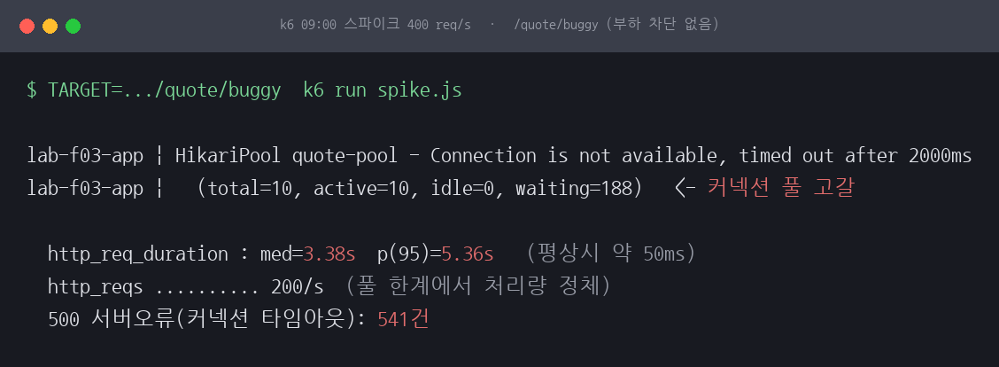
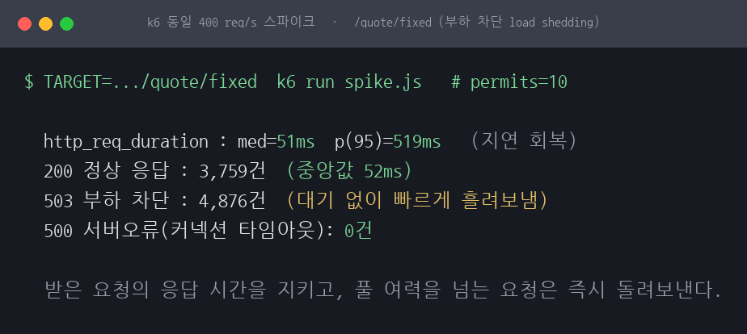
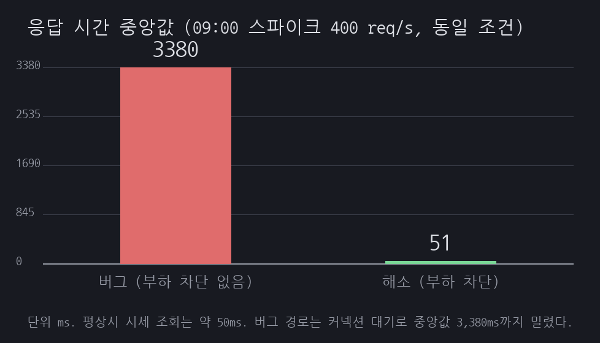
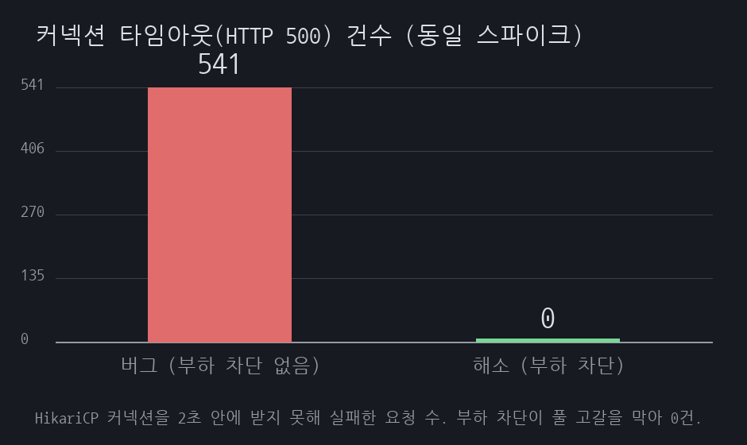

# F03 장 시작 9시 접속 폭주

## 1. 유명한 이유

한국 증권사의 MTS는 장이 열리는 오전 9시 정각에 트래픽이 몰립니다. 금융감독원 집계로 2022년부터 2026년 3월까지 증권사 MTS 전산 장애가 190건 있었고, 그중 카카오페이증권과 토스증권이 각각 42건으로 전체의 약 44%를 차지했습니다. 개별 사례로는 한국투자증권이 2026년 5월 6일 개장 직후 약 7분, 메리츠증권이 2026년 4월 9일 약 40분간 접속 장애를 겪었습니다. 근거 등급은 E1입니다. 사건의 발생과 규모는 감독당국 집계와 언론 보도로 확인됩니다.

다만 각 사의 내부 원인 분석은 공개되지 않았습니다. 그래서 이 세션은 특정 사의 원인을 그대로 재현하지 않습니다. 장 시작 급증에서 백엔드가 무너지는 대표 메커니즘 하나, 커넥션 풀 고갈을 재현합니다. 시세 조회 한 건이 DB 커넥션을 잠깐 잡는데, 그 조회가 초당 수백 건씩 몰리면 풀이 마르고 뒤따르는 요청이 커넥션을 기다리다 무너지는 과정입니다.

## 2. 재현

증권 MTS의 시세 조회 API를 축소했습니다. Spring Boot 3.3의 내장 Tomcat에 조회 엔드포인트 `GET /quote`를 두고, 조회 한 건이 DB 커넥션을 약 50ms 점유하도록 했습니다. 느린 조인이나 직렬화, 외부 시세 대기 같은 실제 지연을 pg_sleep으로 모델링한 것입니다. HikariCP 풀은 10, 커넥션 획득 제한 시간은 2초입니다. 조회 한 건이 커넥션을 50ms 잡으므로 풀 10으로는 초당 약 200건이 한계입니다.

부하는 k6로 09:00 정각 스파이크를 흉내 냈습니다. 도착률 모델로 초당 400건을 5초에 걸쳐 올려 20초를 유지했습니다. 풀 용량의 두 배입니다. 환경은 Docker 위 Postgres 16과 eclipse-temurin:21입니다.



*그림 1. 부하 차단이 없는 버그 경로의 부하 화면입니다. 풀 열 개가 모두 사용 중이고 대기 큐에 188건이 쌓여, 응답 중앙값이 3.38초로 밀리고 541건이 타임아웃으로 실패합니다.*

부하 차단이 없는 `/quote/buggy`는 초당 약 200건까지만 처리하고 나머지는 커넥션을 기다렸습니다. 응답 시간 중앙값이 평상시 약 50ms에서 3.38초로, p95는 5.36초로 밀렸습니다. 2초 안에 커넥션을 받지 못한 541건은 500으로 떨어졌습니다. 이때 풀은 열 개가 모두 사용 중이고 획득 대기 큐에 188건이 쌓여 있었습니다. 앱 로그 원문은 [results/hikari-timeout.txt](results/hikari-timeout.txt), k6 요약은 [results/buggy-k6.txt](results/buggy-k6.txt)에 있습니다.

## 3. 내부 원리

커넥션 풀은 DB로 나가는 동시 연결 수를 제한합니다. 풀이 10이면 어느 순간에도 조회 열 건만 DB에서 돌 수 있습니다. 조회 한 건이 50ms 걸리면 커넥션 하나는 초당 스무 건을 처리하고, 열 개면 초당 200건이 이 시스템의 상한입니다. 초당 400건이 들어오면 절반은 빈 커넥션이 없어 큐에서 기다립니다.

기다림은 두 곳에서 쌓입니다. 먼저 HikariCP의 획득 대기 큐입니다. 앞 요청이 커넥션을 반환할 때까지 기다리다 2초를 넘기면 `SQLTransientConnectionException`이 나고 500으로 끝납니다. 다음은 내장 Tomcat의 처리 스레드입니다. 스레드가 커넥션을 기다리며 붙잡혀 있으면 새 요청은 그 앞 단계에서 다시 기다립니다. 그래서 증상이 500 에러보다 응답 시간 폭증으로 먼저 나타납니다. 제한 시간을 넉넉히 둘수록 요청은 실패 대신 몇 초씩 매달립니다. 이 재현에서 500이 541건이었는데도 중앙값 지연이 3.38초였던 이유가 여기 있습니다.

## 4. 해소

먼저 풀을 키우는 방법이 떠오릅니다. 그런데 풀을 키우면 병목이 DB로 옮겨갈 뿐입니다. 커넥션이 늘면 DB의 CPU와 잠금 경합이 그만큼 늘어, 어느 지점을 넘으면 오히려 느려집니다. HikariCP 문서도 풀은 작게 유지하라고 권합니다. 이 시스템의 상한은 결국 DB가 초당 처리할 수 있는 조회 수이고, 풀 크기로 그 상한을 넘길 수는 없습니다.

그래서 들어오는 양을 제어하는 쪽을 택했습니다. 부하 차단(load shedding)입니다. 동시에 DB 경로로 들어갈 수 있는 요청 수를 풀 크기와 같게 제한하고, 자리가 없으면 기다리지 않고 즉시 503으로 돌려보냅니다. 증권 MTS의 가상 대기열과 같은 원리입니다. 전원을 다 받아 다 함께 무너지느니, 받을 만큼만 받아 그 요청의 응답 시간을 지키고 나머지는 빨리 돌려보냅니다.

```java
@GetMapping("/quote/fixed")
public ResponseEntity<String> fixed(@RequestParam String symbol) {
    if (!shedder.tryEnter()) {
        return ResponseEntity.status(503).body("busy: 잠시 후 다시 시도해 주세요");
    }
    try {
        return ResponseEntity.ok(symbol + "=" + quotes.lookup(symbol));
    } finally {
        shedder.leave();
    }
}
```

논블로킹 `tryAcquire`를 쓴 이유는, 대기를 허용하면 그 대기가 다시 큐 적체가 되어 문제를 미룰 뿐이기 때문입니다. 지금 처리 가능한지만 보고 아니면 바로 흘려보냅니다. 허용 수를 풀과 같게 두면 받은 요청이 커넥션을 곧바로 잡아 지연이 가장 낮습니다. 이 값을 풀보다 크게 올리면 더 많은 요청을 받아 정상 응답 수는 늘지만, 늘어난 요청이 커넥션을 다투어 받은 요청의 지연이 다시 올라갑니다. 이 교환은 6절에서 다시 봅니다.

이 재현에서는 부하 차단 한 겹만 넣었습니다. 실제 MTS는 여기에 조회 경로와 주문 경로를 분리해 주문을 먼저 보호하고, 대기열 페이지로 사용자에게 순번을 보여 주며, 근본적으로는 조회가 커넥션을 잡는 시간을 줄입니다.

## 5. 재계측

같은 400건 스파이크를 부하 차단이 있는 `/quote/fixed`에 그대로 줬습니다.



*그림 2. 부하 차단을 넣은 해소 경로입니다. 응답 중앙값이 51ms로 돌아오고, 넘치는 4,876건은 빠르게 503으로 흘려보내며, 커넥션 타임아웃은 0건입니다.*

응답 시간 중앙값이 3.38초에서 51ms로 돌아왔고, p95는 5.36초에서 519ms가 됐습니다. 정상 응답 3,759건은 중앙값 52ms로 처리됐고, 풀 여력을 넘은 4,876건은 대기 없이 503으로 흘려보냈습니다. 2초 커넥션 타임아웃으로 인한 500은 541건에서 0건이 됐습니다. 풀이 마르지 않았기 때문입니다. k6 요약은 [results/fixed-k6.txt](results/fixed-k6.txt)에 있습니다.



*그림 3. 같은 스파이크에서 응답 시간 중앙값입니다. 3,380ms에서 51ms로 돌아옵니다.*



*그림 4. 같은 스파이크에서 커넥션 타임아웃(500) 건수입니다. 541건에서 0건이 됩니다.*

부하 차단은 처리량을 늘리지 않습니다. DB가 초당 약 200건이라는 상한은 그대로입니다. 부하 차단이 지킨 것은 받은 요청의 응답 시간과 시스템의 생존입니다. 넘치는 요청을 2초씩 매달아 다 함께 죽는 대신, 1ms 만에 돌려보내 받은 요청을 정상 속도로 처리했습니다.

## 6. 예상과 달랐던 점

세 가지가 처음 생각과 달랐습니다.

첫째, 풀 고갈의 첫 증상은 에러가 아니라 지연이었습니다. 풀이 마르면 500이 쏟아질 것이라 생각했는데, 커넥션 획득 제한 시간이 2초로 넉넉하다 보니 대부분의 요청은 실패하지 않고 몇 초씩 기다렸습니다. 500은 541건뿐이었지만 중앙값 지연이 3.38초였습니다. 제한 시간을 짧게 잡으면 실패가 빨리 드러나고, 길게 잡으면 지연으로 숨습니다. 모니터링을 500 에러율만 보면 이 장애를 놓치고, p95 지연을 함께 봐야 잡힌다는 뜻입니다.

둘째, 부하 시험의 부하 모델이 결과를 바꿨습니다. 처음에는 고정 사용자 수를 반복시키는 닫힌 모델로 200명이 요청하게 했는데, 해소 경로에서 503이 즉시 떨어지자 그 사용자들이 곧바로 재요청을 퍼부어 초당 수천 건이 됐고, 재현하려던 커넥션 풀 고갈이 아니라 Tomcat의 연결 수락 큐 고갈이 재현됐습니다. connection refused가 2만 건 넘게 찍혔습니다. 도착률을 고정하는 열린 모델로 바꾸자 병목이 풀 계층에 다시 고정됐습니다. 빠른 거부가 오히려 재시도 폭풍을 부른다는 것은, 실제 대기열 설계에서 클라이언트 백오프가 필요한 이유이기도 합니다.

셋째, 부하 차단은 처리량을 늘려 주지 않았습니다. 허용 수를 조정해도 DB의 초당 200건이라는 벽은 그대로였고, 손잡이가 바꾼 것은 지연과 처리량 사이의 균형뿐이었습니다. 부하 차단의 값어치는 더 많이 처리하는 데 있지 않고, 감당 못 할 부하에서 받은 요청의 응답 시간을 지키고 시스템을 살려 두는 데 있었습니다.

## 한계

단일 인스턴스에서 시세 조회 하나만 재현했습니다. 실제 MTS의 주문·체결·실시간 시세 스트림, 여러 인스턴스와 로드밸런서, 그 앞단의 API 게이트웨이는 다루지 않았습니다. 조회의 DB 점유 시간은 pg_sleep 50ms로 모델링한 값이라 실제 쿼리 프로파일과 다릅니다. 수치는 공유 호스트에서 30초 단일 실행으로 잰 것이라, 과부하 구간의 정확한 처리량과 p95는 실행마다 흔들립니다. 안정적으로 재현되는 것은 커넥션 타임아웃과 풀 대기 큐가 사라진다는 점, 그리고 중앙값 지연이 초 단위에서 수십 ms로 돌아온다는 점입니다. CATALOG가 제시한 가상 대기열과 조회·주문 경로 분리는 부하 차단 한 겹으로 축소했습니다.
