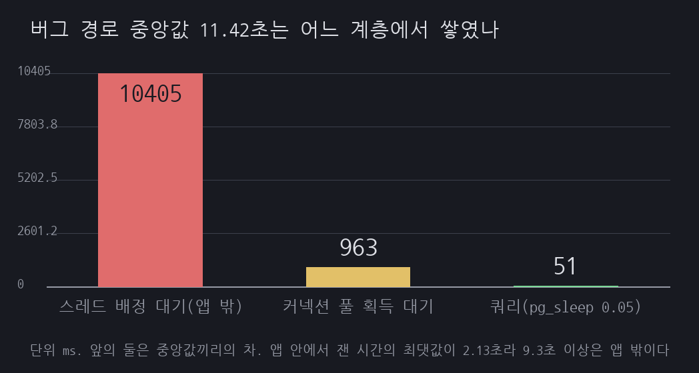

# F03 장 시작 9시 접속 폭주

## 1. 유명한 이유

한국 증권사의 MTS는 장이 열리는 오전 9시 정각에 트래픽이 몰립니다. 국회 정무위원회 이양수 의원실이 계좌 500만 개 이상을 가진 증권사 12곳에서 제출받은 자료를 보면, 2022년 1월부터 2026년 3월까지 MTS 전산 장애가 190건 있었고 그중 카카오페이증권과 토스증권이 각각 42건으로 전체의 약 44%였습니다([굿모닝경제 2026-04-14](https://www.goodkyung.com/news/articleView.html?idxno=285848), [NSP통신 2026-04-14](https://www.nspna.com/news/?mode=view&newsid=809679)). 이 집계는 의원실이 각 사에서 받은 자료를 언론이 보도한 것이고, 금융감독원이 같은 내용을 공표한 원문은 확인하지 못했습니다. 개별 사례로는 한국투자증권이 2026년 5월 6일 오전 9시 4분부터 11분까지 약 7분간 잔고 조회가 지연됐고([머니투데이 2026-05-06](https://www.mt.co.kr/stock/2026/05/06/2026050611250058757)), 메리츠증권이 2026년 4월 9일 약 40분간 접속 장애를 겪었다는 보도가 있습니다. 메리츠 건은 1차 자료를 확인하지 못했습니다.

근거 등급은 E1·축소입니다. 장애가 반복해서 일어났다는 사실과 그 건수까지는 위 자료로 확인되지만, 각 사의 내부 원인 분석은 공개되지 않았습니다. 그래서 이 세션은 특정 사의 원인을 그대로 재현하지 않습니다. 장 시작 급증에서 백엔드가 무너지는 대표 메커니즘 하나, 커넥션 풀 고갈을 골라 규모를 줄여 재현합니다. 여기서 재현한 커넥션 풀 고갈은 실제 장애의 확인된 원인이 아니라 원인 가설이고, 가설로서의 근거는 벤더 문서와 업계 통념 수준인 E2입니다. 시세 조회 한 건이 DB 커넥션을 잠깐 잡는데, 그 조회가 초당 수백 건씩 몰리면 풀이 마르고 뒤따르는 요청이 커넥션을 기다리다 무너지는 과정입니다.

## 2. 재현

증권 MTS의 시세 조회 API를 축소했습니다. Spring Boot 3.3의 내장 Tomcat에 조회 엔드포인트 `GET /quote`를 두고, 조회 한 건이 DB 커넥션을 약 50ms 점유하도록 했습니다. 느린 조인이나 직렬화, 외부 시세 대기 같은 실제 지연을 pg_sleep으로 모델링한 것입니다. HikariCP 풀은 10, 커넥션 획득 제한 시간은 2초입니다. 조회 한 건이 커넥션을 50ms 잡으므로 풀 10으로는 초당 약 200건이 한계입니다. 이 200건이라는 상한은 실측이 아니라 `pg_sleep(0.05)`라는 모형이 정의한 값입니다. 실제 조회는 CPU와 IO를 쓰고 서로 경합하므로 상한이 이렇게 깔끔하게 떨어지지 않습니다. 아래에서 초당 200건이라는 표현이 나오면 전부 이 모형의 산술이라고 읽어야 합니다.

부하는 k6로 09:00 정각 스파이크를 흉내 냈습니다. 도착률 모델로 초당 400건을 5초에 걸쳐 올려 20초를 유지했습니다. 풀 용량의 두 배입니다. VU는 5,000개를 미리 잡아 두었습니다. 이 숫자가 중요합니다. VU 하나는 응답을 받을 때까지 묶여 있으므로 모자라면 도착률 모델을 걸어 두고도 목표만큼 쏘지 못합니다. 1차 측정에서 실제로 그렇게 됐고 그 이야기는 5절에서 하겠습니다. 환경은 Docker 위 Postgres 16과 eclipse-temurin:21입니다.

호스트는 2 vCPU 한 대입니다(`uname -srm`은 `Linux 5.14.0-570.33.2.el9_6.aarch64`, `nproc`는 2, 메모리 11GiB). Postgres와 앱, 그리고 부하 생성기 k6가 모두 이 한 대에서 돌았고 compose 파일에 컨테이너 CPU 제한을 걸지 않았습니다. 부하 생성기가 측정 대상과 코어 두 개를 나눠 썼다는 뜻이라, 아래 지연 수치에는 k6 자신이 만든 경합이 섞여 있습니다.


*그림 1. 부하 차단이 없는 버그 경로의 부하 화면입니다. 풀 열 개가 모두 사용 중이고 획득 대기 큐가 쌓여 응답 중앙값이 11.42초로 밀립니다. 앱이 던진 예외 761건과 k6가 받은 500 응답 761건이 같습니다.*

부하 차단이 없는 `/quote/buggy`는 초당 약 200건까지만 처리하고 나머지는 커넥션을 기다렸습니다. 응답 시간 중앙값이 평상시 약 50ms에서 11.42초로, p95는 20.96초로 밀렸습니다. 이때 풀은 열 개가 모두 사용 중이었고 획득 대기 큐에 최대 191건이 쌓여 있었습니다. 로그 원문의 첫 예외는 `total=10, active=10, idle=0, waiting=186`입니다.

2초 안에 커넥션을 받지 못한 요청은 500으로 떨어졌습니다. 목표 도착률의 10,000회 가운데 9,999회가 발사됐고 그중 761건이 500입니다. [results/raw/buggy-k6.txt](results/raw/buggy-k6.txt)의 상태 분포가 200이 9,238건, 500이 761건, 503이 0건, 응답을 받지 못한 요청이 0건이고 합이 `http_reqs` 9,999건과 정확히 맞습니다.

그리고 이번에는 그 761건이 무엇 때문이었는지도 갈립니다. 앱 로그를 발췌하지 않고 통째로 저장해 `grep -c "Connection is not available"`을 돌리니 정확히 761건이 나왔습니다. k6가 클라이언트 쪽에서 받은 500과 앱이 서버 쪽에서 던진 예외가 같은 수입니다. 조건을 바꿔 가며 일곱 번을 돌렸는데 전부 맞았습니다. 앱 예외와 k6의 500이 각각 761/761, 1,268/1,268, 0/0, 26/26, 3,945/3,945, 0/0, 0/0입니다.

이 대조는 1차 측정에서 걸렸던 문제를 풀려고 넣은 것입니다. 그때는 재현 기록이 같은 `grep -c`를 541건으로 적고 발췌 파일은 27건으로 적어, 앱 로그 쪽 집계가 저장소 안에서 갈렸습니다. 발췌 파일이 스택트레이스를 줄여 놓은 것이라 어느 쪽이 참인지 가릴 수 없었고, 그래서 "500 541건 가운데 몇 건이 풀 타임아웃인지는 모른다"고 적어 두어야 했습니다. 27이 무엇이었는지는 지금도 모릅니다. 다만 이 기록은 더 이상 그 값에 기대지 않습니다.

## 3. 내부 원리

커넥션 풀은 DB로 나가는 동시 연결 수를 제한합니다. 풀이 10이면 어느 순간에도 조회 열 건만 DB에서 돌 수 있습니다. 조회 한 건이 50ms 걸리면 커넥션 하나는 초당 스무 건을 처리하고, 열 개면 초당 200건이 이 시스템의 상한입니다. 초당 400건이 들어오면 절반은 빈 커넥션이 없어 큐에서 기다립니다.

기다림은 두 곳에서 쌓입니다. 먼저 HikariCP의 획득 대기 큐입니다. 앞 요청이 커넥션을 반환할 때까지 기다리다 2초를 넘기면 `SQLTransientConnectionException`이 나고 500으로 끝납니다. 다음은 내장 Tomcat의 처리 스레드입니다. 스레드가 커넥션을 기다리며 붙잡혀 있으면 새 요청은 그 앞 단계에서 다시 기다립니다. 그래서 증상이 500 에러보다 응답 시간 폭증으로 먼저 나타납니다. 제한 시간을 넉넉히 둘수록 요청은 실패 대신 몇 초씩 매달립니다.

그러면 중앙값 11.42초 가운데 어느 계층이 얼마를 먹었을까요. 1차에서는 이 물음에 산술로만 답했습니다. `connection-timeout`이 2000ms라 풀 대기의 상한이 2초이고 쿼리 50ms를 더해도 2.05초이니 나머지는 앞단에서 쌓였을 것이라는 추론이었습니다. 이번에는 앱에 계측을 넣어 실제로 갈랐습니다.

서블릿 필터를 맨 앞에 두어 진입부터 응답 완료까지를 재고, `DataSource`를 감싸 커넥션 획득에 걸린 시간만 따로 잽니다. 필터에 닿았다는 것은 이미 Tomcat 작업 스레드를 하나 잡았다는 뜻입니다. 그러니 k6가 잰 전체 시간에서 필터가 잰 시간을 빼면 스레드를 기다린 시간이 남습니다.



*그림 2. 중앙값 11.42초의 계층별 몫입니다. 커넥션 풀 대기는 0.96초, 쿼리는 0.05초, 나머지 약 10.4초는 서블릿에 닿기도 전에 쌓인 시간입니다.*

앱 안에서 쓴 시간은 중앙값 1.01초였습니다. 그 대부분인 0.96초가 커넥션 획득 대기이고 쿼리가 0.05초입니다. 나머지 약 10.4초, 그러니까 중앙값의 91%는 서블릿 필터에 닿기도 전에 쌓였습니다. 같은 시각에 찍은 큐 길이가 이와 맞습니다. Tomcat 작업 스레드는 200개가 전부 사용 중이고, 스레드를 기다리는 요청이 최대 4,335건, 열려 있는 소켓이 4,995개였습니다.

중앙값끼리 뺀 값이라 엄밀하게는 근사입니다. 근사에 기대지 않는 하한은 이렇습니다. 앱 안에서 잰 시간의 최댓값이 2.13초였으므로, 중앙값 11.42초짜리 요청은 적어도 9.3초를 앱 밖에서 기다렸습니다.

`max-threads`를 바꿔 가며 확인했습니다. 이 값이 대기가 어느 계층에 고이는지를 정합니다.

| max-threads | 응답 중앙값 | 앱 안 중앙값 | 풀 획득 중앙값 | 500 응답 | 획득 대기 큐 최대 | 스레드 대기 큐 최대 |
|---|---|---|---|---|---|---|
| 10 | 13.54초 | 51.28ms | 0.00ms | 0건 | 0 | 4,947 |
| 50 | 13.35초 | 59.66ms | 0.04ms | 26건 | 41 | 4,864 |
| 200 (기본) | 11.16초 | 1,014.66ms | 962.97ms | 761건 | 191 | 4,335 |
| 1000 | 8.87초 | 1,701.09ms | 1,589.14ms | 3,945건 | 901 | 745 |

스레드를 늘리면 처리량이 늘 것 같지만 그렇지 않습니다. 상한은 풀 10개와 쿼리 50ms가 정하므로 그대로입니다. 바뀌는 것은 대기가 어디에 쌓이는지입니다. 스레드 10개에서는 풀이 한 번도 기다리지 않고(획득 중앙값 0.00ms, 500 응답 0건) 요청이 전부 스레드 대기 큐에 쌓입니다(최대 4,947건). 스레드 1000개에서는 그 대기가 풀로 옮겨가 획득 대기 큐가 901건까지 차고 500 응답이 3,945건 납니다.

즉 스레드를 늘리는 것은 보이지 않던 accept 큐 대기를 눈에 보이는 500 에러로 바꾸는 일입니다. 어느 쪽이 나은지는 상황에 따라 갈립니다. 빨리 실패하는 편이 나으면 스레드를 늘리고, 실패를 줄이는 편이 나으면 줄입니다. 다만 어느 쪽도 용량을 늘리지는 않습니다.

## 4. 해소

먼저 풀을 키우는 방법이 떠오릅니다. 커넥션이 늘면 DB의 CPU와 잠금 경합이 그만큼 늘어 어느 지점을 넘으면 오히려 느려진다는 것이, HikariCP 문서가 풀을 작게 유지하라고 권하는 이유입니다. 다만 이것은 문서의 주장이지 이 실험이 보인 사실이 아닙니다. 풀 크기를 바꿔 가며 재지 않았습니다. 게다가 이 재현의 초당 200건은 DB의 실제 경합이 아니라 `pg_sleep(0.05)`가 정의한 값이라, 풀을 키우면 어디서 무너지는지를 이 모형으로는 답할 수 없습니다. 풀 확대를 택하지 않은 것은 측정 결과가 아니라 문서의 권고를 따른 판단입니다.

그래서 들어오는 양을 제어하는 쪽을 택했습니다. 부하 차단(load shedding)입니다. 동시에 DB 경로로 들어갈 수 있는 요청 수를 풀 크기와 같게 제한하고, 자리가 없으면 기다리지 않고 즉시 503으로 돌려보냅니다. 증권 MTS의 가상 대기열과 같은 원리입니다. 전원을 다 받아 다 함께 무너지느니, 받을 만큼만 받아 그 요청의 응답 시간을 지키고 나머지는 빨리 돌려보냅니다.

```java
@GetMapping("/quote/fixed")
public ResponseEntity<String> fixed(@RequestParam String symbol) {
    if (!shedder.tryEnter()) {
        return ResponseEntity.status(503).body("busy: 잠시 후 다시 시도해 주세요");
    }
    try {
        return ResponseEntity.ok(symbol + "=" + quotes.lookup(symbol));
    } finally {
        shedder.leave();
    }
}
```

논블로킹 `tryAcquire`를 쓴 이유는, 대기를 허용하면 그 대기가 다시 큐 적체가 되어 문제를 미룰 뿐이기 때문입니다. 지금 처리 가능한지만 보고 아니면 바로 흘려보냅니다. 허용 수를 풀과 같게 두면 받은 요청이 커넥션을 곧바로 잡아 지연이 가장 낮습니다. 이 값을 풀보다 크게 올리면 더 많은 요청을 받아 정상 응답 수는 늘지만, 늘어난 요청이 커넥션을 다투어 받은 요청의 지연이 다시 올라갈 것입니다. 다만 허용 수를 바꿔 가며 재지는 않았습니다. 잰 것은 `permits=10` 한 조건뿐이라, 이 교환은 측정 결과가 아니라 구조에서 나오는 예상입니다.

이 재현에서는 부하 차단 한 겹만 넣었습니다. 실제 MTS는 여기에 조회 경로와 주문 경로를 분리해 주문을 먼저 보호하고, 대기열 페이지로 사용자에게 순번을 보여 주며, 근본적으로는 조회가 커넥션을 잡는 시간을 줄입니다.

## 5. 재계측

같은 k6 스크립트를 부하 차단이 있는 `/quote/fixed`에 돌렸습니다. **이번에는 두 경로가 같은 부하를 받았습니다.** 양쪽 다 목표 10,000회 가운데 9,999회가 발사되고 중단된 반복이 0건입니다. 1차에서는 버그 경로의 응답이 느려 VU가 모자라 3,401회분이 발사되지 못했고(`dropped_iterations 3401`) 앱에 도달한 요청이 6,598건과 9,959건으로 51% 달랐습니다. VU를 900에서 5,000으로 올려 그 결함을 없앴습니다. 그래서 처리량 비교가 이번에는 성립합니다.


*그림 3. 부하 차단을 넣은 해소 경로입니다. 응답 중앙값이 52ms로 돌아오고, 넘치는 5,245건은 빠르게 503으로 흘려보내며, 500은 0건입니다.*

정상 응답 4,754건은 중앙값 51.94ms, p95 188.46ms로 처리됐고 풀 여력을 넘은 5,245건은 503으로 흘려보냈습니다. 두 값을 더하면 9,999건으로 `http_reqs`와 정확히 맞습니다. 1차에 있던 "200도 503도 아닌 실패 1,324건"이 이번에는 0건입니다. VU가 넉넉해 램프업 구간에서 소켓이 거부되지 않았습니다.

2초 커넥션 타임아웃으로 인한 500은 0건입니다. 풀이 마르지 않았기 때문입니다. 앱 안에서 잰 커넥션 획득 시간이 중앙값 0.01ms입니다. 버그 경로의 962.97ms와 비교하면 9만 배 차이입니다. 획득 대기 큐 최댓값도 1건이고 스레드 대기 큐는 76건입니다. 버그 경로의 191건과 4,335건에서 내려온 값입니다.

**503이 실제로 얼마나 빨리 나갔는지도 이번에는 쟀습니다.** 중앙값 1ms, 평균 29.63ms, p95 189ms, 최소 370.8마이크로초, 최대 453.4ms입니다. 1차 본문에 있던 "1ms 만에 돌려보낸다"는 중앙값으로는 맞지만 평균과 p95는 그보다 큽니다. 램프업 구간에서 몇 건이 늦게 나갔습니다.


*그림 4. 응답 시간 중앙값입니다. 11,420ms에서 52ms로 돌아옵니다. 이번에는 두 실행이 받은 요청 수가 9,999건으로 같습니다.*


*그림 5. HTTP 500 응답 건수입니다. 양쪽 다 k6가 받은 응답을 센 값이고, 버그 경로 761건은 앱이 던진 커넥션 획득 타임아웃 예외 761건과 같은 수입니다.*

부하 차단은 처리량을 늘리지 않습니다. 모형이 정한 초당 약 200건이라는 상한은 그대로입니다. 부하 차단이 지킨 것은 받은 요청의 응답 시간입니다. 넘치는 요청을 2초씩 매달아 두는 대신 대기 없이 돌려보내고, 받은 요청은 정상 속도로 처리했습니다.

두 경로를 각각 두 번 돌렸습니다. 버그 경로의 500 응답이 761건과 1,268건으로 1.67배 흔들리고 중앙값은 11.16초와 10.69초입니다. 해소 경로는 200이 4,754건과 4,675건, 503이 5,245건과 5,323건, 중앙값이 51.94ms와 53.37ms로 거의 같습니다. 과부하 구간이 더 많이 흔들립니다.

## 6. 예상과 달랐던 점

세 가지가 처음 생각과 달랐습니다.

첫째, 풀 고갈의 첫 증상은 에러가 아니라 지연이었습니다. 풀이 마르면 500이 쏟아질 것이라 생각했는데, 커넥션 획득 제한 시간이 2초로 넉넉하다 보니 대부분의 요청은 실패하지 않고 몇 초씩 기다렸습니다. 500은 전체 9,999건 가운데 761건, 7.61%에 그쳤는데 중앙값 지연이 11.42초였습니다. 제한 시간을 짧게 잡으면 실패가 빨리 드러나고, 길게 잡으면 지연으로 숨습니다. 모니터링을 500 에러율만 보면 이 장애를 놓치고, p95 지연을 함께 봐야 잡힌다는 뜻입니다.

둘째, 부하 시험의 부하 모델이 결과를 바꿨습니다. 처음에는 고정 사용자 수를 반복시키는 닫힌 모델로 200명이 요청하게 했는데, 해소 경로에서 503이 즉시 떨어지자 그 사용자들이 곧바로 재요청을 퍼부어 초당 수천 건이 됐고, 재현하려던 커넥션 풀 고갈이 아니라 Tomcat의 연결 수락 큐 고갈이 재현됐습니다. connection refused가 2만 건 넘게 찍혔습니다. 그래서 도착률을 고정하는 열린 모델로 바꿨습니다. 다만 그 전환이 1차에서는 의도대로 끝나지 않았습니다. 버그 경로에서 응답이 느려 VU가 모자랐고 목표 도착률의 3,401회분이 발사되지 못했으니, 열린 모델을 설정하고도 유지하지는 못한 셈입니다. VU를 5,000으로 올린 이번 측정에서 양쪽 다 9,999회가 발사되어 그 결함이 사라졌습니다. 풀이 마른 것은 획득 대기 큐 191과 커넥션 타임아웃 예외 761건으로 확인되지만, 3절에서 실측한 대로 지연의 91%는 풀 앞단에서 쌓였으므로 병목이 풀 계층 하나에 고정됐다고는 말할 수 없습니다. 빠른 거부가 오히려 재시도 폭풍을 부른다는 것은, 실제 대기열 설계에서 클라이언트 백오프가 필요한 이유이기도 합니다.

셋째, 부하 차단은 처리량을 늘려 주지 않았습니다. 초당 약 200건이라는 벽은 `pg_sleep(0.05)` 모형이 정한 것이라 허용 수를 어떻게 잡아도 그대로입니다. 다만 허용 수를 바꿔 가며 재지는 않았습니다. 잰 것은 `permits=10` 한 조건뿐이고, 4절에서 말한 허용 수와 지연의 교환은 이 실험이 낸 결과가 아니라 구조에서 나오는 예상입니다. 부하 차단의 값어치는 더 많이 처리하는 데 있지 않고, 감당 못 할 부하에서 받은 요청의 응답 시간을 지키는 데 있었습니다.

## 풀 크기와 max-threads 를 반복해서 (2026-07-31)

### 풀을 키우면 어떻게 되는가

풀 확대를 택하지 않은 것은 HikariCP 문서의 권고를 따른 판단이었고 측정 결과가 아니었습니다. 부하 차단 허용 수를 풀 크기와 같게 두고(기본 설계와 같은 관계) 네 크기를 3회씩 쟀습니다. 해소 경로입니다.

| 풀 | 총 요청 | 성공(200) | 차단(503) | 집계 p95 | 성공만 p95 |
|---|---|---|---|---|---|
| 10 | 9,999 | **5,194** | **4,805** | 53.63ms | 54.55ms |
| 20 | 9,999 | 9,384 | 615 | 54.03ms | 54.12ms |
| 50 | 9,999 | **9,999** | **0** | 54.14ms | 54.14ms |
| 100 | 9,999 | 9,999 | 0 | 54.10ms | 54.10ms |

**집계 p95 만 보면 네 조건이 같습니다.** 53.63부터 54.14ms 이고 회차 폭보다 작습니다. 그대로 읽으면 "풀 크기는 이 부하에서 상관없다" 가 됩니다.

**실제로는 풀 10이 절반을 버리고 있었습니다.** 9,999건 중 4,805건이 503 입니다. 503 응답은 중앙 0.33ms 라서 집계 p95 를 아래로 끌어내립니다. **버린 요청이 빠른 응답으로 집계돼 차이를 지웁니다.**

성공한 요청만 보면 네 조건이 54ms 로 같습니다. 갈리는 것은 지연이 아니라 **받아 준 건수**입니다.

**풀을 키우는 값은 지연이 아니라 수용량입니다.** 풀 50에서 전부 받고, 100으로 더 키워도 이득도 손해도 없습니다. 대기가 애플리케이션에서 DB 로 옮겨 가는 문서의 경고 상태는 이 부하에서 안 나타납니다.

필요량은 계산으로도 맞습니다. 9,999건을 30초(램프 5초 + 유지 20초 + 감속 5초)에 보냈으므로 평균 초당 333건이고, 응답이 54ms 이므로 동시에 처리 중인 요청이 평균 `333 × 0.054 = 18` 개입니다. 유지 구간의 목표인 초당 400건으로 잡으면 21.6개입니다. 풀 20이 거의 맞아 615건만 버리고, 10은 절반이 모자라고, 50 이상은 남습니다.

### max-threads 를 반복해서

기존 값은 조건마다 1회였습니다. 3회씩 다시 쟀습니다. 버그 경로입니다.

| max-threads | p95 중앙 | **성공 초당** | 보낸 초당 | 성공(200) | 보냄 | k6 가 못 보냄 |
|---|---|---|---|---|---|---|
| 10 | 13.97초 | **182.0/s** | 182.0/s | 7,774 | 7,774 | 2,225 |
| 50 | 13.66초 | **187.6/s** | 187.6/s | 7,924 | 7,925 | 2,074 |
| 200 | 13.29초 | **187.8/s** | 200.8/s | 7,592 | 8,124 | 1,875 |
| 800 | **2.05초** | **186.7/s** | **324.7/s** | **5,753** | 9,999 | 0 |

**성공 초당이 네 조건 다 182~188 입니다.** 스레드를 80배 늘려도 실제로 처리한 건수가 안 변합니다. `pg_sleep(0.05)` 와 풀 크기가 정한 상한이고, 스레드는 그 상한을 못 올립니다.

**800의 p95 2.05초는 좋아진 것이 아닙니다.** 9,999건을 다 보냈는데 200으로 응답한 것이 5,753건입니다. 나머지 4,246건은 흘려보낸 것이고, 그 응답이 빠르므로 집계 p95 를 끌어내립니다. **바로 앞 소절에서 지적한 것과 같은 함정에 이 표가 빠져 있었습니다.**

**"보낸 초당" 을 처리량으로 쓰면 안 됩니다.** 800의 324.7/s 는 k6 가 보낸 수이고 처리한 수는 186.7/s 입니다. 앞 세 조건은 둘이 거의 같은데 800만 1.7배 벌어집니다.

**k6 가 못 보낸 요청도 갈라 봐야 합니다.** 10·50·200 조건은 VU 가 모자라 1,875~2,225건을 아예 안 쐈습니다. **그 세 조건은 목표 부하를 애초에 다 못 받았습니다.** 6절에 적은 열린 모델이 깨진 상태와 같은 이야기이고, 800에서만 0 입니다.

3절이 "스레드를 늘리면 500 응답이 761건에서 3,945건으로 늘어난다" 고 적었습니다. **이 표가 그것과 같은 말을 합니다.** 더 받아 놓고 더 버립니다. 성공 처리량은 그대로입니다.

### 처음에 이 표를 1000배 틀리게 적었습니다

발행할 때 p95 를 `14.0ms / 13.7ms / 13.3ms / 2.0ms` 로 적었습니다. **밀리초가 아니라 초입니다.**

k6 는 값에 따라 단위를 바꿔 찍습니다. `p(95)=13.99s` 와 `p(95)=271.8ms` 가 같은 출력에 섞입니다. 집계 스크립트의 정규식이 숫자만 뽑고 단위를 버려서 13.99가 그대로 "ms" 라벨을 달았습니다.

그래서 3절의 "응답 중앙값 13.54초" 와 이 표의 "14.0ms" 가 **같은 글 안에서 1000배 어긋난 채로 발행됐습니다.** 같은 실험, 같은 축인데 값이 세 자릿수 달랐습니다.

**단위를 버리는 정규식이 이 유형의 대표입니다.** 에러가 안 나고 숫자가 정상 모양으로 남습니다. 지금은 단위를 함께 읽어 밀리초로 통일합니다.

## 한계

- **풀 스윕은 해소 경로, 스레드 스윕은 버그 경로입니다.** 두 표를 같은 경로에서 나란히 놓지는 않았습니다.
단일 인스턴스에서 시세 조회 하나만 재현했습니다. 실제 MTS의 주문·체결·실시간 시세 스트림, 여러 인스턴스와 로드밸런서, 그 앞단의 API 게이트웨이는 다루지 않았습니다. 조회의 DB 점유 시간은 `pg_sleep(0.05)`로 모델링한 값이라 실제 쿼리 프로파일과 다르고, 이 세션의 초당 200건 상한도 그 모형에서 나온 산술입니다.

수치는 2 vCPU 한 대에서 30초 실행으로 잰 것입니다. Postgres와 앱과 k6가 코어 두 개를 나눠 썼고 컨테이너 CPU 제한도 걸지 않아, 과부하 구간의 지연에는 부하 생성기가 만든 경합이 섞여 있습니다. 두 경로를 각각 두 번씩만 돌렸고, 버그 경로의 500 응답이 761건과 1,268건으로 1.67배 흔들립니다. 과부하 구간의 절대 수치를 한 자리까지 읽으면 안 됩니다.

`max-threads` 스윕은 조건마다 한 번씩 돌렸습니다. 표의 방향(스레드를 늘리면 500이 늘고 스레드 대기 큐가 줄어든다)은 네 조건이 단조롭게 움직여 편차로 보기 어렵지만, 각 칸의 값 자체는 반복하지 않았습니다.

여전히 재지 않은 것들이 있습니다. 허용 수(`permits`)를 바꾼 조건, 풀 크기를 바꾼 조건, 그리고 이 세션의 초당 200건 상한이 실제 쿼리에서도 같은 모양으로 나타나는지입니다. `pg_sleep(0.05)`는 CPU도 IO도 쓰지 않으므로 실제 조회의 경합을 담지 못합니다.

이 기록으로 말할 수 있는 것은 이렇습니다. 버그 경로에서 풀이 마르고 커넥션 획득 타임아웃이 761건 났으며 그 건수가 앱 예외 수와 정확히 같다는 점, 부하 차단을 넣은 경로에서는 그것이 0건이고 획득 대기가 중앙값 0.01ms라는 점, 받은 요청의 중앙값 지연이 11.42초에서 52ms로 돌아왔다는 점, 그리고 그 11.42초의 91%가 커넥션 풀보다 앞단에서 쌓였다는 점입니다. 마지막 항목이 이번 회차에서 새로 갈린 것이고, 그래서 이 세션의 제목이 가리키는 병목은 풀 하나가 아니라 풀이 정한 상한 앞에 줄 선 계층 전체입니다. CATALOG가 제시한 가상 대기열과 조회·주문 경로 분리는 부하 차단 한 겹으로 축소했습니다.
