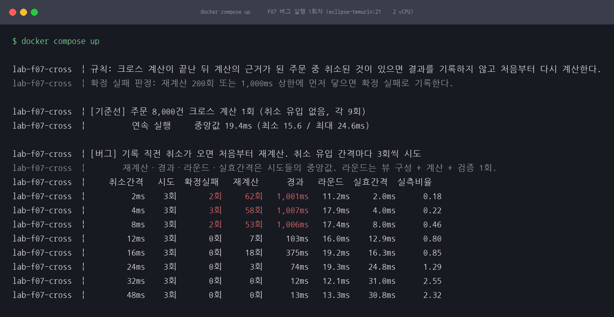
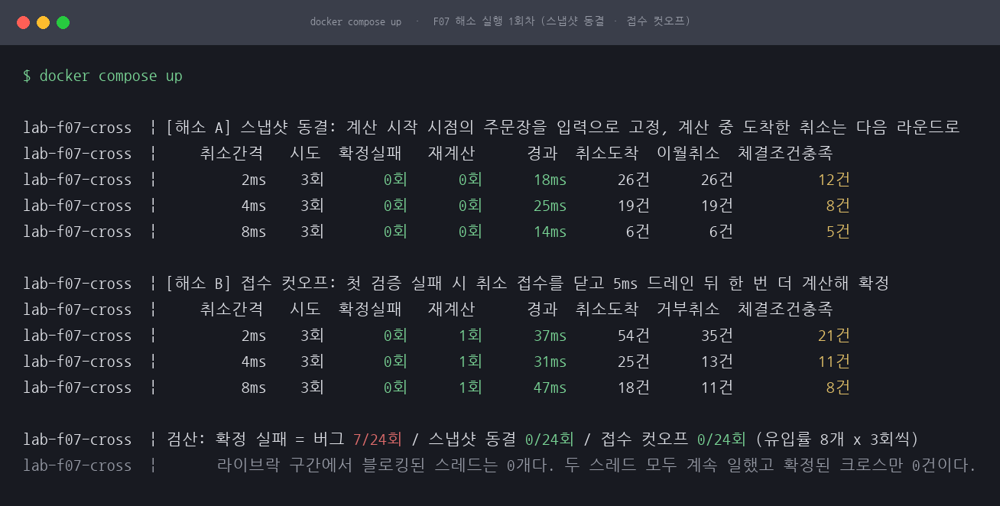
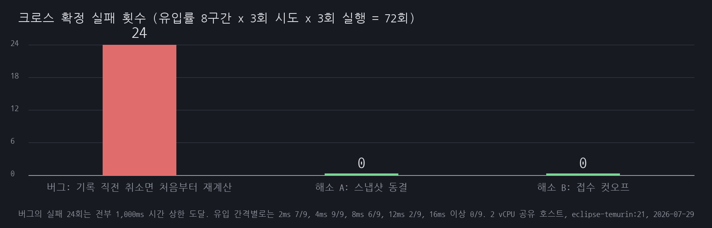

# F07 IPO 크로스가 확정되지 않는다, 데드락도 라이브락도 아닌 재계산 기아

> 디렉토리 이름과 그림 파일 이름에는 `livelock`이 남아 있습니다. 링크를 깨지 않으려고 둔 것이고, 그 낱말은 이 세션의 결론이 아닙니다. 이유는 아래 1절과 6절에 적었습니다.

## 1. 유명한 이유

미국 증권거래위원회(SEC)는 2013년 5월 29일 나스닥에 대한 행정 명령서에서 2012년 5월 18일 페이스북 상장일의 IPO 크로스 장애를 정리했습니다. 원문에 따르면 나스닥은 오전 11시 5분 10초에 IPO 크로스를 실행하려 했습니다. 매칭엔진은 크로스 가격과 수량 계산이 끝난 뒤, 그 계산의 근거가 된 주문 중에 계산이 도는 동안 **취소된** 것이 없는지 확인하는 검증을 했습니다. 검증이 실패하면 결과를 기록하지 않고 처음부터 다시 계산했고, 다시 계산하는 동안 또 취소가 들어와 검증이 또 실패했습니다. SEC는 이 상태를 루프라고 적었습니다. 나스닥이 보조 매칭엔진으로 전환하고 검증을 설정하는 코드를 들어낸 뒤 크로스가 테이프에 찍힌 시각은 11시 30분 9초입니다. SEC는 나스닥에 1,000만 달러의 민사 제재금을 부과했습니다.

명령서 문단 17에 숫자가 하나 있습니다. 그날 가격과 수량 계산에 검증까지 더해 20밀리초가 걸렸고, 이것이 평소 IPO 크로스의 1~2밀리초보다 훨씬 길었다는 것입니다. 원문은 "The time that had elapsed during the price/volume calculation and validation check was 20 milliseconds, which is significantly longer than usual for an IPO cross, which usually takes 1 to 2 milliseconds"라고 적습니다. 20밀리초로 늘어난 창이 루프의 조건이었습니다.

건수는 층위를 나눠 읽어야 합니다. 문단 27에 따르면 크로스에 포함되지 못한 38,000건이 넘는 주문은 오전 11시 11분부터 11시 30분 9초 사이에 들어온 것입니다. 크로스 계산이 11시 11분까지 받은 주문과 취소를 근거로 돌았기 때문에, 그 뒤 19분치가 통째로 빠졌습니다. 그중 약 8,000건은 11시 30분 연속매매가 개시될 때 시장으로 들어갔고, 남은 3만여 건이 나스닥이 말하는 stuck 주문입니다. 38,000과 30,000은 같은 수를 두 번 센 것이 아니라 층위가 다릅니다.

근거 등급은 E1·축소입니다. 사건 서술의 출처는 1차 문서라 E1이지만 재현은 축소판이라 그렇게 표기합니다. 출처는 [SEC, Securities Exchange Act Release No. 69655 (2013-05-29), Admin. Proc. File No. 3-15339, *In the Matter of The NASDAQ Stock Market, LLC*](https://www.sec.gov/litigation/admin/2013/34-69655.pdf)와 [Nasdaq Equity Trader Alert #2012-20](https://www.nasdaqtrader.com/TraderNews.aspx?id=ETA2012-20)이고, 이 세션의 사실 관계는 이 두 문서에서만 가져왔습니다. 자주 "주문 정정 때문"이라고 옮겨지는데 원문은 일관되게 취소(cancellation)입니다. "38,000건 이상"도 미체결이 아니라 크로스 미포함입니다.

이 세션은 나스닥의 매칭엔진을 재현하지 않습니다. 사건 자체는 그대로 재현할 수 없어, 그 시스템이 지키려 했던 규칙 하나만 떼어내 축소 재현했습니다. "결과를 기록하기 직전에 계산의 근거가 바뀌었으면 처음부터 다시 계산한다"는 규칙입니다. 규칙 자체는 옳게 들립니다. 이미 취소된 주문으로 계산한 크로스를 그대로 확정하는 것보다는 다시 계산하는 편이 안전하니까요. 문제는 그 규칙에 끝이 없다는 데 있습니다.

이건 데드락이 아닙니다. 잠금을 서로 기다리는 스레드가 하나도 없고, 모두가 쉬지 않고 일하는데 전진하는 것이 없습니다.

처음에는 이것을 라이브락이라고 불렀습니다. 그 이름은 물립니다. 라이브락은 스레드들이 서로의 상태 변화에 반응하면서 함께 헛도는 상태인데, 이 재현에는 그 되먹임 고리가 없습니다. 취소 유입 스레드는 [app/Cross.java](app/Cross.java)의 `feed()`에서 `next += intervalNanos`로 다음 발사 시각을 절대 시간으로 밀어 놓고 그때까지 자는 고정 타이머입니다. 계산 스레드가 재계산을 몇 번을 돌든 취소가 오는 속도는 달라지지 않습니다. 한쪽이 다른 쪽에 반응하지 않으니 라이브락의 정의에 맞지 않습니다.

정확한 이름은 기아(starvation)이거나 수렴하지 않는 재시도 루프입니다. 계산 스레드에 필요한 자원은 "취소가 한 건도 오지 않는 라운드 하나"인데, 유입이 그 자원을 계속 가져가 버려서 못 얻습니다. 그래도 겉으로 드러나는 증상은 라이브락과 같습니다. 데드락은 스레드 덤프에서 BLOCKED로 보이고 JVM의 교착 탐지에도 걸리지만, 이쪽은 CPU가 바쁘고 계산 스레드가 RUNNABLE이라 "잘 돌고 있는 시스템"처럼 보입니다. 이름을 무엇으로 부르든 그 관측 불가능성이 이 세션의 핵심입니다.

## 2. 재현

먼저 못 한 것을 적습니다. 실제 나스닥 엔진의 크로스 규칙, 호가 배분, 이중화 전환 절차는 재현하지 않았습니다. 사건의 수치(11시 5분 10초, 38,000건 등)를 재현한 것도 아닙니다. 아래 수치는 전부 이 저장소의 축소 구현을 이 호스트에서 직접 돌려 얻은 것입니다.

크로스 계산기 하나와 취소 유입기 하나를 만들었습니다. 오더북은 고정 시드로 만든 매수 4,000건과 매도 4,000건이고 호가는 400틱(10,000원에서 10,399원), 수량은 1에서 100 사이입니다. 크로스 계산은 틱마다 매수 수요와 매도 공급을 누적해 체결 가능 수량이 가장 큰 가격을 고릅니다. 계산 스레드는 다음 루프를 돕니다.

```java
while (true) {
    int n = buildView(book, view);                 // 살아 있는 주문만 담는다
    CrossResult r = computeCross(view, n);         // 크로스 가격과 수량 계산
    if (anyCancelled(view, n)) { recalcs++; continue; }  // 기록 직전 검증 실패 -> 처음부터
    committed = r;                                 // 결과 기록
    break;
}
```

실제 코드에는 저 `continue` 뒤에 상한 검사가 한 줄 더 있습니다. 위 조각은 규칙만 보이려고 그 줄을 뺐고, 전체는 [app/Cross.java](app/Cross.java)에 있습니다.

취소 유입 스레드는 정해진 간격으로 살아 있는 주문 하나를 골라 취소합니다. 스레드는 이 둘뿐입니다. 호스트가 2 vCPU라 그 이상 쓰지 않았습니다. 무한루프로 프로세스가 죽지 않도록 재계산 200회 또는 1,000ms 상한을 두고, 상한에 닿으면 **확정 실패**로 기록합니다.

이 문서에서 말하는 "확정 실패"의 뜻을 여기서 못박아 둡니다. 영원히 확정되지 않는다는 뜻이 아니라 `compose.yml`이 준 `-DcapMs=1000`에 걸렸다는 뜻입니다. 같은 파일의 `-DmaxRecalc=200`은 세 회차를 통틀어 한 번도 걸리지 않았습니다. 상한을 10초나 60초로 늘렸을 때 결국 확정되는지, 아니면 그때도 못 하는지는 재지 않았습니다. 그러니 아래 24회는 "1초 안에 확정하지 못한 횟수"로 읽어야 정확합니다.

환경은 Docker 위 eclipse-temurin:21-jdk-alpine(JDK 21)이고 `docker compose up` 한 번에 기준선, 버그, 해소 A, 해소 B가 순서대로 실행됩니다. 자원 한도는 걸지 않았습니다. `compose.yml`에 `cpus`도 `mem_limit`도 없고 `-Xmx`도 주지 않아, 컨테이너는 호스트의 2 vCPU와 메모리를 그대로 보고 힙 상한은 JVM 기본값을 따릅니다. 그래서 "2 vCPU"는 컨테이너에 할당한 몫이 아니라 호스트 사양이며, 같은 호스트의 다른 작업과 코어를 나눠 썼습니다. 유입 간격 8개 구간을 각각 3회씩 시도하고, 그 전체를 3회 실행했습니다. 유입률 하나당 9회입니다.

측정 조건을 먼저 밝힙니다. 다른 작업이 같이 도는 2 vCPU 공유 호스트라, 취소 유입이 전혀 없을 때의 크로스 계산 1회가 회차별로 19.4ms, 9.4ms, 9.9ms(연속 실행 9회 중앙값)로 벌어졌습니다. 그래서 유입 간격을 절대 시간으로만 읽으면 안 되고, 그 시도에서 실제로 잰 라운드 1회 시간과 함께 봐야 합니다. 표의 실측비율이 그 값입니다(취소 실효 도착 간격 ÷ 라운드 1회 중앙값).

오해할 만한 우연을 하나 끊어 둡니다. 이 세션의 라운드 1회(R)는 8~22ms 범위에서 움직이고, SEC 명령서가 적은 그날의 계산 20밀리초와 자릿수가 같습니다. 이것은 우연입니다. 원문의 20밀리초를 목표로 잡고 맞춘 것이 아니고, 나스닥의 평소 값인 1~2밀리초를 재현한 것도 아닙니다. 이쪽 R은 주문 8,000건에 400틱을 전부 훑는 이중 루프가 2 vCPU 공유 호스트에서 얼마나 걸리는지의 값일 뿐입니다.

1회차 실행의 버그 구간 출력 전체입니다.

```
    취소간격   시도  확정실패   재계산      경과   라운드  실효간격  실측비율
         2ms    3회       2회     62회   1,001ms   11.2ms     2.0ms      0.18
         4ms    3회       3회     58회   1,007ms   17.9ms     4.0ms      0.22
         8ms    3회       2회     53회   1,006ms   17.4ms     8.0ms      0.46
        12ms    3회       0회      7회     103ms   16.0ms    12.9ms      0.80
        16ms    3회       0회     18회     375ms   19.2ms    16.3ms      0.85
        24ms    3회       0회      3회      74ms   19.3ms    24.8ms      1.29
        32ms    3회       0회      0회      12ms   12.1ms    31.0ms      2.55
        48ms    3회       0회      0회      13ms   13.3ms    30.8ms      2.32
```



*그림 1. 버그 실행 화면입니다. 취소 간격 8ms 이하 세 구간은 3회 시도 중 2회에서 3회가 1,000ms 상한에 걸려 크로스를 확정하지 못했습니다. 12ms 이상은 이 회차에서 3회 다 확정했고, 32ms와 48ms는 재계산 0회로 12~13ms 만에 끝났습니다.*

3회 실행을 합치면 1초 안에 확정하지 못한 시도가 72회 중 24회입니다. 유입 간격별로는 2ms 7/9, 4ms 9/9, 8ms 6/9, 12ms 2/9이고 16ms 이상은 0/9입니다. 실패한 24회는 전부 1,000ms 시간 상한에 걸린 것이고 재계산 200회 상한에 걸린 시도는 한 번도 없었습니다. 그동안 돈 재계산은 2ms 구간에서 회차별 중앙값 62회, 112회, 84회, 4ms 구간에서 58회, 92회, 100회였습니다. 백 번 가까이 같은 계산을 다시 하고도 그 1초 동안에는 크로스가 하나도 확정되지 않았다는 뜻입니다. 명령과 출력 원문은 [reproduce.md](reproduce.md)에 그대로 남겼습니다.

## 3. 내부 원리

라운드 하나는 뷰 구성, 크로스 계산, 기록 직전 검증으로 이루어집니다. 이 라운드가 도는 동안 취소가 한 건이라도 도착하면 검증이 실패하고 라운드는 통째로 버려집니다. 그러니 크로스가 확정되려면 **취소가 한 건도 오지 않는 라운드 하나**가 필요합니다. 취소가 평균 I 간격으로 오고 라운드가 R 걸린다면, R이 I보다 길 때는 그런 라운드가 만들어질 수 없습니다. 그게 임계 조건입니다.

실측이 그대로 보여 줍니다. 3회 실행의 유입률 구간 24개를 실측비율(I ÷ R)로 줄 세우면 이렇게 나뉩니다.

| 실측비율 구간 | 구간 수 | 확정 실패 |
|---|---|---|
| 0.64 이하 | 8개 | 20회 (모든 구간이 3회 중 2~3회 실패) |
| 0.74 ~ 0.95 | 6개 | 4회 (구간별 0 / 1 / 0 / 3 / 0 / 0회로 갈림) |
| 1.22 ~ 1.96 (16ms·24ms 구간) | 4개 | 0회 |
| 2.03 이상 또는 취소 미도착 (32ms·48ms 구간) | 6개 | 0회 |

마지막 줄은 근거로 세우면 안 되는 칸이라 따로 뺐습니다. 32ms와 48ms 구간의 시도는 첫 라운드에서 바로 확정돼 9~13ms 만에 끝납니다. 그러면 측정 구간이 유입 간격보다 짧으니 취소가 거의 도착하지 않습니다. 같은 유입 간격의 해소 A 실행에서 3회 시도 합계 취소 도착이 32ms에서 2건, 48ms에서 0~1건이었고, 버그 3회차 32ms는 아예 한 건도 도착하지 않아 실측비율 칸이 `-`로 찍혔습니다. 표본 0~1건으로 나눈 값이라, 이 칸의 비율은 유입률의 측정치가 아니라 "라운드 하나가 끝날 때까지 취소가 오지 않았다"를 다르게 적은 것에 가깝습니다. 이 여섯 칸을 "비율이 높아서 안전했다"는 칸과 한데 묶으면 순환논증이 됩니다.

문턱은 대략 1입니다. 다만 칼로 자른 선이 아니라 0.7 언저리부터 1 근처까지가 회색 지대입니다. 주기적으로 오는 취소도 스케줄러에 밀려 한 번씩 늦게 도착하고, 그 틈으로 라운드 하나가 통과하면 크로스가 확정되기 때문입니다. 문턱을 실제로 지지하는 근거는 취소가 충분히 도착한 앞의 두 줄과, 3회차 16ms에 세 회차의 24ms를 더한 네 구간까지입니다.

여기서 중요한 것은 문턱이 밀리초 단위 상수가 아니라는 점입니다. R은 주문장 규모와 호스트 부하로 정해집니다. 측정이 가장 깨끗했던 2회차의 주문장 규모별 계산 1회 중앙값은 1,000건 1.0ms, 2,000건 1.8ms, 4,000건 4.5ms, 8,000건 12.1ms, 16,000건 26.3ms였습니다. 이 회차만 보면 규모가 두 배일 때 계산도 대략 두 배가 됩니다.

다만 여기서 "주문장이 두 배면 문턱도 두 배로 낮아진다"까지 나가는 것은 측정이 아니라 추론입니다. 두 가지를 밝혀 둡니다. 첫째, 이 규모 민감도 표는 취소 유입을 아예 끄고 계산 시간만 잰 것입니다. 규모를 키운 상태에서 취소를 흘려 넣어 문턱이 실제로 어디로 옮겨 가는지는 재지 않았습니다. 문턱이 R에 반비례한다는 것은 앞 문단의 임계 조건에서 따라 나오는 결론이지 이 실험이 관측한 값이 아닙니다. 둘째, 선형성 자체가 세 회차 중 2회차에서만 깨끗합니다. 1회차는 16,000건이 20.6ms로 8,000건의 21.1ms보다 오히려 짧게 찍혔습니다. 규모마다 다시 워밍업하느라 JIT 프로파일이 섞이고 호스트 부하를 크게 타는 측정이라, 이 표는 경향까지만 읽어야 합니다.

그래도 방향은 같습니다. 평소에는 취소가 몰려도 멀쩡하던 시스템이 주문이 가장 많이 몰린 날에만 루프에 빠질 수 있다는 뜻이고, 그렇다면 방아쇠는 코드 변경이 아니라 물량입니다. 이것을 수치로 확인하려면 규모별로 유입률을 다시 훑는 실험이 따로 필요합니다.

호스트 부하도 같은 방향으로 밉니다. 취소 유입이 전혀 없는 같은 계산의 중앙값이 측정 시점에 따라 9.4ms에서 22.8ms까지 벌어졌습니다. 1회차에서는 연속 실행(19.4ms)이 40ms씩 쉬었다 도는 단발 실행(12.8ms)보다 1.5배 느렸는데, 2회차는 둘 다 9.4ms였고 3회차는 9.9ms와 10.5ms로 차이가 없었습니다. 그러니 연속 실행이 본질적으로 느린 것이 아니라 그때 호스트에 다른 부하가 있었던 것입니다. 어느 쪽이든 결론은 같습니다. R을 키우는 것은 무엇이든 문턱을 내리고, 재계산 루프가 돌기 시작하면 그 자체가 CPU를 계속 쓰므로 R을 키우는 요인이 하나 더 늘어납니다.

SEC 원문은 시스템이 취소 건마다 별도의 재계산을 수행하도록 설계돼 있었다고 적습니다. 이 재현은 그보다 약하게, 검증 실패 1회에 재계산 1회만 돌립니다. 실제 설계는 밀린 취소만큼 재계산이 쌓이므로 회복이 더 어렵습니다. 문턱 자체는 두 모델이 같지만, 이 재현이 원문보다 관대한 쪽이라는 점은 밝혀 둡니다.

## 4. 해소

두 가지를 구현해 같은 유입률에서 다시 쟀습니다. 먼저 출처를 밝혀 둡니다. 두 방식 다 이 세션이 고안한 것이 아닙니다. **둘 다 나스닥이 실제로 한 조치이고**, 여기서 한 것은 축소 구현과 측정입니다.

해소 A에 해당하는 조치는 그날 현장에서 나왔습니다. 나스닥 엔지니어들은 보조 매칭엔진으로 전환하면서 검증을 설정하는 코드 줄을 들어냈고, 그러자 크로스가 11시 11분 시점의 주문과 취소를 근거로 확정됐습니다. 해소 B에 해당하는 조치는 사후 공지에 남아 있습니다. [Nasdaq Equity Trader Alert #2012-20](https://www.nasdaqtrader.com/TraderNews.aspx?id=ETA2012-20)은 "NASDAQ has modified its IPO and Halt Cross application to no longer accept cross-eligible order modifications after the auction's final calculation has begun and before the trade is printed to the tape"라고 적습니다. 눈여겨볼 것은 뒷부분입니다. 차단이 시작되는 시점만 정한 것이 아니라 "테이프에 찍히기 전까지"라는 끝점까지 한 문장 안에 들어 있습니다. 차단 구간이 무한정 열려 있는 것이 아니라 최종 계산 개시부터 체결 공표까지의 창으로 닫혀 있다는 뜻입니다. 이 세션의 컷오프가 드레인 5ms와 다음 라운드까지만 닫고 확정 즉시 여는 것도 같은 모양입니다.

**해소 A. 스냅샷 동결.** 계산 시작 시점의 주문장을 입력으로 고정합니다. 계산이 도는 동안 도착한 취소는 접수는 받되 이번 크로스에는 반영하지 않고 다음 라운드로 넘깁니다. 검증을 없앤 것이 아니라 검증할 대상이 없게 만든 것입니다. 입력이 고정돼 있으니 계산 결과는 반드시 그 입력에 대해 정확하고, 재계산은 원리적으로 0회입니다.

```java
e.frozen = true;                   // 이 시점의 주문장을 입력으로 고정
int n = buildView(book, view);     // 이후 도착한 취소는 deferred로 쌓인다
CrossResult r = computeCross(view, n);
// 검증하지 않는다. 입력이 고정돼 있어 검증할 대상이 없다
e.frozen = false;                  // 이월된 취소는 다음 라운드에 반영
committed = r;                     // 기록. 다시 돌 이유가 없다
```

**해소 B. 접수 컷오프.** 첫 검증 실패를 신호로 보고 취소 접수를 닫습니다. 인플라이트가 도착할 시간을 5ms 준 뒤 한 번 더 계산하면, 그 라운드에는 취소가 반영될 수 없으므로 검증이 반드시 통과합니다. 컷오프 창에 도착한 취소는 거부됩니다.

```java
if (invalidated) {
    recalcs++;
    if (!e.cutoff) {                       // 확정 직전 구간으로 보고 접수를 닫는다
        e.cutoff = true;
        LockSupport.parkNanos(DRAIN_MS * 1_000_000L);   // 인플라이트 드레인
        continue;                          // 이 라운드는 반드시 통과한다
    }
}
```

두 방식의 대가는 다릅니다. 정직하게 적으면 이렇습니다.

| | 스냅샷 동결 | 접수 컷오프 |
|---|---|---|
| 취소 접수 | 받는다 | 창이 열린 동안 거부한다 |
| 참가자가 받는 응답 | 접수 완료 | 접수 거부 |
| 참가자가 겪는 일 | 취소가 접수됐는데 그 주문이 크로스에서 체결될 수 있다 | 취소가 거부됐고 그 주문이 크로스에서 체결된다 |
| 재계산 | 0회 | 0~1회(중앙값) |
| 창의 길이 | 라운드 1회(이 호스트에서 10~20ms) | 라운드 1회 + 드레인 5ms + 라운드 1회 |
| 창에 걸린 취소(24회 시도 합계) | 71 / 41 / 43건 | 76 / 55 / 57건 |

이 표의 마지막 줄을 사건의 규모로 옮겨 읽으면 안 됩니다. 여기서 스냅샷 동결이 얼려 두는 창은 라운드 하나, 이 호스트에서 10~20ms입니다. 그 창에 걸린 취소가 24회 시도를 합쳐 71건, 41건, 43건입니다. 같은 선택을 실제 나스닥이 했을 때 창은 라운드 하나가 아니라 오전 11시 11분부터 11시 30분 9초까지 19분이었고, 그 창에 걸린 것이 1절에서 버그의 피해로 적은 바로 그 38,000건입니다. 두 수치는 다른 사건의 수치가 아니라 같은 지표를 다른 창 길이로 잰 값입니다. 검증을 들어내 크로스를 확정시킨 순간부터 38,000건은 버그의 피해가 아니라 해소 A의 청구서입니다.

그래서 이 세션이 잰 71건을 "스냅샷 동결의 대가는 수십 건"으로 기억하면 자릿수를 세 개 잘못 짚습니다. 대가의 크기를 정하는 것은 방식이 아니라 입력을 얼마나 오래 얼려 두느냐입니다. 이 재현이 71건에서 끝난 이유는 설계가 안전해서가 아니라 라운드가 20ms 안에 끝났기 때문입니다. 이 세션은 스냅샷 동결을 처음부터 설계로 넣어서 얼리는 시점과 확정하는 시점 사이가 라운드 하나인데, 나스닥은 루프가 이미 19분을 돈 뒤에 응급 조치로 같은 선택을 했습니다. 같은 방식이라도 언제 켜느냐에 따라 청구서가 10ms치가 되기도 하고 19분치가 되기도 합니다.

컷오프 쪽이 참가자에게 불리해 보이지만, 적어도 참가자는 자기 취소가 안 먹혔다는 사실을 압니다. 스냅샷 동결은 취소를 접수했다고 응답해 놓고 그 주문을 체결시킬 수 있습니다. 놀란 쪽은 후자입니다.

버리기 전에 따져 본 대안이 둘 있습니다. 재계산 횟수에 상한만 걸고 상한에 닿으면 마지막 계산을 그냥 기록하는 방법은, 확정은 되지만 취소된 주문이 반영되지 않은 결과를 기록한다는 점에서 스냅샷 동결과 결과가 같으면서 언제 그렇게 되는지가 부하에 따라 달라집니다. 같은 위험을 예측 불가능하게 만드는 셈이라 택하지 않았습니다. 취소를 큐에 모아 두고 라운드 사이에만 반영하는 방법은 스냅샷 동결과 사실상 같은 설계인데, 큐가 비는 순간을 기다린다면 다시 같은 재계산 루프로 돌아갑니다.

## 5. 재계측

버그와 **같은 유입 간격 8개 구간을 같은 3회씩**, 같은 호스트에서 다시 쟀습니다. 3회 실행을 합쳐 각 방식당 72회 시도입니다.

| 방식 | 1,000ms 안에 확정 실패 | 재계산 중앙값 | 경과 중앙값 |
|---|---|---|---|
| 버그 | **24/72회** | 2ms 구간에서 62~112회 | 실패 시 1,002~1,007ms(상한) |
| 해소 A 스냅샷 동결 | **0/72회** | 0회 | 9~25ms |
| 해소 B 접수 컷오프 | **0/72회** | 0~1회 | 11~77ms |



*그림 2. 해소 실행 화면입니다. 버그가 상한에 걸리던 2ms, 4ms, 8ms 구간에서 두 방식 모두 확정 실패 0회입니다. 노란 숫자가 대가입니다.*



*그림 3. 1,000ms 상한 안에 크로스를 확정하지 못한 횟수입니다. 72회 시도 중 버그 24회, 두 해소 모두 0회입니다.*

대가도 같은 조건에서 쟀습니다. 이번 크로스에 반영되지 못한 취소는 24회 시도 합계로 스냅샷 동결이 회차별 71건, 41건, 43건(이월), 접수 컷오프가 76건, 55건, 57건(거부)입니다. 컷오프가 세 회차 모두 많은 이유는 창의 길이입니다. 스냅샷 동결의 창은 라운드 하나인데 컷오프의 창은 첫 라운드가 끝난 뒤부터 드레인 5ms와 두 번째 라운드까지 이어집니다. 그중 확정된 크로스 가격에서 체결 조건을 만족한 주문은 스냅샷 동결이 38건, 21건, 20건이고 접수 컷오프가 47건, 36건, 38건입니다. 크로스가 확정되게 만드는 값은 공짜가 아니라 "취소했는데 체결되는 주문"으로 지불됩니다.

이 건수는 창이 10~20ms일 때의 값입니다. 4절에서 적은 대로 창이 19분이면 같은 항목의 청구서가 38,000건이 됩니다. 여기 실린 수십 건은 이 방식의 대가가 작다는 증거가 아니라, 이 호스트에서 라운드 하나가 그만큼 짧았다는 증거입니다.

비율까지는 설명하지 못했습니다. 반영되지 못한 취소 중 체결 조건을 만족한 비율이 스냅샷 동결에서 47~54%, 접수 컷오프에서 62~67%로 갈렸습니다. 취소 대상은 무작위로 고르고 확정된 크로스 가격은 세 회차 모두 10,201원 근처였으니 절반쯤이 나와야 정상이고, 스냅샷 동결 쪽은 그 값에 맞습니다. 컷오프 쪽이 왜 높은지는 이 실험으로 밝히지 못했습니다. 표본이 회차당 41~76건이라 더 파려면 시도 수를 늘려야 합니다.

## 6. 예상과 달랐던 점

임계점이 상수일 줄 알았는데 아니었습니다. 취소 간격 12ms 구간은 1회차와 3회차에서 3번 다 확정에 성공했고 2회차에서만 3번 중 2번 실패했습니다. 코드도 설정도 같은데 결과가 뒤집힌 이유는 그때 라운드 1회가 회차 순서로 16.0ms, 18.9ms, 13.0ms였다는 것뿐입니다. 절대 시간으로 안전 구간을 정해 놓으면 그 구간은 호스트가 바쁜 날 사라집니다. 안전한 것은 유입 간격이 아니라 유입 간격 대 계산 시간의 비율이고, 그 비율의 분모는 우리가 통제하기 어려운 값입니다.

문턱이 칼로 자른 선일 것이라는 예상도 빗나갔습니다. 실측비율 0.64 이하는 8개 구간이 모두 실패를 냈고 1.22부터 1.96까지의 4개 구간은 모두 무사했는데, 그 사이 0.74에서 0.95까지의 6개 구간은 실패 횟수가 0, 1, 0, 3, 0, 0회로 갈렸습니다. 비율이 더 높은 구간이 더 많이 실패한 경우도 있습니다(3회차 8ms는 0.82인데 3회 전부 실패, 2회차 8ms는 0.76인데 3회 중 1회만 실패). 주기적으로 보내는 취소도 2 vCPU에서는 스케줄러에 밀려 한 번씩 늦게 도착하고, 그 틈이 라운드보다 크면 크로스가 빠져나갑니다. 1회차 16ms 구간은 재계산 18회를 돌고 375ms 만에 겨우 확정됐습니다. 기아 구간과 정상 동작 사이에는 "운이 좋으면 나가고 아니면 못 나가는" 구간이 있습니다.

두 해소가 결국 같은 종류의 피해를 만든다는 점도 예상 밖이었습니다. 이 루프를 끊으려면 어느 시점에는 "이 취소는 이번 크로스에 못 넣는다"고 선을 그어야 하고, 그러면 취소를 낸 주문이 체결됩니다. 스냅샷 동결이 컷오프보다 참가자에게 친절할 줄 알았는데, 실측에서는 두 방식 모두 취소가 체결 조건을 만족하는 사례를 만들었고 오히려 컷오프 쪽이 많았습니다(24회 시도 합계로 47건 대 38건, 36건 대 21건, 38건 대 20건). 차이는 건수가 아니라 참가자가 받는 응답입니다. 컷오프는 거부라고 답하고, 스냅샷 동결은 접수했다고 답한 뒤 체결시킵니다. 조용한 쪽이 더 무섭다는 결론은 세션을 돌리기 전에는 반대로 예상했던 부분입니다.

한 번의 통과가 증거가 되지 못한다는 것도 다시 확인했습니다. 8ms 구간은 9회 중 6회만 실패했습니다. 나머지 3회는 취소가 라운드보다 촘촘히 들어오는데도 크로스가 확정됐습니다. 이 코드를 CI에서 8ms로 한 번 돌려 통과했다면 버그가 없다고 결론 내렸을 겁니다. F13에서 같은 버그 코드가 3회차에만 위반 0건을 냈던 것과 같은 종류의 함정이고, 그래서 이 세션도 유입률마다 3회씩, 전체를 3회 돌려 횟수로 적었습니다.

측정 자체에서도 한 번 발을 헛디뎠습니다. 처음에는 취소가 겨냥할 주문을 모드별 고정 시드로 뽑았는데, 그러면 스냅샷 동결과 접수 컷오프가 매 시도 똑같은 주문들을 취소하게 됩니다. 그 주문들이 크로스 가격에서 체결 조건을 만족하는지가 시드로 굳어 버려, 그 비율이 스냅샷 쪽 21~43%와 컷오프 쪽 64~86%로 갈렸습니다. 무작위로 고른 주문이라면 절반쯤 나와야 하는 값인데 양쪽 다 벗어난 겁니다. 시드를 시도마다 바꾸자 스냅샷 쪽이 47~54%로 이론값에 붙었습니다. 두 해소를 비교하는 지표가 난수 시드에 물려 있었던 셈이고, 이걸 못 봤으면 없는 트레이드오프를 설명하는 문단을 썼을 겁니다. 위 21~86%는 시드를 고치기 전 실행의 값이라 [reproduce.md](reproduce.md)에는 없습니다. 남긴 기록은 시드를 고친 뒤 3회 실행입니다.

가장 크게 틀린 예상은 이름 쪽이었습니다. 처음에는 이것을 라이브락이라고 불렀는데, 스레드 상태를 적어 놓고 보니 이 문서의 문장이 이 문서의 이름표를 반박하고 있었습니다. 24회의 확정 실패 동안 블로킹된 스레드는 0개입니다. 이 코드에는 `synchronized`도 `Lock`도 없어서 스레드 상태가 BLOCKED가 되는 지점 자체가 없습니다. 계산 스레드는 RUNNABLE로 CPU를 계속 쓰고, 유입 스레드는 다음 취소 시각까지 TIMED_WAITING입니다. 한쪽이 자고 있는데 서로 반응하며 헛돈다고 쓸 수는 없습니다. 유입 스레드는 상대가 무엇을 하든 `next += intervalNanos`로 자기 시계만 보고 깨어납니다. 되먹임이 없으니 라이브락이 아니라 기아이고, 확정 조건을 못 얻는 재시도 루프입니다.

이름을 고쳐도 관측 문제는 그대로 남습니다. 오히려 더 나쁩니다. 데드락 탐지에 걸릴 것도 없고 예외도 타임아웃 로그도 나지 않습니다. 밖에서 보이는 신호는 "CPU를 잘 쓰는데 결과가 안 나온다" 하나뿐입니다. 그래서 이런 루프에는 진행 지표가 필요합니다. 재계산 횟수와 마지막 확정 이후 경과 시간을 세어 상한을 걸어 두지 않으면, 시스템은 아무 문제 없다는 얼굴로 25분을 보낼 수 있습니다.

## 한계

실제 나스닥 매칭엔진이 아니라 SEC 문서가 서술한 규칙 하나를 축소 구현한 것입니다. 사건의 시각과 건수를 재현하지 않았고, 재현할 수 있다고 주장하지도 않습니다. 이 세션의 이름표도 한 번 물렸습니다. 처음 제목과 본문은 이 현상을 라이브락이라고 불렀는데 재현 코드에 되먹임 고리가 없어 그 규정을 내렸습니다. 디렉토리 이름과 그림 파일 이름에는 `livelock`이 그대로 남아 있습니다. 링크를 깨지 않으려고 두었을 뿐이고, 그 낱말이 이 세션의 결론은 아닙니다. 크로스 가격 결정은 체결 가능 수량 최대화와 동가 시 저가 선택까지만 구현했고, 실제 단일가 규칙의 불균형 최소화나 기준가 근접 규칙은 넣지 않았습니다. 한계 가격의 부분 체결 배분도 다루지 않아, 취소가 반영되지 않은 주문은 "체결됐다"가 아니라 "확정된 크로스 가격에서 체결 조건을 만족한다"까지만 셌습니다.

취소 유입은 일정 간격의 주기적 도착으로 만들었습니다. 실제 주문 흐름은 버스티하고, 그러면 임계점 부근의 회색 지대가 이 재현보다 더 넓어질 것입니다. 그리고 이 고정 타이머 설계가 곧 이 재현이 라이브락이 될 수 없는 이유입니다. 참가자가 확정이 늦어지는 것을 보고 취소를 더 많이 내거나 덜 내는 되먹임까지 넣으면 그때는 정말 두 쪽이 서로에게 반응하는 상태가 됩니다. 그 모형은 만들지 않았습니다. 주문장은 8,000건 고정이고 루프가 도는 동안 신규 주문이 들어오는 흐름도 재현하지 않았습니다. 사건에서 문제가 됐던 "지연되는 동안 들어온 주문이 크로스에 포함되지 못한다"는 측면은 이 세션에서 다루지 않은 부분입니다.

"확정 실패"는 1,000ms 상한 안에 확정하지 못했다는 뜻까지만 증명합니다. 상한을 늘렸을 때 언젠가 확정되는지, 아니면 유입이 계속되는 한 영영 확정되지 않는지는 재지 않았습니다. 기아라는 규정은 되먹임의 부재라는 구조에서 나온 것이지 무한 비확정을 관측해서 나온 것이 아닙니다.

주문장 규모와 문턱의 관계도 재지 않았습니다. 규모 민감도 표는 취소 유입을 끄고 계산 시간만 잰 것이고, 규모를 키운 상태에서 유입률을 훑어 문턱이 실제로 어디로 옮겨 가는지는 확인하지 못했습니다. 그 표의 선형성도 3회 중 1회차에서는 깨졌습니다.

반영되지 못한 취소 중 체결 조건을 만족한 비율이 두 해소 방식에서 47~54%와 62~67%로 갈린 이유는 밝히지 못했습니다. 회차당 41~76건이라는 표본으로는 원인을 가릴 수 없어 관측만 남깁니다.

수치는 2 vCPU 공유 호스트에서 유입률 8개 구간을 3회씩, 전체를 3회 실행해 얻은 범위입니다. 컨테이너에 CPU와 메모리 한도를 걸지 않았고 힙 상한도 지정하지 않아, 호스트의 다른 작업이 그대로 결과에 섞입니다. 같은 계산의 1회 소요시간 중앙값이 9.4ms에서 22.8ms까지 흔들리는 환경이라 절대 시간은 참고용이고, 같은 실행 안의 비교와 실측비율이 의미 있는 값입니다. 전용 장비에서는 문턱에 해당하는 유입 간격이 달라집니다.
