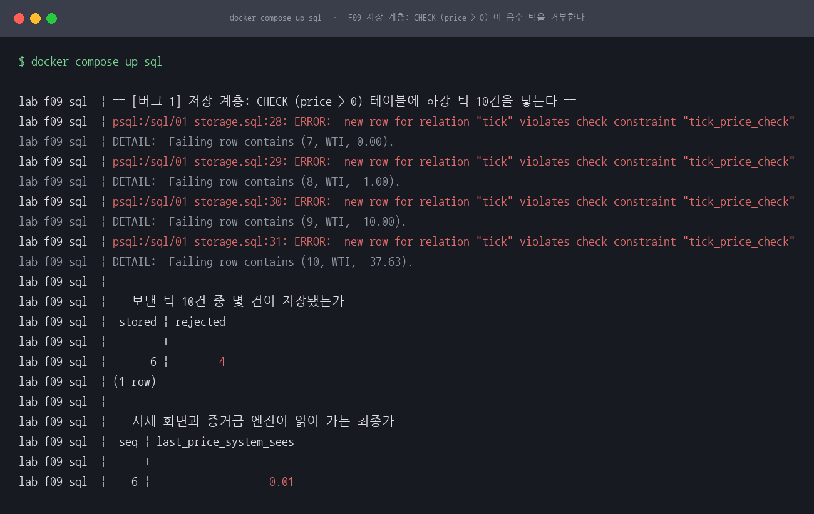
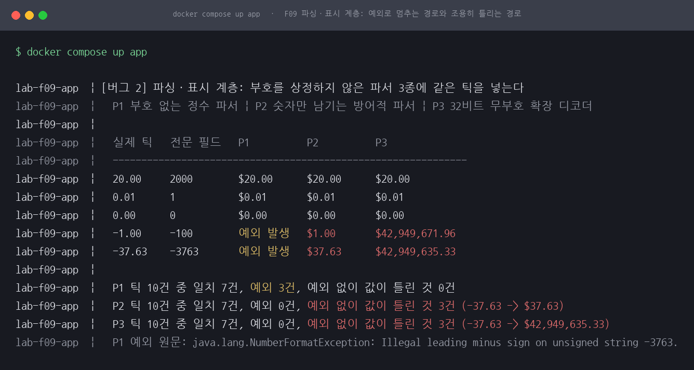
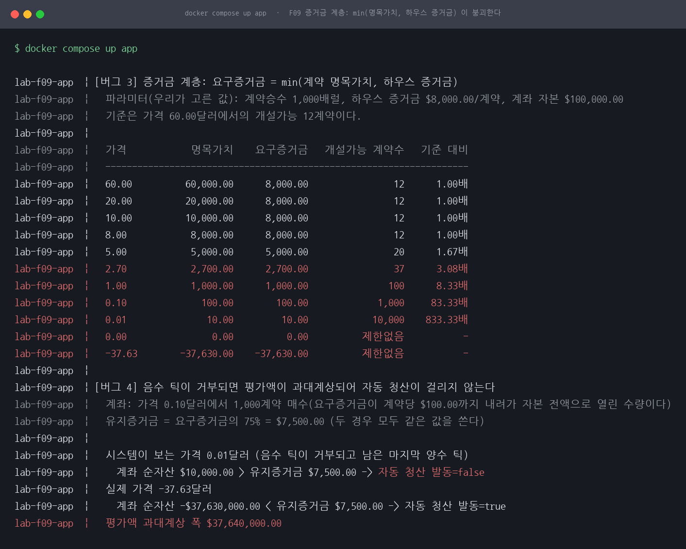
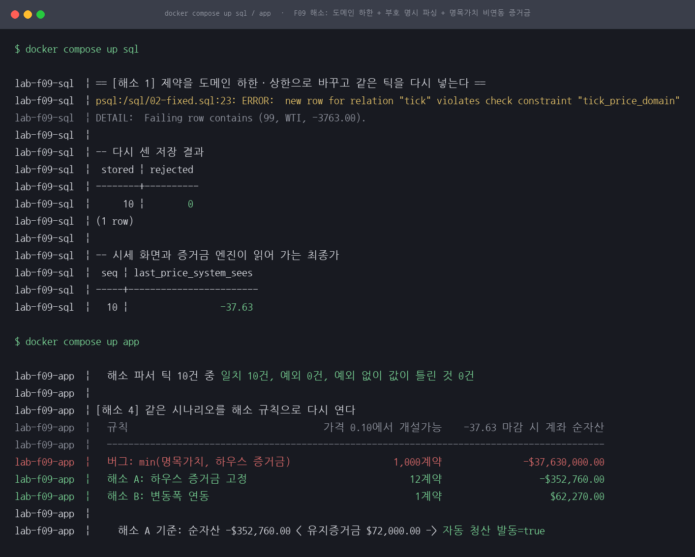
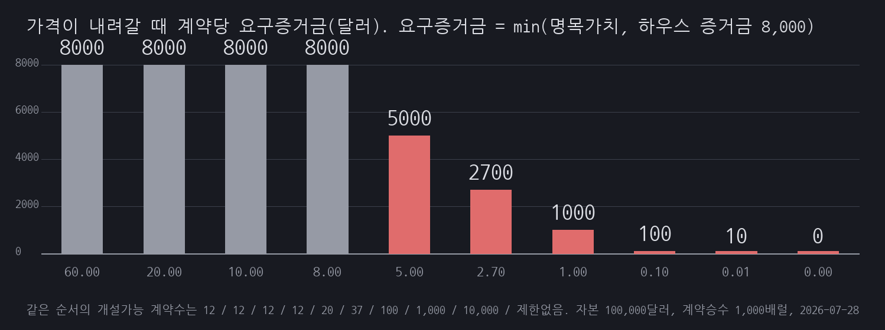
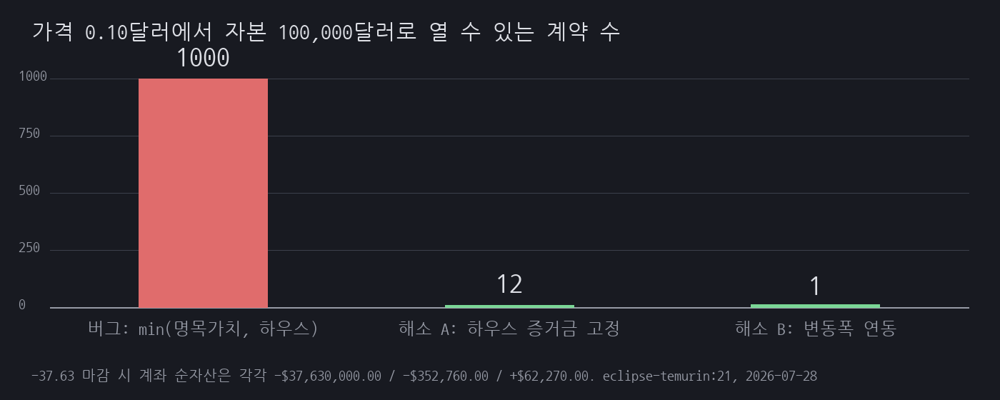

# F09 IB 음수 유가 가격은 양수라는 가정이 계층마다 다르게 깨지다

## 1. 유명한 이유

2020년 4월 20일 WTI 5월물은 배럴당 마이너스 37.63달러로 마감했습니다. CFTC는 이듬해 Interactive Brokers LLC를 상대로 한 명령서에서 그날의 종가를 "settling at negative $37.63 per barrel"로 적고, 같은 날 이 브로커에게 두 가지 시스템 문제가 있었다고 밝혔습니다. 원문 표현으로는 "(1) negative prices were not displayed to customers and customers were unable to place orders with negative-priced limit orders to buy or sell; and (2) internal minimum margin requirements were not correctly enforced prior to trade execution" 입니다. 근거 등급은 E1입니다. 출처는 [CFTC Docket No. 21-19, In the Matter of Interactive Brokers LLC, Order Instituting Proceedings(2021-09-28)](https://www.cftc.gov/media/6421/enfinteractivebrokersorder092821/download) 이고, 이 세션의 사실 관계는 그 문서에서만 가져왔습니다.

시스템이 음수를 어떻게 대했는지도 명령서에 나옵니다. 'Ticker Farm' 시스템이 해당 계약의 음수 가격을 오류로 보고 거부했고("rejected negative prices ... perceived to be erroneous"), 원유 선물의 마켓 룰 설정을 그날까지 "negative-capable"로 바꾸지 않았다고 적혀 있습니다.

금액은 오해하기 쉬워서 한 번 더 나눠 적습니다. CFTC에 실제로 낸 돈은 과징금 1,750,000달러뿐입니다. 함께 인용되는 82,570,000달러는 CFTC에 낸 돈이 아니라 Interactive Brokers가 이미 고객에게 선보상해 둔 배상액이고, 명령서는 그 전액을 배상 이행으로 인정했습니다. 두 금액을 더해 "8,400만 달러 제재"라고 쓰면 틀립니다. 위반 조항도 사기가 아니라 감독 의무 위반이고, 회사가 사실을 인정하지도 부인하지도 않는 조건의 합의입니다. 한 가지 더 붙이면, 마이너스 37.63달러는 NYMEX CL 종가이고 명령서는 이 브로커에 CL 포지션을 가진 고객이 없었다고 적고 있습니다. 고객들이 물린 계약은 QM과 ICE Europe의 WTI였습니다.

이 세션은 Interactive Brokers의 시스템을 재현하지 않습니다. 사건 자체는 그대로 재현할 수 없어 같은 메커니즘을 축소 재현했고, 그래서 재현의 등급은 E1·축소입니다. 우리가 만든 것은 "가격은 양수"라는 가정이 코드 여러 계층에 흩어져 있을 때 음수 틱 하나가 도착하면 계층마다 어떻게 다르게 깨지는가입니다. 아래 본문에서 CFTC 원문에 있는 것과 우리 모델이 고른 것을 매번 구분해 적었습니다.

제목이 세 계층을 한 줄로 묶었지만, 셋 중 증거금 계층은 "가격은 양수"라는 가정의 사례가 아닙니다. 뒤에서 보듯 요구증거금 붕괴는 명목가치가 하우스 증거금을 덮어쓰는 캡 때문이라 가격이 아직 양수일 때 이미 작동합니다. 명령서도 두 문제를 (1)과 (2)로 나눠 적었습니다. 하나의 원인에서 세 계층이 함께 무너졌다는 뜻으로 읽으면 안 됩니다.

## 2. 재현

세 계층을 따로 잽니다. 저장 계층은 Postgres 16의 CHECK 제약으로, 파싱과 표시 계층 및 증거금 계층은 자바 최소 재현으로 봅니다. 프레임워크가 원인이 아니라 가정이 원인이라 웹 계층을 얹으면 곁가지만 늘어납니다. 다만 저장 거부는 실제 DB 엔진의 메시지를 그대로 보여야 설득력이 있어 Postgres를 띄웠습니다.

입력은 코드로 만든 하강 틱 10건입니다. 20.00, 10.00, 5.00, 1.00, 0.10, 0.01, 0.00, -1.00, -10.00, -37.63 순서이고, 마지막 -37.63만 CFTC 문서의 수치이며 나머지 9건은 합성값입니다. 실제 그날의 체결 경로가 아닙니다. 환경은 Docker 위 postgres:16-alpine과 eclipse-temurin:21-jdk-alpine(JDK 21.0.11), 2 vCPU 공유 호스트입니다. compose 파일에 `cpus`도 `mem_limit`도 없고 JVM에 `-Xmx`도 주지 않았습니다. 이 세션은 로직 재현이라 처리량이나 지연 시간을 하나도 싣지 않으므로 자원 한도가 결과를 바꾸지 않지만, 그래서 이 문서의 어떤 수치도 성능 수치로 읽으면 안 됩니다. 명령과 출력 원문은 [reproduce.md](reproduce.md)에 그대로 남겼습니다.

한 가지 미리 밝힐 것이 있습니다. 세 계층은 따로 재현했을 뿐 아니라 서로 연결돼 있지도 않습니다. compose 파일의 `sql` 컨테이너와 `app` 컨테이너는 완전히 분리돼 있고, `app/NegativePrice.java`에는 JDBC가 한 줄도 없습니다. Postgres가 남긴 최종가 0.01과 증거금 엔진이 쓰는 0.01은 같은 값이지만 같은 경로로 흘러간 값이 아니라, 앞의 실행 결과를 보고 뒤의 코드에 `STALE = 0.01`이라는 상수로 옮겨 적은 것입니다. 아래에서 "저장 계층이 멈춘 값을 증거금 계층이 읽는다"고 쓸 때, 그 전파는 재현한 것이 아니라 두 실행 결과를 사람이 이어 붙인 서술입니다.

표시 방식도 하나 밝혀 둡니다. 아래에서 실행 출력을 실은 코드 블록은 전부 필요한 줄만 뽑은 발췌입니다. 남긴 줄의 글자는 손대지 않았지만 여러 줄을 덜어냈으므로 화면에 찍힌 그대로는 아니고, 전체 출력은 [reproduce.md](reproduce.md)에 있습니다.

### 저장 계층

`CHECK (price > 0)`이 걸린 시세 테이블에 틱 10건을 넣었습니다. 6건이 저장되고 4건이 거부됐습니다.

```
lab-f09-sql  | psql:/sql/01-storage.sql:31: ERROR:  new row for relation "tick" violates check constraint "tick_price_check"
lab-f09-sql  | DETAIL:  Failing row contains (10, WTI, -37.63).
lab-f09-sql  |
lab-f09-sql  | -- 보낸 틱 10건 중 몇 건이 저장됐는가
lab-f09-sql  |  stored | rejected
lab-f09-sql  | --------+----------
lab-f09-sql  |       6 |        4
```



*그림 1. 저장 계층 실행 화면입니다. 0.00과 음수 3건이 제약 위반으로 거부되고, 시세 화면과 증거금 엔진이 읽어 가는 최종가는 0.01에 멈춥니다.*

여기서 중요한 것은 거부 자체보다 그다음입니다. 마지막으로 저장된 가격은 0.01이고, 이 값을 읽는 모든 하위 시스템은 유가가 여전히 1센트라고 믿습니다. 시장은 마이너스 37.63달러인데 시스템의 세계관은 0.01에서 멈춰 있습니다.

### 파싱과 표시 계층

전문의 가격 필드는 가격을 100배 한 정수 문자열입니다. -37.63은 `-3763`으로 실려 옵니다. 부호를 상정하지 않은 파서 세 가지에 같은 틱을 넣었습니다. P1은 부호를 허용하지 않는 정수 파서, P2는 숫자가 아닌 문자를 잡음으로 보고 걷어내는 방어적 파서, P3은 32비트 정수 필드를 부호 없는 값으로 넓히는 바이너리 피드 디코더를 흉내 낸 것입니다.

```
lab-f09-app  |   실제 틱   전문 필드   P1          P2          P3
lab-f09-app  |   --------------------------------------------------------------
lab-f09-app  |   -37.63    -3763       예외 발생   $37.63      $42,949,635.33
lab-f09-app  |
lab-f09-app  |   P1 틱 10건 중 일치 7건, 예외 3건, 예외 없이 값이 틀린 것 0건
lab-f09-app  |   P2 틱 10건 중 일치 7건, 예외 0건, 예외 없이 값이 틀린 것 3건 (-37.63 -> $37.63)
lab-f09-app  |   P3 틱 10건 중 일치 7건, 예외 0건, 예외 없이 값이 틀린 것 3건 (-37.63 -> $42,949,635.33)
```



*그림 2. 파싱 계층 실행 화면입니다. P1은 음수 3건에서 예외로 멈추고, P2와 P3은 예외 없이 3건을 틀린 값으로 읽습니다.*

P1은 요란하게 실패합니다. 예외 원문은 `java.lang.NumberFormatException: Illegal leading minus sign on unsigned string -3763.` 입니다. 틱을 잃지만 실패했다는 사실은 남습니다. P2와 P3은 아무 신호 없이 값을 바꿉니다. P2는 마이너스 37.63달러를 플러스 37.63달러로, P3은 42,949,635.33달러로 읽습니다.

셋의 무게는 같지 않습니다. 실무에서 그대로 마주칠 만한 것은 P2 하나입니다. `replaceAll("[^0-9]", "")`로 금액 문자열을 씻는 코드는 실제로 흔하고, 부호가 함께 지워진다는 것만 눈에 안 띕니다. P1은 다릅니다. 가격 필드를 `Integer.parseUnsignedInt`로 읽는 코드를 실무에서 굳이 쓸 이유가 없고, 이 세션이 요란하게 실패하는 경로의 모양을 보이려고 일부러 고른 대조군입니다. P3도 이름은 바이너리 피드 디코더인데 이 재현의 입력은 문자열이라 실제 바이너리 필드를 읽지 않습니다. 32비트 값을 무부호로 해석했을 때 부호가 어떻게 사라지는지를 같은 틱으로 보여 주려고 만든 경로일 뿐, 바이너리 프로토콜을 재현한 것이 아닙니다. 표가 세 줄인 것은 실무 버그가 세 종류라는 뜻이 아니라 대조군 둘을 나란히 세웠기 때문이고, 이 세션이 실무 버그로 주장하는 것은 P2뿐입니다.

### 증거금 계층

요구증거금을 `min(계약 명목가치, 하우스 증거금)`으로 계산했습니다. 이 구조는 CFTC 명령서가 지적한 것입니다. 하우스 증거금도 명령서에 있습니다. 원문은 "On April 20, 2020, the initial house margin for long WTI was $8,462.50 per contract." 입니다. 이 재현은 그 값을 8,000달러로 반올림해 썼습니다. 나머지 셋, 그러니까 계약승수 1,000배럴과 계좌 자본 100,000달러, 유지증거금 비율 75퍼센트는 명령서에 없는 이 세션의 값입니다. 이 파라미터로 가격을 낮춰 가며 요구증거금과 개설 가능 계약 수를 실측했습니다.

아래는 실행 출력에서 행을 덜어내 다시 짠 표입니다. 콘솔 원문이 아닙니다. 뺀 행은 20.00, 10.00, 1.00, -37.63이고 전체 출력은 [reproduce.md](reproduce.md)와 바로 아래 그림 3에 그대로 있습니다.

| 가격 | 명목가치 | 요구증거금 | 개설가능 계약수 | 기준 대비 |
|---|---|---|---|---|
| 60.00 | 60,000.00 | 8,000.00 | 12 | 1.00배 |
| 8.00 | 8,000.00 | 8,000.00 | 12 | 1.00배 |
| 5.00 | 5,000.00 | 5,000.00 | 20 | 1.67배 |
| 2.70 | 2,700.00 | 2,700.00 | 37 | 3.08배 |
| 0.10 | 100.00 | 100.00 | 1,000 | 83.33배 |
| 0.01 | 10.00 | 10.00 | 10,000 | 833.33배 |
| 0.00 | 0.00 | 0.00 | 제한없음 | - |



*그림 3. 증거금 계층 실행 화면입니다. 사다리 11행이 다 들어 있는 원문 출력이고, 위 표는 여기서 네 행을 덜어낸 것입니다. 가격 8.00달러 아래부터 요구증거금이 명목가치를 따라 붕괴하고, 0.01달러에서 개설 가능 계약 수가 기준의 833배가 됩니다.*

명령서는 이 구조 때문에 고객들이 "3배 넘는 계약을 열 수 있었다"고 적었습니다. 우리 파라미터에서 그 3배는 가격 2.70달러에서 나옵니다. 기준 12계약이 37계약이 되어 3.08배입니다.

반올림한 8,000달러 대신 명령서의 8,462.50달러를 넣으면 파생 수치가 조금씩 움직입니다. 붕괴 분기점은 명목가치가 하우스 증거금과 같아지는 지점이라 8.00달러가 아니라 8.4625달러가 됩니다. 자본 100,000달러의 기준 수량은 12계약이 아니라 11계약이고, 기준이 작아지므로 배수는 커집니다. 가격 0.10달러에서 83.33배가 90.91배, 0.01달러에서 833.33배가 909.09배입니다. 3배를 넘는 가격도 2.70달러에서 약 2.94달러로 올라갑니다. 반대로 분기점 아래의 절대 수치는 그대로입니다. 그 구간에서는 `min`이 하우스 증거금을 보지 않고 명목가치를 고르므로, 0.10달러의 1,000계약과 0.01달러의 10,000계약, 뒤에 나오는 과대계상 폭은 하우스 증거금을 8,000으로 두든 8,462.50으로 두든 같습니다. 이 문단의 숫자들은 다시 실행해 잰 값이 아니라 같은 식에 8,462.50을 넣어 계산한 값이고, 표와 그림과 아래 절의 모든 수치는 실제로 돌린 8,000달러 기준입니다.

그리고 음수 틱이 거부되면 평가액이 어떻게 되는지 잽니다. 가격 0.10달러에서 요구증거금이 계약당 100달러까지 내려가 자본 전액으로 1,000계약을 열 수 있는 상태를 만들고, 그 뒤 시장이 마이너스 37.63달러로 마감하는 상황을 봅니다.

```
lab-f09-app  |   시스템이 보는 가격 0.01달러 (음수 틱이 거부되고 남은 마지막 양수 틱)
lab-f09-app  |     계좌 순자산 $10,000.00 > 유지증거금 $7,500.00 -> 자동 청산 발동=false
lab-f09-app  |   실제 가격 -37.63달러
lab-f09-app  |     계좌 순자산 -$37,630,000.00 < 유지증거금 $7,500.00 -> 자동 청산 발동=true
lab-f09-app  |   평가액 과대계상 폭 $37,640,000.00
```

시스템은 이 계좌의 순자산을 플러스 10,000달러로 보고 자동 청산을 걸지 않습니다. 실제 순자산은 마이너스 3,763만 달러입니다. 과대계상 폭은 3,764만 달러입니다.

이 대목이 명령서와 어디까지 겹치는지는 분명히 해 두어야 합니다. 명령서가 적은 것은 여기까지입니다. "did not receive negative prices and was therefore unable to properly value accounts. The credit system overstated the value of accounts." 음수를 못 받아 계좌를 제대로 평가하지 못했고 신용 시스템이 계좌 가치를 과대계상했다는 사실 관계뿐입니다. 시스템이 마지막 양수 틱 0.01에 고정됐다는 메커니즘도, 과대계상 폭이 얼마였다는 수치도 명령서에 없습니다. 위의 3,764만 달러는 전적으로 이 세션 모델이 낳은 수입니다. 우리가 진입가 0.10달러와 1,000계약, 정지가 0.01달러를 고르는 순간 결정되는 값이라, 실제 사건에서 얼마가 과대계상됐는지에 대해서는 아무것도 말해 주지 않습니다.

## 3. 내부 원리

세 계층이 깨지는 방식은 서로 다릅니다.

저장 계층은 도메인 제약처럼 보이는 것이 사실은 가정이었기 때문에 깨집니다. `price > 0`은 "가격은 0보다 크다"는 도메인 규칙이 아니라 "우리는 0 이하를 본 적이 없다"는 관찰의 기록입니다. 원유 선물처럼 만기에 실물 인수 의무가 붙는 계약은 보관 비용이 상품 가치를 넘어서면 파는 쪽이 돈을 얹어 주는 상황이 성립하므로 음수 가격이 도메인 밖의 값이 아닙니다. 제약이 틀린 순간 시세는 저장되지 않고, 그다음 모든 계층은 마지막 양수 가격을 현재가로 믿습니다. 여기서 이미 시스템은 시장과 다른 세계에 있습니다.

파싱 계층은 예외로 멈추는 경로와 조용히 값을 바꾸는 경로로 갈립니다. P1의 `Integer.parseUnsignedInt`는 선행 마이너스 부호를 만나면 예외를 던집니다. 이 경로는 시세를 잃지만 잃었다는 사실이 로그에 남습니다. P2는 금액 문자열에서 통화 기호나 구분자를 걷어내려고 `replaceAll("[^0-9]", "")`을 쓰는 흔한 방어 코드인데, 부호도 함께 걷어냅니다. P3은 자바에 부호 없는 정수 타입이 없어 `Integer.toUnsignedLong`으로 넓히는 코드이고, 비트 패턴은 그대로인데 해석만 바뀌어 -3763이 4,294,963,533이 됩니다. 뒤의 두 경로는 예외를 던지지 않으므로 상위 코드가 정상 처리로 받아들입니다.

증거금 계층의 붕괴는 가격이 음수가 되기 전에 시작됩니다. `min(명목가치, 하우스 증거금)`은 명목가치가 하우스 증거금보다 클 때만 하우스 증거금이 걸립니다. 명목가치가 그 아래로 내려가면 하한이 사라지고 요구증거금이 가격에 비례해 줄어듭니다. 우리 파라미터에서 그 분기점은 가격 8.00달러이고, 명령서의 8,462.50달러를 넣으면 8.4625달러입니다. 같은 자본으로 열 수 있는 계약 수는 요구증거금의 역수로 늘어나므로, 가격이 10분의 1이 되면 계약 수는 10배가 됩니다. 가격이 정확히 0이 되면 요구증거금도 0이 되어 나눗셈이 성립하지 않고 제한 자체가 사라집니다.

평가액 과대계상은 저장 계층의 결과입니다. 음수 틱이 거부돼 최종가가 0.01에 멈추면 청산 판정에 쓰이는 순자산도 0.01 기준으로 계산됩니다. 순자산이 플러스로 보이니 청산 조건에 걸리지 않고, 계좌는 손실이 실현될 때까지 그대로 남습니다.

두 결함을 하나로 묶고 싶은 유혹이 생기는 자리인데, 원인은 서로 다릅니다. 평가액 과대계상은 음수를 값으로 인정하지 않은 데서 나옵니다. 요구증거금 붕괴는 그렇지 않습니다. 명목가치가 하우스 증거금을 덮어쓰는 캡 하나면 성립하고, 위에서 봤듯 가격이 아직 양수인 8달러대에서 이미 작동합니다. 음수 가격을 지원하도록 고친 시스템에서도 이 캡은 그대로 남습니다. CFTC가 두 문제를 별개 항목으로 나열한 것도 같은 이유일 것입니다. 이 재현에서 둘이 이어져 보이는 것은 우리가 시나리오를 그렇게 짰기 때문입니다. 캡이 열어 준 1,000계약짜리 계좌를 만들어 놓고 그 계좌에 멈춘 가격을 먹였으니 결과가 겹쳐 보이는 것이지, 한 원인이 두 갈래로 갈라진 것이 아닙니다.

## 4. 해소

계층마다 다르게 깨졌으므로 해소도 계층마다 다릅니다.

저장 계층은 제약을 없애는 것이 답이 아닙니다. 제약을 지우면 단위를 잘못 곱한 값이나 파싱 사고로 만들어진 값까지 그대로 들어옵니다. 도메인에 맞는 하한과 상한으로 바꿨습니다.

```sql
ALTER TABLE tick DROP CONSTRAINT tick_price_check;
ALTER TABLE tick ADD CONSTRAINT tick_price_domain
    CHECK (price >= -1000.00 AND price <= 100000.00);
```

`CHECK (price IS NOT NULL)`로 바꾸는 선택지도 있지만, 그것은 컬럼의 `NOT NULL`이 이미 하는 일이라 이상치를 걸러 낼 방어가 하나도 남지 않습니다. 하한 -1000은 이 세션이 고른 값이고, 실무에서는 거래소 가격 제한이나 상품 특성에서 가져와야 합니다.

파싱 계층은 부호를 명시적으로 허용하고, 파싱 결과를 다시 직렬화해 원본 전문과 대조하는 왕복 검증을 붙였습니다. 부호가 사라지거나 값이 확대되면 왕복이 어긋나 잡힙니다.

```java
static Res pFixed(String f) {
    if (!f.matches("-?\\d{1,9}")) return new Res(null, "형식 위반으로 거부: " + f);
    BigDecimal px = BigDecimal.valueOf(Long.parseLong(f), 2);
    String back = px.movePointRight(2).setScale(0).toPlainString();
    if (!back.equals(f)) return new Res(null, "왕복 불일치로 거부: " + f + " -> " + back);
    return new Res(px, null);
}
```

증거금 계층은 두 가지를 만들어 비교했습니다. 해소 A는 요구증거금을 명목가치에 연동하지 않고 하우스 증거금으로 고정합니다. 구현이 한 줄이고 가격이 어디로 가든 레버리지가 변하지 않습니다. 해소 B는 가격 수준 대신 관측된 변동폭에 연동합니다. 우리 틱 10건의 변동폭은 57.63달러이므로 요구증거금은 `max(8,000, 57.63 x 1,000) = 57,630`이 됩니다. 가격이 얼마든 하루에 57.63달러가 움직일 수 있는 시장이라면 그만큼을 요구하는 방식이라, 변동성이 커진 국면에서 A보다 보수적입니다. 대신 평시에도 증거금이 높아 자본 효율이 떨어지므로, 실무라면 변동폭 추정 기간과 갱신 주기를 함께 설계해야 합니다. 이 세션은 두 방식의 수치 차이를 보여 주는 데까지만 갑니다.

## 5. 재계측

같은 틱 10건과 같은 파라미터로 다시 쟀습니다.

저장 계층은 10건 전부 저장되고 거부가 0건이 됐습니다. 시세 화면과 증거금 엔진이 읽는 최종가가 0.01에서 -37.63으로 바뀝니다. 바꾼 제약이 방어를 잃지 않았는지도 함께 확인했습니다. 단위를 100배 틀린 -3763.00은 새 제약 `tick_price_domain` 위반으로 계속 거부됩니다.

파싱 계층은 틱 10건 전부 일치, 예외 0건, 예외 없이 값이 틀린 것 0건입니다. P2가 3건, P3이 3건을 조용히 틀리던 것이 0건이 됐습니다.



*그림 4. 해소 실행 화면입니다. 저장은 10건 전부 통과하면서 단위 오류 틱은 계속 막고, 파싱은 왕복 검증으로 10건 전부 일치하며, 증거금은 같은 시나리오에서 열리는 수량을 1,000계약에서 12계약과 1계약으로 줄입니다.*

증거금 계층은 가격 사다리 전 구간을 다시 쟀습니다. 해소 A는 60.00달러부터 -37.63달러까지 요구증거금 8,000달러, 개설 가능 12계약으로 고정됩니다. 해소 B는 전 구간 요구증거금 57,630달러, 개설 가능 1계약입니다. 버그판에서 가격에 따라 12계약에서 10,000계약까지 흔들리던 값이 가격과 무관해졌습니다.



*그림 5. 버그판에서 가격이 내려갈 때 계약당 요구증거금이 어떻게 변하는지입니다. 가격 8.00달러까지는 하우스 증거금 8,000달러에서 걸리다가, 그 아래부터 명목가치를 따라 붕괴해 0.01달러에서 10달러가 됩니다.*

같은 시나리오를 세 규칙으로 다시 열어 비교했습니다.

| 규칙 | 가격 0.10에서 개설가능 | -37.63 마감 시 계좌 순자산 | 자동 청산 |
|---|---|---|---|
| 버그: `min(명목가치, 하우스 증거금)` | 1,000계약 | -$37,630,000.00 | 발동 안 함 (시스템은 +$10,000.00으로 봄) |
| 해소 A: 하우스 증거금 고정 | 12계약 | -$352,760.00 | 발동 |
| 해소 B: 변동폭 연동 | 1계약 | +$62,270.00 | 불필요 |



*그림 6. 가격 0.10달러에서 자본 100,000달러로 열 수 있는 계약 수입니다. 버그판 1,000계약이 해소 A에서 12계약, 해소 B에서 1계약이 됩니다.*

계좌 순자산으로 보면 마이너스 3,763만 달러가 마이너스 35만 2,760달러가 되고, 해소 B에서는 플러스 62,270달러로 남습니다. 여기에 저장과 파싱을 함께 고쳤으므로 평가액도 실제와 같아집니다. 이 문장 역시 세 실행의 결과를 이어 붙인 서술이고, 고친 저장 계층의 값이 증거금 계층으로 실제로 흘러가는 것을 확인한 것은 아닙니다. 해소 A 기준으로 순자산 마이너스 352,760달러가 유지증거금 72,000달러 아래라 자동 청산이 정상적으로 발동합니다. 버그판에서 발동하지 않던 안전장치가 돌아왔습니다.

## 6. 예상과 달랐던 점

세 가지가 처음 생각과 달랐습니다.

첫째, "조용히 틀리는 쪽이 위험하다"까지는 예상했는데, 조용히 틀리는 두 경로의 위험도가 서로 크게 달랐습니다. P3의 4,294만 달러는 워낙 터무니없어서 어떤 상한 검증에도 걸립니다. 반면 P2의 플러스 37.63달러는 그 시점 원유 가격대로 그럴듯합니다. 범위 검증, 이상치 탐지, 눈으로 하는 확인 어디에도 걸리지 않고 부호만 반대인 값이 시스템 전체를 통과합니다. 틀린 값의 크기가 아니라 그럴듯함이 생존 시간을 정합니다. F01에서 Infinity는 상한 검증에 걸리고 NaN만 뚫렸던 것과 같은 구조를 다른 재료로 다시 만난 셈입니다.

둘째, 증거금이 무너지는 분기점이 0 근처가 아니라 8.00달러였습니다. 반올림하지 않은 8,462.50달러로 계산해도 8.4625달러라 결론은 그대로입니다. `min` 구조는 명목가치가 하우스 증거금 아래로 내려가는 순간부터 하한을 잃으므로, 유가가 아직 한 자릿수 양수일 때 이미 레버리지가 늘기 시작합니다. CFTC가 적은 "3배 넘는 계약"도 우리 파라미터에서는 가격 2.70달러, 그러니까 여전히 양수인 구간에서 재현됐습니다. 음수 가격은 방아쇠였을 뿐이고 구조적 결함은 그 훨씬 위에서 이미 작동하고 있었다는 뜻입니다. 그래서 "음수 가격을 지원한다"는 대응만으로는 이 결함이 남습니다.

셋째, 해소 파서의 왕복 검증이 만능이 아니었습니다. 단위를 100배 틀린 전문 `-376300`은 왕복 검증을 그대로 통과합니다. 직렬화와 역직렬화가 서로 일관되기만 하면 왕복은 성립하고, 그 값이 도메인 안인지는 왕복이 알지 못하기 때문입니다. 이 값은 저장 계층의 도메인 하한에서야 걸립니다. 반대로 저장 계층만 고치고 파싱을 그대로 두면 부호를 잃은 플러스 37.63달러가 도메인 안의 값이라 아무 데서도 걸리지 않습니다. 계층마다 잡을 수 있는 오류의 종류가 다르고, 한 계층에서 전부 막겠다는 설계가 오히려 구멍을 만듭니다. 세 계층을 따로 재현한 것이 결과적으로 이 결론을 얻는 방법이었습니다.

## 한계

실제 Interactive Brokers 시스템을 재현한 것이 아닙니다. CFTC 명령서가 기술한 두 메커니즘, 즉 음수 가격 거부로 인한 계좌 평가액 과대계상과 `min(명목가치, 하우스 증거금)` 구조의 요구증거금 붕괴를 같은 모양으로 축소해 만든 코드입니다. 명령서에는 시스템 구성도 코드도 없습니다. 파라미터 넷 가운데 하우스 증거금만 명령서의 8,462.50달러를 8,000달러로 반올림해 쓴 것이고, 계약승수와 자본, 유지증거금 비율은 이 세션이 정한 값입니다. 따라서 표에 나온 절대 금액은 실제 피해 규모와 무관하고, 가격이 내려갈 때 배수가 어떻게 커지는지의 상대 비교만 의미가 있습니다.

계층 사이의 전파는 재현하지 않았습니다. `sql` 컨테이너와 `app` 컨테이너는 서로를 모르고 자바 코드에는 JDBC가 없습니다. 저장 계층이 0.01에서 멈춘 것과 증거금 계층이 0.01로 계산한 것 사이에는 데이터 흐름이 없고, 앞의 결과를 뒤의 상수로 옮겨 적었을 뿐입니다. 계층별 결함은 각각 실행해 잰 것이 맞지만 "한 계층의 고장이 다음 계층으로 흘러간다"는 부분은 서술이지 측정이 아닙니다. 실제로 흘려 보려면 증거금 엔진이 시세 테이블을 읽게 만들어야 하고, 그것은 이 세션이 하지 않은 일입니다.

`CHECK (price > 0)`도 비유입니다. 명령서가 말하는 것은 시세 수신 시스템이 음수를 오류로 보고 거부했다는 것이고, 실제로 DB 제약이 원인이었다는 기록은 없습니다. 설정과 검증 계층이 음수를 이상치로 거부한 사례를 DB 제약 하나로 축약해 보인 것입니다.

다루지 않은 것도 적어 둡니다. 실제 주문 게이트웨이와 화면 렌더링, 거래소 마켓 룰 설정, 여러 계약과 여러 통화가 섞인 포트폴리오 마진, 장중 실시간 청산 엔진은 재현하지 않았습니다. 변동성 기반 증거금도 관측 변동폭에 상수를 곱하는 수준이고, SPAN이나 VaR 같은 실제 증거금 모형과는 다릅니다. 부하나 지연 시간도 측정하지 않았습니다. 컨테이너에 CPU와 메모리 한도를 걸지 않았고 JVM 힙도 기본값 그대로인데, 이 기록에 시간 수치가 하나도 없어 그대로 두었습니다. 뒤집어 말하면 이 세션의 결과는 자원 한도를 걸어야 비교할 수 있는 종류가 아닙니다. 이 세션은 로직 재현이라 난수도 동시성도 없습니다. 같은 명령을 두 번 실행해 출력이 한 글자도 다르지 않은 것을 확인했고, 기록에는 1회분을 그대로 씁니다.
