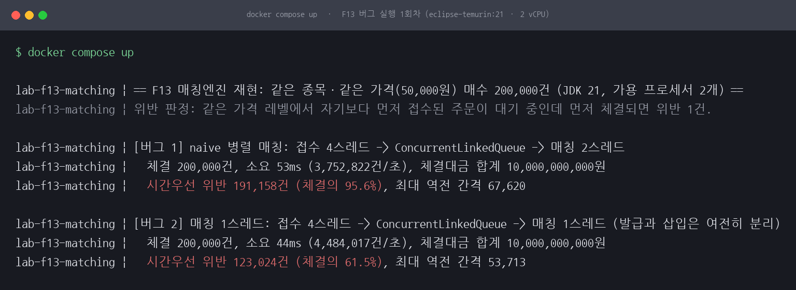
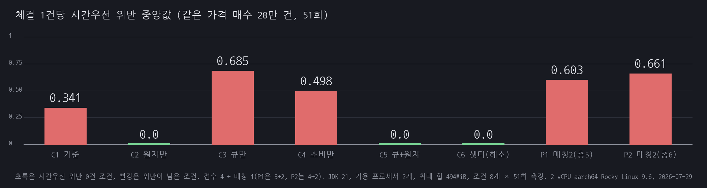
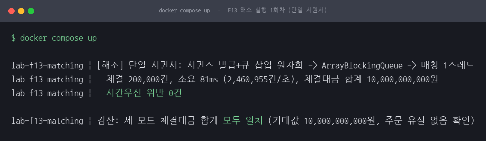
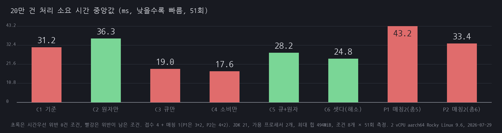

# F13 매칭엔진 병렬 매칭이 시간우선 원칙을 깨다

## 1. 유명한 이유

한국거래소는 정규장의 접속매매를 "가격우선의 원칙과 시간우선의 원칙에 따라 합치되는 호가간에 매매거래를 성립"시키는 방식으로 안내합니다([접속매매시 매매체결방법](https://regulation.krx.co.kr/contents/RGL/03/03010203/RGL03010203.jsp)). 매수는 높은 가격이 우선하고, 가격이 같으면 먼저 접수된 호가가 우선합니다. 시간우선에는 동시호가라는 예외가 있지만, 거래소 안내에 따르면 2001년 9월부터 원칙적으로 시간우선원칙을 적용하고 동시호가는 시가 등이 상·하한가로 결정되는 경우에만 예외적으로 인정합니다([단일가매매시 체결방법](https://regulation.krx.co.kr/contents/RGL/03/03010201/RGL03010201.jsp)). 다만 접속매매에서도 우선순위가 가격과 시간 둘로 끝나지는 않습니다. 거래소의 매매체결원칙에는 위탁매매우선과 수량우선이 함께 있습니다. 이 세션이 다루는 것은 그 가운데 가격과 시간 두 가지로 좁힌 범위이고, 나머지 둘은 재현하지 않았습니다.

근거 등급은 E2입니다. 거래소가 공식 문서로 안내하는 매매체결 규칙이 근거이고, 특정 회사의 사고 기록에는 기대지 않습니다. 접수 순서를 시퀀스로 찍는 일과 그 순서대로 체결하는 일은 별개의 문제라서, 처리량을 올리려고 접수와 매칭을 병렬화하는 순간 시간우선이 조용히 깨집니다. 주문이 사라지거나 금액이 틀리는 요란한 신호가 없다는 점이 이 함정의 위험한 부분입니다. 장부 검산은 통과하는데 체결 순서만 어긋납니다.

## 2. 재현

같은 종목, 같은 가격(50,000원)의 매수 주문 200,000건을 코드로 만들었습니다. 접수 스레드가 각자 주문을 만들고 AtomicLong으로 접수 시퀀스를 받은 뒤 공유 오더북(해당 가격 레벨의 큐)에 넣습니다. 이 시퀀스가 접수 순서의 진실입니다. 매칭 스레드가 큐에서 꺼내 체결하고, 체결 순서대로 접수 시퀀스를 로그에 남깁니다. 반대편 매도 물량은 무한하다고 가정해, 같은 가격 대기열의 어느 주문부터 채워지는가만 봅니다.

초판은 버그 두 가지와 해소 하나를 각각 한 구성으로만 돌렸습니다. 그런데 그 해소판이 큐 구현과 원자 구간과 소비 방식을 한꺼번에 바꾼 것이었고, 매칭 스레드 수도 조건마다 달랐습니다. 처리량 차이를 어느 변수에도 귀속할 수 없는 설계였다는 뜻입니다. 그래서 재현을 다시 짰습니다. 변수를 하나씩만 다르게 한 조건 여덟 개를 같은 프로그램 안에서 돌리고, 매칭 스레드 수와 실행 가능 스레드 총수를 맞췄습니다.

| 조건 | 큐 구현 | 소비 방식 | 원자 구간 | 접수 | 매칭 | 실행 가능 스레드 |
|---|---|---|---|---|---|---|
| C1 기준 | `ConcurrentLinkedQueue` | 스핀 poll | 없음 | 4 | 1 | 5 |
| C2 원자만 | `ConcurrentLinkedQueue` | 스핀 poll | `synchronized` | 4 | 1 | 5 |
| C3 큐만 | `ArrayBlockingQueue` | 스핀 poll | 없음 | 4 | 1 | 5 |
| C4 소비만 | `ArrayBlockingQueue` | 블로킹 take | 없음 | 4 | 1 | 5 |
| C5 큐+원자 | `ArrayBlockingQueue` | 스핀 poll | `synchronized` | 4 | 1 | 5 |
| C6 셋다(해소) | `ArrayBlockingQueue` | 블로킹 take | `synchronized` | 4 | 1 | 5 |
| P1 매칭2(총5) | `ConcurrentLinkedQueue` | 스핀 poll | 없음 | 3 | 2 | 5 |
| P2 매칭2(총6) | `ConcurrentLinkedQueue` | 스핀 poll | 없음 | 4 | 2 | 6 |

C1이 비교의 기준선이고 초판 [버그 2]와 같은 구성입니다. C2는 여기에 원자 구간만 얹었고, C3은 큐만 갈아 끼웠습니다. C4는 C3에서 소비 방식만 블로킹으로 바꿨습니다. `take()`는 `BlockingQueue`에만 있어서 소비 방식은 `ArrayBlockingQueue` 위에서만 갈리기 때문입니다. C6이 초판의 해소판입니다. P1은 스레드 총수를 5개로 맞춘 채 매칭만 2스레드로 늘린 조건이고, P2는 초판 [버그 1]과 같은 구성이라 참고값으로만 둡니다.

측정 환경은 이렇습니다. 명령 원문과 출력은 [reproduce.md](reproduce.md)에 있습니다.

| 항목 | 값 |
|---|---|
| 호스트 | Rocky Linux 9.6, `Linux 5.14.0-570.33.2.el9_6.aarch64 aarch64` |
| CPU / 메모리 | `nproc` 2, `free -g` 총 11GiB (스왑 7GiB) |
| 배경 부하 | 상주 컨테이너 11개(모니터링 스택과 백엔드 서비스), 측정 직후 `uptime`의 1·5·15분 평균 1.73 / 1.82 / 1.67 |
| 컨테이너 | eclipse-temurin:21-jdk-alpine, `mem_limit: 1g`, CPU 제한 없음 |
| JVM | JDK 21, `-Xms512m -Xmx512m`, 프로그램이 찍은 최대 힙 494MiB |
| 실행 가능 스레드 | C1~C6과 P1은 5개, P2만 6개 |
| 측정 규모 | 조건 8개 × 51회, `docker compose up`을 3회 반복 |
| 측정일 | 2026-07-29 |

2 vCPU에 실행 가능 스레드를 5개에서 6개 얹은 조건이라는 점을 먼저 적어 둡니다. 아래 수치는 전부 이 코어 수의 값입니다.

위반 판정 기준도 분명히 합니다. 시간우선 비교는 같은 가격 레벨 안에서만 의미가 있습니다. 가격이 다른 주문 사이는 가격우선이 먼저라 접수 선후를 따질 일이 없기 때문입니다. 그래서 이 재현은 주문 전부를 같은 가격 하나에 쌓아 모든 비교가 같은 가격 안의 시간우선 비교가 되게 했습니다. 체결 로그를 체결 순서대로 훑으면서, 아직 체결되지 않은 가장 오래된 접수 시퀀스보다 늦은 시퀀스가 먼저 체결되면 위반 1건으로 셉니다.

이 지표가 무엇을 세지 않는지도 같이 밝혀 둡니다. 위반 건수는 체결 시점마다 더 오래된 미체결 주문이 남아 있었는지를 센 값이지, 그만큼의 주문이 순위를 빼앗겼다는 뜻이 아닙니다. 이른 시퀀스 하나가 늦게 삽입되면 그 주문이 체결될 때까지 이어지는 체결이 전부 각각 위반으로 잡히기 때문입니다. 규칙이 깨진 상태가 얼마나 오래 이어졌는지를 보는 지표로 읽어야 합니다.

그리고 위반을 절대 건수로만 적지 않습니다. 조건마다 처리량이 다른데 절대 건수만 늘어놓으면 비교가 되지 않습니다. 체결 1건당 위반 값을 함께 냅니다. 이 재현은 조건마다 체결 건수가 200,000건으로 같아서 체결당 위반은 위반 건수를 200,000으로 나눈 값입니다.



*그림 1. 1회차 51회 측정의 시간우선 위반 요약입니다. 원자 구간이 없는 다섯 조건은 전부 위반이 남고, 원자 구간을 넣은 C2·C5·C6은 51회 모두 0건입니다.*

| 조건 | 위반 중앙값 | 체결당 위반 중앙값 (3회 범위) | 위반 0건 회차 (3회 합계) |
|---|---|---|---|
| C1 기준 | 68,181건 | 0.341 (0.273~0.388) | 18/153 |
| C2 원자만 | 0건 | 0.000 (3회 모두 0.000) | 153/153 |
| C3 큐만 | 136,920건 | 0.685 (0.520~0.730) | 16/153 |
| C4 소비만 | 99,633건 | 0.498 (0.498~0.738) | 15/153 |
| C5 큐+원자 | 0건 | 0.000 (3회 모두 0.000) | 153/153 |
| C6 셋다(해소) | 0건 | 0.000 (3회 모두 0.000) | 153/153 |
| P1 매칭2(총5) | 120,588건 | 0.603 (0.591~0.655) | 5/153 |
| P2 매칭2(총6) | 132,140건 | 0.661 (0.599~0.754) | 3/153 |



*그림 2. 체결 1건당 시간우선 위반 중앙값입니다. 조건마다 처리량이 달라 절대 건수로는 비교되지 않으므로 체결당으로 정규화했습니다.*

원자 구간이 없는 다섯 조건에서는 체결의 27%에서 75%가 시간우선을 어겼습니다. 회차 하나하나를 보면 편차가 훨씬 큽니다. 가장 심한 회차는 P2의 196,834건으로 체결의 98.4%였고, 반대로 위반 0건으로 끝난 회차도 있었습니다. 그런데도 체결대금 합계는 3회 실행의 모든 조건 모든 회차에서 기대값 100억 원과 일치했고 주문 유실도 없었습니다. 금액 검산만 보면 아무 문제가 없는 시스템입니다.

스레드 총수를 5개로 맞춘 상태에서도 매칭을 2스레드로 늘린 P1이 매칭 1스레드인 C1보다 위반이 많았습니다(체결당 0.603 대 0.341). 초판은 매칭 2스레드 조건에 접수 4스레드를 붙여 스레드 총수가 6개였는데, 스레드 수를 맞춰도 매칭 병렬화 쪽이 더 많이 깨진다는 것을 이번에 확인했습니다.

## 3. 내부 원리

AtomicLong의 incrementAndGet도 ConcurrentLinkedQueue의 offer도 각각은 스레드 안전합니다. 문제는 두 호출 사이의 틈입니다. 시퀀스 발급과 큐 삽입이 별개 단계라서, 시퀀스 1,001번을 받은 스레드가 offer를 부르기 직전에 밀려나면 그 사이 1,002번을 받은 다른 스레드가 먼저 큐에 들어갑니다. 큐는 삽입된 순서만 보존합니다. 시퀀스가 몇 번인지는 큐가 모릅니다.

여기를 happens-before가 없는 문제로 적으면 틀립니다. 초고에서 그렇게 썼다가 고쳤습니다. `AtomicLong`의 `incrementAndGet`은 volatile 읽기와 쓰기의 메모리 효과를 갖고, `ConcurrentLinkedQueue`는 원소를 넣기 전의 동작이 다른 스레드가 그 원소를 꺼낸 뒤의 동작보다 happens-before한다고 문서가 보장합니다. 필요한 happens-before는 두 도구가 이미 제공합니다. 매칭 스레드는 `o.seq`를 언제나 정확한 값으로 읽습니다.

깨진 것은 가시성이 아니라 원자성입니다. 발급과 삽입이 각각은 원자적인데 둘을 묶은 구간이 원자적이지 않습니다. 어떤 스레드가 1,001번을 받은 사실은 다른 스레드에게 정확히 보이지만, 그 사실이 보이는 것과 1,001번이 큐에 먼저 들어가는 것은 다른 이야기입니다. 시퀀스는 접수 순서를 기록할 뿐 그 순서를 강제하지 않습니다.

이번 재현은 이 진단을 코드 읽기가 아니라 측정으로 확인합니다. C1과 C2는 큐도 같고 소비 방식도 같고 스레드 배분도 같습니다. 다른 것은 발급과 삽입을 `synchronized`로 묶었는가 하나뿐입니다. C2는 3회 실행 153회 전부 위반 0건이었습니다. 반대로 큐만 갈아 끼운 C3과 소비 방식까지 바꾼 C4는 원자 구간이 없어서 위반이 그대로 남았습니다. 순서를 지켜 준 것은 원자 구간이고, 큐 구현과 소비 방식은 순서에 관여하지 않습니다.

매칭 쪽에도 같은 모양의 틈이 있습니다. poll은 큐 순서대로 꺼내 주지만, 꺼낸 주문을 체결로 확정하는 것은 그다음 일입니다. 스레드 A가 앞 주문을 꺼내고 확정하기 전에 스레드 B가 뒤 주문을 꺼내 먼저 확정할 수 있습니다. 매칭 2스레드인 P1의 위반이 매칭 1스레드인 C1보다 큰 것이 이 틈의 몫입니다. 다만 매칭을 1스레드로 줄인 C1에서도 체결당 0.273에서 0.388이 어긋났습니다. 접수 쪽 레이스만으로 체결의 3할 가까이가 깨진다는 뜻이라, 매칭만 고쳐서는 해결되지 않습니다.

## 4. 해소

순서를 정하는 지점과 순서대로 처리하는 지점이 같은 직렬화 지점을 지나게 했습니다. 접수 스레드가 주문을 만드는 것까지는 병렬 그대로 두고, 시퀀스 발급과 큐 삽입을 하나의 원자 구간으로 묶었습니다. 이 구간이 시퀀서입니다. LMAX 디스럽터가 단일 라이터로 순서를 확정하는 아이디어를 표준 라이브러리 수준으로 축소한 구성입니다.

```java
synchronized (sequencer) {            // 발급과 삽입 사이에 아무도 끼어들 수 없다
    o.seq = seqGen.incrementAndGet(); // 접수 순서 확정
    level.offer(o);                   // 같은 순서로 오더북 반영
}
```

초판은 이 원자 구간에 큐 교체와 소비 방식 교체를 얹어 한 덩어리로 내놓고 "원자 구간만 묶었습니다"라고 적었습니다. 이번 조건표에서 그 덩어리는 C6이고, 원자 구간만 떼어낸 것이 C2입니다. C2가 위반 0건을 낸 것으로 순서 보장에 필요한 것은 원자 구간 하나임이 갈렸습니다. 나머지 두 변수는 처리량에만 관여합니다. 그 몫이 얼마인지가 5절입니다.

버리기 전에 따져 본 대안이 둘 있습니다. 체결을 일단 내보내고 나중에 로그를 정렬해 보정하는 방식은 이미 상대방에게 나간 체결을 되돌릴 수 없어 원천 차단이 되지 못합니다. PriorityBlockingQueue로 시퀀스 순 정렬을 맡기는 방식은 큐 안에 이미 들어온 원소만 정렬한다는 한계에 걸립니다. 선행 시퀀스가 아직 삽입되기 전이면 매칭 스레드는 큐에 있는 후행 시퀀스를 그대로 꺼내 가고, 기다려야 할 주문이 있다는 사실 자체를 큐가 알 수 없습니다.

## 5. 재계측

처리량은 조건마다 51회 측정의 중앙값으로 보고, 사분위와 범위를 함께 적습니다. 회차 편차가 커서 한 회차 값으로는 아무것도 말할 수 없기 때문입니다. C1은 51회 범위가 13.2ms에서 126.8ms입니다.



*그림 3. 1회차 51회 측정의 처리량 요약과 변수별 몫입니다. 배수가 1보다 크면 그 변수를 켠 쪽이 느립니다.*

| 조건 | 소요 중앙값 | 사분위 25~75% | 범위 최소~최대 | 처리량 중앙값 |
|---|---|---|---|---|
| C1 기준 | 31.2ms | 25.6~41.2ms | 13.2~126.8ms | 약 642만 건/초 |
| C2 원자만 | 36.3ms | 26.8~50.7ms | 16.1~72.4ms | 약 551만 건/초 |
| C3 큐만 | 19.0ms | 17.8~24.1ms | 15.0~54.8ms | 약 1,053만 건/초 |
| C4 소비만 | 17.6ms | 14.7~26.4ms | 13.8~44.1ms | 약 1,137만 건/초 |
| C5 큐+원자 | 28.2ms | 22.5~39.0ms | 18.7~80.3ms | 약 709만 건/초 |
| C6 셋다(해소) | 24.8ms | 18.9~30.8ms | 16.6~52.8ms | 약 805만 건/초 |
| P1 매칭2(총5) | 43.2ms | 25.5~61.0ms | 12.8~120.9ms | 약 463만 건/초 |
| P2 매칭2(총6) | 33.4ms | 20.4~40.9ms | 12.8~94.4ms | 약 599만 건/초 |



*그림 4. 조건별 소요 시간 중앙값입니다. 초록은 시간우선 위반이 0건인 조건, 빨강은 위반이 남은 조건입니다. 규칙을 지킨 조건이 항상 느린 것은 아니어서, C6은 기준선 C1보다 빠릅니다.*

변수 하나만 다른 짝끼리 배수를 냈습니다. 세 번의 실행에서 배수의 방향은 모두 같았습니다.

| 바꾼 변수 | 짝 | 3회 범위 |
|---|---|---|
| 원자 구간만 추가 (CLQ + 스핀 위에서) | C1 → C2 | 1.06~1.16배 |
| 원자 구간만 추가 (ABQ + 스핀 위에서) | C3 → C5 | 1.31~1.78배 |
| 원자 구간만 추가 (ABQ + take 위에서) | C4 → C6 | 1.36~1.41배 |
| 큐 구현만 교체 (CLQ → ABQ) | C1 → C3 | 0.57~0.73배 |
| 소비 방식만 교체 (스핀 poll → 블로킹 take) | C3 → C4 | 0.89~0.96배 |
| 셋 다 바꾼 해소판 전체 | C1 → C6 | 0.77~0.89배 |

시퀀서의 순수 비용은 있습니다. 다른 변수를 고정하고 원자 구간만 켜면 세 짝 모두 느려졌고, 배수는 1.06배에서 1.78배였습니다. 짝에 따라 폭이 다른 이유도 데이터에 있습니다. `ConcurrentLinkedQueue` 위에서는 1.06~1.16배로 작고, `ArrayBlockingQueue` 위에서는 1.31~1.78배로 큽니다. `ArrayBlockingQueue`는 넣기와 꺼내기가 이미 락 하나를 공유하므로 바깥에 `synchronized`를 하나 더 두면 락이 두 겹이 됩니다. 반대로 `ConcurrentLinkedQueue`는 접수 4스레드가 CAS로 다투는 구조라, 원자 구간이 그 경합을 대신 줄여 주면서 자기 비용을 일부 상쇄합니다. 이건 측정된 배수에서 읽은 해석이고, CAS 실패 횟수를 따로 계측하지는 않았습니다.

큐 교체가 이 실험에서 가장 큰 변수였습니다. `ConcurrentLinkedQueue`를 `ArrayBlockingQueue`로 바꾸기만 해도 0.57~0.73배, 그러니까 1.4~1.8배 빨라졌습니다. 락 기반 큐가 무락 큐보다 빠르다는 결과라 예상과 반대입니다. 2코어에서 접수 4스레드와 스핀하는 매칭 스레드가 동시에 실행 가능 상태로 있으면 CAS는 계속 실패하고 재시도합니다. 락은 실패한 스레드를 재워서 실행 가능 스레드 수를 줄입니다. 코어가 모자란 조건에서 재우는 쪽이 이긴 것으로 보이는데, 이 설명도 배수에서 끌어낸 추정입니다.

소비 방식은 가장 작았습니다. 스핀 poll에서 블로킹 take로 바꾸면 0.89~0.96배로 4%에서 11% 빨라집니다. 방향은 큐 교체와 같습니다.

그래서 초판의 결론 두 개가 모두 틀렸습니다. 초판은 처음에 "순서 보장이 처리량을 잃게 하지 않았다"고 적었다가 그것을 철회하고 "단일 시퀀서가 매칭 스레드 수가 같은 조건보다 1.8~3.8배 느렸다"로 바꿨습니다. 그 1.8~3.8배는 조건마다 1회씩 잰 값을 회차별로 나눈 것이었고, 이번에 51회씩 재 보니 나오지 않습니다. 해소판 C6은 기준선 C1보다 0.77~0.89배, 그러니까 1.1배에서 1.3배 빨랐습니다.

그렇다고 "순서 보장이 공짜"인 것도 아닙니다. 원자 구간 자체는 어느 짝에서 재도 느려지는 쪽이었고, 초판 해소판이 함께 바꾼 큐 교체의 이득이 그 비용보다 컸을 뿐입니다. 변수를 갈라 놓고 보면 대가는 분명히 있고, 그 대가가 다른 이득에 가려져 있었습니다.

## 6. 예상과 달랐던 점

위반 규모부터 예상 밖이었습니다. 레이스 윈도가 명령어 몇 개 길이라 위반은 드문드문 나올 것이라고 생각했는데, 원자 구간이 없는 조건의 중앙값이 체결의 27%에서 75%였습니다.

틈의 크기도 짐작과 달랐습니다. 최대 역전 간격을 시간으로 환산해 봤습니다. 간격(건)을 전체 20만 건으로 나눠 그 실행의 소요 시간에 곱하는 계산입니다. 원자 구간이 없는 다섯 조건의 중앙값이 5.5ms에서 16.2ms였고, 개별 회차 최댓값은 76.0ms였습니다. 명령어 몇 개짜리 창이 아니라 OS가 스레드를 통째로 내리고 다른 스레드를 올리는 선점 창입니다. 2 vCPU 위에 실행 가능한 스레드를 5개에서 6개 얹었으니 누군가는 상시 대기 상태였습니다. 그러니까 이 위반율은 이 코어 수가 만든 값입니다. 병렬 매칭이라는 설계에 늘 따라붙는 상수로 읽으면 안 됩니다.

초판에서 가장 찜찜하게 남겨 둔 것이 이번에 정리됐습니다. 초판은 3회 실행 가운데 한 번 버그 코드가 위반 0건을 낸 것을 두고 왜 그런지 모른다고 적었습니다. 이번에는 원자 구간이 없는 다섯 조건을 153회씩 돌렸고, 765회 가운데 57회(7.5%)가 위반 0건으로 끝났습니다. 특이한 사건이 아니라 이 조건에서 심심찮게 나오는 결과였습니다. 왜 그 회차만 깨끗했는지는 여전히 모릅니다. 스레드별 접수 타임라인도 컨텍스트 스위치 기록도 남기지 않았으니 근거가 없습니다. 다만 확률이 밝혀진 만큼 결론은 더 분명해집니다. 동시성 코드가 테스트 한 번을 무결하게 통과했다는 것은 순서 보장의 증거가 되지 못합니다.

락 기반 큐가 무락 큐보다 빨랐던 것도 예상 밖이었습니다. `ArrayBlockingQueue`는 넣기와 꺼내기가 락 하나를 공유하니 병목이 될 것이라고 적었는데, 코어가 모자란 조건에서는 그 락이 오히려 이득이었습니다.

처리량에서는 매칭 스레드를 늘린 쪽이 이번에도 느렸습니다. 스레드 총수를 5개로 맞춘 P1이 43.2ms로 C1의 31.2ms보다 느렸습니다. 매칭 병렬화는 규칙을 더 많이 깨면서 처리량도 잃었습니다. 초판은 이 비교를 스레드 총수가 다른 조건끼리 해서 결론이 흐렸는데, 조건을 맞추니 방향이 더 뚜렷해졌습니다.

마지막으로 측정 설계 자체가 결론을 만들었다는 점을 적어 둡니다. 초판의 1.8~3.8배는 지어낸 수치가 아니라 실제로 출력에 찍힌 값이었습니다. 다만 조건마다 1회씩 잰 값이었고, 이 세션처럼 회차 편차가 큰 실험에서는 그 값으로 배수를 주장할 수 없었습니다. 같은 코드에서 C1의 소요 시간이 13.2ms부터 126.8ms까지 나오는데 두 조건을 1회씩 맞대면 어떤 배수든 만들 수 있습니다.

## 7. 원칙을 넷으로 늘리면 (2026-07-31)

`app/Principles.java`, 결과는 `results/principles.txt` 입니다. Matching.java 는 그대로
두었고 옆에 붙는 파일입니다.

한국거래소의 매매체결원칙은 넷입니다. 가격우선, 시간우선, 위탁매매우선, 수량우선입니다.
이 세션은 앞의 둘로 좁혔습니다. 나머지 둘을 넣으면 무엇이 달라지는지 봤습니다.

셋째와 넷째가 판정에 개입하려면 가격과 시각이 모두 같아야 합니다. 그래서 접수 시각
묶음마다 같은 가격 네 건이 들어오는 주문장을 만들었습니다.

### 원칙을 좁게 잡으면 위반이 안 보일 뿐입니다

주문 20,000건, 반복 11회의 중앙값입니다.

| 매칭 | 가격·시간 위반 | 네 원칙 위반 | 차이 |
|---|---|---|---|
| 단일 스레드 | 0 | 0 | 0 |
| 매칭 2스레드 | 18 | 366 | 348 |
| 매칭 4스레드 | 77 | 136 | 59 |
| 매칭 8스레드 | 46 | 76 | 30 |

**같은 실행인데 규칙을 넓히면 위반이 늘어납니다.** 가격과 시간만 보면 같은 시각에 들어온
네 건이 어떤 순서로 체결되든 위반이 아닙니다. 네 원칙으로 보면 그 안의 순서도 규칙이
정합니다. 이 세션이 원래 잰 위반 건수는 **규칙의 일부만 본 값**이었습니다.

스레드 수와 위반 건수 사이에 단조 관계는 없습니다(2스레드가 8스레드보다 많습니다).
이 세션의 5절이 이미 밟은 자리이고, 조건마다 11회를 재도 그렇습니다.

매칭 8스레드 1회에서 깨진 것을 원칙별로 갈라 보면 이렇습니다.

| 원칙 | 위반 |
|---|---|
| 가격우선 | 6건 |
| 시간우선 | 30건 |
| 위탁매매우선 | 4건 |
| 수량우선 | 14건 |

### 동시호가에서 시가가 상한가로 결정되는 경우

거래소 안내는 위탁매매우선을 **시가 등이 상·하한가로 결정되는 경우에만** 예외적으로
인정한다고 적습니다. 그 조건을 만들었습니다. 상한가 65,000원에 매수 2,000건이 몰려
108,208주를 신청하는데 공급은 36,069주뿐입니다.

| 배분 규칙 | 위탁 배분 | 자기 배분 | 위탁 비중 |
|---|---|---|---|
| 가격·시간만 (예외 미적용) | 17,967주 | 18,102주 | 49.8% |
| 위탁매매우선 적용 | **36,069주** | 0주 | **100.0%** |

가격과 시간이 전부 같으므로 앞의 규칙으로는 순서가 정해지지 않습니다. 그러면 리스트에
담긴 순서가 그대로 배분 순서가 되고, 그것은 규칙이 아니라 구현 부산물입니다.
**공급이 모자란 구간에서 누가 받느냐가 구현 부산물로 정해집니다.**

예외가 인정되는 조건이 따로 있는 이유가 여기 보입니다. 평시에는 시간우선이 순서를
정하므로 위탁매매우선이 개입할 자리가 거의 없습니다. 동시호가는 접수 시각이 무의미해지는
구간이라 그때만 이 원칙이 실제로 배분을 바꿉니다.

### 이 절의 한계

거래소 안내의 서술을 코드로 옮긴 것이지 실제 거래소 구현이 아닙니다. 호가 단위,
단일가매매의 정확한 배분 규칙, 시장가 처리는 들어 있지 않습니다. 보이려는 것은
"원칙을 넷으로 늘리면 병렬 매칭이 무엇을 더 깨는가" 하나입니다.

## 한계

실제 매칭엔진의 호가 스프레드, 복수 가격 레벨, 부분 체결, 정정·취소 흐름은 재현하지 않았습니다. 매도 쪽을 무한 물량으로 가정하고 같은 가격 매수 대기열 하나에서 접수 순서와 체결 순서의 어긋남만 떼어냈습니다. KRX 규정의 동시호가 예외와 수량 배분도 다루지 않습니다.

여덟 조건을 한 JVM 안에서 섞어 돌리므로 큐에 넣고 꺼내는 호출 지점이 두 큐 구현을 모두 보는 다형 호출이 됩니다. 절대값은 한 구현만 돌린 빌드보다 낮게 나올 수 있습니다. 이 불이익은 모든 조건에 똑같이 걸리므로 조건 간 비교는 성립하지만, 다른 벤치마크의 절대값과 견주면 안 됩니다. 회차마다 조건 실행 순서를 고정 시드(20260729)로 섞어 배경 부하가 특정 조건에만 몰리지 않게 했습니다.

수치는 2 vCPU 호스트에서 잰 값입니다. 다른 실험을 함께 돌리지는 않았지만 상주 컨테이너 11개가 계속 떠 있었습니다. 부하 기록은 세 실행이 끝난 직후 12:13:36에 남긴 `uptime` 한 번뿐이고 1·5·15분 평균이 1.73 / 1.82 / 1.67이었습니다. 세 실행이 약 2분 30초에 끝나므로 5분 평균이 측정 구간을 덮습니다. 측정 직전 값은 따로 남기지 않았습니다. 같은 호스트를 다른 작업이 함께 쓰기 때문에 시간대에 따라 부하가 크게 달라져서, 같은 날 15:36에 다시 확인했을 때는 1분 평균이 4.37이었습니다. 그래서 절대 시간은 이 실행의 값으로만 읽어야 하고, 여기서 주장하는 것은 같은 실행 안에서 조건끼리 맞댄 상대 비교입니다.

코어 수를 바꿔 가며 재지 않았습니다. 위반율도 변수별 배수도 2 vCPU에 실행 가능 스레드 5개에서 6개를 얹은 조건의 값이라, 4코어와 8코어에서 어떻게 움직이는지는 모르는 채로 남았습니다. CAS 실패 횟수와 컨텍스트 스위치도 계측하지 않아, 큐 교체가 왜 빨랐는지와 위반 0건 회차가 왜 나오는지는 배수에서 끌어낸 추정으로 남습니다. 단일 시퀀서의 병목 완화(배치 드레인, 링버퍼)도 다루지 않았습니다.

## 실행

```
docker compose up
```

조건 8개를 각 51회 측정하고 요약을 출력합니다. 40초에서 50초 걸립니다. 그림을 다시 만들려면 실행 원문을 `results/run-1.txt`로 저장한 뒤 저장소 루트에서 아래를 돌립니다. `make-render.py`가 `run-1.txt`를 읽어 `render.json`을 다시 쓰므로 그림 안의 수치는 손으로 옮기지 않습니다.

```
docker compose up 2>&1 | tee results/run-1.txt
python3 sessions/F13-matching-engine-priority/scripts/make-render.py
docker run --rm -u "$(id -u):$(id -g)" -v "$PWD":/work incident-lab-render sessions/F13-matching-engine-priority/results
```
