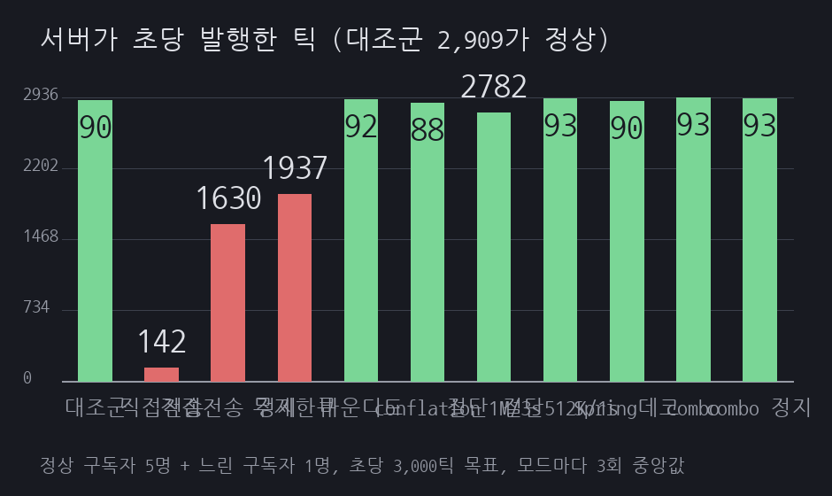
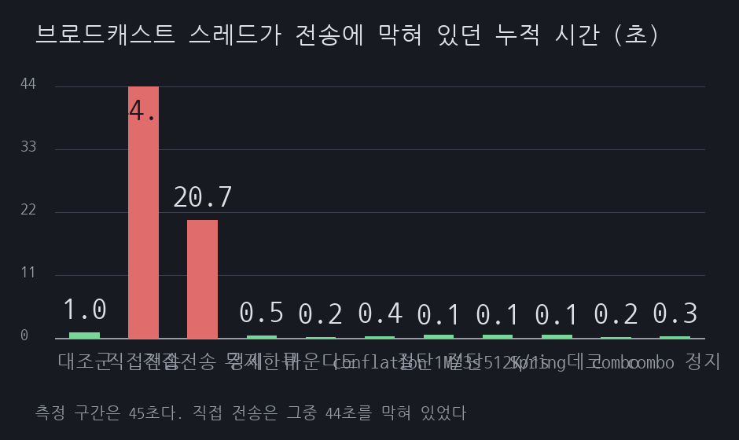
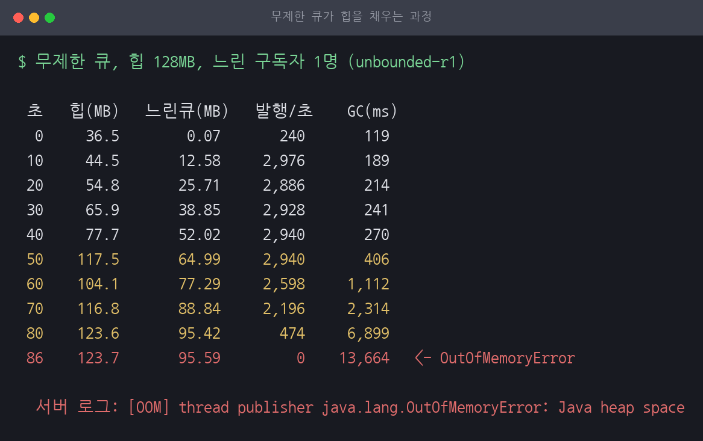
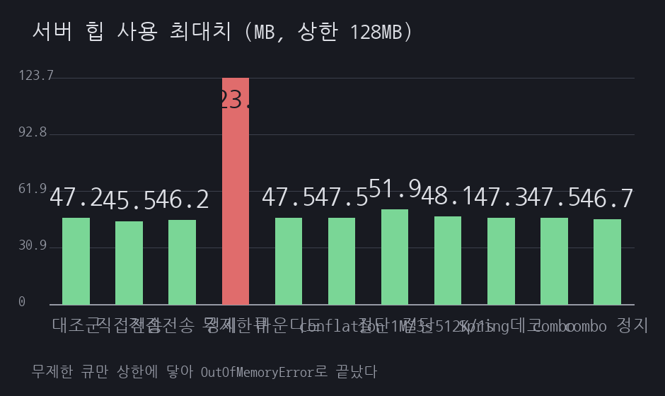

# F15 느린 구독자 하나가 시세를 멈춘다

> 근거 등급: `E2`
> 출처: [Spring Framework Reference, WebSocket/STOMP Performance](https://docs.spring.io/spring-framework/reference/web/websocket/stomp/configuration-performance.html), [Spring Javadoc, ConcurrentWebSocketSessionDecorator](https://docs.spring.io/spring-framework/docs/current/javadoc-api/org/springframework/web/socket/handler/ConcurrentWebSocketSessionDecorator.html)

## 1. 유명한 이유

시세를 WebSocket으로 뿌리는 서버는 구독자마다 속도가 다릅니다. 회선이 느린 사람, 브라우저 탭이 백그라운드로 내려간 사람, 디버거에 걸려 멈춘 사람이 섞입니다. 서버가 만드는 속도는 일정한데 받아 가는 속도가 제각각이면 그 차이는 어딘가에 쌓입니다.

Spring 문서가 이 상황을 직접 서술합니다.

> If they are slow or on low bandwidth, they take longer to consume messages and put a burden on the thread pool.

> at any given time, only a single thread can be used to send to a client. All additional messages, meanwhile, get buffered

대응책도 문서에 있습니다. `ConcurrentWebSocketSessionDecorator`의 Javadoc은 버퍼 한도와 전송 시간 한도를 넘기면 "the session will be closed if the limits are exceeded"라고 적고, 오버플로 전략의 기본값을 "by default the session is terminated"로 적습니다. 느린 소비자를 끊는 것이 프레임워크의 기본 동작입니다.

여기서 흔히 붙는 말이 "백프레셔가 없으면 WebSocket 서버가 OOM으로 죽는다"입니다. 그 문장을 뒷받침하는 벤더 문서는 찾지 못했습니다. 그래서 이 세션은 OOM을 인용하지 않고 직접 만들어 보기로 했습니다. 한도를 걸지 않으면 어디까지 가는지, 그리고 그 앞에 무엇이 먼저 무너지는지를 잽니다.

정상 구독자 5명과 느린 구독자 1명을 같은 서버에 붙이고, 팬아웃 구현을 열한 가지로 바꿔 가며 각각 3회씩 쟀습니다.

## 2. 재현

### 환경

| 항목 | 값 |
|---|---|
| 호스트 | Rocky Linux, 커널 5.14.0-570.33.2.el9_6.aarch64, 2코어, 11GB |
| 서버 | Spring Boot 3.3.5, 내장 Tomcat 10.1.31, Java 21, 힙 128MB 고정 |
| 시세 | 종목 20개, 초당 3,000틱, 틱 하나 약 480바이트 |
| 구독자 | 정상 5명 + 느린 1명 (초당 32KB만 읽음), 별도 컨테이너 |
| 측정 | 조건마다 45초(무제한 큐만 110초), 3회 반복, 회차마다 앱 재기동 |

느린 구독자는 초당 32KB만 읽습니다. 서버가 만드는 양은 초당 약 1.4MB이므로 40배 넘게 뒤집니다. 완전히 멈춘 구독자를 쓰는 조건도 따로 두었습니다.

회차마다 앱을 새로 띄웁니다. 힙이 초기화되어야 조건 간 비교가 됩니다.

### 결과

모드마다 3회씩 재고 중앙값을 적었습니다.

| 조건 | 발행/초 | 힙 최대 | 느린 구독자 몫 | 생산자 정지 | GC | 정상 p95 | OOM | 느린 구독자 |
|---|---|---|---|---|---|---|---|---|
| 대조군 (느린 구독자 없음) | 2,909 | 47.2MB | 0.00MB | 1.0초 | 0.3초 | 1ms | 0 | 없음 |
| 직접 전송 | 142 | 45.5MB | 0.00MB | 44.0초 | 0.1초 | 9ms | 0 | 끊지 않음 |
| 직접 전송 (완전 정지 구독자) | 1,630 | 46.2MB | 0.00MB | 20.7초 | 0.2초 | 2ms | 0 | 끊지 않음 |
| 무제한 큐 | 1,937 | 123.7MB | 95.58MB | 0.5초 | 17.0초 | 1ms | 1 | 끊지 않음 |
| 바운디드 큐 1,000건 | 2,925 | 47.5MB | 0.46MB | 0.2초 | 0.3초 | 1ms | 0 | 끊지 않음 |
| conflation | 2,881 | 47.5MB | 0.01MB | 0.4초 | 0.2초 | 1ms | 0 | 끊지 않음 |
| 절단 1MB/3초 | 2,782 | 51.9MB | 3.88MB | 0.1초 | 0.4초 | 175ms | 0 | 7.3초에 절단 |
| 절단 512KB/1초 | 2,932 | 48.1MB | 1.11MB | 0.1초 | 0.2초 | 1ms | 0 | 4.3초에 절단 |
| Spring 데코레이터 512KB | 2,902 | 47.3MB | 0.51MB | 0.1초 | 0.2초 | 2ms | 0 | 4.3초에 절단 |
| conflation + 절단 | 2,936 | 47.5MB | 0.01MB | 0.2초 | 0.2초 | 1ms | 0 | 끊지 않음 |
| conflation + 절단 (완전 정지) | 2,931 | 46.7MB | 0.01MB | 0.3초 | 0.2초 | 1ms | 0 | 끊지 않음 |

"생산자 정지"는 시세를 만드는 스레드가 전송에 막혀 있던 누적 시간입니다. 측정 구간이 45초이므로 44.0초는 그 스레드가 거의 내내 멈춰 있었다는 뜻입니다.




### 직접 전송: 한 명 때문에 전부 굶는다

제일 단순한 구현은 브로드캐스트 스레드가 구독자를 돌면서 바로 `sendMessage`를 부르는 것입니다. 이 조건에서 발행량이 초당 2,909건에서 142건으로 떨어졌습니다. 대조군의 5%입니다.

느린 구독자만 손해를 본 것이 아닙니다. 정상 구독자 5명이 45초 동안 받은 마지막 시퀀스가 3,265번이었습니다. 대조군에서는 129,138번이었습니다. 정상 구독자도 40분의 1만 받았습니다.

원인은 생산자 정지 44.0초입니다. 느린 구독자의 TCP 창이 차면 `sendMessage`가 그 자리에서 블록되고, 그 스레드가 나머지 구독자에게 갈 차례를 못 옵니다. 한 명이 늦으면 전원이 같이 늦습니다.

완전히 멈춘 구독자를 붙인 조건은 조금 다릅니다. 발행량이 1,630건으로 직접 전송보다 오히려 높고, 대신 최대 지연이 20,066ms로 찍혔습니다. 3회 모두 20,028ms에서 20,101ms 사이입니다. 20초에서 딱 끊기는 이 값은 내장 Tomcat이 블로킹 송신을 포기하는 지점으로 보입니다. 값이 어디서 오는지는 실측으로만 확인했고 문서에서 기본값을 찾아보지는 않았습니다. 어쨌든 결과는 분명합니다. 아무것도 안 읽는 구독자가 초당 32KB를 읽는 구독자보다 서버에 덜 해로웠습니다.

### 무제한 큐: OOM까지 86초

생산자가 막히지 않게 하려면 구독자마다 큐를 두고 전송 스레드를 따로 붙입니다. 생산자 정지가 0.5초로 사라졌고 발행량도 1,937건으로 회복됐습니다. 큐에 한도를 두지 않은 것이 문제입니다.



느린 구독자 몫의 큐가 10초마다 약 12MB씩 늘었습니다. 50초 지점에서 힙이 117.5MB에 닿았고, 이때부터 누적 GC 시간이 406ms, 1,112ms, 2,314ms, 6,899ms로 급하게 불어나면서 발행량이 2,940건에서 474건으로 떨어졌습니다. 86초에 끝났습니다.

```
[OOM] thread publisher java.lang.OutOfMemoryError: Java heap space
```

힙 128MB에 느린 구독자 한 명의 큐가 95.58MB를 차지했습니다. 정상 구독자 다섯 명 몫을 다 합친 것보다 훨씬 큽니다.



## 3. 내부 원리

서버가 초당 3,000틱을 만들고 구독자가 그만큼 못 받아 가면, 그 차이는 사라지지 않고 어딘가에 쌓입니다. 쌓일 곳은 셋입니다.

첫째는 커널의 소켓 송신 버퍼입니다. 크기가 정해져 있어서 금방 찹니다. 차고 나면 `write`가 블록됩니다.

둘째는 그 블록을 기다리는 스레드입니다. 브로드캐스트 스레드가 직접 보내면 그 스레드가 여기서 멈춥니다. 직접 전송 조건의 정지 44.0초가 이것입니다. 서버 자원 중 가장 비싼 것을 한 명에게 묶어 두는 셈입니다.

셋째는 애플리케이션이 만든 큐입니다. 스레드를 살리려고 큐를 두면 압력이 힙으로 옮겨 갑니다. 무제한 큐 조건에서 95.58MB가 여기 쌓였습니다.

세 곳 다 유한합니다. 어디에 쌓을지 고르는 문제이지 안 쌓는 방법은 없습니다. 그래서 설계는 "얼마나 쌓을지"와 "넘치면 무엇을 버릴지"를 정하는 일이 됩니다.

버릴 것을 고르는 기준은 데이터의 성질에서 나옵니다. 시세는 최신값만 맞으면 되는 데이터입니다. 3초 전 호가를 뒤늦게 받는 것은 받는 쪽에도 쓸모가 없습니다. 그래서 같은 종목의 새 틱이 오면 아직 못 보낸 이전 틱을 덮어쓰면 됩니다. 큐 길이의 상한이 종목 수로 묶이므로 메모리가 늘지 않습니다. conflation 조건에서 느린 구독자 몫이 0.01MB에 머문 이유입니다. 종목 20개 × 480바이트면 9.6KB이고, 실제로 그 근처입니다.

이 방식은 벤더 문서가 권하는 것이 아니라 이 세션에서 만든 설계입니다. Spring이 제공하는 것은 다음 문단의 절단입니다.

절단은 다른 각도입니다. `ConcurrentWebSocketSessionDecorator`는 버퍼가 한도를 넘거나 전송이 시간 한도를 넘으면 세션을 닫습니다. 데이터를 고르지 않고 구독자를 버립니다. 이 실험에서 Spring 데코레이터 조건은 4.3초에 느린 구독자를 끊었고, 그 뒤 나머지는 정상으로 돌아갔습니다.

## 4. 해소

세 가지를 조합했습니다.

**구독자마다 큐를 두고 전송 스레드를 분리합니다.** 생산자가 특정 구독자의 속도에 묶이지 않게 하는 것이 먼저입니다. 이것만으로 생산자 정지 44.0초가 0.2초가 됩니다.

**큐를 종목별 최신값으로 접습니다.** 같은 종목의 새 틱이 오면 못 보낸 이전 틱을 덮어씁니다. 큐 상한이 종목 수로 묶이므로 힙이 늘지 않습니다. 느린 구독자는 틱을 건너뛴 채 최신값을 받습니다.

**그래도 못 따라오면 끊습니다.** 접어도 못 받는 구독자는 회선이나 클라이언트에 문제가 있는 것이므로 세션을 닫고 재접속하게 합니다. 한도와 판정 시간을 설정으로 둡니다.

셋을 합친 것이 `combo` 조건입니다. 발행량 2,936건으로 대조군보다 높고, 느린 구독자 몫은 0.01MB이며, 느린 구독자를 끊지도 않았습니다. 접는 것만으로 따라올 수 있게 됐기 때문입니다.

아무것도 안 읽는 구독자를 붙인 `combo-stalled` 조건도 같습니다. 발행량 2,931건, 힙 46.7MB, 정상 구독자 p95 1ms입니다.

## 5. 재계측

같은 부하에서 구현만 바꾼 결과입니다.

| 항목 | 직접 전송 | 무제한 큐 | conflation + 절단 |
|---|---|---|---|
| 초당 발행 | 142건 | 1,937건 | 2,936건 |
| 대조군 대비 | 5% | 67% | 101% |
| 생산자 정지 | 44.0초 | 0.5초 | 0.2초 |
| 힙 최대 | 45.5MB | 123.7MB | 47.5MB |
| 느린 구독자 몫 | 0.00MB | 95.58MB | 0.01MB |
| GC 누적 | 0.1초 | 17.0초 | 0.2초 |
| 정상 구독자 p95 | 9ms | 1ms | 1ms |
| 45초 뒤 마지막 시퀀스 | 3,265 | 해당 없음 | 130,758 |
| OOM | 없음 | 발생 (86초) | 없음 |

무제한 큐는 45초 안에 끝나지 않아 110초로 재서 마지막 시퀀스 칸이 비교 대상이 아닙니다. 다른 칸은 세 조건 모두 같은 부하에서 나온 값입니다.

절단 설정도 비교했습니다. 한도 1MB에 3초 연속 초과를 조건으로 두면 정상 구독자 p95가 175ms까지 올라갔고 회차 편차가 컸습니다. 3회 중 한 회차는 정상 구독자 p95가 1,209ms, 최악 구독자 p95가 2,146ms였습니다. 판정을 기다리는 3초 동안 피해가 쌓입니다. 한도를 512KB로 낮추고 1초로 판정하면 4.3초에 끊고 정상 구독자 p95는 1ms로 돌아옵니다.

Spring 데코레이터에 같은 512KB를 주면 4.3초에 끊고 p95 2ms입니다. 직접 만든 절단과 사실상 같습니다. 절단만 필요하다면 직접 만들 이유가 없습니다.

## 6. 예상과 달랐던 점

**OOM보다 먼저, 더 조용히 무너지는 것이 있었습니다.** 이 세션은 "백프레셔가 없으면 OOM"이라는 통념을 확인하려고 시작했습니다. OOM은 실제로 났습니다. 다만 그 앞에 더 흔한 실패가 있었습니다. 큐를 아예 안 만든 가장 단순한 구현에서는 힙이 45.5MB로 멀쩡한 채 발행량만 초당 142건으로 주저앉았습니다. 메모리 그래프는 정상이고 GC도 조용한데 서비스는 죽어 있습니다. OOM은 힙 덤프와 스택트레이스를 남기지만 이쪽은 아무 흔적이 없습니다.

**정상 구독자가 같이 죽습니다.** 느린 구독자 하나의 문제라고 생각했는데, 직접 전송 조건에서 정상 구독자 5명이 받은 마지막 시퀀스가 3,265번이었습니다. 대조군은 129,138번입니다. 느린 사람 한 명이 나머지 전원의 데이터를 40분의 1로 줄였습니다.

**아무것도 안 읽는 구독자가 덜 해로웠습니다.** 초당 32KB만 읽는 구독자를 붙였을 때 발행량이 142건이었는데, 한 바이트도 안 읽는 구독자를 붙이니 1,630건이었습니다. 열 배 넘게 낫습니다. 조금씩 읽는 구독자는 TCP 창을 계속 조금씩 열어 주기 때문에 서버가 계속 "이번엔 보낼 수 있겠지" 하며 매달립니다. 완전히 막힌 구독자는 Tomcat의 20초 제한시간에 걸려 포기당하고, 그 20초 동안 다른 구독자는 처리됩니다. 애매하게 아픈 쪽이 확실히 죽은 쪽보다 나쁩니다.

**절단 임계값이 성능 문제를 만들었습니다.** 느린 구독자를 끊으면 해결된다고 생각했는데, 한도 1MB에 3초 판정으로 두니 정상 구독자 p95가 175ms(회차에 따라 1,209ms)까지 올랐습니다. 끊기로 결정하기까지의 시간 동안 그 구독자는 여전히 서버 자원을 씁니다. 512KB에 1초로 조이니 사라졌습니다. 방어를 넣었느냐보다 얼마나 빨리 판정하느냐가 수치를 갈랐습니다.

## 안 한 것

- **STOMP와 메시지 브로커 경로는 다루지 않았습니다.** 원시 WebSocket 핸들러만 씁니다. Spring 문서가 말하는 `sendTimeLimit`, `sendBufferSizeLimit`은 STOMP 설정에도 있지만 여기서는 데코레이터를 직접 감쌌습니다.
- **Netty 기반 서버는 재현하지 않았습니다.** 내장 Tomcat만 썼습니다. `WriteBufferWaterMark` 같은 Netty의 백프레셔 장치는 동작이 다를 수 있고, 그 기본값은 공식 문서에서 확인하지 못했습니다.
- **conflation은 자체 설계입니다.** 벤더 문서가 권하는 방식이라는 근거를 찾지 못했습니다. 시세처럼 최신값만 의미 있는 데이터에서만 성립하고, 체결 통보나 주문 응답처럼 한 건도 빠지면 안 되는 데이터에는 쓸 수 없습니다.
- **구독자 수를 늘려 보지 않았습니다.** 정상 5명 + 느린 1명 한 가지 구성입니다. 느린 구독자 비율이 올라가면 결과가 달라질 수 있습니다.
- **재접속 폭풍은 다루지 않았습니다.** 절단하면 클라이언트가 다시 붙습니다. 끊긴 구독자가 즉시 재접속을 반복하는 상황은 이 세션 밖입니다.
- **힙 128MB는 실제 운영 크기가 아닙니다.** OOM까지 걸리는 시간을 짧게 만들려고 작게 잡았습니다. 힙이 크면 OOM까지 오래 걸릴 뿐 곡선의 모양은 같습니다.

## 파일

| 경로 | 내용 |
|---|---|
| [compose.yml](compose.yml) | 시세 서버 한 대 |
| [app/src/main/java/lab/Subscribers.java](app/src/main/java/lab/Subscribers.java) | 팬아웃 구현 일곱 가지 |
| [app/src/main/java/lab/Conf.java](app/src/main/java/lab/Conf.java) | 실행 조건 |
| [scripts/client/Client.java](scripts/client/Client.java) | 정상·느린 구독자와 지연 측정 |
| [scripts/run-suite.sh](scripts/run-suite.sh) | 모드별 3회 반복 실행 |
| [scripts/summarize.sh](scripts/summarize.sh) | 회차 원문에서 `results/summary.csv` 생성 |
| [scripts/report.py](scripts/report.py) | 중앙값 표와 `results/render.json` 생성 |
| [reproduce.md](reproduce.md) | 실행 명령과 출력 원문 |
