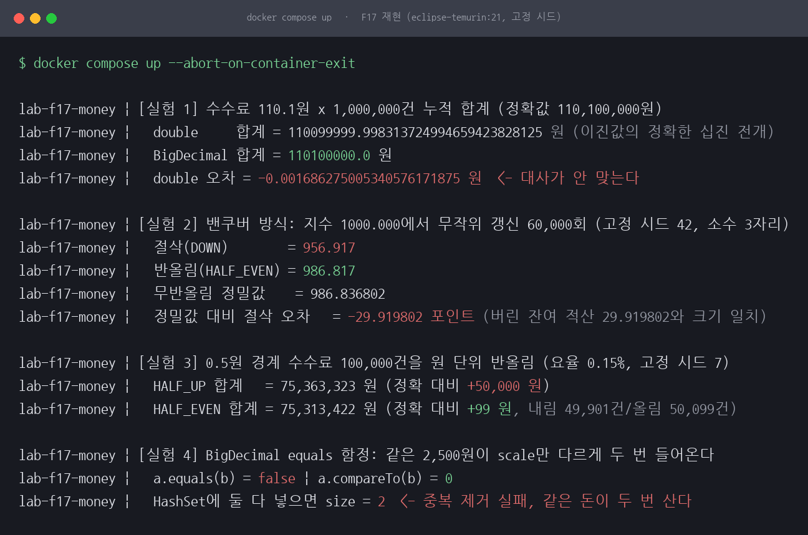
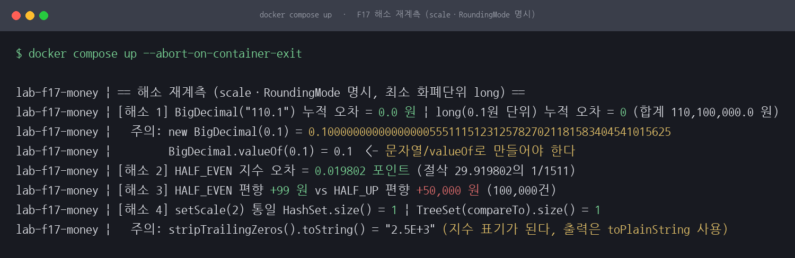
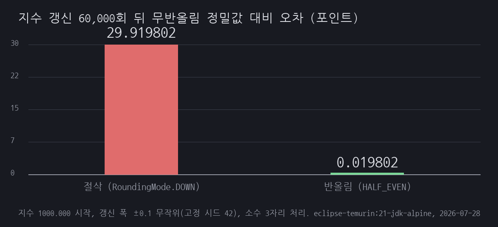

# F17 소수 넷째 자리부터 잘라내면 지수는 한 방향으로만 깎인다

## 1. 유명한 이유

1982년 1월 밴쿠버 증권거래소(VSE)는 자사 지수를 1000.000으로 출범시켰습니다. 지수는 체결이 있을 때마다 다시 계산됐는데, 이때 소수 넷째 자리부터를 반올림 없이 잘라 버렸습니다. 한 번에 버려지는 값은 0.001포인트 미만이지만 갱신이 하루 수천 회였고, 손실이 월 25포인트 안팎으로 쌓이면서 1983년 11월 지수는 520대까지 내려가 있었습니다. 거래소가 주말 동안 지수를 다시 계산해 1098.892로 정정하면서 원인이 절삭 한 줄이었다는 사실이 드러났습니다.

근거 등급은 E1·축소입니다. 사건 자체는 실재하지만 아래 서지사항은 전부 재인용이고, 재현도 산식과 데이터 없이 메커니즘만 옮긴 축소 재현입니다.

- Kevin Quinn, "Ever Had Problems Rounding Off Figures? This Stock Exchange Has", The Wall Street Journal, 1983-11-08, p.37
- Wayne Lilley, "Vancouver stock index has right number at last", The Toronto Star, 1983-11-29, p.35
- 정리 자료: [영문 위키피디아 Vancouver Stock Exchange 항목](https://en.wikipedia.org/wiki/Vancouver_Stock_Exchange), [TUM Huckle 교수의 출처 모음](https://www5.in.tum.de/~huckle/Vancouv.pdf)

1차 보도의 지면 원문은 직접 확인하지 못했습니다. 위 신문 기사 둘은 읽고 인용한 것이 아니라 두 정리 자료가 인용해 둔 서지사항을 그대로 옮긴 재인용입니다. 수치도 출처에 따라 다릅니다. 정정 직전 지수를 524.811로 적은 자료(위키피디아가 인용한 Toronto Star)와 520.638로 적은 자료(TUM 모음)가 있고, 하루 갱신 횟수도 약 2,700회에서 3,000회까지 자료마다 다릅니다. 그래서 본문에는 "520대"로 씁니다.

실제 VSE의 시가총액 가중 산식과 22개월치 시장 데이터는 재현할 수 없어, 절삭이 한 방향으로 누적되는 메커니즘만 자바로 축소 재현했습니다. 여기에 같은 뿌리에서 나오는 금융 도메인 함정 셋(double 누적 오차, 반올림 모드 편향, BigDecimal equals의 scale 함정)을 같은 컨테이너에서 함께 계측했습니다.

## 2. 재현

실험 네 개를 자바 한 파일([app/MoneyLab.java](app/MoneyLab.java))로 만들었습니다. 환경은 Docker 위 eclipse-temurin:21-jdk-alpine, JDK 21입니다. 무작위가 필요한 실험은 시드를 고정(실험 2는 42, 실험 3은 7)해서 `docker compose up` 한 번으로 누구나 같은 수치를 얻습니다.

실험 1은 수수료 110.1원을 100만 건 누적합니다. 0.1원 단위 금액은 이진법으로 유한하게 표현되지 않아 double에 넣는 순간부터 어긋납니다. double 합계는 110,099,999.998313724994659423828125원으로, 정확값 110,100,000원에서 약 0.0017원 모자랐습니다. 잔액 대사처럼 마지막 자리까지 맞춰야 하는 곳이라면 이미 어긋난 장부입니다. BigDecimal("110.1") 누적은 정확값과 일치했습니다.

실험 2는 밴쿠버 방식입니다. 지수 1000.000에서 시작해 ±0.1 이내 무작위 갱신을 60,000회(하루 3,000회 기준 20영업일 분량) 반복하면서, 한쪽은 소수 셋째 자리 아래를 절삭(RoundingMode.DOWN)하고 한쪽은 은행가 반올림(HALF_EVEN)으로 처리했습니다. 같은 갱신 폭을 받고도 절삭 지수는 956.917, 반올림 지수는 986.817로 벌어졌습니다. 반올림 없이 끝까지 계산한 정밀값 986.836802 기준으로 절삭이 29.919802포인트를 잃었습니다. 갱신 1회당 평균 0.0005포인트씩입니다. 이 손실은 지수 수준이 아니라 갱신 횟수에 비례해 쌓이므로 "지수의 몇 퍼센트"라는 비율로 쓸 성질의 값이 아닙니다. 횟수를 두 배로 늘리면 잃는 포인트도 대략 두 배가 됩니다.

실험 3에서는 반올림 모드가 만드는 편향을 쟀습니다. 주문금액을 1,000원 곱하기 홀수로 만들어 요율 0.15%의 수수료가 전부 x.5원 경계에 걸리게 한 뒤(경계 사례만 몰아넣은 의도적 조건입니다) 10만 건을 원 단위로 반올림했습니다. HALF_UP 합계는 정확 합계 75,313,323원보다 50,000원 많았고, HALF_EVEN은 99원 많은 데서 멈췄습니다. 두 수치의 성격은 다릅니다. HALF_UP의 +50,000원은 경계 사례 10만 건이라는 조건이 그대로 정하는 값이지만, HALF_EVEN의 +99원은 시드 7이 뽑은 표본 하나에 남은 잔여입니다. 다른 시드로는 재보지 않았으므로 이 99원을 HALF_EVEN의 상수처럼 읽으면 안 됩니다.

실험 4는 equals 함정입니다. 같은 2,500원이 "2500.0"과 "2500.00"으로 들어오면 equals는 false, compareTo는 0입니다. HashSet에 넣으면 둘 다 들어가 size가 2가 됩니다. 환불 요청 중복 제거를 HashSet으로 했다면 같은 돈이 두 번 나가는 구조입니다.



*그림 1. 재현 실행 화면입니다. double 누적은 0.0017원 모자라고, 절삭 지수는 30포인트 가까이 낮고, HALF_UP은 5만 원을 더 걷고, HashSet 중복 제거는 실패합니다.*

명령과 출력 원문은 [reproduce.md](reproduce.md)에 그대로 남겼습니다.

## 3. 내부 원리

이진 부동소수점에서 0.1은 무한히 반복되는 이진 소수라 가장 가까운 표현 가능한 값으로 저장됩니다. 자바에서 0.1 + 0.2를 찍으면 0.30000000000000004가 나오는 것과 같은 뿌리입니다. 110.1의 double 값은 110.09999999999999431…로 참값보다 약 0.0000000000000057원 작습니다. 그런데 실측한 100만 건 누적 오차 0.001686원을 분해하면 이 표현 오차 몫은 0.0000000057원으로 전체의 0.0003%이고, 99.9997%는 덧셈에서 나왔습니다. 부분합이 1억 원 규모가 되면 double의 눈금(ulp)이 약 0.000000015원이라, 110.1을 더한 결과를 매번 그 눈금 위의 값으로 옮겨야 하기 때문입니다. 여기서 IEEE 754가 쓰는 기본 규칙은 절삭이 아니라 최근접 반올림이고, 정확히 중간이면 짝수 쪽을 고릅니다. 하위 자리가 한쪽으로 잘려 나가는 것이 아니라 위아래 중 가까운 눈금으로 붙는 셈입니다. 그런데도 100만 번을 더하는 사이 음의 방향으로 0.001686원이 남았습니다. 덧셈 한 번마다의 반올림 방향 분포는 재지 않았으므로, 여기서 확인한 것은 순 오차의 크기와 부호까지입니다.

절삭은 방향이 한쪽입니다. 소수 셋째 자리 아래 잔여는 이 실험 조건(잔여가 0에서 0.001 사이 균등)에서 평균 0.0005포인트씩 버려지므로 60,000회면 기대 손실이 30포인트입니다. 실측 29.919802포인트가 기대값에 붙어 있고, 매 갱신에서 버린 잔여를 적산한 값과 자리까지 일치합니다. 반올림은 위아래로 흩어져 상쇄되기 때문에 같은 60,000회에서 0.019802포인트 차이만 남았습니다. 밴쿠버 지수가 시장과 무관하게 내려간 이유가 이 한쪽 방향 편향입니다.

HALF_UP은 정확히 .5인 값을 항상 위로 보냅니다. 경계 수수료 10만 건이면 건마다 +0.5원씩 정확히 +50,000원이고, 이 값은 시드와 무관하게 결정됩니다. HALF_EVEN은 .5를 짝수 쪽으로 보내 올림과 내림이 상쇄됩니다. 실측에서는 내림 49,901건, 올림 50,099건으로 198건 차이가 남아 +99원이 됐습니다. IEEE 754의 기본 반올림 모드가 이 방식(짝수로 반올림)인 이유이기도 합니다.

equals가 둘을 다르다고 하는 이유는 BigDecimal이 unscaledValue와 scale의 쌍이기 때문입니다. "2500.0"은 (25000, 1), "2500.00"은 (250000, 2)입니다. hashCode에도 scale이 들어가기 때문에 실측값이 775001과 7750002로 갈라지고, hashCode와 equals로 동작하는 HashSet은 둘을 다른 원소로 저장합니다. compareTo는 수치만 비교해 0을 돌려줍니다.

여기서 흔히 인용되는 `31 x unscaledValue.hashCode() + scale`은 조심해서 봐야 합니다. JDK의 BigDecimal은 unscaled 값이 long에 담기는 compact 경로와 BigInteger를 쓰는 INFLATED 경로로 나뉘어 있고, 저 식은 INFLATED 경로의 것입니다. 이 실험의 25000과 250000은 compact 경로를 타는데 값이 작아 결과가 우연히 저 식과 맞아떨어졌을 뿐입니다. 그러니 해시값을 손으로 계산해 쓰는 코드를 짜면 안 되고, 남길 사실은 식이 아니라 scale이 해시에 들어간다는 것 하나입니다.

## 4. 해소

돈은 십진 자료형으로 계산합니다. BigDecimal을 문자열 생성자나 valueOf로 만들고, 자리를 줄이는 연산마다 scale과 RoundingMode를 명시합니다. 나눗셈은 divide(x, scale, mode)처럼 반올림 규칙을 강제하는 오버로드를 씁니다. 생성 단계에 함정이 하나 있는데, new BigDecimal(0.1)은 double의 오염을 그대로 물려받아 0.1000000000000000055511151231257827021181583404541015625가 됩니다. BigDecimal로 바꿨더라도 생성자에 double 리터럴을 넘기면 원점입니다.

반올림 모드는 도메인 규칙을 따릅니다. 규정이 특정 모드를 지정하는 곳이라면 그 모드를 쓰되 편향의 크기를 알고 쓰고, 선택권이 있는 대량 정산이나 통계 누적은 HALF_EVEN이 편향을 없앱니다.

대안은 최소 화폐단위 long입니다. 0.1원을 1로 두면 덧셈이 정수 연산이라 오차가 생길 자리가 없고, Math.addExact로 오버플로를 예외로 드러냈습니다. 다만 요율 곱셈이나 환율처럼 나눗셈이 들어오는 순간 반올림 규칙이 다시 필요해지므로, 이 세션에서는 누적 합계 용도로만 검증했습니다.

중복 제거는 값 비교로 동작하게 만듭니다. 저장 전에 setScale(2, RoundingMode.UNNECESSARY)로 scale을 통일하거나(UNNECESSARY는 잘리는 자리가 생기면 예외를 던져 조용한 반올림을 막습니다), compareTo로 판단하는 TreeSet을 씁니다. stripTrailingZeros로 정규화하는 방법도 있지만 toString 표기가 "2.5E+3" 지수형으로 바뀌는 부작용을 실측에서 만났습니다. 로그나 응답에 실을 값이라면 toPlainString까지 세트로 써야 합니다.

## 5. 재계측

같은 조건, 같은 시드로 해소 방식의 오차를 다시 쟀습니다.

```
[해소 1] BigDecimal("110.1") 누적 오차 = 0.0 원 | long(0.1원 단위) 누적 오차 = 0 (합계 110,100,000.0 원)
[해소 2] HALF_EVEN 지수 오차 = 0.019802 포인트 (절삭 29.919802의 1/1511)
[해소 3] HALF_EVEN 편향 +99 원 vs HALF_UP 편향 +50,000 원 (100,000건)
[해소 4] setScale(2) 통일 HashSet.size() = 1 | TreeSet(compareTo).size() = 1
```



*그림 2. 해소 재계측 실행 화면입니다. 100만 건 누적 오차가 0이 되고, 중복 제거가 size 1로 돌아옵니다. 노랗게 칠한 부분은 해소 과정에서 만난 함정 두 가지(new BigDecimal(0.1), stripTrailingZeros의 지수 표기)입니다.*

100만 건 누적은 BigDecimal과 최소 화폐단위 long 모두 오차 0이 됐습니다. 지수 갱신은 HALF_EVEN으로 바꾸면 같은 60,000회에서 오차가 29.919802포인트에서 0.019802포인트로, 1,511분의 1로 줄었습니다. 완전한 0이 되지는 않는데 이유는 6절에 적었습니다. 0.5원 경계 수수료의 편향도 +50,000원에서 시드 7 표본의 +99원으로 줄었고, HashSet 중복 제거는 scale 통일과 TreeSet 두 방식 모두 size 1로 동작했습니다. 남은 99원은 시드가 정한 값이라 HALF_EVEN이 늘 이만큼 남긴다는 뜻은 아닙니다.



*그림 3. 같은 갱신 60,000회에서 처리 방식만 바꾼 전후 오차입니다. 절삭 29.919802포인트, HALF_EVEN 0.019802포인트입니다.*

## 6. 예상과 달랐던 점

네 가지가 처음 생각과 달랐습니다.

첫째, 실험 1의 오차에서 "0.1을 이진법으로 표현하지 못해서"가 차지하는 몫은 0.0003%뿐이었습니다. 110.1의 표현 오차에 100만을 곱하면 0.0000000057원인데 실측 오차는 그 30만 배쯤인 0.001686원이고, 나머지 전부가 부분합이 커진 뒤의 덧셈 반올림에서 나왔습니다. 표현 오차만 생각하면 누적 오차를 수십만 배 과소평가하게 된다는 것을 분해 측정으로 확인했습니다.

둘째, 오차를 보고하는 출력 코드가 오차를 냈습니다. 처음에 double 합계를 %.9f로 찍었더니 …998313720으로 나왔는데, 이진값의 정확한 전개는 …998313724994…라 끝자리가 맞지 않았습니다. 자바 Formatter가 Double.toString의 17유효자리 최단 표현에 0을 채워 넣기 때문입니다. 합계 출력을 new BigDecimal(dSum)의 전개로 바꾸고 나서야 오차 라인과 자리가 맞아떨어졌습니다.

셋째, HALF_EVEN도 0을 만들지는 못했습니다. 실험 3에서 +99원이 남았는데, 시드 7의 짝홀 분포가 내림 49,901건 대 올림 50,099건으로 198건 어긋난 만큼이 그대로 남은 값입니다(198 x 0.5원). 다른 시드에서는 이 어긋남이 얼마나 남는지 재보지 않았으므로 +99원은 표본 하나의 잔여로만 읽어야 합니다. 실험 2에서도 0.019802포인트가 남았습니다. 은행가 반올림이 없애는 것은 방향성 편향이고 개별 반올림의 잔여 흔들림은 남습니다. 그래도 절삭 29.9포인트, HALF_UP +50,000원과는 자릿수가 다릅니다.

넷째, stripTrailingZeros가 "2500.0"을 "2.5E+3"으로 만들었습니다. 정규화가 scale을 음수(-2)까지 끌어내려 toString이 지수 표기로 바뀝니다. equals 문제를 고치려던 코드가 화면 표기를 깨는 쪽으로 새는 경험이라, 해소 절에 toPlainString을 함께 적어 두었습니다.

## 7. 시드를 서른 개로 늘려서 다시 (2026-07-31)

`app/SeedSweep.java`, 결과는 `results/seed-sweep.txt` 입니다.
"못 한 것"의 두 항목(걸음별 반올림 방향 분포, +99원이 시드 하나)을 잡습니다.

### 걸음마다 어느 쪽으로 갔는가 (시드 42, 60,000회)

| 방식 | 내림 | 올림 | 그대로 | 순 오차 |
|---|---|---|---|---|
| 절삭(DOWN) | 59,937 | **0** | 63 | -29.919802 포인트 |
| HALF_EVEN | 30,037 | 29,900 | 63 | -0.019802 포인트 |

절삭은 올림이 0건입니다. 값이 양수인 한 항상 0 쪽으로 깎으므로 한 방향으로만
움직이고 오차가 상쇄 없이 쌓입니다. HALF_EVEN은 내림과 올림이 137건 차이로
거의 반반입니다. 최종 오차가 작은 이유는 걸음마다 작아서가 아니라 방향이 갈려
상쇄되기 때문입니다.

### 시드 서른 개

| 항목 | 최소 | 중앙 | 최대 | 평균 | 음수 |
|---|---|---|---|---|---|
| 지수 절삭 오차(포인트) | -30.086 | -29.955 | -29.805 | -29.962 | **30/30** |
| 지수 HALF_EVEN 오차(포인트) | -0.171 | +0.005 | +0.111 | -0.015 | 15/30 |
| 수수료 HALF_UP 편향(원) | +50,000 | +50,000 | +50,000 | +50,000 | 0/30 |
| 수수료 HALF_EVEN 편향(원) | -106 | -11 | **+99** | -9.03 | 17/30 |

- **절삭 오차는 서른 개가 전부 음수**이고 폭도 좁습니다. 구조적 편향이라 시드가
  정하는 것은 소수점 아래 흔들림뿐입니다.
- **HALF_UP 편향은 서른 개가 전부 정확히 +50,000원**입니다. 수수료 10만 건이 전부
  x.5원 경계라 예외 없이 위로 가고, 건당 +0.5원 곱하기 10만 건이 그대로 값입니다.
  5절이 "시드와 무관하게 결정된다"고 적은 것이 확인됐습니다.
- **HALF_EVEN 편향은 부호가 갈립니다.** 서른 개 중 열일곱이 음수이고 -106원에서
  +99원 사이에 흩어집니다. **5절과 6절이 인용한 +99원은 이 서른 개 중 최대값**이고
  중앙값은 -11원입니다. 전형적인 잔여가 아니라 흔들림의 위쪽 끝이었습니다.

결론은 그대로입니다. HALF_EVEN의 잔여는 최악을 잡아도 100원대이고 HALF_UP의
편향은 시드와 무관한 50,000원입니다. 자릿수가 셋 차이 납니다.

## 곱셈과 나눗셈의 반올림 (2026-07-31)

실험 2는 덧셈만 다뤘습니다. 곱셈과 나눗셈에서 같은 편향이 나오는지는 재지 않았습니다. 같은 6만 걸음, 시드 30개로 나란히 놓았습니다.

### 곱셈이 덧셈보다 더 벌어질 것이라는 예상이 틀렸습니다

| 반올림 | 곱셈 오차 중앙 | 덧셈 오차 중앙 |
|---|---|---|
| `DOWN` | 29.984 | 29.960 |
| `HALF_UP` | -0.019 | -0.022 |
| `HALF_EVEN` | **-0.019** | **0.010** |

곱셈은 이번 걸음에서 잘린 오차가 다음 걸음에 다시 곱해지므로 복리로 벌어질 것으로 봤습니다. **실측은 29.984 대 29.960으로 사실상 같습니다.** 걸음당 절삭 오차가 잔고 1,000 대비 1e-6 수준이라 복리 항이 2차이고, 6만 걸음으로는 안 드러납니다.

### 곱셈에서는 HALF_EVEN이 HALF_UP과 완전히 같습니다

위 표에서 곱셈 쪽 `HALF_UP` 과 `HALF_EVEN` 이 둘 다 -0.019입니다. 걸음별 방향도 같습니다.

| 반올림 | 곱셈의 걸음별 방향(시드 1) |
|---|---|
| `DOWN` | 내림 100.0% |
| `HALF_UP` | 내림 50.2% / 올림 49.8% |
| `HALF_EVEN` | 내림 50.2% / 올림 49.8% |

**`HALF_EVEN` 의 이점은 정확히 절반인 값이 나올 때만 생깁니다.** 곱은 소수 자릿수가 피연산자의 합이라 6자리 이상이 나오고, 그중 `x.xxx5000…` 처럼 정확히 절반인 값은 거의 안 나옵니다. 그래서 두 모드가 한 번도 안 갈립니다.

덧셈은 다릅니다. 델타의 자릿수가 6이고 잔고가 3 이라 `x.xxx5` 로 딱 떨어지는 걸음이 자주 나옵니다. 그 걸음에서만 두 모드가 갈리고, 표의 -0.022와 0.010이 그 차이입니다.

**"HALF_EVEN을 쓰면 편향이 없어진다" 는 연산의 종류에 달렸습니다.** 곱셈만 쓰는 코드에서는 `HALF_UP` 으로 바꿔도 값이 안 바뀝니다.

### 부호가 시드마다 갈리는지

| 반올림 | 양수 | 음수 |
|---|---|---|
| `DOWN` | **30** | **0** |
| `HALF_UP` | 13 | 17 |
| `HALF_EVEN` | 13 | 17 |

`DOWN` 은 시드 30개가 전부 같은 부호입니다. **구조적 편향입니다.** 나머지 둘은 13대 17로 갈립니다. 상쇄의 나머지이지 방향이 아닙니다. 덧셈에서 본 것과 같은 모양입니다.

### 나눗셈은 조용히 틀리지 않고 터집니다

곱셈과 덧셈은 잘못 쓰면 조용히 값이 어긋납니다. 나눗셈은 다릅니다.

`BigDecimal.divide(divisor)` 를 스케일 없이 부르면 나누어떨어지지 않을 때 `ArithmeticException` 을 던집니다. 무작위 조합 10만 번 중 **94,922번(94.9%)이 예외**입니다.

끝나는 경우는 나누는 수가 2와 5 로만 이루어졌을 때뿐입니다. 실무의 나눗셈은 인원수나 개월수로 나누므로 3과 7이 흔합니다. **거의 항상 터집니다.**

이건 나쁜 설계가 아닙니다. 스케일을 안 정했으면 답이 몇 자리인지 정해지지 않으므로, 라이브러리가 임의로 고르는 대신 부르는 쪽에 되묻는 것입니다.

스케일을 주면 안 터지지만 반올림이 들어갑니다. 1000에서 시작해 2~10 중 무작위 수로 나눈 뒤 같은 수로 다시 곱하기를 1,000번 했습니다. 참값은 1000.000입니다.

| 반올림 | 1,000번 뒤 |
|---|---|
| `DOWN` | 998.190 |
| `HALF_UP` | 1000.197 |
| `HALF_EVEN` | **999.999** |

**나누고 같은 수로 곱하면 제자리로 안 돌아옵니다.** `DOWN` 은 1.81을 잃고 `HALF_UP` 은 0.197을 법니다. `HALF_EVEN` 이 0.001로 가장 가깝습니다.

여기서는 `HALF_EVEN` 이 값을 합니다. 나눗셈의 결과는 `x.xxx5` 로 딱 떨어지는 경우가 흔하기 때문입니다(예를 들어 3으로 나눈 뒤 자리를 자르는 자리). 곱셈에서는 안 갈리던 두 모드가 나눗셈에서는 갈립니다.

## 한계

- **나눗셈 쪽은 시드 하나입니다.** 곱셈은 시드 30개를 돌렸는데 나눗셈의 1,000번 왕복은 시드 하나로만 쟀습니다.
실제 VSE 지수 산식(시가총액 가중 평균)과 22개월치 시장 데이터는 재현하지 않았습니다. 지수 갱신을 현재값에 무작위 증감을 더하는 모형으로 단순화했고 갱신 횟수도 60,000회로 사건(하루 수천 회 갱신으로 22개월)보다 훨씬 적어서, 이 세션의 29.9포인트를 사건의 수백 포인트 격차와 직접 비교할 수는 없습니다. 절삭이 한 방향으로 쌓인다는 메커니즘의 등가성까지만 보였습니다.

60,000회에서 멈춘 것은 시간이 없어서가 아닙니다. 이 실험은 전부 결정적 산술이고 시간 측정도 없어서 200만 회든 그 이상이든 그냥 더 돌리면 됩니다. 멈춘 이유는 모형에 바닥이 있기 때문입니다. RoundingMode.DOWN은 0 쪽으로 버리는 모드라 지수가 음수 구간에 들어가면 편향이 위로 뒤집힙니다. 갱신 1회당 0.0005포인트씩이니 200만 회면 시작값 1000포인트를 전부 잃는 계산이고, 사건 규모(하루 수천 회로 22개월이면 100만 회대)만 돼도 절반 넘게 빠져 그 경계에 다가섭니다. 그 구간에서는 손실이 계속 쌓이는 대신 지수가 0 근처에 붙들리면서 "절삭은 한 방향"이라는 이 모형의 전제 자체가 깨집니다. 그래서 편향이 선형으로 쌓이는 구간만 잘라 60,000회에서 멈췄고, 횟수를 사건 규모로 늘려도 사건에 더 가까워지지는 않습니다.

실험 3의 데이터는 수수료가 전부 0.5원 경계에 걸리도록 일부러 몰아넣은 극단 조건입니다. 실제 분포에서는 경계에 걸리는 비율만큼 편향이 희석됩니다. HALF_UP +50,000원은 경계 사례 10만 건이라는 조건에서만 성립하는 수치이고, HALF_EVEN +99원은 거기에 더해 시드 7이라는 표본 하나에만 붙는 수치입니다.

성능은 재지 않았습니다. BigDecimal이 double보다 느리고 할당 부담이 있다는 통상의 우려는 이 세션의 범위 밖이고, 2코어 공유 서버라 시간 측정이 흔들리기도 해서 뺐습니다. 이 세션의 수치는 전부 결정적 산술이라 실행 환경 부하와 무관하게 재현됩니다.

최소 화폐단위 long의 오버플로 경계(0.1원 단위 long은 약 92경 원까지)는 Math.addExact로 예외화만 하고 실제로 터뜨려 보지는 않았습니다. DB numeric(19,4)과의 왕복에서 생기는 scale 변화, 통화별 소수 자릿수(JPY 0자리, BHD 3자리 등) 처리도 다루지 않았습니다. 1차 보도(WSJ, Toronto Star)의 지면 원문을 확인하지 못하고 정리 자료의 재인용에 기댄 것도 한계로 남습니다.
