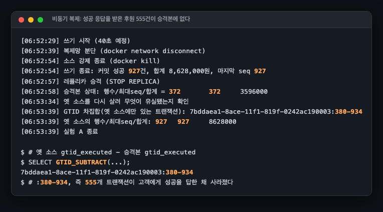
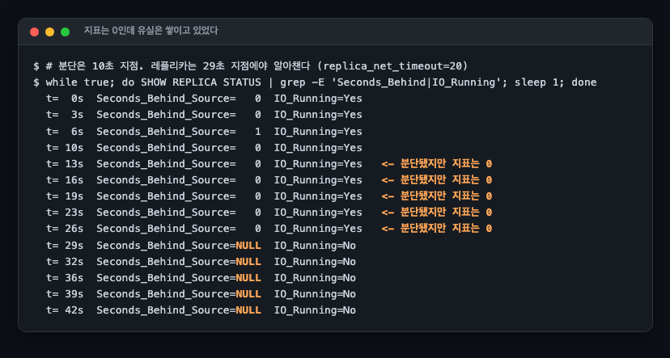

# R01 복제 지연 중 승격, 성공 응답을 받은 커밋이 사라진다

> 근거 등급: `E1·축소`
> 출처: [GitHub, October 21 post-incident analysis](https://github.blog/2018-10-30-oct21-post-incident-analysis/) · [MySQL 8.4, Semisynchronous Replication](https://dev.mysql.com/doc/refman/8.4/en/replication-semisync.html) · [AWS, Working with DB instance read replicas](https://docs.aws.amazon.com/AmazonRDS/latest/UserGuide/USER_ReadRepl.html) · [AWS, Promoting a read replica](https://docs.aws.amazon.com/AmazonRDS/latest/UserGuide/USER_ReadRepl.Promote.html)

## 1. 유명한 이유

2018년 10월 21일, GitHub의 데이터센터 간 광 링크가 장비 교체 중 43초 끊겼습니다. 그 사이 오케스트레이터가 서부 리전으로 페일오버했는데, 동부 프라이머리에는 서부로 복제되지 않은 몇 초 분량의 쓰기가 남아 있었습니다. 가장 바쁜 클러스터 기준 954건입니다. 서부가 약 40분간 새 쓰기를 받으면서 양쪽이 갈라졌고, 결국 4시간 주기 백업에서 복원해 총 24시간 11분이 걸렸습니다. 이것이 GitHub이 공개한 포스트모템의 골자입니다.

원인의 뿌리는 비동기 복제의 계약입니다. MySQL 공식 문서가 그대로 적습니다. 소스가 죽으면 "커밋된 트랜잭션이 어느 레플리카에도 전송되지 않았을 수 있고, 페일오버는 그 트랜잭션이 없는 서버로 넘어갈 수 있다"고요. 데이터센터 두 개와 광 링크는 재현할 수 없으므로, 같은 메커니즘을 컨테이너 2노드와 네트워크 분단으로 축소 재현합니다. 그래서 `E1·축소`입니다.

이 세션이 수치로 만들려는 것은 RPO입니다. "복제 지연만큼 잃을 수 있다"를 문장이 아니라 **성공 응답을 받은 후원 몇 건, 얼마**로 만듭니다.

## 2. 재현

### 환경

| 항목 | 값 |
|---|---|
| 호스트 | **기록하지 않았습니다.** `uname -srm`, `nproc`, `free -g`를 남기지 않았습니다 |
| DB | MySQL 8.4.3 컨테이너 2대(소스 13310, 레플리카 13311), GTID 복제, 컨테이너 CPU·메모리 한도 없음 |
| 소스 설정 | `innodb_flush_log_at_trx_commit=1`(커밋마다 디스크 동기화. 그런데도 사라진다는 것이 요점입니다) |
| 레플리카 설정 | `replica_net_timeout=20`(기본 60초에서 축소. 관측 편의를 위한 변경입니다) |
| 반동기(실험 B·C) | `AFTER_SYNC`, `rpl_semi_sync_source_timeout=8000` |
| 쓰기 클라이언트 | Python **1 프로세스, 커넥션 1개**, 후원을 한 건씩 직렬 커밋, 커밋 사이 `time.sleep(0.02)` |
| 분단 방법 | 복제 전용 네트워크에서 `docker network disconnect`. 관측 경로는 유지 |

호스트 사양을 남기지 않은 것은 이 저장소의 다른 세션과 절대 시간을 비교할 수 없다는 뜻입니다. 저장소에는 서로 다른 호스트가 섞여 있고 이 세션이 어느 쪽이었는지는 확인되지 않습니다. 추정해서 채우지 않았습니다.

다만 **초당 커밋 수만은 호스트와 무관하게 설명됩니다.** 쓰기 클라이언트가 커밋 사이에 20밀리초를 고정으로 쉬기 때문입니다. 이 대기만으로 상한이 초당 50건이고, 실측 커밋 간격 중앙값이 27밀리초라 나머지 약 7밀리초가 INSERT와 커밋에 쓰였습니다. 그래서 뒤에 나오는 초당 37건은 **하드웨어의 처리 능력이 아니라 클라이언트가 정한 속도**입니다. 이 세션의 어떤 수치도 성능 벤치마크로 읽으면 안 됩니다.

쓰기 클라이언트는 **커밋이 성공 반환한 건만** 로그에 남깁니다. 이 로그가 "고객이 성공 화면을 본 후원"의 목록이고, 장애 후 승격본과 대조하는 정답지입니다.

### 실험 A: 비동기 복제에서 분단 중 소스가 죽으면

타임라인: 쓰기 시작 → 10초에 복제망 분단 → 15초 더 쓰고 → 소스 `docker kill` → 레플리카 승격.



| 항목 | 값 |
|---|---|
| 고객이 성공 응답을 받은 후원 | 927건, 8,628,000원 |
| 승격된 레플리카에 있는 후원 | 372건, 3,596,000원 |
| **사라진 후원** | **555건, 5,032,000원** |

유실 집합은 GTID 차집합으로 정확히 특정됩니다. 되살린 옛 소스의 `gtid_executed`에서 승격본의 것을 빼면 `:380-934`, 즉 555개 트랜잭션입니다. 그리고 옛 소스에는 927건이 전부 남아 있습니다. 승격본이 새 쓰기를 받기 시작하는 순간 두 서버는 서로 다른 역사를 가진 분기가 되고, 이것이 GitHub이 옛 프라이머리를 다시 붙이지 못하고 백업 복원으로 간 이유와 같은 구조입니다.

### 555는 분단 15초 동안 커밋된 건수다

이 수는 나눗셈 한 번으로 설명됩니다.

클라이언트는 927건을 24.99초에 커밋했습니다. 초당 37.09건입니다. 분단은 15초였습니다. 37.09 × 15 = 556이고 실측 유실은 555입니다.

커밋 로그를 한 건씩 보면 경계가 더 분명합니다.

| 커밋 | 커밋 시각 | 승격본에 |
|---|---|---|
| seq 372 | 06:52:39.533 | 있음 |
| seq 373 | 06:52:39.560 | 없음 |

타임라인이 기록한 분단 시각은 06:52:39입니다. 살아남은 마지막 커밋과 사라진 첫 커밋의 간격은 27밀리초이고, 이 값은 이 실행의 커밋 간격 중앙값과 같습니다. **레플리카는 분단되는 순간까지 한 건도 밀리지 않고 따라와 있었고, 그 순간 이후 커밋된 것이 전부 사라졌습니다.** 분단 이전의 복제 지연은 커밋 한 건 간격보다 작아서, 이 실험의 해상도로는 존재 자체가 보이지 않습니다.

그래서 유실 창은 이렇게 씁니다.

```
유실 건수 = (레플리카가 마지막으로 받은 시점부터 소스가 죽을 때까지의 시간) × 커밋률
```

실험 A에서 그 구간은 분단부터 강제 종료까지 15.12초이고, 그 사이 555건이 초당 36.7건으로 들어왔습니다.

확정 커밋의 59.9%라는 비율도 같은 자리에서 나옵니다. 쓰기 25초 중 분단이 15초, 곧 60%를 차지했기 때문입니다. 분단을 늘리면 100%에 가까워지는 값이라 비율 자체에는 옮겨 적을 결론이 없습니다. 옮길 수 있는 형태는 이쪽입니다. **초당 37건을 쓰는 워크로드에서는 복제가 끊긴 1초마다 약 37건이 유실 후보가 됩니다.** RPO를 초로 말하는 대신 건수로 환산하는 계수가 이것입니다.

### 지표는 그동안 0이었다

분단 직후의 `Seconds_Behind_Source`입니다.



분단은 10초 지점인데 레플리카의 IO 스레드는 29초 지점에야 연결이 죽었음을 알아챕니다(`replica_net_timeout` 경과). **그 19초 동안 지표는 0입니다.** 커밋 555건이 유실 대기열에 쌓이는 동안 복제 지연 대시보드는 완벽하게 건강해 보입니다. 이 지표로 페일오버 안전 여부를 판단하면 안 되는 이유이고, 실제 격차는 GTID 집합 비교로 봐야 합니다.

## 3. 내부 원리

비동기 복제에서 커밋의 완료 조건은 "소스의 binlog와 스토리지 엔진에 기록됨"까지입니다. 레플리카 전송은 커밋 경로 밖의 비동기 작업이라, 클라이언트가 성공 응답을 받는 시점과 레플리카가 그 트랜잭션을 갖는 시점 사이에 창이 있습니다. 그 창의 크기가 곧 RPO이고, 평소에는 밀리초지만 네트워크 분단이 창을 무한정 벌립니다.

반동기(semisynchronous) 복제는 커밋 경로 안에 "레플리카 최소 1대가 **수신**했다는 ack"를 넣습니다. 8.4 기본 대기 지점인 `AFTER_SYNC`는 binlog 동기화 후, 스토리지 엔진 커밋 전에 ack를 기다립니다. ack가 오기 전에는 다른 클라이언트가 그 트랜잭션을 볼 수 없으므로, 소스가 죽어도 "누군가 봤는데 사라진" 커밋이 생기지 않습니다. 대가는 두 가지입니다. 커밋 경로에 레플리카 왕복이 들어가고, ack가 `rpl_semi_sync_source_timeout` 안에 안 오면 **비동기로 강등**됩니다.

### 평상시 왕복 비용은 재지 않았습니다

커밋 지연을 따로 계측하지 않았습니다. 남은 것은 커밋 간격뿐이고, 그 값은 비동기와 반동기가 같았습니다. 양쪽 다 중앙값 27밀리초, p95 30밀리초입니다.

같다는 결과를 "왕복 비용이 없다"로 읽으면 안 됩니다. 클라이언트가 커밋 사이에 20밀리초를 쉬고 타임스탬프 해상도가 1밀리초라, 왕복이 그보다 작으면 이 장치로는 보이지 않습니다. 게다가 두 노드가 같은 호스트의 컨테이너라 이 왕복은 실제 가용영역 사이의 왕복보다 짧습니다. 정리하면 **반동기의 평상시 지연 비용은 이 세션이 재지 못했습니다.**

### 실측된 대가는 강등 순간에 있습니다

비싸지는 자리는 따로 있었습니다. 실험 C에서 분단이 시작되자 진행 중이던 커밋 한 건이 **8.030초 동안 멈췄습니다.** `rpl_semi_sync_source_timeout`에 준 8,000밀리초와 일치합니다. 실험 B에서는 분단 뒤 소스가 죽을 때까지 **5.13초 동안 커밋이 한 건도 성공하지 못했습니다.**

반동기가 비싸지는 것은 평상시가 아니라 레플리카가 사라진 순간이고, 그때 비용은 왕복 몇 밀리초가 아니라 타임아웃 전체입니다. 타임아웃 값을 정한다는 것은 "레플리카가 사라졌을 때 쓰기를 몇 초 멈출 것인가"를 정한다는 뜻입니다.

## 4. 해소와 재계측

같은 분단·강제 종료 시나리오를 반동기에서 반복했습니다.

| 시나리오 | 성공 응답 받은 커밋 | 승격본 보유 | 유실 |
|---|---|---|---|
| A. 비동기 | 927건 | 372건 | **555건** |
| B. 반동기 AFTER_SYNC, ack 대기 창 안에서 소스 사망 | 371건 | 371건 전부 | **0건** |
| C. 반동기가 타임아웃(8초)으로 강등된 뒤 소스 사망 | 707건 | 373건 | **334건** |

실험 B에서 분단 후 클라이언트의 커밋은 성공하지 못하고 멈춰 있었습니다. 마지막으로 성공한 커밋이 06:54:53.009이고 소스가 죽은 것이 06:54:58.14이니, 5.13초 동안 한 건도 통과하지 못한 것입니다. 쓰기 가용성을 잃는 대신 거짓 성공을 만들지 않는 것, 그것이 반동기가 교환하는 것입니다. 유실 0은 "안 죽었다"가 아니라 "죽을 것을 미리 실패시켰다"로 읽어야 합니다.

실험 C가 이 세션에서 가장 중요한 결과입니다. 분단이 타임아웃보다 길어지자 `Rpl_semi_sync_source_status`가 OFF로 강등됐고, 그 순간부터 커밋은 다시 비동기처럼 성공 응답을 돌려주기 시작했습니다. 그 창에서 소스가 죽자 유실이 되살아났습니다. **반동기는 RPO 0의 보장이 아니라, 타임아웃까지만 유효한 보험입니다.** 강등 여부를 모니터링하지 않으면 비동기와 같은 위험을 지면서 반동기의 지연 비용만 내는 상태가 됩니다.

334라는 수도 2절의 식으로 그대로 나옵니다. 강등으로 커밋이 다시 성공하기 시작한 06:55:27.98부터 소스가 죽은 06:55:37.15까지 9.16초이고, 그 사이 성공한 커밋이 334건입니다. 유실 건수와 같은 수입니다. 달라진 것은 창의 시작점 하나뿐입니다. 실험 A에서는 분단 시각이었고 여기서는 강등 시각입니다. **반동기가 사 준 것은 분단 후 8초, 이 워크로드의 커밋으로 치면 약 300건입니다.**

운영 관점의 처방을 정리하면 이렇습니다.

- 페일오버 자동화는 `Seconds_Behind_Source`가 아니라 GTID 집합 비교로 격차를 판단해야 합니다.
- 반동기를 쓴다면 `Rpl_semi_sync_source_status`를 경보 대상으로 삼아야 합니다. 강등은 조용히 일어납니다.
- RPO를 초가 아니라 건수로 환산해 두어야 합니다. 초당 커밋률만 알면 분단 1초가 몇 건인지 바로 나옵니다.

### 사라진 555건은 어디에 있었는가

옛 프라이머리는 승격본과 분기된 순간 다시 붙일 수 없습니다. 공식 문서도 폐기를 권합니다. 그런데 폐기하기 전에 확인할 것이 있습니다. 이 세션의 실측으로는 555건이 없어지지 않았습니다.

옛 소스를 다시 살려 세어 보니 927건이 전부 남아 있었고, GTID 차집합이 승격본에 없는 555건의 트랜잭션 식별자를 정확히 짚어 냈습니다. 유실분은 "어디에도 없는 데이터"가 아니라 **승격본에 없고 옛 소스에는 있는 데이터**입니다. 되돌리는 길이 둘로 갈리는 것도 여기서부터입니다. 옛 소스를 폐기하기 전에 차집합만큼을 뽑아 승격본에 병합하거나, 백업에서 복원하거나. GitHub은 뒤쪽을 골랐고 4시간 주기 백업에서 복원해 총 24시간 11분이 걸렸습니다.

이 세션은 둘 다 해 보지 않았습니다. 병합은 승격본이 이미 같은 키에 새 값을 쓴 경우의 충돌 처리가 필요한데 그 시나리오를 만들지 않았고, 백업은 주기도 복원 시간도 재지 않았습니다. 그래서 수치로 말할 수 있는 것은 "얼마나 잃는가"까지입니다. **"얼마나 되돌릴 수 있는가"는 재지 않았습니다.**

## 5. 이 실험은 RDS의 어느 구성인가

먼저 못 박아 둘 것이 있습니다. **이 세션은 RDS에서 아무것도 돌리지 않았습니다.** 자체 구성한 MySQL 8.4.3 컨테이너 2대이고, 아래 대응 관계는 AWS 문서와 대조해 맞춘 것이지 실측이 아닙니다.

### 대응하는 것: 리드 리플리카와 승격

RDS 리드 리플리카는 엔진의 네이티브 복제를 그대로 씁니다. AWS 문서가 "Amazon RDS then uses the asynchronous replication method for the DB engine to update the read replica"라고 적습니다. 실험 A가 재현한 것이 정확히 이 구성입니다.

승격의 전제 조건도 같은 문서에 있습니다.

> Stop any transactions from being written to the primary DB instance, and then wait for RDS to apply all updates to the read replica.
> Database updates occur on the read replica after they have occurred on the primary DB instance. Replication lag can vary significantly.

쓰기를 멈추고 따라잡기를 기다리라는 절차입니다. **프라이머리가 이미 죽어서 하는 페일오버는 이 절차를 밟을 수 없습니다.** 그 상태가 실험 A이고, 밟지 못한 대가가 555건입니다.

### 대응하지 않는 것: Multi-AZ 인스턴스 배포

같은 RDS라도 Multi-AZ 인스턴스 배포는 성격이 다릅니다. AWS 문서는 "The primary DB instance is synchronously replicated across Availability Zones to a standby replica"라고 적고, 그 대기 인스턴스는 "You can't use a standby replica to serve read traffic"이라 읽기를 받지 않습니다. 커밋이 사본을 기다리는 구성이므로 **실험 A의 유실 수치를 여기에 옮겨 붙이면 안 됩니다.**

갈리는 지점은 하나입니다. 커밋이 사본의 응답을 기다렸는가. 이 세션 전체가 그 한 가지 차이를 건수로 환산한 것입니다.

### 실험 B·C가 대응하는 것: Multi-AZ DB 클러스터

AWS 문서는 Multi-AZ DB 클러스터를 "a semisynchronous, high availability deployment mode"라고 정의하고, "requires acknowledgment from at least one reader DB instance in order for a change to be committed"이라고 적습니다. 실험 B·C의 `AFTER_SYNC` 계약과 같은 모양입니다.

대가는 지연만이 아니라 대수입니다. Multi-AZ DB 클러스터는 라이터 1대와 리더 2대, 세 AZ에 걸쳐 3대입니다. 이 세션은 인스턴스 클래스도 금액도 계산하지 않았습니다. 실험 C가 보인 조용한 강등이 관리형 환경에서 어떤 지표로 노출되는지도 조사하지 않았습니다. Aurora는 아예 다른 얘기이고, AWS 문서가 "Multi-AZ DB clusters aren't the same as Aurora DB clusters"라고 못 박습니다. 이 세션의 범위 밖입니다.

## 6. 예상과 달랐던 점

### 유실 창의 설명을 처음에 틀리게 썼습니다

처음에는 555건을 "분단 15초 동안의 커밋에 분단 직전의 전송 지연분이 더해진 것"으로 설명했습니다. 확정 커밋의 59.9%가 사라진 것이 분단 시간만으로는 너무 커 보였기 때문입니다.

검산해 보니 틀렸습니다. 초당 커밋률 37.09건에 분단 15초를 곱하면 556이고 실측은 555입니다. 분단 시간만으로 전부 설명됩니다. 전송 지연이 따로 기여했다는 근거는 이 데이터에 없습니다. 오히려 반대 방향입니다. 살아남은 마지막 커밋과 사라진 첫 커밋의 간격이 27밀리초, 곧 커밋 한 건 간격이라 분단 직전의 복제 지연은 측정 하한 아래였습니다.

수치가 커 보인다는 인상에서 메커니즘을 지어낸 것이 실수였습니다. 555는 큰 수가 아니라 15초짜리 수입니다. **나눗셈 한 번으로 반박당할 설명은 쓰기 전에 나눠 봐야 합니다.**

### 반동기 강등이 소리 없이 일어났습니다

강등 시점에 에러 로그 한 줄 외에는 아무 신호가 없었고, 클라이언트 입장에서는 8초 멈췄던 커밋이 다시 빨라집니다. 성능이 좋아진 것처럼 보이는 순간이 사실은 보호가 꺼진 순간입니다.

### 승격이 명령 한 줄이라는 것 자체가 함정입니다

`STOP REPLICA` 한 줄로 승격이 끝나는데, 그 간편함이 "유실 확인 없이 승격"을 쉽게 만듭니다. AWS가 승격 전에 쓰기를 멈추고 따라잡기를 기다리라고 적은 절차를 건너뛰면 바로 실험 A가 됩니다. 5절에 그 문장을 그대로 옮겨 두었습니다.

## 못 한 것

- **호스트 사양을 기록하지 않았습니다.** `uname -srm`, `nproc`, `free -g`를 남기지 않아 이 세션이 어느 장비에서 돌았는지 확인되지 않습니다. 다른 세션과 절대 시간을 비교할 수 없습니다.
- **반동기의 평상시 지연 비용을 재지 못했습니다.** 커밋 지연을 따로 계측하지 않았고, 커밋 간격으로는 비동기와 구분되지 않았습니다. 같은 호스트의 컨테이너 사이라 왕복 자체가 짧다는 조건도 함께 걸립니다.
- **RDS에서 검증하지 않았습니다.** 5절의 대응 관계는 AWS 문서와 대조한 것이고, 실제 리드 리플리카 승격이나 Multi-AZ DB 클러스터 페일오버를 돌려 본 것이 아닙니다.
- **복구를 해 보지 않았습니다.** 옛 소스에서 차집합을 뽑아 병합하는 경로도, 백업 복원 경로도 실행하지 않았습니다. 유실량은 재고 복구량은 재지 않았습니다.
- **다중 레플리카와 쿼럼은 다루지 않았습니다.** GitHub의 실제 구성(Orchestrator, 다수 레플리카)에서는 가장 앞선 레플리카를 고르는 단계가 있습니다. RDS Multi-AZ DB 클러스터도 "most recent change record"를 가진 리더를 고른다고 문서가 적습니다. 2노드 축소판에는 그 선택지가 없습니다.
- **AFTER_COMMIT 비교를 생략했습니다.** 문서상 lossy failover가 가능한 구성이지만, AFTER_SYNC와의 차이를 관측하려면 "다른 클라이언트가 이미 읽은 값이 사라지는" 시나리오가 따로 필요해 범위에서 뺐습니다.
- **자동 페일오버 도구(Orchestrator 등) 없이 수동 승격입니다.** 도구의 판단 로직(어느 레플리카로, 언제)은 다음 과제입니다.
- **43초 분단, 954건 유실 같은 원 사건의 수치와 직접 비교할 수 없습니다.** 규모도 토폴로지도 다른 축소판입니다.