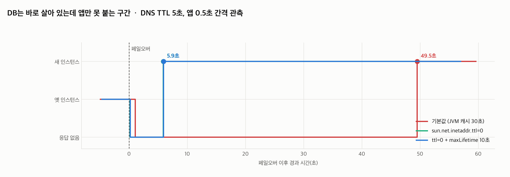

# R02 DB는 1분에 복구됐는데 앱만 계속 죽어 있다

> 근거 등급: `E2`
> 출처: [AWS, Multi-AZ DB instance failover](https://docs.aws.amazon.com/AmazonRDS/latest/UserGuide/Concepts.MultiAZ.html) · [AWS SDK for Java, DNS caching](https://docs.aws.amazon.com/sdk-for-java/latest/developer-guide/java-dg-jvm-ttl.html)

## 1. 유명한 이유

RDS Multi-AZ 페일오버는 인스턴스를 옮기는 것이 아니라 **엔드포인트의 DNS 레코드를 스탠바이 쪽으로 바꾸는 것**입니다. AWS는 보통 60초에서 120초 안에 끝난다고 안내하고, 실제로 콘솔에서 보면 그 시간 안에 "available"로 돌아옵니다.

그런데 애플리케이션은 그 뒤로도 한참 못 붙습니다. JVM이 호스트명 해석 결과를 캐시하기 때문입니다. 보안 관리자가 설치돼 있으면 기본값이 영구 캐시(`-1`)이고, 없으면 30초입니다. AWS가 자바 SDK 문서에 별도 항목을 두어 이 값을 낮추라고 안내할 만큼 알려진 문제입니다.

증상이 고약한 이유는 **DB 지표가 전부 정상이라는 점**입니다. CPU도 커넥션도 복제 지연도 멀쩡한데 애플리케이션만 커넥션 에러를 뱉습니다. DBA는 "DB는 문제없다"고 하고 백엔드는 "DB에 못 붙는다"고 하는 상황이 여기서 생깁니다.

이 세션은 그 구간을 초 단위로 측정합니다. 두 가지를 한 요청에서 함께 보는 것이 핵심입니다. **지금 JVM 이 이름을 무엇으로 해석하는가, 그리고 지금 커넥션이 실제로 어느 인스턴스에 붙어 있는가.** DNS 레코드 쪽은 관측이 아니라 조작입니다. 페일오버 시점에 `dnsmasq` 설정을 B 로 바꾸므로 그 뒤로는 레코드가 B 라는 것이 전제입니다. 프로브가 DNS 에 따로 질의하지는 않으니 `resolved` 값은 언제나 JVM 캐시를 거친 값입니다.

## 2. 재현

### 환경

| 항목 | 값 |
|---|---|
| DB | MySQL 8.4.3 두 대 (`172.31.0.11` = A, `172.31.0.12` = B) |
| DNS | dnsmasq, `db.internal` A 레코드, **TTL 5초** |
| 앱 | Spring Boot 3.4.1, Java 21, HikariCP (풀 5), `jdbc:mysql://db.internal:3306` |
| 관측 | 0.5초 간격으로 `/probe` 호출 |

RDS 환경을 로컬로 옮기면 이렇게 됩니다. 앱은 **호스트명으로만** 접속하고, 페일오버는 `db.internal`이 가리키는 IP를 A에서 B로 바꾸는 것입니다. DNS TTL은 5초로 짧게 뒀습니다. TTL이 짧아도 문제가 남는다는 것을 보이기 위해서입니다.

### 페일오버

```
t=0초   A 인스턴스 정지 + DNS 레코드를 B로 교체
```

## 3. 재현 결과



기본 설정에서 관측된 순서입니다.

| 경과 | JVM이 해석한 IP | 붙은 인스턴스 | 상태 |
|---|---|---|---|
| -10초 | 172.31.0.11 | A (server_id 1) | 정상 |
| +0.2초 | 172.31.0.11 | 끊김 | 커넥션 에러 |
| +3.0초 | 기록 없음 | 끊김 | 프로브가 4초 타임아웃(표본 1건) |
| +16.7초 | **172.31.0.11** | 끊김 | **DNS 레코드는 이미 B인데 JVM은 여전히 A** |
| +20.2초 | 172.31.0.12 | 끊김 | JVM 캐시 만료, 이제 B를 봄 |
| **+23.8초** | 172.31.0.12 | **B (server_id 2)** | **복구** |

조건마다 3회씩 돌렸고 위는 그중 한 회차입니다. 세 회차의 값은 옛 주소 마지막 관측 16.53~16.65초, 새 주소 첫 관측 20.08~20.20초, 복구 23.65~23.78초로 붙습니다. **프로브 간격이 이 구간에서 3.6초까지 벌어지므로**(커넥션이 안 되면 curl 이 그만큼 물려 있습니다) 각 값의 불확실 구간은 앞 표본까지입니다. 재해석 시점은 (16.7초, 20.2초] 안 어딘가입니다.

DNS 레코드는 페일오버 직후 B로 바뀌었습니다. TTL 이 5초였으니 늦어도 5초면 새 주소가 보여야 합니다. 그런데 **JVM 은 16.7초 지점까지도 옛 주소를 반환했고, 새 주소가 처음 보인 것은 20.2초입니다.**

이 20초가 JVM 기본 캐시 30초와 맞아떨어집니다. 앱은 기동하면서 커넥션 풀을 채울 때 이름을 한 번 풀고, 이 실험은 그로부터 약 10초 뒤에 페일오버를 일으킵니다. 캐시가 그 첫 해석 시점부터 30초를 살면 만료는 페일오버 기준 +20초이고, 관측된 재해석 구간이 그 지점을 감쌉니다. **장애 시간에 얹힌 것은 "페일오버 이후 30초"가 아니라 "첫 해석 이후 30초의 남은 몫"입니다.** 페일오버가 앱 기동 직후에 나면 30초에 가까워지고, 캐시가 곧 만료될 참이었다면 짧아집니다.

앱 기동 로그에 원인이 찍혀 있습니다.

```
networkaddress.cache.ttl = null
networkaddress.cache.negative.ttl = 10
```

`null`은 명시적으로 설정된 값이 없다는 뜻이고, 이때 JVM은 내부 기본값 30초를 씁니다. 이 값을 모르면 "DNS TTL을 5초로 줄였는데 왜 안 되지"에서 막힙니다. **DNS TTL과 JVM 캐시 TTL은 다른 값이고, 애플리케이션이 보는 것은 후자입니다.**

## 4. 해소

같은 페일오버를 조건만 바꿔 반복했습니다.

| 조건 | 복구까지 | 재해석 시점 | 비고 |
|---|---|---|---|
| 기본값 | **23.8초** (23.65~23.78, 3회) | 20.2초 | JVM 캐시 30초의 남은 몫이 얹힘 |
| `-Dsun.net.inetaddr.ttl=0` | **5.9초** | 5.9초 | DNS TTL 5초를 그대로 따라감 |
| 위 + `maxLifetime=10초`, `keepaliveTime=5초` | **5.9초** | 5.9초 | 이 시나리오에서는 추가 개선 없음 |
| `-Dsun.net.inetaddr.ttl=-1` | **복구 안 됨** | 없음 | 343초까지 옛 주소 유지 |

**JVM 캐시 TTL 을 0으로 두는 것만으로 23.8초가 5.9초가 됩니다.** 17.9초 단축입니다. 배수로는 4.1배인데, 프로브 간격이 3.6초라 두 값 모두 앞 표본까지가 불확실 구간이고 그것을 감안하면 3.4배에서 10.3배 사이입니다. 그래서 배수보다 "17.9초가 빠진다"로 읽는 편이 안전합니다. 남은 5.9초는 DNS TTL(5초)과 커넥션 재수립 시간이라, 애플리케이션이 지불할 수 있는 최소치에 근접했습니다.

설정 방법은 두 가지입니다.

```java
// 코드에서 (java.security 파일 수정 없이)
java.security.Security.setProperty("networkaddress.cache.ttl", "0");

// 또는 실행 옵션으로
java -Dsun.net.inetaddr.ttl=0 -jar app.jar
```

`0`이 부담스럽다면 5초에서 10초 정도가 실무적인 절충입니다. DNS 조회는 대개 로컬 리졸버 캐시에서 끝나 비용이 크지 않습니다.

## 5. 예상과 달랐던 점

### 커넥션 풀 설정은 이 구간에서 효과가 없었습니다

`maxLifetime`을 30분에서 10초로 줄이고 `keepaliveTime`을 켰는데도 복구 시간이 5.9초로 같았습니다. 예상은 "오래된 커넥션이 빨리 폐기돼 더 빨라진다"였습니다.

이유는 순서에 있습니다. 페일오버가 나면 기존 커넥션은 `maxLifetime`을 기다릴 것도 없이 **즉시 끊깁니다.** 풀은 곧바로 새 커넥션을 만들려 하고, 그때 이름을 다시 해석합니다. 그러니 병목은 처음부터 커넥션 수명이 아니라 **이름 해석 결과의 캐시**였습니다.

이건 실무에서 잘못된 처방으로 이어지기 쉬운 지점입니다. 페일오버 후 복구가 느릴 때 커넥션 풀 설정부터 만지면, 이 시나리오에서는 아무것도 나아지지 않으면서 평상시 커넥션 생성 비용만 늘어납니다. 무엇이 병목인지 먼저 재야 합니다.

### DNS TTL을 줄여도 소용없습니다

DNS TTL 을 5초로 뒀는데도 기본 설정에서는 23.8초가 걸렸습니다. 인프라 쪽에서 TTL을 아무리 낮춰도 JVM이 그 값을 보지 않기 때문입니다. **인프라 설정과 런타임 설정이 각각 따로 있고, 애플리케이션 동작을 정하는 것은 런타임 쪽입니다.**

### 이름 해석은 한 번도 실패하지 않았습니다

처음 정리할 때 "+3초에서 +35초 사이에 이름 해석 자체가 실패했다"고 적었습니다. **틀렸습니다.** 결과 파일 전체에서 `resolved` 가 빈 표본은 0건이고, 값은 `172.31.0.11` 아니면 `172.31.0.12` 뿐입니다. 컨트롤러는 해석이 실패하면 `ERR:` 로 시작하는 문자열을 쓰도록 돼 있는데 그것도 한 건도 없습니다.

실제로 있었던 것은 다른 일입니다. 그 구간의 프로브는 **응답 자체가 없었습니다.** `curl --max-time 4` 가 물려 있다가 빈 줄을 남겼고, 그것을 "필드가 비었다"로 잘못 읽은 것입니다. 앱은 그동안 옛 주소를 계속 해석해 내면서 그 주소로 접속을 시도하다 실패하고 있었습니다(`ERR:CannotGetJdbcConnectionException`).

**"응답이 없다"와 "필드가 비었다"는 다른 사건이고, 원본이 한 줄뿐일 때는 특히 갈라 봐야 합니다.**

## 영구 캐시와 읽기 전용 승격 구간 (2026-07-31)

### 캐시가 영구이면 앱은 스스로 못 돌아옵니다

기본값과 `0` 은 이미 쟀습니다. 보안 관리자가 설치된 환경의 기본값인 영구 캐시를 더했습니다.

| 조건 | B 로 넘어가기까지 |
|---|---|
| 기본값 | 23.8초 |
| `sun.net.inetaddr.ttl=0` | 5.9초 |
| `sun.net.inetaddr.ttl=-1`(영구) | **관측 창 안에 못 넘어감** |

**영구 캐시는 느린 것이 아니라 안 됩니다.** 관측 창이 끝날 때까지 앱은 죽은 A 를 계속 찾습니다. 23.8초를 기다리면 되는 조건과 재시작 말고는 방법이 없는 조건은 대응이 다릅니다.

속성 이름을 잘못 쓰면 이 조건이 조용히 안 걸립니다. `networkaddress.cache.ttl` 은 `java.security` 가 읽는 **보안 속성**이라 `-D` 로 넘기면 무시됩니다. 시스템 속성은 `sun.net.inetaddr.ttl` 입니다. 위 표의 실행 로그에도 `networkaddress.cache.ttl = null` 이 찍혀 있습니다.

### 승격이 끝나기 전에 DNS 가 먼저 바뀌면

`read_only` 플래그를 함께 찍기는 했지만 스탠바이가 아직 읽기 전용인 구간을 따로 만들지는 않았습니다. B 를 읽기 전용으로 둔 채 페일오버하고 25초 뒤에 풀었습니다.

| 지점 | 페일오버 기준 |
|---|---|
| 앱이 B 로 넘어감 | +5.0초 |
| 첫 쓰기 실패 | +0.3초 |
| 마지막 쓰기 실패 | **+25.4초** |
| 첫 쓰기 성공 | **+25.9초** |

쓰기 92회 중 41회가 실패했습니다. **+5.0초부터 +25.9초까지 20.9초 동안, DNS 는 B 를 가리키고 커넥션도 붙는데 쓰기만 실패합니다.**

DNS 해석이나 커넥션 성립만 보는 헬스체크는 이 구간을 통과시킵니다. 앱은 살아 있다고 보고되고 읽기도 됩니다. 쓰기 가능 여부까지 봐야 실제 복구 시점이 나옵니다.

### read_only 는 관리 계정을 막지 않습니다

이 조건을 세우는 데 두 번 실패했고, **두 실패는 원인이 다릅니다.**

첫 번째는 창을 잘못 셌습니다. 읽기 전용 구간의 기준 시각을 페일오버가 아니라 스크립트 시작으로 잡아서, 창이 페일오버보다 먼저 닫혔습니다. 쓰기가 +5.1초에 성공한 것으로 기록됐는데 그 시점은 애초에 읽기 전용이 아니었습니다.

두 번째는 권한입니다. 창은 제대로 잡혔는데 쓰기가 +5.5초에 성공했습니다. **`read_only` 는 `SUPER` 나 `CONNECTION_ADMIN` 권한을 가진 계정에는 적용되지 않습니다.** 이 랩의 앱은 `root` 로 붙습니다. 설정은 켜져 있었고 조건만 안 섰습니다.

**한 증상에 원인이 둘이면 하나를 고치고 통과했다고 보면 안 됩니다.** 첫 번째를 고친 뒤에도 같은 모양의 실패가 났고, 그때는 이유가 달랐습니다. 조건이 선 실행에서는 읽기 전용 구간에 쓰기 실패 41회, 첫 실패 +0.3초, 마지막 실패 +25.4초가 기록됐습니다.

`super_read_only` 로 바꾸니 41회가 됐습니다. 그리고 설정값 확인만으로는 부족해서 **앱과 같은 계정으로 실제 쓰기를 한 번 시도해** 막히는지 보고, 안 막히면 실행을 멈추게 했습니다.

이건 측정 실수로만 남길 것이 아닙니다. **승격 절차가 `read_only` 만 켜면, 관리 권한으로 붙는 애플리케이션은 아직 승격이 안 끝난 스탠바이에 계속 씁니다.** 운영 계정이 최소 권한이 아닌 곳에서는 그 쓰기가 나중에 사라집니다.

## 7. RDS·Aurora에서는 무엇이 달라지는가

이 랩은 `dnsmasq` 두 줄로 페일오버를 흉내 냈습니다. 관리형에서 달라지는 것을 문서와 대조해 적습니다. **아래는 이 세션이 잰 값이 아니라 AWS 문서의 서술입니다.**

메커니즘부터가 같습니다. RDS Multi-AZ 페일오버는 DB 인스턴스의 DNS 레코드를 스탠바이 쪽으로 바꾸고, 그래서 기존 커넥션은 다시 맺어야 한다고 문서가 적습니다. 이 랩이 `sed` 로 한 일과 같은 종류입니다. 그러니까 3절이 잰 "레코드는 바뀌었는데 JVM 이 안 따라오는" 구간은 관리형에서도 그대로 생깁니다.

그런데 고칠 자리가 DB 쪽에 없습니다. 이 값은 클라이언트 JVM 의 설정이라 파라미터 그룹으로 못 바꿉니다. DBA 가 RDS 콘솔에서 할 수 있는 일이 없고, 애플리케이션 배포에 손을 대야 합니다. **증상이 DB 에서 나타나는데 조치는 애플리케이션 쪽에 있다는 것이 이 사고의 성질입니다.**

권장값은 5초입니다. 자바 SDK 문서가 `networkaddress.cache.ttl` 을 그 값으로 두라고 안내합니다. 이 랩이 잰 0초와 다르지만 방향은 같고, 5초면 DNS TTL 과 같은 자릿수라 4절의 결론이 유지됩니다.

그 값을 넣는 경로에 함정이 하나 더 있습니다. 같은 문서가 `networkaddress.cache.ttl` 은 시스템 속성이 아니라 **보안 속성**이라 `-D` 로 넘길 수 없다고 못 박습니다. 이 랩도 같은 자리에서 한 번 헛돌았습니다. `-D` 로 넘길 수 있는 것은 옛 이름인 `sun.net.inetaddr.ttl` 쪽이고, 4절의 코드 두 줄이 그래서 갈라져 있습니다.

Aurora 로 가면 면이 더 넓어집니다. 라이터 엔드포인트뿐 아니라 리더 엔드포인트와 사용자 정의 엔드포인트가 각각 DNS 이름이고, 같은 캐시가 전부에 걸립니다. 리더 쪽에서 같은 캐시가 만드는 다른 사고는 [리더 엔드포인트가 한 인스턴스에만 몰린다](/blog/incident/reader-endpoint-skew)에서 다룹니다.

### 비용

**이 설정 자체는 무료입니다.** TTL 을 낮추면 이름 해석이 늘지만 대개 로컬 리졸버 캐시에서 끝나고, 커넥션 풀이 이름을 푸는 빈도는 초당 수 회 수준이라 과금 대상이 아닙니다. Route 53 의 질의 요금이 붙는 것은 퍼블릭 호스팅 영역 쪽이고 VPC 안의 엔드포인트 해석은 그 경로가 아닙니다.

**돈이 드는 쪽은 반대입니다.** Multi-AZ 는 스탠바이 인스턴스 몫이 붙어 단일 AZ 대비 요금이 대략 두 배가 되는데, **그 돈으로 사는 것은 페일오버이지 애플리케이션의 복구가 아닙니다.** 이 세션이 잰 것은 그 사이에 남는 구간입니다. 기본 설정이면 페일오버가 끝난 뒤에도 최대 30초를 더 못 붙습니다. **가장 비싼 가용성 옵션을 사고도 클라이언트 설정 한 줄 때문에 그만큼을 잃는 구조입니다.** 금액은 인스턴스 클래스에 따라 갈리므로 이 세션에서 산정하지는 않았습니다.

## 못 한 것

- **위 세 절은 조건마다 1회 실행입니다.** 읽기 전용 창은 25초 하나만 썼습니다.
- **실제 RDS로 검증하지 않았습니다.** 컨테이너 두 대와 dnsmasq로 메커니즘만 축소 재현했습니다. AWS의 실제 페일오버 시간(60~120초)은 여기에 더해지는 값이고, 이 세션이 잰 것은 그 이후 애플리케이션이 추가로 잃는 시간입니다.
- **쓰기 트래픽 중 페일오버를 다루지 않았습니다.** 진행 중이던 트랜잭션이 어떻게 되는지는 R01(승격 시 커밋 유실)이 다룹니다.
