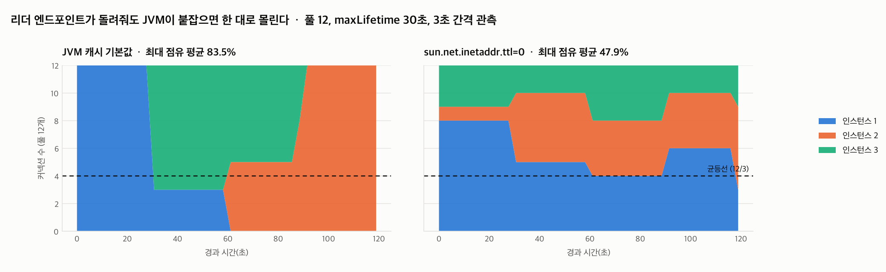

# R03 리더 엔드포인트가 돌려줘도 커넥션은 한 대로 몰린다

> 근거 등급: `E2`
> 출처: [AWS, Aurora endpoints (reader endpoint)](https://docs.aws.amazon.com/AmazonRDS/latest/AuroraUserGuide/Aurora.Overview.Endpoints.html) · [AWS SDK for Java, DNS caching](https://docs.aws.amazon.com/sdk-for-java/latest/developer-guide/java-dg-jvm-ttl.html)

## 1. 유명한 이유

Aurora의 리더 엔드포인트는 읽기 부하를 리플리카들에 나눠 주는 장치입니다. 그런데 나누는 단위가 **커넥션**이지 쿼리가 아닙니다. AWS 문서가 "connection request"를 대상으로 서술합니다.

커넥션을 맺을 때 DNS가 리플리카 하나를 골라 주고, **그 커넥션은 닫힐 때까지 그 인스턴스에 고정됩니다.** 커넥션 풀을 쓰는 애플리케이션에서는 이 차이가 큽니다. 풀이 커넥션 12개를 유지하면 분산은 그 12개를 만드는 순간에 한 번 결정되고, 그 뒤로는 아무리 쿼리를 많이 보내도 비율이 바뀌지 않습니다.

이 세션은 그 구조를 로컬에서 재현하고, **분산이 실제로 되는지**를 셉니다. 결과부터 말하면 기본 설정에서는 되지 않았습니다.

## 2. 재현

### 환경

| 항목 | 값 |
|---|---|
| DB | MySQL 8.4.3 세 대 (`172.32.0.11/12/13`, `server_id` 1/2/3) |
| 리더 엔드포인트 | CoreDNS, `reader.internal`에 A 레코드 3개, `loadbalance round_robin`, TTL 1초 |
| 앱 | Spring Boot 3.4.1, HikariCP 풀 12, `maxLifetime` 30초 |
| 관측 | 3초마다 풀 안 커넥션 12개를 전부 꺼내 각각 `@@server_id`를 확인 |

풀의 분포를 보려면 커넥션을 **동시에** 붙잡아야 합니다. 하나씩 꺼내 반납하면 같은 커넥션만 계속 나오기 때문입니다. `/distribution` 엔드포인트는 `maximumPoolSize`만큼 커넥션을 한꺼번에 잡고 각각에 `SELECT @@server_id`를 던집니다.

### DNS부터 확인해야 했습니다

처음에는 dnsmasq로 만들었는데 재현이 되지 않았습니다. 원인은 DNS 쪽이었습니다.

```console
$ for i in 1..5; do nslookup reader.internal; done
Address: 172.32.0.12  Address: 172.32.0.13  Address: 172.32.0.11
Address: 172.32.0.12  Address: 172.32.0.13  Address: 172.32.0.11
... (5회 모두 같은 순서)
```

dnsmasq의 `address=` 항목은 A 레코드 순서를 고정해서 돌려줍니다. Java의 `InetAddress.getByName()`은 그중 첫 번째만 쓰므로 커넥션이 전부 한 곳으로 갑니다. **이건 Aurora의 동작이 아니라 제 DNS 설정 문제였습니다.** CoreDNS의 `loadbalance` 플러그인으로 바꿔 응답마다 순서가 도는 것을 확인한 뒤 본 측정을 했습니다.

## 3. 결과



40회(120초) 관측한 결과입니다.

| 조건 | 최대 점유 평균 | 범위 | 마지막 분포 |
|---|---|---|---|
| JVM 캐시 기본값 | **83.5%** | 58.3~100.0% | `{2: 12}` |
| `sun.net.inetaddr.ttl=0` | **47.9%** | 33.3~66.7% | `{1: 3, 2: 6, 3: 3}` |

기본 설정에서는 12개 커넥션 중 **최대 12개 전부가 한 인스턴스**에 붙었습니다. 리플리카 세 대를 띄우고 리더 엔드포인트를 두었는데 실제로는 한 대만 일한 구간이 있었다는 뜻입니다.

원인은 R02에서 다룬 그 JVM DNS 캐시입니다. 보안 관리자가 없을 때 JVM은 이름 해석 결과를 30초 캐시합니다. 리더 엔드포인트가 응답마다 다른 인스턴스를 앞에 놓아도, 그 30초 안에 맺히는 커넥션은 전부 같은 주소를 씁니다. `maxLifetime`이 30초라 풀이 주기적으로 재생성되는데, **재생성 시점이 캐시 만료 주기와 뭉치면 12개가 한꺼번에 같은 곳으로 갑니다.**

캐시를 끄면 최대 점유가 47.9%로 내려가고 최소 33.3%(4/4/4 균등)까지 갑니다. 완전 균등은 아닌데, 커넥션이 만들어지는 순간마다 독립적으로 뽑기 때문에 표본 12개에서는 편차가 남습니다.

### 쿼리 단위가 아니라는 것

같은 풀에 20번 연속 조회하면 응답이 전부 같은 `server_id`입니다.

```console
같은 풀에서 20번 조회: 1이 20회
```

풀에서 커넥션을 하나 빌려 쓰고 반납하는 패턴이라 같은 커넥션이 계속 나오고, 그 커넥션은 한 인스턴스에 고정돼 있습니다. **"리더 엔드포인트를 썼으니 부하가 나뉜다"는 가정이 성립하려면 커넥션 수준에서 나뉘어야 합니다.**

## 4. 해소

| 처방 | 근거 |
|---|---|
| `networkaddress.cache.ttl`을 짧게 (0~10초) | 최대 점유 83.5% → 47.9% |
| `maxLifetime`에 흔들림을 준다 | 인스턴스마다 다른 값을 주면 재생성 시점이 흩어진다 |
| 풀 크기를 리플리카 수의 배수보다 크게 | 표본이 작으면 균등해지지 않는다 |
| 분산이 됐는지 실제로 센다 | 리플리카별 커넥션 수나 CPU를 보지 않으면 쏠림을 모른다 |

가장 중요한 것은 마지막입니다. **이 쏠림은 에러를 내지 않습니다.** 리플리카 세 대 중 한 대만 일해도 애플리케이션은 정상 동작하고, 그 한 대가 버티는 한 아무 신호가 없습니다. 트래픽이 늘어 그 한 대가 한계에 닿을 때 처음 드러나는데, 그때 보이는 것은 "리플리카를 늘렸는데 안 나아진다"입니다.

## 5. 예상과 달랐던 점

### 커넥션 풀 설정이 아니라 DNS 캐시가 원인이었습니다

이 세션을 시작할 때는 `maxLifetime` 동기화가 주범일 것으로 봤습니다. 모든 커넥션의 수명이 같으면 만료가 뭉치고, 한꺼번에 재생성되면서 몰린다는 가설입니다.

재 보니 `maxLifetime`은 그대로 두고 DNS 캐시만 꺼도 83.5%가 47.9%로 내려갔습니다. HikariCP는 실제로는 `maxLifetime`에 소량의 흔들림을 자체적으로 주므로 만료 자체는 완전히 뭉치지 않습니다. 그런데도 몰린 이유는 **재생성이 흩어져 일어나도 그 사이 DNS 응답이 같은 값으로 캐시돼 있으면 결과가 같기 때문**입니다.

R02에서 "커넥션 풀 설정을 만져도 안 나아진다"를 확인했는데, 여기서도 같은 결론입니다. 두 세션 모두 병목이 이름 해석 캐시였습니다.

### 캐시를 꺼도 완전 균등은 아니었습니다

`ttl=0`에서도 최대 점유가 평균 47.9%이고 66.7%(8/12)까지 올라간 구간이 있습니다. 커넥션 12개를 세 곳에 무작위로 뿌리면 4/4/4가 나올 확률이 오히려 낮습니다. **라운드로빈 DNS는 균등 분배를 보장하지 않습니다.** 요청 순서대로 돌려줄 뿐이고, 커넥션 생성 시점이 불규칙하면 결과도 불규칙합니다.

### 재현 환경의 DNS가 먼저 문제였습니다

처음 두 번의 측정이 100% 쏠림으로 나와 재현에 성공한 줄 알았습니다. 확인해 보니 dnsmasq가 순서를 안 돌리고 있었고, 제가 만든 환경이 리더 엔드포인트가 아니었습니다. **재현 대상을 재기 전에 재현 환경이 그 대상을 흉내 내는지부터 확인해야 합니다.** 100%라는 극적인 숫자가 나왔을 때 의심했어야 했습니다.

## 못 한 것

- **실제 Aurora로 검증하지 않았습니다.** 리더 엔드포인트의 DNS 동작을 CoreDNS로 흉내 냈고, AWS의 실제 응답 정책과 TTL은 다를 수 있습니다.
- **부하를 걸지 않았습니다.** 커넥션이 어디 붙었는지만 셌고, 쏠렸을 때 그 인스턴스의 CPU나 지연이 어떻게 되는지는 재지 않았습니다.
- **`maxLifetime` 흔들림을 분리 측정하지 않았습니다.** DNS 캐시를 끈 상태에서 `maxLifetime`만 바꿔 보는 조건이 있어야 그 몫을 알 수 있습니다.
- **리플리카가 실제 Aurora 복제본이 아닙니다.** 독립된 MySQL 세 대라 복제 지연이나 읽기 전용 제약은 재현하지 않았습니다.
