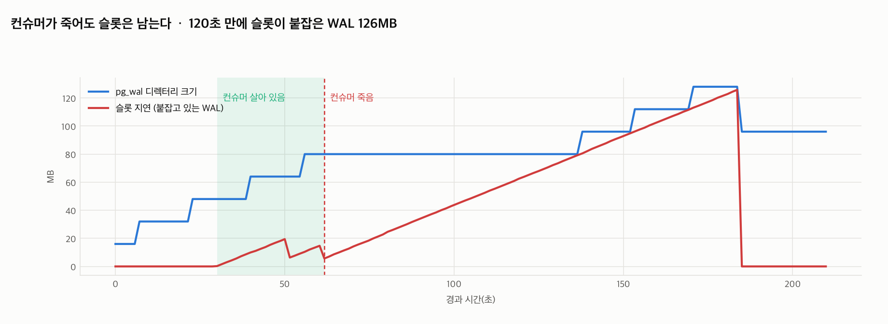
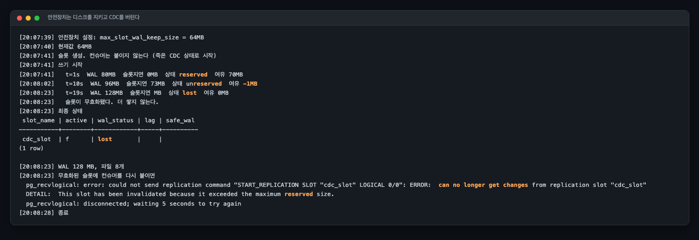
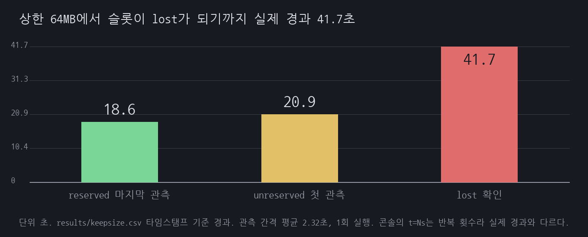

# R04 CDC 컨슈머가 죽으면 프로덕션 DB의 디스크가 찬다

> 근거 등급: `E2`
> 출처: [PostgreSQL 17, Replication Slots](https://www.postgresql.org/docs/17/warm-standby.html#STREAMING-REPLICATION-SLOTS) · [pg_replication_slots (wal_status, safe_wal_size)](https://www.postgresql.org/docs/17/view-pg-replication-slots.html) · [max_slot_wal_keep_size](https://www.postgresql.org/docs/17/runtime-config-replication.html) · [RDS for PostgreSQL 복제 파라미터](https://docs.aws.amazon.com/AmazonRDS/latest/UserGuide/USER_PostgreSQL.Replication.ReadReplicas.Mechanisms-versions.html) · [Aurora PostgreSQL 논리 복제](https://docs.aws.amazon.com/AmazonRDS/latest/AuroraUserGuide/AuroraPostgreSQL.Replication.Logical.html) · [Amazon Aurora storage](https://docs.aws.amazon.com/AmazonRDS/latest/AuroraUserGuide/Aurora.Overview.StorageReliability.html) · [Increasing DB instance storage capacity](https://docs.aws.amazon.com/AmazonRDS/latest/UserGuide/USER_PIOPS.ModifyingExisting.html)

## 1. 유명한 이유

CDC(Change Data Capture)는 이제 흔한 구성입니다. Debezium이든 자체 구현이든, PostgreSQL의 논리 복제 슬롯을 열어 변경분을 읽어 갑니다.

문제는 **컨슈머가 죽어도 슬롯은 남는다**는 점입니다. 슬롯은 "내가 아직 여기까지밖에 못 읽었다"는 위치(`restart_lsn`)를 서버에 등록해 두는 장치이고, 서버는 그 위치 이후의 WAL을 지우지 못합니다. 컨슈머가 살아 있을 때는 위치가 따라 움직이니 문제가 없습니다. 죽으면 위치가 그 자리에 멈추고, 쓰기는 계속되므로 WAL이 쌓이기만 합니다.

이 구조가 위험한 이유는 **장애의 방향이 반대**이기 때문입니다. 보통은 프로덕션이 아프면 부가 파이프라인이 영향을 받습니다. 여기서는 부가 파이프라인이 죽어서 프로덕션 DB의 디스크가 찹니다. 디스크가 차면 PostgreSQL은 쓰기를 거부하고, 그때는 이미 늦습니다.

AWS도 같은 경고를 문서에 적어 둡니다. RDS for PostgreSQL 문서는 `max_slot_wal_keep_size`의 기본값이 `-1`이고 그것이 "there's no limit to how much WAL data is kept on the source DB instance"를 뜻한다고 명시합니다. Aurora PostgreSQL 문서는 논리 복제의 WAL 레코드가 Aurora 스토리지에 저장된다고 적습니다.

이 세션은 그 과정을 평균 1.44초 간격으로 재고, PostgreSQL 13부터 있는 안전장치가 무엇을 지키고 무엇을 버리는지를 실측합니다.

## 2. 재현

### 환경

| 항목 | 값 |
|---|---|
| 호스트 | macOS 26.3.1, Apple M2 Pro, 12코어(논리), 32GB (`results/env.txt`) |
| DB | PostgreSQL 17.5 (Debian 17.5-1.pgdg130+1), 컨테이너 `cpus: 4`, `mem_limit: 2g` |
| 설정 | `wal_level=logical`, `max_wal_size=256MB`, `min_wal_size=64MB`, `checkpoint_timeout=30s` |
| 쓰기 | 컨테이너 안에서 psql 루프. 200행 INSERT 뒤 0.2초 대기, 행당 payload 1,024바이트. **실측 859.6행/초**(구간별 400~1,000, 중앙값 857) |
| 관측 | `pg_ls_waldir()` 합계와 슬롯 지연을 기록. `sleep 1`에 psql 왕복이 붙어 **실제 간격은 평균 1.44초**, 총 147회 209.8초, 1회 실행 |

체크포인트를 30초마다 돌게 한 이유는 **WAL 재활용이 정상 동작하는 상태**를 먼저 만들기 위해서입니다. 그래야 "슬롯 때문에 못 지운다"를 슬롯 탓으로 분리할 수 있습니다.

쓰기 속도를 루프 구성이 아니라 실측으로 적는 이유가 있습니다. 이 루프의 목표치는 초당 1,000행이지만 psql을 매번 새로 띄우는 비용 때문에 그대로 나오지 않습니다. `results/timeline.txt`에는 실행 당시 목표치가 "초당 약 1,000행"으로 찍혀 있고, 같은 실행의 `results/metrics.csv`로 다시 재니 859.6행/초였습니다. 기록된 출력은 원문이라 고치지 않았고, 본문은 실측값을 씁니다.

### 타임라인

아래는 `scripts/run.sh`가 노린 시각입니다. 괄호는 `results/metrics.csv`에서 실제로 관측된 시각입니다.

```
0~30초    슬롯 없이 쓰기만
30초      논리 복제 슬롯 생성 + pg_recvlogical 시작        (t=30.0에서 active=t 관측)
30~60초   컨슈머가 살아 있는 구간                          (t=30.0~61.7)
62초      컨슈머 강제 종료 (CDC 파이프라인이 죽은 상황)     (t=63.1에서 active=f 관측)
62~182초  쓰기는 계속된다
182초     슬롯 삭제 + CHECKPOINT                          (t=185.0에서 회수 관측)
```

## 3. 결과: 슬롯이 붙잡은 WAL



| 경과 | pg_wal | 파일 | 슬롯 지연 | 컨슈머 |
|---|---|---|---|---|
| 30초 | 48MB | 3 | 0.2MB | 살아 있음 |
| 50초 | 64MB | 4 | **19.4MB** | 살아 있음 (톱니 마루) |
| 52초 | 64MB | 4 | 6.3MB | 살아 있음 (톱니 골) |
| **63초** | 80MB | 5 | 7.0MB | **죽음** |
| 103초 | 80MB | 5 | **47.1MB** | 죽음 |
| 136초 | 80MB | 5 | **79.2MB** | 죽음 |
| 155초 | 112MB | 7 | **97.5MB** | 죽음 |
| 172초 | 128MB | 8 | **114.5MB** | 죽음 |
| 184초 | 128MB | 8 | **125.8MB** | 죽음 (최대) |
| 185초 | **96MB** | **6** | **0MB** | 슬롯 삭제 후 |

컨슈머가 살아 있는 구간에서 슬롯 지연은 0으로 유지되지 않았습니다. 0.2MB에서 19.4MB 사이를 **톱니 모양으로 오르내립니다.** 지연이 t=50.0에 19.4MB까지 올랐다가 t=51.5에 6.3MB로 되돌아오고, 다시 t=60.3에 14.7MB까지 올랐다가 t=61.7에 5.7MB로 떨어집니다. 컨슈머가 밀린 만큼 몰아서 읽고 `restart_lsn`을 한 번에 밀어 올리기 때문입니다. 표의 52초 행 6.3MB는 그 톱니의 골 값이지 정상 상태 값이 아닙니다.

컨슈머를 죽인 뒤로는 지연이 **120.5초 만에 7.0MB에서 125.8MB로** 단조 증가합니다. 기울기는 **초당 0.99MB**입니다. 그 120.5초 동안 들어간 데이터는 104,000행, payload 기준 약 102MB입니다. 데이터 102MB를 쓰는 사이에 WAL 119MB가 슬롯에 묶였습니다.

이 기울기를 그대로 늘려 보면 규모가 보입니다. 초당 0.99MB는 **시간당 약 3.5GB, 하루 약 83GB**입니다. 이건 측정값이 아니라 선형 외삽이고, 859.6행/초라는 아주 작은 쓰기에서 나온 기울기입니다. 실제 서비스의 쓰기량이 이 실험의 열 배면 기울기도 대략 열 배가 되고, 하루가 아니라 몇 시간 안에 볼륨을 채웁니다.

`pg_wal`은 t=55.9부터 t=136.4까지 80.5초 동안 80MB에 묶여 있습니다. 컨슈머가 죽은 t=63.1을 기준으로 보면 그 뒤 73.3초입니다. 체크포인트는 30초마다 돌았는데도 회수되지 않았습니다. 슬롯의 `restart_lsn` 이후를 지울 수 없기 때문입니다. 그 뒤로는 재활용할 파일이 없어 새 WAL이 계속 생겨 128MB까지 갔습니다.

**슬롯을 지우고 체크포인트를 돌리자 128MB가 96MB로 즉시 줄었습니다.** 붙잡고 있던 것이 슬롯이었다는 증거입니다.

## 4. 안전장치는 무엇을 버리는가

PostgreSQL 13부터 `max_slot_wal_keep_size`가 있습니다. 문서는 이 값을 "the maximum size of WAL files that replication slots are allowed to retain in the `pg_wal` directory **at checkpoint time**"으로 정의합니다. 상한을 넘으면 슬롯을 무효화합니다. 64MB로 걸고 컨슈머 없는 슬롯을 만들어 봤습니다.



`results/run0-exp2.txt`에서 상태가 바뀐 세 줄입니다.

```console
[20:07:41]   t=1s  WAL 80MB  슬롯지연 0MB  상태 reserved  여유 70MB
[20:08:02]   t=10s  WAL 96MB  슬롯지연 73MB  상태 unreserved  여유 -1MB
[20:08:23]   t=19s  WAL 128MB  슬롯지연 MB  상태 lost  여유 0MB
```

이 출력은 세 군데를 그대로 읽으면 안 됩니다.

- **`t=1s / t=10s / t=19s`는 경과 초가 아니라 루프 반복 횟수입니다.** 한 바퀴에 psql 왕복이 네 번 들어가 평균 2.32초가 걸렸습니다. 벽시계 타임스탬프가 `20:07:41 → 20:08:23`이니 실제 경과는 42초입니다. `results/run0-keepsize.csv`의 타임스탬프로 다시 재면 **41.7초**입니다. 스크립트는 이후 실행에서 시작 시각과의 차이를 찍도록 고쳤고, 이미 기록된 `run0-exp2.txt`는 원문이라 손대지 않았습니다.
- **`슬롯지연 MB`가 비어 있는 것은 값이 0이라는 뜻이 아닙니다.** 무효화된 슬롯은 `restart_lsn`이 NULL이 되므로 계산식이 NULL을 돌려줍니다.
- **`여유 0MB`도 실제로는 NULL입니다.** 문서가 `safe_wal_size`를 "NULL for lost slots"로 정의합니다. 스크립트가 `COALESCE(...,0)`으로 감싸 0으로 찍혔습니다.



`run0-keepsize.csv`(19회 관측, 평균 2.32초 간격, 1회 실행)로 다시 정리하면 이렇습니다. 이 원본은 뒤의 반복 회차가 `keepsize.csv`를 덮어써서 한동안 인용이 깨져 있었고, 회차별로 `run0-`과 `run3-` 접두사를 붙여 복원했습니다.

| 실제 경과 | pg_wal | 슬롯 지연 | wal_status | safe_wal_size |
|---|---|---|---|---|
| 0.0초 | 80MB | 0MB | `reserved` | 70MB |
| 18.6초 | 80MB | 65MB | `reserved` | 5MB |
| 20.9초 | 96MB | 73MB | `unreserved` | -1MB |
| 39.4초 | 160MB | **138MB** | `unreserved` | -67MB |
| 41.7초 | 128MB | NULL | `lost` | NULL |

문서가 정의하는 상태는 넷이고 이번 실행에서는 셋을 봤습니다.

- **`reserved`**: 붙잡은 파일이 `max_wal_size` 안에 있습니다. `safe_wal_size`가 남은 여유입니다.
- **`extended`**: `max_wal_size`는 넘었지만 슬롯이나 `wal_keep_size`가 아직 붙잡고 있습니다. 이번 실행에서는 관측되지 않았습니다.
- **`unreserved`**: 슬롯이 필요한 WAL을 더 이상 전부 붙잡지 못하고, 다음 체크포인트에서 일부가 지워질 예정입니다. `safe_wal_size`가 **음수**가 됩니다. 문서는 이 상태에서 `reserved`나 `extended`로 되돌아갈 수 있다고 적습니다.
- **`lost`**: 무효화. 그 슬롯으로는 더 읽을 수 없습니다.

**상한 64MB는 지연 64MB에서 칼같이 끊기지 않았습니다.** 무효화 직전 관측에서 슬롯 지연은 138MB였고 `pg_wal`은 160MB였습니다. 상한이 체크포인트 시점에만 적용되기 때문입니다. `checkpoint_timeout=30s`인 이 환경에서 초과분이 두 배 넘게 쌓였다는 뜻이고, 상한을 볼륨 여유의 절반쯤으로 잡으면 안 된다는 뜻이기도 합니다.

무효화된 슬롯에 컨슈머를 다시 붙이면 이렇게 됩니다.

```console
  pg_recvlogical: error: could not send replication command "START_REPLICATION SLOT "cdc_slot" LOGICAL 0/0": ERROR:  can no longer get changes from replication slot "cdc_slot"
  DETAIL:  This slot has been invalidated because it exceeded the maximum reserved size.
  pg_recvlogical: disconnected; waiting 5 seconds to try again
```

**디스크는 지켜지고 CDC는 버려집니다.** 컨슈머를 고쳐서 다시 붙여도 소용없고, 슬롯을 새로 만들어 전체 재동기화를 해야 합니다. 다운스트림이 데이터 웨어하우스라면 몇 시간짜리 재적재입니다.

이것이 이 설정의 정확한 거래 조건입니다. 상한을 걸면 프로덕션은 살고 파이프라인이 죽습니다. 안 걸면 파이프라인은 나중에 이어받을 수 있지만 그전에 프로덕션 디스크가 찹니다. **어느 쪽이 나은지는 도메인이 정하는 것이고, 정하지 않으면 기본값(무제한)이 후자를 고릅니다.**

### 반복 측정 4회

무효화 시점을 4회 잰 값입니다.

| 회차 | 무효화까지 | 그때 `pg_wal` |
|---|---|---|
| 0 (원본) | 41.7초 | 128MB |
| 1 | 60초 | 224MB |
| 2 | 53초 | 224MB |
| 3 | 54초 | 224MB |

회차 1~3 은 53~60초로 모입니다. 원본의 41.7초와 차이가 나는데, 원본은 로그에 `t=19s` 로
찍혔지만 그 `t` 가 반복 횟수라 실제 경과가 41.7초였습니다(`run0-keepsize.csv` 로 확인).

**무효화 시점의 `pg_wal` 이 128MB 와 224MB 로 갈립니다.** 다만 이 차이는 초과분이 아니라
시작값입니다. 회차 1~3 은 슬롯 지연 0MB 인 첫 관측에서 이미 `pg_wal` 이 224MB 였고
관측 창 안에서 한 번도 늘지 않았습니다(`run3-keepsize.csv` 24행 전부 224MB). 앞 회차가
남긴 파일을 서버가 아직 재활용하지 않은 것입니다.

실제로 잰 초과분은 슬롯 지연 쪽입니다. 상한 64MB 에 대해 무효화 직전 지연이 원본
138MB(2.2배), 회차 3 이 174MB(2.7배)였습니다. 6절이 "상한을 남은 디스크 여유에 딱 맞춰
잡으면 안 된다"고 적은 근거가 반복 측정으로 더 강해집니다. **관측된 최악은 상한의
2.7배입니다.**

## 5. 해소

| 항목 | 내용 |
|---|---|
| 슬롯 지연을 경보 대상으로 | `pg_wal_lsn_diff(pg_current_wal_lsn(), restart_lsn)`. 이 값이 단조 증가하면 컨슈머가 죽은 것이다 |
| 톱니와 단조 증가를 구분한다 | 살아 있는 컨슈머의 지연은 오르내린다. 이 실험에서는 0.2~19.4MB를 왕복했다. 임계값 한 번 초과로 깨우면 오경보가 난다 |
| `active` 플래그를 함께 본다 | 지연이 커도 `active=t`면 느린 것이고, `active=f`면 아무도 안 읽는 것이다 |
| 상한을 명시적으로 정한다 | `max_slot_wal_keep_size`. 기본값은 `-1`(무제한)이라 아무 보호가 없다 |
| 상한은 여유의 절반으로 잡지 않는다 | 체크포인트 시점에만 적용되므로 초과분이 쌓인다. 이 실험은 상한 64MB에서 지연 138MB를 봤다 |
| `wal_status`를 감시한다 | `unreserved`가 마지막 경고다. `lost`가 되면 되돌릴 수 없다 |
| 안 쓰는 슬롯을 남기지 않는다 | 테스트로 만든 슬롯 하나가 몇 달 뒤 사고가 된다 |

### 관리형 DB에서는 이것이 스토리지 요금이다

이 세션은 로컬 컨테이너에서 돌았지만 R 트랙의 전제는 관리형 DB입니다. 거기서는 슬롯이 붙잡은 WAL이 성능 이야기에서 그치지 않습니다. RDS와 Aurora가 스토리지를 다루는 방식이 달라서 같은 슬롯 하나가 두 곳에서 다른 값을 청구합니다.

**RDS for PostgreSQL에서는 볼륨이 한 번 커지면 돌아오지 않습니다.** AWS 문서는 스토리지 확장을 설명하면서 "You can increase the allocated space on a storage volume by a minimum of 10%. **You can't deallocate space.**"라고 적습니다. 죽은 슬롯이 WAL을 밀어 올려 자동 스토리지 확장이 한 번 발동하면, 그 뒤에 슬롯을 지우고 WAL이 전부 회수돼도 할당된 볼륨은 그 크기로 남고 그 크기로 매달 과금됩니다. 볼륨을 줄이려면 더 작은 인스턴스로 덤프하고 옮겨 심는 마이그레이션이 필요합니다. 죽은 CDC 컨슈머 하나가 영구 고정비를 만드는 경로가 여기입니다.

RDS에서 볼 수 있는 신호는 CloudWatch 지표입니다. `OldestReplicationSlotLag`는 가장 뒤처진 슬롯의 지연을 WAL 크기로, `TransactionLogsDiskUsage`는 WAL이 쓰는 스토리지 크기를, `FreeStorageSpace`는 남은 공간을 보여 줍니다. 이 세션에서 잰 `pg_wal_lsn_diff(pg_current_wal_lsn(), restart_lsn)`가 첫 번째 지표와 같은 값을 다른 이름으로 부른 것입니다. 상한 파라미터도 그대로 있습니다. RDS 문서는 `max_slot_wal_keep_size`를 "controls the quantity of WAL data that the RDS for PostgreSQL DB instance retains in the `pg_wal` directory to serve slots"로 설명하고, 기본값이 `-1`이라 "there's no limit"임을 명시합니다. 파라미터 그룹에서 값을 정하지 않으면 이 세션의 실험 1과 같은 상태로 돌아가는 셈입니다.

**Aurora PostgreSQL은 구조가 달라 결과도 반대쪽으로 움직입니다.** Aurora 문서는 논리 복제에서 "the WAL records are saved on Aurora storage"라고 적습니다. WAL이 인스턴스 로컬 볼륨이 아니라 클러스터 볼륨에 쌓인다는 뜻입니다. 클러스터 볼륨은 쓴 만큼만 과금되고, 데이터가 지워지면 "the space allocated for that data is freed"라서 할당량 자체가 줄어듭니다. 그래서 Aurora에서는 슬롯을 지우면 요금도 따라 내려옵니다. 대신 붙잡고 있는 동안은 그만큼이 그대로 청구됩니다. AWS 문서가 직접 이렇게 적습니다. "After you set up a replication slot, Aurora PostgreSQL starts retaining WAL files that haven't been consumed by the slot. This can cause an increase in the billed metric `VolumeBytesUsed`." 여기에 Aurora Standard는 I/O 100만 건 단위로 따로 과금되므로, 논리 디코딩이 스토리지에서 WAL을 읽는 비용이 read I/O로 잡힙니다. Aurora PostgreSQL 14.5·13.8·12.12·11.17부터 붙은 write-through 캐시가 그 읽기를 줄이도록 설계돼 있습니다.

정리하면 죽은 슬롯 하나의 청구 형태가 셋으로 갈립니다. RDS에서는 회수 불가 볼륨이라는 영구 고정비, Aurora Standard에서는 `VolumeBytesUsed`와 read I/O라는 사용량 과금, Aurora I/O-Optimized에서는 I/O 과금이 사라진 대신 스토리지 사용량입니다. 어느 쪽이든 컨슈머가 죽어 있는 시간에 비례합니다.

**금액은 계산하지 않았습니다.** 리전도 인스턴스 클래스도 스토리지 요금제도 정하지 않았고, 로컬 컨테이너에서 잰 값을 요금으로 환산할 근거가 없습니다. 대신 증가 속도는 위에서 잰 그대로입니다. 859.6행/초라는 작은 쓰기에서 슬롯이 초당 0.99MB를 붙잡았고, 그대로 늘리면 시간당 3.5GB, 하루 83GB입니다. RDS 볼륨의 여유 공간과 이 기울기를 나누면 "며칠 뒤에 터지는가"가 나옵니다. 그 나눗셈은 각자의 볼륨 크기로 해야 합니다.

## 6. Debezium 으로 다시: 재려던 것을 못 잰 기록

`scripts/exp3-debezium.sh`, 원문은 `results/exp3-debezium.txt`.

`pg_recvlogical` 대신 실제 도구를 써서 **하트비트가 무엇을 막는지** 재려 했습니다.
Debezium Server 3.0 을 붙이는 데까지는 성공했지만 **그 질문에는 답하지 못했습니다.**
결과를 지우지 않고 왜 못 잰 것인지를 적어 둡니다.

| 조건 | 슬롯 지연(60초) | 하트비트 테이블 행 수 |
|---|---|---|
| A. 살아 있고 대상 테이블에 쓰기 | 932KB → **439.5MB** | 0 |
| B1. 대상은 조용, 하트비트 없음 | 456KB → 219.9MB | 0 |
| B2. 대상은 조용, **하트비트 5초** | 456KB → **219.8MB** | **0** |
| C. Debezium 이 죽음 | 39.5MB → 446.0MB | 0 |

### 왜 답이 안 나왔는가

**하트비트가 한 번도 돌지 않았습니다.** `heartbeat.action.query` 로 지정한 INSERT 가
`dbz_heartbeat` 테이블에 한 행도 남기지 않았습니다. B1 과 B2 가 219.9MB 와 219.8MB 로
같은 것은 하트비트가 켜지지 않았기 때문이고, 따라서 **이 표로 하트비트의 효과를
말할 수 없습니다.** 왜 안 돌았는지는 6절에서 밝힙니다. 사실은 돌고 있었습니다.

**싱크가 병목입니다.** 조건 A 에서 Debezium 이 살아 있는데 지연이 439.5MB 까지 갑니다.
이 실험의 싱크는 변경분을 받아 버리는 단일 스레드 파이썬 HTTP 서버인데, 한 번에 400행씩
초당 10회 들어오는 부하를 못 받습니다. **그러니까 이 지연은 하트비트나 슬롯의 성질이
아니라 제가 만든 싱크의 처리량을 재고 있습니다.**

### 그래도 건진 것

**컨슈머가 "살아 있다"는 것과 슬롯이 전진하는 것은 다릅니다.** 조건 A 가 그것을
보여 줍니다. 프로세스는 떠 있고 헬스체크도 통과하는데 슬롯 지연은 439.5MB 로 자랍니다.
이 세션의 3절이 "컨슈머가 죽으면"이라고 쓴 자리를 **"컨슈머가 못 따라가면"으로
넓혀야 합니다.** 죽은 컨슈머만 감시하는 알람은 이 상황을 놓칩니다.

조건 C 는 3절의 결론을 다른 도구로 다시 확인합니다. 죽으면 지연이 자랍니다(39.5MB →
446.0MB). 하트비트를 켜 둔 조건인데도 그렇습니다. **하트비트는 살아 있는 컨슈머가
대상 테이블의 조용함 때문에 슬롯을 못 미는 경우를 위한 것이지, 죽은 컨슈머를 위한 것이
아닙니다.**

### 밟은 함정 넷

1. **`pravega` 싱크는 추가 설정을 요구합니다.**
   `The config property debezium.sink.pravega.scope is required`
2. **`http` 싱크는 포맷을 명시해야 합니다.**
   `The config property debezium.format.value is required`
3. **설정 파일 경로가 `/debezium/config` 입니다.** `/debezium/conf` 에 넣으면 기동은
   되고 설정만 안 읽혀 `Failed to load mandatory config value debezium.sink.type` 이 납니다.
4. **앞 실험의 `max_slot_wal_keep_size=64MB` 가 남아 있었습니다.** 그 상태로 돌리면
   슬롯이 64MB 에서 무효화돼 지연이 리셋되고, 조건 C 의 지연이 39MB 에서 0 으로 줄어드는
   이상한 값이 나옵니다. 이 실험은 상한을 풀고 돌려야 합니다.

## 6-1. 하트비트를 다시 재서 답을 얻었습니다 (2026-07-31)

6절에서 못 잰 것을 다시 쟀습니다. 두 가지가 나왔습니다. 하나는 6절이 "안 돈다"고 적은
하트비트가 사실 돌고 있었다는 것이고, 다른 하나는 돌아도 소용없는 조건이 따로
있다는 것입니다.

### 왜 6절에서 0행이었는가

같은 설정으로 유휴 데이터베이스에 60초를 돌리니 하트비트 테이블에 19행이 들어왔습니다.
3초 주기니 계산이 맞습니다. **하트비트는 돕니다.**

6절의 조건 A 가 60초 동안 `watch_log` 에 실측 초당 약 3,330행을 넣었습니다(목표는 4천 행). 조건 B 는 컨테이너를
새로 띄우므로 오프셋 파일이 비어 있어 **초기 스냅샷**부터 다시 시작합니다. 하트비트는
스트리밍 단계에 들어가야 발동합니다. 스냅샷이 관측 창 90초 안에 안 끝나면 하트비트는
영원히 0입니다. 싱크가 단일 스레드라 스냅샷이 더 느렸습니다. 하트비트가 안 돈 것이
아니라 **하트비트 단계에 닿지 못했습니다.**

`snapshot.mode=no_data` 로 스냅샷을 걷어 내고 싱크를 스레드 방식으로 바꿔 다시 쟀습니다.

### 다섯 조건

캡처 대상은 `watch_log` 하나입니다. D 를 뺀 넷은 그 테이블이 조용하고 `other_log` 에만
초당 4천 행이 들어갑니다. 조건마다 90초, 2회 반복입니다.

| 조건 | 하트비트 | `action.query` | publication | 지연 증가 1회 | 2회 | 하트비트 행 |
|---|---|---|---|---|---|---|
| A. 기준선 | 없음 | 없음 | `watch_log` | 325.3MB | 323.1MB | 0 |
| B. 주기만 | 3초 | 없음 | `watch_log` | 324.2MB | 324.2MB | 0 |
| C. 주기와 질의 | 3초 | 있음 | `watch_log` | 325.7MB | 322.6MB | **29** |
| E. publication 안으로 | 3초 | 있음 | `watch_log`, `dbz_heartbeat` | **33.5MB** | **55.3MB** | 29 |
| D. 대조: 대상이 바쁨 | 없음 | 없음 | `watch_log` | 39.7MB | 5.2MB | 0 |

A·B·C 는 두 회차가 322.6MB 에서 325.7MB 사이로 모입니다. E 와 D 는 편차가 큽니다
(33.5~55.3MB, 5.2~39.7MB). 이 편차 안에서도 두 무리는 겹치지 않으므로 순서는 확실하고,
E 와 D 를 서로 견주는 데에는 이 데이터가 부족합니다.

### 읽는 법

**A 와 B 가 같습니다.** `heartbeat.interval.ms` 만 켜는 것은 지연에 아무 영향이
없습니다. 하트비트 신호는 Debezium 이 "여기까지 받았다"는 LSN 을 서버에 알리는 것인데,
캡처 대상이 조용하면 **받은 LSN 자체가 전진하지 않습니다.** `other_log` 에 30만 행을
넣어도 pgoutput 이 publication 필터로 걸러 내므로 Debezium 은 그것을 보지 못합니다.
알릴 값이 없으니 신호를 아무리 보내도 `restart_lsn` 이 제자리입니다.

**C 도 A 와 같습니다. 이것이 이 실험의 답입니다.** `heartbeat.action.query` 까지 주면
Debezium 이 3초마다 `dbz_heartbeat` 에 INSERT 를 합니다. 실제로 90초에 29번 돌았습니다.
그런데 지연은 그대로 자랐습니다. publication 을 열어 보면 이유가 있습니다.

```
 pubname         | schemaname | tablename
-----------------+------------+-----------
 dbz_publication | public     | watch_log
```

`publication.autocreate.mode=filtered` 는 `table.include.list` 에 적힌 테이블만으로
publication 을 만듭니다. 하트비트 테이블은 거기 없습니다. 그러면 그 INSERT 도 pgoutput 이
걸러 내고, Debezium 은 자기가 만든 쓰기를 받지 못합니다.

**하트비트 테이블에는 행이 쌓이고 로그에도 경고가 없습니다.** 설정은 맞게 들어갔고
질의도 실행되니 대시보드에서는 정상으로 보입니다. **잘 도는 것처럼 보이면서 아무 일도
안 하는 조합입니다.**

**E 가 D 와 같은 자릿수로 떨어집니다.** `table.include.list` 에 하트비트 테이블을 넣어
publication 안으로 들이면 증가분이 320MB 대에서 수십 MB 대로 내려갑니다. 대조군 D(캡처
대상이 계속 바쁜 경우)와 같은 무리입니다. 하트비트의 원리가 "조용한 대상에 인위적으로
변경을 공급하는 것"이니 앞뒤가 맞습니다.

```
debezium.source.table.include.list=public.watch_log,public.dbz_heartbeat
debezium.source.heartbeat.interval.ms=3000
debezium.source.heartbeat.action.query=INSERT INTO dbz_heartbeat (ts) VALUES (now()) ON CONFLICT DO NOTHING
```

### 밟은 결함 둘

1. **슬롯을 지웠다고 믿으면 앞 조건이 다음 조건으로 샙니다.** `docker rm -f` 로 컨슈머를
   죽여도 PostgreSQL 이 walsender 의 죽음을 알아채기까지 잠깐 걸립니다. 그 사이
   `pg_drop_replication_slot` 은 "슬롯이 활성 상태"라며 실패하고, 반환값을 안 보면 옛
   슬롯이 남습니다. 1차 실행에서 조건 C 의 시작 지연이 344.5MB 로 찍힌 것이 그것입니다.
   성공할 때까지 재시도하고 사라진 것을 확인한 뒤 넘어가도록 고쳤습니다.
2. **조건 간 비교는 시작값이 아니라 증가분으로 해야 합니다.** 시작값이 위처럼 오염돼도
   관측 창 안의 증가분은 살아남습니다. 1차 실행의 C 도 증가분(288.5MB)으로 보면 결론이
   같았습니다.

## 7. 예상과 달랐던 점

### 컨슈머가 살아 있어도 지연이 0이 아니라 톱니였습니다

컨슈머가 붙어 있는 구간에서도 슬롯 지연이 0.2MB에서 19.4MB까지 올랐습니다. `pg_recvlogical`이 출력을 `/dev/null`로 버리고 있었는데도 그렇습니다. 논리 디코딩은 WAL을 읽어 변경 집합으로 바꾸는 작업이라 그 자체로 시간이 걸리고, 쓰기 속도가 디코딩 속도를 넘으면 뒤처집니다. 그리고 뒤처진 만큼 몰아서 따라잡기 때문에 값이 오르내립니다. **컨슈머가 붙어 있다는 것과 따라잡고 있다는 것은 다릅니다.** 경보를 임계값 한 번 초과로 걸면 이 톱니의 마루마다 울립니다.

### 무효화까지 걸린 시간을 콘솔 로그가 잘못 말했습니다

처음 정리할 때는 "상한 64MB에서 19초 만에 `lost`가 됐다"고 적었습니다. 로그에 `t=19s`로 찍혀 있었기 때문입니다. 그 `t`는 루프 반복 횟수였고, 한 바퀴에 psql 왕복이 네 번 들어가 평균 2.32초가 걸렸습니다. 실제 경과는 41.7초였고 `unreserved`에 머문 시간도 9초가 아니라 20.8초(관측 9회)였습니다. 스크립트가 자기 루프 변수를 초라고 부른 것이 원인입니다. **시간 라벨은 반복 변수가 아니라 시계에서 읽어야 합니다.**

### 상한 64MB인데 슬롯은 138~174MB까지 붙잡았습니다

무효화 직전 관측에서 슬롯 지연이 138MB, `pg_wal`이 160MB였습니다. 상한의 두 배가 넘습니다. 문서를 다시 보니 이 파라미터는 "at checkpoint time"에 적용됩니다. 체크포인트와 체크포인트 사이에 들어온 쓰기는 상한을 넘어도 그 자리에서 막히지 않습니다. `checkpoint_timeout=30s`인 이 환경에서도 이만큼 넘쳤으니, 체크포인트 간격이 긴 운영 환경에서는 초과분이 더 커집니다. 상한을 남은 디스크 여유에 딱 맞춰 잡으면 안 되는 이유입니다.

### 디스크가 차는 것까지는 재현하지 못했습니다

원래 계획은 디스크를 채워 PostgreSQL이 쓰기를 거부하는 것까지 보이는 것이었습니다. Docker Desktop이 컨테이너별 블록 장치 쿼터를 지원하지 않아 볼륨 크기를 제한할 수 없었습니다. 대신 `max_slot_wal_keep_size`로 상한 도달을 재현했는데, **이건 디스크가 차는 것과 다른 사건**입니다. 전자는 PostgreSQL이 스스로 판단해 슬롯을 버리는 것이고 후자는 파일 시스템이 막는 것입니다. 후자는 재현하지 못했습니다.

## 물리 복제 슬롯도 같은 방식으로 위험한가 (2026-07-31)

이 세션은 논리 복제 슬롯(CDC)만 봤습니다. 물리 복제 슬롯도 WAL 을 붙잡는데 같은 방식으로 위험한지는 안 봤습니다. 슬롯 없음을 대조군으로 두고 40초씩 같은 쓰기를 돌렸습니다.

| 조건 | `max_slot_wal_keep_size` | WAL 증가 | 슬롯 없음 대비 |
|---|---|---|---|
| 대조군: 슬롯 없음 | -1 | 16.0MB | 1.00배 |
| 논리 슬롯, 컨슈머 없음 | -1 | 560.0MB | **35배** |
| 물리 슬롯, 스탠바이 없음 | -1 | **576.0MB** | **36배** |
| 물리 슬롯 + 상한 64MB | 64MB | **0.0MB** | 0배 |

**논리와 물리가 사실상 같습니다.** 35배와 36배입니다. 붙잡는 메커니즘이 같습니다. 슬롯이 `restart_lsn` 을 들고 있고 아무도 그것을 밀지 않으면, 그 종류가 무엇이든 WAL 이 안 지워집니다.

**차이는 누가 미느냐입니다.** 논리 슬롯은 CDC 컨슈머가 커밋을 확인해야 밀립니다. 물리 슬롯은 스탠바이가 적용한 위치까지 밀립니다. 둘 다 안 붙어 있으면 결과가 같습니다.

**`max_slot_wal_keep_size` 는 물리 슬롯에도 걸립니다.** 상한을 64MB 로 두니 WAL 디렉터리가 아예 안 커졌습니다.

0.0MB 는 "WAL 을 안 썼다" 가 아니라 **"디렉터리가 안 커졌다"** 는 뜻입니다. 슬롯이 무효화되면서 예전 세그먼트를 재활용했습니다. 대조군의 16.0MB 는 세그먼트가 하나 늘어난 몫입니다.

**스탠바이 하나를 붙였다 떼는 것이 CDC 컨슈머를 죽이는 것과 같은 위험입니다.** 물리 복제가 논리보다 안전하다고 보기 쉬운데 이 축에서는 같습니다. 스탠바이를 정리할 때 슬롯도 함께 지워야 하고, 그것을 잊으면 원본의 디스크가 찹니다.

## 못 한 것

- **디스크 포화까지 가지 못했습니다.** 위에 적은 이유입니다. Linux 호스트에 loop 장치로 작은 파일 시스템을 만들어 마운트하면 가능합니다.
- **실험 1은 여전히 1회 실행입니다.** 실험 2(상한 무효화)만 4회 반복했고 53~60초로 모입니다. 실험 1의 147회 관측은 한 판입니다.
- **하트비트를 하나의 컨슈머로만 쟀습니다.** 6-1절의 다섯 조건은 Debezium Server 3.0 의 pgoutput 경로입니다. `wal2json` 이나 Kafka Connect 배포에서도 같은 publication 함정이 있는지는 확인하지 않았습니다.
- **6-1절도 조건마다 1회 실행입니다.** 증가분이 325MB 대 33.5MB 로 10배 가까이 갈려 순서는 뒤집히기 어렵지만, 33.5MB 라는 값 자체의 관측 범위는 없습니다.
- **RDS와 Aurora에서 직접 돌리지 않았습니다.** 5절의 클라우드 서술은 AWS 문서를 읽고 정리한 것이고, 계정에서 재현한 수치가 아닙니다. 금액도 계산하지 않았습니다.
- **`hot_standby_feedback`으로 인한 VACUUM 지연은 별개입니다.** 슬롯이 붙잡는 것은 WAL이고, 그 설정이 붙잡는 것은 죽은 튜플입니다. 둘 다 "다운스트림이 프로덕션을 붙잡는" 구조지만 대상이 다릅니다.
