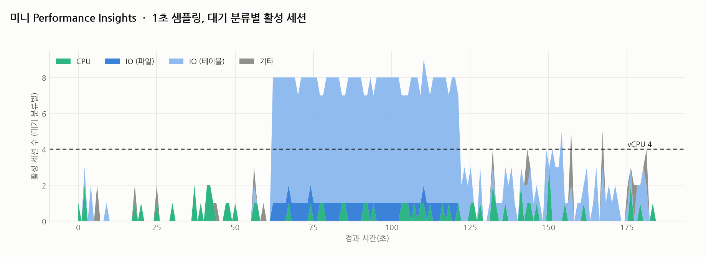

# R12 Performance Insights를 직접 만들어 검증하기

> 근거 등급: `E2`
> 출처: [AWS, Database load (Average Active Sessions)](https://docs.aws.amazon.com/AmazonRDS/latest/UserGuide/USER_PerfInsights.Overview.ActiveSessions.html) · [AWS, Pricing and data retention for Performance Insights](https://docs.aws.amazon.com/AmazonRDS/latest/UserGuide/USER_PerfInsights.Overview.cost.html) · [MySQL 8.4, Wait Event Summary Tables](https://dev.mysql.com/doc/refman/8.4/en/performance-schema-wait-summary-tables.html) · [MySQL 8.4, Pre-Filtering by Consumer](https://dev.mysql.com/doc/refman/8.4/en/performance-schema-consumer-filtering.html) · [Oracle 19c, V$ACTIVE_SESSION_HISTORY](https://docs.oracle.com/en/database/oracle/oracle-database/19/refrn/V-ACTIVE_SESSION_HISTORY.html)

## 1. 유명한 이유

RDS의 Performance Insights는 관리형 DB 관측의 표준 화면이었습니다. AWS는 콘솔을 2026년 7월 31일 자로 종료하고 CloudWatch Database Insights로 넘긴다고 공지했습니다. API는 그대로 유지되고, 7일 무료 보존과 1~24개월 유료 보존은 Database Insights의 Standard 모드로 같은 가격에 이어집니다. 화면이 어디로 가든 그 핵심 수식은 그대로입니다. AWS 문서가 서술하는 동작은 단순합니다. **매초, 쿼리를 실행 중인 세션을 샘플링해서 그 세션들이 무엇을 기다리는지(wait event)로 쪼갠다.** 그 평균이 DB Load(평균 활성 세션, AAS)입니다.

관리형 환경에서는 호스트에 들어가 perf를 돌릴 수 없으므로 이 화면이 사실상 유일한 병목 분해 도구입니다. 도구가 뭘 하는지 모르고 쓰면 화면을 오독합니다. 그래서 같은 루프를 직접 구현하고, 병목을 미리 정해 만든 워크로드에 대 봤습니다.

**이 세션에서 건진 것은 "샘플러가 정확했다"가 아니라 "화면에 뜬 이름을 그대로 믿으면 안 된다"입니다.** 행 락에 막힌 세션이 화면에는 IO로 나옵니다(3절, 4절). 반대로 CPU 구간의 검증은 성립하지 않았습니다(6절).

## 2. 재현

### 환경

| 항목 | 값 |
|---|---|
| 호스트 | **기록하지 않았습니다.** `uname -srm`·`nproc`·`free -g`가 없어 CPU 수, 메모리, 저장 장치를 확인할 수 없습니다 |
| 컨테이너 | MySQL 8.4.3, `cpus: 4`, `mem_limit: 2g`, 버퍼 풀 256MB, `max_connections=200` |
| 데이터 | `small` 10만 행, `hotrow` 1행, `big` 400만 행 약 1.1GB |
| 부하 생성기 | Python(CPython) + PyMySQL, 스레드 8개, 동기 드라이버 |
| 샘플러 | Python, 1초·0.1초 병행 |

`cpus: 4`는 컨테이너 할당량이지 호스트 코어 수가 아닙니다. 자세한 것은 [reproduce.md](reproduce.md)에 있습니다.

### 만든 것

`scripts/sampler.py`, 40줄짜리 미니 PI입니다. 매초 `performance_schema.threads`에서 활성 포그라운드 세션을 세고, `events_waits_current`의 진행 중 대기 이벤트(`END_EVENT_ID IS NULL`)로 분류합니다. 대기가 없는 활성 세션은 CPU로 칩니다(PI와 같은 해석).

분류는 이벤트 이름 접두어로 여섯 갈래입니다. `cpu`, `io_file`, `io_table`, `lock`, `synch`, 그리고 **어디에도 안 맞은 것을 담는 `other`**입니다.

### 검증용 워크로드

병목을 미리 정해 만든 3구간, 각 60초입니다. 같은 스레드 8개가 구간만 바꿔 가며 돕니다.

| 구간 | 부하 | 설계된 병목 |
|---|---|---|
| 1 | 버퍼 풀에 다 들어가는 테이블 PK 점조회 | CPU |
| 2 | 스레드 8개가 같은 행 1개 UPDATE | 행 락 |
| 3 | 버퍼 풀(256MB)보다 큰 1.1GB 테이블 무작위 점조회 | 디스크 IO |

### 먼저 만나는 함정: 소비자가 꺼져 있다

락에 막힌 세션 2개를 만들어 놓고 샘플러를 8초 돌리면, 기본 상태에서는 전부 CPU로 보입니다.

```
소비자 활성화 전:  활성 2  cpu=2  io_table=0  synch=0
소비자 활성화 후:  활성 2  cpu=0  io_table=1  synch=1
```

원인을 정확히 짚어야 합니다. `results/01-default-instruments.txt`를 보면 **계측(instrument)은 켜져 있었습니다.** 꺼져 있던 것은 소비자(consumer) 셋(`events_waits_current`, `events_waits_history`, `events_waits_history_long`)입니다. MySQL 문서는 "이벤트가 어느 목적지에도 전달되지 않으면 Performance Schema는 그 이벤트를 만들지 않는다"고 적습니다. 소비자가 `NO`면 `events_waits_current`가 비고, 샘플러의 LEFT JOIN이 NULL을 받고, NULL은 CPU로 분류됩니다.

`wait/synch/%`나 `wait/io/socket/%`처럼 기본이 꺼진 계측도 있으므로 `run-experiments.sh`는 계측과 소비자를 모두 켭니다.

## 3. 내부 원리: 행 락은 왜 락으로 안 보이는가

구간 2는 스레드 8개가 같은 행 하나를 UPDATE하는 행 락 경합인데, 분해 결과의 `lock` 열이 60초 내내 0입니다. 대기는 전부 `wait/io/table/sql/handler`, 즉 화면상 **IO(테이블)**로 잡힙니다.

계측 지점이 어디에 박혀 있느냐의 문제입니다.

- `wait/lock/%`는 **서버 계층**의 락 자리입니다. 테이블 락과 메타데이터 락이 여기 잡히고, InnoDB 행 락은 여기 없습니다.
- `wait/io/table/sql/handler`는 SQL 계층이 **핸들러 인터페이스로 스토리지 엔진에 행 접근을 요청한 구간 전체**를 하나의 이벤트로 감쌉니다.
- InnoDB 행 락 대기는 그 핸들러 호출 **안에서** 일어납니다. 바깥에서 보면 "핸들러를 부른 채 아직 안 돌아온 세션"이고, 그 이름이 `wait/io/table/sql/handler`입니다.

그래서 이름이 IO라고 디스크를 기다린 것이 아닙니다. 버퍼 풀 미스로 페이지를 읽는 중이어도 이 이름이고, 다른 트랜잭션의 락이 풀리기를 기다려도 이 이름입니다.

이건 이 클론의 버그가 아니라 **실제 RDS MySQL의 PI 화면에서도 똑같이 보이는 혼란**입니다. 락 경합 장애인데 화면 최상단 대기 이벤트가 `wait/io/table/sql/handler`라서 IO 문제로 오진하기 좋습니다.

## 4. 해소: data_lock_waits를 함께 센다

같은 이벤트 이름이 진짜 IO(구간 3)에서도 나오므로 이름만으로는 못 가릅니다. 판별용 프로브를 따로 만들었습니다(`scripts/lock-probe.py`). 같은 8스레드를 30초씩 두 구간으로 돌리면서 매초 두 값을 함께 셉니다.

```sql
SELECT
  (SELECT COUNT(*) FROM performance_schema.events_waits_current w
     JOIN performance_schema.threads t ON t.THREAD_ID = w.THREAD_ID
    WHERE w.EVENT_NAME = 'wait/io/table/sql/handler'
      AND w.END_EVENT_ID IS NULL
      AND t.PROCESSLIST_ID IS NOT NULL),
  (SELECT COUNT(*) FROM performance_schema.data_lock_waits)
```

**바꾼 것은 샘플러가 아니라 판독 절차입니다.** `wait/io/table/sql/handler`가 치솟는데 `data_lock_waits`도 같이 올라가 있으면 IO가 아니라 락으로 읽습니다. 이 테이블은 RDS에서도 그대로 읽히므로 PI 화면 옆에 두면 같은 판별이 됩니다.

대안으로 `SHOW ENGINE INNODB STATUS`나 `sys.innodb_lock_waits`를 쓰는 길도 있지만, **이 세션에서는 그 둘을 재지 않았습니다.**

## 5. 재계측



1초 샘플링, 각 구간 60샘플의 평균입니다.

| 구간 (설계된 병목) | CPU | IO(파일) | IO(테이블) | 락 | 내부 동기화 | 기타(미분류) | 6열 합 | 활성 세션 |
|---|---|---|---|---|---|---|---|---|
| 1: 점조회 (CPU) | 0.33 | 0.00 | 0.08 | 0.00 | 0.00 | **0.12** | 0.53 | 0.55 |
| 2: 핫 로우 (행 락) | 0.30 | 0.72 | **6.50** | 0.00 | 0.00 | 0.00 | 7.52 | 7.52 |
| 3: 콜드 조회 (IO) | 0.35 | 0.02 | **1.53** | 0.00 | 0.00 | 0.18 | 2.08 | 2.08 |

**`기타`는 분류기가 못 알아본 이벤트입니다. 이 열을 빼고 인용하지 마십시오.** 분류기 정확도를 검증하는 세션이라 미분류 비율이 결과의 일부입니다.

구간 1의 `6열 합`(0.53)과 `활성 세션`(0.55)이 어긋나는 것은 구현 탓입니다. `classify()`가 `idle`로 분류한 세션은 활성 세션 수에는 들어가고 여섯 열 어디에도 안 들어갑니다. 60샘플 중 1건입니다.

그림의 점선은 컨테이너 CPU 할당량 4입니다. 구간 2에서 AAS가 이 선을 넘어 7.5까지 가지만, **선을 넘었다고 CPU 경합인 것은 아닙니다.** 같은 구간의 CPU 열은 0.30입니다.

### 0.1초 샘플링과 1초 샘플링

두 샘플러를 같은 실행에서 동시에 돌렸습니다.

| 구간 | 간격 | 샘플 수 | CPU | IO(파일) | IO(테이블) | 락 | 내부 동기화 | 기타 | 활성 세션 |
|---|---|---|---|---|---|---|---|---|---|
| 1 | 1초 | 60 | 0.33 | 0.00 | 0.08 | 0.00 | 0.00 | 0.12 | 0.55 |
| 1 | 0.1초 | 594 | 0.32 | 0.00 | 0.04 | **0.01** | 0.00 | 0.12 | 0.50 |
| 2 | 1초 | 60 | 0.30 | 0.72 | 6.50 | 0.00 | 0.00 | 0.00 | 7.52 |
| 2 | 0.1초 | 588 | 0.28 | 0.69 | 6.47 | 0.00 | 0.00 | 0.02 | 7.46 |
| 3 | 1초 | 60 | 0.35 | 0.02 | 1.53 | 0.00 | 0.00 | 0.18 | 2.08 |
| 3 | 0.1초 | 594 | 0.39 | 0.03 | 1.59 | 0.00 | 0.01 | 0.14 | 2.16 |

열별 차이가 0.06 이내라 구조가 같습니다. 초 단위로 지속되는 병목에는 1초 샘플링으로 충분합니다. 다만 구간 1의 `락`이 1초에서 0, 0.1초에서 0.01이라 **드물고 짧은 대기는 1초 간격에서 통째로 빠집니다.**

### io/table이 락인지 IO인지

| 구간 | io/table 대기 세션 | data_lock_waits |
|---|---|---|
| 핫 로우 UPDATE (29샘플) | 평균 6.7 (6~7) | **평균 26.1 (21~28)** |
| 콜드 IO 조회 (29샘플) | 평균 0.9 (0~4) | **0 (29샘플 전부)** |

각 구간에서 1샘플씩 뺐습니다. 핫 로우의 첫 샘플(t=0.0)은 스레드 기동 전이라 0/0이고, 콜드의 첫 샘플(t=30.1)은 구간 전환 직후라 앞 구간의 락 대기 28건이 남아 있었습니다. 30샘플 전부로 계산하면 6.5/25.2와 1.1/0.9인데, **콜드 쪽 0.9는 전적으로 그 전환 샘플 하나 때문입니다.**

**PI 화면에서 `wait/io/table/sql/handler`가 치솟으면, IO 대시보드로 가기 전에 락 대기부터 확인해야 합니다.**

## 6. 예상과 달랐던 점

### 구간 1의 CPU 검증이 성립하지 않았습니다

`workload.py`의 `THREADS = 8`이 60초 내내 PK 점조회를 도는데 활성 세션이 **0.55**입니다. 스레드 하나가 쿼리 안에 있던 시간 비율이 약 7%라 **DB가 사실상 논 상태를 60초 동안 관측한 것**입니다.

CPython의 GIL과 PyMySQL 동기 드라이버 조합 때문에 부하 생성기가 DB를 못 채웠을 가능성이 크지만, 클라이언트를 프로파일링하지 않아 확정하지 못했습니다. 같은 8스레드가 구간 2에서 7.52를 만든 것이 방증입니다. 락이 세션을 DB 안에 붙잡아 두는 구간에서만 부하가 찼습니다.

**따라서 CPU 구간의 검증은 하지 못했습니다.** 표의 CPU 0.33은 표본이 얇아 분류기가 맞았다는 증거로 쓸 수 없습니다. sysbench나 k6 같은 도구로 부하 생성기를 다시 쓰거나 쿼리를 무겁게 만들어야 합니다. 남은 과제입니다.

### 구간 1에서 다섯 중 하나를 분류하지 못했습니다

구간 1의 `기타`가 0.12로, 같은 구간 활성 세션 0.55의 **21%**입니다. 0.1초 샘플러에서는 25%입니다. 구간 3에서도 8.8% 있습니다.

무엇이었는지는 **말할 수 없습니다.** 샘플러가 개수만 CSV에 쓰고 이벤트 이름을 안 남겼습니다. `wait/io/socket/%` 같은 것이 후보지만 확인하지 않은 추측입니다. 다음 회차에서 **미분류 이벤트의 이름을 기록해야 합니다.**

### 콜드 IO 구간의 AAS가 낮았습니다

버퍼 풀의 4배 넘는 테이블을 무작위로 읽는데도 활성 세션이 2.08입니다. **이 세션은 그 이유를 설명할 근거를 남기지 않았습니다.** 저장 장치를 기록하지 않았고 미스 한 번의 지연도 재지 않았습니다. 위의 부하 생성기 문제도 이 구간에 그대로 걸립니다.

R16(배치 캐시 오염)은 호스트를 macOS·NVMe로 기록했지만, **이 세션은 호스트를 기록하지 않아 같은 장비였는지 확인할 수 없습니다.**

### 구간 2에 IO(파일) 대기가 섞여 있습니다

핫 로우 구간에 `wait/io/file`이 평균 0.72 있습니다. UPDATE 커밋마다 나가는 리두 로그 동기화(fsync)로 보입니다. 다만 이벤트 이름 단위로 확인하지 않았으므로 워크로드 구조에서 나온 해석입니다.

## 관리형과 온프렘에서 달라지는 것

"활성 세션을 매초 샘플링해 대기 이벤트로 쪼갠다"는 발상은 AWS의 것이 아닙니다. Oracle의 ASH가 같은 아이디어이고, 문서는 `V$ACTIVE_SESSION_HISTORY`가 "활성 데이터베이스 세션의 스냅숏을 초당 한 번 담는다"고 적습니다. 활성의 정의도 "CPU 위에 있었거나 Idle 대기 클래스가 아닌 이벤트를 기다리고 있었으면 활성"으로 같습니다.

- **온프렘 Oracle**: AWR·ASH가 이미 있지만 Oracle 문서가 "Oracle Diagnostic Pack 라이선스가 필요하다"고 명시합니다. 공짜가 아닙니다.
- **온프렘 MySQL·PostgreSQL**: 벤더 화면이 없는 대신 **이 세션의 샘플러가 그대로 돕니다.** `performance_schema`나 `pg_stat_activity.wait_event_type`에 SQL을 던지는 40줄이라 폐쇄망에서도 같은 답이 나옵니다. 외부 통신이 없습니다.
- **관리형 RDS·Aurora**: 이 샘플러가 쓰는 것은 전부 SQL로 읽는 시스템 테이블이라 관리형에서도 그대로 돕니다. PI를 대체하는 것이 아니라 PI가 접어서 보여 주는 것을 펴서 확인하는 용도입니다.

관리형이 진짜로 바꾸는 것은 도구의 선택지가 아니라 **호스트 계층 관측을 아예 포기해야 한다**는 쪽입니다. 이 샘플러도 DB 안에서 보이는 것까지만 봅니다.

### 비용 (AWS 공식 문서·요금 페이지 기준)

- **무료 범위**: 성능 데이터 7일 롤링 보존, 월 API 호출 100만 건.
- **유료 범위**: 1개월 이상 보존은 프로비저닝 인스턴스 vCPU당 월 과금, Aurora Serverless v2는 ACU당 월 과금. API는 100만 건 초과분이 1,000건당 0.01달러.
- **2026-07-31 이후**: 7일 무료는 Database Insights Standard 모드에서 그대로 무료, 1~24개월 유료 보존도 Standard 모드의 유연 보존으로 같은 가격. 실행 계획 캡처와 온디맨드 분석은 Advanced 모드 전용이 되고, Advanced는 프로비저닝 vCPU시간당 0.0125달러, Aurora Serverless v2 ACU시간당 0.003125달러. 보존 기간 단위에서 시간 단위로 축이 바뀝니다.
- **직접 만들면**: 샘플러 컴퓨트, 초당 한 행씩 쌓이는 시계열 저장소와 보존 정책, 화면과 알림이 듭니다. 이 세션은 CSV에 쓰고 끝냈으므로 **셋 중 어느 비용도 재지 않았습니다.**

## 못 한 것

- **CPU 구간의 검증을 못 했습니다.** 부하 생성기가 DB를 못 채워 구간 1의 활성 세션이 0.55였습니다.
- **미분류 이벤트의 정체를 모릅니다.** 구간 1에서 활성 세션의 21%가 `other`인데 이름을 안 남겼습니다.
- **호스트를 기록하지 않았습니다.** `uname -srm`, `nproc`, `free -g`, 저장 장치가 전부 없어 다른 세션과 시간을 비교할 수 없습니다.
- **실제 PI 화면과의 나란한 대조는 못 했습니다.** RDS 인스턴스 없이 로컬 재현만 했습니다.
- **SQL 차원 분해(top SQL)는 구현하지 않았습니다.** `events_statements_current` 조인이 더 필요합니다.
- **샘플링 오버헤드를 정밀 측정하지 않았습니다.** 그 관찰 자체가 DB가 안 찬 상태에서 나온 것이라 신뢰도가 낮습니다.
- **락 판별의 대안을 재지 않았습니다.** `SHOW ENGINE INNODB STATUS`, `sys.innodb_lock_waits`와 비교하지 않았습니다.
- **비용을 재지 않았습니다.** 위 요금은 공식 문서 인용이고 직접 만든 스택의 운영 비용은 계산하지 않았습니다.
