# R13 라이브 후원 카운터의 핫 로우, 슬롯 카운터로 해소

> 근거 등급: `E2`
> 출처: [PlanetScale, The Slotted Counter Pattern](https://planetscale.com/blog/the-slotted-counter-pattern)

## 1. 유명한 이유

라이브 방송의 후원 총액처럼 "하나의 대상에 대한 누적 합계"를 테이블 한 행으로 두면, 그 행이 통째로 병목이 됩니다. PlanetScale은 이 상황을 여러 트랜잭션이 같은 행을 갱신하느라 사실상 직렬로 실행된다고 설명하고, 해법으로 슬롯 카운터 패턴을 제시합니다. 카운터 한 행을 슬롯 여러 행으로 쪼개 갱신을 흩고, 읽을 때만 `SUM`으로 합치는 방식입니다.

이 세션은 특정 회사의 공개 장애 보고서를 재현하지 않습니다. 벤더가 전용 문서를 낼 만큼 반복되는 함정이라서 등급을 `E2`로 둡니다.

다루는 범위는 패턴 소개보다 넓습니다. 실무에서 이 문제는 두 단계를 거쳐 드러납니다.

1. 처음에는 값이 **틀립니다.** JPA로 엔티티를 읽어 더하고 저장하는, 가장 자연스러워 보이는 코드가 후원을 소리 없이 잃습니다. 예외도 없고 실패율도 0%라서 부하 테스트 결과만 보면 이 구현이 가장 좋아 보입니다.
2. 정확하게 고치고 나면 그때 느려집니다. 락으로 막든 원자적 UPDATE로 바꾸든, 갱신이 한 행에 몰리는 구조는 그대로이기 때문입니다.

그래서 카운터 갱신 방식을 아홉 가지로 구현해 같은 조건에서 재고, 처리량과 함께 **정합성**을 항상 같이 봤습니다. 처리량만 비교하면 틀린 구현이 우승합니다.

## 2. 재현

### 환경

| 항목 | 값 |
|---|---|
| 호스트 | macOS 26.3.1, Apple M2 Pro, 12코어, 32GB |
| DB | MySQL 8.4.3 (컨테이너 `--cpus=4 --memory=2g`, 버퍼 풀 1GB, `innodb_flush_log_at_trx_commit=1`) |
| 캐시 | Redis 7.4.9 |
| 앱 | Spring Boot 3.4.1, Java 21, Tomcat 스레드 200, HikariCP 64 |
| 부하 | k6 v1.6.1, VU 100, 60초, 워밍업 20초 별도 |

DB 컨테이너에 CPU와 메모리 상한을 건 이유는, 상한이 없으면 호스트의 12코어를 다 쓰면서 경합이 흐려지기 때문입니다. `innodb_flush_log_at_trx_commit=1`은 커밋마다 디스크에 동기화하는 기본값입니다. 이 값을 낮추면 숫자는 좋아지지만 실제 결제성 워크로드와 멀어져 그대로 뒀습니다.

### 부하 분포와 데이터 감사

후원이 방송에 균등하게 뿌려지면 이 문제는 재현되지 않습니다. 실제 라이브 플랫폼의 후원은 소수 방송에 쏠리고, 그 쏠림이 곧 핫 로우입니다. 그래서 방송 1,000개에 Zipf(s=1.2) 분포를 씌웠습니다. 금액도 한 값으로 고정하지 않았습니다. 95%는 100원에서 1,000원 사이 소액, 5%는 1만 원에서 5만 9천 원 사이 고액입니다. 금액이 전부 같으면 유실 금액과 유실 건수가 비례해서, 어느 쪽이 깨졌는지 구분이 되지 않습니다.

이건 부하 스크립트의 의도이고, 의도대로 들어갔는지는 별개 문제입니다. 그래서 적재된 원장 233,929건을 그대로 집계해 감사했습니다.

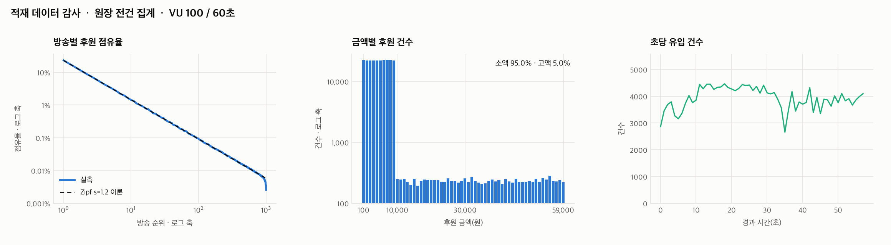

| 검증 항목 | 실측 | 의도 |
|---|---|---|
| 1위 방송 점유율 | 23.2% | Zipf(1.2) 이론값 23.1% |
| 상위 10개 방송 점유율 | 56.9% | 이론값 56.9% |
| 소액 건수 비중 | 95.0% | 95% |
| 초당 유입 변동계수 | 10.5% | 균일 유지 |

건수로 5.0%인 고액 후원이 금액으로는 76.9%를 차지합니다. 유실이 "몇 건"이냐와 "얼마"냐가 다른 문제가 되는 이유입니다.

### 아홉 변형

| 변형 | 구현 |
|---|---|
| `jpa-naive` | `findById`로 읽고 필드를 더한 뒤 더티 체킹으로 저장 |
| `jvm-lock` | 위와 같되 방송별 `synchronized`로 감쌈. 스케일 아웃 함정을 보이기 위한 변형 |
| `jpa-optimistic` | `@Version` 낙관적 락, 충돌하면 트랜잭션 밖에서 재시도 |
| `jpa-pessimistic` | `PESSIMISTIC_WRITE`로 읽기 전에 X락 획득 |
| `atomic` | 읽지 않고 `UPDATE ... SET x = x + ?` 한 문장 |
| `slot16` / `slot64` | 방송당 슬롯 16개 또는 64개 중 하나를 `ON DUPLICATE KEY UPDATE` |
| `redis` | 카운터는 `HINCRBY`, 원장은 DB, 2초마다 DB 반영 |
| `redis-pipe` | 위와 같되 두 명령을 파이프라인으로 묶음 |

모든 변형이 `sponsor_log` 원장에 후원 한 건을 그대로 INSERT합니다. 이 원장이 정답지입니다. 측정이 끝나면 원장 합계와 카운터 합계를 대조해 한 건이라도 어긋나면 `match: false`로 표시합니다.

### 증상

`jpa-naive`로 60초를 재면 이렇게 나옵니다.

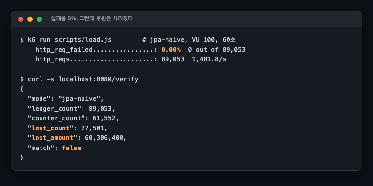

실패율 0%, 전 요청 HTTP 200. 그런데 원장에는 89,053건이 있고 카운터는 61,552건만 셌습니다. 27,501건, 6,030만 원어치 후원이 흔적 없이 사라졌습니다(회차 1 기준이고, 3회 반복에서 유실률은 30.87~30.99%로 붙습니다). 모니터링이 처리량과 에러율만 본다면 이 서버는 아주 건강해 보입니다.

## 3. 내부 원리

### 왜 조용히 사라지는가

`jpa-naive`가 하는 일을 SQL로 펴면 이렇습니다.

```sql
SELECT total_amount FROM live_counter WHERE live_id = 1;   -- 5,000을 읽음
-- (다른 트랜잭션이 여기서 5,000 → 8,000으로 커밋)
UPDATE live_counter SET total_amount = 8000 WHERE live_id = 1;  -- 5,000 + 3,000
```

두 트랜잭션이 같은 값을 읽고 각자 더한 결과를 씁니다. 나중에 쓴 쪽이 이기고, 먼저 쓴 쪽의 후원은 없던 일이 됩니다. 이것이 갱신 유실입니다.

핵심은 **아무 예외도 나지 않는다**는 점입니다. 두 UPDATE 모두 성공하고, HTTP는 200을 반환하고, 실패율은 0%입니다. 코드는 정상 동작을 보고하고 돈만 사라집니다. 그래서 부하 테스트에 정합성 검증이 없으면 이 구현이 1등으로 보입니다.

기본 격리 수준인 REPEATABLE READ가 막아주지 않느냐는 반문이 나올 수 있습니다. REPEATABLE READ는 트랜잭션 안에서 같은 SELECT가 같은 결과를 보게 해줄 뿐, 읽은 값을 애플리케이션이 가공해서 쓰는 것까지 보호하지 않습니다. 잠금 없는 읽기는 스냅샷을 보고, 쓰기는 현재 행에 나갑니다.

### 왜 정확하게 고치면 느려지는가

정확한 구현들은 결국 같은 행에 직렬로 접근합니다.

- `jpa-pessimistic`은 `SELECT ... FOR UPDATE`로 X락을 잡고 커밋까지 들고 있습니다. 그동안 같은 방송의 다른 후원은 전부 대기합니다.
- `atomic`은 읽기를 없앴지만, UPDATE 자체가 행 X락을 잡습니다. 락을 잡는 구간이 짧아졌을 뿐 한 행에 몰리는 것은 같습니다.
- `jpa-optimistic`은 락을 안 잡는 대신 충돌하면 되감습니다. 경합이 심할수록 되감는 횟수가 폭증하고, 되감은 트랜잭션은 원장 INSERT까지 통째로 다시 합니다.

슬롯 카운터는 이 전제를 바꿉니다. 방송 하나의 카운터를 슬롯 N개로 쪼개면 같은 방송에 몰린 후원도 서로 다른 행을 건드립니다. 한 행 앞에 서 있던 줄이 N개의 줄로 흩어지므로, 뒤에 선 요청이 기다려야 하는 앞사람 수가 줄어듭니다. 실측에서는 요청 하나가 겪는 대기 횟수와 대기 시간이 둘 다 줄었고, 줄어든 폭은 시간 쪽이 훨씬 컸습니다. 그 수치는 5절에 있습니다.

대가는 읽기입니다. 총액을 알려면 `SUM(total_amount)`으로 슬롯 N개를 훑어야 합니다. 그 비용이 실제로 얼마인지도 5절에서 쟀는데, 결과는 예상과 달랐습니다.

## 4. 해소

고칠 방법은 여러 개고, 각각이 포기하는 것이 다릅니다.

| 방법 | 정확한가 | 무엇을 포기하는가 | 언제 고르나 |
|---|---|---|---|
| JVM 락 | 인스턴스 1대에서만 | 스케일 아웃하는 순간 유실이 재발합니다 | 고르면 안 됩니다. 단일 인스턴스 테스트를 통과해 버려서 오히려 위험합니다 |
| 낙관적 락 + 재시도 | 예 | 경합이 심하면 되감기가 폭증하고 결국 재시도를 소진해 실패합니다 | 충돌이 드문 도메인. 카운터에는 맞지 않습니다 |
| 비관적 락 | 예 | 락을 잡은 채 커밋까지 가므로 대기가 길어집니다 | 카운터 갱신 외에 같은 행을 읽고 판단해야 할 때 |
| 원자적 UPDATE | 예 | 갱신 전 값을 애플리케이션이 알 수 없습니다 | 단순 증감이면 가장 먼저 검토할 기본값 |
| 슬롯 카운터 | 예 | 읽을 때 `SUM`이 필요하고 테이블이 하나 늘어납니다. 노드는 늘지 않고 카운터와 원장이 같은 트랜잭션에 남습니다 | 한 대상에 쓰기가 몰리는 것이 확실할 때 |
| Redis 카운터 | 조건부 | 원장과 카운터가 서로 다른 저장소에 있어 반영 주기만큼 어긋나고, 운영할 노드가 하나 늘어납니다 | 실시간 노출이 중요하고 약간의 지연을 허용할 때 |

### 원자적 UPDATE를 먼저 두는 이유

`UPDATE ... SET total = total + ?`는 코드 한 줄이면서 갱신 유실을 완전히 없앱니다. 읽기와 쓰기 사이에 틈이 없기 때문입니다. 슬롯 카운터는 테이블과 집계 쿼리를 추가로 요구하므로, 원자적 UPDATE로 감당이 되는 규모에서 미리 꺼낼 이유가 없습니다.

이 실험에서도 원자적 UPDATE는 정합성을 지키면서 비관적 락보다 빠릅니다. 다만 한 행이 받아낼 수 있는 상한이 있습니다. 이 환경에서 방송 하나에 전량이 몰렸을 때 원자적 UPDATE의 상한은 초당 740건이었습니다(5절 hotspot). 슬롯은 그 상한에 부딪힌 뒤에 꺼내는 카드입니다.

### 목표 부하를 놓고 슬롯 수를 고르는 법

슬롯 16과 64 중 무엇을 고를지는 나눗셈으로 정합니다. 필요한 값은 두 개입니다. 한 행이 받아내는 상한과, 그 카운터 하나에 몰릴 것으로 보는 최대 부하입니다.

이 환경의 상한은 이렇게 나왔습니다. 전량이 방송 하나로 몰린 hotspot에서 원자적 UPDATE가 740 req/s, 1위 방송이 23%를 가져가는 zipf에서는 1,338 req/s입니다. 목표 부하가 이 아래라면 슬롯을 꺼낼 이유가 없습니다.

그 위가 필요하면 슬롯입니다. 다만 나눗셈은 하한만 줍니다. 4,000 req/s를 740으로 나누면 슬롯 여섯 개면 될 것 같지만, 실측에서 슬롯 16은 hotspot에서 2,747 req/s에 그쳤습니다. 슬롯을 늘려도 원장 INSERT, 커넥션 풀, 호스트 CPU가 함께 걸리기 때문입니다. 같은 hotspot에서 카운터를 아예 DB 밖으로 뺀 Redis 파이프라인이 4,570 req/s였으니, 이 환경의 천장은 슬롯 64(3,981 req/s) 부근에서 카운터가 아니라 앱과 호스트 쪽으로 넘어갑니다.

그래서 이 숫자를 그대로 가져다 쓰면 안 됩니다. 옮길 수 있는 것은 절차입니다. 자기 환경에서 한 행의 상한을 먼저 재고, 목표 부하를 그 상한으로 나눠 슬롯 수의 하한을 잡고, 하한보다 넉넉하게 잡은 뒤 실측으로 확인하는 순서입니다.

### JPA를 쓰면서 원자적 UPDATE를 섞을 때 주의할 것

`@Modifying` 네이티브 쿼리는 영속성 컨텍스트를 거치지 않습니다. 같은 트랜잭션에서 그 엔티티를 이미 읽어 뒀다면, 1차 캐시에는 옛 값이 남습니다. 이 실험은 갱신 후 그 값을 다시 읽지 않아 문제가 없었지만, 읽어야 한다면 `@Modifying(clearAutomatically = true)`가 필요합니다.

### Redis를 쓸 때 포기하는 것

Redis 변형은 카운터를 Redis에서 올리고 2초마다 DB로 옮깁니다. 이 구조에서 DB의 카운터는 항상 최대 2초 옛날 값입니다.

반영은 절대값 덮어쓰기로 만들었습니다. 델타를 더하는 방식이면 반영이 두 번 돌 때 같은 금액이 두 번 들어가지만, 절대값을 덮어쓰면 몇 번 돌아도 결과가 같습니다.

원장은 DB에 그대로 남깁니다. Redis가 죽어도 "누가 언제 얼마"를 답할 수 있어야 하고, 카운터는 원장에서 언제든 다시 만들 수 있기 때문입니다. 그 복구가 실제로 되는지는 5절 끝에서 실행으로 확인합니다.

### 6%를 위해 노드를 하나 더 둘 것인가

처리량만 보면 Redis가 이깁니다. zipf에서 슬롯 64가 4,051 req/s, Redis 파이프라인이 4,294 req/s로 6% 차이입니다. hotspot에서는 3,981과 4,570으로 15%까지 벌어집니다.

그런데 두 선택지가 요구하는 것이 다릅니다. 슬롯은 쓰던 DB에 테이블 하나를 더하는 일이라 노드가 늘지 않습니다. 관리 대상도, 이중화 대상도, 장애가 났을 때 확인할 곳도 그대로입니다. 카운터와 원장이 같은 트랜잭션 안에 남아서 정합성 검증이 SQL 한 문장으로 끝납니다.

Redis는 노드가 하나 더 생깁니다. 요금만이 아니라 이중화, 백업, 모니터링, 장애 대응이 함께 붙습니다. 카운터와 원장이 서로 다른 저장소에 있으니 정합성은 반영 주기만큼 항상 어긋나 있고, 노드가 날아가면 재구축이 필요합니다(5절에서 331ms로 확인했습니다). 구체적인 금액은 인스턴스 클래스와 리전에 따라 달라져 여기에 적지 않습니다.

정리하면 6%에서 15% 사이의 처리량 차이를 사는 대가가 운영 대상 하나입니다. 실시간 노출 때문에 Redis가 이미 서 있다면 그 위에 얹는 것이 자연스럽지만, 이 카운터 하나 때문에 Redis를 새로 들이는 결정이라면 슬롯이 먼저입니다.

### 같은 구조가 증권 시스템에 있는 곳

라이브 후원은 예시일 뿐이고, 구조는 종목별 체결수량과 체결대금 누적에 그대로 있습니다. 한 종목의 누적 행에 체결이 몰리고, 거래는 인기 종목 몇 개에 쏠립니다. 이 세션이 씌운 zipf 분포가 그 모양입니다. 계좌 잔고 갱신도 한 행에 갱신이 몰린다는 점에서는 같습니다. 다만 잔고에는 슬롯을 그대로 얹기 어렵습니다. 후원 누적은 더하기만 하면 되지만 잔고는 "음수가 되면 안 된다"를 갱신하는 그 순간 확인해야 하고, 값이 슬롯 N개에 흩어져 있으면 그 확인이 매번 `SUM` 한 번을 요구하기 때문입니다. 슬롯이 잘 맞는 자리에는 "쓰기만 몰리고 읽기는 드문 누적값"이라는 조건이 붙습니다.

## 5. 재계측

모든 수치는 같은 바이너리, 같은 환경, VU 100 / 60초 / 워밍업 20초 조건입니다. zipf는 변형당 3회 반복의 중앙값이고 범위를 함께 적습니다. 뒤의 hotspot 표는 2회이고 아홉 변형 중 일곱만 돌았습니다(낙관적 락과 Redis 없음).

### zipf 시나리오 (방송 1,000개, 1위 방송에 23% 쏠림)

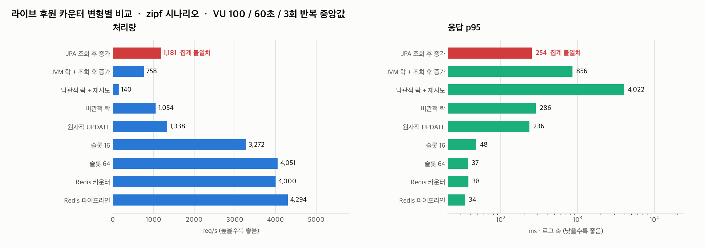

| 변형 | req/s (범위) | p95 | p99 | 실패율 | 유실 | 정합 |
|---|---|---|---|---|---|---|
| JPA 조회 후 증가 | 1,181 (1,178~1,482) | 254ms | 284ms | 0% | 21,913~27,501건 (30.9%), 4,883만~6,030만원 | 깨짐 |
| JVM 락 + 조회 후 증가 | 758 (726~967) | 856ms | 1,061ms | 0% | 0 | 정합 |
| 낙관적 락 + 재시도 | 140 (139~165) | 4,022ms | 4,533ms | 10.12% | 0 | 정합 |
| 비관적 락 | 1,054 (988~1,260) | 286ms | 328ms | 0% | 0 | 정합 |
| 원자적 UPDATE | 1,338 (1,253~1,525) | 236ms | 270ms | 0% | 0 | 정합 |
| 슬롯 16 | 3,272 (2,894~3,921) | 48ms | 63ms | 0% | 0 | 정합 |
| 슬롯 64 | 4,051 (3,415~4,179) | 37ms | 51ms | 0% | 0 | 정합 |
| Redis 카운터 | 4,000 (3,416~4,021) | 38ms | 56ms | 0% | 0 | 정합 |
| Redis 파이프라인 | 4,294 (3,356~4,439) | 34ms | 43ms | 0% | 0 | 정합 |

정확한 DB 구현 중 가장 빠른 원자적 UPDATE(1,338 req/s)와 슬롯 64(4,051 req/s)의 차이가 3.0배입니다. 낙관적 락은 정확하지만 재시도 79,506회를 치르고 140 req/s로 무너졌고, 그마저 10.12%는 재시도 50회를 소진하고 실패했습니다.

이 50에는 근거가 없습니다. `application.yml`의 `OPTIMISTIC_RETRY` 기본값으로 정한 임의값이고, 백오프도 없이 실패하면 곧바로 다시 시도합니다. 상한과 백오프를 바꾸면 실패율과 처리량이 같이 움직이므로, 낙관적 락 행은 "이 설정에서의 값"으로만 읽어야 합니다.

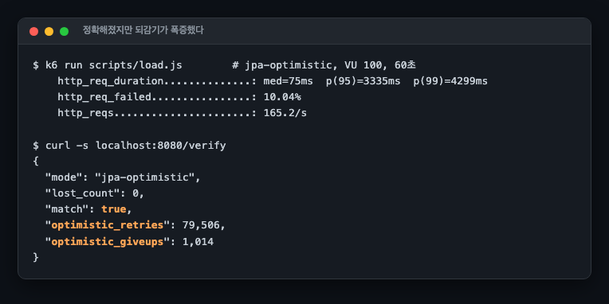

### 원인 지표: 행 락 대기

처리량은 결과이고 락 대기가 원인입니다. 측정 구간의 `Innodb_row_lock_waits`와 `Innodb_row_lock_time` 증가분을 받아 적었습니다.

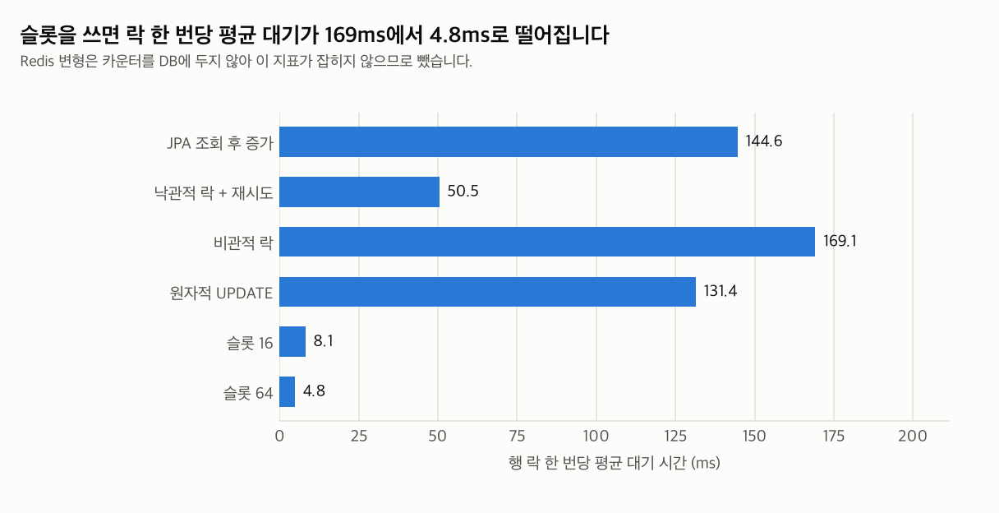

여기서 절대 횟수를 그대로 비교하면 안 됩니다. 같은 60초 동안 슬롯 16은 196,425건을 처리했고 원자적 UPDATE는 80,432건을 처리했습니다. 처리량이 2.4배 다른 두 조건의 대기 횟수를 나란히 놓으면 슬롯이 더 많이 기다린 것처럼 보입니다. 요청 하나가 감당한 몫으로 나눠야 비교가 성립합니다.

| 변형 | 처리 요청 | 대기 횟수 | 요청당 대기 횟수 | 요청당 대기 시간 |
|---|---|---|---|---|
| 원자적 UPDATE | 80,432 | 25,367 | 0.315회 | 41.1ms |
| 슬롯 16 | 196,425 | 28,318 | 0.144회 | 1.23ms |
| 슬롯 64 | 243,133 | 8,822 | 0.036회 | 0.173ms |

정규화하면 결론이 뒤집힙니다. 슬롯 16은 요청당 대기 횟수가 원자적 UPDATE의 절반 아래이고, 요청당 총 대기 시간은 33분의 1입니다. 슬롯 64는 200분의 1 아래로 내려갑니다. 줄어든 것은 대기 시간만이 아니라 대기 횟수와 대기 시간 양쪽이고, 폭이 크게 다를 뿐입니다.

표의 세 행은 각 변형의 중앙값 실행(`atomic-r3`, `slot16-r2`, `slot64-r1`) 하나에서 가져온 값이라 요청 수와 대기 횟수가 같은 실행에서 나옵니다. 실행별로 따로 나눠도 방향은 같습니다. 요청당 대기 횟수는 원자적 UPDATE가 0.314~0.316회, 슬롯 16이 0.139~0.144회, 슬롯 64가 0.036~0.037회로 범위가 겹치지 않습니다.

한 번의 대기 자체도 짧아졌습니다. 위 그림의 131ms에서 8ms로, 한 행 앞에 서 있던 줄이 16개로 흩어지면서 줄 하나가 짧아진 것입니다.

### hotspot 시나리오 (후원 전량이 방송 1개로)

인기 방송 하나에 후원이 몰리는 순간의 상한을 쟀습니다. 2회 반복 중앙값입니다.

| 변형 | req/s | p95 | 유실 | 정합 |
|---|---|---|---|---|
| JPA 조회 후 증가 | 717 | 156ms | 43,010건 (98.4%), 9,726만원 | 깨짐 |
| JVM 락 + 조회 후 증가 | 349 | 543ms | 0 | 정합 |
| 비관적 락 | 588 | 189ms | 0 | 정합 |
| 원자적 UPDATE | 740 | 152ms | 0 | 정합 |
| 슬롯 16 | 2,747 | 68ms | 0 | 정합 |
| 슬롯 64 | 3,981 | 38ms | 0 | 정합 |
| Redis 파이프라인 | 4,570 | 30ms | 0 | 정합 |

쏠림이 극단으로 가면 `jpa-naive`는 후원의 98.4%를 잃습니다. 100명이 같은 값을 읽고 각자 더해 쓰면 마지막 한 명만 남는 구조라, 쏠릴수록 유실률이 동시성 수준까지 올라갑니다. 원자적 UPDATE는 740 req/s가 상한인데 슬롯 64는 3,981 req/s로 5.4배입니다.

정규화한 대기 지표는 여기서 더 선명합니다. 원자적 UPDATE는 두 실행 모두 요청당 대기 횟수가 1.000회입니다(44,127건 중 44,126회, 44,830건 중 44,829회). 예외 없이 모든 요청이 한 번씩 줄을 섰다는 뜻입니다. 슬롯 16은 0.84회, 슬롯 64는 0.42회입니다. 요청당 총 대기 시간은 순서대로 83.4ms, 13.9ms, 2.7ms입니다.

### 슬롯의 대가: 읽기 비용

쓰기와 다른 조건입니다. VU 50으로 30초 동안 방송 1번의 총액만 반복 조회했습니다(`scripts/run-read.sh`의 `VUS=50`, `DURATION=30s`, `SCENARIO=hotspot`). 앞서 30초 동안 같은 zipf 부하로 데이터를 채운 뒤 읽기만 쟀고, 그 시점에 방송 1번의 슬롯은 각각 16행과 64행이 모두 차 있었습니다(`results/read/*.rows.txt`). 채우는 시간은 같았지만 변형별 쓰기 처리량이 달라 원장 크기는 4.7만~12.8만 건으로 달랐습니다. 조회 쿼리는 원장을 읽지 않습니다.

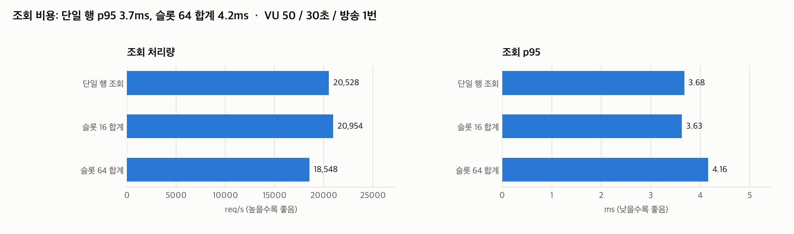

| 조회 방식 | 훑는 행 | req/s | 중앙값 | p95 |
|---|---|---|---|---|
| 단일 행 | 1 | 20,528 | 2.25ms | 3.68ms |
| 슬롯 16 합계 | 16 | 20,954 | 2.21ms | 3.63ms |
| 슬롯 64 합계 | 64 | 18,548 | 2.46ms | 4.16ms |

예상보다 훨씬 쌉니다. 슬롯 16은 단일 행과 구분되지 않고 슬롯 64도 p95 기준 0.5ms 차이입니다. `(live_id, slot)` 복합 PK라 한 방송의 슬롯들이 클러스터드 인덱스에서 붙어 있어, 64행을 훑어도 페이지 한두 개 안에서 끝나기 때문입니다.

### 인스턴스를 2대로 늘리면

JVM 락 변형은 단일 인스턴스에서 유실 0건으로 정확합니다. 같은 코드를 두 대로 늘리고 같은 부하를 나눠 보냈습니다.

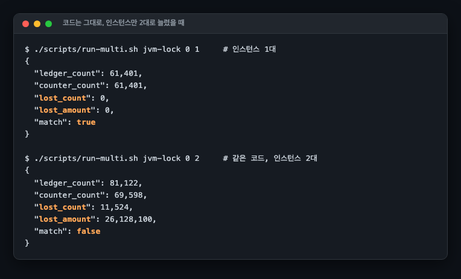

| 구성 | req/s | 유실 | 정합 |
|---|---|---|---|
| JVM 락, 1대 | 1,019 | 0 | 정합 |
| JVM 락, 2대 | 1,347 | 11,524건 (14.2%), 2,613만원 | 깨짐 |
| 락 없음, 2대 | 1,507 | 28,005건 (30.9%) | 깨짐 |
| 원자적 UPDATE, 2대 | 1,610 | 0 | 정합 |

자물쇠가 JVM 힙 안에 있으니 다른 프로세스에는 보이지 않습니다. 개발 환경과 스테이징(보통 1대)을 통과하고 스케일 아웃하는 순간 터지는 유형입니다. 같은 조건에서 원자적 UPDATE는 2대에서도 유실 0건입니다. 조정을 DB가 하기 때문입니다.

### Redis가 통째로 날아가면

부하 20초 지점에 `docker kill`로 Redis를 죽이고 35초에 빈 상태로 되살렸습니다.

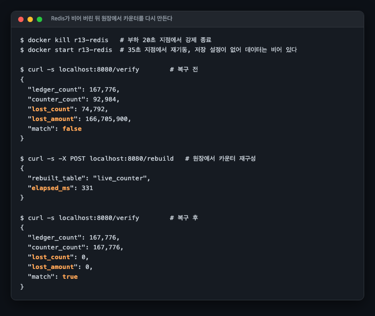

죽어 있던 구간과 날아간 카운터만큼 74,792건, 1억 6,670만 원이 비었지만, 원장 167,776건에서 카운터를 다시 만드는 데 331ms가 걸렸고 유실은 0이 됐습니다. 4절에서 카운터는 원장에서 언제든 다시 만들 수 있다고 적은 주장의 실행 증명입니다.

### 관리형 DB에서는 무엇이 달라지는가

이 세션은 컨테이너 MySQL에서 쟀지만, 이 세션이 속한 트랙의 전제는 RDS와 Aurora입니다. 관리형으로 옮기면 네 가지가 달라집니다.

- **원인 지표는 그대로 보입니다.** 호스트에 들어가지 못해도 `Innodb_row_lock_waits`와 `Innodb_row_lock_time`은 `SHOW GLOBAL STATUS`로 조회됩니다. 위에서 한 정규화, 그러니까 두 값을 같은 구간의 요청 수로 나누는 일을 관리형에서도 그대로 할 수 있습니다. Performance Insights를 켜 두면 같은 경합이 대기 이벤트 쪽에서도 잡힙니다.
- **슬롯은 인스턴스 클래스를 건드리지 않습니다.** 테이블 하나가 늘어날 뿐이라 노드 수도 인스턴스 클래스도 그대로입니다. Redis 쪽 대안은 ElastiCache 노드가 새로 생깁니다.
- **I/O 과금은 재지 않았습니다.** 슬롯 테이블은 행 수가 방송 수 곱하기 슬롯 수로 늘어나므로 갱신이 닿는 페이지도 늘어납니다. Aurora Standard처럼 I/O를 건수로 과금하는 구성에서 이 증가가 청구서에 어떻게 잡히는지는 이 세션에서 확인하지 않았습니다.
- **읽기를 복제본으로 돌리면 `SUM`이 뒤처집니다.** 아래 "못 한 것"에 적었습니다.

`innodb_flush_log_at_trx_commit`은 RDS에서 파라미터 그룹으로 바꾸는 값이고 기본값이 1입니다. 이 실험도 1로 뒀습니다. 이 값을 0이나 2로 낮추면 카운터 갱신의 처리량은 올라가지만, 그건 카운터 설계를 고친 것이 아니라 내구성을 판 것입니다.

## 6. 슬롯이 복제본에 물리는 비용

`scripts/run-replica.sh`, 원문은 `results/replica.txt`. 원본과 복제본을 GTID 기반
(`SOURCE_AUTO_POSITION=1`)으로 붙이고 복제본은 `read-only` 로 두었습니다. 같은 부하
(VU 100, 30초, 방송 1,000개 zipf)를 두 조건에 줍니다.

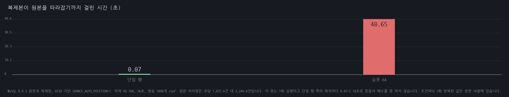

| 조건 | 원본 처리량 | 부하 직후 뒤처진 금액 | `Seconds_Behind_Source` | 따라잡기까지 |
|---|---|---|---|---|
| 단일 행 | 초당 1,037.6건 | 0 | 1초 | **0.07초** |
| 슬롯 64 | 초당 3,240.0건 | 179,586,000 | 24초 | **40.65초** |

처리량은 3.1배인데 따라잡는 시간은 두 자릿수 배입니다. 이 표는 1회 실행이고 단일 행 쪽 값이 회차마다 크게 흔들리므로 여기서 배수를 못 박지 않습니다(뒤에서 3회 반복으로 다시 잽니다). 이유가 두 겹입니다. 원본이 3배 쓰면
binlog도 3배 나오고 복제본은 SQL 스레드 하나로 적용합니다. 그리고 슬롯은 같은 금액을 더
많은 행에 흩으므로 행 단위 이벤트 수 자체가 늘어납니다. **원본에서 이득이던 분산이
복제본에서는 부담이 됩니다.**

판정을 `Seconds_Behind_Source` 하나에 걸지 않았습니다. 단일 행 조건에서 1초로 찍혔는데 실제 따라잡기는 0.07초였습니다. 초 단위이고 SQL 스레드가 방금 적용한 이벤트의 타임스탬프로
계산되기 때문입니다.

## 7. 슬롯 수를 자동으로 정하기

`mode=slot-auto`. 방송별 누적 쓰기가 `lab.auto-step`(200건)을 넘을 때마다 그 방송의 슬롯
수를 두 배로 키우고 상한은 `lab.slots` 입니다. 줄이지는 않습니다. 이미 값이 든 슬롯 행을
지울 수 없고 읽기가 `SUM` 이라 남겨 두어도 정합성에 영향이 없습니다.

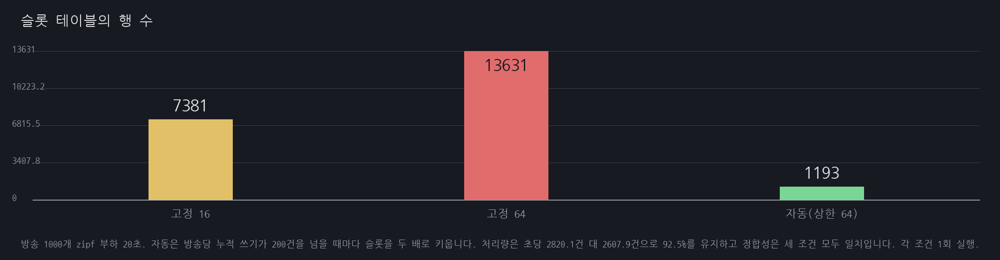

| 조건 | 처리량 | 슬롯 테이블 행 수 | 정합성 |
|---|---|---|---|
| 고정 16 | 초당 2,711.5건 | 7,381 | 일치 |
| 고정 64 | 초당 2,820.1건 | 13,631 | 일치 |
| **자동 (상한 64)** | 초당 2,607.9건 | **1,193** | 일치 |

자동이 배정한 슬롯 수 분포입니다. 슬롯 1개 959방송, 2개 13, 4개 8, 8개 4, 16개 3, 32개 1,
**64개 1**. zipf 라 인기 방송 하나만 상한을 받았습니다. **행 수를 11.4배 줄이며 처리량
92.5%를 유지합니다.**

처리량이 7.5% 낮은 것은 요청마다 방송별 누적 쓰기를 하나 올리는 비용과, 슬롯 하나만 받은
방송의 경합 가능성 때문입니다. 이 부하는 zipf 라 그 959개에 트래픽이 거의 없어 드러나지
않았습니다. 고른 부하에서는 자동 쪽이 더 불리해질 것으로 보이고 그 조건은 재지 않았습니다.

## 8. 인스턴스 비교에서 힙 혼입을 없앰

5절의 2대 비교는 인스턴스마다 1GB를 줘 총 힙이 2GB 였습니다. `TOTAL_HEAP_MB` 를 1,024로
고정하고 다시 쟀습니다(2대는 512MB씩).

| 조건 (총 힙 1,024MB 고정) | 처리량 | 정합성 | 유실 |
|---|---|---|---|
| `jvm-lock` 1대 (`-Xmx1024m`) | 초당 698.9건 | 일치 | 0 |
| `jvm-lock` 2대 (`-Xmx512m` × 2) | 초당 816.7건 | **불일치** | **17,280,100원 / 7,426건** |
| `atomic` 2대 (`-Xmx512m` × 2) | 초당 938.3건 | 일치 | 0 |

결론이 바뀌지 않습니다. 이제 그 판정에 힙 차이가 섞여 있지 않고, 처리량 16.9% 증가도
읽을 수 있는 값이 됐습니다.

## 9. 예상과 달랐던 점

### 데드락이 한 건도 나지 않았습니다

PlanetScale은 단일 행 카운터의 증상으로 경합과 성능 저하에 더해 데드락을 함께 듭니다. `innodb_print_all_deadlocks=ON`으로 켜 두고 전 변형을 쟀는데 로그 증가량이 전부 0이었습니다.

이유는 락 획득 순서였습니다. 모든 트랜잭션이 `sponsor_log` INSERT를 먼저 하고 카운터 행을 나중에 잡으니, 서로가 서로를 기다리는 고리가 생기지 않습니다. 데드락은 자원이 둘 이상이고 획득 순서가 엇갈릴 때 생깁니다. 한 행에 쓰기가 몰리는 것만으로는 대기가 길어질 뿐입니다.

데드락을 보려면 트랜잭션 하나가 방송 두 개의 카운터를 서로 다른 순서로 건드리게 만들어야 합니다. 후원 한 건이 방송 하나만 건드리는 이 도메인에서는 그 조건이 자연스럽게 생기지 않습니다. 같은 패턴을 인용하더라도 도메인에 따라 증상이 다르게 나온다는 뜻입니다.

### 슬롯 수의 효과가 쏠림 강도에 따라 갈렸습니다

슬롯을 16에서 64로 늘리는 효과를 하나로 말할 수 없었습니다. zipf에서는 중앙값이 3,272와 4,051로 달랐지만 반복 범위(2,894~3,921과 3,415~4,179)가 겹쳐서 우열을 단정하기 어렵습니다. hotspot에서는 2,747과 3,981로 범위가 겹치지 않고 45% 차이가 났습니다.

쏠림이 약하면 인기 방송 몇 개가 각자 슬롯 16개를 나눠 쓰는 것으로 충분하고, 전량이 방송 하나로 몰리면 슬롯 하나에 서는 줄이 다시 길어져 슬롯 수 자체가 상한을 정합니다. 결국 슬롯 수는 예상되는 쏠림의 상한을 보고 정하는 값입니다.

### 슬롯의 읽기 대가가 거의 잡히지 않았습니다

실험 전에는 "슬롯의 대가는 조회"라고 적었습니다. 재 보니 슬롯 16 합계는 단일 행 조회와 구분되지 않았고(p95 3.63ms 대 3.68ms) 슬롯 64도 0.5ms 차이였습니다. `(live_id, slot)` 복합 PK 덕에 한 방송의 슬롯이 클러스터드 인덱스에서 이웃해 있어, 행 64개를 훑어도 페이지 이동이 거의 없기 때문입니다.

방송 수가 수십만이고 슬롯이 수백이 되면 다른 결과가 나올 수 있습니다. 이 규모의 결론은 "이 규모에서는 공짜에 가깝다"까지입니다.

### 파이프라인을 켰더니 처음에는 더 느려졌습니다

Redis 왕복이 두 번이라 파이프라인으로 묶으면 빨라질 것으로 봤습니다. 첫 측정에서 실패율이 절반을 넘었습니다(재현 측정 기준 56.22%, 1,224 req/s).

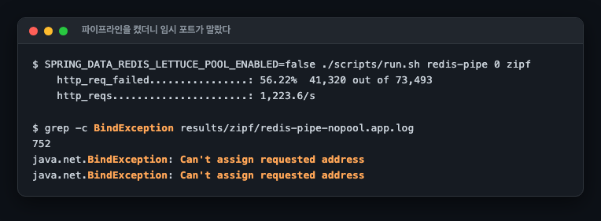

원인은 커넥션이었습니다. `RedisTemplate.executePipelined`는 공유 커넥션을 쓰지 않고 호출마다 전용 커넥션을 잡습니다. 커넥션 풀이 없으면 요청 하나가 TCP 연결 하나를 열고 닫고, 그 연결들이 `TIME_WAIT`으로 쌓여 임시 포트가 바닥납니다. 앱 로그에는 `java.net.BindException: Can't assign requested address`가 쌓였습니다.

풀이 없었던 이유가 더 문제였습니다. `application.yml`에는 `lettuce.pool.max-active: 64`가 적혀 있었습니다. 그런데 Spring Boot는 클래스패스에 `commons-pool2`가 있을 때만 풀 설정을 만듭니다. 없으면 설정을 조용히 무시합니다. 설정 파일에 값을 써 두는 것과 그 값이 적용되는 것은 다릅니다.

`org.apache.commons:commons-pool2` 의존성을 넣자 같은 코드가 정상 동작했습니다.

### 만들면서 밟은 Spring 함정 두 가지

측정을 시작하기도 전에 앱이 두 번 깨졌습니다. 뿌리는 하나입니다. `@Transactional`이 붙은 빈은 프록시로 감싸입니다.

`sponsor()`가 같은 클래스의 `this.atomic()`을 부르니 `TransactionRequiredException`이 났습니다. 자기 자신을 부르는 호출은 프록시를 지나지 않아 `@Transactional`이 적용되지 않습니다. 트랜잭션을 여는 메서드를 `CounterService`로 옮기고 분기와 재시도만 `SponsorService`에 남겨, 호출이 반드시 프록시를 지나게 했습니다.

두 번째는 더 조용했습니다. 재시도 횟수를 세려고 만든 `AtomicLong` 필드를 컨트롤러에서 직접 읽었더니 널이었습니다. 값은 프록시가 감싼 실제 객체에 있고, 프록시 자신의 필드는 초기화되지 않은 채로 있습니다. 접근자 메서드를 거치게 바꿔 해결했습니다.

카운터 설계와 상관없는 문제들이지만, JPA로 카운터를 짜다 보면 실제로 만나게 되므로 그대로 남겨 둡니다.

## 고른 부하에서 자동 슬롯이 조절을 하는가 (2026-07-31)

7절은 zipf 부하 하나였습니다. 쏠린 부하에서만 재면 자동 조절이 **실제로 조절을 하는지, 아니면 그냥 항상 늘리는지** 갈리지 않습니다. 부하 스크립트에 `uniform` 시나리오를 넣고 문턱도 함께 바꿨습니다.

| 문턱 | 부하 | 배정된 슬롯 합 | **방송당 최대** | tps |
|---|---|---|---|---|
| 50 | zipf | 4,445 | **64** | 4,054 |
| 50 | uniform | **8,000** | **8** | 3,970 |
| 200 | zipf | 2,070 | **64** | 4,059 |
| 200 | uniform | 2,000 | **2** | 4,116 |
| 1000 | zipf | 1,239 | **64** | 4,031 |
| 1000 | uniform | 1,000 | **1** | 4,075 |

**슬롯 합으로 보면 방향이 거꾸로 나옵니다.** 문턱 50에서 uniform이 8,000이고 zipf가 4,445입니다. 고른 부하가 쏠린 부하보다 슬롯을 1.8배 더 받았다는 값입니다. 그대로 읽으면 "문턱이 쏠림을 못 가리고 요청 수만 보고 있다" 가 됩니다.

**방송당 최대로 보면 정반대입니다.** 같은 문턱 50에서 zipf는 어떤 방송이 상한 64개를 다 받고 uniform은 최대 8개입니다. 문턱을 올리면 uniform은 2개, 1개로 줄고 zipf는 여섯 조건 전부 64를 채웁니다.

합이 뒤집히는 이유는 분포입니다. zipf는 소수 방송이 64개씩 갖고 나머지 대부분이 1개입니다. uniform은 1,000개 방송 **전부**가 8개씩 받습니다. 그래서 최대는 8분의 1인데 합은 1.8배입니다. **한 숫자로 요약할 때 어느 숫자를 고르느냐가 결론을 뒤집습니다.**

문턱 1000에서 uniform은 최대 1개, 합 1,000입니다. 방송이 1,000개이므로 **자동 조절이 한 번도 안 걸렸다**는 뜻입니다.

처리량은 여섯 조건이 3,970~4,116 tps로 3.7% 안에 있습니다. **슬롯을 덜 주는 것이 처리량을 깎지 않습니다.** 고른 부하에서는 애초에 경합이 없어 슬롯이 필요 없습니다.

## 슬롯의 값을 복제본이 냅니다

같은 부하를 복제본을 붙이고 3회씩 돌렸습니다.

| 조건 | 원본 처리량(회차별) | 중앙 | 부하 직후 뒤처진 양 | 따라잡기(회차별) | 중앙 |
|---|---|---|---|---|---|
| single | 1041, 1050, 1038 | 1,041/s | 423,800 | 2.18, 0.18, 0.07초 | **0.18초** |
| slot64 | 3352, 3279, 3240 | **3,279/s** | **182,823,000** | 45.72, 40.85, 40.65초 | **40.85초** |

**슬롯이 원본을 3.15배 빠르게 합니다.** 1,041/s가 3,279/s가 됩니다. 이 세션이 원래 보이려던 값입니다.

**그 값을 복제본이 냅니다.** 중앙값 따라잡기가 0.18초에서 40.85초이고, 회차별 값이 0.07~2.18초와 40.65~45.72초로 **범위가 겹치지 않습니다.** 부하 직후 뒤처진 양도 중앙값 42만 대 1억 8,282만입니다.

이유는 슬롯이 하는 일 자체입니다. 원본에서 카운터 하나를 64개 행으로 쪼개면 잠금 경합이 64분의 1로 줄어 원본이 빨라집니다. 그런데 **복제본은 그 64개 행 갱신을 전부 다시 적용해야 합니다.** 원본이 3.15배 많은 논리 갱신을 처리하고 그것이 다시 여러 배의 행 갱신이 되므로, 복제본이 받는 양은 훨씬 더 늘어납니다.

`Seconds_Behind_Source` 는 회차별로 단일 행이 4/1/1, 슬롯 64가 24/24/24 였습니다. 중앙값으로는 1과 24입니다. 이 값 하나만 보면 20배 남짓으로 읽히는데, 실제 따라잡기는 회차 범위가 아예 겹치지 않는 수준입니다(0.07~2.18초 대 40.65~45.72초). 단일 행 쪽 회차 폭이 31배라 배수 하나로 요약하면 0.07초를 분모로 삼느냐 2.18초를 삼느냐에 따라 18배에서 583배까지 나옵니다. **그래서 배수 대신 범위로 적습니다. 복제 지연을 `Seconds_Behind_Source` 하나로 감시하면 이 격차를 놓칩니다.**

**집계값을 복제본에서 읽는 서비스라면 슬롯의 이득이 그대로 손해가 됩니다.** 원본은 3배 빨라지고 복제본이 보여 주는 숫자는 40초 뒤처집니다. 후원 합계를 복제본에서 읽어 방송 화면에 띄운다면, 슬롯을 넣기 전보다 화면이 더 틀립니다.

## 못 한 것

- **부하 발생기가 앱, DB와 같은 호스트에 있습니다.** k6와 Spring Boot와 MySQL이 한 대에서 CPU를 나눠 씁니다. 절대 수치를 서비스 용량으로 읽으면 안 되고, 변형 간 비교로만 읽어야 합니다.
- **6절의 복제 대조는 조건마다 1회 실행이고 복제본이 하나입니다.** 0.07초와 40.65초가 그 값이고, 조건마다 3회 반복한 것은 뒤에 있습니다. 단일 행 쪽이 회차마다 0.07~2.18초로 31배 흩어지므로 6절 값 하나를 인용하면 안 됩니다. 지연 복제와 병렬 적용(`replica_parallel_workers`)은 다루지 않았습니다. 복제 지연과 승격은 같은 트랙의 `R01-replica-promotion-loss` 세션에서 다룹니다.
- **슬롯 스윕은 조건마다 1회 실행입니다.** 복제 대조만 3회입니다. 방송당 최대 슬롯은 앞선 회차에서 uniform이 16·4·1 이었고 이번 회차가 8·2·1입니다. zipf는 두 회차 다 전부 64입니다.
- **5절 표의 2대 값은 총 힙 2GB에서 잰 것입니다.** 8절에서 고정해 다시 쟀고 결론은 같았습니다.
