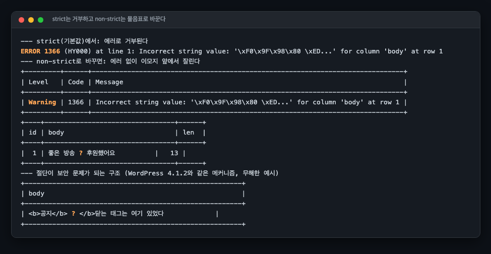
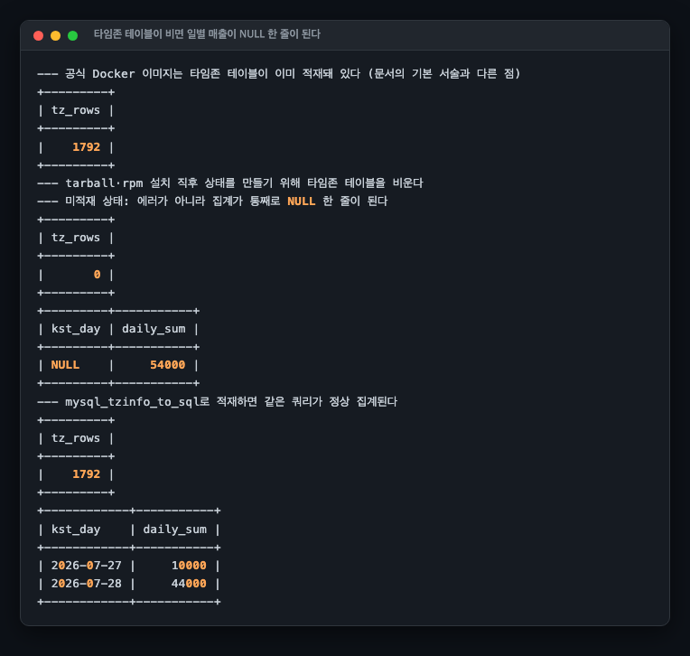
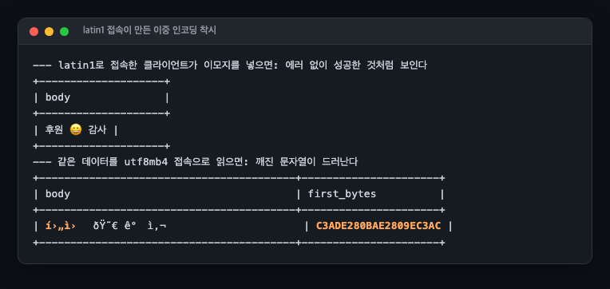

# R14 글로벌 서비스의 문자셋·타임존 지뢰밭

> 근거 등급: `E2` (문자셋 절단은 WordPress 4.1.2 보안 릴리스라는 실제 사고가 있으나 운영 장애 포스트모템이 아니라 E2로 유지)
> 출처: [MySQL 8.4, utf8mb3](https://dev.mysql.com/doc/refman/8.4/en/charset-unicode-utf8mb3.html) · [Time Zone Support](https://dev.mysql.com/doc/refman/8.4/en/time-zone-support.html) · [Online DDL Operations](https://dev.mysql.com/doc/refman/8.4/en/innodb-online-ddl-operations.html) · [WordPress 4.1.2 Security Release](https://wordpress.org/news/2015/04/wordpress-4-1-2/) · [RDS for MySQL 로컬 타임존](https://docs.aws.amazon.com/AmazonRDS/latest/UserGuide/MySQL.Concepts.LocalTimeZone.html) · [RDS for MySQL 역할 기반 권한 모델](https://docs.aws.amazon.com/AmazonRDS/latest/UserGuide/Appendix.MySQL.CommonDBATasks.privilege-model.html) · [RDS 스토리지 확장](https://docs.aws.amazon.com/AmazonRDS/latest/UserGuide/USER_PIOPS.ModifyingExisting.ScalingUp.html)

## 1. 유명한 이유

먼저 이 세션의 성격부터 밝힙니다. **이것은 장애 하나를 재현한 기록이 아닙니다.** 사건 재현이라면 하나의 원인과 하나의 타임라인이 있어야 하는데, 여기 담은 것은 서로 독립된 함정 여섯 개입니다. 사건 재현이 아니라 **함정 카탈로그**라고 부르는 편이 정확합니다. 근거 등급을 E2로 둔 것도 그래서고, 뒤에 나오는 전후 수치가 지연이나 처리량이 아니라 각 함정의 실패 출력과 해소 출력의 대조인 것도 그래서입니다.

그래도 하나씩 모아 둘 값어치가 있는 이유는 이렇습니다.

글로벌로 서비스가 나가는 순간 두 종류의 지뢰가 있습니다.

**문자셋.** MySQL의 `utf8`은 진짜 UTF-8이 아니라 3바이트 부분집합(utf8mb3)의 별칭입니다. 이모지와 한자 확장 영역 같은 4바이트 문자가 들어오는 순간 문제가 됩니다. 이것이 보안 사고로 번진 실례가 있습니다. WordPress 4.1.2(2015)는 utf8 컬럼의 4바이트 문자 처리에서 비롯된 저장형 XSS를 익명 사용자가 쓸 수 있다고 공식 인정하고 긴급 패치를 냈습니다.

**타임존.** 후원 시각을 UTC로 저장하고 한국 시간으로 집계하는 순간 `CONVERT_TZ()`를 만나는데, 이 함수는 mysql 스키마의 타임존 테이블에 의존합니다. 문서 기준으로 그 테이블은 설치 시 생성만 되고 적재는 되지 않으며, 비어 있으면 함수가 에러 없이 NULL을 반환합니다. 일별 매출 리포트가 조용히 틀리는 경로입니다.

전부 로컬에서 몇 분 안에 재현되는 것들이라 난이도는 낮지만, 글로벌 플랫폼에서 실제로 부딪히는 순서 그대로 밟아 봅니다.

## 2. 재현

### 환경

| 항목 | 값 |
|---|---|
| DB | MySQL 8.4.3 공식 Docker 이미지, 기본 설정 (`character_set_server=utf8mb4`, `STRICT_TRANS_TABLES` 포함) |
| 호스트 사양 | **기록하지 않았습니다.** `uname -srm`·`nproc`·`free -g`를 남기지 않아 어느 장비였는지 확인되지 않습니다 |
| 자원 상한 | 걸지 않았습니다. 성능 측정이 아니라 동작 재현입니다 |
| 클라이언트 | mysql CLI, 접속 문자셋을 `--default-character-set=utf8mb4`로 고정 (지뢰 6이 그 이유입니다) |
| 일시 | 2026-07-29 |

호스트를 기록하지 않은 것은 이 저장소에서 반복되는 결함이지만, **이 세션에 한해서는 결론에 영향을 주지 않습니다.** 아래 여섯 실험에 지연도 처리량도 없기 때문입니다. 시간 수치는 "실험 전체가 약 1분" 하나뿐이고 그것도 비교 대상이 없습니다. 이 세션의 관측은 전부 에러 번호와 출력 문자열이라 장비가 바뀌어도 같은 결과가 나옵니다. 반대로 말하면, 이 세션에서 소요 시간을 근거로 무언가를 주장하려 했다면 그 주장은 성립하지 않습니다.

6개 실험 전체가 `scripts/run-experiments.sh` 하나로 재현되고, 출력 원문이 `results/`에 남습니다.

### 지뢰 1. utf8mb3에 이모지가 들어올 때

후원 채팅 테이블이 `CHARACTER SET utf8mb3`로 만들어져 있고 "좋은 방송 😀 후원했어요"가 들어옵니다.



- **strict(8.4 기본값)**: `ERROR 1366 Incorrect string value`로 거부됩니다. 후원 메시지 저장 실패라는 장애지만, 최소한 시끄럽게 실패합니다.
- **non-strict(`sql_mode=''`)**: 경고만 남기고 이모지가 `?`로 바뀌어 저장됩니다. 데이터는 조용히 손상됩니다.

### 지뢰 2. 인덱스 키 767바이트

utf8mb4로 전환하면 문자당 최대 4바이트가 되면서 인덱스 한계에 부딪힙니다.

```
ROW_FORMAT=COMPACT + VARCHAR(255) 인덱스
→ ERROR 1071 (42000): Specified key was too long; max key length is 767 bytes

같은 조건 KEY(name(191))          → 성공 (191 x 4 = 764바이트)
기본 ROW_FORMAT(DYNAMIC)의 255자  → 성공 (한계 3072바이트)
```

구형 테이블(COMPACT)을 물려받은 서비스가 utf8mb4 전환 중에 만나는 벽이고, WordPress가 코어 테이블 인덱스를 191자로 줄이며 전환한 이유입니다. 8.0 이후 기본 ROW_FORMAT은 DYNAMIC이라 새 테이블에서는 이 벽이 없습니다.

### 지뢰 3. CONVERT_TZ의 조용한 NULL

UTC로 저장된 후원 4건을 한국 시간 기준 일별로 집계합니다.



타임존 테이블이 비어 있으면 에러가 나지 않습니다. 대신 **일별 집계가 통째로 `NULL` 한 줄**이 됩니다. 날짜별로 나뉘어야 할 54,000원이 NULL 그룹 하나에 뭉칩니다. 리포트 파이프라인이라면 "날짜 없음" 행 하나가 생기거나, NULL 행을 걸러내는 로직이 있다면 매출 전체가 증발합니다. `mysql_tzinfo_to_sql /usr/share/zoneinfo`로 적재하면 같은 쿼리가 정상 집계됩니다.

한 가지 못 박아 둘 것이 있습니다. **비어 있는 상태는 이 이미지의 기본값이 아닙니다.** mysql:8.4.3 도커 이미지는 타임존 테이블이 채워진 채로 오고, 이 실험은 그것을 `TRUNCATE`로 비워 tarball 설치 직후 상태를 만든 것입니다. 자세한 경위는 6절에 있고, RDS에서는 이 지뢰가 아예 다른 모양이 된다는 것은 뒤의 RDS 절에 있습니다.

### 지뢰 4. TIMESTAMP와 DATETIME

같은 시각을 두 타입에 저장하고 세션 타임존만 바꿔 읽었습니다.

```
서울 세션에서 저장: '2026-07-28 21:00:00' (양쪽 동일)
뉴욕 세션에서 조회: ts = 2026-07-28 08:00:00   ← TIMESTAMP만 변환됨
                   dt = 2026-07-28 21:00:00   ← DATETIME은 그대로

'2038-01-19 03:14:08' INSERT → ERROR 1292      ← TIMESTAMP 상한
```

TIMESTAMP는 UTC로 변환해 저장하고 읽을 때 세션 타임존으로 되돌립니다. DATETIME은 벽시계 문자 그대로입니다. 어느 쪽이 옳은 게 아니라 계약이 다른 것이고, 팀이 하나를 정해 문서화하지 않으면 서버 타임존이 다른 배치와 API가 서로 다른 시각을 읽습니다. 그리고 TIMESTAMP는 2038년 1월 19일 이후를 저장하지 못합니다. 30년 만기 상품이나 장기 구독 만료일에는 지금도 문제가 됩니다.

### 지뢰 5. 어떤 언어가 깨지는가

utf8mb3에서 한국어, 일본어, 중국어 기본 한자는 전부 무사합니다(3바이트 이내). 깨지는 것은 이모지와 한자 확장 B(𠀋 같은 4바이트 문자)입니다. "CJK는 잘 되던데요"가 안전하다는 뜻이 아닙니다. 사용자 닉네임과 채팅에는 이모지가 반드시 들어옵니다.

### 지뢰 6. 접속 문자셋이 만드는 착시

이 세션을 만들다 실제로 밟은 지뢰라 실험으로 승격했습니다.



latin1로 붙은 클라이언트가 이모지를 넣으면 **에러도 경고도 없이 성공하고, 같은 클라이언트로 읽으면 멀쩡해 보입니다.** UTF-8 바이트가 latin1 문자 4개로 해석돼 각각 3바이트로 재인코딩됐다가, 읽을 때 역변환으로 원래 바이트가 복원되는 왕복 착시입니다. utf8mb4로 접속한 다른 클라이언트가 읽는 순간 `í›„ì› ðŸ˜€`가 드러납니다. 애플리케이션마다 접속 문자셋이 다르면 "내 화면에선 멀쩡한데요"가 성립합니다.

## 3. 내부 원리

세 가지 층이 겹쳐 있습니다.

1. **컬럼 문자셋**은 저장 가능한 바이트 범위를 정합니다. utf8mb3는 BMP(3바이트)까지만입니다.
2. **접속 문자셋**(`character_set_client/connection/results`)은 클라이언트와 서버 사이의 해석을 정합니다. 지뢰 6이 이 층입니다.
3. **sql_mode**는 변환 불가능한 문자를 만났을 때 에러로 할지 치환으로 할지를 정합니다. 지뢰 1이 이 층입니다.

타임존은 두 갈래입니다. `CONVERT_TZ`와 이름 있는 타임존(`Asia/Seoul`)은 mysql 스키마의 타임존 테이블을 조회하는 데이터 의존이고, TIMESTAMP의 저장 변환은 타입 자체의 계약입니다. 전자는 적재 상태에 따라 결과가 달라지고, 후자는 항상 동작하되 세션 타임존에 따라 보이는 값이 달라집니다.

## 4. 해소

| 지뢰 | 해소 |
|---|---|
| utf8mb3 절단·치환 | 새 테이블은 utf8mb4(8.4 기본값). 기존 테이블은 `CONVERT TO CHARACTER SET utf8mb4` 계획 수립 |
| 767바이트 | ROW_FORMAT=DYNAMIC 확인. 물려받은 COMPACT 테이블만 191자 프리픽스 인덱스 |
| CONVERT_TZ NULL | 배포 체크리스트에 `SELECT COUNT(*) FROM mysql.time_zone_name` 추가. 0이면 적재 |
| 타입 혼선 | 팀 규약으로 고정: 이벤트 시각은 UTC DATETIME(2038 문제 없음) + 애플리케이션 변환, 또는 TIMESTAMP + 세션 타임존 통일 |
| 접속 착시 | 모든 클라이언트 설정에 문자셋 명시 (JDBC `connectionCollation`, mysql CLI `--default-character-set`) |

첫 줄의 "전환 계획 수립"을 한 줄로 넘기면 안 되는 이유는 RDS 절에 따로 적었습니다. utf8mb4 전환은 스키마 변경이 아니라 스토리지 결정입니다.

## 5. 재계측

이 세션은 지연도 처리량도 재지 않았습니다. 그래서 여기서 말하는 전후는 시간이 아니라 **조건만 바꿔 같은 종류의 문장을 다시 돌렸을 때의 출력**입니다. 여섯 지뢰 중 해소까지 돌려 대조가 남은 것은 셋이고, 나머지 셋은 해소를 실행하지 않아 후 수치가 없습니다.

### 전후가 남은 셋

| 지뢰 | 바꾼 것 | 전 | 후 |
|---|---|---|---|
| CONVERT_TZ NULL | `mysql_tzinfo_to_sql /usr/share/zoneinfo` 적재 | `time_zone_name` 0행, 집계가 `NULL` 한 줄에 54,000원 | 1,792행, `2026-07-27` 10,000원과 `2026-07-28` 44,000원 두 줄 |
| 인덱스 767바이트 | 키를 191자 프리픽스로, 또는 ROW_FORMAT을 DYNAMIC으로 | COMPACT + utf8mb4 `VARCHAR(255)` 전체 인덱스에서 ERROR 1071 | `KEY(name(191))` 성공, DYNAMIC + 255자 성공 |
| 접속 문자셋 착시 | 클라이언트에 `--default-character-set=utf8mb4` 명시 | latin1 접속: 에러도 경고도 없이 저장 성공, 첫 4자의 바이트가 `C3ADE280BAE2809EC3AC` | utf8mb4 접속: 같은 종류의 INSERT가 strict에서 ERROR 1366, non-strict에서 Warning 1366 |

첫 줄만 같은 쿼리를 두 번 돌린 진짜 전후입니다. 둘째 줄은 같은 조건에서 인덱스 정의만 바꿔 다시 만든 것이고, 셋째 줄은 접속만 다르고 문자열과 테이블은 다른 INSERT라 엄밀한 짝은 아닙니다. 그래도 셋째 줄이 이 세션에서 가장 값어치 있는 대조입니다. 접속 문자셋을 고정하는 것만으로 "조용한 성공"이 "시끄러운 실패"로 바뀝니다. 데이터가 덜 깨져서가 아니라 깨지는 것을 볼 수 있게 돼서입니다.

### 후 수치가 없는 셋

- **utf8mb3 치환(지뢰 1).** 해소는 `ALTER TABLE ... CONVERT TO CHARACTER SET utf8mb4`인데 **이 세션에서 실행하지 않았습니다.** 전환 뒤 같은 INSERT가 통과하는지 확인하지 않았습니다. 다만 이미 저장된 행은 전환해도 복구되지 않습니다. 출력이 `좋은 방송 ? 후원했어요`라 원본 바이트가 남아 있지 않기 때문입니다. 치환은 잃어버린 뒤에 고칠 수 없습니다.
- **TIMESTAMP 2038(지뢰 4).** 해소가 타입 규약이라 DB에서 돌릴 실험이 아니라 코드 결정입니다. DATETIME 컬럼에 2038년 이후 값이 들어가는 것을 확인하는 한 줄조차 넣지 않았습니다.
- **언어별 생존(지뢰 5).** 관찰 실험이라 전후가 성립하지 않습니다. utf8mb4 테이블에 같은 다섯 줄을 넣어 `?`가 사라지는 것을 보이는 대조군을 두지 않았습니다.

그리고 **어느 항목도 소요 시간을 재지 않았습니다.** 재현이 SQL 몇 줄이라 시간을 재는 것이 의미가 없었고, 실제로 시간이 드는 작업(대형 테이블의 문자셋 전환)은 이 세션 범위 밖입니다.

## RDS에서는 무엇이 달라지는가

먼저 못 박아 둘 것이 있습니다. **이 세션은 RDS에서 아무것도 돌리지 않았습니다.** MySQL 8.4.3 도커 컨테이너 하나가 전부이고, 아래는 AWS 문서와 대조해 맞춘 것이지 실측이 아닙니다.

그런데도 이 절이 필요합니다. 여섯 지뢰 중 셋(타임존 테이블, 문자셋 기본값, 전환 비용)은 **관리형이냐 아니냐에 따라 원인도 처방도 갈리고**, 나머지 셋(TIMESTAMP의 계약, 언어별 생존, 접속 문자셋)은 엔진과 클라이언트의 성질이라 어디서 돌리든 같습니다. 이 구분을 하지 않으면 이 세션이 R 트랙에 있을 이유가 없습니다.

### 타임존: RDS의 위험은 "비어 있음"이 아니라 "낡음"이다

지뢰 3이 만든 상태부터 정확히 적겠습니다. mysql:8.4.3 도커 이미지는 `time_zone_name`이 1,792행 채워진 채로 옵니다. 비어 있는 상태는 기본값이 아니라 `TRUNCATE`로 만든 것입니다. "도커라서 NULL이 난다"는 말은 틀립니다.

RDS에서는 그 실험 자체가 성립하지 않습니다. AWS 문서가 "Starting with RDS for MySQL version 8.0.36, you can't modify the tables in the `mysql` database directly"라고 적고, 이어서 "You can still query the `mysql` tables"라고 합니다. 읽을 수는 있고 지울 수는 없습니다. 비우는 재현도, `mysql_tzinfo_to_sql`로 다시 채우는 복구도 그대로는 못 합니다. 같은 문서에서 타임존 테이블을 손으로 갱신하는 방법을 안내하는 문장은 대상이 MariaDB 인스턴스로 적혀 있습니다.

대신 RDS는 타임존 데이터를 엔진에 실어 보냅니다. 문서의 표현은 "Every time RDS releases a new minor maintenance release of MySQL, it ships with the latest time zone data at the time of the release"입니다. 그리고 이름 있는 타임존을 파라미터 그룹에서 고를 수 있습니다. `time_zone` 파라미터의 지원 값 목록에 `Asia/Seoul`이 들어 있습니다. MySQL이 이름 있는 타임존을 받으려면 타임존 테이블이 적재돼 있어야 하므로, 이 두 문장은 RDS 인스턴스가 채워진 상태로 시작한다는 뜻으로 읽힙니다.

**여기까지가 문서로 확인한 것이고, 확인하지 못한 것이 있습니다.** RDS 인스턴스를 띄워 `SELECT COUNT(*) FROM mysql.time_zone_name`을 직접 돌려 보지 않았습니다. 행 수도, 그 데이터가 어느 IANA 릴리스인지도 실측하지 않았습니다.

그래서 지뢰의 모양이 바뀝니다. 같은 문서가 "RDS doesn't modify or reset the time zone data of running DB instances. New time zone data is installed only when you perform a database engine version upgrade"라고 적습니다. IANA는 타임존 규칙을 한 해에 여러 차례 고치는데, 엔진 버전을 올리기 전까지 인스턴스의 규칙은 멈춰 있습니다. 도커에서 본 실패는 NULL이라 최소한 눈에 띄지만, 낡은 규칙으로 변환한 결과는 NULL도 에러도 아니고 그냥 한 시간 어긋난 값입니다. **이쪽이 더 조용합니다.**

다만 이건 문서에서 끌어낸 구조이지 이 세션이 재현한 것이 아닙니다. 규칙이 바뀐 나라의 날짜를 골라 낡은 데이터와 새 데이터로 같은 `CONVERT_TZ`를 돌려 비교하는 실험은 하지 않았습니다. 한국은 지금 DST가 없어 KST가 고정 오프셋이라, 그 실험을 하려면 대상 나라부터 바꿔야 합니다.

### 문자셋: 기본값이 파라미터 그룹에 있다

호스트의 `my.cnf`를 못 고치므로 `character_set_server`와 `collation_server`는 DB 파라미터 그룹에서 바꾸는 값이 됩니다. 8.4의 엔진 기본값이 utf8mb4라 새로 만드는 인스턴스는 이 지뢰에서 멀지만, **파라미터 그룹은 컬럼 문자셋을 고쳐 주지 않습니다.** utf8mb3 시절 스키마를 그대로 옮겨 온 인스턴스는 서버 기본값이 utf8mb4여도 컬럼 단위로 utf8mb3가 남아 있고, 지뢰 1은 컬럼 문자셋에서 나는 일입니다.

`sql_mode`도 같은 자리입니다. 지뢰 1의 non-strict는 실험에서 `SET SESSION sql_mode=''`로 만들었지만, 운영에서 그 상태가 되는 경로는 대개 파라미터 그룹에 `STRICT_TRANS_TABLES`가 빠져 있는 것입니다. 세션 한 줄로 재현되는 조건이 인스턴스 전체에 걸려 있을 수 있다는 뜻입니다.

### utf8mb4 전환은 되돌릴 수 없는 스토리지 증가다

4절 표가 "전환 계획 수립"으로 넘긴 자리입니다. **금액은 계산하지 않았습니다.** 인스턴스 클래스도 스토리지 타입도 정하지 않았고, 이 세션에 전환 전후의 크기 측정이 없습니다. 구조만 적습니다.

- **인덱스 키 계산이 문자당 3바이트에서 4바이트로 바뀝니다.** 지뢰 2가 그 결과입니다. `VARCHAR(255)` 인덱스의 선언 키 길이가 765바이트에서 1,020바이트가 되고, COMPACT 테이블에서는 767바이트 한계를 넘어 아예 만들어지지 않습니다.
- **실제로 늘어나는 바이트는 데이터가 정합니다.** 한글은 utf8mb3에서도 utf8mb4에서도 3바이트라 그대로입니다. 늘어나는 것은 4바이트 문자가 실제로 들어 있는 행이고, 그 비율을 이 세션은 재지 않았습니다. 반면 인덱스 프리픽스처럼 상한으로 잡는 자리는 데이터와 무관하게 커집니다.
- **전환은 테이블 재구축입니다.** MySQL 8.4의 온라인 DDL 표는 문자셋 변환을 `ALGORITHM=INPLACE`로 지원하고 동시 DML도 허용하지만, "Rebuilds the table if the new character encoding is different"라고 적습니다. 재구축이므로 진행 중에는 원본과 새 사본이 함께 자리를 차지합니다.
- **RDS에서 그 자리는 돌아오지 않습니다.** AWS 문서가 "You can't reduce the amount of storage on a volume after you have allocated storage for it"이라고 적습니다. 재구축이 볼륨을 한 번 밀어 올리면(스토리지 자동 확장이 켜져 있으면 자동으로 밀립니다) 전환이 끝나고 여유가 생겨도 할당량은 그대로입니다. 줄이려면 더 작은 인스턴스를 새로 만들어 옮겨 심어야 합니다.
- **Aurora는 반대쪽으로 움직입니다.** 스토리지가 실제 사용량을 따라가므로 늘어난 만큼만 과금되고 줄면 줄어듭니다. 대신 Aurora Standard는 스토리지 I/O를 건수로 과금하므로 재구축이 만드는 I/O가 그 자리에서 청구서에 잡힙니다.

즉 utf8mb4 전환의 비용은 "ALTER가 몇 분 걸리나"가 아니라 **그 뒤로 매달 어느 크기의 볼륨을 쓰게 되나**입니다. 이 세션은 앞쪽도 뒤쪽도 재지 않았습니다.

## 6. utf8mb4 전환, DST, 낡은 타임존 데이터

`scripts/exp-migrate-dst.sh`, 원문은 `results/exp-migrate-dst.txt`.

### 1. utf8mb4 전환을 실제로 실행했다

100만 행, `VARCHAR(191)` 과 `VARCHAR(64)` 에 인덱스 하나.

| | 전환 전 | 전환 후 |
|---|---|---|
| 문자셋 | `utf8mb3` / `utf8mb3_general_ci` | `utf8mb4` / `utf8mb4_0900_ai_ci` |
| 데이터 | 52MB | 52MB |
| 인덱스 | 33MB | 33MB |
| `ALGORITHM=INPLACE` | | **거부 (에러 1846)** |
| COPY 소요 | | **4.6초** |

**`INPLACE` 를 에러 1846 으로 거부합니다.** A01 의 `ALTER TYPE` 과 같은 자리이고, 같은
문구입니다(`Cannot change column type INPLACE. Try ALGORITHM=COPY`). 문자셋 변경도 컬럼
타입 변경으로 취급되므로 테이블을 통째로 다시 씁니다. **COPY 구간에는 쓰기가 통과하지
못한다는 A01 3절의 결론이 그대로 적용됩니다.**

크기가 변하지 않은 것은 실제 데이터가 ASCII 와 한글이라 저장 바이트가 같기 때문입니다.
`utf8mb4` 는 4바이트를 **쓸 수 있다**는 뜻이지 항상 4바이트를 쓴다는 뜻이 아닙니다.
바뀌는 것은 저장 크기가 아니라 **선언 상한**입니다.

그 상한이 인덱스 키 길이를 정합니다. `VARCHAR(191)` 은 `utf8mb3` 에서 573바이트,
`utf8mb4` 에서 764바이트입니다. 둘 다 767 아래라 인덱스를 걸 수 있습니다. **예전
WordPress 가 `VARCHAR(191)` 을 쓰던 이유가 이것입니다**(767 ÷ 4 = 191).

### 2. DST 전환의 결손 시각과 중복 시각

미국 동부 기준입니다. 타임존 테이블은 `mysql_tzinfo_to_sql` 로 1,792개를 적재했습니다.

**결손 시각.** 2026-03-08 02:00 에 03:00 으로 건너뜁니다. 02:30 은 존재하지 않습니다.

| 입력 | `CONVERT_TZ(..., 'America/New_York', 'UTC')` |
|---|---|
| `01:30` | `2026-03-08 06:30:00` |
| **`02:30` (존재하지 않음)** | **`2026-03-08 07:00:00`** |
| `03:30` | `2026-03-08 07:30:00` |

**에러도 NULL 도 아닙니다.** 02:30 이 07:00 을 돌려주는데 이는 03:00 과 같은 순간입니다.
존재하지 않는 시각이 조용히 밀립니다.

**중복 시각.** 2026-11-01 02:00 에 01:00 으로 되돌립니다. 01:30 이 두 번 옵니다.

| 입력 | 결과 |
|---|---|
| `00:30` (EDT 구간) | `2026-11-01 04:30:00` |
| **`01:30` (두 번 오는 시각)** | **`2026-11-01 05:30:00`** |
| `03:30` (EST 구간) | `2026-11-01 08:30:00` |

01:30 은 EDT 쪽(`05:30`)만 나옵니다. EST 쪽 `06:30` 은 이 문법으로 도달할 방법이 없습니다.

**저장한 뒤에는 되돌릴 수 없습니다.** `DATETIME` 과 `TIMESTAMP` 양쪽에 같은 01:30 을 넣고
읽어 보면 둘 다 `2026-11-01 01:30:00` 이고, 그것이 EDT 인지 EST 인지 구별할 방법이
없습니다. 차이는 3,600초입니다. **후원 정산이나 주문 순서를 이 값으로 정렬하면 한 시간이
뒤섞입니다.**

### 3. 낡은 타임존 데이터가 만드는 오변환

규칙이 실제로 바뀐 나라를 골랐습니다. 멕시코는 2022-10-30 부로 대부분 지역의 하계 시간제를
폐지했습니다.

| 시각 | UTC 와의 차이 |
|---|---|
| 2022-07-15 12:00 (폐지 전 여름) | **5시간** |
| 2023-07-15 12:00 (폐지 후 여름) | **6시간** |

이 서버의 tzdata 는 `tzdata-2024b` 라 변경이 반영돼 있습니다. **tzdata 가 2022b 이전인
서버에서는 두 값이 둘 다 5로 나옵니다.** 에러도 NULL 도 아니고 한 시간 어긋난 값이
조용히 나옵니다.

이것이 RDS 절이 말한 "NULL 보다 조용한 실패"의 실체입니다. `mysql.time_zone_name` 이
비어 있으면 `CONVERT_TZ` 가 NULL 을 돌려주므로 그건 눈에 띕니다. **적재는 돼 있는데
낡은 경우가 더 위험합니다.**

## 7. 예상과 달랐던 점

### 절단이 아니라 치환이었습니다

WordPress 사고 시절(MySQL 5.5·5.6)의 non-strict 동작은 이모지 지점에서 **문자열 절단**이었고, 그래서 닫는 태그가 잘려 나가 XSS가 성립했습니다. 8.4.3의 non-strict는 잘라내지 않고 이모지만 `?`로 **치환**했습니다. 뒤 문자열은 살아남습니다. 데이터 손상은 여전하지만 태그 절단형 XSS 경로는 같은 방식으로 성립하지 않습니다. 버전에 따라 실패 양상 자체가 달라진다는 것을 실측으로 확인했고, WordPress 사고를 이 동작의 근거로 옮겨 쓸 때는 시대를 명시해야 합니다.

### 공식 Docker 이미지는 타임존이 이미 적재돼 있었습니다

문서는 "설치 절차가 타임존 테이블을 만들지만 적재하지는 않는다"고 하는데, mysql:8.4.3 Docker 이미지는 `time_zone_name` 1,792행이 채워진 채로 옵니다. 컨테이너로만 개발한 팀이 tarball·rpm으로 설치된 운영 서버에 나갈 때 처음으로 이 함정을 만나게 되는 구조입니다. 재현을 위해 테이블을 비워 맨 설치 상태를 만들었고, 그 사실을 그대로 남깁니다.

### 실험 도구가 먼저 지뢰를 밟았습니다

처음 돌린 실험에서 이모지 절단이 재현되지 않았습니다. 원인은 docker exec로 띄운 mysql 클라이언트가 latin1로 접속한 것이었고, 그 착시를 지뢰 6으로 승격했습니다. 문자셋 실험은 실험 도구의 문자셋부터 고정해야 합니다.

## 못 한 것

- **RDS에서 아무것도 돌리지 않았습니다.** 위 RDS 절은 전부 AWS 문서 대조입니다. 특히 `mysql.time_zone_name`의 실제 행 수와 그 데이터의 IANA 릴리스를 인스턴스에서 확인하지 않았습니다.
- **두 버전의 tzdata 를 같은 서버에 두고 비교하지는 못했습니다.** 규칙 변경 전후 시각의 오프셋이 실제로 갈린다는 것까지만 보였습니다. 낡은 tzdata 이미지를 따로 띄워 같은 질의를 돌리면 오변환 자체를 재현할 수 있는데 아직 안 했습니다.
- **DST 구간의 애플리케이션 동작은 재현하지 않았습니다.** `CONVERT_TZ` 수준까지만 봤고, JDBC 드라이버나 JVM `ZoneId` 가 같은 시각을 어떻게 다루는지는 재지 않았습니다.
- **전환 중 쓰기 부하를 넣지 않았습니다.** 4.6초 동안 쓰기가 얼마나 통과하는지는 재지 않았습니다. A01 3절이 같은 COPY 구간을 부하와 함께 잰 값이 있으니 그쪽을 참고할 수 있지만 이 세션의 실측은 아닙니다.
- **호스트 사양을 기록하지 않았습니다.** 이 세션은 시간 수치가 없어 결론이 흔들리지는 않지만, 기록 자체는 빠져 있습니다.
- **타임존 사고의 E1 사례를 찾지 못했습니다.** 문자셋 쪽은 WordPress 사고가 있지만 타임존 쪽은 공식 문서 경고(E2)까지만 확보했습니다.