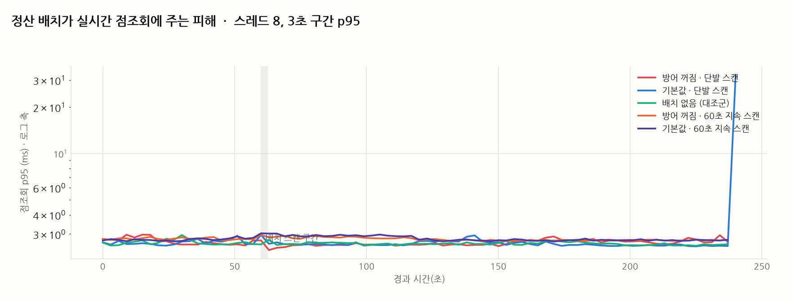
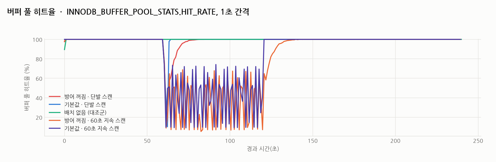

# R16 정산 배치의 풀 스캔이 실시간 조회를 밀어내는 버퍼 풀 오염

> 근거 등급: `E2`
> 출처: [MySQL 8.4 Reference, Buffer Pool](https://dev.mysql.com/doc/refman/8.4/en/innodb-buffer-pool.html), [MySQL 8.4 Reference, Making the Buffer Pool Scan Resistant](https://dev.mysql.com/doc/refman/8.4/en/innodb-performance-midpoint_insertion.html), [Percona, How side load may massively impact your MySQL performance](https://www.percona.com/blog/side-load-may-massively-impact-your-mysql-performance/), [Amazon Aurora storage](https://docs.aws.amazon.com/AmazonRDS/latest/AuroraUserGuide/Aurora.Overview.StorageReliability.html), [Amazon RDS DB instance storage](https://docs.aws.amazon.com/AmazonRDS/latest/UserGuide/CHAP_Storage.html), [Amazon EBS I/O characteristics and monitoring](https://docs.aws.amazon.com/ebs/latest/userguide/ebs-io-characteristics.html)

## 1. 유명한 이유

정산 배치, 통계 집계, mysqldump 백업. 전부 큰 테이블을 처음부터 끝까지 읽습니다. 그 풀 스캔이 버퍼 풀에서 실시간 트래픽의 워킹셋을 밀어내면, 배치가 도는 동안 멀쩡하던 점조회가 디스크로 떨어집니다.

MySQL 공식 문서가 이 문제를 직접 서술합니다. 테이블 스캔은 "다시 쓰지 않을 대량의 데이터를 버퍼 풀에 들이면서 같은 양의 오래된 데이터를 밀어낼 수 있고", 이런 상황은 "자주 쓰는 페이지를 old 서브리스트로 밀어 퇴출 대상으로 만들 수 있다"고 적습니다. Percona는 2011년에 이것을 실측했습니다. sysbench OLTP 단독으로 약 330 req/s 나오던 서버가 mysqldump를 병행하자 약 2 req/s로 무너졌습니다.

다만 그 실험 이후 15년 동안 InnoDB의 방어도 발전했습니다. 새로 읽힌 페이지는 LRU의 중간(old 서브리스트)에 들어가고, `innodb_old_blocks_time`(기본 1초) 안에 다시 접근돼도 young으로 승격되지 않습니다. 스캔처럼 페이지를 한 번씩만 훑는 접근은 old에 머물다 밀려나고, 워킹셋은 young에서 보호됩니다.

그래서 이 세션의 질문은 둘입니다.

1. 방어를 끄면(2011년식 동작) 정말 Percona가 본 붕괴가 재현되는가
2. 8.4 기본값의 방어는 같은 공격을 얼마나 막아 주는가

답을 먼저 적겠습니다. 이 세션이 운영에 남긴 것은 배수가 아니라 지표를 읽는 법입니다. 전역 히트율만 보는 대시보드는 배치가 돌 때마다 잘못된 경보를 냅니다. 그 지표에는 스캔 자신의 미스가 섞여 있어서, 워킹셋이 멀쩡해도 숫자는 한 자릿수까지 떨어집니다. 워킹셋이 실제로 다쳤는지는 스캔이 끝난 뒤 히트율이 제자리로 돌아오는 데 걸린 시간으로 봐야 합니다. 아래 계측은 그 둘을 갈라 놓은 기록입니다.

## 2. 재현

### 환경

| 항목 | 값 |
|---|---|
| 호스트 | macOS 26.3.1, Apple M2 Pro, 12코어(논리), 32GB |
| DB | MySQL 8.4.3 (컨테이너 `--cpus=4 --memory=2g`, 버퍼 풀 1GB) |
| 실시간 부하 | Python 스레드 8개, 핫 테이블 PK 점조회, 건별 지연 기록 |
| 배치 | 콜드 테이블 풀 스캔 집계 (`SELECT COUNT(*), SUM(amount), SUM(fee)`) |

컨테이너에는 버퍼 풀 크기와 커넥션 수, 로그 플러시 정도만 지정했고 나머지는 8.4 기본값입니다. 그중 셋이 이 세션의 해석에 걸립니다.

- `innodb_flush_method`의 8.4 Unix 계열 기본값은 "지원되면 O_DIRECT, 아니면 fsync"입니다. O_DIRECT로 열렸다면 데이터 파일 읽기가 컨테이너 커널의 페이지 캐시에 한 번 더 얹히지 않으므로, 버퍼 풀 미스가 곧 블록 장치 읽기가 됩니다. 다만 Docker Desktop은 리눅스 VM 위에서 돌고 그 VM의 디스크 이미지는 macOS 쪽 파일이라, 미스가 어디까지 내려갔는지는 확인하지 않았습니다.
- `innodb_adaptive_hash_index`는 8.4부터 기본 OFF입니다. 아래 점조회 p95에는 적응형 해시 인덱스의 도움이 들어 있지 않습니다. 기본 ON이던 8.0에서 같은 실험을 돌리면 숫자가 달라질 수 있습니다.
- `innodb_change_buffering`은 8.4부터 기본 none입니다. 이 워크로드는 읽기만 하므로 결과에 영향이 없습니다.

셋 다 8.4 문서에 적힌 기본값이고, 실행 시점에 값을 찍어 남긴 것은 `results/pre-state.txt`의 세 줄뿐입니다. 거기에는 `innodb_old_blocks_pct` 37과 `innodb_old_blocks_time` 1000, 그리고 버퍼 풀 1.125GB가 찍혀 있습니다. `--innodb-buffer-pool-size=1G`로 요청했는데 실제로는 그보다 크게 잡혔고, 왜 그랬는지는 확인하지 않았습니다. 콜드 테이블보다 작고 핫 테이블보다 크다는 크기 관계는 두 값 모두에서 그대로 성립합니다.

### 크기 관계가 전제다

```
orders_hot (핫, 실시간 조회 대상)      약 0.3GB   < 버퍼 풀 1GB
settlement_history (콜드, 배치 대상)   약 2.0GB   > 버퍼 풀 1GB
```

핫 워킹셋은 버퍼 풀에 다 들어가므로 평상시 점조회는 메모리에서 끝납니다. 콜드 테이블은 버퍼 풀보다 커서, 풀 스캔이 진행되려면 반드시 무언가를 밀어내야 합니다. 버퍼 풀이 전체 데이터보다 크면 이 문제 자체가 성립하지 않습니다.

### 세 조건

| 조건 | `innodb_old_blocks_time` | 배치 |
|---|---|---|
| 방어 꺼짐 | 0 (2011년 이전 기본값과 같은 동작) | 60초 지점에 풀 스캔 |
| 기본값 | 1000ms (8.4 기본값) | 60초 지점에 풀 스캔 |
| 대조군 | 1000ms | 없음 |

각 조건은 점조회 240초 동안 돌고, 시작 전에 핫 테이블 전체를 한 번 훑어 버퍼 풀을 같은 상태로 예열합니다. 관측은 두 축입니다. 점조회의 건별 지연, 그리고 `INNODB_BUFFER_POOL_STATS`의 히트율과 young/old 승격 지표를 1초마다 기록합니다.

## 3. 내부 원리

InnoDB의 LRU는 단순한 한 줄이 아닙니다. 리스트가 young(자주 쓰는 쪽)과 old(신입 쪽)로 나뉘고, 새로 읽힌 페이지는 그 경계인 midpoint, 즉 old 서브리스트의 머리에 들어갑니다. 매뉴얼의 표현은 "꼬리에서 3/8"입니다. 원문은 "All newly read pages are inserted at a location that by default is 3/8 from the tail of the LRU list"입니다.

방향을 짚고 갑니다. `innodb_old_blocks_pct` 기본값 37은 버퍼 풀의 37%를 old 서브리스트로 쓴다는 뜻이고, 그 37%는 리스트의 꼬리 쪽입니다. 그래서 midpoint를 머리에서 세면 약 62.5% 지점입니다. 한국어로 "전체의 3/8 지점"이라고만 쓰면 앞에서 37.5% 자리로 읽히는데, 그건 반대 방향입니다. 이 방향을 뒤집어 읽으면 새 페이지가 리스트 앞쪽에 꽂히는 그림이 되고, 그러면 midpoint insertion이 왜 방어인지가 설명되지 않습니다. 그리고 거기 들어간 페이지는 `innodb_old_blocks_time`(기본 1000ms) 안에 다시 접근돼도 young으로 승격되지 않습니다.

풀 스캔은 페이지 하나를 짧은 시간 안에 몇 번 만지고 다시는 안 옵니다. 이 규칙 아래에서 스캔 페이지는 전부 old에 머물다 자기들끼리 밀려나고, young에 있는 워킹셋은 건드리지 못합니다. 방어를 끄면(`innodb_old_blocks_time=0`) 스캔 페이지가 두 번째 접근에 바로 young으로 올라와 워킹셋을 밀어냅니다.

## 4. 재계측

### 지연: 붕괴는 오지 않았다



| 조건 | 배치 전 p95 | 배치 중 p95 | 히트율 최저 | 스캔 종료 후 히트율 99% 회복 |
|---|---|---|---|---|
| 방어 꺼짐 · 단발 스캔 | 2.70ms | 2.80ms | 12.4% | 13.7초 |
| 기본값 · 단발 스캔 | 2.65ms | 2.99ms | 10.2% | 1.6초 |
| 배치 없음 (대조군) | 2.65ms | 2.61ms | 89.5% | |
| 방어 꺼짐 · 60초 지속 스캔 | 2.79ms | 2.86ms | 5.4% | 15.58초 |
| 기본값 · 60초 지속 스캔 | 2.76ms | 2.94ms | 9.1% | 0.89초 |

Percona가 2011년에 본 165배 붕괴는 어느 조건에서도 오지 않았습니다. 60초 내내 스캔을 돌려도 점조회 p95는 2.6ms에서 2.9ms 사이입니다. 이유는 디스크입니다. 그 실험의 서버는 회전 디스크라 캐시에서 밀려난 페이지를 다시 읽는 비용이 수 ms였지만, 이 호스트의 NVMe는 그 비용이 백 마이크로초 단위입니다. 오염이 일어나도 미스가 싸면 아프지 않습니다.

### 히트율: 오염과 방어는 실재한다



지연에 안 보인다고 오염이 없는 게 아닙니다. 전역 히트율은 스캔 구간에서 10% 밑까지 떨어집니다. 그리고 **방어의 효과는 회복 시간에 나타났습니다.**

스캔이 끝난 뒤 히트율이 99%로 돌아오는 데 걸린 시간이 방어를 끄면 13.7~15.6초, 기본값이면 0.9~1.6초입니다. 방어가 켜져 있으면 스캔 페이지가 young에 못 올라가 워킹셋이 자리를 지키므로, 스캔이 끝나는 순간 바로 원상복구됩니다. 방어를 끄면 워킹셋이 실제로 밀려났고, 그 페이지들을 디스크에서 다시 올리는 동안 히트율이 낮게 유지됩니다.

즉 midpoint insertion이 지키는 것은 스캔 중의 전역 히트율(이건 스캔 자신의 미스 때문에 어차피 떨어집니다)이 아니라 **워킹셋의 생존**입니다.

여기서 대시보드 이야기가 나옵니다. 60초 지속 스캔 두 조건의 히트율 최저점은 방어를 켠 쪽이 9.1%, 끈 쪽이 5.4%입니다. 1.7배 차이라 크지 않습니다. 스캔 중 히트율만 보면 방어가 일을 안 한 것처럼 보입니다. 그런데 회복은 0.89초와 15.58초로 17.6배 갈렸습니다. **전역 히트율에 임계값 경보를 걸어 두면 배치가 돌 때마다 울리고, 그 경보의 대부분은 스캔 자신의 미스입니다.** 워킹셋이 다쳤는지를 보려면 스캔이 끝난 뒤 히트율이 평상시 수준으로 돌아오는 데 걸린 시간을 재야 합니다. 경보를 옮겨 걸 자리는 스캔 중의 최저점이 아니라 종료 후의 회복 곡선입니다.

### 관리형 DB에서는 이 미스가 돈이다

로컬 NVMe에서는 미스가 지연으로 거의 안 보였지만, 이 세션이 속한 트랙의 전제는 클라우드 관리형 DB입니다. 거기서는 같은 미스가 두 형태로 돌아옵니다. Aurora에서는 건당 청구서로, RDS gp3에서는 처리량 상한으로 돌아옵니다.

- **Aurora Standard**: 버퍼 캐시에 없어 스토리지에서 읽어 오는 페이지가 과금되는 read I/O로 집계됩니다. 페이지 한 장이 read I/O 한 건이고, 쿼리에 필요한 페이지가 이미 버퍼 풀에 있으면 그 쿼리의 I/O는 0입니다. 오염으로 인한 재적재는 그대로 청구서가 됩니다.
- **RDS gp3**: 기본 성능이 3,000 IOPS와 125MiB/s입니다. 둘 다 상한이지만 순차 풀 스캔이 먼저 닿는 벽은 처리량 쪽입니다.

청구서부터 세어 봅니다. 콜드 테이블은 적재 후 2,056MiB이고 InnoDB 페이지는 16KiB이므로, 나누면 131,008페이지입니다(`information_schema` 실측). 콜드 테이블이 버퍼 풀의 2배라 스캔이 진행되는 동안 앞부분은 이미 밀려나 있고, 그래서 풀 스캔 한 번은 대략 이 페이지 수만큼을 스토리지에서 읽습니다. Aurora Standard에서 read I/O 약 13만 건입니다. 이 배치가 하루 한 번이면 한 달에 약 395만 건이 됩니다. 60초 지속 스캔 조건은 같은 스캔을 60초 동안 반복했는데 반복 횟수를 파일로 남기지 않아 곱하지 않았습니다.

단가는 리전과 요금제마다 다르고 이 세션에서 확인하지 않았습니다. 그래서 건수까지만 적습니다. 건수 자체도 계산값입니다. 이 세션은 Aurora에서 돌린 적이 없습니다.

상한 쪽도 계산이 됩니다. 이 스캔은 로컬에서 2.71초 걸렸습니다(`results/default-batch-start.txt`와 `default-batch-done.txt`의 차이, 방어 꺼짐 조건은 2.73초). 2,056MiB를 2.71초에 읽었으니 약 758MiB/s입니다. gp3 기본 처리량 125MiB/s로 같은 스캔을 돌리면 16.5초, 약 6배입니다. IOPS 쪽은 오히려 여유가 있습니다. EBS는 SSD 볼륨에서 물리적으로 연속인 작은 I/O를 최대 256KiB까지 한 건으로 병합해 세므로, 125MiB/s를 다 쓰는 순차 읽기는 초당 500건입니다. 3,000건 상한의 6분의 1입니다. RDS 문서도 I/O 성능을 잴 때는 "the throughput of the instance, not simply the number of I/O operations"를 보라고 적습니다.

그리고 이 상한은 볼륨이 작으면 올릴 수 없습니다. RDS gp3는 MySQL 기준 20~399GiB 구간에서 3,000 IOPS와 125MiB/s가 고정이고, 프로비저닝 가능한 IOPS와 처리량 범위가 문서 표에 N/A로 적혀 있습니다. 추가로 살 수 있는 구간은 400GiB부터이고, 거기서부터 볼륨 네 개로 스트라이핑돼 기본 성능이 12,000 IOPS와 500MiB/s로 올라갑니다. 200GiB짜리 인스턴스에서 배치가 느리다고 처리량만 사서 붙일 수는 없다는 뜻입니다. 볼륨을 400GiB까지 키우는 것이 먼저입니다.

처방은 둘로 갈립니다. 하나는 아키텍처를 바꾸고 하나는 요금제를 바꿉니다. 둘이 고치는 지점이 다릅니다.

- **배치를 리드 리플리카로 보냅니다.** AWS 공식 권고입니다. 프라이머리의 버퍼 풀은 지켜지지만 스캔이 읽는 페이지 수는 그대로라, Aurora Standard라면 read I/O 과금은 리플리카 쪽에서 그대로 발생합니다. 리플리카 인스턴스 비용도 늘어납니다. 오염을 격리하는 처방이지 I/O 건수를 줄이는 처방이 아닙니다.
- **스토리지 요금제를 Aurora I/O-Optimized로 바꿉니다.** read와 write I/O 과금이 사라지고 대신 컴퓨트와 스토리지 단가가 올라갑니다. 얼마나 오르는지는 리전과 인스턴스 클래스마다 달라 배수를 적지 않습니다. AWS가 제시하는 판단 기준은 I/O 비용이 Aurora 총비용의 25% 이상이면 이쪽이라는 것입니다. 큰 테이블을 정기적으로 훑는 워크로드는 그 선을 넘기 쉽습니다. 다만 바뀌는 건 청구 방식뿐이고 오염 자체는 그대로라, 워킹셋 보호는 별도 문제로 남습니다.
- **프라이머리에서 돌려야 한다면** 배치 시간대에 `innodb_old_blocks_time`을 올리는 것을 공식 문서가 제안합니다. 다만 이번 실측에서 기본값 1000ms로도 워킹셋 보호는 충분했습니다.

스캔이 잦은 워크로드에서 이 셋은 서로를 대신하지 못합니다. 리플리카는 오염을 옮기고, I/O-Optimized는 청구서를 없애고, `innodb_old_blocks_time`은 프라이머리의 워킹셋을 지킵니다.

## 5. 예상과 달랐던 점

### Percona의 붕괴가 재현되지 않았습니다

조사 단계에서 이 세션의 목표를 "330 → 2 req/s 붕괴의 재현"으로 잡았는데, NVMe에서는 성립하지 않았습니다. 그 붕괴는 캐시 오염과 느린 디스크의 곱이고, 이 환경에는 뒤쪽 항이 없습니다. 재현 실패를 그대로 기록합니다. 대신 오염 자체(히트율 5.4%)와 방어의 실효(회복 15.58초 대 0.89초)를 계측으로 분리해 냈습니다.

### 방어를 켜도 스캔 중 히트율은 떨어졌습니다

midpoint insertion이 있으니 히트율도 지켜질 것으로 예상했는데, 스캔 구간의 전역 히트율은 방어와 무관하게 무너졌습니다. 당연한 일이었습니다. 그 지표에는 스캔 자신의 미스가 포함되기 때문입니다. 전역 히트율만 보는 대시보드는 "배치 시간마다 캐시가 무너진다"는 잘못된 경보를 만들 수 있습니다. 워킹셋이 다쳤는지는 스캔 종료 후의 회복 곡선으로 봐야 합니다.

### old_blocks_time 0과 1000의 차이가 지연에는 없었습니다

공식 문서는 이 설정의 효과가 "비교적 작고 워크로드에 따라 다르다"고 적는데, 이 워크로드의 지연 지표에서는 문자 그대로 차이가 없었습니다. 차이는 히트율 회복에만 나타났습니다. 설정 하나의 효과를 검증하려면 어느 지표에 나타날지를 먼저 정해야 한다는 교훈으로 남깁니다.

## 지속 스캔의 총 read I/O (2026-07-31)

`exp-sustained.sh` 가 반복 횟수를 화면에만 찍고 파일로 안 남겨 총 read I/O 를
계산하지 못했습니다. 파일로 남기게 고치고 다시 돌렸습니다.

| 조건 | 60초 동안 스캔 | 테이블 페이지 | 추정 read I/O |
|---|---|---|---|
| `old_blocks_time=0` | 22회 | 131,008 | **2,882,176페이지** |
| `old_blocks_time=1000` | 25회 | 131,008 | **3,275,200페이지** |

**페이지 수로 옮기면 규모가 보입니다.** 60초에 284만에서 323만 페이지입니다.
16KB 페이지이므로 43GB 에서 49GB 이고, 초당 723MB 에서 823MB 입니다.

gp3 의 기본값이 125MiB/s 이므로 **이 부하는 그 상한의 다섯 배를 넘게 요구합니다.**
로컬 NVMe 라 여기서는 통과했지만 관리형 환경이라면 스로틀에 걸립니다.
이 세션이 "스토리지 상한 환경을 만들지 못했다"고 적은 자리의 크기가 이 값입니다.

`old_blocks_time=1000` 쪽이 오히려 스캔을 세 번 더 돌았습니다. 미드포인트 삽입이
스캔 페이지를 젊은 쪽으로 못 올리게 막으므로 스캔 자체는 캐시를 덜 쓰고 지나갑니다.
**보호 장치가 스캔을 느리게 만들지 않습니다.**

이 값은 테이블 크기 곱하기 스캔 횟수의 추정입니다. 프리페치나 스캔 도중의 버퍼 재사용은
반영되지 않으므로 상한으로 읽어야 합니다.

## mysqldump 로 바꾸면 (2026-08-01)

지속 스캔을 순수 집계로만 만들었습니다. 원 사례(Percona 2011)는 `mysqldump` 였고, 그것은 읽은 것을 밖으로 내보내는 I/O 가 겹칩니다. 같은 창에서 배치를 `mysqldump` 로 바꿔 두 조건을 더 넣었습니다.

| 배치 | `old_blocks_time` | 60초 반복 | 덤프 출력 | 평시 p95 | 배치 중 p95 | 히트율 최저 | 회복 |
|---|---|---|---|---|---|---|---|
| 집계 스캔 | 0 (방어 끔) | 22회 | 없음 | 2.79ms | 2.86ms | **5.4%** | 15.6초 |
| 집계 스캔 | 1000 (기본) | 25회 | 없음 | 2.76ms | 2.94ms | **9.1%** | 0.9초 |
| `mysqldump` | 0 (방어 끔) | **2회** | 4,681MiB | 2.82ms | 3.17ms | **54.1%** | 5.5초 |
| `mysqldump` | 1000 (기본) | **2회** | 4,681MiB | 2.72ms | 3.08ms | **47.2%** | 0.6초 |

**`mysqldump` 가 집계 스캔보다 버퍼 풀을 덜 오염시킵니다.** 히트율 최저점이 47~54% 인데 집계는 5~9% 입니다. 출력 I/O 가 겹쳐 더 나쁠 것으로 봤는데 반대입니다.

이유는 속도입니다. **60초 동안 집계는 22~25회 도는데 `mysqldump` 는 2회입니다.** 덤프는 행을 `INSERT` 문자열로 직렬화하고 4.57GiB(4,681MiB)를 밖으로 내보냅니다. 그 일이 읽기보다 오래 걸려서 **초당 훑는 페이지가 11배 적습니다.** 오염은 초당 몇 페이지를 밀어내느냐로 정해지므로 그만큼 덜 밀어냅니다.

**출력 I/O 가 스캔 속도를 늦춰서 오히려 덜 아프게 만듭니다.** 겹치는 일이 하나 늘면 더 나쁠 것이라는 예상이 여기서는 안 맞습니다.

지연 쪽은 네 조건이 다 같습니다. 2.86ms 부터 3.17ms 사이이고 평시 대비 1.0~1.1배입니다. 5절에 적은 대로 이 호스트의 NVMe 에서는 미스가 싸서, 오염이 일어나도 점조회가 안 아픕니다.

**방어(`innodb_old_blocks_time`)의 값어치는 여기서도 회복 시간에만 나타납니다.** 덤프 조건에서 5.5초와 0.6초로 9배 갈립니다. 집계 조건의 15.6초와 0.9초와 같은 모양입니다. 히트율 최저점은 54.1% 와 47.2% 로 방어를 켠 쪽이 오히려 더 낮습니다. **스캔 중의 최저점으로는 방어가 일하는지 알 수 없다는 5절의 결론이 배치 종류를 바꿔도 유지됩니다.**

원 사례와의 거리도 그대로입니다. Percona 가 본 165배 붕괴는 `mysqldump` 조건에서도 안 옵니다. 그 실험의 회전 디스크와 이 호스트의 NVMe 차이이고, 배치를 원 사례와 같은 도구로 바꿔도 그 축은 안 움직입니다.

## 못 한 것

- **`mysqldump` 조건은 각각 1회 실행입니다.** 그리고 `--single-transaction` 을 붙였으므로 잠금 축은 안 봤습니다. 이 실험은 캐시 오염만 봅니다.
- **스토리지 상한 환경을 만들지 못했습니다.** macOS의 Docker Desktop은 블록 I/O 스로틀링을 지원하지 않아, gp3 기본값인 125MiB/s와 3,000 IOPS 같은 조건에서 미스 비용이 지연으로 돌아오는 것을 실측하지 못했습니다. 위의 16.5초는 데이터 크기를 상한으로 나눈 계산값이고 잰 값이 아닙니다. 이 세션의 결론 중 "관리형 DB에서는 아프다" 부분은 공식 문서 근거이지 실측이 아닙니다.
- **read I/O 건수도 계산값입니다.** Aurora에서 돌려 CloudWatch의 `VolumeReadIOPs`로 대조한 적이 없습니다. 테이블 크기를 페이지 크기로 나눈 값이라, 프리페치나 스캔 도중의 버퍼 풀 적중이 실제 건수를 낮출 여지가 있습니다.
- **총 read I/O 는 추정입니다.** 위 절의 284만에서 323만 페이지는 테이블 페이지 수 곱하기 스캔 횟수이고, 프리페치나 스캔 도중의 버퍼 재사용은 반영되지 않았습니다. 상한으로 읽어야 합니다.
- **회전 디스크 조건이 없습니다.** 2011년 실험의 재현에는 느린 디스크가 필요한데 이 호스트에서는 만들 수 없었습니다.
