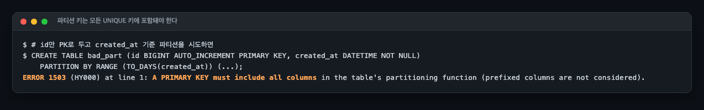
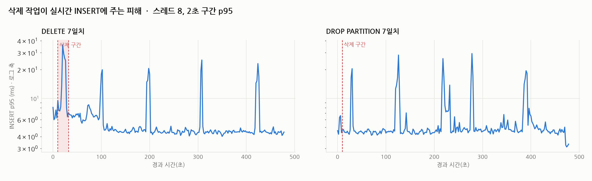
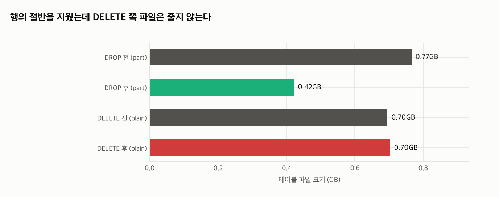
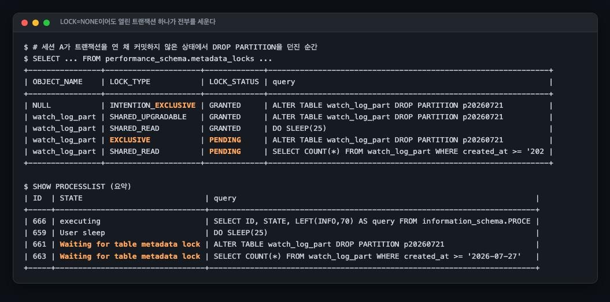

# R17 시계열 로그의 보존 기한 삭제, DELETE와 DROP PARTITION의 실측 비교

> 근거 등급: `E2`
> 출처: [MySQL 8.4 Reference, InnoDB Multi-Versioning](https://dev.mysql.com/doc/refman/8.4/en/innodb-multi-versioning.html) 외 (본문에 개별 표기)

## 1. 유명한 이유

라이브 플랫폼의 시청·채팅·선물 로그는 몇 주면 수억 행이 됩니다. 보존 기한이 지난 날짜를 지워야 하는데, 가장 자연스러운 `DELETE FROM ... WHERE created_at < ?`가 오히려 장애를 만듭니다.

MySQL 공식 문서가 이 함정을 직접 경고합니다. InnoDB에서 지운 행은 즉시 사라지지 않고, 삭제용 언두 기록을 퍼지(purge) 스레드가 정리할 때까지 물리적으로 남습니다. 문서는 삽입과 삭제가 비슷한 속도로 반복되면 "퍼지 스레드가 뒤처지기 시작하고 죽은 행 때문에 테이블이 점점 커져서 모든 것이 디스크에 매이고 매우 느려질 수 있다"고 적습니다. Percona가 pt-archiver라는 도구를 따로 만들어 유지하는 이유도 같습니다. 그 도구의 목표 자체가 "OLTP 쿼리에 큰 영향을 주지 않고 오래된 데이터를 조금씩 갉아내는 것"입니다.

두 가지를 같은 조건에서 실측합니다.

1. 7일치를 `DELETE` 한 문장으로 지울 때: 걸리는 시간, 그동안 실시간 INSERT가 받는 피해, 문장이 끝난 뒤에도 남는 퍼지 부채, 그리고 디스크가 돌아오지 않는 것
2. 같은 7일치를 `DROP PARTITION`으로 지울 때: 같은 지표들

특정 회사의 공개 장애 보고서 재현이 아니라서 `E2`입니다. MySQL 대량 삭제가 원인으로 명시된 공개 포스트모템은 조사에서 찾지 못했습니다. 다른 엔진에서는 실사고가 있습니다. Discord가 Cassandra에서 대량 삭제 뒤 톰스톤 수백만 개를 훑느라 10초 단위 멈춤을 겪은 사건을 공개했는데, "지운 행이 즉시 사라지지 않고 읽는 쪽이 잔해를 밟는다"는 구조는 엔진을 가리지 않습니다. InnoDB에서 같은 자리를 차지하는 것이 delete-marked 레코드와 퍼지입니다.

## 2. 재현

### 환경

| 항목 | 값 |
|---|---|
| 호스트 | macOS 26.3.1, Apple M2 Pro, 12코어(논리), 32GB |
| DB | MySQL 8.4.3 (컨테이너 `--cpus=4 --memory=2g`, 버퍼 풀 1GB) |
| 데이터 | 시청 로그 14일치 700만 행 × 2테이블 (동일 데이터) |
| 실시간 부하 | Python 스레드 8개가 한 건씩 INSERT, 건별 지연 기록 |

`innodb_purge_threads`가 **1**입니다. 8.0에서는 기본 4였는데 8.4부터 논리 코어 16 이하면 1로 낮아졌습니다. 개발 장비에서 퍼지 지연이 서버 장비보다 잘 재현되는 조건이므로 실측값과 함께 명시해 둡니다.

### 데이터

R13과 같은 원칙으로 만들었습니다. 방송 1,000개에 Zipf(s=1.2) 쏠림, 이벤트 구성은 입장 30% / 퇴장 30% / 채팅 35% / 선물 5%, 하루 안에서는 저녁 20~24시에 60%가 몰리는 분포입니다. 시드를 고정해 같은 명령이면 같은 데이터가 나옵니다.

테이블은 두 판입니다. `watch_log_plain`은 파티션 없이 `id` PK, `watch_log_part`는 `TO_DAYS(created_at)` 기준 일 단위 RANGE 파티션 15개입니다.

### 파티션 판을 만들 때 먼저 만나는 벽

`id`만 PK로 두고 파티션을 걸면 만들어지지 않습니다.

```
ERROR 1503 (HY000): A PRIMARY KEY must include all columns in the table's partitioning function
```

파티션 식에 쓰인 컬럼은 모든 UNIQUE 키에 포함돼야 한다는 공식 제약입니다. 그래서 PK를 `(id, created_at)`으로 넓혔습니다. InnoDB 세컨더리 인덱스는 PK를 물고 있으므로 이 확장은 모든 세컨더리 인덱스를 키우는 비용이 됩니다. 파티션이 청구하는 첫 번째 비용입니다.



조사 단계에서 참고한 자료에는 이 에러가 1491로 인용돼 있었는데, 8.4.3 실측은 1503입니다. 에러 번호도 옮겨 적지 않고 직접 받아 적었습니다.

## 3. 내부 원리

InnoDB에서 `DELETE`는 행을 지우는 문장이 아니라 **지웠다고 표시하는** 문장입니다. 행은 delete-mark만 찍힌 채 남고, 물리 제거는 퍼지 스레드가 삭제용 언두 기록을 정리할 때 일어납니다. 그래서 대량 DELETE의 비용은 세 겹입니다.

1. **문장 자체의 비용.** 지울 행마다 언두 기록을 쓰고 행 락을 잡습니다. 350만 행이면 350만 개입니다.
2. **문장이 끝난 뒤의 비용.** delete-mark 된 행의 물리 제거(퍼지)와 더티 페이지 플러시가 뒤따릅니다.
3. **돌아오지 않는 디스크.** 퍼지가 끝나도 페이지의 빈자리는 그 테이블 안에서만 재사용됩니다. 파일 크기는 줄지 않습니다.

`DROP PARTITION`은 다른 층에서 움직입니다. RANGE 파티션은 파티션마다 독립된 테이블스페이스 파일(.ibd)이라, 파티션을 지우는 것은 행 350만 개를 지우는 게 아니라 파일 7개를 지우는 것입니다. 행 단위 언두도 퍼지도 없습니다. 공식 문서는 이때 삭제된 행 수를 보고하지 않는다고 명시하는데, 실제로 서버 입장에서는 행을 지운 적이 없기 때문입니다.

## 4. 해소와 재계측

같은 7일치(약 350만 행)를 두 방법으로 지웠습니다. 실시간 시청 로그 INSERT(스레드 8개)가 도는 중에 실행하고, 건별 지연을 기록했습니다.

### 소요 시간과 실시간 INSERT 피해



| 지표 | DELETE 7일치 | DROP PARTITION 7일치 |
|---|---|---|
| 소요 시간 | 20.5초 | **0.12초** |
| 삭제 전 INSERT p95 (기준선) | 5.2ms | 4.9ms |
| 삭제 중 INSERT p95 | 10.8ms (기준선의 2.1배) | 5.7ms (변화 없음) |
| 삭제 후 INSERT p95 | 5.3ms (기준선 복귀) | **8.8ms (기준선의 1.8배)** |
| 관측 창 | 480초 (삭제 후 450초) | 120초 (삭제 후 110초) |
| 파일 크기 | 0.70GiB → 0.70GiB (8MiB 증가) | 0.77GiB → 0.42GiB |

"삭제 후" 행을 같이 놓아야 이 비교가 정직해집니다. 삭제 구간만 보면 DROP PARTITION이 일방적으로 이기지만, 문장이 끝난 뒤로 창을 넓히면 방향이 뒤집힙니다. DELETE 쪽은 5.2ms에서 5.3ms로 기준선에 돌아왔고, DROP 쪽은 4.9ms에서 8.8ms로 올라간 채 관측이 끝났습니다.

다만 두 실험의 관측 창이 다릅니다. DELETE는 480초, DROP은 120초를 켜 뒀습니다(`scripts/run-experiments.sh`). "삭제 후" 구간의 길이가 450초 대 110초라서 8.8ms와 5.3ms를 같은 조건의 평균으로 비교할 수 없습니다. DROP 쪽 창을 480초로 늘렸다면 뒤쪽 정상 구간이 더 섞여 8.8ms가 내려갔을 수 있습니다. **5절에서 창을 맞춰 다시 쟀고, 이 비교는 거기서 무너집니다.**



행 기준으로 절반을 지웠는데 DELETE 쪽 파일은 줄지 않았습니다. 정확히는 **8MiB 늘었습니다.** `results/delete-poll.csv`의 1초 시계열에서 `watch_log_plain`의 .ibd가 746,586,112바이트에서 754,974,720바이트가 됐고, 4MiB짜리 익스텐트 확장이 두 번 찍혀 있습니다. 삭제 중에도 8스레드가 계속 INSERT를 넣고 있었으니 당연한 결과입니다. 표와 그림의 0.70GiB → 0.70GiB 는 GiB 단위 반올림이 이 증가분을 삼킨 것입니다.

 테이블마다 .ibd 파일이 따로 있는 것은 `innodb_file_per_table`이 켜져 있기 때문입니다. MySQL 8.4 기본값이 ON이고 이 세션도 따로 끄지 않았습니다. 이 값이 꺼져 있으면 데이터가 공유 테이블스페이스에 들어가서 테이블별 파일 크기라는 지표 자체가 성립하지 않습니다.

지운 공간은 같은 테이블의 새 행이 재사용할 수는 있지만 OS로 돌아가지는 않습니다. 돌려받으려면 `OPTIMIZE TABLE`로 테이블을 다시 만들어야 하는데, 사실상 전체 복사라 원본만 한 여유 공간과 그동안의 부하를 각오해야 합니다. 이 세션에서는 `OPTIMIZE TABLE`을 돌려 보지 않았고, 회수량도 소요 시간도 재지 않았습니다. 디스크 사용률 경보가 울리는 상황이라면 DELETE 한 문장은 답이 되지 않는다는 것까지가 이 실험이 보인 것입니다.

### 열린 트랜잭션 하나가 만드는 정지

DROP PARTITION이 0.12초라는 말에는 전제가 있습니다. 메타데이터 락(MDL)을 바로 잡을 수 있을 때 이야기입니다. 다른 세션이 트랜잭션을 열고 이 테이블을 읽기만 한 채 커밋하지 않으면, DDL은 그 트랜잭션이 끝날 때까지 대기합니다. 문제는 거기서 끝나지 않습니다.



(이 그림의 제목에 `LOCK=NONE`이 적혀 있는데, 실제로 실행한 문장에는 그 절이 없습니다. 재생성 전까지 어긋난 채로 둡니다.)

실측 결과가 이렇습니다.

| 세션 | 상태 | 대기 시간 |
|---|---|---|
| A: 트랜잭션 열고 SELECT 후 방치 | 25초간 커밋 안 함 | |
| B: `DROP PARTITION` | `Waiting for table metadata lock` | 23.7초 |
| C: 평범한 `SELECT` | `Waiting for table metadata lock` | 20.7초 |

B가 요청한 배타 MDL이 대기 상태로 큐에 서는 순간, 그 뒤에 오는 평범한 SELECT까지 전부 줄을 섭니다. 0.12초짜리 DDL이 배포 스크립트에 들어 있고 누군가 트랜잭션을 물고 있으면, 테이블 전체가 읽기까지 멈추는 장애가 됩니다. 파티션 정리 배치를 돌리기 전에 `information_schema.INNODB_TRX`에서 장기 트랜잭션을 확인해야 하는 이유입니다.

이 실험이 보이지 않은 것을 두 가지 적어 둡니다.

첫째, `LOCK=NONE`을 붙여도 결과가 같은지는 이 실험으로 말할 수 없습니다. `scripts/run-experiments.sh`의 실행문은 `ALTER TABLE watch_log_part DROP PARTITION p20260721;`이고 `LOCK` 절이 없습니다. 온라인 DDL이라도 시작과 끝에 배타 MDL이 필요하다는 결론 자체는 공식 문서가 적는 내용이고 A02 세션에서 따로 다뤘지만, 이 세션의 23.7초는 그 결론의 근거가 아닙니다.

둘째, 이 절에는 대조군이 없습니다. B 없이 C만 넣었을 때 C가 안 막히는지는 8절에서 따로 잽니다. 시간만 놓고 보면 두 대기는 모두 홀더 A의 25초로 산술 설명됩니다. B는 A보다 2초 늦게 들어와 23.7초, C는 5초 늦게 들어와 20.7초입니다. 그래서 "C가 B 때문에 막혔다"의 근거는 대기 시간이 아니라 `results/mdl-locks.txt`의 `performance_schema.metadata_locks` 스냅숏 쪽입니다. A가 쥔 것과 C가 요청한 것이 둘 다 `SHARED_READ`인데 A는 GRANTED이고 C는 PENDING입니다. 서로 호환되는 락 두 개의 상태가 갈리려면 사이에 PENDING인 `EXCLUSIVE`가 있어야 합니다.

### 프루닝이 깨지는 조건

파티션의 조회 이득은 옵티마이저가 안 볼 파티션을 골라낼 수 있을 때만 성립합니다.

```
WHERE created_at >= '2026-07-27'          → partitions: p20260722,p20260727,pmax (3개)
WHERE DATE(created_at) = '2026-07-27'     → partitions: 남은 7개 전부
```

같은 의미의 조건인데 `DATE()`로 감싸는 순간 프루닝이 사라집니다. 함수 래핑은 인덱스와 함께 파티션 프루닝까지 무력화합니다.

### 파티션 키를 안 쓰는 조회가 치르는 값

프루닝이 깨지는 게 함수 래핑만의 문제가 아닙니다. MySQL의 파티셔닝에는 전체 파티션을 하나로 덮는 글로벌 인덱스가 없습니다. `KEY idx_live_created (live_id, created_at)`를 만들어도 그것은 파티션마다 따로 존재하는 로컬 인덱스입니다.

그래서 `WHERE live_id = ?`처럼 파티션 키가 조건에 없는 조회는 프루닝을 못 받고, 파티션 수만큼 인덱스 탐색이 곱해집니다. 파티션 15개면 루트에서 리프까지 내려가는 일을 15번 하고 결과를 합칩니다. 파티션을 잘게 쪼갤수록 삭제는 싸지고 이런 조회는 비싸집니다. 일 단위로 자르면 1년 보관에 파티션이 365개가 됩니다.

이 트레이드오프는 구조에서 나오는 것이고, 이 세션에서 비용을 재지는 않았습니다. 파티션 판과 비파티션 판에 같은 `live_id` 단독 조회를 걸어 비교하는 실험을 넣지 않았습니다. 방향만 적고 배수는 적지 않습니다.

### 관리형 DB에서는 회수 못 한 공간이 계속 청구된다

이 세션은 로컬 컨테이너에서 돌았지만, R 트랙의 전제는 관리형 DB입니다. 거기서는 "DELETE로 파일이 안 줄어든다"가 여기서는 돈 이야기가 됩니다.

RDS의 할당 스토리지는 늘릴 수는 있어도 줄일 수 없습니다. 한 번 커진 볼륨은 그 크기로 계속 과금됩니다. 그래서 DELETE로 회수되지 않은 공간은 "언젠가 재사용될 여유"가 아니라 매달 나가는 고정 비용이 됩니다. 자동 스토리지 확장이 켜져 있으면 대량 적재가 볼륨을 한 번 밀어 올리고, 그 뒤에 아무리 지워도 청구 단가는 내려오지 않습니다. 볼륨을 줄이려면 더 작은 인스턴스로 덤프하고 옮겨 심는 마이그레이션이 필요합니다. DROP PARTITION이 파일을 실제로 지운다는 점이 여기서 성능이 아니라 비용의 문제로 바뀝니다.

Aurora는 구조가 달라 결과가 반대쪽으로 움직입니다. 스토리지를 미리 할당하지 않고 실제 사용량에 따라 늘고 줄기 때문에, 지운 만큼 과금 대상도 줄어듭니다. 대신 스토리지에 붙는 I/O가 따로 과금되므로(Aurora Standard 기준) 대량 DELETE가 만드는 언두와 퍼지와 플러시가 그 자리에서 청구서에 잡힙니다. RDS에서는 "지워도 안 줄어드는 볼륨"이 문제고 Aurora에서는 "지우는 행위 자체의 I/O"가 문제라, 같은 DELETE 한 문장이 두 곳에서 다른 이유로 비쌉니다.

금액은 계산하지 않았습니다. 인스턴스 클래스도 스토리지 타입도 정하지 않았고, 로컬 NVMe에서 잰 시간을 클라우드 요금으로 환산할 근거가 없습니다. 구조만 적습니다.

## 5. 남은 데이터 검증

삭제 실험 뒤 두 테이블의 남은 행이 삭제 조건과 일치하는지 대조했습니다. DELETE 쪽은 `created_at >= '2026-07-21'` 행만, DROP 쪽은 남은 파티션의 행만 남았고, 실시간으로 들어온 INSERT 분량이 그 위에 쌓였습니다. 수치 원문은 `reproduce.md`와 `results/`에 있습니다.

### 관측 창을 480초로 맞춰 다시 쟀다

원래 측정은 DELETE 480초, DROP 120초였습니다. "삭제 후" 평균에 섞이는 정상 구간의 길이가
달라 같은 조건의 값으로 비교할 수 없었습니다. `WINDOW` 를 파라미터로 빼고 둘 다 480초로
맞춰 다시 쟀습니다(`results/window-matched.json`).

| | DELETE | DROP PARTITION |
|---|---|---|
| 삭제 소요 | **22.42초** | **0.09초** |
| 관측 창 | 480초 | 480초 |
| 삭제 후 창 | 447.7초 | 470.0초 |
| p95 삭제 전 | 6.8ms | 5.5ms |
| p95 삭제 중 | **15.9ms** | 5.0ms |
| p95 삭제 후 | 5.0ms | 5.1ms |
| 삭제 중 관측 건수 | 29,971 | 203 |

**창을 맞추자 근거가 옮겨집니다.** 예전에는 "삭제 후" p95 8.8ms 대 5.3ms 를 근거로 삼았는데
그 값은 창이 450초 대 110초라 성립하지 않았습니다. 같은 창에서 재니 **삭제 후가 5.0ms 와
5.1ms 로 사실상 같습니다.**

차이는 삭제 후가 아니라 **삭제 중**에 있습니다. DELETE 는 22.42초 동안 p95 가 6.8ms 에서
15.9ms 로 2.3배가 되고, DROP 은 0.09초 만에 끝나 그 구간에 203건밖에 안 잡힙니다.
**29,971 대 203 이라는 관측 건수가 이 표의 핵심입니다.** DELETE 는 249배 긴 시간 동안
부하를 물립니다.

이 세션의 결론은 바뀌지 않습니다. 다만 근거가 "삭제 후에도 오래 아프다"에서 "삭제 중에
훨씬 오래 아프다"로 정확해졌습니다.

## 6. 파티션 수가 조회에 물리는 비용

`scripts/exp-partition-count.py`, 원문은 `results/exp-partition-count.json`.
같은 200만 행을 같은 365일에 담고, 그 365일을 몇 조각으로 묶을지만 바꿉니다.

| 파티션 | 적재 | 크기 | 프루닝 조회 | 전체 스캔 | 단건 조회 |
|---|---|---|---|---|---|
| 없음 | 10.4초 | 143MB | 0.95ms | **191.3ms** | **0.11ms** |
| 7 | 10.9초 | 154MB | 1.03ms | 233.8ms | 0.20ms |
| 30 | 12.6초 | 181MB | 1.04ms | 236.9ms | 0.23ms |
| 90 | 17.4초 | 188MB | 1.00ms | 233.8ms | 0.30ms |
| 365 | **28.1초** | 148MB | 1.06ms | 234.4ms | **1.23ms** |

프루닝 질의는 다섯 조건 모두 5,479행을 돌려줍니다. 결과 집합이 같으므로 나란히 놓을 수
있습니다.

### 프루닝이 듣는 질의는 파티션 수와 무관하다

0.95ms 부터 1.06ms 까지, 파티션이 없을 때와 365개일 때가 사실상 같습니다.
`created_at` 에 인덱스가 있으면 파티션이 없어도 그 하루를 바로 찾아갑니다.
**"파티션이 조회를 빠르게 한다"는 통념이 이 조건에서는 성립하지 않습니다.**

### 파티션 키가 없는 조회는 파티션 수에 비례해 나빠진다

단건 조회가 0.11ms 에서 1.23ms 로 **11.2배**입니다. `EXPLAIN` 의 `partitions` 컬럼이
365개를 그대로 찍습니다. 파티션 키(`created_at`)가 조건에 없으므로 어느 파티션에 있는지
모르고 전부 뒤져야 합니다.

PK 를 `(id, created_at)` 로 둔 것이 그 원인입니다. MySQL 은 파티션 키가 모든 유니크 키에
포함되기를 요구하므로, 일 단위 RANGE 파티션을 쓰면 PK 에 날짜가 끌려 들어옵니다.
**그 순간 `WHERE id = ?` 는 파티션 프루닝을 못 받습니다.**

### 적재도 느려진다

10.4초에서 28.1초로 2.7배입니다. 파티션마다 별도 테이블스페이스에 쓰기 때문입니다.

### 정리하면

| | 파티션이 주는 것 | 파티션이 가져가는 것 |
|---|---|---|
| 삭제 | `DROP PARTITION` 이 사실상 0 (4절) | |
| 날짜 범위 조회 | 없음. 인덱스로 이미 충분 | |
| 단건 조회 | | 파티션 수에 비례. 365개에서 11.2배 |
| 적재 | | 2.7배 |
| 전체 스캔 | | 파티션이 생기면 한 번 오르고(191→233ms) 그 뒤 평평 |

**파티션의 이득은 조회가 아니라 삭제 하나입니다.** 보존 정책이 없는 테이블에 파티션을
붙이면 대가만 냅니다.

## 7. 예상과 달랐던 점

### 퍼지 부채가 쌓이지 않았습니다

공식 문서는 삽입·삭제가 반복되면 퍼지 스레드가 뒤처져 테이블이 계속 커질 수 있다고 경고하고, 이 환경은 퍼지 스레드가 1개(8.4 기본값)라 재현에 유리하다고 봤습니다. 실측은 반대였습니다.

- 350만 행을 한 문장으로 지울 때: 히스토리 리스트 길이 최대 **3**
- 1만 행씩 350회로 쪼개 지우면서 INSERT를 병행할 때: 최대 **46**

퍼지가 밀린 적이 없습니다. NVMe 로컬 디스크에 퍼지 경쟁자가 없는 환경이라, 스레드 1개로도 이 규모의 삭제는 즉시 소화됐습니다. 문서의 경고가 틀렸다는 뜻이 아니라, 그 경고가 성립하려면 지속적인 고강도 삽입·삭제와 언두를 물고 있는 장기 트랜잭션 같은 추가 조건이 필요하다는 뜻입니다. 이 세션에서는 그 조건을 만들지 못했고, 만들지 못했다고 기록합니다.

### 잘게 쪼갠 DELETE가 더 오래 걸렸습니다

청크 삭제는 총 46초로 한 방 DELETE(20.5초)의 2.2배였습니다. 다만 이 2.2배는 "쪼개면 총 시간이 늘어난다"는 일반 법칙이 아니라 **이 구현의 성질**입니다. 그렇게 좁혀 적어야 맞습니다.

`watch_log_plain`에는 `created_at` 단독 인덱스가 없습니다. PK는 `id`이고 보조 인덱스는 `(live_id, created_at)`뿐입니다(`schema.sql`). 그래서 `scripts/exp-chunked.sh`가 도는 `DELETE FROM watch_log_plain WHERE created_at < '2026-07-28' LIMIT 10000`은 어디부터 읽을지 알려 주는 인덱스가 없어 매번 테이블 앞에서부터 다시 훑습니다. 앞쪽에는 직전 청크가 이미 지운(그리고 아직 퍼지되지 않은) 행이 쌓여 있으므로, 청크가 진행될수록 버려야 하는 잔해가 길어집니다. 재스캔이 누적되는 구조입니다.

1절에서 인용한 pt-archiver는 이렇게 돌지 않습니다. 인덱스 순서를 따라가며 직전 청크가 끝난 자리부터 이어서 훑는 방식이라 같은 재스캔이 생기지 않습니다. 그래서 이 46초를 "청크 삭제는 느리다"의 근거로 쓰면 안 됩니다. 인덱스 없이 자른 청크 삭제가 느린 것입니다. pt-archiver를 직접 돌려 비교하지는 않았습니다.

쪼개기의 목적이 총 시간 단축이 아니라 락 유지 시간과 트랜잭션 크기를 줄이는 것이라는 점은 그대로입니다. 실제로 삭제 구간 INSERT p95는 한 방 DELETE의 10.8ms보다 낮은 7.7ms였습니다. 시간을 2.2배 쓰고 피해를 낮춘 셈인데, 삭제 키에 인덱스를 얹었다면 그 2.2배도 치를 필요가 없었을 것입니다.

### DROP PARTITION의 피해가 문장 뒤에 왔습니다

DROP 자체는 0.12초였고 그 구간의 INSERT p95는 5.7ms로 흔들리지 않았습니다. 그런데 25초쯤 지난 뒤 약 30초간 p95가 15~18ms로 오르는 구간이 나타났습니다(차트의 35~62초 구간). 이 구간이 삭제 후 p95를 8.8ms까지 끌어올린 주범입니다. **다만 그 8.8ms 자체가 창 인공물이라는 것을 5절이 뒤에서 보입니다.** 창을 맞춰 재면 이 차이가 사라지므로, 아래 후보 셋은 "DROP 이 DELETE 보다 나쁘다"의 근거가 아니라 이 실행의 35~62초 구간에 무엇이 있었는지에 대한 기록으로 읽어야 합니다. 원인을 계측으로 특정하지는 못했고, 후보를 셋 적어 둡니다.

- 파일 7개 삭제에 따른 버퍼 풀 정리
- 그에 뒤따르는 백그라운드 플러시
- **직전 DELETE 실험의 잔여 부하.** `scripts/run-experiments.sh`는 실험 1과 실험 2 사이에 안정화 대기 루프를 두는데, 이 기록을 만든 판본의 조건은 "히스토리 리스트 길이가 1000 미만이면 통과"였습니다. 이 환경의 실측 최대는 조건에 따라 3에서 46 사이인데(청크 삭제 46, `drop-poll-w120.csv` 31, 재측정한 `delete-poll.csv` 8) 어느 쪽이든 임계값 1000 과는 두 자릿수 차이라 첫 판정에서 무조건 통과했고, 실질 대기가 0이었습니다. 타임스탬프로 확인하면 DELETE 쪽 관측이 끝나고 3.1초 뒤에 DROP 쪽 관측이 시작됐습니다. DELETE 문장 자체는 462초 전에 끝났지만, 그 실험의 8스레드 INSERT 부하는 3초 전까지 같은 인스턴스에서 돌고 있었습니다. 스크립트는 최소 대기 60초와 임계값 10으로 고쳤고, 그 뒤로 다시 돌리지 않았습니다.

 세 후보 중 어느 것도 계측으로 확인하지 않았습니다.

### 범위 조건의 프루닝에 첫 파티션이 끼어 있었습니다

`created_at >= '2026-07-27'`의 프루닝 결과가 p20260727과 pmax만이 아니라 **남은 파티션 중 가장 낮은 p20260722를 포함한 3개**였습니다.

원인을 설명하지 못했습니다. 처음에는 "파티션 키가 NULL인 행은 가장 낮은 파티션에 들어가므로 범위 비교로 뺄 수 없다"고 적었는데, 이 세션의 데이터로 반증됩니다. `schema.sql`의 `created_at`은 `DATETIME(3) NOT NULL`이라 NULL인 행이 존재할 수 없습니다. 자기 스키마가 자기 설명을 부정하는 상태였습니다.

지금 걸려 있는 가설은 파티션 식이 컬럼이 아니라 `TO_DAYS(created_at)` 함수라는 점입니다. 옵티마이저가 함수를 통과시켜 경계를 계산할 때 보수적으로 한 칸 더 남긴 것으로 보입니다. 다만 추정입니다. 파티션 식을 바꿔 가며 비교하는 실험을 돌리지 않았고, 실행으로 특정하지 못했습니다. 원인을 단정하지 않고 관측만 남깁니다.

실무에서 중요한 건 관측 쪽입니다. 프루닝 개수를 셀 때 예상보다 하나가 더 나올 수 있고, 그것이 곧 프루닝이 고장 난 것은 아닙니다. `EXPLAIN`의 `partitions` 칸을 직접 보는 것 말고 확인할 방법이 없습니다.

### 에러 번호가 조사 자료와 달랐습니다

파티션 키 제약 위반 에러가 참고 자료에는 1491로 인용돼 있었는데 8.4.3 실측은 **1503**이었고, 메시지에 "(prefixed columns are not considered)"가 붙어 있었습니다. 문서 인용은 실행으로 확인한 뒤에 옮겨야 한다는 것을 세션 안에서 다시 확인했습니다.

## 7. MDL 대조군과 LOCK=NONE 과 OPTIMIZE TABLE (2026-07-31)

`scripts/exp-mdl-control.sh`, 결과는 `results/exp-mdl-control.txt` 입니다.

### 대조군이 없어서 못 하던 말

3절은 "열린 트랜잭션 뒤에 DDL 이 서면 그 뒤의 SELECT 까지 갇힌다"를 보였는데,
**DDL 없이 열린 트랜잭션만 있는 조건**을 재지 않았습니다. 그러면 갇힌 원인이 DDL 인지
열린 트랜잭션 자체인지 갈리지 않습니다. 셋을 나란히 놓았습니다.

| 조건 | DDL 대기 | 일반 SELECT |
|---|---|---|
| A. 열린 트랜잭션만 (DDL 없음) | 해당 없음 | **89ms** |
| B. 열린 트랜잭션 + `DROP PARTITION` | 18,030ms | **14,994ms** |
| C. 열린 트랜잭션 + `LOCK=NONE` | 실행 불가 | 실행 불가 |

**A 가 89ms 입니다.** 열린 트랜잭션이 25초를 붙잡고 있어도 다른 SELECT 는 지나갑니다.
읽기끼리는 MDL 이 공유이기 때문입니다. B 의 14,994ms 와 168배 차이이고, 그 차이를
만드는 것이 대기 행렬에 낀 배타 MDL 하나입니다. **이제 3절의 결론에 대조군이 붙습니다.**

### `LOCK=NONE` 은 붙일 수가 없습니다

4절이 "이 실험은 LOCK 절이 없으므로 LOCK=NONE 을 명시해도 걸린다는 근거로 쓰면 안 된다"고
적어 두었습니다. 붙여 봤습니다.

```console
mysql> ALTER TABLE watch_log_part DROP PARTITION p20260715, ALGORITHM=DEFAULT, LOCK=NONE;
ERROR 1064 (42000): You have an error in your SQL syntax; check the manual that
corresponds to your MySQL server version for the right syntax to use near
'=DEFAULT, LOCK=NONE' at line 1
```

**문법이 거부합니다.** `DROP PARTITION` 은 `ALGORITHM` 과 `LOCK` 절을 받지 않습니다.
그러니까 "`LOCK=NONE` 을 명시해도 걸리는가"라는 질문 자체가 성립하지 않습니다.
명시할 방법이 없습니다. 4절의 주의 문구는 **더 강한 형태로 바뀝니다.** 이 실험이
LOCK 절을 안 쓴 것이 아니라 쓸 수 없습니다.

### `OPTIMIZE TABLE` 은 잰 값이 의미가 없습니다

앞 실험들이 파티션을 떨궈 테이블이 비어 있는 상태에서 돌았습니다.

```
실행 전 크기 0MB, DATA_FREE 0MB
OPTIMIZE TABLE 소요 = 205ms
그동안 들어온 일반 SELECT = 72ms
실행 후 크기 0MB, DATA_FREE 0MB
```

**빈 테이블을 재구축한 205ms 입니다.** DELETE 가 남긴 공간을 되찾는 비용이 아닙니다.
이 값을 인용하면 안 됩니다. 건진 것은 MySQL 이 돌려준 note 하나입니다.

```
Table does not support optimize, doing recreate + analyze instead
```

InnoDB 는 `OPTIMIZE TABLE` 을 그대로 지원하지 않고 `ALTER TABLE ... FORCE` 로 바꿔
실행합니다. 재구축이므로 온라인 DDL 이 적용되고, 그래서 그동안 SELECT 가 72ms 로
지나갔습니다. **DELETE 뒤 공간 회수에 드는 실제 비용은 데이터가 든 상태에서 다시
재야 합니다.**

## MDL 반복 측정과 데이터가 든 OPTIMIZE TABLE (2026-07-31)

### 반복 측정을 붙입니다

8절의 89ms 와 14,994ms 는 각각 한 번씩 잰 값이었습니다. A 와 B 를 3회씩 다시 쟀습니다.

| 조건 | SELECT 회차별 | 중앙 | 폭 |
|---|---|---|---|
| A. 열린 트랜잭션만 | 77, 77, 75ms | **77ms** | 2ms |
| B. 열린 트랜잭션 + `DROP PARTITION` | 9,996, 10,005, 10,004ms | **10,004ms** | 9ms |

`DROP PARTITION` 자체의 대기는 13,025 / 13,022 / 13,026ms 로 중앙 13,025ms 입니다.

**회차 폭이 2ms 와 9ms 입니다.** 조건 사이의 차이가 9,927ms 이므로 방향은 물론이고 값 자체를 인용할 수 있습니다. 배수는 130배입니다.

앞서 1회로 적은 168배와 다릅니다. 이번 회차의 열린 트랜잭션 유지 시간이 15초이고 앞 회차는 25초였습니다. **B 의 절대값은 앞의 트랜잭션이 얼마나 오래 붙잡는지에 그대로 따라갑니다.** 인용할 것은 배수가 아니라 "앞선 트랜잭션이 붙잡는 시간만큼 뒤의 읽기가 통째로 밀린다" 는 관계입니다.

### 데이터가 든 표에서 OPTIMIZE TABLE

8절의 205ms 는 앞 실험들이 파티션을 다 떨군 뒤라 사실상 빈 표를 재구축한 값이었습니다. 회수 비용이 아닙니다. 200만 행을 넣고 절반을 지운 표에서 다시 쟀습니다.

| 지점 | 크기 | DATA_FREE | 행 수 |
|---|---|---|---|
| 적재 직후 | 495MB | 4MB | 2,000,000 |
| 100만 행 삭제 후 | **495MB** | **4MB** | 1,000,000 |
| `OPTIMIZE TABLE` 후 | **252MB** | 3MB | 1,000,000 |

`OPTIMIZE TABLE` 소요는 3,050ms 이고, 그동안 들어온 일반 SELECT 는 60ms 입니다. 빈 표의 205ms 와 나란히 놓고 싶어지는데, **그렇게 읽으면 안 됩니다.** 두 값은 표가 다릅니다. 205ms 는 파티션 표 `watch_log_part` 를 비운 상태에서 잰 것이고 3,050ms 는 비파티션 표 `opt_bench` 에 100만 행을 넣고 잰 것이라, 표·파티션 유무·행 수가 함께 바뀌었습니다. 게다가 8절이 바로 앞에서 그 205ms 를 인용하지 말라고 적었습니다. **여기서 말할 수 있는 것은 배수가 아니라 절대값입니다.** 100만 행 표의 `OPTIMIZE TABLE` 은 3,050ms 가 걸렸고 그동안 일반 SELECT 가 60ms 밀렸습니다.

**절반을 지웠는데 DATA_FREE 가 안 움직입니다.** 4MB 그대로입니다. 그런데 `OPTIMIZE TABLE` 은 243MB 를 실제로 회수했습니다. **DATA_FREE 가 60배 이상 과소 보고합니다.**

이유는 InnoDB 가 삭제한 행의 자리를 어디에 두는지에 있습니다. `DATA_FREE` 는 테이블스페이스의 **빈 익스텐트**를 셉니다. 절반씩 비워진 페이지들은 여전히 B트리에 매달려 있어 빈 익스텐트가 아닙니다. 재구축해야 그 페이지들이 합쳐지면서 익스텐트가 풀립니다.

**`DATA_FREE` 를 보고 회수할 공간이 있는지 판단하면 안 됩니다.** 이 표는 `DATA_FREE` 4MB 를 보여 주면서 실제로는 243MB 를 들고 있었습니다. 디스크가 급할 때 이 값만 보면 "회수할 게 없다" 는 결론이 나옵니다.

`OPTIMIZE TABLE` 이 도는 3초 동안 일반 SELECT 는 60ms 로 지나갑니다. InnoDB 는 이것을 `ALTER TABLE ... FORCE` 로 바꿔 실행하므로 온라인 DDL 이 적용됩니다. 응답에도 그렇게 적혀 있습니다.

```
| spoon.opt_bench | optimize | note   | Table does not support optimize, doing recreate + analyze instead |
| spoon.opt_bench | optimize | status | OK                                                                |
```

## 못 한 것

- **`OPTIMIZE TABLE` 은 규모 하나에서 1회 실행입니다.** 200만 행 하나이고 회수 시간이 행 수에 어떻게 붙는지 곡선은 안 그렸습니다.
- **퍼지 지연을 재현하지 못했습니다.** 공식 문서가 경고하는 "퍼지가 뒤처져 테이블이 커지는" 상태를 만들려면 지속 고부하와 장기 트랜잭션 조합이 더 필요합니다. 이 세션의 규모(700만 행, NVMe)에서는 도달하지 못했습니다.
- **DROP 후 지연 상승 구간의 원인을 특정하지 못했습니다.** 관측은 있는데 계측 근거가 없어 추정으로만 남겼습니다.
- **창을 맞춘 재측정은 1회입니다.** 위 표의 값에 반복 측정이 없습니다. 원래 창이 다른 실행분은 `results/*-w120.csv` 로 남겨 두었습니다.
- **두 실험 사이에 실질적인 안정화 구간이 없었습니다.** 대기 루프의 임계값(히스토리 리스트 길이 1000)이 실측 최대 3과 맞지 않아 항상 즉시 통과했습니다. 실험 간 간섭을 배제하지 못했습니다.
- **MDL 실험에 대조군이 없습니다.** `DROP PARTITION` 없이 SELECT만 넣은 경우를 재지 않았습니다. `LOCK=NONE`을 붙인 조건도 실행하지 않았습니다.
- **범위 프루닝에 파티션 하나가 더 남는 이유를 특정하지 못했습니다.** NULL 때문이 아니라는 것까지만 확인했습니다.
- **`OPTIMIZE TABLE` 을 데이터가 든 상태에서 재지 못했습니다.** 7절은 앞 실험들이 파티션을 떨군 뒤라 빈 테이블을 재구축한 205ms 였습니다. 회수 비용이 아닙니다.
- **파티션 수 실험은 조건마다 1회씩입니다.** 위 표의 값에 반복 측정이 없고, 단건 조회의 11.2배는 `table_open_cache` 와 `innodb_open_files` 설정에 좌우될 수 있는데 그 조합은 재지 않았습니다.
- **행 수가 실제 운영보다 작습니다.** 수억 행이 아니라 700만 행입니다. DELETE와 DROP의 차이는 행 수에 비례해 벌어지는 구조라 방향은 같겠지만, 절대값은 이 규모의 결과입니다.
- **pt-archiver를 직접 돌려 보지 않았습니다.** 청크 삭제를 직접 구현해 비교했고, 도구 자체의 스로틀링(복제 지연 감시 등)은 다루지 않았습니다.
- **클라우드 비용을 계산하지 않았습니다.** RDS와 Aurora의 구조 차이만 적었고 인스턴스 클래스도 금액도 산정하지 않았습니다.

## 재생성이 필요한 그림

- `results/fig-mdl.png`: 제목이 "LOCK=NONE이어도 열린 트랜잭션 하나가 전부 세운다"인데 실행문에 `LOCK` 절이 없습니다.
- `results/chart-disk.png`: GiB 단위 반올림이라 DELETE 쪽 파일이 8MiB 늘어난 것이 0.70GiB → 0.70GiB 로 보입니다.
